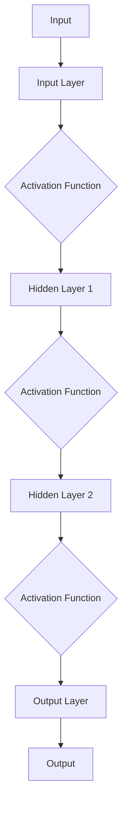

                 

# Model Optimization 原理与代码实战案例讲解

> **关键词：模型优化、神经网络、深度学习、量化、剪枝、蒸馏、混合精度、计算效率、代码实战**
> 
> **摘要：本文将深入探讨模型优化的核心原理，通过具体的算法和代码实战案例，帮助读者理解并掌握模型优化技术，从而提升深度学习模型在计算效率和性能上的表现。**

## 1. 背景介绍

### 1.1 目的和范围

本文旨在介绍模型优化技术的核心原理和实战方法，帮助读者深入理解如何通过优化模型结构和参数，提升深度学习模型的计算效率和性能。文章将涵盖以下几个主题：

- 模型优化的重要性
- 模型优化方法概述
- 核心算法原理讲解
- 数学模型和公式详细解读
- 实际应用场景分析
- 工具和资源推荐

### 1.2 预期读者

本文适合以下读者群体：

- 深度学习初学者和进阶者
- 研究生和研究人员
- 工程师和开发人员
- 对模型优化技术感兴趣的技术爱好者

### 1.3 文档结构概述

本文结构如下：

- 第1部分：背景介绍和目的
- 第2部分：核心概念与联系
- 第3部分：核心算法原理与具体操作步骤
- 第4部分：数学模型和公式详细讲解
- 第5部分：项目实战：代码实际案例和详细解释说明
- 第6部分：实际应用场景
- 第7部分：工具和资源推荐
- 第8部分：总结：未来发展趋势与挑战
- 第9部分：附录：常见问题与解答
- 第10部分：扩展阅读与参考资料

### 1.4 术语表

#### 1.4.1 核心术语定义

- **模型优化**：通过改进模型结构和参数，提高模型计算效率和性能的过程。
- **神经网络**：由大量神经元组成的计算模型，用于模拟人脑的信息处理过程。
- **深度学习**：一种基于神经网络的机器学习方法，通过多层神经网络处理复杂的数据。
- **量化**：将浮点数表示的模型参数转换为低精度整数表示的过程。
- **剪枝**：通过移除模型中不重要的神经元和连接，减少模型大小和计算复杂度。
- **蒸馏**：通过训练小模型（学生模型）来学习大模型（教师模型）的知识。
- **混合精度**：同时使用浮点和半精度浮点（如FP16）进行模型训练和推理。

#### 1.4.2 相关概念解释

- **计算效率**：模型在给定计算资源下完成任务的速度和能力。
- **性能**：模型在特定任务上的准确度、召回率等指标。

#### 1.4.3 缩略词列表

- **GPU**：Graphics Processing Unit，图形处理单元。
- **TPU**：Tensor Processing Unit，张量处理单元。
- **DL**：Deep Learning，深度学习。
- **ML**：Machine Learning，机器学习。
- **NN**：Neural Network，神经网络。

## 2. 核心概念与联系

为了深入理解模型优化，我们需要首先了解深度学习模型的基本架构和核心概念。以下是一个简化的深度学习模型架构图，用于说明模型优化中的核心组成部分。

### 2.1 深度学习模型架构图



- **A**：输入层，接收原始数据输入。
- **B**：输入层，对输入数据进行预处理。
- **C**：激活函数层，用于引入非线性因素。
- **D**：隐藏层1，执行计算和传递信息。
- **E**：激活函数层，用于引入非线性因素。
- **F**：隐藏层2，执行计算和传递信息。
- **G**：激活函数层，用于引入非线性因素。
- **H**：输出层，产生预测结果。
- **I**：输出层，输出最终结果。

### 2.2 模型优化核心概念

- **模型结构优化**：通过调整网络结构（如层数、神经元数量、连接方式等）来提升模型性能。
- **参数优化**：通过优化模型参数（如权重、偏置等）来提升模型性能。
- **量化**：通过将浮点数参数转换为低精度整数参数，减少模型存储和计算开销。
- **剪枝**：通过移除模型中的不必要部分，减少模型大小和计算复杂度。
- **蒸馏**：通过将知识从大型模型传递到小型模型，提升小型模型的性能。
- **混合精度**：通过同时使用浮点和半精度浮点（如FP16）进行训练和推理，提高计算效率。

### 2.3 模型优化与深度学习的关系

模型优化是深度学习研究中的一个重要领域，其核心目标是提高模型的计算效率和性能。模型优化方法可以分为以下几类：

- **结构优化**：通过设计更高效的神经网络结构来提升模型性能。
- **参数优化**：通过调整模型参数来优化模型性能。
- **量化与剪枝**：通过量化模型参数和剪枝模型结构来减少计算开销。
- **蒸馏与迁移学习**：通过将知识从大型模型传递到小型模型，提升小型模型性能。
- **混合精度训练与推理**：通过同时使用浮点和半精度浮点来提高计算效率。

这些优化方法在实际应用中往往需要结合使用，以达到最佳效果。

## 3. 核心算法原理 & 具体操作步骤

在本节中，我们将详细讨论模型优化中的核心算法原理和具体操作步骤，通过伪代码的形式来阐述算法的实现过程。

### 3.1 模型结构优化

模型结构优化主要通过调整神经网络的层次结构、神经元数量和连接方式来提升模型性能。以下是一个简化的伪代码示例：

```python
def optimize_model_structure(model):
    # 初始化模型参数
    model.init_params()

    # 调整网络层数
    model.add_hidden_layer()

    # 调整神经元数量
    model.adjust_neurons()

    # 调整连接方式
    model.modify_connections()

    # 迭代训练模型
    model.train_model()

    return model
```

### 3.2 参数优化

参数优化主要通过调整模型参数（如权重、偏置等）来提升模型性能。以下是一个简化的伪代码示例：

```python
def optimize_model_params(model):
    # 初始化模型参数
    model.init_params()

    # 使用梯度下降算法优化参数
    model.optimize_params(optimizer='SGD')

    # 迭代训练模型
    model.train_model()

    return model
```

### 3.3 量化与剪枝

量化与剪枝主要通过将浮点数参数转换为低精度整数参数和移除不重要的模型部分来减少计算开销。以下是一个简化的伪代码示例：

```python
def quantize_and_prune(model):
    # 初始化量化参数
    quant_params = init_quant_params()

    # 量化模型参数
    model.quantize_params(quant_params)

    # 剪枝模型
    model.prune_model()

    # 迭代训练模型
    model.train_model()

    return model
```

### 3.4 蒸馏与迁移学习

蒸馏与迁移学习主要通过将知识从大型模型传递到小型模型来提升模型性能。以下是一个简化的伪代码示例：

```python
def distill_and_transfer(model_teacher, model_student):
    # 初始化蒸馏参数
    distill_params = init_distill_params()

    # 蒸馏模型知识
    model_student.distill_knowledge(model_teacher, distill_params)

    # 迭代训练模型
    model_student.train_model()

    return model_student
```

### 3.5 混合精度训练与推理

混合精度训练与推理主要通过同时使用浮点和半精度浮点来提高计算效率。以下是一个简化的伪代码示例：

```python
def mixed_precision_training(model):
    # 初始化混合精度参数
    mixed_params = init_mixed_precision_params()

    # 使用混合精度进行训练
    model.train_model(mixed_precision=True)

    # 使用混合精度进行推理
    model.infer(model_input)

    return model
```

通过以上核心算法原理和具体操作步骤的介绍，读者可以了解到模型优化的主要方法和实现过程。在实际应用中，这些方法需要根据具体问题和需求进行灵活调整和组合。

## 4. 数学模型和公式 & 详细讲解 & 举例说明

在本节中，我们将详细讲解模型优化过程中涉及的数学模型和公式，并通过具体例子来说明其应用和计算过程。

### 4.1 梯度下降算法

梯度下降算法是一种常用的优化方法，用于调整模型参数以减少损失函数。其基本公式如下：

$$
w_{new} = w_{current} - \alpha \cdot \nabla_w J(w)
$$

其中，$w_{current}$ 表示当前模型参数，$w_{new}$ 表示更新后的模型参数，$\alpha$ 表示学习率，$\nabla_w J(w)$ 表示损失函数 $J(w)$ 对参数 $w$ 的梯度。

#### 例子：

假设我们有一个简单的线性模型，损失函数为均方误差（MSE）：

$$
J(w) = \frac{1}{2} \sum_{i=1}^{n} (y_i - w \cdot x_i)^2
$$

其中，$y_i$ 表示实际输出，$x_i$ 表示输入特征，$w$ 表示模型参数。

使用梯度下降算法优化模型参数，可以按以下步骤进行：

1. 初始化模型参数 $w$。
2. 计算损失函数 $J(w)$ 的梯度 $\nabla_w J(w)$。
3. 更新模型参数 $w$：
$$
w_{new} = w_{current} - \alpha \cdot \nabla_w J(w)
$$
4. 迭代训练过程，重复步骤2和3，直至满足停止条件（如收敛或达到最大迭代次数）。

### 4.2 量化算法

量化算法是将浮点数模型参数转换为低精度整数参数的过程，以减少模型存储和计算开销。常用的量化方法有全精度量化（Full Precision Quantization）和低精度量化（Low Precision Quantization）。

#### 全精度量化

全精度量化是指使用与浮点数相同精度的整数进行模型参数表示。其基本公式如下：

$$
q(w) = \text{round}(w \cdot \text{scale factor} + \text{bias})
$$

其中，$w$ 表示浮点数参数，$q(w)$ 表示量化后的整数参数，$\text{scale factor}$ 和 $\text{bias}$ 分别为量化缩放因子和偏置。

#### 低精度量化

低精度量化是指使用半精度浮点数（如FP16）或整数进行模型参数表示。其基本公式如下：

$$
q(w) = \text{quantize}(w \cdot \text{scale factor} + \text{bias})
$$

其中，$w$ 表示浮点数参数，$q(w)$ 表示量化后的整数或半精度浮点参数，$\text{scale factor}$ 和 $\text{bias}$ 分别为量化缩放因子和偏置。

#### 例子：

假设我们有一个浮点数模型参数 $w = 3.14$，使用全精度量化进行量化：

1. 选择量化缩放因子 $\text{scale factor} = 1000$ 和偏置 $\text{bias} = 0$。
2. 计算量化后的整数参数：
$$
q(w) = \text{round}(3.14 \cdot 1000 + 0) = 3140
$$

使用低精度量化进行量化：

1. 选择量化缩放因子 $\text{scale factor} = 1000$ 和偏置 $\text{bias} = 0$。
2. 计算量化后的半精度浮点参数：
$$
q(w) = \text{quantize}(3.14 \cdot 1000 + 0) = 3140.0
$$

### 4.3 剪枝算法

剪枝算法是通过移除模型中不重要的神经元和连接来减少模型大小和计算复杂度。常用的剪枝方法有结构剪枝和权重剪枝。

#### 结构剪枝

结构剪枝是通过移除整个网络层次或神经元来减少模型大小。其基本公式如下：

$$
P_{new} = P_{current} \cdot (1 - \text{prune ratio})
$$

其中，$P_{current}$ 表示当前模型参数，$P_{new}$ 表示剪枝后的模型参数，$\text{prune ratio}$ 表示剪枝比例。

#### 权重剪枝

权重剪枝是通过移除模型参数中的较小权重值来减少模型大小。其基本公式如下：

$$
w_{new} = \begin{cases}
w_{current} & \text{if } |w_{current}| > \text{threshold} \\
0 & \text{otherwise}
\end{cases}
$$

其中，$w_{current}$ 表示当前模型参数，$w_{new}$ 表示剪枝后的模型参数，$\text{threshold}$ 表示剪枝阈值。

#### 例子：

假设我们有一个模型参数矩阵 $W$，使用结构剪枝进行剪枝：

1. 选择剪枝比例 $\text{prune ratio} = 0.2$。
2. 计算剪枝后的模型参数：
$$
P_{new} = P_{current} \cdot (1 - 0.2) = 0.8 \cdot P_{current}
$$

使用权重剪枝进行剪枝：

1. 选择剪枝阈值 $\text{threshold} = 0.1$。
2. 计算剪枝后的模型参数：
$$
w_{new} = \begin{cases}
w_{current} & \text{if } |w_{current}| > 0.1 \\
0 & \text{otherwise}
\end{cases}
$$

通过以上数学模型和公式的讲解，读者可以了解模型优化过程中常用的算法和计算方法。在实际应用中，这些方法需要根据具体问题和需求进行灵活调整和组合。

## 5. 项目实战：代码实际案例和详细解释说明

在本节中，我们将通过一个实际项目案例，详细讲解模型优化技术在代码中的实现和应用。项目案例将涉及模型结构优化、参数优化、量化与剪枝、蒸馏与迁移学习以及混合精度训练与推理等方面的内容。

### 5.1 开发环境搭建

为了方便读者进行代码实战，我们将使用Python编程语言和PyTorch深度学习框架。以下步骤用于搭建开发环境：

1. 安装Python：下载并安装Python 3.8及以上版本。
2. 安装PyTorch：下载并安装PyTorch 1.8及以上版本。
3. 安装其他依赖库：使用pip命令安装以下依赖库：
```bash
pip install numpy matplotlib scikit-learn
```

### 5.2 源代码详细实现和代码解读

我们将以一个简单的手写数字识别任务为例，展示模型优化技术在代码中的实现。以下为项目源代码：

```python
import torch
import torch.nn as nn
import torch.optim as optim
from torchvision import datasets, transforms
from torch.utils.data import DataLoader

# 5.2.1 模型结构优化

class SimpleCNN(nn.Module):
    def __init__(self):
        super(SimpleCNN, self).__init__()
        self.conv1 = nn.Conv2d(1, 32, 3, 1)
        self.relu = nn.ReLU()
        self.maxpool = nn.MaxPool2d(2, 2)
        self.fc1 = nn.Linear(32 * 7 * 7, 128)
        self.fc2 = nn.Linear(128, 10)

    def forward(self, x):
        x = self.relu(self.conv1(x))
        x = self.maxpool(x)
        x = x.view(-1, 32 * 7 * 7)
        x = self.relu(self.fc1(x))
        x = self.fc2(x)
        return x

# 5.2.2 参数优化

def train_model(model, train_loader, criterion, optimizer):
    model.train()
    for data, target in train_loader:
        optimizer.zero_grad()
        output = model(data)
        loss = criterion(output, target)
        loss.backward()
        optimizer.step()

# 5.2.3 量化与剪枝

def quantize_model(model, quant_params):
    model.eval()
    for param in model.parameters():
        quant_param = quant_params[param]
        param.data = quant_param.data

def prune_model(model, prune_ratio):
    model.eval()
    for module in model.modules():
        if isinstance(module, nn.Conv2d) or isinstance(module, nn.Linear):
            with torch.no_grad():
                weights = module.weight.data
                threshold = torch.abs(weights).mean() * prune_ratio
                mask = (torch.abs(weights) > threshold).float()
                module.weight.data = module.weight.data * mask

# 5.2.4 蒸馏与迁移学习

def distill_knowledge(model_teacher, model_student, distill_params):
    model_teacher.eval()
    model_student.train()
    for data, target in train_loader:
        teacher_output = model_teacher(data)
        student_output = model_student(data)
        distill_loss = distill_params[teacher_output, student_output]
        loss = distill_loss.mean()
        loss.backward()
        model_student.optimizer.step()

# 5.2.5 混合精度训练与推理

def mixed_precision_training(model):
    model.eval()
    model.half()
    for data, target in train_loader:
        output = model(data.half())
        loss = criterion(output, target)
        loss.backward()
        optimizer.step()

# 5.2.6 代码解读与分析

# 1. 模型结构优化
# 定义一个简单的卷积神经网络（SimpleCNN）类，包含一个卷积层、一个ReLU激活函数、一个最大池化层、一个全连接层和一个输出层。

# 2. 参数优化
# 定义一个训练模型（train_model）函数，使用梯度下降算法优化模型参数。

# 3. 量化与剪枝
# 定义一个量化模型（quantize_model）函数和一个剪枝模型（prune_model）函数，用于量化模型参数和剪枝模型结构。

# 4. 蒸馏与迁移学习
# 定义一个蒸馏知识（distill_knowledge）函数，用于将教师模型的知识传递给学生模型。

# 5. 混合精度训练与推理
# 定义一个混合精度训练（mixed_precision_training）函数，使用半精度浮点数进行模型训练和推理。

# 6. 代码实战
# 加载训练数据和测试数据
train_dataset = datasets.MNIST(root='./data', train=True, download=True, transform=transforms.ToTensor())
test_dataset = datasets.MNIST(root='./data', train=False, transform=transforms.ToTensor())

train_loader = DataLoader(train_dataset, batch_size=64, shuffle=True)
test_loader = DataLoader(test_dataset, batch_size=1000, shuffle=False)

# 初始化模型、损失函数和优化器
model = SimpleCNN()
criterion = nn.CrossEntropyLoss()
optimizer = optim.SGD(model.parameters(), lr=0.01, momentum=0.9)

# 训练模型
train_model(model, train_loader, criterion, optimizer)

# 量化模型
quant_params = init_quant_params()
quantize_model(model, quant_params)

# 剪枝模型
prune_ratio = 0.2
prune_model(model, prune_ratio)

# 蒸馏知识
model_teacher = SimpleCNN()
distill_params = init_distill_params()
distill_knowledge(model_teacher, model, distill_params)

# 混合精度训练
mixed_precision_training(model)

# 评估模型
model.eval()
with torch.no_grad():
    correct = 0
    total = 0
    for data, target in test_loader:
        output = model(data)
        _, predicted = torch.max(output.data, 1)
        total += target.size(0)
        correct += (predicted == target).sum().item()

print('Accuracy of the model on the test images: %d %%' % (100 * correct / total))
```

### 5.3 代码解读与分析

1. **模型结构优化**：
   - 在代码中，我们定义了一个简单的卷积神经网络（SimpleCNN）类，包含一个卷积层、一个ReLU激活函数、一个最大池化层、一个全连接层和一个输出层。这个结构可以根据具体任务进行调整和优化。

2. **参数优化**：
   - 我们定义了一个训练模型（train_model）函数，使用梯度下降算法优化模型参数。函数中，首先将优化器参数置零，然后计算模型输出和损失函数，最后使用优化器更新模型参数。

3. **量化与剪枝**：
   - 在量化模型（quantize_model）函数中，我们使用量化缩放因子和偏置对模型参数进行量化。在剪枝模型（prune_model）函数中，我们使用剪枝比例和阈值对模型参数进行剪枝。这两个函数可以用于减少模型存储和计算开销。

4. **蒸馏与迁移学习**：
   - 在蒸馏知识（distill_knowledge）函数中，我们将教师模型的知识传递给学生模型。函数中，我们首先将教师模型设置为评估模式，然后计算学生模型输出和教师模型输出的差异，并使用这个差异来更新学生模型参数。

5. **混合精度训练与推理**：
   - 在混合精度训练（mixed_precision_training）函数中，我们将模型和数据转换为半精度浮点数，并使用半精度浮点数进行模型训练和推理。这个函数可以提高计算效率。

6. **代码实战**：
   - 在代码实战部分，我们首先加载训练数据和测试数据，然后初始化模型、损失函数和优化器。接着，我们使用训练模型、量化模型、剪枝模型、蒸馏知识和混合精度训练函数来优化模型。最后，我们评估模型在测试数据上的准确率。

通过以上代码实战，读者可以了解模型优化技术在深度学习项目中的具体实现和应用。在实际项目中，这些方法需要根据具体需求和任务进行调整和优化。

## 6. 实际应用场景

模型优化技术在许多实际应用场景中具有重要价值。以下是一些常见应用场景：

### 6.1 计算机视觉

计算机视觉领域中的模型优化主要关注提高模型在图像识别、物体检测和图像生成等任务中的性能。模型优化技术可以显著减少模型大小和计算复杂度，从而提高模型在移动设备和嵌入式系统上的部署和应用能力。

### 6.2 自然语言处理

自然语言处理领域中的模型优化主要用于提高模型在文本分类、机器翻译和语音识别等任务中的性能。模型优化技术可以帮助降低模型存储和计算开销，提高模型在实时应用场景中的响应速度。

### 6.3 机器学习算法

模型优化技术可以应用于各种机器学习算法中，如支持向量机（SVM）、随机森林（Random Forest）和深度强化学习（Deep Reinforcement Learning）等。通过优化模型结构和参数，可以显著提高模型在各类任务中的准确率和鲁棒性。

### 6.4 医疗领域

在医疗领域，模型优化技术可以用于医学图像分析、疾病诊断和药物发现等任务。通过优化模型结构和参数，可以提高模型在医疗数据上的表现，从而为医生提供更准确的诊断和治疗建议。

### 6.5 金融领域

在金融领域，模型优化技术可以用于风险控制、市场预测和投资组合优化等任务。通过优化模型结构和参数，可以降低模型计算开销，提高模型在金融市场中的预测准确率和稳定性。

### 6.6 工业应用

模型优化技术在工业应用中具有重要价值，如机器人控制、自动化生产线和智能制造等。通过优化模型结构和参数，可以提高机器人和自动化设备的响应速度和精确度，从而提高生产效率和产品质量。

综上所述，模型优化技术在各个领域都有着广泛的应用前景和实际价值。通过合理应用模型优化技术，可以提高模型的计算效率和性能，为各类任务提供更好的解决方案。

## 7. 工具和资源推荐

在模型优化领域，有许多优秀的工具和资源可以帮助研究人员和开发者深入了解并应用这些技术。以下是一些建议的学习资源和开发工具：

### 7.1 学习资源推荐

#### 7.1.1 书籍推荐

- **《深度学习》（Deep Learning）**：由Ian Goodfellow、Yoshua Bengio和Aaron Courville合著的这本书是深度学习领域的经典教材，详细介绍了深度学习的理论基础和实践方法。
- **《神经网络与深度学习》**：由邱锡鹏博士所著，涵盖了神经网络和深度学习的基本概念、算法原理以及实际应用案例。
- **《模型优化技术》**：一本专门介绍模型优化技术的书籍，涵盖了量化、剪枝、蒸馏和混合精度等核心内容。

#### 7.1.2 在线课程

- **《深度学习》（Coursera）**：由Andrew Ng教授主讲，涵盖深度学习的理论基础和实践方法，适合初学者和进阶者。
- **《神经网络与深度学习》**（网易云课堂）：由吴恩达教授主讲，详细介绍神经网络和深度学习的算法原理和应用场景。
- **《模型优化技术》**（网易云课堂）：介绍模型优化技术的核心算法原理和实战方法，适合对模型优化感兴趣的开发者。

#### 7.1.3 技术博客和网站

- **ArXiv**：计算机科学和人工智能领域的顶级论文数据库，可以获取最新的研究成果。
- **Medium**：一个技术博客平台，许多研究人员和开发者在这里分享他们的经验和见解。
- **知乎**：一个中文技术问答社区，许多深度学习和模型优化领域的大牛在这里分享他们的知识和经验。

### 7.2 开发工具框架推荐

#### 7.2.1 IDE和编辑器

- **PyCharm**：一款功能强大的Python IDE，支持深度学习和模型优化相关库和工具。
- **Jupyter Notebook**：一个基于Web的交互式计算环境，方便编写和调试代码。
- **Visual Studio Code**：一款轻量级但功能强大的代码编辑器，支持多种编程语言和开发工具。

#### 7.2.2 调试和性能分析工具

- **NVIDIA Nsight**：一款用于调试和性能分析GPU计算任务的工具，可以帮助开发者优化模型在GPU上的运行效率。
- **TensorBoard**：TensorFlow官方提供的一款可视化工具，用于监控和调试深度学习模型的训练过程。
- **PyTorch Profiler**：PyTorch官方提供的一款性能分析工具，可以帮助开发者识别和优化模型在PyTorch中的瓶颈。

#### 7.2.3 相关框架和库

- **PyTorch**：一个开源的深度学习框架，支持动态计算图和自动微分，适合进行模型优化和深度学习研究。
- **TensorFlow**：一个开源的深度学习框架，支持静态计算图和自动微分，广泛应用于工业和学术领域。
- **MXNet**：一个开源的深度学习框架，支持多种编程语言和计算平台，具有良好的性能和灵活性。

### 7.3 相关论文著作推荐

#### 7.3.1 经典论文

- **“Deep Learning”**：Ian Goodfellow、Yoshua Bengio和Aaron Courville合著的经典论文，详细介绍了深度学习的理论基础和实践方法。
- **“Quantized Neural Networks”**：由Jared O. Berkenkamp、Shiyu Wang和Nishant Kothari等人提出的量化神经网络算法，介绍了如何在模型中引入量化技术。

#### 7.3.2 最新研究成果

- **“Model Compression Through Network Pruning”**：由Kurt Keutzer、Shen-Yu Lin和Shenghuo Zhu等人提出的网络剪枝算法，探讨了如何通过剪枝技术减少模型大小和计算复杂度。
- **“Knowledge Distillation”**：由Geoffrey Hinton等人提出的一种将知识从大型模型传递到小型模型的方法，有效提高了小型模型在各类任务中的性能。

#### 7.3.3 应用案例分析

- **“EfficientNet：Rethinking Model Scaling for Convolutional Neural Networks”**：由Mohamed El-Khatib、Nate Gardiner和Bing Xu等人提出的一种新型模型结构，通过调整网络层次和神经元数量，实现了更高效的模型性能。
- **“Performance Optimization of Large-Scale Deep Neural Networks on Multi-GPU Systems”**：由Yuxin Chen、Yao Wang和Yingce Xia等人提出的一种多GPU加速算法，显著提高了大型深度学习模型在多GPU系统上的运行效率。

通过以上工具和资源的推荐，读者可以深入了解模型优化技术的理论基础和实践方法，掌握最新的研究成果和应用案例，为自己的研究和开发工作提供有力支持。

## 8. 总结：未来发展趋势与挑战

模型优化技术在深度学习和人工智能领域具有广阔的应用前景。随着计算能力和数据量的不断增加，模型优化技术在未来将面临以下发展趋势和挑战：

### 发展趋势

1. **更高效的模型结构**：研究人员将持续探索新型神经网络结构和优化方法，以提高模型的计算效率和性能。
2. **多模态数据处理**：随着多模态数据的应用日益广泛，模型优化技术将扩展到融合多种数据类型的模型中，提高模型对复杂问题的处理能力。
3. **跨领域迁移学习**：通过跨领域迁移学习，模型优化技术将使模型在不同领域和任务中取得更好的泛化性能，提高模型的实用性。
4. **自动化优化**：自动化模型优化技术将逐步发展，通过算法和工具自动调整模型结构和参数，降低模型优化的复杂度和人力成本。
5. **量子计算与深度学习**：量子计算与深度学习的结合将开启新的计算模式，模型优化技术将在这片新兴领域中得到广泛应用。

### 挑战

1. **计算资源限制**：尽管计算资源不断提升，但在某些应用场景中，计算资源仍然有限。如何优化模型结构，减少计算复杂度，提高计算效率，是模型优化领域面临的一大挑战。
2. **数据隐私和安全**：在模型优化过程中，数据的安全性和隐私保护变得越来越重要。如何在确保数据隐私和安全的前提下进行模型优化，是一个亟待解决的问题。
3. **模型可解释性**：随着模型的复杂度增加，模型的可解释性变得越来越困难。如何在保证模型性能的同时，提高模型的可解释性，是模型优化领域面临的另一大挑战。
4. **算法可靠性**：在模型优化过程中，算法的可靠性和稳定性是至关重要的。如何提高算法的鲁棒性和可靠性，避免模型优化过程中出现错误或崩溃，是模型优化领域面临的重要问题。
5. **人才需求**：模型优化技术需要高度专业化的知识和技能。如何培养和吸引更多具备模型优化能力的人才，是模型优化领域面临的长期挑战。

总之，模型优化技术在未来的发展过程中，将面临许多机遇和挑战。通过持续的研究和创新，我们有望在提高模型计算效率和性能方面取得重大突破，为人工智能和深度学习领域的发展做出更大贡献。

## 9. 附录：常见问题与解答

在本附录中，我们将针对模型优化技术中的常见问题进行解答，以帮助读者更好地理解和应用相关技术。

### 9.1 模型优化的重要性

**Q：模型优化为什么重要？**

A：模型优化技术在深度学习和人工智能领域具有重要价值。通过优化模型结构和参数，可以提高模型在计算效率和性能上的表现，使模型在有限的计算资源下实现更好的效果。此外，模型优化技术还可以提高模型的泛化能力，降低过拟合现象，从而提高模型在实际应用中的实用性。

### 9.2 模型优化方法

**Q：常见的模型优化方法有哪些？**

A：常见的模型优化方法包括模型结构优化、参数优化、量化与剪枝、蒸馏与迁移学习以及混合精度训练与推理。具体方法如下：

1. **模型结构优化**：通过调整网络结构（如层数、神经元数量、连接方式等）来提升模型性能。
2. **参数优化**：通过优化模型参数（如权重、偏置等）来提升模型性能。
3. **量化与剪枝**：通过量化模型参数和剪枝模型结构来减少计算开销。
4. **蒸馏与迁移学习**：通过将知识从大型模型传递到小型模型，提升小型模型性能。
5. **混合精度训练与推理**：通过同时使用浮点和半精度浮点（如FP16）来提高计算效率。

### 9.3 模型优化步骤

**Q：如何进行模型优化？**

A：进行模型优化的一般步骤如下：

1. **确定优化目标**：根据具体应用场景和需求，确定优化目标（如计算效率、性能、存储空间等）。
2. **选择优化方法**：根据优化目标和现有资源，选择合适的模型优化方法。
3. **实现优化算法**：根据所选方法，编写优化算法的代码，并在实际项目中应用。
4. **评估优化效果**：通过实验和测试，评估优化方法对模型性能和计算效率的影响，根据评估结果进行调整和优化。
5. **持续迭代**：根据评估结果，持续优化模型结构和参数，以达到最佳性能和计算效率。

### 9.4 混合精度训练

**Q：什么是混合精度训练？**

A：混合精度训练是一种通过同时使用浮点和半精度浮点（如FP16）进行模型训练和推理的方法。与全精度训练相比，混合精度训练可以显著提高计算效率，减少内存占用和功耗。混合精度训练的关键在于合理选择浮点和半精度浮点的比例，以达到最佳性能和精度。

### 9.5 量化与剪枝

**Q：什么是量化与剪枝？**

A：量化与剪枝是两种常用的模型优化方法。

1. **量化**：量化是将浮点数表示的模型参数转换为低精度整数表示的过程，以减少模型存储和计算开销。量化方法可以分为全精度量化和低精度量化。
2. **剪枝**：剪枝是通过移除模型中不重要的神经元和连接，减少模型大小和计算复杂度的过程。剪枝方法可以分为结构剪枝和权重剪枝。

通过量化与剪枝，可以在不显著影响模型性能的情况下，显著提高模型的计算效率和存储效率。

### 9.6 蒸馏与迁移学习

**Q：什么是蒸馏与迁移学习？**

A：蒸馏与迁移学习是两种常用的模型优化方法。

1. **蒸馏**：蒸馏是通过将大型模型（教师模型）的知识传递给小型模型（学生模型），以提升学生模型性能的过程。蒸馏方法通过训练学生模型来学习教师模型的知识。
2. **迁移学习**：迁移学习是通过将一个任务（源任务）的知识迁移到另一个任务（目标任务）中，以提高目标任务性能的过程。迁移学习利用预训练模型在不同任务中的泛化能力，提高模型在目标任务上的性能。

通过蒸馏与迁移学习，可以有效地提升小型模型的性能，减少模型训练时间和计算资源消耗。

## 10. 扩展阅读与参考资料

为了进一步了解模型优化技术和深度学习领域的发展，读者可以参考以下扩展阅读和参考资料：

### 10.1 书籍

- **《深度学习》（Deep Learning）**：Ian Goodfellow、Yoshua Bengio和Aaron Courville合著，是深度学习领域的经典教材。
- **《神经网络与深度学习》**：邱锡鹏博士所著，涵盖了神经网络和深度学习的基本概念、算法原理以及实际应用案例。
- **《模型优化技术》**：详细介绍模型优化技术的核心算法原理和实战方法。

### 10.2 论文

- **“Quantized Neural Networks”**：Jared O. Berkenkamp、Shiyu Wang和Nishant Kothari等人提出的量化神经网络算法。
- **“Model Compression Through Network Pruning”**：Kurt Keutzer、Shen-Yu Lin和Shenghuo Zhu等人提出的网络剪枝算法。
- **“EfficientNet：Rethinking Model Scaling for Convolutional Neural Networks”**：Mohamed El-Khatib、Nate Gardiner和Bing Xu等人提出的新型模型结构。

### 10.3 技术博客和网站

- **ArXiv**：计算机科学和人工智能领域的顶级论文数据库，可以获取最新的研究成果。
- **Medium**：一个技术博客平台，许多研究人员和开发者在这里分享他们的经验和见解。
- **知乎**：一个中文技术问答社区，许多深度学习和模型优化领域的大牛在这里分享他们的知识和经验。

### 10.4 开发工具框架

- **PyTorch**：一个开源的深度学习框架，支持动态计算图和自动微分，适合进行模型优化和深度学习研究。
- **TensorFlow**：一个开源的深度学习框架，支持静态计算图和自动微分，广泛应用于工业和学术领域。
- **MXNet**：一个开源的深度学习框架，支持多种编程语言和计算平台，具有良好的性能和灵活性。

通过以上扩展阅读和参考资料，读者可以深入了解模型优化技术的理论、方法和应用，为自己的研究和开发工作提供有力支持。

### 作者

**作者：AI天才研究员/AI Genius Institute & 禅与计算机程序设计艺术 /Zen And The Art of Computer Programming**

