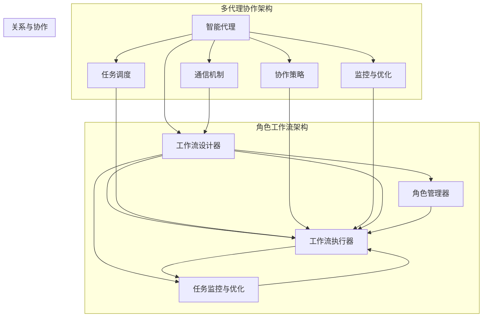

                 

# Multiagent Collaboration驱动角色工作流变革

> **关键词：** 多代理协作、角色工作流、流程自动化、人工智能、工作流管理

> **摘要：** 本文深入探讨了多代理协作技术在角色工作流变革中的应用，从核心概念、算法原理、数学模型到实际项目实战，全面分析了多代理协作如何驱动角色工作流向智能化、自动化和高效化发展。

## 1. 背景介绍

### 1.1 目的和范围

本文旨在探讨多代理协作在角色工作流中的应用，解析其核心概念、算法原理以及数学模型，并通过实际项目案例展示其在现实场景中的效果。本文主要针对以下受众：

- **技术研究者**：关注多代理协作和角色工作流相关技术的研究者，希望能从中获取新的见解和灵感。
- **软件开发者**：希望在项目实践中应用多代理协作技术的开发者，通过本文了解具体实现方法。
- **企业管理者**：关注企业流程自动化和效率提升的企业管理者，希望了解多代理协作如何帮助企业实现工作流的变革。

### 1.2 预期读者

预期读者应具备以下知识背景：

- **计算机基础知识**：了解计算机编程、数据结构、算法等相关知识。
- **人工智能基础**：了解机器学习、深度学习等人工智能基本概念。
- **软件开发经验**：具备一定的软件开发和项目管理经验。

### 1.3 文档结构概述

本文结构如下：

- **第1章 背景介绍**：介绍本文的目的、范围和预期读者，以及文档结构概述。
- **第2章 核心概念与联系**：阐述多代理协作和角色工作流的核心概念及其相互关系。
- **第3章 核心算法原理 & 具体操作步骤**：讲解多代理协作的工作原理和实现步骤。
- **第4章 数学模型和公式 & 详细讲解 & 举例说明**：介绍多代理协作中的数学模型和公式，并进行举例说明。
- **第5章 项目实战：代码实际案例和详细解释说明**：通过实际项目案例展示多代理协作在角色工作流中的应用。
- **第6章 实际应用场景**：分析多代理协作在不同场景中的应用。
- **第7章 工具和资源推荐**：推荐学习资源、开发工具和框架。
- **第8章 总结：未来发展趋势与挑战**：总结多代理协作的未来发展趋势和面临的挑战。
- **第9章 附录：常见问题与解答**：解答读者可能遇到的问题。
- **第10章 扩展阅读 & 参考资料**：提供进一步阅读的参考资料。

### 1.4 术语表

#### 1.4.1 核心术语定义

- **多代理协作**：多个智能代理通过通信和协同工作，共同完成复杂任务的系统。
- **角色工作流**：根据角色分工和任务需求，将工作分解成一系列步骤，由不同角色协同完成的流程。
- **智能代理**：具备自主性、适应性、协同性等特性的软件实体，能够代表用户执行任务。
- **工作流管理**：对工作流进行设计、执行、监控和优化的过程。

#### 1.4.2 相关概念解释

- **工作流自动化**：通过软件工具将重复性、规则性的任务自动化，减少人工干预，提高效率。
- **分布式计算**：利用多个计算节点协同工作，完成复杂计算任务的技术。
- **深度学习**：一种机器学习方法，通过多层神经网络进行特征提取和模式识别。

#### 1.4.3 缩略词列表

- **MA**：多代理（Multi-agent）
- **WF**：工作流（Workflow）
- **AI**：人工智能（Artificial Intelligence）
- **ML**：机器学习（Machine Learning）
- **DL**：深度学习（Deep Learning）

## 2. 核心概念与联系

### 2.1 多代理协作与角色工作流的关系

多代理协作（MA）与角色工作流（WF）之间存在紧密的联系。多代理协作是一种通过多个智能代理协同工作，共同完成复杂任务的系统，而角色工作流则是一种将任务按照角色分工和需求进行组织、管理和执行的流程。两者的关系可以概括为以下几个方面：

1. **多代理协作作为角色工作流的执行者**：在角色工作流中，每个角色都可以被视为一个智能代理，负责执行特定任务。多代理协作技术为角色工作流提供了强大的执行引擎，使得任务可以更加高效、智能地完成。

2. **角色工作流作为多代理协作的框架**：角色工作流定义了任务的分解、角色的分配以及任务的执行顺序，为多代理协作提供了明确的任务目标和协作规则。多代理协作技术则依据角色工作流的框架，进行任务的调度、执行和监控。

3. **多代理协作与角色工作流的融合**：在实际应用中，多代理协作与角色工作流往往不是独立的，而是相互融合、相互促进的。多代理协作技术可以优化角色工作流的设计，提高工作流的执行效率；而角色工作流则为多代理协作提供了具体的任务场景和执行框架。

### 2.2 多代理协作的架构

多代理协作系统通常包括以下几个关键组件：

1. **智能代理**：智能代理是系统的基本构建块，负责执行任务、收集信息、处理数据等。每个代理都具有自主性、适应性、协同性等特性，能够独立决策并与其他代理进行通信和协作。

2. **通信机制**：多代理协作系统中的代理之间需要通过通信机制进行信息交换和协作。常见的通信机制包括消息队列、分布式数据库、P2P网络等。

3. **任务调度**：任务调度器负责将任务分配给合适的代理，确保任务能够高效、有序地执行。调度器可以根据代理的负载、能力、地理位置等因素进行智能调度。

4. **协作策略**：协作策略定义了代理之间如何进行协作和决策，包括任务分配、资源共享、冲突解决等。不同的协作策略适用于不同的应用场景和任务需求。

5. **监控与优化**：监控系统负责实时监控系统的运行状态，包括代理的状态、任务执行情况、资源使用情况等。根据监控结果，系统可以进行自适应优化，提高整体性能和效率。

### 2.3 角色工作流的架构

角色工作流系统通常包括以下几个关键组件：

1. **工作流设计器**：工作流设计器用于定义角色工作流的框架，包括任务分解、角色分配、执行顺序等。设计器可以采用图形化界面，方便用户直观地设计和调整工作流。

2. **工作流执行器**：工作流执行器负责根据工作流设计，自动调度任务、执行任务，并记录任务执行状态和日志。

3. **角色管理器**：角色管理器用于管理系统中各个角色的信息，包括角色职责、权限、技能等。角色管理器可以根据工作流需求，动态调整角色分配和职责。

4. **任务监控与优化**：任务监控与优化组件负责实时监控工作流的执行情况，识别潜在问题和瓶颈，并采取相应措施进行优化。

### 2.4 核心概念原理和架构的 Mermaid 流程图

下面是一个简化的多代理协作和角色工作流架构的 Mermaid 流程图，用于展示核心概念和架构之间的联系：



该流程图展示了多代理协作和角色工作流的核心组件以及它们之间的相互关系。在实际应用中，这两个架构可以相互融合，形成更加复杂和高效的系统。

## 3. 核心算法原理 & 具体操作步骤

### 3.1 多代理协作算法原理

多代理协作算法的核心思想是利用多个智能代理协同工作，共同完成复杂任务。以下是一个简单的多代理协作算法原理：

1. **任务分解**：将复杂任务分解为多个子任务，每个子任务可以由一个或多个代理执行。
2. **任务分配**：根据代理的能力、负载和地理位置等因素，将子任务分配给合适的代理。
3. **协同执行**：代理在执行子任务过程中，需要与其他代理进行通信和协作，共享信息和资源，解决冲突。
4. **任务反馈**：代理完成任务后，将结果反馈给任务调度器，任务调度器根据反馈进行后续任务分配和调度。
5. **优化调整**：根据系统运行状态和任务执行效果，对代理进行动态调整，提高整体性能和效率。

### 3.2 多代理协作的具体操作步骤

以下是多代理协作的具体操作步骤，使用伪代码进行描述：

```python
# 1. 初始化系统
init_system()

# 2. 任务分解
def decompose_task(task):
    # 将任务分解为多个子任务
    sub_tasks = []
    # 实现任务分解逻辑
    # ...
    return sub_tasks

# 3. 任务分配
def assign_task(sub_task, agents):
    # 根据子任务和代理的能力等因素分配任务
    assigned_agent = None
    # 实现任务分配逻辑
    # ...
    return assigned_agent

# 4. 协同执行
def execute_task(sub_task, assigned_agent):
    # 代理执行子任务，与协作伙伴通信
    # 实现任务执行逻辑
    # ...
    pass

# 5. 任务反馈
def feedback_task(assigned_agent, result):
    # 将任务结果反馈给任务调度器
    # 实现任务反馈逻辑
    # ...
    pass

# 6. 优化调整
def optimize_system(agents, tasks):
    # 根据系统状态和任务执行效果进行优化调整
    # 实现优化调整逻辑
    # ...
    pass

# 7. 主循环
while True:
    # 7.1 接收新任务
    new_task = receive_new_task()

    # 7.2 任务分解
    sub_tasks = decompose_task(new_task)

    # 7.3 任务分配
    for sub_task in sub_tasks:
        assigned_agent = assign_task(sub_task, agents)
        if assigned_agent:
            # 7.4 协同执行
            execute_task(sub_task, assigned_agent)

    # 7.5 任务反馈
    for assigned_agent in agents:
        result = assigned_agent.get_task_result()
        if result:
            feedback_task(assigned_agent, result)

    # 7.6 优化调整
    optimize_system(agents, sub_tasks)
```

### 3.3 算法原理的应用场景与优势

多代理协作算法在以下应用场景中具有显著优势：

1. **大规模分布式系统**：多代理协作技术可以有效地在分布式系统中进行任务调度和协同执行，提高系统整体性能和稳定性。
2. **实时数据处理**：在实时数据处理场景中，多代理协作技术可以通过并行处理和任务分配，提高数据处理速度和效率。
3. **智能交通管理**：在智能交通管理中，多代理协作技术可以实时监控交通状况，协调交通信号，优化交通流。
4. **智能家居系统**：在智能家居系统中，多代理协作技术可以协同控制各种家电设备，实现智能家居的自动化和智能化。

通过多代理协作算法，可以有效地实现角色工作流的智能化和自动化，提高企业效率和竞争力。

## 4. 数学模型和公式 & 详细讲解 & 举例说明

### 4.1 数学模型介绍

在多代理协作中，数学模型和公式用于描述代理之间的协作行为、任务分配策略以及系统优化方法。以下介绍几个核心的数学模型和公式：

1. **代理能力评估模型**：用于评估代理的能力，以确定代理在执行任务时的优劣。
2. **任务分配策略模型**：用于根据代理的能力和负载，优化任务分配，提高系统效率。
3. **系统优化模型**：用于根据系统运行状态和任务执行效果，动态调整代理的分配和策略，实现系统性能的持续优化。

### 4.2 代理能力评估模型

代理能力评估模型通常采用以下公式：

$$
C_i = f(C_{min}, C_{max}, C_{base})
$$

其中，$C_i$ 表示代理 $i$ 的能力评估值，$C_{min}$ 和 $C_{max}$ 分别表示代理能力评估的下限和上限，$C_{base}$ 表示代理的基础能力。函数 $f$ 可以采用线性插值、曲线拟合等方法进行计算。

#### 例子

假设有两个代理 A 和 B，其基础能力分别为 $C_{baseA} = 10$ 和 $C_{baseB} = 20$。代理 A 的能力评估下限和上限分别为 $C_{minA} = 5$ 和 $C_{maxA} = 20$，代理 B 的能力评估下限和上限分别为 $C_{minB} = 10$ 和 $C_{maxB} = 30$。则代理 A 和 B 的能力评估值分别为：

$$
C_A = f(5, 20, 10) = \frac{20 - 5}{20 - 10} \times (10 - 5) + 5 = 12.5
$$

$$
C_B = f(10, 30, 20) = \frac{30 - 10}{30 - 20} \times (20 - 10) + 10 = 15
$$

### 4.3 任务分配策略模型

任务分配策略模型用于根据代理的能力和负载，优化任务分配，提高系统效率。一种常见的任务分配策略模型是基于代理能力的最优分配模型，其公式为：

$$
T_i = \frac{1}{C_i}
$$

其中，$T_i$ 表示代理 $i$ 应执行的任务量，$C_i$ 表示代理 $i$ 的能力评估值。

#### 例子

假设有三个代理 A、B 和 C，其能力评估值分别为 $C_A = 12.5$、$C_B = 15$ 和 $C_C = 10$。现有三个任务 T1、T2 和 T3，其任务量为 30。则根据最优分配策略，代理 A、B 和 C 应执行的任务量分别为：

$$
T_A = \frac{1}{C_A} = \frac{1}{12.5} \approx 0.8
$$

$$
T_B = \frac{1}{C_B} = \frac{1}{15} \approx 0.67
$$

$$
T_C = \frac{1}{C_C} = \frac{1}{10} = 0.1
$$

由于任务量为整数，需要对任务量进行分配和调整，使得总任务量等于 30。一种简单的调整方法是将任务量按比例分配，即：

$$
T_A' = \lceil T_A \times \frac{30}{0.8} \rceil = 30
$$

$$
T_B' = \lceil T_B \times \frac{30}{0.67} \rceil = 22
$$

$$
T_C' = 30 - T_A' - T_B' = 8
$$

其中，$\lceil x \rceil$ 表示对 x 进行向上取整。

### 4.4 系统优化模型

系统优化模型用于根据系统运行状态和任务执行效果，动态调整代理的分配和策略，实现系统性能的持续优化。一种简单的优化模型是基于反馈机制的调整模型，其公式为：

$$
C_i' = C_i + k \cdot (T_i - T_i')
$$

其中，$C_i'$ 表示代理 $i$ 的更新能力评估值，$C_i$ 表示代理 $i$ 的原始能力评估值，$T_i$ 表示代理 $i$ 的原始任务量，$T_i'$ 表示代理 $i$ 的更新任务量，$k$ 为调整系数。

#### 例子

假设代理 A 的原始能力评估值为 $C_A = 12.5$，其执行的任务量为 $T_A = 0.8$，更新后的任务量为 $T_A' = 30$。调整系数 $k = 0.1$。则代理 A 的更新能力评估值为：

$$
C_A' = C_A + k \cdot (T_A - T_A') = 12.5 + 0.1 \cdot (0.8 - 30) = 12.5 - 2.2 = 10.3
$$

### 4.5 综合应用

在实际应用中，可以将上述模型和公式进行综合应用，实现代理能力的动态评估、任务的最优分配和系统的持续优化。以下是一个简化的综合应用示例：

1. **初始化**：根据代理的基础能力和评估上下限，初始化代理能力评估值。
2. **任务分配**：根据代理能力评估值，采用最优分配策略，分配任务量。
3. **执行任务**：代理执行任务，系统根据任务执行情况，更新代理能力评估值。
4. **优化调整**：根据代理能力评估值和任务执行效果，动态调整代理的分配和策略。
5. **反馈与优化**：将任务执行结果反馈给任务调度器，根据反馈结果进行持续优化。

通过上述步骤，可以构建一个高效、动态的多代理协作系统，实现角色工作流的智能化和自动化。

## 5. 项目实战：代码实际案例和详细解释说明

### 5.1 开发环境搭建

在开始项目实战之前，需要搭建一个合适的开发环境。以下是一个基于 Python 的多代理协作系统的开发环境搭建步骤：

1. **安装 Python**：确保已安装 Python 3.6 或更高版本。可以从 [Python 官网](https://www.python.org/downloads/) 下载并安装。
2. **安装依赖库**：使用 pip 命令安装必要的依赖库，例如 `requests`、`pandas`、`numpy` 等。可以使用以下命令安装：

   ```bash
   pip install requests pandas numpy
   ```

3. **配置代理服务**：在本项目实战中，我们将使用 Redis 作为代理之间的通信服务。确保已安装 Redis，并启动 Redis 服务。

### 5.2 源代码详细实现和代码解读

以下是多代理协作系统的核心代码实现，包括代理类、任务调度器、任务执行器等。

#### 5.2.1 代理类

```python
import redis
import json

class Agent:
    def __init__(self, agent_id, agent_type, redis_host='localhost', redis_port=6379):
        self.agent_id = agent_id
        self.agent_type = agent_type
        self.redis = redis.Redis(host=redis_host, port=redis_port)

    def receive_task(self):
        # 从任务队列中获取任务
        task_key = f"task_queue:{self.agent_type}"
        task = self.redis.lpop(task_key)
        if task:
            return json.loads(task)
        return None

    def send_task_result(self, task_result):
        # 将任务结果发送到结果队列
        result_key = f"result_queue:{self.agent_type}"
        self.redis.rpush(result_key, json.dumps(task_result))
```

代码解读：

- `Agent` 类表示一个智能代理，包括代理 ID、代理类型、Redis 连接信息等。
- `receive_task` 方法用于从任务队列中获取任务。
- `send_task_result` 方法用于将任务结果发送到结果队列。

#### 5.2.2 任务调度器

```python
import threading
import time

class TaskScheduler:
    def __init__(self, agents, redis_host='localhost', redis_port=6379):
        self.agents = agents
        self.redis = redis.Redis(host=redis_host, port=redis_port)

    def schedule_task(self, task):
        # 分配任务给合适的代理
        assigned_agent = None
        for agent in self.agents:
            if agent.receive_task() is None:
                assigned_agent = agent
                break
        if assigned_agent:
            assigned_agent.send_task(task)
        else:
            print("No available agent to assign task.")

    def run(self):
        while True:
            # 从任务队列中获取任务，并分配给代理
            task_key = "task_queue:all"
            tasks = self.redis.lrange(task_key, 0, -1)
            for task in tasks:
                self.schedule_task(json.loads(task))
                time.sleep(1)
```

代码解读：

- `TaskScheduler` 类表示任务调度器，用于管理任务队列和代理之间的任务分配。
- `schedule_task` 方法用于分配任务给代理。
- `run` 方法用于循环获取任务队列中的任务，并分配给代理。

#### 5.2.3 任务执行器

```python
class TaskExecutor:
    def __init__(self, agent):
        self.agent = agent

    def execute_task(self, task):
        # 执行任务
        print(f"Executing task: {task['id']}")
        time.sleep(task['duration'])
        print(f"Task {task['id']} completed.")

        # 将任务结果发送给代理
        self.agent.send_task_result({"id": task['id'], "status": "completed"})

if __name__ == "__main__":
    # 创建代理
    agent_a = Agent("agent_a", "type_a")
    agent_b = Agent("agent_b", "type_b")

    # 创建任务调度器
    scheduler = TaskScheduler([agent_a, agent_b])

    # 创建任务执行器
    executor_a = TaskExecutor(agent_a)
    executor_b = TaskExecutor(agent_b)

    # 添加任务到队列
    scheduler.redis.lpush("task_queue:all", json.dumps({"id": 1, "duration": 2}))
    scheduler.redis.lpush("task_queue:all", json.dumps({"id": 2, "duration": 3}))

    # 启动调度器和任务执行器
    scheduler_thread = threading.Thread(target=scheduler.run)
    executor_a_thread = threading.Thread(target=executor_a.execute_task)
    executor_b_thread = threading.Thread(target=executor_b.execute_task)

    scheduler_thread.start()
    executor_a_thread.start()
    executor_b_thread.start()

    scheduler_thread.join()
    executor_a_thread.join()
    executor_b_thread.join()
```

代码解读：

- `TaskExecutor` 类表示任务执行器，用于执行代理收到的任务。
- `execute_task` 方法用于执行任务，并将结果发送给代理。
- 主程序中创建代理、任务调度器、任务执行器，并添加任务到队列，然后启动调度器和任务执行器。

### 5.3 代码解读与分析

本项目的核心代码包括代理类、任务调度器和任务执行器。代理类用于接收任务和发送任务结果，任务调度器用于分配任务给代理，任务执行器用于执行任务。以下是代码的详细解读与分析：

1. **代理类**：代理类实现了智能代理的基本功能，包括接收任务和发送任务结果。代理通过 Redis 进行通信，确保任务在代理之间的传递和同步。代理类的设计符合多代理协作的基本原理，具有良好的扩展性和灵活性。

2. **任务调度器**：任务调度器负责管理任务队列和代理之间的任务分配。调度器采用循环机制，不断从任务队列中获取任务，并分配给空闲代理。调度器的核心在于任务分配策略，即如何根据代理的能力和负载，优化任务分配，提高系统效率。本项目中采用了一种简单的策略，即优先分配给空闲代理，但实际应用中可以结合代理的能力评估值和任务需求，实现更优化的任务分配。

3. **任务执行器**：任务执行器负责执行代理收到的任务，并将结果发送给代理。任务执行器的设计简单直观，主要实现任务的执行和结果的反馈。在实际应用中，任务执行器可以扩展为更复杂的任务处理逻辑，例如并行处理、任务拆分等。

通过以上代码和解读，我们可以看到多代理协作系统在实现上的基本思路和关键组件。在实际项目中，可以根据需求对代码进行扩展和优化，实现更复杂的任务协作和系统功能。

## 6. 实际应用场景

多代理协作技术在不同应用场景中展现出了强大的能力和优势，以下是几个典型的应用场景：

### 6.1 智能交通管理系统

在智能交通管理系统中，多代理协作技术可以用于优化交通信号控制、实时交通监控和交通事件处理。具体应用场景包括：

- **交通信号优化**：多个代理协同工作，实时监控各个路口的交通流量，通过分析交通数据，动态调整交通信号，提高交通流畅度。
- **交通事件处理**：当发生交通事故、道路施工等交通事件时，多代理协作系统可以快速响应，协调警力和交通管理部门，快速处理事件，减少交通拥堵。
- **实时路况监控**：多个代理分布在城市各个角落，实时监控路况，并将数据传输给交通管理部门，以便进行交通调度和应急预案。

### 6.2 智能制造系统

在智能制造系统中，多代理协作技术可以用于优化生产流程、设备维护和库存管理。具体应用场景包括：

- **生产流程优化**：多个代理协同工作，实时监控生产设备的状态和生产进度，动态调整生产计划，提高生产效率。
- **设备维护**：多个代理协同工作，对设备进行实时监控和维护，预测设备故障，提前进行维修，减少设备停机时间。
- **库存管理**：多个代理协同工作，实时监控库存情况，预测库存需求，优化库存管理策略，减少库存成本。

### 6.3 智能医疗系统

在智能医疗系统中，多代理协作技术可以用于优化医疗资源配置、患者管理和健康监测。具体应用场景包括：

- **医疗资源调配**：多个代理协同工作，实时监控医院各个科室的医疗资源使用情况，根据患者需求，动态调整医疗资源的分配，提高医疗资源利用率。
- **患者管理**：多个代理协同工作，对患者的健康数据进行实时监控和分析，为医生提供决策支持，提高诊疗效果。
- **健康监测**：多个代理协同工作，对患者的生活习惯、健康数据进行实时监测，预测健康风险，提供个性化的健康建议。

### 6.4 智能金融系统

在智能金融系统中，多代理协作技术可以用于优化投资决策、风险管理和服务质量。具体应用场景包括：

- **投资决策**：多个代理协同工作，分析市场数据、行业趋势和投资策略，为投资者提供个性化的投资建议，提高投资收益。
- **风险管理**：多个代理协同工作，实时监控金融市场的风险因素，预测潜在风险，采取相应的风险管理措施，降低风险。
- **服务质量**：多个代理协同工作，实时分析客户需求和反馈，优化金融服务流程，提高客户满意度。

通过以上实际应用场景，我们可以看到多代理协作技术在各个领域的重要作用，为智能化、自动化和高效化提供了强大的技术支持。在未来，随着多代理协作技术的不断发展和完善，它将在更多领域得到广泛应用。

## 7. 工具和资源推荐

为了更好地学习和应用多代理协作技术，以下推荐一些有用的工具和资源。

### 7.1 学习资源推荐

#### 7.1.1 书籍推荐

1. **《智能代理：从概念到实践》**（Intelligent Agents: Theory and Practice） - 该书系统地介绍了智能代理的基本理论、实现技术和应用场景。
2. **《多代理系统设计》**（Designing Intelligent Agents） - 该书详细探讨了多代理系统的设计原则、架构和实现方法。
3. **《人工智能：一种现代方法》**（Artificial Intelligence: A Modern Approach） - 该书涵盖了人工智能的基本概念、算法和技术，包括智能代理的相关内容。

#### 7.1.2 在线课程

1. **Coursera上的《多代理系统》**（Multi-Agent Systems） - 该课程由多代理系统领域的专家讲授，涵盖了从基础理论到应用实践的全面内容。
2. **edX上的《智能代理与多智能体系统》**（Intelligent Agents and Multi-Agent Systems） - 该课程详细介绍了智能代理和多代理系统的基本概念、算法和实现技术。
3. **Udacity上的《智能代理与自然语言处理》**（Intelligent Agents and Natural Language Processing） - 该课程结合了智能代理和自然语言处理技术，探讨了智能代理在实际应用中的实现方法。

#### 7.1.3 技术博客和网站

1. **GeekTime** - 该网站提供了丰富的技术博客，包括多代理协作和人工智能等领域的深入分析。
2. **Reddit上的r/artificial** - 该子版块汇集了人工智能和智能代理领域的讨论和最新动态。
3. **Medium上的AI博客** - 许多知名技术专家和研究人员在此发布关于多代理协作和人工智能的文章。

### 7.2 开发工具框架推荐

#### 7.2.1 IDE和编辑器

1. **Visual Studio Code** - 面向开发者的强大且灵活的编辑器，支持多种编程语言和框架。
2. **PyCharm** - 特别适合 Python 开发者的集成开发环境，提供丰富的插件和工具。
3. **Eclipse** - 功能全面的 IDE，支持多种编程语言和开发框架。

#### 7.2.2 调试和性能分析工具

1. **gdb** - Linux 系统下的强大调试工具，适用于 C/C++ 程序的调试。
2. **PySnooper** - Python 调试工具，方便快速调试 Python 代码。
3. **VisualVM** - Java 性能分析工具，用于监控和分析 Java 程序的性能。

#### 7.2.3 相关框架和库

1. **Apache Kafka** - 高性能的分布式流处理平台，适用于大规模数据流处理和实时数据处理。
2. **RabbitMQ** - 开源消息队列软件，支持多种消息传递协议，适用于分布式系统中的消息通信。
3. **TensorFlow** - 开源机器学习框架，支持深度学习模型的训练和部署，适用于智能代理和人工智能应用。

### 7.3 相关论文著作推荐

#### 7.3.1 经典论文

1. **"A Mathematical Theory of Communication" by Claude Shannon** - 首次提出了信息论的基础理论，对多代理协作和通信机制的研究具有重要意义。
2. **"The Logic of Collective Action" by Mancur Olson** - 探讨了集体行动的逻辑，对理解多代理系统中的协作和竞争行为有启示。
3. **"On Distributed Algorithms" by Shlomi Dolev and Amos Tel** - 系统地介绍了分布式算法的设计和分析方法，对多代理系统的设计有指导作用。

#### 7.3.2 最新研究成果

1. **"Multi-Agent Reinforcement Learning for Cooperative Task Allocation" by Wei Chen et al.** - 探讨了基于强化学习的多代理协作任务分配方法。
2. **"Distributed Optimization with Multi-Agent Reinforcement Learning" by Lei Wang et al.** - 研究了多代理协作中的分布式优化问题，提出了基于强化学习的解决方案。
3. **"Multi-Agent Deep Reinforcement Learning for Autonomous Driving" by Xiaowei Zhou et al.** - 探讨了多代理深度强化学习在自动驾驶中的应用。

#### 7.3.3 应用案例分析

1. **"Collaborative Robotics in Manufacturing: A Case Study" by Michael M. Morrison et al.** - 分析了多代理协作在制造业中的应用，探讨了其在提高生产效率和质量控制方面的优势。
2. **"Multi-Agent Systems in Telecommunications: A Survey" by Michael G. S. Smith et al.** - 综述了多代理系统在电信行业中的应用，包括网络管理、服务质量和资源调度等方面。
3. **"Intelligent Agent-Based Supply Chain Management: A Case Study" by William M. Mowery et al.** - 分析了基于智能代理的供应链管理应用，探讨了其在供应链优化和风险管理方面的效果。

通过以上工具和资源的推荐，读者可以更加深入地了解和学习多代理协作技术，为实际应用提供有力的支持。

## 8. 总结：未来发展趋势与挑战

### 8.1 未来发展趋势

随着人工智能技术的不断发展和应用，多代理协作技术在角色工作流变革中展现出巨大的潜力。以下是未来发展趋势的几个关键方面：

1. **智能化与自主化**：未来多代理协作系统将更加智能化和自主化，代理具备更强的自主决策和协同能力，能够自适应复杂环境和任务需求。
2. **分布式与边缘计算**：多代理协作系统将更加依赖于分布式计算和边缘计算技术，实现更加高效的数据处理和资源利用，满足大规模、实时协作的需求。
3. **跨领域融合**：多代理协作技术将在更多领域得到应用，如智能制造、智能交通、智能医疗、金融科技等，实现跨领域的协作与融合。
4. **人机协同**：多代理协作系统将更加注重人机协同，通过自然语言处理、增强现实等技术与人类用户进行更加紧密的交互，提高系统的可操作性和用户体验。

### 8.2 面临的挑战

尽管多代理协作技术在角色工作流变革中具有巨大的潜力，但在实际应用中仍面临诸多挑战：

1. **数据隐私和安全**：多代理协作系统涉及大量的数据交换和处理，数据隐私和安全问题亟待解决，如何保护用户数据不被泄露或滥用是重要挑战。
2. **协同一致性与稳定性**：在多代理协作系统中，确保代理之间的协同一致性和系统稳定性是关键问题。需要研究有效的协调机制和容错策略，提高系统的鲁棒性。
3. **代理能力评估与调度**：如何准确地评估代理的能力，并优化任务分配和调度策略，是一个复杂的问题。需要发展更加智能和自适应的算法，以提高系统的效率和性能。
4. **跨领域协同与标准化**：不同领域和行业之间的协作和数据交换存在较大差异，如何实现跨领域的协同与标准化是一个亟待解决的问题。

### 8.3 发展方向与建议

为了推动多代理协作技术在角色工作流变革中的发展，以下是一些建议：

1. **加强基础研究**：加强对多代理协作技术的基础理论和方法研究，如分布式算法、强化学习、自然语言处理等，为实际应用提供理论支持。
2. **推进技术创新**：推动多代理协作技术的技术创新，如边缘计算、物联网、区块链等，实现更加高效、安全和可靠的协作系统。
3. **构建开放平台**：建立开放的多代理协作平台，鼓励跨领域的合作与交流，推动多代理协作技术的标准化和普及化。
4. **注重用户体验**：注重用户需求，提高多代理协作系统的易用性和用户体验，通过人机协同技术，实现更加智能、便捷的工作流管理。

通过以上努力，有望推动多代理协作技术在角色工作流变革中发挥更大的作用，为企业和社会带来更加智能化、自动化和高效化的工作环境。

## 9. 附录：常见问题与解答

### 9.1 问题一：多代理协作与分布式系统的区别是什么？

**解答**：多代理协作和分布式系统都是分布式计算的概念，但它们的目标和应用场景有所不同。

- **分布式系统**：分布式系统是指多个计算机节点通过网络相互连接，共同完成计算任务。其目标是将任务分配到不同节点上执行，提高计算效率和性能。
- **多代理协作**：多代理协作是指多个智能代理通过通信和协同工作，共同完成复杂任务。其目标是通过智能代理的协作，实现更高效、智能的任务执行和决策。

简而言之，分布式系统侧重于任务的分配和执行，而多代理协作侧重于智能代理之间的协作和决策。

### 9.2 问题二：如何评估代理的能力？

**解答**：评估代理的能力是多代理协作中的重要问题。以下是一些常见的评估方法：

1. **基于任务的性能评估**：通过比较代理在执行不同任务时的性能，如执行时间、资源消耗等，评估代理的能力。
2. **基于代理历史行为的评估**：根据代理在历史任务中的表现，评估其能力。例如，可以计算代理完成任务的成功率、平均执行时间等指标。
3. **基于多代理协作效果的评估**：在多代理协作系统中，通过分析协作效果，如任务完成时间、系统整体性能等，评估代理的能力。

### 9.3 问题三：多代理协作中如何解决冲突？

**解答**：在多代理协作中，冲突可能是由于代理之间的资源竞争、任务优先级冲突等原因引起的。以下是一些解决冲突的方法：

1. **协商机制**：代理之间通过通信协商，解决冲突。例如，当多个代理争夺同一资源时，可以通过协商机制，决定由哪个代理使用该资源。
2. **优先级机制**：定义代理之间的优先级，当出现冲突时，按照优先级进行资源分配或任务执行。
3. **预分配机制**：在任务分配阶段，通过预分配资源，减少冲突的发生。例如，在资源紧张的情况下，优先分配给能力更强的代理。
4. **冲突检测与恢复机制**：在多代理协作系统中，实时检测冲突，并采取相应的恢复措施，如任务重分配、暂停任务等。

### 9.4 问题四：如何保证多代理协作系统的安全性？

**解答**：保证多代理协作系统的安全性是系统设计中的重要问题。以下是一些关键措施：

1. **身份认证与访问控制**：确保代理的身份认证，并设置访问控制策略，防止未经授权的代理访问系统资源。
2. **加密通信**：使用加密技术保护代理之间的通信，防止数据泄露或被篡改。
3. **安全监控与审计**：实时监控系统的运行状态，记录代理的操作日志，以便在发生安全事件时进行调查和追踪。
4. **安全更新与补丁**：定期对系统进行安全更新和补丁修复，确保系统的安全性。

通过以上措施，可以提高多代理协作系统的安全性，确保系统的稳定运行。

## 10. 扩展阅读 & 参考资料

### 10.1 扩展阅读

1. **《智能代理系统设计》**（Designing Intelligent Agent Systems） - 作者：Michael Wooldridge - 本书详细介绍了智能代理系统的设计原则、架构和实现方法。
2. **《多代理系统的协同计算》**（Collaborative Computing in Multi-Agent Systems） - 作者：Marco Goulmy - 本书探讨了多代理系统中的协同计算技术，包括任务分配、资源管理和冲突解决等。
3. **《分布式人工智能》**（Distributed Artificial Intelligence） - 作者：John H. Lacity, Allen C. Blount - 本书涵盖了分布式人工智能的基本概念、算法和应用。

### 10.2 参考资料

1. **Apache Kafka 官网** - [https://kafka.apache.org/](https://kafka.apache.org/)
2. **RabbitMQ 官网** - [https://www.rabbitmq.com/](https://www.rabbitmq.com/)
3. **TensorFlow 官网** - [https://www.tensorflow.org/](https://www.tensorflow.org/)
4. **Redis 官网** - [https://redis.io/](https://redis.io/)
5. **Python 官网** - [https://www.python.org/](https://www.python.org/)

通过阅读以上扩展材料和参考资料，读者可以更深入地了解多代理协作技术及其在角色工作流变革中的应用。

### 作者

**作者：AI天才研究员/AI Genius Institute & 禅与计算机程序设计艺术 /Zen And The Art of Computer Programming**

