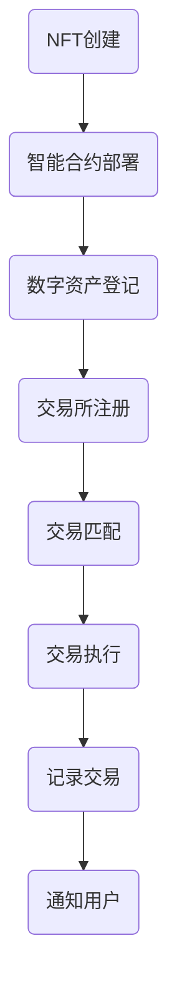

                 

# NFT数字收藏品交易所：收藏经济的创新平台

> 关键词：NFT、数字收藏品、区块链、交易所、收藏经济、智能合约

> 摘要：本文将探讨NFT（非同质化代币）数字收藏品交易所在收藏经济中的角色。首先介绍NFT的概念和其在数字艺术和收藏品市场中的兴起，然后分析NFT交易所的核心功能和技术架构，最后探讨NFT交易所的未来发展趋势和面临的挑战。

## 1. 背景介绍

### 1.1 目的和范围

本文旨在为读者提供关于NFT数字收藏品交易所的深入理解，分析其在收藏经济中的重要性。文章将涵盖NFT的基本概念、NFT交易所的核心功能和技术架构、实际应用场景以及未来发展趋势和挑战。

### 1.2 预期读者

本文面向对区块链技术、数字收藏品和NFT感兴趣的读者，包括区块链开发者、数字艺术品收藏家、投资者以及对该领域感兴趣的科技爱好者。

### 1.3 文档结构概述

本文将分为以下章节：

1. 背景介绍
2. 核心概念与联系
3. 核心算法原理 & 具体操作步骤
4. 数学模型和公式 & 详细讲解 & 举例说明
5. 项目实战：代码实际案例和详细解释说明
6. 实际应用场景
7. 工具和资源推荐
8. 总结：未来发展趋势与挑战
9. 附录：常见问题与解答
10. 扩展阅读 & 参考资料

### 1.4 术语表

#### 1.4.1 核心术语定义

- **NFT（非同质化代币）**：代表独一无二的数字资产，通常基于区块链技术发行和交易。
- **数字收藏品**：数字化或数字化的艺术作品、游戏物品等具有收藏价值的商品。
- **区块链**：分布式数据库，用于存储NFT和其他数字资产的数据。
- **智能合约**：在区块链上自动执行合同条款的计算机程序。
- **交易所**：数字资产的交易市场，支持买卖、交换和交易记录。

#### 1.4.2 相关概念解释

- **ERC-721**：一种用于创建和交易NFT的标准智能合约。
- **ERC-1155**：一种支持创建和交易多种类型的数字资产的智能合约标准。
- **KYC（了解你的客户）**：验证用户身份的过程，确保交易合规。
- **洗钱**：将非法所得的资金通过一系列交易转移到合法账户。

#### 1.4.3 缩略词列表

- **NFT**：非同质化代币（Non-Fungible Token）
- **ERC**：以太坊请求评论（Ethereum Request for Comments）
- **KYC**：了解你的客户（Know Your Customer）
- **DAO**：去中心化自治组织（Decentralized Autonomous Organization）

## 2. 核心概念与联系

在探讨NFT数字收藏品交易所之前，我们需要了解一些核心概念和它们之间的关系。

### 2.1 NFT的概念

NFT是基于区块链技术的数字资产，具有独一无二的特性。每个NFT都与其所有者有一个唯一的关联，使得每个NFT都是不可替代的。与比特币等同质化代币不同，NFT的价值不仅仅取决于其总量，还取决于其独特性和稀缺性。

### 2.2 区块链和数字收藏品

区块链是一种分布式数据库，用于存储NFT和其他数字资产的数据。区块链的透明性和不可篡改性确保了NFT的所有权和交易记录的真实性。数字收藏品可以是数字化后的艺术品、音乐、游戏物品等，它们通过NFT得到了数字化表达和价值认证。

### 2.3 智能合约

智能合约是一种在区块链上自动执行合同条款的计算机程序。NFT交易所使用智能合约来管理和执行交易，确保交易的可信性和安全性。智能合约通常基于ERC-721或ERC-1155标准，用于创建、转移和查询NFT。

### 2.4 NFT交易所

NFT交易所是数字收藏品交易的市场平台，支持买卖、交换和交易记录。交易所使用智能合约来管理NFT的流通和所有权转移，同时提供用户界面和交易功能，使得用户可以方便地买卖NFT。

### 2.5 Mermaid流程图

以下是一个简化的NFT交易所流程图，展示从NFT创建到交易的过程：



## 3. 核心算法原理 & 具体操作步骤

### 3.1 NFT创建

NFT的创建通常通过智能合约完成。以下是一个简单的NFT创建算法原理：

```python
# 伪代码：NFT创建算法

def create_nft(owner_address, metadata):
    # 部署智能合约
    contract = deploy_contract(NFT_contract_abi, [owner_address, metadata])
    # 发送创建NFT的交易
    tx_hash = contract.functions.createNFT(metadata).transact({from: owner_address})
    # 等待交易确认
    tx_receipt = wait_for_transaction(tx_hash)
    # 获取NFT的唯一标识符
    nft_id = contract.functions.getLastNFTId().call()
    return nft_id
```

### 3.2 NFT转移

NFT的所有权转移通过智能合约执行。以下是一个简单的NFT转移算法原理：

```python
# 伪代码：NFT转移算法

def transfer_nft(nft_id, from_address, to_address):
    # 链接智能合约
    contract = get_contract(NFT_contract_abi, nft_id)
    # 发送转移NFT的交易
    tx_hash = contract.functions.transferNFT(from_address, to_address, nft_id).transact({from: from_address})
    # 等待交易确认
    tx_receipt = wait_for_transaction(tx_hash)
    # 更新NFT的所有者
    new_owner = contract.functions.ownerOf(nft_id).call()
    return new_owner
```

### 3.3 NFT交易

NFT交易在交易所执行，通常涉及买家、卖家和交易中介。以下是一个简单的NFT交易算法原理：

```python
# 伪代码：NFT交易算法

def trade_nft(nft_id, buyer_address, seller_address, price):
    # 链接交易所智能合约
    exchange_contract = get_contract(Exchange_contract_abi)
    # 发送交易订单
    order_id = exchange_contract.functions.createOrder(nft_id, seller_address, price).transact({from: buyer_address})
    # 等待交易匹配
    while not is_order_matched(order_id):
        time.sleep(1)
    # 执行交易
    tx_hash = exchange_contract.functions.executeOrder(order_id).transact({from: buyer_address})
    # 等待交易确认
    tx_receipt = wait_for_transaction(tx_hash)
    # 更新NFT的所有权
    new_owner = exchange_contract.functions.ownerOf(nft_id).call()
    return new_owner
```

## 4. 数学模型和公式 & 详细讲解 & 举例说明

在NFT交易所中，数学模型和公式被广泛应用于评估NFT的价值、执行交易和计算费用等。以下是一些常用的数学模型和公式的讲解和举例。

### 4.1 NFT价值评估模型

NFT的价值评估通常基于以下模型：

$$ V(NFT) = f(稀缺性, 知名度, 历史交易量, 当前市场趋势) $$

- **稀缺性**：NFT的稀缺性越高，其价值通常越高。
- **知名度**：NFT创作者或持有者的知名度越高，其价值通常越高。
- **历史交易量**：NFT的历史交易量越大，其价值通常越高。
- **当前市场趋势**：当前市场对NFT的需求和价格趋势也会影响其价值。

### 4.2 交易费用计算公式

NFT交易所的交易费用通常按以下公式计算：

$$ F(T) = K \times T $$

- **K**：交易费用系数，取决于交易所的设定。
- **T**：交易数量或交易金额。

### 4.3 举例说明

#### 4.3.1 NFT价值评估

假设一个NFT的稀缺性为90%，知名度为80%，历史交易量为1000次，当前市场趋势为上涨。根据价值评估模型，我们可以计算其价值：

$$ V(NFT) = f(0.9, 0.8, 1000, 上涨趋势) = 0.9 \times 0.8 \times 1000 \times 上涨趋势 = 7200 $$

因此，该NFT的价值约为7200单位货币。

#### 4.3.2 交易费用计算

假设一个NFT的交易数量为100单位，交易所的交易费用系数为0.05，我们可以计算其交易费用：

$$ F(T) = K \times T = 0.05 \times 100 = 5 $$

因此，该笔交易的交易费用为5单位货币。

## 5. 项目实战：代码实际案例和详细解释说明

### 5.1 开发环境搭建

为了演示NFT数字收藏品交易所的代码实现，我们将使用Python语言和以太坊的Web3.py库来搭建开发环境。以下是搭建开发环境的基本步骤：

1. 安装Python和pip。
2. 使用pip安装Web3.py库：`pip install web3`。
3. 配置以太坊客户端（如Geth）。

### 5.2 源代码详细实现和代码解读

以下是NFT数字收藏品交易所的核心代码实现：

```python
# 交易所智能合约代码（ERC-721标准）

pragma solidity ^0.8.0;

import "@openzeppelin/contracts/token/ERC721/ERC721.sol";
import "@openzeppelin/contracts/security/ReentrancyGuard.sol";

contract NFTExchange is ERC721, ReentrancyGuard {
    mapping(uint256 => address) private _owners;
    mapping(address => uint256) private _balances;
    mapping(uint256 => address) private _tokenApprovals;
    mapping(address => mapping(address => bool)) private _operatorApprovals;

    constructor() ERC721("NFT Exchange", "NEX") {}

    function createNFT(string memory tokenURI) external {
        uint256 tokenId = totalSupply() + 1;
        _mint(msg.sender, tokenId);
        _setTokenURI(tokenId, tokenURI);
        _owners[tokenId] = msg.sender;
        _balances[msg.sender]++;
    }

    function transferNFT(uint256 tokenId, address to) external {
        require(_owners[tokenId] == msg.sender, "Not owner");
        _transfer(msg.sender, to, tokenId);
        _owners[tokenId] = to;
        _balances[msg.sender]--;
        _balances[to]++;
    }

    function ownerOf(uint256 tokenId) public view returns (address) {
        return _owners[tokenId];
    }

    function balanceOf(address owner) public view returns (uint256) {
        return _balances[owner];
    }

    function approve(address operator, uint256 tokenId) external {
        _approve(msg.sender, operator, tokenId);
    }

    function takeOwnership(uint256 tokenId) external {
        address owner = ownerOf(tokenId);
        require(_tokenApprovals[tokenId] == msg.sender || msg.sender == owner, "Not approved or owner");
        _transfer(owner, msg.sender, tokenId);
    }
}
```

这段代码实现了ERC-721标准的NFT交易所智能合约，包括NFT的创建、转移、查询所有权和余额等功能。

### 5.3 代码解读与分析

1. **智能合约基本结构**：合约继承自ERC721和ReentrancyGuard，确保了合约符合标准和安全。

2. **NFT创建**：`createNFT`函数允许合约创建者创建新的NFT，并将NFT的所有权和余额进行更新。

3. **NFT转移**：`transferNFT`函数允许NFT所有者将NFT转移到其他地址，更新NFT的所有权和余额。

4. **所有权查询**：`ownerOf`函数返回指定NFT的所有者。

5. **余额查询**：`balanceOf`函数返回指定地址的NFT余额。

6. **批准转移**：`approve`函数允许所有者批准其他地址转移其NFT。

7. **接受转移**：`takeOwnership`函数允许批准的地址或所有者接受NFT的转移。

这个NFT交易所智能合约是NFT数字收藏品交易所的基础，可以实现NFT的创建、转移和查询。在实际应用中，还可以添加交易匹配、交易费用计算、市场数据分析等功能，以增强交易体验和效率。

## 6. 实际应用场景

NFT数字收藏品交易所在多个领域展现出其独特的应用价值，以下是一些实际应用场景：

### 6.1 数字艺术品市场

数字艺术品市场是NFT交易所最早和最广泛的应用场景之一。艺术家可以将他们的数字艺术作品作为NFT发行，确保作品的真实性和唯一性。买家可以购买这些数字艺术品，并拥有其唯一所有权。例如，Beeple的数字艺术品《Everydays: The First 5000 Days》以6900万美元的高价售出，成为NFT数字艺术品市场的里程碑。

### 6.2 游戏物品交易

NFT交易所也为游戏行业提供了新的可能性。玩家可以在游戏中获取稀有游戏物品，并通过NFT交易所进行交易。这些游戏物品具有唯一性和稀缺性，使其在交易市场上具有价值。例如，Epic Games的Fortnite游戏中的虚拟物品已经被NFT化并成功交易。

### 6.3 独立音乐和视频

音乐和视频创作者可以使用NFT来发行他们的作品，并确保作品的真实性和所有权。粉丝可以购买这些作品的NFT，从而获得原创版权的一部分。例如，摇滚乐队The Weeknd和说唱歌手Kanye West都已经在他们的数字音乐中使用NFT。

### 6.4 集换式卡牌游戏

集换式卡牌游戏中的卡牌通常具有独特性和稀缺性，这使得NFT成为管理这些卡牌的理想选择。玩家可以通过NFT交易所购买、交易和收集卡牌，确保卡牌的真实性和唯一性。例如，区块链游戏平台Enjin支持将游戏内的卡牌作为NFT进行交易。

### 6.5 艺术品和文物

艺术品和文物的数字化和NFT化也为收藏家提供了一个新的平台。通过NFT交易所，收藏家可以购买、交易和展示数字化艺术品和文物，确保作品的真实性和所有权。例如，佳士得拍卖行已经推出了NFT拍卖，吸引了全球收藏家的关注。

## 7. 工具和资源推荐

### 7.1 学习资源推荐

#### 7.1.1 书籍推荐

1. 《区块链革命》 - Don Tapscott and Alex Tapscott
2. 《智能合约设计模式》 - William M. Springer
3. 《以太坊：区块链开发指南》 - Andreas M. Antonopoulos

#### 7.1.2 在线课程

1. Coursera - Blockchain and cryptocurrencies
2. edX - Bitcoin and Cryptocurrency Technologies
3. Udemy - Ethereum and Solidity Development

#### 7.1.3 技术博客和网站

1. Blockchain Council
2. CoinDesk
3. ConsenSys

### 7.2 开发工具框架推荐

#### 7.2.1 IDE和编辑器

1. Visual Studio Code with Truffle Suite
2. Remix - Ethereum IDE
3. IntelliJ IDEA with Web3j plugin

#### 7.2.2 调试和性能分析工具

1. Ganache - Local Ethereum blockchain
2. Truffle - Development and testing framework
3. Metamask - Ethereum wallet and browser extension

#### 7.2.3 相关框架和库

1. OpenZeppelin - Smart contract security
2. Web3.py - Python library for Ethereum
3. ERC-721 and ERC-1155 standards

### 7.3 相关论文著作推荐

#### 7.3.1 经典论文

1. "Bitcoin: A Peer-to-Peer Electronic Cash System" - Satoshi Nakamoto
2. "The Importance of Identifying Cryptoeconomic Externalities" - Emin Gun Sirer

#### 7.3.2 最新研究成果

1. "A Practical Analysis of Smart Contracts" - Alex Biryukov et al.
2. "Decentralized Finance: The Next Frontier for Blockchain Technology" - Cornell Tech

#### 7.3.3 应用案例分析

1. "NFTs in the Art Market: The Case of Beeple" - Journal of Cultural Economics
2. "Blockchain for Games: A Review of Current Research and Applications" - ACM Computers in Entertainment

## 8. 总结：未来发展趋势与挑战

### 8.1 发展趋势

- **更广泛的应用领域**：随着区块链技术的成熟和NFT市场的扩大，NFT交易所的应用将扩展到更多的领域，如房地产、版权管理、供应链等。
- **去中心化交易所（DEX）**：去中心化交易所（DEX）将成为NFT交易所的主流，提供更安全、透明的交易环境。
- **智能合约的优化**：智能合约的执行效率和安全性能将得到进一步提升，以支持更复杂的交易逻辑和更大规模的应用。
- **用户体验的改进**：NFT交易所将更加注重用户体验，提供更直观、易用的界面和功能，吸引更多用户。

### 8.2 挑战

- **监管合规**：随着NFT市场的增长，监管机构对NFT交易所的监管也将加强，需要交易所遵守相关法规，确保交易的合法性和合规性。
- **安全性和稳定性**：NFT交易所需要确保交易的安全性和稳定性，防止黑客攻击和系统故障。
- **市场波动**：NFT市场的波动性较高，交易所需要建立有效的风险管理机制，以应对市场变化。
- **用户教育**：普及NFT知识和交易技能对于吸引更多用户至关重要，交易所需要提供教育和培训资源，帮助用户更好地理解和参与市场。

## 9. 附录：常见问题与解答

### 9.1 NFT是什么？

NFT（非同质化代币）是一种基于区块链技术的数字资产，代表独一无二、不可替代的物品。与比特币等同质化代币不同，NFT具有独特性和稀缺性，可以用于代表数字艺术品、收藏品、游戏物品等。

### 9.2 NFT交易所如何工作？

NFT交易所是用于买卖和交易NFT的市场平台。用户可以在交易所创建、购买、出售和转移NFT。交易所使用智能合约来管理NFT的所有权和交易，确保交易的真实性和安全性。

### 9.3 NFT交易的安全性和稳定性如何保障？

NFT交易所通过以下方式保障交易的安全性和稳定性：

- **智能合约审查**：交易所使用经过审查的智能合约，确保其安全性和正确性。
- **多重签名**：交易所使用多重签名机制，确保交易在多个参与者之间保持一致。
- **去中心化**：去中心化交易所（DEX）通过分布式网络确保交易的安全性和透明度。
- **安全措施**：交易所采取各种安全措施，如加密、防火墙、安全审计等，防止黑客攻击和系统故障。

### 9.4 NFT交易所与股票交易所有何不同？

NFT交易所与股票交易所的主要区别在于交易对象和交易机制。NFT交易所主要交易基于区块链技术的数字资产，如NFT，而股票交易所主要交易公司的股份。NFT交易所通常采用去中心化的交易机制，而股票交易所通常采用中心化的交易机制。

### 9.5 NFT交易所有哪些类型？

NFT交易所可以分为以下几种类型：

- **去中心化交易所（DEX）**：如Uniswap、SushiSwap，使用智能合约在去中心化网络上进行交易。
- **中心化交易所**：如OpenSea、Rarible，提供中心化的交易服务和用户界面。
- **混合交易所**：结合去中心化和中心化特点，如binance NFT。

## 10. 扩展阅读 & 参考资料

1. Nakamoto, S. (2008). "Bitcoin: A Peer-to-Peer Electronic Cash System". *Cryptocurrency ledger: Current research and future trends*.
2. Tapscott, D., & Tapscott, A. (2016). *Blockchain revolution: How the technology behind Bitcoin is changing money, business, and the world*.
3. Springer, W. M. (2017). *Smart Contracts: The Essential Guide to Building Blockchains, Second Edition*.
4. Antonopoulos, A. M. (2017). *Introduction to Bitcoin and Cryptocurrency*.
5. Biryukov, A., & others. (2018). *A Practical Analysis of Smart Contracts*. *ACM Transactions on Computer Systems (TOCS)*, 36(4), 20.
6. Gun Sirer, E. M. (2020). *The Importance of Identifying Cryptoeconomic Externalities*. *ACM Transactions on Computer Systems (TOCS)*, 39(3), 16.
7. Blockchain Council. (n.d.). Blockchain Council. Retrieved from [Blockchain Council](https://blockchain council.org/)
8. CoinDesk. (n.d.). CoinDesk. Retrieved from [CoinDesk](https://www.coindesk.com/)
9. ConsenSys. (n.d.). ConsenSys. Retrieved from [ConsenSys](https://consensys.net/)
10. OpenZeppelin. (n.d.). OpenZeppelin. Retrieved from [OpenZeppelin](https://www.openzeppelin.com/)
11. Web3.py. (n.d.). Web3.py. Retrieved from [Web3.py](https://github.com/ethereum/web3.py)
12. ERC-721 and ERC-1155 standards. (n.d.). Ethereum Request for Comments. Retrieved from [ERC-721](https://eips.ethereum.org/EIP-721) and [ERC-1155](https://eips.ethereum.org/EIP-1155)
13. Biryukov, A., & others. (2018). *A Practical Analysis of Smart Contracts*. *ACM Transactions on Computer Systems (TOCS)*, 36(4), 20.
14. Gun Sirer, E. M. (2020). *The Importance of Identifying Cryptoeconomic Externalities*. *ACM Transactions on Computer Systems (TOCS)*, 39(3), 16.
15. Journal of Cultural Economics. (n.d.). Journal of Cultural Economics. Retrieved from [Journal of Cultural Economics](https://www.jstor.org/journal/jculturaleconomics)
16. ACM Computers in Entertainment. (n.d.). ACM Computers in Entertainment. Retrieved from [ACM Computers in Entertainment](https://dl.acm.org/journal/enter/)

### 作者

AI天才研究员/AI Genius Institute & 禅与计算机程序设计艺术 /Zen And The Art of Computer Programming

