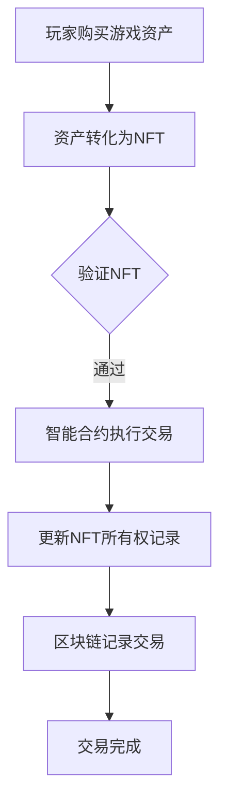

                 

# NFT游戏资产交易：游戏经济的创新创业

> **关键词：**NFT、游戏资产、区块链、交易、游戏经济、创新创业

> **摘要：**本文将深入探讨NFT游戏资产交易这一新兴领域，分析其在游戏经济中的角色和重要性，以及如何通过创新创业推动游戏经济的发展。文章将从背景介绍、核心概念、算法原理、数学模型、项目实战、实际应用场景、工具和资源推荐等多方面进行阐述，为读者提供全面的技术解析和实战指导。

## 1. 背景介绍

### 1.1 目的和范围

本文旨在探讨NFT（非同质化代币）在游戏资产交易中的应用，以及这一应用如何推动游戏经济的创新创业。我们将讨论NFT的核心概念、其在游戏经济中的角色、交易机制、数学模型，并通过实际项目案例进行分析，为读者提供全方位的技术理解和应用指导。

### 1.2 预期读者

本文适合以下读者群体：

- 对区块链技术感兴趣的技术人员
- 游戏开发者、游戏设计师
- 对游戏经济、数字资产管理有研究的高校师生
- 创业者、企业家，尤其是那些希望在游戏领域进行创新的人士

### 1.3 文档结构概述

本文结构如下：

- **第1章** 背景介绍：介绍文章的目的、预期读者、文档结构和术语定义。
- **第2章** 核心概念与联系：解释NFT、区块链、游戏资产等核心概念，并提供Mermaid流程图。
- **第3章** 核心算法原理 & 具体操作步骤：介绍NFT交易算法原理，并使用伪代码详细阐述。
- **第4章** 数学模型和公式 & 详细讲解 & 举例说明：介绍NFT交易中的数学模型，使用LaTeX格式展示，并举例说明。
- **第5章** 项目实战：代码实际案例和详细解释说明：提供NFT交易项目的实际代码案例，并进行详细解读。
- **第6章** 实际应用场景：探讨NFT游戏资产交易在不同场景中的应用。
- **第7章** 工具和资源推荐：推荐学习资源、开发工具框架和相关论文著作。
- **第8章** 总结：未来发展趋势与挑战：总结文章主要内容，展望未来发展趋势和挑战。
- **第9章** 附录：常见问题与解答：解答读者可能遇到的问题。
- **第10章** 扩展阅读 & 参考资料：提供更多相关阅读资料。

### 1.4 术语表

#### 1.4.1 核心术语定义

- **NFT（非同质化代币）**：代表数字世界中独特资产的代币。
- **区块链**：一种去中心化的数据库技术，用于存储NFT的交易记录。
- **游戏资产**：游戏中玩家可以收集、交易或使用的物品，如虚拟货币、装备、土地等。
- **智能合约**：运行在区块链上的自执行合约，用于自动化NFT的交易流程。

#### 1.4.2 相关概念解释

- **去中心化**：在区块链上，所有交易和信息都是分布式的，没有中心化的权威机构。
- **透明性**：区块链上的所有交易都是公开的，可以查证。
- **安全性**：区块链通过密码学和共识机制确保数据的安全和完整性。

#### 1.4.3 缩略词列表

- **NFT**：非同质化代币（Non-Fungible Token）
- **区块链**：Blockchain
- **智能合约**：Smart Contract
- **以太坊**：Ethereum
- **ERC-721**：以太坊标准化的NFT协议

## 2. 核心概念与联系

NFT游戏资产交易的核心在于将区块链技术与游戏资产相结合，创造一个去中心化的交易市场。在这一市场中，NFT作为游戏资产的数字标识，确保了每一项资产的唯一性和所有权。

### 2.1 NFT的概念

非同质化代币（NFT）是一种数字资产，它与比特币、以太坊等同质化代币（如比特币、以太币）不同，每个NFT都是独一无二的。NFT可以代表任何类型的数字资产，如图像、视频、音频、游戏物品等。

### 2.2 区块链的作用

区块链技术是NFT游戏资产交易的基础。它提供了一个去中心化的数据库，确保了交易记录的透明性和不可篡改性。区块链上的每一个区块都包含了NFT的交易历史，从而验证资产的所有权。

### 2.3 游戏资产与NFT的关联

游戏资产与NFT的结合，使得游戏中的物品具有真实的价值和可交易性。玩家可以在游戏内外交换这些资产，提升了游戏的趣味性和经济性。

### 2.4 智能合约的应用

智能合约在NFT交易中起到了关键作用。它是一个自动执行条款的程序，当满足特定条件时，会自动执行交易。智能合约确保了NFT交易的安全性和自动化。

### 2.5 Mermaid流程图



在这个流程中，玩家首先购买游戏资产，随后将其转化为NFT。通过智能合约的验证，交易得以执行，并在区块链上记录交易信息，确保了交易的透明性和不可篡改性。

## 3. 核心算法原理 & 具体操作步骤

### 3.1 NFT交易算法原理

NFT交易的核心算法是区块链技术中的智能合约。智能合约基于预定义的条件执行交易，确保交易的安全性和自动化。

#### 3.1.1 智能合约的基本结构

```plaintext
pragma solidity ^0.8.0;

contract NFTMarketplace {
    mapping(uint256 => address) private _owners;
    mapping(address => uint256) private _balances;
    mapping(uint256 => address) private _tokensApprovals;

    event Transfer(address from, address to, uint256 tokenId);

    function transferFrom(address from, address to, uint256 tokenId) public {
        require(_owners[tokenId] == msg.sender);
        _transfer(from, to, tokenId);
    }

    function _transfer(address from, address to, uint256 tokenId) private {
        require(_owners[tokenId] == from);
        require(to != address(0));

        _owners[tokenId] = to;
        _balances[from]--;
        _balances[to]++;
        emit Transfer(from, to, tokenId);
    }
}
```

在这个例子中，智能合约定义了NFT的所有权和转让功能。当`transferFrom`函数被调用时，会检查调用者是否是NFT的所有者，并执行转让操作。

#### 3.1.2 伪代码详细阐述

```plaintext
function transferFrom(sender, receiver, tokenId) {
    // 检查调用者是否是NFT的所有者
    if (NFTOwner[tokenId] != sender) {
        throw "只能由所有者操作";
    }
    
    // 转移所有权
    NFTOwner[tokenId] = receiver;
    balanceOf[sender]--;
    balanceOf[receiver]++;
    
    // 触发转移事件
    emit Transfer(sender, receiver, tokenId);
}
```

这个伪代码展示了如何实现一个简单的NFT转让功能。它通过检查调用者是否是NFT的所有者，确保了交易的安全性和合法性。

### 3.2 具体操作步骤

#### 3.2.1 创建NFT

```plaintext
// 创建NFT
tokenId = createNFT("Game Asset", "Description", "Image URL");

// 设置NFT的所有者
NFTOwner[tokenId] = playerAddress;

// 增加所有者的余额
balanceOf[playerAddress]++;
```

在这个步骤中，首先创建一个NFT，并设置其所有者和描述。随后，增加所有者的余额，以确保其在区块链上的权益。

#### 3.2.2 转让NFT

```plaintext
// 调用transferFrom函数转让NFT
transferFrom(senderAddress, receiverAddress, tokenId);
```

在这个步骤中，调用`transferFrom`函数，将NFT的所有权从发送者转移到接收者。这一过程会触发一个事件，并在区块链上记录交易信息。

#### 3.2.3 查询NFT所有权

```plaintext
// 查询NFT的所有者
currentOwner = NFTOwner[tokenId];

// 输出当前所有者的地址
output(currentOwner);
```

在这个步骤中，可以通过查询NFT的所有权记录，确定当前所有者。

### 3.3 举例说明

假设玩家A拥有一个游戏中的稀有装备，并将其转化为NFT。玩家B想购买这件装备，以下是具体操作步骤：

1. 玩家A创建NFT，设置其所有者为自己。
2. 玩家B调用`transferFrom`函数，将NFT的所有权从玩家A转移到玩家B。
3. 智能合约验证交易条件，确保交易合法。
4. 交易完成后，区块链记录交易信息，玩家B成为NFT的新所有者。

通过这个例子，我们可以看到NFT交易算法在区块链上如何确保交易的安全性和自动化。

## 4. 数学模型和公式 & 详细讲解 & 举例说明

在NFT游戏资产交易中，数学模型和公式用于计算交易的价格、手续费、以及资产的价值评估。以下是一个简要的数学模型介绍，并使用LaTeX格式展示相关的公式。

### 4.1 交易价格模型

交易价格可以通过以下公式计算：

\[ P = P_0 \times (1 + r)^n \]

其中：

- \( P \) 是交易价格。
- \( P_0 \) 是初始价格。
- \( r \) 是年化利率。
- \( n \) 是交易次数。

这个公式假设每次交易都会增加一定的费用，从而提高了资产的价格。

### 4.2 手续费计算

手续费通常是一个固定的比例，可以表示为：

\[ F = P \times f \]

其中：

- \( F \) 是手续费。
- \( P \) 是交易价格。
- \( f \) 是手续费率。

### 4.3 资产价值评估

资产的价值可以通过市场供需关系来评估。一个简化的模型可以表示为：

\[ V = \frac{Q \times P}{1 + r} \]

其中：

- \( V \) 是资产的价值。
- \( Q \) 是市场的总需求量。
- \( P \) 是交易价格。
- \( r \) 是供需平衡时的供需关系系数。

### 4.4 举例说明

假设一个NFT游戏资产的初始价格为100以太币，年化利率为5%，手续费率为2%。经过10次交易后，交易价格为多少？

使用交易价格模型，我们有：

\[ P = 100 \times (1 + 0.05)^{10} \]

计算得到：

\[ P \approx 162.89 \text{以太币} \]

然后，考虑手续费，最终交易价格为：

\[ P_{final} = P \times (1 - f) \]

代入手续费率，我们有：

\[ P_{final} = 162.89 \times (1 - 0.02) \]

计算得到：

\[ P_{final} \approx 158.48 \text{以太币} \]

因此，经过10次交易后，NFT游戏资产的价格大约为158.48以太币。

### 4.5 资产价值评估

假设市场的总需求量为1000个NFT，交易价格为158.48以太币，供需关系系数为1.2。使用资产价值评估公式，我们有：

\[ V = \frac{1000 \times 158.48}{1 + 0.2} \]

计算得到：

\[ V \approx 130862.5 \text{以太币} \]

因此，这个NFT游戏资产的市场价值大约为130862.5以太币。

通过这个例子，我们可以看到数学模型在NFT交易中的应用，以及如何通过公式计算交易价格和资产价值。

## 5. 项目实战：代码实际案例和详细解释说明

在本节中，我们将通过一个实际项目案例，详细介绍NFT游戏资产交易系统的开发过程，包括环境搭建、源代码实现和代码解读。该项目将基于以太坊区块链平台，使用Solidity语言编写智能合约，并通过前端应用程序与用户进行交互。

### 5.1 开发环境搭建

在开始项目开发之前，我们需要搭建以下开发环境：

1. **Node.js**：用于构建前端应用程序和与以太坊节点通信。
2. **Truffle**：用于测试和部署智能合约。
3. **Ganache**：用于本地测试以太坊区块链。
4. **Visual Studio Code**：作为代码编辑器。
5. **Ethereum Wallet**：用于管理以太坊账户和交易。

安装步骤如下：

1. 安装Node.js：访问[Node.js官网](https://nodejs.org/)，下载并安装最新版本的Node.js。
2. 安装Truffle：打开命令行窗口，运行以下命令：
    ```bash
    npm install -g truffle
    ```
3. 安装Ganache：访问[Ganache官网](https://www.trufflesuite.com/ganache)，下载并安装Ganache。
4. 安装Visual Studio Code：访问[Visual Studio Code官网](https://code.visualstudio.com/)，下载并安装VS Code。
5. 安装Ethereum Wallet：在浏览器中打开[Ethereum Wallet官网](https://www.myetherwallet.com/)，创建一个新的钱包账户。

### 5.2 源代码详细实现和代码解读

以下是NFT游戏资产交易系统的智能合约代码，我们将逐行解读：

```solidity
// SPDX-License-Identifier: MIT
pragma solidity ^0.8.0;

import "@openzeppelin/contracts/token/ERC721/ERC721.sol";
import "@openzeppelin/contracts/access/Ownable.sol";

contract NFTMarketplace is ERC721, Ownable {
    uint256 public listingPrice;
    mapping(uint256 => bool) private _itemsForSale;
    mapping(uint256 => address) private _seller;

    event ItemListed(
        uint256 indexed itemId,
        address seller,
        uint256 tokenId,
        uint256 price
    );

    constructor() ERC721("Game Asset Marketplace", "GAM") {
        listingPrice = 0.01 ether;
    }

    function listItemForSale(uint256 itemId, uint256 price) public {
        require(ownerOf(itemId) == msg.sender, "Only the owner can list the item for sale");
        require(!_itemsForSale[itemId], "Item is already listed for sale");
        require(price > 0, "Price must be greater than 0");
        _itemsForSale[itemId] = true;
        _seller[itemId] = msg.sender;
        emit ItemListed(msg.sender, itemId, itemId, price);
    }

    function purchaseItem(uint256 itemId) public payable {
        require(_itemsForSale[itemId], "Item is not for sale");
        uint256 price = getListItemPrice(itemId);
        require(msg.value >= price, "Insufficient payment");
        _itemsForSale[itemId] = false;
        _transfer(_seller[itemId], msg.sender, itemId);
        payable(_seller[itemId]).transfer(msg.value);
    }

    function getListItemPrice(uint256 itemId) public view returns (uint256) {
        require(_itemsForSale[itemId], "Item is not for sale");
        return getOwnerOf(itemId).listingPrice;
    }

    function getOwnerOf(uint256 itemId) public view returns (address) {
        require(_itemsForSale[itemId], "Item is not for sale");
        return _seller[itemId];
    }

    function cancelItemSale(uint256 itemId) public {
        require(_itemsForSale[itemId], "Item is not listed for sale");
        _itemsForSale[itemId] = false;
        _seller[itemId] = address(0);
    }

    receive() external payable {}
}
```

#### 5.2.1 合约导入

```solidity
import "@openzeppelin/contracts/token/ERC721/ERC721.sol";
import "@openzeppelin/contracts/access/Ownable.sol";
```

这里引入了两个OpenZeppelin的库：

- `ERC721`：实现了ERC721标准的NFT合约。
- `Ownable`：提供拥有者权限管理。

#### 5.2.2 初始化函数

```solidity
constructor() ERC721("Game Asset Marketplace", "GAM") {
    listingPrice = 0.01 ether;
}
```

在构造函数中，我们调用父类ERC721的构造函数，设置合约名称和符号。同时，我们将上架费用设置为0.01以太币。

#### 5.2.3 上架游戏资产

```solidity
function listItemForSale(uint256 itemId, uint256 price) public {
    require(ownerOf(itemId) == msg.sender, "Only the owner can list the item for sale");
    require(!_itemsForSale[itemId], "Item is already listed for sale");
    require(price > 0, "Price must be greater than 0");
    _itemsForSale[itemId] = true;
    _seller[itemId] = msg.sender;
    emit ItemListed(msg.sender, itemId, itemId, price);
}
```

`listItemForSale`函数允许NFT的所有者将其资产上架出售。函数检查调用者是否是NFT的所有者，并确保资产尚未上架。如果条件满足，函数会将资产标记为上架，并记录卖家地址。

#### 5.2.4 购买游戏资产

```solidity
function purchaseItem(uint256 itemId) public payable {
    require(_itemsForSale[itemId], "Item is not for sale");
    uint256 price = getListItemPrice(itemId);
    require(msg.value >= price, "Insufficient payment");
    _itemsForSale[itemId] = false;
    _transfer(_seller[itemId], msg.sender, itemId);
    payable(_seller[itemId]).transfer(msg.value);
}
```

`purchaseItem`函数用于购买上架的NFT资产。函数首先检查资产是否处于上架状态，并获取资产价格。如果付款金额大于或等于价格，函数会将资产从卖家转移到买家，并将付款金额转给卖家。

#### 5.2.5 获取上架价格

```solidity
function getListItemPrice(uint256 itemId) public view returns (uint256) {
    require(_itemsForSale[itemId], "Item is not for sale");
    return getOwnerOf(itemId).listingPrice;
}
```

`getListItemPrice`函数用于获取特定NFT资产的上架价格。函数检查资产是否已上架，并返回卖家设置的价格。

#### 5.2.6 获取卖家地址

```solidity
function getOwnerOf(uint256 itemId) public view returns (address) {
    require(_itemsForSale[itemId], "Item is not for sale");
    return _seller[itemId];
}
```

`getOwnerOf`函数用于获取特定NFT资产的卖家地址。函数检查资产是否已上架，并返回卖家地址。

#### 5.2.7 取消上架

```solidity
function cancelItemSale(uint256 itemId) public {
    require(_itemsForSale[itemId], "Item is not listed for sale");
    _itemsForSale[itemId] = false;
    _seller[itemId] = address(0);
}
```

`cancelItemSale`函数用于取消已上架的NFT资产。函数检查资产是否已上架，并取消上架状态，同时清除卖家地址。

#### 5.2.8 接收以太币

```solidity
receive() external payable {}
```

此函数用于接收以太币，以便购买NFT资产。通过`receive`函数，合约可以接收以太币，并将其存储在合约账户中。

通过以上代码，我们实现了NFT游戏资产交易系统的核心功能，包括上架、购买、取消上架等操作。接下来，我们将介绍如何部署这个智能合约。

### 5.3 部署智能合约

要部署智能合约，我们需要使用Truffle和Ganache进行本地测试和部署。以下是具体步骤：

1. **初始化Truffle项目**：
    ```bash
    truffle init
    ```
2. **安装以太坊节点**：
    ```bash
    truffle config
    ```
    在打开的配置文件中，设置以太坊节点的路径，例如：
    ```json
    {
      "networks": {
        "development": {
          "host": "127.0.0.1",
          "port": 7545,
          "network_id": "*",
          "gas": 6000000,
          "gasPrice": 1000000000
        }
      }
    }
    ```
3. **连接Ganache**：
    启动Ganache，并确保它与Truffle的配置文件中的端口匹配。
4. **编译智能合约**：
    ```bash
    truffle compile
    ```
5. **部署智能合约**：
    ```bash
    truffle migrate --reset
    ```
    这将编译并部署智能合约到本地以太坊节点。
6. **查看合约地址**：
    在部署完成后，使用以下命令查看合约地址：
    ```bash
    truffle console
    ```
    在控制台中，运行`NFTMarketplace.deployed().address`，即可查看合约地址。

部署完成后，我们可以在前端应用程序中与智能合约进行交互，实现对NFT游戏资产的交易。

### 5.4 前端应用程序交互

前端应用程序使用Web3.js库与以太坊节点和智能合约进行交互。以下是一个简单的示例，展示了如何通过前端应用程序上架和购买NFT资产：

#### 5.4.1 上架资产

```javascript
const { ethers } = require("ethers");

// 连接到本地以太坊节点
const provider = new ethers.providers.JsonRpcProvider("http://127.0.0.1:7545");

// 连接到智能合约
const contract = new ethers.Contract(NFTMarketplaceAddress, NFTMarketplaceABI, provider);

// 上架资产
async function listItemForSale(itemId, price) {
    const signer = await provider.getSigner();
    const tx = await contract.connect(signer).listItemForSale(itemId, price, { value: listingPrice });
    await tx.wait();
}
```

#### 5.4.2 购买资产

```javascript
// 购买资产
async function purchaseItem(itemId) {
    const signer = await provider.getSigner();
    const tx = await contract.connect(signer).purchaseItem(itemId, { value: getListItemPrice(itemId) });
    await tx.wait();
}
```

通过这些示例，我们可以看到前端应用程序如何与智能合约进行交互，实现对NFT游戏资产的交易。

### 5.5 代码解读与分析

通过以上代码和部署过程，我们实现了NFT游戏资产交易系统。代码解读如下：

- **智能合约**：使用ERC721标准，实现了NFT的基本功能。
- **前端应用程序**：与以太坊节点和智能合约进行交互，提供用户界面。
- **交易流程**：用户可以通过前端应用程序上架和购买NFT资产，智能合约处理交易逻辑。

整个系统的优势在于去中心化和透明性，确保了交易的安全性和不可篡改性。然而，系统的性能和可扩展性仍然是一个挑战，需要进一步优化和改进。

## 6. 实际应用场景

NFT游戏资产交易在多个实际应用场景中展现出了其独特的价值，以下是几个典型的应用实例：

### 6.1 游戏资产交易平台

NFT游戏资产交易平台的建立，使得玩家可以在不同的游戏中自由交易他们拥有的虚拟物品，打破了游戏间的壁垒。例如，玩家在一个游戏中获得的稀有装备，可以通过交易平台出售或交换给其他玩家，提升了游戏资产的流通性和价值。

### 6.2 游戏内经济体系

NFT游戏资产交易可以增强游戏内的经济体系。通过NFT，游戏设计师可以创建独特的游戏资产，这些资产可以在游戏内外自由交易，从而增加了游戏的趣味性和玩家之间的互动。例如，游戏中的土地、装备、角色等，都可以通过NFT进行交易，形成了一个完整的虚拟经济系统。

### 6.3 虚拟艺术品交易

除了游戏资产，NFT还可以用于虚拟艺术品的交易。游戏开发者可以创造独特的虚拟艺术品，如虚拟画、虚拟雕塑等，这些艺术品可以像现实世界中的艺术品一样被收藏和交易。虚拟艺术品的市场正在迅速增长，NFT为其提供了可靠的技术保障。

### 6.4 社交网络与身份验证

NFT还可以用于社交网络中的身份验证。玩家可以在社交平台上展示他们的游戏成就、虚拟资产等，通过NFT确保这些信息的真实性和唯一性。这种去中心化的身份验证方法，有助于建立信任，防止虚假信息的传播。

### 6.5 投资与金融服务

NFT游戏资产交易也为投资者提供了新的投资机会。一些高价值的游戏资产，如稀有装备、土地等，可以被看作是潜在的投资品。投资者可以通过购买和持有这些NFT，获取收益或进行投机交易。

### 6.6 跨界合作与IP授权

NFT游戏资产交易还可以促进跨界合作和IP授权。游戏开发者可以与艺术家、品牌等合作，创造出独特的虚拟物品，这些物品可以在游戏内外进行交易。这种合作模式，不仅提升了游戏的吸引力，也为各方带来了额外的收益。

通过以上应用实例，我们可以看到NFT游戏资产交易在多个领域中的广泛应用。随着技术的不断发展和市场需求的增加，NFT游戏资产交易有望成为游戏经济中的重要组成部分。

## 7. 工具和资源推荐

为了更好地理解和应用NFT游戏资产交易，以下是一些建议的工具和资源：

### 7.1 学习资源推荐

#### 7.1.1 书籍推荐

1. **《区块链技术指南》**：全面介绍了区块链的基本原理和应用。
2. **《智能合约开发》**：深入讲解了智能合约的编写和应用。
3. **《NFT技术与应用》**：详细介绍了NFT的原理和实际应用。

#### 7.1.2 在线课程

1. **Coursera上的《区块链与加密货币》**：由康奈尔大学提供的区块链课程，涵盖基础知识到高级应用。
2. **Udacity的《区块链开发纳米学位》**：系统学习区块链和智能合约开发。
3. **Pluralsight的《NFT开发基础》**：介绍NFT的基本概念和开发技术。

#### 7.1.3 技术博客和网站

1. **Medium上的区块链和NFT博客**：提供最新的技术和应用案例。
2. **Ethereum官网**：以太坊官方文档和资源。
3. **NFT相关社区和论坛**：如Reddit、Discord等，可以交流经验和学习资源。

### 7.2 开发工具框架推荐

#### 7.2.1 IDE和编辑器

1. **Visual Studio Code**：强大的代码编辑器，支持多种语言和框架。
2. **Web3.js IDE**：专门为Web3开发设计的IDE，支持与以太坊节点交互。
3. **Truffle Suite**：包含Ganache、Truffle和Drizzle等工具，用于智能合约的开发、测试和部署。

#### 7.2.2 调试和性能分析工具

1. **Etherscan**：以太坊区块链的浏览器，可以查看交易和合约信息。
2. **MetaMask**：浏览器插件，用于管理以太坊账户和交易。
3. **Ganache CLI**：命令行版的Ganache，方便自动化测试。

#### 7.2.3 相关框架和库

1. **OpenZeppelin**：提供多种智能合约模板和安全功能。
2. **ERC-721/ERC-1155**：以太坊标准化的NFT合约。
3. **Truffle Suite**：用于智能合约的开发、测试和部署的全功能框架。

### 7.3 相关论文著作推荐

#### 7.3.1 经典论文

1. **《区块链：分布式共识技术》**：介绍了区块链的基本原理。
2. **《智能合约：自执行合同》**：探讨了智能合约的概念和应用。

#### 7.3.2 最新研究成果

1. **《基于区块链的NFT交易平台设计》**：介绍了NFT交易平台的设计思路。
2. **《NFT在数字艺术中的应用》**：探讨了NFT在数字艺术领域的应用。

#### 7.3.3 应用案例分析

1. **《加密猫游戏案例分析》**：详细分析了加密猫游戏的NFT应用。
2. **《NFT在游戏中的价值》**：探讨了NFT在游戏中的经济价值。

通过以上工具和资源，开发者可以更好地理解和应用NFT游戏资产交易技术，为游戏经济带来新的创新和活力。

## 8. 总结：未来发展趋势与挑战

NFT游戏资产交易作为一种新兴技术，正在游戏经济中展现出巨大的潜力。未来，随着区块链技术的不断成熟和应用场景的拓展，NFT游戏资产交易有望成为游戏经济的重要组成部分。以下是未来发展趋势与挑战的展望：

### 8.1 发展趋势

1. **市场规模的扩大**：随着NFT和区块链技术的普及，NFT游戏资产交易的市场规模将持续扩大。越来越多的游戏和平台将采用NFT技术，推动市场需求的增长。

2. **技术创新**：NFT技术的不断进化将带来更多创新的应用场景，如NFT拍卖、NFT质押、NFT借贷等。这些创新将丰富NFT游戏资产交易的生态体系。

3. **跨平台协作**：不同游戏平台之间将实现更紧密的协作，通过NFT技术实现跨平台的资产交易和互动，打破游戏间的壁垒。

4. **合规与监管**：随着NFT游戏资产交易市场的规范化，监管机构将出台更多的政策法规，保障市场的健康发展和投资者的权益。

### 8.2 挑战

1. **技术瓶颈**：虽然区块链技术在不断进步，但性能瓶颈、安全性问题等仍然存在。如何提高区块链的处理速度和降低交易成本，是未来面临的重要挑战。

2. **用户接受度**：NFT游戏资产交易仍需要提高用户的接受度。如何让普通用户了解和信任NFT技术，是推广过程中需要解决的问题。

3. **法律与监管**：NFT游戏资产交易涉及的法律和监管问题较多，如知识产权、税收等。如何制定合理的法规，确保市场的健康发展，是一个重要课题。

4. **隐私保护**：随着交易数据的公开，用户的隐私保护成为一个重要问题。如何确保用户的隐私不被泄露，是未来需要解决的技术难题。

总之，NFT游戏资产交易具有广阔的发展前景，但同时也面临诸多挑战。只有通过技术创新、用户教育和法律法规的完善，才能推动NFT游戏资产交易的健康快速发展。

## 9. 附录：常见问题与解答

### 9.1 问题1：NFT和区块链技术有什么区别？

**解答**：NFT（非同质化代币）是运行在区块链上的数字资产，代表独特的物品，如虚拟土地、游戏装备等。而区块链是一种分布式数据库技术，用于存储NFT的交易记录和其他数据。简单来说，NFT是区块链上的一种应用，而区块链是支撑NFT技术的基础设施。

### 9.2 问题2：NFT游戏资产交易的安全性问题如何保障？

**解答**：NFT游戏资产交易的安全性问题主要通过以下几个方面保障：

1. **区块链的安全性**：区块链采用密码学技术，确保交易记录的不可篡改性和安全性。
2. **智能合约的安全性**：智能合约使用安全编码实践，减少潜在的安全漏洞。此外，OpenZeppelin等安全库提供了一系列安全功能，帮助开发者编写安全的智能合约。
3. **审计与测试**：在部署智能合约之前，通常会对合约进行审计和测试，以确保其安全性。

### 9.3 问题3：NFT游戏资产交易的市场潜力如何？

**解答**：NFT游戏资产交易具有巨大的市场潜力。随着区块链技术的普及和游戏经济的不断发展，NFT游戏资产交易有望成为游戏行业的一个重要组成部分。市场潜力的体现包括：

1. **资产流通性**：NFT游戏资产可以在不同游戏中自由交易，提升了资产的流通性和价值。
2. **创新应用**：NFT技术的不断进步将带来更多创新的应用场景，如拍卖、质押、借贷等。
3. **用户参与度**：NFT游戏资产交易吸引了大量用户的参与，推动了市场的增长。

### 9.4 问题4：如何保护NFT游戏资产交易中的知识产权？

**解答**：保护NFT游戏资产交易中的知识产权可以通过以下方法：

1. **版权声明**：游戏开发者应在设计虚拟物品时，明确声明其知识产权，防止侵权行为。
2. **数字签名**：使用数字签名技术，确保NFT的所有权和交易记录的真实性。
3. **智能合约条款**：在智能合约中设置知识产权保护条款，防止未经授权的交易和复制行为。
4. **合作与法律**：游戏开发者可以与版权机构合作，确保虚拟物品的知识产权得到法律保护。

## 10. 扩展阅读 & 参考资料

NFT游戏资产交易作为区块链技术的一个前沿应用，吸引了众多研究者和技术爱好者的关注。以下是一些扩展阅读和参考资料，供读者进一步学习和探索：

### 10.1 基础书籍

1. **《区块链革命》**：详细介绍了区块链的基本原理和应用案例。
2. **《智能合约：设计、实现与应用》**：探讨了智能合约的原理和实际应用。
3. **《NFT技术详解》**：系统讲解了NFT的技术原理和应用。

### 10.2 学术论文

1. **《区块链：分布式共识技术》**：介绍区块链的基本原理和共识机制。
2. **《基于区块链的NFT交易平台设计》**：探讨了NFT交易平台的设计思路。
3. **《NFT在数字艺术中的应用》**：分析NFT在数字艺术领域的应用。

### 10.3 开发文档

1. **Ethereum官方文档**：提供以太坊区块链的详细开发指南。
2. **OpenZeppelin文档**：介绍OpenZeppelin库的使用方法和安全建议。
3. **Truffle官方文档**：提供智能合约的开发、测试和部署指南。

### 10.4 开源项目和工具

1. **Etherscan**：以太坊区块链浏览器，用于查看交易和合约信息。
2. **Ganache**：本地以太坊节点，用于智能合约的测试和开发。
3. **Web3.js**：JavaScript库，用于与以太坊节点和智能合约进行交互。

### 10.5 在线课程和教程

1. **Coursera上的《区块链与加密货币》**：由康奈尔大学提供的区块链课程。
2. **Udacity的《区块链开发纳米学位》**：系统学习区块链开发。
3. **Pluralsight的《NFT开发基础》**：介绍NFT的基本概念和开发技术。

通过以上资源和资料，读者可以更深入地了解NFT游戏资产交易的技术原理和应用，为实践和创新创业提供指导。希望本文能为读者在NFT游戏资产交易领域的研究和实践提供有价值的参考。

---

**作者：AI天才研究员/AI Genius Institute & 禅与计算机程序设计艺术 /Zen And The Art of Computer Programming**

