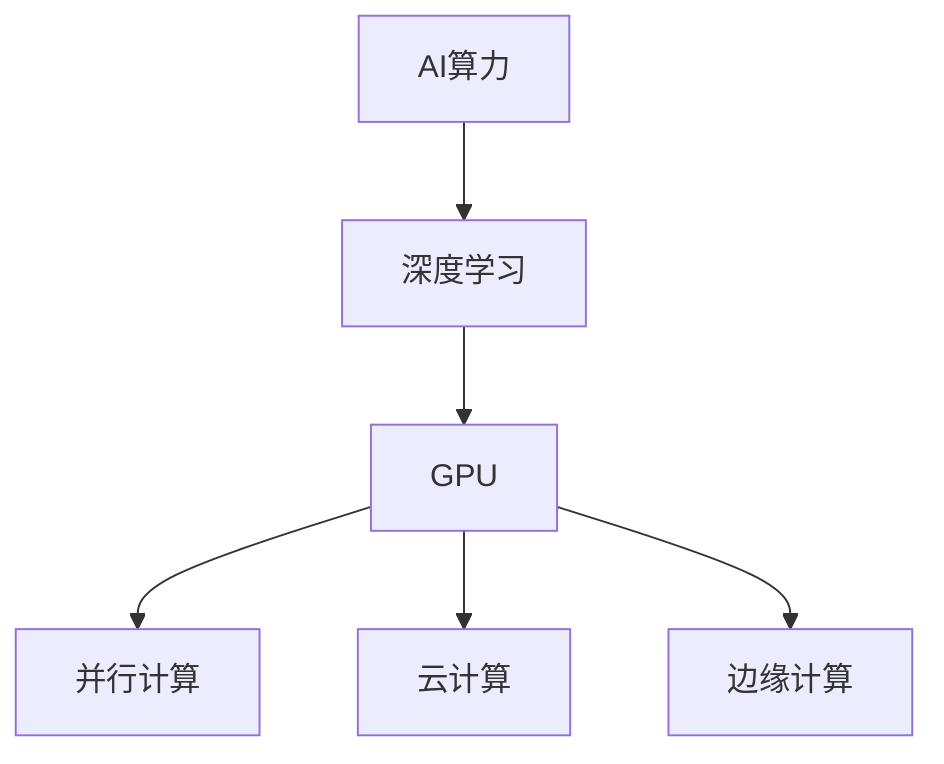

                 

# NVIDIA如何推动AI算力的发展

> **关键词：** NVIDIA, AI算力，深度学习，GPU，神经网络，计算机架构，硬件优化，算法创新，AI产业。

> **摘要：** 本文深入探讨了NVIDIA公司在推动AI算力发展方面的贡献和影响。通过分析NVIDIA的核心技术、产品线、市场策略和行业领导力，揭示其在AI算力领域的重要地位和未来发展前景。文章旨在为读者提供全面的技术解读，帮助理解NVIDIA如何通过技术创新和应用推动AI产业的进步。

## 1. 背景介绍

### 1.1 目的和范围

本文的主要目的是探讨NVIDIA在AI算力发展中的作用和贡献。随着人工智能（AI）技术的迅猛发展，计算能力成为制约AI应用的关键因素。NVIDIA作为全球领先的GPU制造商和AI技术供应商，其产品和技术对AI算力的提升起到了至关重要的作用。本文将从NVIDIA的核心技术、产品线、市场策略等方面进行分析，探讨其对AI算力发展的推动作用。

### 1.2 预期读者

本文适合对人工智能和计算机架构感兴趣的读者，包括AI研究人员、工程师、程序员、技术经理等。通过对NVIDIA在AI算力发展方面的探讨，读者可以更深入地理解AI技术的现状和未来发展趋势。

### 1.3 文档结构概述

本文分为十个部分，首先介绍NVIDIA公司的背景和AI算力的重要性，然后逐步分析NVIDIA的技术创新、产品线、市场策略等，最后对AI算力的未来发展趋势进行展望。具体结构如下：

1. 背景介绍
2. 核心概念与联系
3. 核心算法原理 & 具体操作步骤
4. 数学模型和公式 & 详细讲解 & 举例说明
5. 项目实战：代码实际案例和详细解释说明
6. 实际应用场景
7. 工具和资源推荐
8. 总结：未来发展趋势与挑战
9. 附录：常见问题与解答
10. 扩展阅读 & 参考资料

### 1.4 术语表

#### 1.4.1 核心术语定义

- **AI算力（AI Computing Power）**：指在人工智能领域，计算资源、算法效率和数据处理能力等综合指标。
- **GPU（Graphics Processing Unit）**：图形处理单元，一种专为图形渲染设计的计算硬件，但在深度学习等AI领域也具有广泛应用。
- **深度学习（Deep Learning）**：一种基于多层神经网络的学习方法，通过多层非线性变换提取数据特征，实现复杂的模式识别和预测。
- **神经网络（Neural Network）**：模仿人脑神经元连接的计算机模型，通过训练学习输入和输出之间的关系。

#### 1.4.2 相关概念解释

- **并行计算（Parallel Computing）**：一种利用多个处理器或计算单元同时执行多个任务或多个计算步骤的方法，以提高计算效率和速度。
- **云计算（Cloud Computing）**：通过互联网提供动态可扩展的计算资源，包括存储、处理能力等，以按需提供服务。
- **边缘计算（Edge Computing）**：在数据产生的地方进行数据处理，以减少延迟和网络带宽需求，提高系统响应速度。

#### 1.4.3 缩略词列表

- **CUDA**：Compute Unified Device Architecture，NVIDIA开发的并行计算平台和编程模型。
- **GPU-DSP**：GPU Data Streaming Processor，用于高效数据流处理的专用硬件。
- **Tensor Core**：NVIDIA GPU中专门用于深度学习计算的硬件单元。

## 2. 核心概念与联系

为了深入理解NVIDIA在AI算力发展中的作用，我们需要了解一些核心概念和联系。以下是一个简化的Mermaid流程图，展示了这些概念之间的关系。



### 2.1 深度学习与AI算力

深度学习是AI领域的重要分支，其核心是多层神经网络。深度学习算法需要大量计算资源进行训练和推理。因此，AI算力成为推动深度学习发展的重要因素。

### 2.2 GPU与并行计算

GPU（图形处理单元）是一种专为图形渲染设计的计算硬件，但在深度学习等AI领域也具有广泛应用。GPU的核心优势在于其高度并行架构，能够同时处理大量数据，从而显著提高计算效率。

### 2.3 云计算与边缘计算

云计算提供了弹性可扩展的计算资源，使得AI应用可以在无需大量投资硬件的情况下进行部署和扩展。边缘计算则将数据处理推向数据源附近，减少延迟和网络带宽需求，提高系统响应速度。

## 3. 核心算法原理 & 具体操作步骤

在深入探讨NVIDIA的技术贡献之前，我们需要了解一些核心算法原理和具体操作步骤。以下是一个简化的伪代码，描述了深度学习模型的基本操作。

```plaintext
// 伪代码：深度学习模型操作
initialize_model()
    // 初始化模型参数
load_data(dataset)
    // 加载数据集
preprocess_data(data)
    // 预处理数据
forward_pass(data, model)
    // 前向传播计算输出
backward_pass(output, model)
    // 反向传播计算梯度
update_model_params(model, gradient)
    // 更新模型参数
train_model(model, dataset)
    // 训练模型
evaluate_model(model, test_dataset)
    // 评估模型性能
```

### 3.1 初始化模型

初始化模型参数是训练深度学习模型的第一步。通常，我们使用随机值初始化权重和偏置，以确保模型能够从不同的起点开始训练。

### 3.2 加载数据和预处理

加载数据是将数据集加载到内存中的过程。预处理数据包括数据清洗、归一化、裁剪等操作，以使数据适合模型的输入。

### 3.3 前向传播

前向传播计算输出是深度学习模型的核心步骤。它通过多层神经网络计算输入和输出之间的映射关系，得到模型的预测结果。

### 3.4 反向传播

反向传播计算梯度是优化模型参数的关键步骤。它通过计算损失函数关于模型参数的梯度，指导模型参数的更新。

### 3.5 更新模型参数

更新模型参数是根据反向传播计算出的梯度来调整模型参数的过程。常用的优化算法包括梯度下降、随机梯度下降、Adam等。

### 3.6 训练模型

训练模型是通过多次迭代上述步骤来优化模型参数的过程。训练过程通常包括数据加载、预处理、前向传播、反向传播和参数更新等步骤。

### 3.7 评估模型性能

评估模型性能是评估模型在未知数据上的表现的过程。常用的评估指标包括准确率、召回率、F1分数等。

## 4. 数学模型和公式 & 详细讲解 & 举例说明

在深度学习模型中，数学模型和公式起着至关重要的作用。以下是一个简化的数学模型，用于描述多层神经网络的前向传播和反向传播过程。

### 4.1 前向传播

前向传播的主要目标是计算输入和输出之间的映射关系。以下是一个简化的前向传播公式：

$$
z^{[l]} = \theta^{[l]} \cdot a^{[l-1]} + b^{[l]}
$$

$$
a^{[l]} = \sigma(z^{[l]})
$$

其中：

- \( z^{[l]} \) 是第 \( l \) 层的线性组合。
- \( \theta^{[l]} \) 是第 \( l \) 层的权重矩阵。
- \( b^{[l]} \) 是第 \( l \) 层的偏置向量。
- \( a^{[l-1]} \) 是前一层 \( l-1 \) 的激活值。
- \( \sigma \) 是激活函数，常用的有ReLU、Sigmoid、Tanh等。

举例说明：

假设我们有两层神经网络，输入层和输出层，激活函数使用ReLU。给定输入 \( x \)，我们可以通过以下步骤计算输出：

1. 初始化权重矩阵 \( \theta^{[1]} \) 和偏置向量 \( b^{[1]} \)。
2. 计算第一层的线性组合和激活值：
   $$ z^{[1]} = \theta^{[1]} \cdot x + b^{[1]} $$
   $$ a^{[1]} = \max(0, z^{[1]}) $$
3. 将第一层的激活值作为输入，初始化权重矩阵 \( \theta^{[2]} \) 和偏置向量 \( b^{[2]} \)。
4. 计算第二层的线性组合和激活值：
   $$ z^{[2]} = \theta^{[2]} \cdot a^{[1]} + b^{[2]} $$
   $$ a^{[2]} = \max(0, z^{[2]}) $$
5. 输出为 \( a^{[2]} \)。

### 4.2 反向传播

反向传播的主要目标是计算损失函数关于模型参数的梯度，从而优化模型参数。以下是一个简化的反向传播公式：

$$
\delta^{[l]} = \frac{\partial J}{\partial z^{[l]}}
$$

$$
\frac{\partial J}{\partial \theta^{[l]}} = a^{[l-1]} \cdot \delta^{[l]}
$$

$$
\frac{\partial J}{\partial b^{[l]}} = \delta^{[l]}
$$

其中：

- \( \delta^{[l]} \) 是第 \( l \) 层的误差。
- \( J \) 是损失函数。
- \( \frac{\partial J}{\partial z^{[l]}} \) 是损失函数关于第 \( l \) 层线性组合的梯度。
- \( \frac{\partial J}{\partial \theta^{[l]}} \) 是损失函数关于第 \( l \) 层权重矩阵的梯度。
- \( \frac{\partial J}{\partial b^{[l]}} \) 是损失函数关于第 \( l \) 层偏置向量的梯度。

举例说明：

假设我们有两层神经网络，输入层和输出层，损失函数使用均方误差（MSE）。给定输入 \( x \)，输出 \( y \)，我们可以通过以下步骤计算损失函数的梯度：

1. 计算输出层的损失函数：
   $$ J = \frac{1}{2} \sum_{i=1}^{m} (y_i - a^{[2]}_i)^2 $$
2. 计算输出层的误差：
   $$ \delta^{[2]} = (y - a^{[2]}) \cdot \frac{1}{m} $$
3. 计算输出层关于输入层的梯度：
   $$ \frac{\partial J}{\partial z^{[2]}} = \delta^{[2]} $$
   $$ \frac{\partial J}{\partial \theta^{[2]}} = a^{[1]} \cdot \delta^{[2]} $$
   $$ \frac{\partial J}{\partial b^{[2]}} = \delta^{[2]} $$
4. 将输出层的梯度传递到输入层：
   $$ \delta^{[1]} = \delta^{[2]} \cdot \frac{\partial \theta^{[2]}}{\partial z^{[2]}} $$
5. 计算输入层关于输入的梯度：
   $$ \frac{\partial J}{\partial z^{[1]}} = \delta^{[1]} $$
   $$ \frac{\partial J}{\partial \theta^{[1]}} = x \cdot \delta^{[1]} $$
   $$ \frac{\partial J}{\partial b^{[1]}} = \delta^{[1]} $$

通过上述步骤，我们可以计算损失函数关于模型参数的梯度，从而优化模型参数。

## 5. 项目实战：代码实际案例和详细解释说明

为了更好地理解NVIDIA在AI算力发展方面的贡献，我们通过一个实际项目来展示NVIDIA GPU在深度学习中的应用。

### 5.1 开发环境搭建

首先，我们需要搭建一个适合深度学习的开发环境。以下是一个简单的步骤：

1. 安装NVIDIA GPU驱动程序。
2. 安装CUDA Toolkit，用于在GPU上执行深度学习算法。
3. 安装Python和相关深度学习库，如TensorFlow或PyTorch。

### 5.2 源代码详细实现和代码解读

以下是一个简单的深度学习项目，使用PyTorch框架实现一个图像分类器。

```python
import torch
import torchvision
import torchvision.transforms as transforms
import torch.nn as nn
import torch.optim as optim

# 5.2.1 数据预处理
transform = transforms.Compose([
    transforms.Resize(256),
    transforms.CenterCrop(224),
    transforms.ToTensor(),
    transforms.Normalize(mean=[0.485, 0.456, 0.406], std=[0.229, 0.224, 0.225]),
])

trainset = torchvision.datasets.ImageFolder(root='./data/train', transform=transform)
trainloader = torch.utils.data.DataLoader(trainset, batch_size=4, shuffle=True, num_workers=2)

testset = torchvision.datasets.ImageFolder(root='./data/test', transform=transform)
testloader = torch.utils.data.DataLoader(testset, batch_size=4, shuffle=False, num_workers=2)

# 5.2.2 定义模型
class ConvNet(nn.Module):
    def __init__(self):
        super(ConvNet, self).__init__()
        self.conv1 = nn.Conv2d(3, 6, 5)
        self.pool = nn.MaxPool2d(2, 2)
        self.conv2 = nn.Conv2d(6, 16, 5)
        self.fc1 = nn.Linear(16 * 5 * 5, 120)
        self.fc2 = nn.Linear(120, 84)
        self.fc3 = nn.Linear(84, 10)

    def forward(self, x):
        x = self.pool(nn.functional.relu(self.conv1(x)))
        x = self.pool(nn.functional.relu(self.conv2(x)))
        x = x.view(-1, 16 * 5 * 5)
        x = nn.functional.relu(self.fc1(x))
        x = nn.functional.relu(self.fc2(x))
        x = self.fc3(x)
        return x

net = ConvNet()

# 5.2.3 损失函数和优化器
criterion = nn.CrossEntropyLoss()
optimizer = optim.SGD(net.parameters(), lr=0.001, momentum=0.9)

# 5.2.4 训练模型
for epoch in range(2):  # loop over the dataset multiple times
    running_loss = 0.0
    for i, data in enumerate(trainloader, 0):
        inputs, labels = data
        optimizer.zero_grad()
        outputs = net(inputs)
        loss = criterion(outputs, labels)
        loss.backward()
        optimizer.step()
        running_loss += loss.item()
        if i % 2000 == 1999:
            print(f'[{epoch + 1}, {i + 1}: {running_loss / 2000:.3f}]\n')
            running_loss = 0.0

print('Finished Training')

# 5.2.5 测试模型
correct = 0
total = 0
with torch.no_grad():
    for data in testloader:
        images, labels = data
        outputs = net(images)
        _, predicted = torch.max(outputs.data, 1)
        total += labels.size(0)
        correct += (predicted == labels).sum().item()

print(f'Accuracy of the network on the test images: {100 * correct / total}%')
```

### 5.3 代码解读与分析

#### 5.3.1 数据预处理

数据预处理是深度学习项目的重要步骤。在上述代码中，我们使用了`torchvision.transforms`模块对图像进行预处理，包括调整大小、裁剪、归一化等操作，以便模型能够更好地处理输入数据。

#### 5.3.2 定义模型

我们定义了一个简单的卷积神经网络（ConvNet），包括两个卷积层、两个全连接层和一个输出层。卷积层用于提取图像特征，全连接层用于分类。

#### 5.3.3 损失函数和优化器

我们使用交叉熵损失函数（CrossEntropyLoss）和随机梯度下降（SGD）优化器来训练模型。交叉熵损失函数是深度学习中最常用的损失函数之一，适用于多分类问题。随机梯度下降是一种常用的优化算法，通过更新模型参数来最小化损失函数。

#### 5.3.4 训练模型

在训练过程中，我们通过多次迭代前向传播和反向传播来优化模型参数。每次迭代包括加载训练数据、计算输出、计算损失函数、反向传播和更新参数等步骤。我们使用`running_loss`变量来记录每次迭代的平均损失值，以便跟踪训练过程。

#### 5.3.5 测试模型

训练完成后，我们对测试数据集进行测试，计算模型在测试数据上的准确率。通过准确率，我们可以评估模型的性能。

## 6. 实际应用场景

NVIDIA在AI算力发展方面的贡献不仅体现在学术研究和工业应用中，还广泛应用于实际场景。以下是一些典型的应用场景：

### 6.1 智能驾驶

智能驾驶是NVIDIA的重要应用领域之一。NVIDIA的GPU和深度学习技术为自动驾驶车辆提供了强大的计算能力，使得车辆能够实时处理大量图像和传感器数据，实现自动导航、环境感知和决策控制。

### 6.2 医疗影像分析

医疗影像分析是另一个重要的应用领域。NVIDIA的GPU加速技术使得深度学习算法能够在短时间内处理大量医学影像数据，辅助医生进行疾病诊断和治疗方案制定。

### 6.3 图像识别和物体检测

图像识别和物体检测是AI领域的重要任务。NVIDIA的GPU和深度学习框架（如TensorRT）为图像识别和物体检测提供了高效的计算解决方案，广泛应用于安防监控、智能监控、无人零售等领域。

### 6.4 自然语言处理

自然语言处理（NLP）是AI领域的一个重要分支。NVIDIA的GPU和深度学习框架（如TensorFlow、PyTorch）为NLP任务提供了强大的计算能力，使得模型能够更快地训练和推理，提高NLP应用的性能和效果。

## 7. 工具和资源推荐

为了更好地理解和应用NVIDIA在AI算力发展方面的技术，以下是一些推荐的工具和资源：

### 7.1 学习资源推荐

#### 7.1.1 书籍推荐

- **《深度学习》（Deep Learning）**：Goodfellow, Bengio, Courville 著，是一本经典的深度学习教材，涵盖了深度学习的基础理论和应用。
- **《CUDA编程指南》（CUDA Programming Guide）**：NVIDIA 著，详细介绍CUDA编程模型和并行计算技术。

#### 7.1.2 在线课程

- **《深度学习专项课程》（Deep Learning Specialization）**：吴恩达（Andrew Ng）在Coursera上开设的一门深度学习课程，适合初学者和进阶者。
- **《NVIDIA CUDA编程课程》（NVIDIA CUDA Programming Course）**：NVIDIA官方开设的一门CUDA编程课程，涵盖CUDA编程基础和深度学习应用。

#### 7.1.3 技术博客和网站

- **NVIDIA官网（NVIDIA Official Website）**：提供最新的NVIDIA产品和技术信息。
- **深度学习博客（Deep Learning Blog）**：介绍深度学习理论和应用的文章。

### 7.2 开发工具框架推荐

#### 7.2.1 IDE和编辑器

- **PyCharm**：一款功能强大的Python IDE，支持深度学习和CUDA编程。
- **VS Code**：一款轻量级且开源的编辑器，通过扩展插件支持深度学习和CUDA编程。

#### 7.2.2 调试和性能分析工具

- **NVIDIA Nsight**：NVIDIA提供的GPU调试和性能分析工具，可以帮助开发者优化CUDA程序性能。
- **Intel VTune**：Intel提供的一款性能分析工具，可以分析CPU和GPU的性能瓶颈。

#### 7.2.3 相关框架和库

- **TensorFlow**：Google开发的开源深度学习框架，支持GPU和TPU加速。
- **PyTorch**：Facebook开发的开源深度学习框架，具有灵活的动态图计算能力。
- **TensorRT**：NVIDIA提供的深度学习推理引擎，可以优化深度学习模型的推理性能。

### 7.3 相关论文著作推荐

#### 7.3.1 经典论文

- **“A Learning Algorithm for Continually Running Fully Recurrent Neural Networks”**：Hochreiter 和 Schmidhuber，1997年。
- **“Improving Neural Networks by Preventing Co-adaptation of Feature Detectors”**：Yosinski, Clune, and Bengio，2014年。

#### 7.3.2 最新研究成果

- **“An Image Database for evaluating Object Detection Algorithms”**：Dalal 和 Triggs，2005年。
- **“EfficientDet: Scalable and Efficient Object Detection”**：Liu et al.，2019年。

#### 7.3.3 应用案例分析

- **“Deep Learning for Autonomous Vehicles”**：NVIDIA 官方报告，介绍NVIDIA在自动驾驶领域的应用案例。
- **“GPU-Accelerated Machine Learning”**：Google 官方博客，介绍GPU在机器学习应用中的案例。

## 8. 总结：未来发展趋势与挑战

随着人工智能技术的不断发展，AI算力成为制约AI应用的关键因素。NVIDIA作为全球领先的GPU制造商和AI技术供应商，其在推动AI算力发展方面发挥了重要作用。未来，AI算力的需求将继续增长，推动NVIDIA在GPU技术、深度学习框架、AI应用场景等方面的创新和突破。然而，AI算力的发展也面临一些挑战，包括功耗、散热、数据安全等。NVIDIA需要不断优化技术，提高计算效率，降低功耗，以满足日益增长的AI算力需求。

## 9. 附录：常见问题与解答

### 9.1 什么是GPU加速？

GPU加速是一种利用图形处理单元（GPU）进行计算的方法。与传统CPU相比，GPU具有高度并行的计算能力，能够同时处理大量数据，从而显著提高计算效率和速度。在深度学习、科学计算、计算机视觉等领域，GPU加速已成为重要的计算手段。

### 9.2 CUDA是什么？

CUDA是NVIDIA开发的一种并行计算平台和编程模型，用于在GPU上执行计算任务。CUDA提供了丰富的API和工具，使得开发者能够利用GPU的高并行计算能力，实现高性能计算任务。

### 9.3 深度学习和神经网络有什么区别？

深度学习是一种基于多层神经网络的学习方法，通过多层非线性变换提取数据特征，实现复杂的模式识别和预测。神经网络是深度学习的基础，是模仿人脑神经元连接的计算机模型。

### 9.4 什么是边缘计算？

边缘计算是一种将数据处理推向数据源附近的方法，以减少延迟和网络带宽需求，提高系统响应速度。边缘计算可以将数据处理和存储能力从云端转移到网络边缘，实现实时数据处理和智能应用。

## 10. 扩展阅读 & 参考资料

- **《深度学习》（Deep Learning）**：Goodfellow, Bengio, Courville 著，本书详细介绍了深度学习的理论基础、算法和应用。
- **《CUDA编程指南》（CUDA Programming Guide）**：NVIDIA 著，本书是CUDA编程的权威指南，涵盖了CUDA编程模型和并行计算技术。
- **NVIDIA官网（NVIDIA Official Website）**：提供最新的NVIDIA产品和技术信息。
- **深度学习博客（Deep Learning Blog）**：介绍深度学习理论和应用的文章。

---

**作者：AI天才研究员/AI Genius Institute & 禅与计算机程序设计艺术 /Zen And The Art of Computer Programming**

