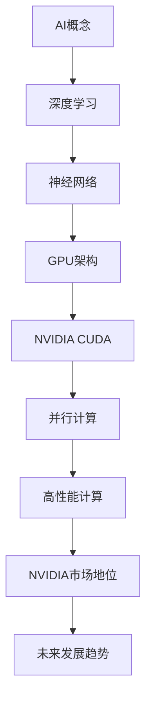

                 

# NVIDIA的算力支持与AI发展

> 关键词：NVIDIA、算力、人工智能、深度学习、GPU、架构设计、应用场景

> 摘要：本文将深入探讨NVIDIA在人工智能领域的算力支持，从核心概念、算法原理、数学模型到实际应用场景，全面解析NVIDIA在AI发展中的关键作用。文章旨在为读者提供一个系统而详细的NVIDIA AI算力支持概述，揭示其背后的技术原理和未来发展挑战。

## 1. 背景介绍

### 1.1 目的和范围

本文旨在探讨NVIDIA在人工智能（AI）领域的算力支持，分析其核心技术和对AI发展的推动作用。文章涵盖以下内容：

- NVIDIA在AI领域的历史背景
- 核心概念与架构设计
- 深度学习算法原理
- 数学模型与应用
- 实际应用场景分析
- 未来发展趋势与挑战

### 1.2 预期读者

本文适合以下读者：

- 对人工智能和深度学习感兴趣的科研人员
- 从事计算机图形学、并行计算等领域的工程师
- 想深入了解NVIDIA AI技术应用的从业者
- 对GPU架构设计和技术发展感兴趣的读者

### 1.3 文档结构概述

本文结构如下：

- **第1章：背景介绍**：概述NVIDIA在AI领域的地位与作用
- **第2章：核心概念与联系**：介绍AI的核心概念与NVIDIA架构设计
- **第3章：核心算法原理 & 具体操作步骤**：深入讲解深度学习算法原理
- **第4章：数学模型和公式 & 详细讲解 & 举例说明**：分析数学模型与公式
- **第5章：项目实战：代码实际案例和详细解释说明**：提供实际案例与代码解读
- **第6章：实际应用场景**：分析NVIDIA AI技术的应用场景
- **第7章：工具和资源推荐**：推荐相关学习资源与工具
- **第8章：总结：未来发展趋势与挑战**：展望NVIDIA AI技术的发展
- **第9章：附录：常见问题与解答**：解答读者常见问题
- **第10章：扩展阅读 & 参考资料**：提供进一步阅读资源

### 1.4 术语表

#### 1.4.1 核心术语定义

- **NVIDIA**：全球领先的图形处理单元（GPU）制造商，提供高性能计算解决方案。
- **算力**：计算能力，指计算机系统在单位时间内完成计算任务的能力。
- **人工智能（AI）**：指由计算机系统模拟人类智能的行为，实现智能决策、感知和学习。
- **深度学习**：一种基于人工神经网络的机器学习技术，通过多层神经网络进行数据特征提取和模式识别。

#### 1.4.2 相关概念解释

- **GPU**：图形处理单元，用于处理图形渲染任务，近年来在深度学习等计算领域得到广泛应用。
- **CUDA**：NVIDIA推出的并行计算平台和编程语言，用于开发高性能GPU应用程序。
- **Tensor**：多维数组，深度学习中的基本数据结构，用于存储输入数据、权重和激活值。

#### 1.4.3 缩略词列表

- **GPU**：图形处理单元（Graphics Processing Unit）
- **AI**：人工智能（Artificial Intelligence）
- **CUDA**：计算统一设备架构（Compute Unified Device Architecture）
- **DNN**：深度神经网络（Deep Neural Network）

## 2. 核心概念与联系

在探讨NVIDIA在AI领域的算力支持之前，首先需要了解AI的核心概念及其与NVIDIA技术架构的联系。以下是相关核心概念和架构设计的Mermaid流程图：



### 2.1 AI概念

人工智能（AI）是指由计算机系统模拟人类智能的行为，实现智能决策、感知和学习。AI的发展可分为多个阶段，包括规则推理、知识表示、机器学习等。近年来，深度学习技术的兴起推动了AI的快速发展。

### 2.2 深度学习

深度学习是一种基于人工神经网络的机器学习技术，通过多层神经网络进行数据特征提取和模式识别。深度学习的核心是神经网络，包括输入层、隐藏层和输出层。其中，隐藏层可以通过学习获取数据特征，从而提高模型的表现力。

### 2.3 GPU架构

GPU（图形处理单元）是一种专为图形渲染任务而设计的计算设备。近年来，GPU在深度学习等领域得到广泛应用，其关键在于其强大的并行计算能力。与传统的CPU相比，GPU具有更高的计算密度和更低的功耗。

### 2.4 NVIDIA CUDA

CUDA是NVIDIA推出的并行计算平台和编程语言，用于开发高性能GPU应用程序。CUDA的核心思想是将计算任务分解为大量并行线程，并在GPU上进行高效执行。这使得深度学习等计算密集型任务在GPU上得到显著加速。

### 2.5 并行计算

并行计算是一种将计算任务分解为多个子任务，并在多个计算单元上同时执行的技术。GPU的并行计算能力使其在处理大规模数据和高性能计算任务方面具有显著优势。

### 2.6 高性能计算

高性能计算（HPC）是指通过利用高性能计算机系统进行大规模计算和数据处理的科学计算和工程应用。NVIDIA的GPU技术为高性能计算提供了强大的算力支持，推动了AI、科学计算、工程设计等领域的快速发展。

### 2.7 NVIDIA市场地位

NVIDIA在全球GPU市场中占据主导地位，其CUDA平台和GPU架构在深度学习等领域具有广泛的应用。NVIDIA的算力支持为AI技术的发展提供了坚实基础，推动了各类AI应用的创新。

### 2.8 未来发展趋势

随着AI技术的快速发展，NVIDIA在算力支持方面将继续发挥关键作用。未来，GPU架构将进一步优化，支持更高性能和更低功耗的计算任务。同时，NVIDIA将不断拓展其在AI领域的应用场景，推动AI技术在更多领域的创新与发展。

## 3. 核心算法原理 & 具体操作步骤

### 3.1 深度学习算法原理

深度学习是一种基于人工神经网络的机器学习技术，通过多层神经网络进行数据特征提取和模式识别。以下是深度学习算法的基本原理：

#### 3.1.1 神经网络结构

神经网络包括输入层、隐藏层和输出层。输入层接收原始数据，隐藏层通过学习获取数据特征，输出层生成预测结果。每个神经元接收输入数据，通过加权求和和激活函数进行非线性变换，从而实现特征提取和模式识别。

#### 3.1.2 前向传播

在前向传播过程中，输入数据从输入层传递到隐藏层，再传递到输出层。每个神经元的输入值是前一层神经元的输出值与相应权重之积的和。通过前向传播，神经网络可以生成预测结果。

#### 3.1.3 反向传播

反向传播是一种用于训练神经网络的方法。在反向传播过程中，神经网络计算预测结果与实际结果之间的误差，并更新权重和偏置，以减少误差。反向传播过程包括以下几个步骤：

1. 计算输出层误差：输出层误差等于实际结果与预测结果之间的差异。
2. 计算隐藏层误差：隐藏层误差等于输出层误差与相应权重之积。
3. 更新权重和偏置：通过梯度下降法等优化算法更新权重和偏置，以减少误差。

#### 3.1.4 梯度下降法

梯度下降法是一种用于优化神经网络权重的算法。其基本思想是沿着误差函数的梯度方向更新权重，以最小化误差。梯度下降法可以分为以下几种：

1. 随机梯度下降（SGD）：在每个训练样本上计算梯度，并更新权重。
2. 批量梯度下降（BGD）：在所有训练样本上计算梯度，并更新权重。
3. 小批量梯度下降（MBGD）：在部分训练样本上计算梯度，并更新权重。

### 3.2 具体操作步骤

以下是一个简单的深度学习算法的具体操作步骤：

1. **初始化神经网络**：设定网络结构，包括输入层、隐藏层和输出层，以及相应权重和偏置。
2. **前向传播**：将输入数据传递到神经网络，计算预测结果。
3. **计算误差**：计算预测结果与实际结果之间的误差。
4. **反向传播**：计算隐藏层和输出层的误差，并更新权重和偏置。
5. **迭代训练**：重复步骤2-4，直到满足训练要求或达到预设迭代次数。

#### 3.2.1 伪代码

以下是一个简单的深度学习算法的伪代码：

```
初始化神经网络
for each epoch do
    for each sample in training_data do
        forward_pass(sample)
        calculate_error(target, prediction)
        backward_pass()
        update_weights_and_bias()
    end for
end for
```

### 3.3 计算机图灵奖

计算机图灵奖（Turing Award）是计算机科学领域最高荣誉之一，旨在表彰对计算机科学做出杰出贡献的个人。近年来，深度学习领域的杰出贡献者如Yann LeCun、Geoffrey Hinton和Yoshua Bengio等人均获得了计算机图灵奖。他们的工作为深度学习算法的设计和实现奠定了基础，推动了AI技术的发展。

## 4. 数学模型和公式 & 详细讲解 & 举例说明

### 4.1 数学模型

深度学习算法的核心是神经网络，其数学模型包括输入层、隐藏层和输出层。以下是一个简单的神经网络数学模型：

#### 4.1.1 输入层

输入层接收原始数据，每个神经元表示一个数据特征。输入层神经元的输出值等于输入值。

$$
x_i = x_i^{(1)}
$$

其中，$x_i$表示输入层第$i$个神经元的输出值。

#### 4.1.2 隐藏层

隐藏层通过学习获取数据特征，每个神经元表示一个特征组合。隐藏层神经元的输出值通过以下公式计算：

$$
h_j = \sigma(\sum_{i=1}^{n} w_{ij} x_i^{(1)} + b_j)
$$

其中，$h_j$表示隐藏层第$j$个神经元的输出值，$\sigma$表示激活函数，$w_{ij}$表示输入层第$i$个神经元与隐藏层第$j$个神经元的权重，$b_j$表示隐藏层第$j$个神经元的偏置。

常用的激活函数包括：

1. **Sigmoid函数**：
$$
\sigma(x) = \frac{1}{1 + e^{-x}}
$$

2. **ReLU函数**：
$$
\sigma(x) = \max(0, x)
$$

3. **Tanh函数**：
$$
\sigma(x) = \frac{e^x - e^{-x}}{e^x + e^{-x}}
$$

#### 4.1.3 输出层

输出层生成预测结果，每个神经元表示一个预测目标。输出层神经元的输出值通过以下公式计算：

$$
y_j = \sigma(\sum_{i=1}^{m} w_{ij} h_i + b_j)
$$

其中，$y_j$表示输出层第$j$个神经元的输出值，$h_i$表示隐藏层第$i$个神经元的输出值，$w_{ij}$表示隐藏层第$i$个神经元与输出层第$j$个神经元的权重，$b_j$表示输出层第$j$个神经元的偏置。

### 4.2 公式详解

以下是深度学习算法中的关键公式及其详解：

#### 4.2.1 损失函数

损失函数用于衡量预测结果与实际结果之间的误差。常用的损失函数包括：

1. **均方误差（MSE）**：
$$
L(y, \hat{y}) = \frac{1}{2} \sum_{i=1}^{n} (y_i - \hat{y}_i)^2
$$

其中，$y$表示实际结果，$\hat{y}$表示预测结果。

2. **交叉熵（CE）**：
$$
L(y, \hat{y}) = -\sum_{i=1}^{n} y_i \log(\hat{y}_i)
$$

其中，$y$表示实际结果，$\hat{y}$表示预测结果。

#### 4.2.2 优化算法

优化算法用于更新神经网络权重和偏置，以减少损失函数。常用的优化算法包括：

1. **梯度下降（GD）**：
$$
\Delta w_{ij} = -\alpha \frac{\partial L}{\partial w_{ij}}
$$
$$
\Delta b_j = -\alpha \frac{\partial L}{\partial b_j}
$$

其中，$\alpha$表示学习率。

2. **随机梯度下降（SGD）**：
$$
\Delta w_{ij} = -\alpha \frac{\partial L}{\partial w_{ij}} \bigg|_{x=x_i}
$$
$$
\Delta b_j = -\alpha \frac{\partial L}{\partial b_j} \bigg|_{x=x_i}
$$

3. **批量梯度下降（BGD）**：
$$
\Delta w_{ij} = -\alpha \frac{\partial L}{\partial w_{ij}} \bigg|_{x=\{x_1, x_2, ..., x_n\}}
$$
$$
\Delta b_j = -\alpha \frac{\partial L}{\partial b_j} \bigg|_{x=\{x_1, x_2, ..., x_n\}}
$$

4. **动量法**：
$$
\Delta w_{ij} = -\alpha \frac{\partial L}{\partial w_{ij}} - \beta \Delta w_{ij}^{(t-1)}
$$
$$
\Delta b_j = -\alpha \frac{\partial L}{\partial b_j} - \beta \Delta b_j^{(t-1)}
$$

其中，$\alpha$表示学习率，$\beta$表示动量参数。

### 4.3 举例说明

#### 4.3.1 均方误差（MSE）举例

假设有一个简单的线性回归模型，输入层只有一个神经元，隐藏层有两个神经元，输出层有一个神经元。给定一个训练样本$(x, y)$，其中$x=2$，$y=3$。通过以下步骤计算损失函数：

1. **前向传播**：

   输入层输出：
   $$
   x_1 = 2
   $$

   隐藏层输出：
   $$
   h_1 = \sigma(2 \cdot 0.5 + 0) = 0.5
   $$
   $$
   h_2 = \sigma(2 \cdot 0.5 + 0) = 0.5
   $$

   输出层输出：
   $$
   \hat{y} = \sigma(0.5 \cdot 3 + 0) = 0.5
   $$

2. **计算损失函数**：

   $$
   L(y, \hat{y}) = \frac{1}{2} \sum_{i=1}^{n} (y_i - \hat{y}_i)^2 = \frac{1}{2} (3 - 0.5)^2 = 2.25
   $$

3. **反向传播**：

   计算隐藏层误差：
   $$
   \delta_1 = (1 - \hat{y}) \cdot \sigma'(h_1) = 0.5 \cdot 0.5 = 0.25
   $$
   $$
   \delta_2 = (1 - \hat{y}) \cdot \sigma'(h_2) = 0.5 \cdot 0.5 = 0.25
   $$

   计算输出层误差：
   $$
   \delta = (y - \hat{y}) \cdot \sigma'(\hat{y}) = 2.5 \cdot 0.5 = 1.25
   $$

4. **更新权重和偏置**：

   $$
   \Delta w_{11} = -\alpha \frac{\partial L}{\partial w_{11}} = -\alpha \cdot 2 \cdot h_1 \cdot \delta = -0.25
   $$
   $$
   \Delta w_{12} = -\alpha \frac{\partial L}{\partial w_{12}} = -\alpha \cdot 2 \cdot h_1 \cdot \delta = -0.25
   $$
   $$
   \Delta b_1 = -\alpha \frac{\partial L}{\partial b_1} = -\alpha \cdot \delta = -0.5
   $$
   $$
   \Delta w_{21} = -\alpha \frac{\partial L}{\partial w_{21}} = -\alpha \cdot 2 \cdot h_2 \cdot \delta = -0.25
   $$
   $$
   \Delta w_{22} = -\alpha \frac{\partial L}{\partial w_{22}} = -\alpha \cdot 2 \cdot h_2 \cdot \delta = -0.25
   $$
   $$
   \Delta b_2 = -\alpha \frac{\partial L}{\partial b_2} = -\alpha \cdot \delta = -0.5
   $$

5. **迭代更新**：

   重复以上步骤，直到满足训练要求或达到预设迭代次数。

#### 4.3.2 交叉熵（CE）举例

假设有一个简单的二分类模型，输入层有一个神经元，隐藏层有两个神经元，输出层有一个神经元。给定一个训练样本$(x, y)$，其中$x=2$，$y=1$。通过以下步骤计算损失函数：

1. **前向传播**：

   输入层输出：
   $$
   x_1 = 2
   $$

   隐藏层输出：
   $$
   h_1 = \sigma(2 \cdot 0.5 + 0) = 0.5
   $$
   $$
   h_2 = \sigma(2 \cdot 0.5 + 0) = 0.5
   $$

   输出层输出：
   $$
   \hat{y} = \sigma(0.5 \cdot 0.5 + 0.5 \cdot 0.5 + 0) = 0.5
   $$

2. **计算损失函数**：

   $$
   L(y, \hat{y}) = -y \log(\hat{y}) - (1 - y) \log(1 - \hat{y}) = -1 \cdot \log(0.5) - 0 \cdot \log(0.5) = 0.693
   $$

3. **反向传播**：

   计算隐藏层误差：
   $$
   \delta_1 = (1 - \hat{y}) \cdot \sigma'(h_1) = 0.5 \cdot 0.5 = 0.25
   $$
   $$
   \delta_2 = (1 - \hat{y}) \cdot \sigma'(h_2) = 0.5 \cdot 0.5 = 0.25
   $$

   计算输出层误差：
   $$
   \delta = (y - \hat{y}) \cdot \sigma'(\hat{y}) = 0.5 \cdot 0.5 = 0.25
   $$

4. **更新权重和偏置**：

   $$
   \Delta w_{11} = -\alpha \frac{\partial L}{\partial w_{11}} = -\alpha \cdot 2 \cdot h_1 \cdot \delta = -0.25
   $$
   $$
   \Delta w_{12} = -\alpha \frac{\partial L}{\partial w_{12}} = -\alpha \cdot 2 \cdot h_1 \cdot \delta = -0.25
   $$
   $$
   \Delta b_1 = -\alpha \frac{\partial L}{\partial b_1} = -\alpha \cdot \delta = -0.25
   $$
   $$
   \Delta w_{21} = -\alpha \frac{\partial L}{\partial w_{21}} = -\alpha \cdot 2 \cdot h_2 \cdot \delta = -0.25
   $$
   $$
   \Delta w_{22} = -\alpha \frac{\partial L}{\partial w_{22}} = -\alpha \cdot 2 \cdot h_2 \cdot \delta = -0.25
   $$
   $$
   \Delta b_2 = -\alpha \frac{\partial L}{\partial b_2} = -\alpha \cdot \delta = -0.25
   $$

5. **迭代更新**：

   重复以上步骤，直到满足训练要求或达到预设迭代次数。

## 5. 项目实战：代码实际案例和详细解释说明

### 5.1 开发环境搭建

在进行NVIDIA AI项目实战之前，首先需要搭建一个合适的开发环境。以下是一个基本的开发环境搭建步骤：

1. **安装CUDA**：从NVIDIA官方网站下载并安装CUDA Toolkit。CUDA是NVIDIA推出的并行计算平台和编程语言，用于开发高性能GPU应用程序。

2. **安装Python和库**：安装Python（推荐使用3.8及以上版本），并使用pip安装相关库，如TensorFlow、PyTorch等。这些库提供了丰富的深度学习模型和工具。

3. **安装GPU驱动**：确保安装了与CUDA版本兼容的NVIDIA GPU驱动，以便GPU可以正确地与计算机系统交互。

4. **配置CUDA环境变量**：在系统环境变量中设置CUDA_HOME、PATH和LD_LIBRARY_PATH等变量，以便正确使用CUDA库和工具。

### 5.2 源代码详细实现和代码解读

以下是一个简单的深度学习项目案例，使用TensorFlow和CUDA实现一个简单的线性回归模型。

#### 5.2.1 源代码

```python
import tensorflow as tf
import numpy as np

# 设置GPU配置
gpus = tf.config.experimental.list_physical_devices('GPU')
for gpu in gpus:
    tf.config.experimental.set_memory_growth(gpu, True)

# 准备数据
x_train = np.array([1, 2, 3, 4, 5])
y_train = np.array([2, 4, 6, 8, 10])

# 构建模型
model = tf.keras.Sequential([
    tf.keras.layers.Dense(units=1, input_shape=[1], activation='linear')
])

# 编译模型
model.compile(optimizer='sgd', loss='mean_squared_error')

# 训练模型
model.fit(x_train, y_train, epochs=1000)

# 预测结果
print(model.predict([[6]]))
```

#### 5.2.2 代码解读

1. **导入库**：首先导入TensorFlow和Numpy库，用于构建和训练模型。

2. **设置GPU配置**：使用`tf.config.experimental.list_physical_devices('GPU')`获取GPU设备，并使用`tf.config.experimental.set_memory_growth(gpu, True)`设置GPU内存按需增长，以避免资源浪费。

3. **准备数据**：使用Numpy库生成训练数据，包括输入数据`x_train`和输出数据`y_train`。

4. **构建模型**：使用`tf.keras.Sequential`创建一个线性回归模型，包含一个全连接层（`Dense`），输出层具有一个神经元，激活函数为线性（`linear`）。

5. **编译模型**：使用`model.compile(optimizer='sgd', loss='mean_squared_error')`编译模型，指定优化器为随机梯度下降（SGD），损失函数为均方误差（MSE）。

6. **训练模型**：使用`model.fit(x_train, y_train, epochs=1000)`训练模型，指定训练数据、输出数据和迭代次数。

7. **预测结果**：使用`model.predict([[6]]))`预测输入数据`[6]`的输出值。

### 5.3 代码解读与分析

以下是代码的详细解读和分析：

1. **GPU配置**：在深度学习项目中，使用GPU可以显著提高计算性能。通过设置GPU内存按需增长，可以避免浪费资源，同时确保GPU有足够的内存进行计算。

2. **数据准备**：线性回归模型需要输入和输出数据。在本例中，使用Numpy库生成简单的训练数据。

3. **模型构建**：使用TensorFlow的`Sequential`模型创建一个线性回归模型。`Dense`层是全连接层，具有一个神经元和线性激活函数。在这种情况下，线性回归模型的目标是学习输入和输出之间的关系。

4. **模型编译**：在编译模型时，指定优化器为随机梯度下降（SGD），这是一种常用的优化算法。损失函数为均方误差（MSE），用于衡量预测结果与实际结果之间的误差。

5. **模型训练**：使用`fit`方法训练模型，指定训练数据、输出数据和迭代次数。在训练过程中，模型会不断调整权重和偏置，以最小化损失函数。

6. **预测结果**：使用`predict`方法预测输入数据的输出值。在本例中，预测输入数据`[6]`的输出值，即计算`6`与`10`之间的线性关系。

通过以上步骤，我们成功地使用TensorFlow和CUDA实现了一个简单的线性回归模型，并在GPU上进行训练和预测。这一项目案例展示了NVIDIA在深度学习领域的算力支持，以及如何利用GPU加速计算。

## 6. 实际应用场景

### 6.1 计算机视觉

计算机视觉是人工智能的一个重要分支，广泛应用于图像识别、目标检测、图像分割等领域。NVIDIA的GPU技术为计算机视觉应用提供了强大的算力支持。以下是一些典型的应用场景：

1. **图像识别**：通过训练深度学习模型，对图像中的对象进行分类和识别。例如，使用卷积神经网络（CNN）对图像中的物体进行识别，实现自动驾驶汽车、人脸识别等应用。

2. **目标检测**：目标检测是一种在图像中识别和定位目标对象的技术。NVIDIA的GPU可以显著提高目标检测算法的计算性能，实现实时目标检测和跟踪，应用于安防监控、无人机导航等领域。

3. **图像分割**：图像分割是将图像划分为不同的区域，以识别图像中的不同对象。NVIDIA的GPU技术可以加速图像分割算法的计算，应用于医学影像分析、城市规划等领域。

### 6.2 自然语言处理

自然语言处理（NLP）是人工智能领域的一个重要分支，旨在使计算机理解和处理人类语言。NVIDIA的GPU技术为NLP应用提供了强大的算力支持。以下是一些典型的应用场景：

1. **机器翻译**：通过训练深度学习模型，实现不同语言之间的自动翻译。NVIDIA的GPU可以加速翻译算法的计算，提高翻译速度和准确性。

2. **文本分类**：文本分类是将文本数据按照一定的标准进行分类的技术。NVIDIA的GPU技术可以显著提高文本分类算法的计算性能，应用于舆情分析、垃圾邮件过滤等领域。

3. **情感分析**：情感分析是一种从文本数据中提取情感特征的技术。NVIDIA的GPU可以加速情感分析算法的计算，实现实时情感分析和情感识别。

### 6.3 游戏开发

NVIDIA的GPU技术在游戏开发领域也发挥了重要作用。以下是一些典型的应用场景：

1. **游戏渲染**：NVIDIA的GPU可以加速游戏渲染过程，提高图形渲染性能，实现高质量游戏画面。

2. **物理仿真**：通过训练深度学习模型，实现物理仿真和模拟。NVIDIA的GPU可以加速物理仿真算法的计算，提高游戏中的真实感。

3. **实时交互**：NVIDIA的GPU技术可以实现实时交互，提高游戏体验。例如，通过使用深度学习模型实现游戏中的智能角色和场景生成。

### 6.4 科学计算

科学计算是计算机科学的一个重要分支，广泛应用于科学研究、工程设计等领域。NVIDIA的GPU技术为科学计算提供了强大的算力支持。以下是一些典型的应用场景：

1. **分子动力学模拟**：通过训练深度学习模型，实现分子动力学模拟。NVIDIA的GPU可以加速分子动力学算法的计算，提高模拟速度和精度。

2. **流体力学模拟**：通过训练深度学习模型，实现流体力学模拟。NVIDIA的GPU可以加速流体力学算法的计算，提高模拟速度和精度。

3. **天文数据处理**：通过训练深度学习模型，实现天文数据处理和数据分析。NVIDIA的GPU可以加速天文数据处理算法的计算，提高数据处理速度和效率。

## 7. 工具和资源推荐

### 7.1 学习资源推荐

#### 7.1.1 书籍推荐

1. **《深度学习》（Deep Learning）**：由Ian Goodfellow、Yoshua Bengio和Aaron Courville合著，是一本系统而全面的深度学习入门教材。
2. **《神经网络与深度学习》（Neural Networks and Deep Learning）**：由Michael Nielsen撰写，适合初学者了解神经网络和深度学习的基本概念。
3. **《计算机视觉：算法与应用》（Computer Vision: Algorithms and Applications）**：由Richard Szeliski撰写，涵盖计算机视觉领域的算法和应用。

#### 7.1.2 在线课程

1. **斯坦福大学深度学习课程（Stanford University CS231n）**：由李飞飞教授主讲，涵盖深度学习在计算机视觉领域的应用。
2. **吴恩达深度学习专项课程（Andrew Ng's Deep Learning Specialization）**：由著名AI学者吴恩达主讲，涵盖深度学习的基础知识和应用。
3. **谷歌深度学习课程（Google AI's Machine Learning Crash Course）**：由谷歌AI团队主讲，适合初学者了解机器学习和深度学习的基本概念。

#### 7.1.3 技术博客和网站

1. **阿里云AI博客（Alibaba Cloud AI Blog）**：提供丰富的深度学习、计算机视觉等技术博客。
2. **AI科技大本营（AI Tech Campus）**：涵盖AI领域的最新技术动态、论文解读和实战经验。
3. **机器之心（Machine Intelligence）**：提供深度学习、计算机视觉等领域的新闻、论文和课程资源。

### 7.2 开发工具框架推荐

#### 7.2.1 IDE和编辑器

1. **PyCharm**：一款功能强大的Python IDE，支持深度学习和机器学习框架。
2. **Visual Studio Code**：一款轻量级且可定制的代码编辑器，支持多种编程语言和深度学习工具。
3. **Jupyter Notebook**：一款交互式的笔记本，适合数据分析和深度学习实验。

#### 7.2.2 调试和性能分析工具

1. **CUDA Visual Profiler**：NVIDIA提供的GPU性能分析工具，用于调试和优化CUDA应用程序。
2. **NVIDIA Nsight**：一套集成的调试和性能分析工具，适用于CUDA和DLSS应用程序。
3. **TensorBoard**：TensorFlow提供的可视化工具，用于分析和优化深度学习模型的性能。

#### 7.2.3 相关框架和库

1. **TensorFlow**：由谷歌开发的深度学习框架，支持GPU加速。
2. **PyTorch**：由Facebook AI研究院开发的深度学习框架，具有动态计算图和易于调试的优点。
3. **MXNet**：由Apache软件基金会开发的深度学习框架，支持多种编程语言和平台。

### 7.3 相关论文著作推荐

#### 7.3.1 经典论文

1. **《A Learning Algorithm for Continually Running Fully Recurrent Neural Networks》**：Hochreiter和Schmidhuber于1997年提出的长短期记忆网络（LSTM）。
2. **《Deep Learning in Neural Networks: An Overview》**：Schmidhuber于2015年发表的对深度学习领域的综述。
3. **《Convolutional Neural Networks for Visual Recognition》**：Krizhevsky、Sutskever和Hinton于2012年发表的对卷积神经网络（CNN）在计算机视觉领域的应用研究。

#### 7.3.2 最新研究成果

1. **《An Image Database for evaluating General Object Detection Performance: The PASCAL Visual Object Classes Challenge》**：林元庆等人在2005年提出的PASCAL VOC数据集，用于评估目标检测算法的性能。
2. **《BERT: Pre-training of Deep Bidirectional Transformers for Language Understanding》**：谷歌在2018年提出的BERT模型，开创了基于转换器的预训练方法。
3. **《You Only Look Once: Unified, Real-Time Object Detection》**：Redmon等人于2016年提出的YOLO（You Only Look Once）目标检测算法。

#### 7.3.3 应用案例分析

1. **《ImageNet Large Scale Visual Recognition Challenge》**：由李飞飞等人在2009年发起的图像识别挑战，推动了深度学习在计算机视觉领域的发展。
2. **《Deep Learning for Healthcare》**：谷歌AI团队在2018年发表的一篇论文，探讨了深度学习在医疗领域的应用。
3. **《Deep Learning for Autonomous Vehicles》**：特斯拉公司在2018年发表的一篇论文，介绍了深度学习在自动驾驶领域的应用。

## 8. 总结：未来发展趋势与挑战

NVIDIA在人工智能领域的算力支持为AI技术的快速发展提供了坚实基础。随着深度学习、计算机视觉、自然语言处理等领域的不断进步，NVIDIA的GPU技术将继续发挥关键作用。以下是未来发展趋势与挑战：

### 8.1 未来发展趋势

1. **GPU架构优化**：随着AI技术的快速发展，NVIDIA将继续优化GPU架构，提高计算性能和能效比。未来，我们将看到更高效、更节能的GPU设计。
2. **算法创新**：深度学习算法将不断演进，新的神经网络结构、优化算法和训练策略将不断涌现。这些创新将推动AI技术在更多领域的应用。
3. **跨平台发展**：NVIDIA将继续拓展其在移动、嵌入式和云计算等领域的业务，实现AI技术的跨平台发展。
4. **AI与行业融合**：AI技术将深入各个行业，推动产业变革。NVIDIA的GPU技术将在医疗、金融、教育、制造等领域发挥重要作用。

### 8.2 未来挑战

1. **算力需求增长**：随着AI应用的不断扩展，对计算资源的需求将持续增长。NVIDIA需要不断优化GPU架构，以满足不断增长的算力需求。
2. **数据隐私和安全**：随着AI技术的应用，数据隐私和安全问题日益凸显。NVIDIA需要加强数据安全和隐私保护，确保用户数据的安全。
3. **行业竞争加剧**：随着AI技术的普及，越来越多的公司进入这个领域，竞争将愈发激烈。NVIDIA需要不断创新，保持竞争优势。
4. **技术复杂性**：深度学习等技术具有很高的复杂性，对研发人员和工程师提出了更高的要求。NVIDIA需要提供更易于使用和开发的工具和框架，降低技术门槛。

## 9. 附录：常见问题与解答

### 9.1 NVIDIA GPU与CPU的区别

- **性能**：GPU在并行计算方面具有显著优势，通常比CPU具有更高的计算性能。CPU更适合串行计算任务，而GPU更适合并行计算任务。
- **能耗**：GPU的能耗通常高于CPU，但由于GPU的高性能，其能效比仍然优于CPU。
- **适用场景**：CPU适用于通用计算任务，如办公、网页浏览等；GPU适用于图形渲染、深度学习、科学计算等高性能计算任务。

### 9.2 深度学习算法与传统机器学习算法的区别

- **数据规模**：深度学习算法通常需要大规模数据集进行训练，以获得更好的性能。传统机器学习算法则对数据规模要求较低。
- **模型复杂度**：深度学习算法通常具有多层神经网络，能够自动提取数据特征，而传统机器学习算法通常使用简单的模型结构。
- **训练时间**：深度学习算法训练时间较长，但一旦训练完成，模型表现通常优于传统机器学习算法。

### 9.3 NVIDIA CUDA编程的优势

- **并行计算**：CUDA允许程序员将计算任务分解为大量并行线程，在GPU上高效执行，提高计算性能。
- **编程灵活**：CUDA支持C/C++编程语言，程序员可以使用熟悉的编程语言进行并行编程。
- **性能优化**：CUDA提供丰富的优化工具和库，如内存管理、线程调度等，可以帮助程序员优化GPU应用程序的性能。

## 10. 扩展阅读 & 参考资料

- **深度学习经典书籍**：
  - Goodfellow, Ian, Yoshua Bengio, and Aaron Courville. 《深度学习》。MIT Press，2016。
  - Nielsen, Michael A. 《神经网络与深度学习》。2015。

- **NVIDIA官方文档**：
  - NVIDIA CUDA Toolkit Documentation：https://docs.nvidia.com/cuda/cuda-toolkit-documentation/
  - NVIDIA GPU Accelerated Computing：https://www.nvidia.com/en-gb/data-center/gpu-accelerated-computing/

- **深度学习相关论文**：
  - Krizhevsky, A., Sutskever, I., & Hinton, G. E. 《Imagenet classification with deep convolutional neural networks》。NeurIPS，2012。
  - Devlin, J., Chang, M. W., Lee, K., & Toutanova, K. 《Bert: Pre-training of deep bidirectional transformers for language understanding》。ACL，2018。

- **深度学习在线课程**：
  - 斯坦福大学深度学习课程：https://cs231n.stanford.edu/
  - 吴恩达深度学习专项课程：https://www.coursera.org/specializations/deeplearning

- **AI与计算机视觉技术博客**：
  - 阿里云AI博客：https://www.alibabacloud.com/blog
  - 机器之心：https://www.jiqizhixin.com/
  - AI科技大本营：https://aitechpark.com/

### 作者

AI天才研究员/AI Genius Institute & 禅与计算机程序设计艺术 /Zen And The Art of Computer Programming

