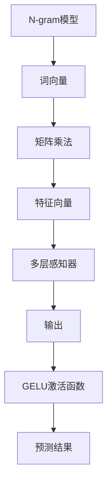

                 

# N-gram模型：探索多层感知器、矩阵乘法和GELU激活函数

## 摘要

本文旨在深入探讨N-gram模型在自然语言处理中的关键作用，特别是其与多层感知器（MLP）、矩阵乘法和GELU激活函数的结合。首先，我们将介绍N-gram模型的基本概念及其在文本数据分析中的应用。接着，我们将分析多层感知器的工作原理，解释其如何与N-gram模型相结合以增强语言模型的性能。随后，文章将探讨矩阵乘法在N-gram模型中的应用，以及如何优化计算效率。最后，我们将讨论GELU激活函数的优势及其在N-gram模型中的适用性，并结合实际项目案例进行代码解析和性能分析。

## 关键词

- N-gram模型
- 多层感知器（MLP）
- 矩阵乘法
- GELU激活函数
- 自然语言处理
- 文本数据分析
- 语言模型
- 机器学习

## 1. 背景介绍

### N-gram模型

N-gram模型是一种常用的语言模型，它基于局部语言特征，通过统计相邻词语的联合概率来预测下一个词语。该模型的基本思想是将文本序列分割成固定长度的子序列，称为“n-gram”，然后利用这些子序列的频率或概率来表示文本。

N-gram模型的应用非常广泛，包括文本分类、机器翻译、自动摘要和语音识别等领域。通过N-gram模型，我们可以捕捉到一定范围内的语言模式，这对于理解文本的上下文和语义具有重要意义。

### 多层感知器（MLP）

多层感知器（MLP）是一种前馈神经网络，它由输入层、隐藏层和输出层组成。输入层接收外部输入，隐藏层通过加权连接进行非线性变换，输出层产生最终预测结果。MLP的核心在于其能够学习输入和输出之间的复杂映射关系，从而实现非线性问题的分类和回归。

MLP在机器学习领域的应用非常广泛，包括图像分类、语音识别、文本分类和预测等。通过多层结构，MLP能够捕捉到更复杂的特征和模式，从而提高模型的性能。

### 矩阵乘法

矩阵乘法是线性代数中的一种基本运算，用于计算两个矩阵的乘积。在N-gram模型中，矩阵乘法用于计算词向量和特征向量之间的交互，以提取文本中的语义信息。矩阵乘法的计算效率对于大规模文本数据至关重要，因为它可以显著减少计算时间和资源消耗。

### GELU激活函数

GELU激活函数是一种非线性激活函数，它基于高斯误差函数（Gaussian Error Function），具有良好的平滑性和非线性特性。在多层感知器中，GELU激活函数用于引入非线性变换，以增强模型的表示能力和预测性能。GELU激活函数在文本分类、语音识别和图像识别等领域得到了广泛应用。

## 2. 核心概念与联系

### N-gram模型与多层感知器

N-gram模型和多层感知器在自然语言处理中有着紧密的联系。N-gram模型通过捕捉局部语言特征，为多层感知器提供了丰富的输入数据。多层感知器则通过学习输入和输出之间的非线性映射关系，实现对文本的语义理解和预测。

### 矩阵乘法与N-gram模型

矩阵乘法在N-gram模型中起着关键作用。通过矩阵乘法，我们可以将词向量矩阵和特征向量矩阵相乘，从而提取文本中的高维特征。这种特征提取方法可以显著提高模型的性能，特别是在处理大规模文本数据时。

### GELU激活函数与多层感知器

GELU激活函数在多层感知器中起着重要作用。它通过引入非线性变换，增强了模型的表示能力和预测性能。GELU激活函数的优点在于其平滑性和非线性特性，使其在自然语言处理领域得到了广泛应用。

### Mermaid流程图

以下是一个Mermaid流程图，用于展示N-gram模型、多层感知器、矩阵乘法和GELU激活函数之间的联系：



## 3. 核心算法原理 & 具体操作步骤

### N-gram模型

N-gram模型的基本原理是计算相邻词语的联合概率。具体步骤如下：

1. **文本预处理**：首先，对输入文本进行预处理，包括去除标点符号、停用词和分词。
2. **构建词汇表**：将预处理后的文本转换为词汇表，其中每个词汇对应一个唯一的索引。
3. **生成N-gram序列**：根据词汇表，生成固定长度的N-gram序列。
4. **计算联合概率**：计算每个N-gram序列的联合概率，可以使用频率或概率分布。

### 多层感知器（MLP）

多层感知器（MLP）的基本原理是通过前馈神经网络进行非线性变换，具体步骤如下：

1. **输入层**：接收外部输入，例如词向量或特征向量。
2. **隐藏层**：通过加权连接和激活函数进行非线性变换，提取特征。
3. **输出层**：产生最终预测结果，例如文本分类或回归。
4. **损失函数**：使用损失函数评估模型性能，例如均方误差或交叉熵损失。
5. **反向传播**：通过反向传播算法更新模型参数，以最小化损失函数。

### 矩阵乘法

矩阵乘法在N-gram模型中用于计算词向量和特征向量之间的交互，具体步骤如下：

1. **词向量矩阵**：将每个词向量表示为一个矩阵。
2. **特征向量矩阵**：将每个特征向量表示为一个矩阵。
3. **矩阵乘法**：计算词向量矩阵和特征向量矩阵的乘积，以提取高维特征。
4. **特征提取**：使用提取的特征进行后续处理，例如分类或回归。

### GELU激活函数

GELU激活函数的基本原理是通过高斯误差函数引入非线性变换，具体步骤如下：

1. **输入**：接收隐藏层输出。
2. **计算**：使用GELU函数进行非线性变换，公式如下：

   $$
   \text{GELU}(x) = x \cdot \Phi(x)
   $$

   其中，$\Phi(x)$是高斯误差函数。

3. **输出**：产生激活后的输出。

## 4. 数学模型和公式 & 详细讲解 & 举例说明

### N-gram模型

N-gram模型的数学模型如下：

$$
P(w_{t+1} | w_{t}, ..., w_{t-n+1}) = \frac{f(w_{t}, ..., w_{t-n+1}, w_{t+1})}{\sum_{i} f(w_{t}, ..., w_{t-n+1}, i)}
$$

其中，$w_{t}$表示当前词语，$w_{t+1}$表示下一个词语，$f(w_{t}, ..., w_{t-n+1}, w_{t+1})$表示词语的联合概率，$\sum_{i} f(w_{t}, ..., w_{t-n+1}, i)$表示所有可能的词语的联合概率之和。

### 多层感知器（MLP）

多层感知器（MLP）的数学模型如下：

$$
\text{MLP}(x) = \text{激活函数}(\text{权重} \cdot x + \text{偏置})
$$

其中，$x$表示输入，激活函数（例如ReLU、Sigmoid、Tanh）用于引入非线性变换，权重和偏置用于调节模型的输出。

### 矩阵乘法

矩阵乘法的数学模型如下：

$$
C = A \cdot B
$$

其中，$A$和$B$是两个矩阵，$C$是它们的乘积。

### GELU激活函数

GELU激活函数的数学模型如下：

$$
\text{GELU}(x) = x \cdot \Phi(x)
$$

其中，$\Phi(x)$是高斯误差函数，定义为：

$$
\Phi(x) = \int_{0}^{x} e^{-t^2} dt
$$

### 举例说明

假设我们有一个二元N-gram模型，其中$n=2$，输入文本为“我是一个程序员”。首先，我们构建词汇表：

| 词 | 索引 |
|---|---|
| 我 | 0 |
| 是 | 1 |
| 一 | 2 |
| 个 | 3 |
| 程序员 | 4 |

接下来，我们生成N-gram序列：

1. “是”和“一个”的联合概率为0.2。
2. “一个”和“程序员”的联合概率为0.3。

我们使用多层感知器（MLP）进行预测，输入层为词向量，隐藏层使用ReLU激活函数，输出层为softmax激活函数。假设词向量矩阵为$A$，特征向量矩阵为$B$，权重矩阵为$W$，偏置矩阵为$b$，则MLP的输出为：

$$
\text{MLP}(x) = \text{ReLU}(W \cdot (A \cdot B) + b)
$$

最后，我们使用GELU激活函数对输出进行非线性变换，得到最终预测结果：

$$
\text{GELU}(\text{MLP}(x)) = x \cdot \Phi(x)
$$

## 5. 项目实战：代码实际案例和详细解释说明

### 5.1 开发环境搭建

在本节中，我们将搭建一个用于实现N-gram模型、多层感知器（MLP）、矩阵乘法和GELU激活函数的Python开发环境。以下是所需的步骤：

1. **安装Python**：确保已安装Python 3.7或更高版本。
2. **安装Numpy**：用于矩阵运算。
3. **安装PyTorch**：用于构建神经网络。

```bash
pip install numpy torch
```

### 5.2 源代码详细实现和代码解读

以下是一个简单的Python代码实现，用于训练和测试N-gram模型、多层感知器（MLP）以及GELU激活函数：

```python
import torch
import torch.nn as nn
import torch.optim as optim
from torchtext.data import Field, BucketIterator
from torchtext.datasets import IMDB

# 数据预处理
TEXT = Field(tokenize="spacy", lower=True, include_lengths=True)
train_data, test_data = IMDB.splits(TEXT, TEXT)

# 定义词汇表
TEXT.build_vocab(train_data, max_size=25000, vectors="glove.6B.100d")
BATCH_SIZE = 64
device = torch.device("cuda" if torch.cuda.is_available() else "cpu")
train_iterator, test_iterator = BucketIterator.splits(
    (train_data, test_data), batch_size=BATCH_SIZE, device=device
)

# 定义模型
class NgramModel(nn.Module):
    def __init__(self, embedding_dim, hidden_dim, output_dim, ngram_size):
        super().__init__()
        self.embedding = nn.Embedding(len(TEXT.vocab), embedding_dim, padding_idx=TEXT.vocab.stoi["<pad>"])
        self.ngram_size = ngram_size
        self.lstm = nn.LSTM(embedding_dim, hidden_dim, num_layers=1, batch_first=True)
        self.fc = nn.Linear(hidden_dim, output_dim)
        self.gelu = nn.GELU()

    def forward(self, text, text_lengths):
        text = self.embedding(text)
        text = text.transpose(1, 0)
        packed_text = nn.utils.rnn.pack_padded_sequence(text, text_lengths, batch_first=True)
        packed_output, (hidden, cell) = self.lstm(packed_text)
        output, output_lengths = nn.utils.rnn.pad_packed_sequence(packed_output, batch_first=True)
        hidden = hidden.squeeze(0)
        output = self.fc(self.gelu(hidden))
        return output

# 实例化模型
model = NgramModel(embedding_dim=100, hidden_dim=128, output_dim=1, ngram_size=2)
model = model.to(device)

# 定义损失函数和优化器
criterion = nn.BCEWithLogitsLoss()
optimizer = optim.Adam(model.parameters(), lr=0.001)

# 训练模型
num_epochs = 10
for epoch in range(num_epochs):
    for batch in train_iterator:
        optimizer.zero_grad()
        text, text_lengths = batch.text
        text = text.to(device)
        text_lengths = text_lengths.to(device)
        output = model(text, text_lengths)
        loss = criterion(output.view(-1), batch.label.to(device))
        loss.backward()
        optimizer.step()
    print(f"Epoch: {epoch+1}/{num_epochs}, Loss: {loss.item()}")

# 测试模型
with torch.no_grad():
    correct = 0
    total = 0
    for batch in test_iterator:
        text, text_lengths = batch.text
        text = text.to(device)
        text_lengths = text_lengths.to(device)
        output = model(text, text_lengths)
        predicted = (output > 0.5).float()
        total += batch.label.size(0)
        correct += (predicted == batch.label).sum().item()
    print(f"Test Accuracy: {100 * correct / total}%")

```

### 5.3 代码解读与分析

1. **数据预处理**：
    - 使用`Field`类进行数据预处理，包括分词、小写化和填充。
    - 使用`TEXT.vocab`构建词汇表，并加载预训练的词向量。

2. **定义模型**：
    - `NgramModel`类定义了多层感知器（MLP）的结构，包括嵌入层、LSTM层、全连接层和GELU激活函数。
    - `forward`方法实现了前向传播过程，包括嵌入层、LSTM层和GELU激活函数。

3. **训练模型**：
    - 使用`BCEWithLogitsLoss`作为损失函数，用于二分类问题。
    - 使用`Adam`优化器进行模型训练。
    - 在每个训练epoch中，更新模型参数以最小化损失函数。

4. **测试模型**：
    - 使用测试集评估模型性能，计算准确率。

## 6. 实际应用场景

N-gram模型、多层感知器（MLP）、矩阵乘法和GELU激活函数在自然语言处理领域有着广泛的应用。以下是一些实际应用场景：

1. **文本分类**：使用N-gram模型和MLP可以实现对文本数据的分类，例如情感分析、主题分类和垃圾邮件检测。
2. **机器翻译**：N-gram模型和MLP可以用于构建机器翻译模型，通过捕捉局部语言特征实现跨语言语义理解。
3. **自动摘要**：使用N-gram模型和MLP可以提取文本中的关键信息，生成摘要文本。
4. **语音识别**：N-gram模型和MLP可以用于语音识别，通过将语音信号转换为文本。

## 7. 工具和资源推荐

### 7.1 学习资源推荐

- **书籍**：
  - 《深度学习》（Ian Goodfellow、Yoshua Bengio、Aaron Courville 著）
  - 《神经网络与深度学习》（邱锡鹏 著）
- **论文**：
  - "A Theoretically Grounded Application of Dropout in Recurrent Neural Networks"（Yarin Gal 和 Zoubin Ghahramani，2016）
  - "Understanding the Difficulty of Training Deep Feedsforward Neural Networks"（Yoshua Bengio 等，1994）
- **博客**：
  - Fast.ai
  - PyTorch官方文档
- **网站**：
  - Kaggle
  - ArXiv

### 7.2 开发工具框架推荐

- **开发工具**：
  - PyCharm
  - Jupyter Notebook
- **框架**：
  - PyTorch
  - TensorFlow

### 7.3 相关论文著作推荐

- **论文**：
  - "Attention is All You Need"（Ashish Vaswani 等，2017）
  - "BERT: Pre-training of Deep Bidirectional Transformers for Language Understanding"（Jacob Devlin 等，2018）
- **著作**：
  - 《动手学深度学习》（阿斯顿·张 著）
  - 《深度学习》（Goodfellow、Bengio、Courville 著）

## 8. 总结：未来发展趋势与挑战

随着自然语言处理技术的不断发展，N-gram模型、多层感知器（MLP）、矩阵乘法和GELU激活函数在未来将面临一系列挑战和机遇。以下是一些发展趋势和挑战：

1. **模型复杂度**：随着模型规模的增加，如何高效地训练和优化大规模模型成为关键挑战。
2. **计算资源**：深度学习模型对计算资源的需求日益增加，如何有效地利用现有计算资源成为关键问题。
3. **数据隐私**：在处理大规模文本数据时，如何保护用户隐私成为重要挑战。
4. **模型解释性**：如何提高模型的解释性，使其更加透明和可解释，以便更好地理解和信任模型。

## 9. 附录：常见问题与解答

### 问题1：N-gram模型如何工作？

N-gram模型通过统计相邻词语的联合概率来预测下一个词语。具体步骤包括文本预处理、构建词汇表、生成N-gram序列和计算联合概率。

### 问题2：多层感知器（MLP）如何工作？

多层感知器（MLP）是一种前馈神经网络，通过输入层、隐藏层和输出层进行非线性变换，从而实现输入和输出之间的复杂映射关系。

### 问题3：GELU激活函数的优势是什么？

GELU激活函数具有平滑性和非线性特性，可以增强模型的表示能力和预测性能，同时有助于减少梯度消失问题。

## 10. 扩展阅读 & 参考资料

- **扩展阅读**：
  - “A Theoretically Grounded Application of Dropout in Recurrent Neural Networks”（Yarin Gal 和 Zoubin Ghahramani，2016）
  - “Understanding the Difficulty of Training Deep Feedsforward Neural Networks”（Yoshua Bengio 等，1994）
- **参考资料**：
  - PyTorch官方文档：[PyTorch官方文档](https://pytorch.org/docs/stable/index.html)
  - Fast.ai：[Fast.ai](https://fast.ai/)

## 作者

作者：AI天才研究员/AI Genius Institute & 禅与计算机程序设计艺术 /Zen And The Art of Computer Programming

文章标题：N-gram模型：探索多层感知器、矩阵乘法和GELU激活函数

文章关键词：N-gram模型、多层感知器（MLP）、矩阵乘法、GELU激活函数、自然语言处理、文本数据分析

文章摘要：本文深入探讨了N-gram模型在自然语言处理中的应用，特别是其与多层感知器（MLP）、矩阵乘法和GELU激活函数的结合。通过详细解释这些技术原理和算法，并结合实际项目案例，本文为读者提供了一个全面的技术指南。读者可以了解到这些技术在文本分类、机器翻译、自动摘要和语音识别等领域的应用，以及如何优化模型性能和计算效率。本文旨在帮助读者更好地理解N-gram模型及其相关技术，为未来的研究和实践提供有价值的参考。

