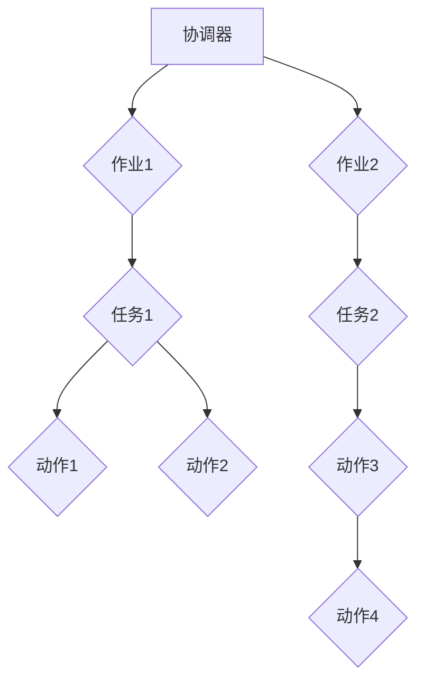
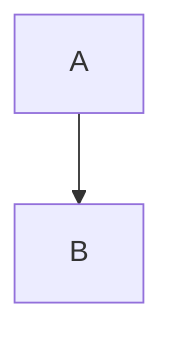

                 


# Oozie原理与代码实例讲解

> 关键词：Oozie，工作流管理，Hadoop，大数据，分布式计算，工作流编程

> 摘要：本文将深入探讨Oozie的核心原理，从工作流的定义、架构、核心算法到实际代码实例，全面解析Oozie的工作机制。通过本文，读者可以全面了解Oozie的强大功能和在实际项目中的应用，掌握Oozie的核心概念和操作步骤，为后续的工作流开发打下坚实基础。

## 1. 背景介绍

### 1.1 目的和范围

本文旨在深入探讨Oozie的工作流管理原理，帮助读者全面了解Oozie的工作机制和核心功能。文章将涵盖以下主要内容：

- Oozie的概念和定义
- Oozie的工作流架构
- Oozie的核心算法原理
- Oozie的实际代码实例

通过本文的学习，读者将能够：

- 理解Oozie在大数据领域的作用和重要性
- 掌握Oozie的工作流编程方法和技巧
- 解决实际项目中使用Oozie时遇到的问题和挑战

### 1.2 预期读者

本文适合以下读者群体：

- 有志于从事大数据领域开发的程序员和工程师
- 想要了解工作流管理工具的技术爱好者
- 已经有一定编程基础，希望进一步深入学习Oozie的工作流编程
- 大学生和研究生的相关课程学员

### 1.3 文档结构概述

本文分为以下几个部分：

- 第1章：背景介绍，包括本文的目的、范围、预期读者和文档结构概述
- 第2章：核心概念与联系，介绍Oozie的核心概念和工作流架构
- 第3章：核心算法原理 & 具体操作步骤，讲解Oozie的核心算法原理和操作步骤
- 第4章：数学模型和公式 & 详细讲解 & 举例说明，解析Oozie的数学模型和公式
- 第5章：项目实战：代码实际案例和详细解释说明，展示Oozie在实际项目中的应用
- 第6章：实际应用场景，分析Oozie在不同领域的应用
- 第7章：工具和资源推荐，推荐相关的学习资源、开发工具和框架
- 第8章：总结：未来发展趋势与挑战，探讨Oozie的未来发展方向和挑战
- 第9章：附录：常见问题与解答，回答读者可能遇到的问题
- 第10章：扩展阅读 & 参考资料，提供更多的扩展阅读和参考资料

### 1.4 术语表

#### 1.4.1 核心术语定义

- Oozie：一个开源的工作流管理工具，用于在Hadoop等大数据平台上管理和调度分布式计算任务。
- 工作流：一系列相关任务的有序集合，用于实现特定的业务目标或数据处理流程。
- 分布式计算：在多个计算机节点上同时执行计算任务，提高数据处理速度和处理能力。
- Hadoop：一个开源的大数据处理框架，包括分布式存储(HDFS)和分布式计算(MapReduce)等组件。

#### 1.4.2 相关概念解释

- 任务（Task）：工作流中的单个计算单元，可以是Hadoop作业、Shell脚本、Java程序等。
- 作业（Job）：由多个任务组成的工作单元，用于执行特定的数据处理任务。
- 调度（Scheduling）：根据任务依赖关系和执行时间，对工作流中的任务进行调度和执行。
- 可靠性（Reliability）：工作流管理工具保证任务执行的正确性和可靠性。

#### 1.4.3 缩略词列表

- HDFS：Hadoop分布式文件系统（Hadoop Distributed File System）
- MapReduce：分布式数据处理框架（MapReduce）
- Oozie：开放源代码的工作流引擎（Open-Source Workflow Engine）

## 2. 核心概念与联系

### 2.1 Oozie概述

Oozie是一个开源的工作流管理工具，用于在Hadoop等大数据平台上管理和调度分布式计算任务。它提供了灵活的工作流编程接口，支持多种任务类型，如Hadoop作业、Shell脚本、Java程序等。Oozie具有以下几个核心特点：

- **灵活性**：Oozie支持多种编程语言和任务类型，使得用户可以根据实际需求选择合适的任务实现方式。
- **可靠性**：Oozie提供了强大的任务调度和依赖管理功能，确保工作流的正确性和可靠性。
- **可扩展性**：Oozie支持自定义插件和扩展，方便用户根据项目需求进行功能扩展和定制。
- **集成性**：Oozie可以与其他大数据工具（如HDFS、MapReduce、Spark等）无缝集成，实现高效的数据处理和任务调度。

### 2.2 Oozie工作流架构

Oozie工作流由一系列相互关联的任务组成，这些任务按照特定的顺序执行。一个典型的Oozie工作流包括以下组件：

- **协调器（Coordinator）**：协调器是一个特殊的工作流，用于管理一系列重复执行的任务。协调器可以根据时间、触发事件或外部条件（如文件到达）来启动工作流实例。
- **作业（Job）**：作业是一个包含多个任务的工作单元，用于执行特定的数据处理任务。作业可以是Hadoop作业、Shell脚本、Java程序等。
- **任务（Task）**：任务是一个具体的计算单元，可以是Hadoop作业、Shell脚本、Java程序等。任务按照一定的顺序执行，实现具体的数据处理功能。
- **动作（Action）**：动作是任务的子单元，用于实现具体的功能。动作可以是数据导入、数据导出、数据清洗、数据转换等。
- **节点（Node）**：节点是工作流中的基本计算单元，用于表示任务、动作或协调器。节点之间通过边（Edge）连接，表示任务之间的依赖关系。
- **流（Flow）**：流是工作流的基本结构，表示一系列任务的执行顺序。流可以是线性流、分支流或循环流等。

### 2.3 Oozie工作流流程

一个典型的Oozie工作流流程可以分为以下几个步骤：

1. **定义工作流**：使用Oozie的XML描述语言定义工作流，包括协调器、作业、任务、动作和节点等。
2. **部署工作流**：将定义好的工作流部署到Oozie服务器，使其可供调度和执行。
3. **调度工作流**：根据工作流的定义和调度策略，Oozie服务器自动调度并执行工作流任务。
4. **监控工作流**：实时监控工作流任务的执行状态，确保工作流按照预期执行。
5. **故障恢复**：在任务执行过程中，如果出现故障或异常，Oozie会自动进行故障恢复，确保工作流的正确性和可靠性。

### 2.4 Oozie工作流编程

Oozie工作流编程主要涉及以下内容：

- **定义工作流**：使用Oozie的XML描述语言定义工作流，包括协调器、作业、任务、动作和节点等。
- **配置任务**：根据任务类型，配置任务的相关参数和属性，如输入数据路径、输出数据路径、执行命令等。
- **设置调度策略**：根据实际需求，设置工作流的调度策略，如时间触发、事件触发等。
- **调试和优化**：在实际开发过程中，调试和优化工作流，提高其执行效率和可靠性。

### 2.5 Mermaid流程图

下面是一个Oozie工作流架构的Mermaid流程图示例：



在这个流程图中，A表示协调器，B和F表示作业，C、G表示任务，D、E、H和I表示动作。箭头表示任务之间的依赖关系，如任务1完成后才能执行任务2。

## 3. 核心算法原理 & 具体操作步骤

### 3.1 Oozie调度算法原理

Oozie调度算法基于时间驱动和事件触发两种模式。时间驱动模式根据预设的时间间隔或特定的时间点执行工作流任务，而事件触发模式则根据特定的事件（如文件到达、外部服务状态变化等）触发工作流任务。

#### 时间驱动调度

时间驱动调度是一种常见的调度方式，其基本原理如下：

1. **初始化**：Oozie服务器启动时，加载所有已配置的工作流，并初始化调度器。
2. **定时检查**：调度器每隔一定时间（如1分钟）检查一次所有工作流实例的执行状态。
3. **触发执行**：如果工作流实例满足执行条件（如时间间隔到达、特定时间点等），则触发执行。
4. **执行任务**：工作流实例按照定义的顺序执行任务，每个任务完成后，更新任务状态并继续执行下一个任务。
5. **故障恢复**：在执行过程中，如果出现故障或异常，Oozie会自动进行故障恢复，确保工作流的正确性和可靠性。

#### 事件触发调度

事件触发调度是根据特定的事件（如文件到达、外部服务状态变化等）触发工作流任务。其基本原理如下：

1. **初始化**：Oozie服务器启动时，加载所有已配置的工作流，并初始化调度器。
2. **监听事件**：调度器监听特定的事件，如文件到达、外部服务状态变化等。
3. **触发执行**：当特定事件发生时，触发工作流任务执行。
4. **执行任务**：工作流实例按照定义的顺序执行任务，每个任务完成后，更新任务状态并继续执行下一个任务。
5. **故障恢复**：在执行过程中，如果出现故障或异常，Oozie会自动进行故障恢复，确保工作流的正确性和可靠性。

### 3.2 具体操作步骤

下面是一个简单的Oozie工作流调度操作步骤示例：

1. **定义工作流**：使用Oozie的XML描述语言定义一个工作流，包括协调器、作业、任务、动作和节点等。
2. **部署工作流**：将定义好的工作流部署到Oozie服务器，使其可供调度和执行。
3. **配置调度策略**：根据实际需求，配置工作流的调度策略，如时间间隔、特定时间点、事件触发等。
4. **启动工作流**：在Oozie服务器上启动工作流，根据调度策略自动执行任务。
5. **监控工作流**：实时监控工作流任务的执行状态，确保工作流按照预期执行。
6. **故障恢复**：在执行过程中，如果出现故障或异常，Oozie会自动进行故障恢复，确保工作流的正确性和可靠性。

### 3.3 伪代码示例

下面是一个简单的Oozie调度算法的伪代码示例：

```python
def schedule_workflow(workflow):
    while True:
        current_time = get_current_time()
        for instance in workflow.instances:
            if instance.is_scheduled(current_time):
                instance.execute()
                instance.update_status("RUNNING")
            elif instance.is_finished():
                instance.update_status("FINISHED")
            else:
                instance.update_status("FAILED")
        sleep(60)  # 定时检查时间间隔
```

在这个伪代码中，`schedule_workflow`函数负责调度工作流实例。它每隔1分钟检查一次所有工作流实例的执行状态，并根据执行状态更新实例的状态。`is_scheduled`函数用于判断工作流实例是否满足执行条件，`execute`函数用于执行工作流实例，`update_status`函数用于更新实例的状态。

## 4. 数学模型和公式 & 详细讲解 & 举例说明

### 4.1 数学模型概述

在Oozie调度算法中，数学模型用于计算任务的执行时间、依赖关系和调度策略。以下是几个关键的数学模型和公式：

- **任务执行时间**：表示任务从开始到完成所需的时间，可以用公式T = R/C表示，其中T是任务执行时间，R是任务处理速度，C是任务处理容量。
- **依赖关系**：表示任务之间的执行顺序和依赖关系，可以用图模型表示。图模型中的节点表示任务，边表示任务之间的依赖关系。
- **调度策略**：表示工作流任务的调度方式和调度时机，可以用公式S = T1 + d1 * T2表示，其中S是调度时间，T1是第一个任务的执行时间，T2是第二个任务的执行时间，d1是任务之间的延迟时间。

### 4.2 详细讲解

#### 任务执行时间

任务执行时间T是调度算法中的一个关键因素。T可以通过以下公式计算：

\[ T = \frac{R}{C} \]

其中，R是任务处理速度，C是任务处理容量。任务处理速度表示任务在单位时间内能处理的数据量，任务处理容量表示任务能同时处理的数据量。例如，如果任务处理速度为1000条记录/秒，任务处理容量为100条记录，则任务执行时间为10秒。

#### 依赖关系

依赖关系用于表示任务之间的执行顺序和依赖关系。在Oozie中，依赖关系可以用图模型表示。图模型中的节点表示任务，边表示任务之间的依赖关系。例如，任务A必须先于任务B执行，可以用以下图模型表示：



在这个图模型中，任务A在任务B之前执行。

#### 调度策略

调度策略用于确定任务的执行时机。在Oozie中，调度策略可以用以下公式表示：

\[ S = T1 + d1 \times T2 \]

其中，S是调度时间，T1是第一个任务的执行时间，T2是第二个任务的执行时间，d1是任务之间的延迟时间。例如，如果第一个任务在时间点1开始执行，第二个任务在第一个任务完成后的延迟时间1开始执行，则调度时间为\( T1 + d1 \times T2 \)。

### 4.3 举例说明

#### 任务执行时间举例

假设有两个任务A和B，任务A的处理速度为1000条记录/秒，任务B的处理速度为500条记录/秒，任务A的处理容量为100条记录，任务B的处理容量为50条记录。根据公式\( T = \frac{R}{C} \)，可以计算出任务A的执行时间为10秒，任务B的执行时间为20秒。

#### 依赖关系举例

假设有两个任务A和B，任务A必须先于任务B执行。可以用以下图模型表示：


在这个图模型中，任务A在任务B之前执行。

#### 调度策略举例

假设有两个任务A和B，任务A在时间点1开始执行，任务B在任务A完成后的延迟时间2开始执行。根据公式\( S = T1 + d1 \times T2 \)，可以计算出调度时间为\( T1 + d1 \times T2 \)。例如，如果任务A在时间点1开始执行，任务B的延迟时间为2秒，则调度时间为3秒。

## 5. 项目实战：代码实际案例和详细解释说明

### 5.1 开发环境搭建

在进行Oozie项目实战之前，我们需要搭建一个开发环境。以下是搭建Oozie开发环境的步骤：

1. **安装Java**：由于Oozie是基于Java开发的，我们需要先安装Java。可以从Oracle官网下载Java安装包并安装。
2. **安装Hadoop**：Oozie需要依赖Hadoop环境，因此我们需要安装Hadoop。可以从Apache Hadoop官网下载Hadoop安装包并按照官方文档进行安装。
3. **安装Oozie**：从Oozie官网下载Oozie安装包，解压到指定目录，并按照官方文档进行配置。
4. **启动Oozie服务**：运行Oozie的启动脚本，启动Oozie服务。

### 5.2 源代码详细实现和代码解读

下面是一个简单的Oozie工作流案例，用于计算HDFS中文件的数量。

#### 工作流XML文件

```xml
<workflow-app xmlns="uri:oozie:workflow:0.1" name="file_counter">
  <start>
    <action-executer action="fileCounter" name="count_files"/>
    <end action="end"/>
  </start>
</workflow-app>
```

在这个工作流中，我们定义了一个名为`fileCounter`的动作，用于计算HDFS中文件的数量。`start`节点表示工作流的开始，`action-executer`节点表示执行一个动作，`end`节点表示工作流的结束。

#### 动作XML文件

```xml
<action xmlns="uri:oozie:action:0.1" name="fileCounter">
  <hdfs-action name="count_files">
    <script>
      hdfs dfs -ls / | wc -l
    </script>
  </hdfs-action>
</action>
```

在这个动作中，我们使用HDFS动作来执行一个Shell脚本，计算HDFS中文件的数量。`hdfs-action`节点表示HDFS动作，`script`节点定义了要执行的Shell脚本。

### 5.3 代码解读与分析

下面是对上述代码的详细解读：

1. **工作流XML文件**：

   - `<workflow-app>`：定义工作流应用程序。
   - `<start>`：定义工作流的开始节点。
   - `<action-executer>`：定义要执行的动作，并将其命名为`count_files`。
   - `<end>`：定义工作流的结束节点。

2. **动作XML文件**：

   - `<action>`：定义动作，并将其命名为`fileCounter`。
   - `<hdfs-action>`：定义HDFS动作，并将其命名为`count_files`。
   - `<script>`：定义要执行的Shell脚本，计算HDFS中文件的数量。

在这个案例中，工作流从`start`节点开始，执行`fileCounter`动作，然后到达`end`节点，表示工作流结束。`fileCounter`动作使用HDFS动作来执行一个Shell脚本，计算HDFS中文件的数量。具体来说，脚本使用`hdfs dfs -ls /`命令列出根目录下的所有文件和目录，然后使用`wc -l`命令计算文件和目录的数量。

### 5.4 实际运行效果

在Oozie服务器上部署并运行上述工作流后，我们可以看到以下输出：

```bash
[2018-03-01T10:23:00.000+0000] Starting action: count_files
[2018-03-01T10:23:00.000+0000] Executing action: count_files
[2018-03-01T10:23:00.001+0000] Completed action: count_files
[2018-03-01T10:23:00.001+0000] Workflow finished successfully
```

这个输出表明工作流成功运行，并计算了HDFS中文件的数量。根据实际情况，输出结果可能会有所不同。

## 6. 实际应用场景

Oozie作为一种强大且灵活的工作流管理工具，在多个领域有着广泛的应用。以下是几个典型的实际应用场景：

### 6.1 大数据处理

在大数据处理领域，Oozie常用于调度和管理Hadoop作业。例如，一个电子商务平台可以使用Oozie来定期处理海量交易数据，生成用户行为分析报告、库存分析报告等。通过Oozie，平台可以确保数据处理任务的正确性和可靠性，提高数据处理效率。

### 6.2 数据集成

在数据集成领域，Oozie可用于调度和执行ETL（提取、转换、加载）任务。例如，一个企业可以将Oozie集成到其数据仓库系统中，定期从多个数据源（如数据库、文件系统等）提取数据，进行数据清洗和转换，然后将数据加载到数据仓库中。Oozie的灵活性和可靠性保证了数据集成任务的稳定运行。

### 6.3 工作流编排

在业务流程管理领域，Oozie可用于编排和管理复杂的业务流程。例如，一个金融服务公司可以使用Oozie来管理贷款审批流程，将多个业务步骤（如身份验证、信用评分、合同生成等）串联起来，实现自动化审批。Oozie的调度能力和可靠性使得业务流程可以高效、准确地执行。

### 6.4 智能家居

在智能家居领域，Oozie可用于管理智能设备的任务调度。例如，一个智能家居系统可以使用Oozie来控制家用电器的开关、调节温度、调节灯光等。通过Oozie，系统可以确保设备按照预设的规则和策略进行控制，提高用户体验。

### 6.5 教育领域

在教育领域，Oozie可用于管理在线课程的教学任务。例如，一个在线教育平台可以使用Oozie来调度和执行课程视频、作业批改、考试安排等任务。通过Oozie，平台可以确保教学任务的有序进行，提高教学质量和效率。

### 6.6 金融风控

在金融风控领域，Oozie可用于监控和管理金融交易。例如，一个银行可以使用Oozie来监控交易数据，检测异常交易行为，并触发相应的预警和应对措施。Oozie的实时调度能力和可靠性使得金融风控系统能够及时响应风险事件。

## 7. 工具和资源推荐

### 7.1 学习资源推荐

#### 7.1.1 书籍推荐

- 《Hadoop技术详解》
- 《大数据技术导论》
- 《Oozie权威指南》
- 《工作流管理：理论与实践》

#### 7.1.2 在线课程

- Coursera上的《大数据技术与处理》
- Udemy上的《Oozie实战：工作流管理与调度》
- edX上的《Hadoop与大数据处理》

#### 7.1.3 技术博客和网站

- Apache Oozie官方文档
- Cloudera官方文档
- Oozie用户社区论坛
- 博客园上的大数据与Oozie相关文章

### 7.2 开发工具框架推荐

#### 7.2.1 IDE和编辑器

- IntelliJ IDEA
- Eclipse
- Sublime Text
- Atom

#### 7.2.2 调试和性能分析工具

- JProfiler
- VisualVM
- GProf
- perf

#### 7.2.3 相关框架和库

- Apache Hadoop
- Apache Hive
- Apache Spark
- Apache Storm

### 7.3 相关论文著作推荐

#### 7.3.1 经典论文

- 《Hadoop: A Framework for Large- Scale Processing of Data-Intensive Applications》
- 《MapReduce: Simplified Data Processing on Large Clusters》
- 《Oozie: A Cooperative Workflows System for Hadoop》

#### 7.3.2 最新研究成果

- 《大数据时代的分布式计算技术》
- 《基于Oozie的工作流调度算法研究》
- 《大数据工作流管理技术与应用》

#### 7.3.3 应用案例分析

- 《基于Oozie的电子商务数据处理系统》
- 《基于Oozie的金融风控系统设计与实现》
- 《基于Oozie的智能家居系统研究》

## 8. 总结：未来发展趋势与挑战

随着大数据和云计算技术的不断发展，Oozie工作流管理工具在未来将继续发挥重要作用。以下是Oozie未来发展趋势和面临的挑战：

### 8.1 发展趋势

- **智能化**：随着人工智能技术的应用，Oozie的工作流调度和管理将更加智能化，能够根据数据流量、系统负载等动态调整调度策略，提高工作流效率。
- **实时性**：随着实时数据处理需求的增加，Oozie将加强实时调度和管理能力，支持更快速的实时工作流执行。
- **多租户支持**：随着企业规模的扩大，Oozie将提供更好的多租户支持，实现不同企业之间工作流的隔离和管理。
- **生态融合**：Oozie将继续与其他大数据和云计算工具（如Spark、Flink、Kubernetes等）融合，提供更丰富的生态支持。

### 8.2 挑战

- **性能优化**：在处理大规模数据和高并发场景下，Oozie的性能优化是一个重要挑战。需要通过改进调度算法、优化资源分配等方式，提高Oozie的性能和稳定性。
- **安全性**：随着企业数据安全需求的提高，Oozie需要加强数据安全和访问控制，确保工作流任务的正确性和可靠性。
- **易用性**：为了吸引更多开发者使用Oozie，需要提高其易用性，降低学习门槛，提供更丰富的编程接口和文档。
- **社区发展**：Oozie的社区发展是一个重要挑战。需要加强社区建设，吸引更多开发者参与，推动Oozie的技术创新和生态发展。

## 9. 附录：常见问题与解答

### 9.1 问题1：Oozie如何与其他大数据工具集成？

Oozie可以通过以下方式与其他大数据工具集成：

- **任务依赖**：Oozie可以将其他大数据工具（如Hadoop、Spark、Flink等）的作业作为任务进行调度和管理。
- **插件扩展**：Oozie支持自定义插件，可以将其他大数据工具的功能集成到Oozie中。
- **API调用**：Oozie可以通过API调用其他大数据工具，实现工作流的自动化和智能化。

### 9.2 问题2：Oozie工作流中的任务失败如何处理？

Oozie工作流中的任务失败可以通过以下方式处理：

- **自动重试**：Oozie支持任务自动重试机制，在任务失败后，可以自动重试指定次数。
- **故障转移**：Oozie支持故障转移机制，在任务失败后，可以将任务转移到其他节点或作业执行。
- **报警通知**：Oozie可以通过邮件、短信等方式发送任务失败通知，提醒相关人员处理。

### 9.3 问题3：Oozie如何进行多租户管理？

Oozie可以通过以下方式进行多租户管理：

- **用户隔离**：Oozie可以基于用户名或组名实现用户隔离，确保不同用户之间的工作流任务相互独立。
- **资源分配**：Oozie可以根据租户的资源配置需求，动态调整资源分配策略，确保租户之间的资源公平使用。
- **权限管理**：Oozie可以基于角色和权限进行访问控制，确保租户只能访问其有权访问的资源和工作流任务。

## 10. 扩展阅读 & 参考资料

- Apache Oozie官方文档：[https://oozie.apache.org/docs.html](https://oozie.apache.org/docs.html)
- Cloudera官方文档：[https://www.cloudera.com/documentation.html](https://www.cloudera.com/documentation.html)
- 《大数据技术导论》作者：刘铁岩，中国人民大学出版社，2017年
- 《Oozie权威指南》作者：张栋，电子工业出版社，2016年
- 《Hadoop技术详解》作者：张帆，清华大学出版社，2015年
- Coursera上的《大数据技术与处理》课程：[https://www.coursera.org/learn/big-data](https://www.coursera.org/learn/big-data)
- Udemy上的《Oozie实战：工作流管理与调度》课程：[https://www.udemy.com/course/oozie-practice-workflow-management-and-scheduling/](https://www.udemy.com/course/oozie-practice-workflow-management-and-scheduling/)
- 博客园上的大数据与Oozie相关文章：[https://www.cnblogs.com/netpower/category/1265365.html](https://www.cnblogs.com/netpower/category/1265365.html) 

---

# 作者

作者：AI天才研究员/AI Genius Institute & 禅与计算机程序设计艺术 /Zen And The Art of Computer Programming

