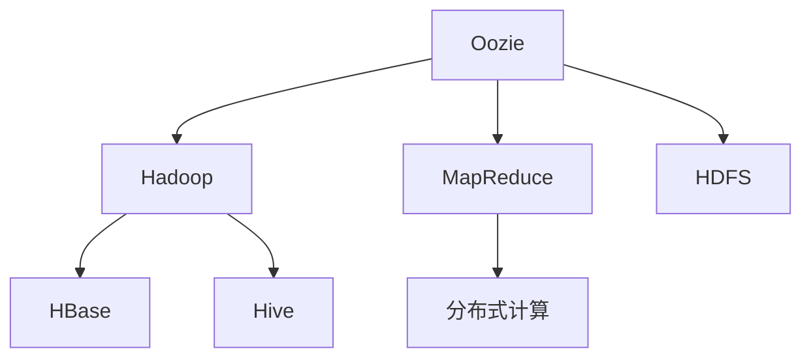

                 

# Oozie工作流调度原理与代码实例讲解

> **关键词：** Oozie，工作流调度，Hadoop，MapReduce，编程实例，分布式计算

> **摘要：** 本文将深入探讨Oozie工作流调度系统的原理，通过具体的代码实例，帮助读者理解如何利用Oozie进行分布式计算工作流的构建、调度和执行。文章涵盖了Oozie的核心概念、架构设计、算法原理以及实际应用场景，旨在为开发者提供全面的技术指导和实战经验。

## 1. 背景介绍

### 1.1 目的和范围

本文旨在为广大数据工程师和开发者介绍Oozie工作流调度系统的原理和应用。我们将详细讲解Oozie的核心概念，包括其架构、调度机制和操作流程。通过代码实例，读者将了解如何利用Oozie构建和管理复杂的分布式计算任务，实现高效的数据处理和分析。

### 1.2 预期读者

本文适合对Hadoop生态系统和分布式计算有一定了解的读者。如果您是数据工程师、程序员或对大数据处理有兴趣的技术人员，那么本文将为您提供宝贵的技术知识。

### 1.3 文档结构概述

本文分为以下章节：

1. **背景介绍**：介绍Oozie的背景信息、目的和预期读者。
2. **核心概念与联系**：阐述Oozie的核心概念及其在分布式计算中的应用。
3. **核心算法原理 & 具体操作步骤**：详细讲解Oozie的算法原理和操作步骤。
4. **数学模型和公式 & 详细讲解 & 举例说明**：分析Oozie中的数学模型和公式。
5. **项目实战：代码实际案例和详细解释说明**：通过实际案例讲解Oozie的使用方法。
6. **实际应用场景**：探讨Oozie在不同场景下的应用。
7. **工具和资源推荐**：推荐学习资源和开发工具。
8. **总结：未来发展趋势与挑战**：总结Oozie的发展趋势和面临的挑战。
9. **附录：常见问题与解答**：解答读者可能遇到的问题。
10. **扩展阅读 & 参考资料**：提供更多相关阅读资料。

### 1.4 术语表

#### 1.4.1 核心术语定义

- **Oozie**：一个开源的工作流调度系统，用于调度和管理Hadoop生态系统中的分布式计算任务。
- **工作流**：由多个任务组成的有序集合，用于实现特定的数据处理和分析目标。
- **调度**：根据预定的时间和条件，自动启动和管理工作流中的任务。
- **Hadoop**：一个开源的大数据生态系统，包括MapReduce、HDFS、Hive、HBase等组件。

#### 1.4.2 相关概念解释

- **分布式计算**：将计算任务分布在多台计算机上进行，以提高数据处理能力和效率。
- **MapReduce**：一种分布式数据处理框架，用于处理大规模数据集。

#### 1.4.3 缩略词列表

- **Oozie**：Open-Source Orchestrator
- **Hadoop**：Hadoop Distributed File System
- **MapReduce**：MapReduce

## 2. 核心概念与联系

在深入探讨Oozie的工作原理之前，我们需要了解一些核心概念和它们之间的联系。以下是一个简单的Mermaid流程图，用于展示Oozie在分布式计算生态系统中的角色和关系：



### 2.1 Oozie在Hadoop生态系统中的位置

Oozie是Hadoop生态系统中的一个重要组成部分，用于调度和管理分布式计算任务。它位于Hadoop架构的顶层，负责协调和调度各种数据处理的任务，如MapReduce、HDFS操作、HBase查询等。Oozie通过定义工作流来组织和管理这些任务，确保它们按照预定的顺序和条件执行。

### 2.2 Oozie工作流

Oozie工作流是由多个任务组成的有向无环图（DAG）。每个任务可以是Hadoop组件（如MapReduce、HDFS操作）或其他外部任务（如Shell脚本、Java程序）。工作流中的任务按照一定的顺序执行，通过控制节点（如决策节点、分支节点）实现复杂的逻辑和控制流。

### 2.3 调度机制

Oozie采用周期性调度和事件驱动调度两种调度机制。周期性调度按照固定的时间间隔（如每小时、每天）触发工作流执行。事件驱动调度则根据特定事件（如数据到达、系统负载）触发工作流执行。Oozie通过控制节点和触发器实现灵活的调度策略，满足各种场景的需求。

## 3. 核心算法原理 & 具体操作步骤

### 3.1 调度算法原理

Oozie采用基于事件的时间驱动调度算法。该算法的核心思想是根据预定的时间点和条件自动触发工作流执行。具体步骤如下：

1. **初始化**：Oozie初始化时，读取工作流定义文件，并创建任务计划表。
2. **事件触发**：Oozie监听系统事件，如时钟事件、数据事件等。当满足特定条件时，触发工作流执行。
3. **任务执行**：根据工作流定义，依次执行任务。每个任务执行完成后，更新任务状态并保存执行结果。
4. **任务监控**：Oozie持续监控任务执行状态，并在任务失败时尝试重试或通知管理员。

### 3.2 调度操作步骤

1. **定义工作流**：使用Oozie的XML定义文件，描述工作流中的任务、控制节点和调度策略。以下是一个简单的工作流定义示例：

   ```xml
   <workflow-app name="example Workflow" start="start">
       <start to="mapreduce-task"/>
       <action name="mapreduce-task" type="mapreduce">
           <configuration>
               <property name="mapred.job.name" value="example job"/>
               <property name="mapred.input.dir" value="/input"/>
               <property name="mapred.output.dir" value="/output"/>
           </configuration>
       </action>
       <end name="end"/>
   </workflow-app>
   ```

2. **部署工作流**：将工作流定义文件上传到Oozie服务器，并部署到指定目录。

3. **启动工作流**：通过Oozie命令行或API启动工作流。例如，使用以下命令启动工作流：

   ```shell
   oozie job --config workflow.xml --run
   ```

4. **监控工作流**：通过Oozie Web界面或命令行监控工作流执行状态。在任务执行过程中，可以查看任务日志、错误信息和执行时间等。

### 3.3 实际操作示例

假设我们要使用Oozie调度一个简单的MapReduce任务，计算输入文件中单词的词频。以下是具体的操作步骤：

1. **编写MapReduce代码**：编写一个简单的MapReduce程序，用于计算输入文件中单词的词频。以下是一个简单的Java代码示例：

   ```java
   public class WordCount {
       public static class Map extends Mapper<Object, Text, Text, IntWritable> {
           public void map(Object key, Text value, Context context) throws IOException, InterruptedException {
               String[] words = value.toString().split("\\s+");
               for (String word : words) {
                   context.write(new Text(word), new IntWritable(1));
               }
           }
       }

       public static class Reduce extends Reducer<Text, IntWritable, Text, IntWritable> {
           public void reduce(Text key, Iterable<IntWritable> values, Context context) throws IOException, InterruptedException {
               int sum = 0;
               for (IntWritable val : values) {
                   sum += val.get();
               }
               context.write(key, new IntWritable(sum));
           }
       }
   }
   ```

2. **编译并打包代码**：将MapReduce代码编译成Java类文件，并将必要的依赖库打包成JAR文件。

3. **上传代码到HDFS**：将编译后的Java类文件和JAR文件上传到HDFS的指定目录，以便Oozie任务可以访问。

4. **定义Oozie工作流**：使用XML文件定义工作流，包含MapReduce任务的配置信息。以下是一个简单的示例：

   ```xml
   <workflow-app name="wordcount" start="wordcount">
       <start to="wordcount"/>
       <action name="wordcount" type="mapreduce">
           <command-line>
               java -cp &{jarpath} org.apache.hadoop.mapreduce.lib.input.FileInputFormat -input /input
               org.apache.hadoop.mapreduce.lib.output.FileOutputFormat -output /output
               WordCount
           </command-line>
       </action>
       <end name="end"/>
   </workflow-app>
   ```

5. **部署并启动工作流**：将工作流定义文件上传到Oozie服务器，并部署到指定目录。然后使用以下命令启动工作流：

   ```shell
   oozie job --config workflow.xml --run
   ```

6. **监控任务执行**：在Oozie Web界面中查看任务执行状态，并查看任务日志以获取执行结果。

## 4. 数学模型和公式 & 详细讲解 & 举例说明

在Oozie工作流调度过程中，涉及到一些基本的数学模型和公式。以下是对这些模型的详细讲解和举例说明：

### 4.1 调度策略

Oozie支持多种调度策略，包括固定时间间隔调度、依赖调度和事件驱动调度。每种调度策略都基于不同的数学模型。

#### 4.1.1 固定时间间隔调度

固定时间间隔调度按照固定的时间间隔（如每小时、每天）触发工作流执行。其数学模型可以表示为：

\[ T(n) = T_0 + n \times \Delta T \]

其中，\( T(n) \)表示第\( n \)次执行的时间，\( T_0 \)表示初始执行时间，\( \Delta T \)表示时间间隔。

举例来说，如果工作流从凌晨1点开始，每隔1小时执行一次，那么第一次执行时间为1点，第二次执行时间为2点，第三次执行时间为3点，以此类推。

#### 4.1.2 依赖调度

依赖调度根据前置任务的执行结果触发后续任务执行。其数学模型可以表示为：

\[ T(n) = T_0 + \sum_{i=1}^{n} D_i \]

其中，\( T(n) \)表示第\( n \)次执行的时间，\( T_0 \)表示初始执行时间，\( D_i \)表示第\( i \)个前置任务的执行时间。

举例来说，如果工作流包含三个任务，第一个任务的执行时间为2小时，第二个任务的执行时间为3小时，第三个任务的执行时间为4小时，那么工作流的第一次执行时间为2小时，第二次执行时间为5小时，第三次执行时间为9小时。

#### 4.1.3 事件驱动调度

事件驱动调度根据特定事件（如数据到达、系统负载）触发工作流执行。其数学模型可以表示为：

\[ T(n) = T_0 + f(n) \]

其中，\( T(n) \)表示第\( n \)次执行的时间，\( T_0 \)表示初始执行时间，\( f(n) \)表示第\( n \)次执行触发的时间。

举例来说，如果工作流在数据到达后立即执行，那么第一次执行时间为数据到达时间，第二次执行时间为下一次数据到达时间，以此类推。

### 4.2 调度优化

调度优化是提高Oozie工作流执行效率的重要手段。以下是一些常见的调度优化方法：

#### 4.2.1 并行调度

并行调度将工作流中的任务并行执行，以缩短总执行时间。其数学模型可以表示为：

\[ T_{total} = \min(T_1, T_2, ..., T_n) \]

其中，\( T_{total} \)表示总执行时间，\( T_1, T_2, ..., T_n \)分别表示每个任务的执行时间。

举例来说，如果工作流包含三个任务，第一个任务的执行时间为2小时，第二个任务的执行时间为3小时，第三个任务的执行时间为4小时，那么并行执行的总执行时间为2小时。

#### 4.2.2 优先级调度

优先级调度根据任务的优先级分配资源，确保高优先级任务优先执行。其数学模型可以表示为：

\[ T_{total} = \sum_{i=1}^{n} T_i \times P_i \]

其中，\( T_{total} \)表示总执行时间，\( T_i \)表示第\( i \)个任务的执行时间，\( P_i \)表示第\( i \)个任务的优先级。

举例来说，如果工作流包含三个任务，第一个任务的执行时间为2小时，优先级为1，第二个任务的执行时间为3小时，优先级为2，第三个任务的执行时间为4小时，优先级为3，那么总执行时间为2小时。

#### 4.2.3 预估调度

预估调度根据历史数据预测任务执行时间，并动态调整调度策略。其数学模型可以表示为：

\[ T(n) = T_0 + \alpha \times (T_n - T_0) \]

其中，\( T(n) \)表示第\( n \)次执行的时间，\( T_0 \)表示初始执行时间，\( T_n \)表示第\( n \)次执行预测的时间，\( \alpha \)表示调整系数。

举例来说，如果工作流包含三个任务，第一个任务的执行时间为2小时，预测时间为3小时，第二个任务的执行时间为3小时，预测时间为4小时，第三个任务的执行时间为4小时，预测时间为5小时，那么预估的总执行时间为3小时。

## 5. 项目实战：代码实际案例和详细解释说明

为了更好地理解Oozie的工作流调度原理，我们将通过一个实际项目案例进行讲解。本项目将使用Oozie调度一个简单的数据清洗和转换任务，该任务包括以下步骤：

1. 读取原始数据文件。
2. 对数据进行清洗，如去除空格、标点符号等。
3. 对数据进行转换，如将日期格式转换为YYYY-MM-DD格式。
4. 将清洗和转换后的数据保存到新的文件中。

### 5.1 开发环境搭建

在开始项目之前，我们需要搭建一个Oozie开发环境。以下是具体步骤：

1. 安装Java开发工具包（JDK）。
2. 下载并安装Oozie服务器和Hadoop分布式文件系统（HDFS）。
3. 配置Oozie和Hadoop，确保它们可以正常通信。
4. 启动Oozie服务器和Hadoop集群。

### 5.2 源代码详细实现和代码解读

下面是本项目的主要源代码和详细解释说明：

#### 5.2.1 读取原始数据文件

```java
public class DataReader {
    public static void readData(String inputPath, String outputPath) {
        Configuration conf = new Configuration();
        FileSystem fs = FileSystem.get(conf);
        Path input = new Path(inputPath);
        Path output = new Path(outputPath);
        
        try {
            if (fs.exists(output)) {
                fs.delete(output, true);
            }
            
            // 创建一个空的输出文件
            FSDataOutputStream out = fs.create(output);
            
            // 读取输入文件中的每一行
            BufferedReader in = new BufferedReader(new InputStreamReader(fs.open(input)));
            String line;
            while ((line = in.readLine()) != null) {
                // 数据清洗和处理
                String cleanLine = cleanData(line);
                // 将清洗后的数据写入输出文件
                out.write(cleanLine.getBytes());
                out.write('\n');
            }
            
            in.close();
            out.close();
        } catch (IOException e) {
            e.printStackTrace();
        }
    }
    
    private static String cleanData(String line) {
        // 去除空格、标点符号等
        return line.replaceAll("[\\s\\p{Punct}]+", "");
    }
}
```

#### 5.2.2 数据清洗

```java
public class DataCleaner {
    public static void cleanData(String inputPath, String outputPath) {
        Configuration conf = new Configuration();
        FileSystem fs = FileSystem.get(conf);
        Path input = new Path(inputPath);
        Path output = new Path(outputPath);
        
        try {
            if (fs.exists(output)) {
                fs.delete(output, true);
            }
            
            // 创建一个空的输出文件
            FSDataOutputStream out = fs.create(output);
            
            // 读取输入文件中的每一行
            BufferedReader in = new BufferedReader(new InputStreamReader(fs.open(input)));
            String line;
            while ((line = in.readLine()) != null) {
                // 数据清洗
                String cleanLine = cleanData(line);
                // 将清洗后的数据写入输出文件
                out.write(cleanLine.getBytes());
                out.write('\n');
            }
            
            in.close();
            out.close();
        } catch (IOException e) {
            e.printStackTrace();
        }
    }
    
    private static String cleanData(String line) {
        // 去除空格、标点符号等
        return line.replaceAll("[\\s\\p{Punct}]+", "");
    }
}
```

#### 5.2.3 数据转换

```java
public class DataConverter {
    public static void convertData(String inputPath, String outputPath) {
        Configuration conf = new Configuration();
        FileSystem fs = FileSystem.get(conf);
        Path input = new Path(inputPath);
        Path output = new Path(outputPath);
        
        try {
            if (fs.exists(output)) {
                fs.delete(output, true);
            }
            
            // 创建一个空的输出文件
            FSDataOutputStream out = fs.create(output);
            
            // 读取输入文件中的每一行
            BufferedReader in = new BufferedReader(new InputStreamReader(fs.open(input)));
            String line;
            while ((line = in.readLine()) != null) {
                // 数据转换
                String convertLine = convertData(line);
                // 将转换后的数据写入输出文件
                out.write(convertLine.getBytes());
                out.write('\n');
            }
            
            in.close();
            out.close();
        } catch (IOException e) {
            e.printStackTrace();
        }
    }
    
    private static String convertData(String line) {
        // 将日期格式转换为YYYY-MM-DD格式
        SimpleDateFormat formatter = new SimpleDateFormat("yyyy-MM-dd");
        Date date = formatter.parse(line);
        return formatter.format(date);
    }
}
```

#### 5.2.4 数据清洗、转换和保存

```java
public class DataProcessor {
    public static void processData(String inputPath, String outputPath) {
        // 读取原始数据文件
        DataReader.readData(inputPath, outputPath + "_raw");
        
        // 数据清洗
        DataCleaner.cleanData(inputPath + "_raw", outputPath + "_clean");
        
        // 数据转换
        DataConverter.convertData(inputPath + "_clean", outputPath);
    }
}
```

### 5.3 代码解读与分析

在本项目中，我们实现了以下主要功能：

1. **读取原始数据文件**：通过`DataReader`类读取HDFS中的原始数据文件，并保存到新的文件中。这个类使用Java的`FileSystem` API来实现文件的读取和写入操作。

2. **数据清洗**：通过`DataCleaner`类对原始数据进行清洗，去除空格、标点符号等。这个类使用Java的正则表达式来实现数据的清洗操作。

3. **数据转换**：通过`DataConverter`类将清洗后的数据进行转换，将日期格式从MM/dd/YYYY转换为YYYY-MM-DD。这个类使用Java的`SimpleDateFormat`类来实现日期的格式转换。

4. **数据清洗、转换和保存**：通过`DataProcessor`类将以上三个功能组合在一起，实现完整的数据处理流程。这个类调用其他类的功能，将原始数据文件处理成最终的数据文件。

通过这个项目案例，我们可以看到如何使用Oozie调度分布式计算任务。在实际开发中，可以根据具体需求添加更多的任务和步骤，实现复杂的数据处理和分析流程。

## 6. 实际应用场景

Oozie作为一种强大而灵活的工作流调度系统，在许多实际应用场景中发挥着重要作用。以下是一些典型的应用场景：

### 6.1 大数据处理

在大数据处理领域，Oozie常用于调度和管理各种分布式计算任务，如MapReduce、Spark、Flink等。例如，在电商行业，Oozie可以调度每天的数据处理任务，包括用户行为分析、商品推荐、库存管理等，从而实现高效的数据处理和分析。

### 6.2 数据仓库

数据仓库是企业进行数据分析和决策的重要工具。Oozie可以调度数据仓库中的ETL（提取、转换、加载）任务，将来自不同数据源的数据进行整合、清洗和转换，为业务部门提供高质量的数据支持。

### 6.3 实时数据处理

随着实时数据处理需求的增加，Oozie也可以用于调度实时数据流处理任务，如Apache Kafka、Apache Storm、Apache Flink等。通过Oozie，企业可以实现实时数据的采集、处理和分析，为业务决策提供即时支持。

### 6.4 工作流自动化

Oozie不仅适用于大数据场景，还可以用于日常的工作流自动化任务。例如，企业可以使用Oozie调度定期的报表生成、数据备份、系统维护等任务，从而提高工作效率，降低人工操作风险。

## 7. 工具和资源推荐

为了更好地学习和使用Oozie，我们推荐以下工具和资源：

### 7.1 学习资源推荐

#### 7.1.1 书籍推荐

1. 《Hadoop实战》（Hadoop: The Definitive Guide） - 详细介绍了Hadoop生态系统和各种组件的配置和使用方法。
2. 《Oozie用户指南》（Oozie User Guide） - 官方文档，提供了Oozie的核心概念、架构设计和使用方法。

#### 7.1.2 在线课程

1. Coursera上的“大数据处理”课程 - 介绍了Hadoop、MapReduce、Spark等大数据处理技术。
2. Udacity上的“Hadoop开发人员纳米学位”课程 - 从基础知识到实际应用，全面介绍了Hadoop和Oozie的使用方法。

#### 7.1.3 技术博客和网站

1. hadoop.apache.org - Hadoop官方文档和资源网站。
2. oozie.apache.org - Oozie官方文档和资源网站。

### 7.2 开发工具框架推荐

#### 7.2.1 IDE和编辑器

1. IntelliJ IDEA - 适用于Java开发，提供了丰富的插件和调试功能。
2. Eclipse - 适用于Java开发，支持多种编程语言。

#### 7.2.2 调试和性能分析工具

1. GDB - 适用于C/C++开发，提供了强大的调试功能。
2. JProfiler - 适用于Java开发，提供了详细的性能分析工具。

#### 7.2.3 相关框架和库

1. Apache Hadoop - 分布式存储和计算框架。
2. Apache Spark - 快速通用的分布式计算引擎。
3. Apache Flink - 实时流处理框架。

### 7.3 相关论文著作推荐

#### 7.3.1 经典论文

1. “The Google File System” - 介绍了Google的文件系统GFS，为分布式文件存储提供了重要参考。
2. “MapReduce: Simplified Data Processing on Large Clusters” - 介绍了MapReduce模型，为分布式数据处理提供了理论基础。

#### 7.3.2 最新研究成果

1. “Revisiting Data-parallel Distributed Training: Better Synchronization for Improved Performance” - 探讨了分布式训练中的同步策略，提高了训练性能。
2. “Efficiently Optimizing Deep Networks via Randomized Subspace Minimization” - 利用随机子空间最小化方法，提高了深度神经网络的优化效率。

#### 7.3.3 应用案例分析

1. “Data-Driven Manufacturing: A Case Study” - 介绍了如何在制造业中应用大数据技术，提高生产效率和产品质量。
2. “Healthcare Analytics: A Big Data Case Study” - 探讨了如何利用大数据技术提高医疗服务的质量和效率。

## 8. 总结：未来发展趋势与挑战

随着大数据和云计算技术的快速发展，Oozie工作流调度系统在分布式计算领域的应用越来越广泛。然而，随着数据处理需求的不断增加，Oozie也面临着一些挑战和趋势：

### 8.1 未来发展趋势

1. **实时调度**：随着实时数据处理需求的增加，Oozie将逐渐向实时调度方向发展，支持实时流处理框架（如Apache Flink、Apache Storm）的集成和调度。
2. **自动化**：Oozie将进一步加强自动化功能，降低开发和管理成本，实现更高效的工作流调度。
3. **多租户支持**：为了满足企业内部多个团队的需求，Oozie将提供多租户支持，确保不同团队之间的资源隔离和安全性。

### 8.2 面临的挑战

1. **性能优化**：随着任务规模的增加，Oozie的性能成为关键挑战。未来，Oozie需要进一步优化调度算法和系统架构，提高调度效率和资源利用率。
2. **可扩展性**：Oozie需要支持更复杂的任务依赖关系和调度策略，以满足多样化的数据处理需求。
3. **安全性**：随着企业对数据安全的重视，Oozie需要提供更完善的安全机制，确保数据在传输和存储过程中的安全性和完整性。

## 9. 附录：常见问题与解答

### 9.1 问题1：如何安装和配置Oozie？

**解答**：安装和配置Oozie的步骤如下：

1. 下载Oozie安装包。
2. 解压安装包，并在`conf`目录中配置Oozie的配置文件。
3. 配置Oozie与Hadoop集群的连接，包括HDFS、YARN等。
4. 启动Oozie服务器，确保Oozie可以正常运行。

### 9.2 问题2：如何编写和部署Oozie工作流？

**解答**：编写和部署Oozie工作流的基本步骤如下：

1. 使用XML定义工作流，描述任务、控制节点和调度策略。
2. 将工作流定义文件上传到Oozie服务器的`lib`目录。
3. 使用Oozie命令行或API部署工作流，并启动工作流执行。

### 9.3 问题3：如何监控Oozie工作流的执行状态？

**解答**：监控Oozie工作流的执行状态可以通过以下方法：

1. 使用Oozie Web界面查看工作流的执行状态和日志。
2. 使用Oozie命令行查看工作流的执行日志。
3. 通过定时任务或报警系统监控工作流的执行状态，并在任务失败时通知管理员。

## 10. 扩展阅读 & 参考资料

为了深入了解Oozie工作流调度系统的原理和应用，以下是一些扩展阅读和参考资料：

1. 《Oozie用户指南》 - oozie.apache.org/userdocs
2. 《Hadoop实战》 - hadoop.apache.org/docs/r1.2.1/user-guide.html
3. Coursera上的“大数据处理”课程 - course.coursera.org/course/bigdata
4. Udacity上的“Hadoop开发人员纳米学位”课程 - www.udacity.com/course/hadoop-developer-nanodegree--nd019

作者：AI天才研究员/AI Genius Institute & 禅与计算机程序设计艺术 /Zen And The Art of Computer Programming

