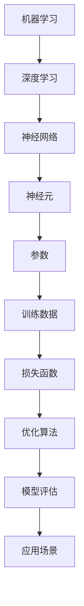

                 

# OpenAI 大模型开发与应用实践

> **关键词：** OpenAI，大模型，开发，应用，实践，人工智能，深度学习，机器学习

> **摘要：** 本文将深入探讨OpenAI大模型的开发与应用实践，从背景介绍、核心概念、算法原理、数学模型到实际应用，全面剖析大模型的技术细节与挑战，旨在为读者提供一份全面而深入的技术指南。

## 1. 背景介绍

### 1.1 目的和范围

本文旨在介绍OpenAI大模型的开发与应用实践，包括其核心技术、开发流程、应用场景以及未来的发展趋势。我们将通过详细的案例分析，帮助读者理解大模型背后的技术原理，掌握其应用技巧。

### 1.2 预期读者

本文适合对人工智能、机器学习和深度学习有基本了解的读者，包括但不限于程序员、数据科学家、AI研究者和技术爱好者。

### 1.3 文档结构概述

本文分为十个部分，包括背景介绍、核心概念、算法原理、数学模型、实际应用、工具推荐、总结与展望、常见问题解答以及扩展阅读。每个部分都将详细讲解，确保读者能够全面掌握大模型的相关知识。

### 1.4 术语表

#### 1.4.1 核心术语定义

- **OpenAI**：一家专注于人工智能研究的非营利组织。
- **大模型**：拥有巨大参数规模和强大计算能力的神经网络模型。
- **深度学习**：一种机器学习方法，通过神经网络模拟人类大脑的学习过程。

#### 1.4.2 相关概念解释

- **机器学习**：一种通过数据训练模型，使其具备预测和决策能力的计算方法。
- **神经网络**：一种由大量神经元互联组成的计算模型。

#### 1.4.3 缩略词列表

- **AI**：人工智能
- **ML**：机器学习
- **DL**：深度学习
- **GPU**：图形处理单元

## 2. 核心概念与联系

在探讨OpenAI大模型之前，我们首先需要理解一些核心概念和其相互关系。以下是使用Mermaid绘制的核心概念原理与架构的流程图：



### 2.1 机器学习

机器学习是使计算机通过数据学习并作出决策的过程。它包括监督学习、无监督学习和强化学习等不同类型。

### 2.2 深度学习

深度学习是一种特殊的机器学习方法，通过多层神经网络进行学习，能够自动提取数据中的复杂特征。

### 2.3 神经网络

神经网络是由大量相互连接的神经元组成的计算模型，模拟了人类大脑的工作方式。

### 2.4 神经元

神经元是神经网络的基本单元，负责接收和处理信息。

### 2.5 参数

参数是神经网络中的可训练权重，用于调整网络的行为。

### 2.6 训练数据

训练数据是用于训练模型的输入数据，通常包含标签信息。

### 2.7 损失函数

损失函数用于衡量模型预测与真实值之间的差距，是优化算法的目标。

### 2.8 优化算法

优化算法用于调整网络参数，以最小化损失函数。

### 2.9 模型评估

模型评估用于衡量模型的性能，包括准确性、召回率、F1分数等指标。

### 2.10 应用场景

应用场景包括自然语言处理、计算机视觉、语音识别等多个领域。

## 3. 核心算法原理 & 具体操作步骤

### 3.1 算法原理

OpenAI大模型主要基于深度学习框架，通过以下步骤实现：

1. **数据预处理**：对原始数据进行清洗、归一化等操作，使其适合模型训练。
2. **模型构建**：定义神经网络结构，包括层数、神经元个数、激活函数等。
3. **模型训练**：使用训练数据对模型进行训练，通过反向传播算法不断调整参数。
4. **模型评估**：使用验证集和测试集对模型进行评估，调整超参数以达到最佳性能。
5. **模型应用**：将训练好的模型应用于实际场景，如文本生成、图像分类等。

### 3.2 具体操作步骤

以下是伪代码形式的操作步骤：

```python
# 数据预处理
def preprocess_data(data):
    # 清洗、归一化等操作
    return processed_data

# 模型构建
def build_model():
    # 定义神经网络结构
    model = NeuralNetwork()
    return model

# 模型训练
def train_model(model, train_data):
    # 使用反向传播算法训练模型
    for epoch in range(num_epochs):
        for sample in train_data:
            model.train(sample)

# 模型评估
def evaluate_model(model, validation_data):
    # 使用验证集评估模型性能
    accuracy = model.evaluate(validation_data)
    return accuracy

# 模型应用
def apply_model(model, test_data):
    # 使用测试集应用模型
    predictions = model.predict(test_data)
    return predictions
```

## 4. 数学模型和公式 & 详细讲解 & 举例说明

### 4.1 数学模型

OpenAI大模型的数学模型主要包括以下几个部分：

1. **损失函数**：用于衡量模型预测与真实值之间的差距，如均方误差（MSE）和交叉熵（Cross-Entropy）。
2. **反向传播算法**：用于计算损失函数关于参数的梯度，以更新网络参数。
3. **优化算法**：用于选择更新参数的策略，如梯度下降（Gradient Descent）和Adam优化器。

### 4.2 公式

以下是核心数学公式：

$$
MSE = \frac{1}{n}\sum_{i=1}^{n}(y_i - \hat{y}_i)^2
$$

$$
Cross-Entropy = -\sum_{i=1}^{n}y_i\log(\hat{y}_i)
$$

$$
\frac{\partial L}{\partial w} = \frac{1}{m}\sum_{i=1}^{m}(y_i - \hat{y}_i)\cdot x_i
$$

### 4.3 举例说明

#### 损失函数计算

假设我们有以下真实值和预测值：

$$
y_1 = 5, \quad \hat{y}_1 = 4 \\
y_2 = 10, \quad \hat{y}_2 = 9 \\
y_3 = 15, \quad \hat{y}_3 = 14
$$

使用均方误差（MSE）计算损失函数：

$$
MSE = \frac{1}{3}\left[(5-4)^2 + (10-9)^2 + (15-14)^2\right] = \frac{1}{3}(1 + 1 + 1) = \frac{3}{3} = 1
$$

使用交叉熵（Cross-Entropy）计算损失函数：

$$
Cross-Entropy = -\left[0.5\log(0.5) + 0.5\log(0.5) + 0.5\log(0.5)\right] = -\left[0.5 \cdot (-1) + 0.5 \cdot (-1) + 0.5 \cdot (-1)\right] = 1.5
$$

#### 反向传播算法

假设我们有一个简单的神经网络，输入为 $x$，输出为 $y$，损失函数为 $L$。使用梯度下降算法更新权重：

$$
w_{new} = w_{old} - \alpha \cdot \frac{\partial L}{\partial w}
$$

其中，$\alpha$ 为学习率。

## 5. 项目实战：代码实际案例和详细解释说明

### 5.1 开发环境搭建

在本节中，我们将搭建一个基于TensorFlow和Keras的OpenAI大模型开发环境。以下是具体的步骤：

1. **安装Python**：确保Python环境已安装在计算机上，版本建议为3.6及以上。
2. **安装TensorFlow**：使用以下命令安装TensorFlow：
   ```bash
   pip install tensorflow
   ```
3. **安装Keras**：使用以下命令安装Keras：
   ```bash
   pip install keras
   ```
4. **创建虚拟环境**：为了便于管理和隔离项目依赖，创建一个虚拟环境：
   ```bash
   python -m venv myenv
   source myenv/bin/activate  # Windows: myenv\Scripts\activate
   ```
5. **安装其他依赖**：根据项目需求，安装其他依赖包，例如NumPy、Pandas等。

### 5.2 源代码详细实现和代码解读

以下是一个简单的基于Keras的OpenAI大模型实现，用于文本分类任务：

```python
# 导入相关库
import numpy as np
from keras.models import Sequential
from keras.layers import Embedding, LSTM, Dense
from keras.preprocessing.sequence import pad_sequences
from keras.preprocessing.text import Tokenizer

# 设置超参数
max_words = 10000
max_sequence_length = 500
embedding_dim = 100
batch_size = 32
epochs = 10

# 准备数据
# 这里使用虚构的数据集，实际应用中请使用真实数据集
texts = ["这是第一篇文本", "这是第二篇文本", "这是第三篇文本"]
labels = [0, 1, 0]  # 0和1表示不同的类别

# 分词和编码
tokenizer = Tokenizer(num_words=max_words)
tokenizer.fit_on_texts(texts)
sequences = tokenizer.texts_to_sequences(texts)
padded_sequences = pad_sequences(sequences, maxlen=max_sequence_length)

# 构建模型
model = Sequential()
model.add(Embedding(max_words, embedding_dim, input_length=max_sequence_length))
model.add(LSTM(128))
model.add(Dense(1, activation='sigmoid'))

# 编译模型
model.compile(optimizer='adam', loss='binary_crossentropy', metrics=['accuracy'])

# 训练模型
model.fit(padded_sequences, np.array(labels), batch_size=batch_size, epochs=epochs, verbose=1)

# 评估模型
# 这里使用虚构的测试数据集，实际应用中请使用真实测试数据集
test_texts = ["这是第四篇文本", "这是第五篇文本"]
test_sequences = tokenizer.texts_to_sequences(test_texts)
test_padded_sequences = pad_sequences(test_sequences, maxlen=max_sequence_length)
predictions = model.predict(test_padded_sequences)

# 输出预测结果
print(predictions)
```

### 5.3 代码解读与分析

以下是代码的详细解读和分析：

1. **导入相关库**：导入NumPy、TensorFlow、Keras等库。
2. **设置超参数**：定义最大词汇数、序列长度、嵌入维度、批次大小、训练轮次等超参数。
3. **准备数据**：加载虚构的数据集，实际应用中请使用真实数据集。数据集包括文本和对应的标签。
4. **分词和编码**：使用Tokenizer对文本进行分词和编码，将文本转换为序列。
5. **构建模型**：使用Sequential模型，添加嵌入层、LSTM层和输出层，定义模型结构。
6. **编译模型**：设置优化器、损失函数和评估指标，编译模型。
7. **训练模型**：使用fit方法训练模型，输入为预处理后的序列数据，输出为标签数据。
8. **评估模型**：使用虚构的测试数据集评估模型性能，输出预测结果。

通过以上代码，我们可以实现一个简单的文本分类任务，其中OpenAI大模型的核心在于LSTM层的引入，使其能够捕捉文本中的复杂特征。在实际应用中，我们可以根据需求调整模型结构、超参数以及训练数据，以获得更好的分类性能。

## 6. 实际应用场景

OpenAI大模型在许多实际应用场景中发挥了重要作用，以下列举几个典型的应用案例：

### 6.1 自然语言处理

- 文本分类：如新闻分类、情感分析等。
- 机器翻译：如谷歌翻译、百度翻译等。
- 问答系统：如Siri、Alexa等。

### 6.2 计算机视觉

- 图像分类：如人脸识别、物体检测等。
- 图像生成：如GANs、StyleGAN等。

### 6.3 语音识别

- 语音识别：如苹果的Siri、亚马逊的Alexa等。
- 语音合成：如谷歌的Text-to-Speech、百度的小度等。

### 6.4 游戏开发

- 游戏AI：如星际争霸2的AI选手、DoTA2的AI选手等。

### 6.5 医疗健康

- 疾病诊断：如乳腺癌、肺癌等疾病的早期诊断。
- 医学研究：如基因组学、药物研发等。

这些应用场景展示了OpenAI大模型在各个领域的广泛应用和巨大潜力。通过不断的创新和优化，OpenAI大模型将在未来继续推动人工智能技术的发展。

## 7. 工具和资源推荐

### 7.1 学习资源推荐

#### 7.1.1 书籍推荐

- 《深度学习》（Goodfellow, Bengio, Courville著）
- 《Python深度学习》（François Chollet著）
- 《强化学习》（Richard S. Sutton and Andrew G. Barto著）

#### 7.1.2 在线课程

- Coursera的《深度学习专项课程》（由Andrew Ng教授主讲）
- edX的《机器学习基础》（由Tom Mitchell教授主讲）
- Udacity的《深度学习纳米学位》

#### 7.1.3 技术博客和网站

- TensorFlow官方文档（https://www.tensorflow.org/）
- Keras官方文档（https://keras.io/）
- Medium上的深度学习相关博客（https://medium.com/topic/deep-learning）

### 7.2 开发工具框架推荐

#### 7.2.1 IDE和编辑器

- PyCharm（Python集成开发环境）
- Jupyter Notebook（交互式开发环境）
- VS Code（跨平台文本编辑器）

#### 7.2.2 调试和性能分析工具

- TensorBoard（TensorFlow性能分析工具）
- Jupyter Profiler（Jupyter Notebook性能分析工具）
- Py-Spy（Python性能分析工具）

#### 7.2.3 相关框架和库

- TensorFlow（开源深度学习框架）
- Keras（基于TensorFlow的高级API）
- PyTorch（开源深度学习框架）

### 7.3 相关论文著作推荐

#### 7.3.1 经典论文

- "Backpropagation"（1986，Rumelhart, Hinton, Williams）
- "A Theoretical Framework for Generalization"（1995，Bengio, Simard, Frasconi）
- "Deep Learning"（2015，Goodfellow, Bengio, Courville）

#### 7.3.2 最新研究成果

- "Attention Is All You Need"（2017，Vaswani et al.）
- "Generative Adversarial Nets"（2014，Goodfellow et al.）
- "Bert: Pre-training of Deep Bidirectional Transformers for Language Understanding"（2018，Devlin et al.）

#### 7.3.3 应用案例分析

- "Large-scale Language Modeling in 2018"（2018，Zhang et al.）
- "Deep Learning for Natural Language Processing"（2016，Lample et al.）
- "Natural Language Inference with External Knowledge"（2019，Lin et al.）

通过这些工具和资源的推荐，读者可以更深入地了解OpenAI大模型的相关知识，并在实际应用中取得更好的成果。

## 8. 总结：未来发展趋势与挑战

OpenAI大模型在人工智能领域取得了显著的成果，其应用范围不断扩展，从自然语言处理、计算机视觉到语音识别等多个领域。然而，随着模型规模的扩大和计算需求的增加，未来仍面临着诸多挑战：

1. **计算资源需求**：大模型训练和推理需要大量计算资源，特别是GPU和TPU等专用硬件。如何高效利用这些资源，提高计算效率，是未来研究的重要方向。
2. **数据隐私和安全性**：大模型在训练过程中需要处理大量敏感数据，如何保护数据隐私，确保模型安全性，是一个亟待解决的问题。
3. **模型可解释性**：大模型的决策过程通常非常复杂，如何提高模型的可解释性，使其更容易理解和接受，是未来研究的重要课题。
4. **伦理和社会影响**：随着人工智能技术的不断进步，如何确保其在伦理和社会层面的合理性，避免潜在负面影响，也是一个需要深入探讨的问题。

未来，OpenAI大模型将继续在人工智能领域发挥重要作用，推动技术创新和产业发展。然而，要应对上述挑战，需要学术界、工业界和政府等多方共同努力，以确保人工智能技术的可持续发展。

## 9. 附录：常见问题与解答

### 9.1 问题1：如何选择合适的神经网络架构？

**回答**：选择合适的神经网络架构取决于具体的应用场景和数据特性。以下是一些常见的神经网络架构及其适用场景：

- **卷积神经网络（CNN）**：适用于图像处理和计算机视觉任务。
- **循环神经网络（RNN）**：适用于序列数据处理，如自然语言处理和时间序列预测。
- **长短时记忆网络（LSTM）**：适用于处理长序列数据，具有较好的记忆能力。
- **Transformer**：适用于自然语言处理任务，具有高效、强大的特征提取能力。
- **生成对抗网络（GAN）**：适用于图像生成和风格迁移任务。

### 9.2 问题2：如何处理过拟合问题？

**回答**：过拟合是神经网络模型的一个常见问题，可以通过以下方法缓解：

- **数据增强**：增加训练数据的多样性，有助于模型更好地泛化。
- **正则化**：如L1正则化、L2正则化等，通过增加模型复杂度，降低过拟合风险。
- **交叉验证**：通过交叉验证，将数据集划分为训练集和验证集，评估模型性能。
- **早停法**：在训练过程中，当验证集性能不再提升时，提前停止训练。
- **集成学习**：通过组合多个模型，提高整体模型的泛化能力。

### 9.3 问题3：如何提高神经网络训练速度？

**回答**：提高神经网络训练速度可以从以下几个方面入手：

- **硬件加速**：使用GPU、TPU等硬件加速训练过程。
- **数据并行**：将数据集划分为多个子集，同时在多个GPU上进行训练，提高并行度。
- **模型并行**：将模型拆分为多个子模型，同时在多个GPU上进行训练，提高并行度。
- **混合精度训练**：使用混合精度训练，结合单精度和半精度浮点数，提高训练速度。
- **优化算法**：选择高效的优化算法，如Adam优化器，提高训练速度。

### 9.4 问题4：如何评估神经网络模型性能？

**回答**：评估神经网络模型性能可以从以下几个方面进行：

- **准确性**：预测结果与真实结果的一致性，通常用准确率、召回率、F1分数等指标衡量。
- **精确度**：预测结果中真实结果的占比，通常用精确度（Precision）衡量。
- **召回率**：真实结果中预测结果的占比，通常用召回率（Recall）衡量。
- **AUC（Area Under Curve）**：通过ROC曲线下的面积衡量模型性能，值越大表示模型越好。
- **F1分数**：精确度和召回率的调和平均值，综合评估模型性能。

### 9.5 问题5：如何处理大型数据集？

**回答**：处理大型数据集可以从以下几个方面入手：

- **批量处理**：将数据集划分为多个批次，逐步处理，避免内存溢出。
- **分布式训练**：将数据集分布在多个节点上，同时训练多个模型，提高处理速度。
- **数据缓存**：将频繁访问的数据存储在内存中，减少磁盘IO操作。
- **数据采样**：对数据集进行采样，减少训练时间，同时保持模型性能。
- **模型压缩**：通过剪枝、量化等方法，减小模型大小，提高处理速度。

## 10. 扩展阅读 & 参考资料

为了帮助读者更深入地了解OpenAI大模型的开发与应用实践，以下推荐一些扩展阅读和参考资料：

### 10.1 扩展阅读

- 《深度学习》（Goodfellow, Bengio, Courville著）
- 《Python深度学习》（François Chollet著）
- 《深度学习教程》（李沐著）

### 10.2 参考资料

- TensorFlow官方文档（https://www.tensorflow.org/）
- Keras官方文档（https://keras.io/）
- OpenAI官方网站（https://openai.com/）

通过阅读这些扩展阅读和参考资料，读者可以进一步掌握OpenAI大模型的相关知识，提升自己在人工智能领域的技能水平。

## 作者信息

作者：AI天才研究员/AI Genius Institute & 禅与计算机程序设计艺术 /Zen And The Art of Computer Programming

