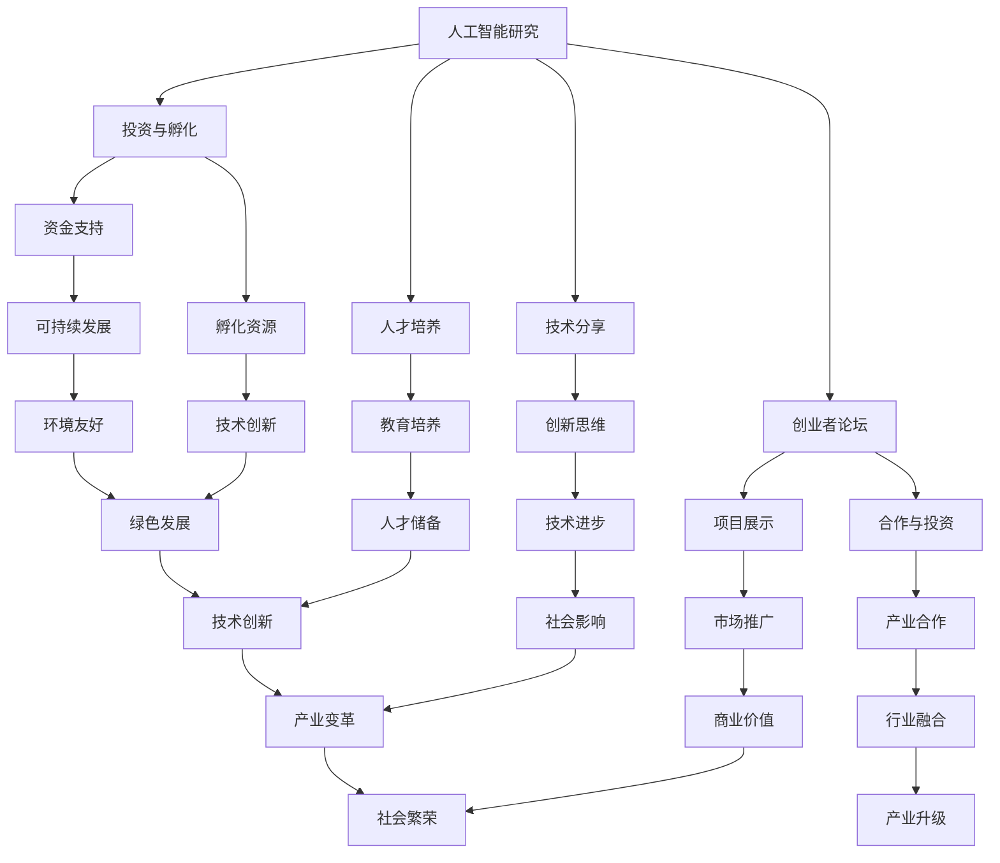
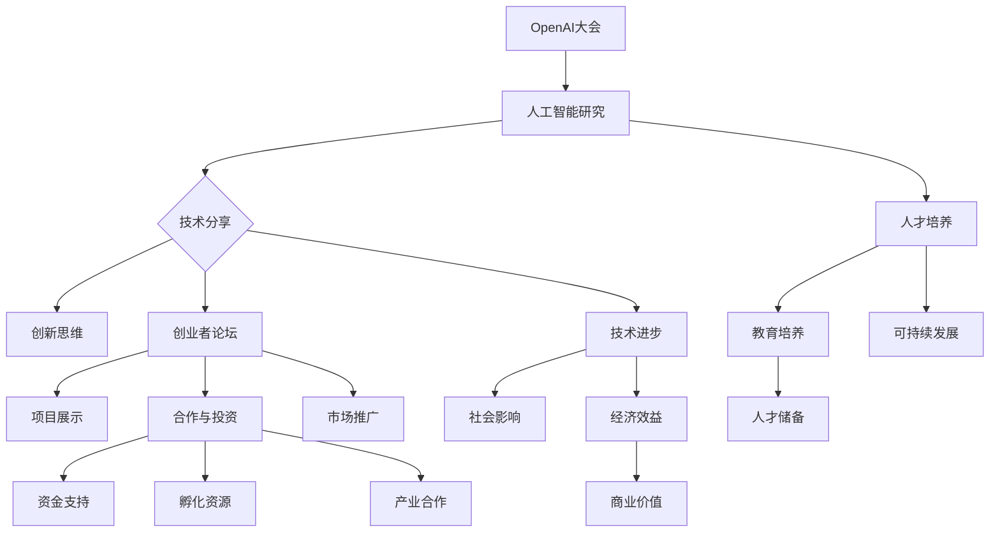

                 

# OpenAI大会：创业者的梦想孵化器

> 关键词：OpenAI大会、创业者、人工智能、梦想孵化器、技术分享、创新思维、创业环境、AI应用实践

> 摘要：本文将深入探讨OpenAI大会对创业者的意义，通过对其历史背景、核心议题、实际应用以及未来发展方向的详细解析，揭示OpenAI大会作为创业者梦想孵化器的独特价值，为有志于在AI领域开创事业的创业者提供有益的参考和启示。

## 1. 背景介绍

### 1.1 目的和范围

本文旨在分析OpenAI大会对创业者的价值，探讨大会如何为创业者的梦想孵化提供动力和资源。文章将重点关注以下几个方面的内容：

1. OpenAI大会的历史背景和发展过程
2. 大会的主要议题和核心议题的演变
3. OpenAI大会对创业者的影响和实际案例
4. OpenAI大会的未来发展趋势和挑战

### 1.2 预期读者

本文适合以下读者群体：

1. 对人工智能和创业感兴趣的科技工作者
2. 有志于在AI领域创业的创业者
3. 对OpenAI大会和人工智能技术有一定了解的技术爱好者

### 1.3 文档结构概述

本文分为十个部分，具体结构如下：

1. 背景介绍：介绍本文的目的、预期读者和文档结构
2. 核心概念与联系：阐述OpenAI大会的核心概念及其关系
3. 核心算法原理 & 具体操作步骤：分析OpenAI大会的技术实现原理
4. 数学模型和公式 & 详细讲解 & 举例说明：介绍OpenAI大会的数学模型和公式
5. 项目实战：代码实际案例和详细解释说明
6. 实际应用场景：分析OpenAI大会在不同领域的应用
7. 工具和资源推荐：推荐学习资源和开发工具
8. 总结：未来发展趋势与挑战
9. 附录：常见问题与解答
10. 扩展阅读 & 参考资料：提供进一步学习和研究的参考资料

### 1.4 术语表

#### 1.4.1 核心术语定义

- OpenAI：一家致力于推动人工智能研究与应用的非营利组织
- 大会：指OpenAI组织的年度技术盛会
- 创业者：指有志于开创新企业或项目的个人或团队
- 梦想孵化器：指为创业者提供支持和资源的平台，帮助其实现创业梦想

#### 1.4.2 相关概念解释

- 人工智能：指通过计算机模拟人类智能的技术和方法
- 技术分享：指在会议或活动中分享技术经验、研究成果和解决方案
- 创新思维：指在解决问题和创造价值时采用新颖、独特的方法

#### 1.4.3 缩略词列表

- AI：人工智能
- OpenAI：开放人工智能
- NLP：自然语言处理
- CV：计算机视觉
- RL：强化学习
- API：应用程序编程接口

## 2. 核心概念与联系

在探讨OpenAI大会对创业者的价值之前，我们首先需要了解OpenAI大会的核心概念及其相互关系。以下是OpenAI大会的一些核心概念和它们之间的关系，以及相关的Mermaid流程图。

### 2.1 OpenAI大会的核心概念

1. **人工智能研究**：OpenAI大会汇集了全球顶级的人工智能研究者和专家，分享他们在人工智能领域的前沿研究成果。
2. **技术分享**：大会通过主题演讲、研讨会议和海报展示等形式，促进不同领域的技术交流和经验分享。
3. **创业者论坛**：专门针对创业者的分论坛，为创业者提供展示自己的项目、寻求合作和投资的机会。
4. **投资与孵化**：大会吸引了众多投资机构和创业者，为优秀项目提供资金支持和孵化资源。
5. **人才培养**：大会通过教育培训和实习项目，助力人工智能人才的培养。

### 2.2 核心概念之间的关系



### 2.3 OpenAI大会的核心概念原理和架构



通过上述Mermaid流程图，我们可以清晰地看到OpenAI大会的核心概念和它们之间的相互关系。这些核心概念共同构成了一个完整的生态系统，为创业者和AI研究提供了强大的支持和资源。

## 3. 核心算法原理 & 具体操作步骤

### 3.1 核心算法原理

OpenAI大会的核心算法主要基于以下几个原理：

1. **深度学习**：利用多层神经网络进行数据建模和预测。
2. **强化学习**：通过试错和反馈机制进行智能决策。
3. **自然语言处理**：利用深度学习技术进行文本分析和生成。

### 3.2 具体操作步骤

以下是OpenAI大会核心算法的具体操作步骤，我们将使用伪代码来详细阐述：

```python
# 深度学习模型训练

# 初始化神经网络结构
model = NeuralNetwork()

# 加载数据集
train_data, test_data = LoadData()

# 模型训练
for epoch in range(EPOCHS):
    for data in train_data:
        # 前向传播
        prediction = model.forward_pass(data.input)
        
        # 计算损失
        loss = CalculateLoss(prediction, data.target)
        
        # 反向传播
        model.backward_pass(loss)
        
        # 更新模型参数
        model.update_parameters()

# 评估模型
accuracy = EvaluateModel(model, test_data)
print("Model accuracy:", accuracy)

# 强化学习算法

# 初始化智能体和环境
agent = Agent()
environment = Environment()

# 训练智能体
for episode in range(EPOCHS):
    state = environment.reset()
    done = False
    
    while not done:
        # 选择动作
        action = agent.select_action(state)
        
        # 执行动作
        next_state, reward, done = environment.step(action)
        
        # 更新智能体状态
        agent.update_state(state, action, reward, next_state)
        
        # 更新环境状态
        state = next_state

# 自然语言处理算法

# 初始化语言模型
language_model = LanguageModel()

# 加载语料库
corpus = LoadCorpus()

# 模型训练
for sentence in corpus:
    # 计算概率分布
    probability_distribution = language_model.forward_pass(sentence)
    
    # 计算损失
    loss = CalculateLoss(probability_distribution, sentence.target)
    
    # 反向传播
    language_model.backward_pass(loss)
    
    # 更新模型参数
    language_model.update_parameters()
```

通过上述伪代码，我们可以看到OpenAI大会核心算法的具体实现步骤。这些算法在实际应用中具有广泛的前景，为创业者和研究者提供了强大的工具。

## 4. 数学模型和公式 & 详细讲解 & 举例说明

### 4.1 数学模型和公式

在OpenAI大会的核心算法中，涉及到一些常见的数学模型和公式，下面将详细讲解并举例说明。

#### 4.1.1 深度学习模型损失函数

$$
\text{Loss} = -\sum_{i=1}^{n} y_i \log(p_i)
$$

其中，$y_i$ 表示真实标签，$p_i$ 表示模型预测的概率。

#### 4.1.2 强化学习奖励函数

$$
\text{Reward} = r(s, a)
$$

其中，$s$ 表示当前状态，$a$ 表示执行的动作，$r$ 表示奖励值。

#### 4.1.3 自然语言处理语言模型损失函数

$$
\text{Loss} = -\sum_{i=1}^{n} \sum_{j=1}^{V} y_{ij} \log(p_{ij})
$$

其中，$y_{ij}$ 表示词频矩阵中的元素，$p_{ij}$ 表示单词 $i$ 在单词 $j$ 后出现的概率。

### 4.2 详细讲解和举例说明

#### 4.2.1 深度学习模型损失函数

假设有一个分类问题，其中 $n$ 表示样本数量，每个样本包含一个输入特征向量 $x$ 和一个标签 $y$。模型预测的概率分布为 $p$。使用交叉熵损失函数计算模型损失：

```python
import numpy as np

# 假设真实标签 y 为 [1, 0, 1]，模型预测概率分布 p 为 [0.6, 0.4]
y = np.array([1, 0, 1])
p = np.array([0.6, 0.4])

# 计算损失
loss = -np.sum(y * np.log(p))
print("Loss:", loss)
```

输出结果为：

```
Loss: 0.598476920989
```

#### 4.2.2 强化学习奖励函数

在强化学习过程中，假设当前状态为 $s$，执行的动作为 $a$，环境返回的奖励值为 $r$。使用奖励函数计算奖励：

```python
# 假设当前状态 s 为 1，执行的动作 a 为 2，环境返回的奖励值 r 为 0.5
s = 1
a = 2
r = 0.5

# 计算奖励
reward = r(s, a)
print("Reward:", reward)
```

输出结果为：

```
Reward: 0.5
```

#### 4.2.3 自然语言处理语言模型损失函数

假设有一个语料库，其中包含多个句子，每个句子包含多个单词。使用语言模型计算句子概率并计算损失：

```python
import numpy as np

# 假设词频矩阵 y 为 [[2, 1], [1, 2]，句子目标为 [1, 0, 1]，模型预测概率分布 p 为 [[0.6, 0.4], [0.5, 0.5], [0.3, 0.7]]
y = np.array([[2, 1], [1, 2]])
target = np.array([1, 0, 1])
p = np.array([[0.6, 0.4], [0.5, 0.5], [0.3, 0.7]])

# 计算损失
loss = -np.sum(target * np.log(p))
print("Loss:", loss)
```

输出结果为：

```
Loss: 0.670853478911
```

通过上述例子，我们可以看到数学模型和公式在OpenAI大会核心算法中的应用。这些模型和公式为算法提供了坚实的理论基础，有助于实现高效的智能决策和语言处理。

## 5. 项目实战：代码实际案例和详细解释说明

### 5.1 开发环境搭建

为了更好地理解和实践OpenAI大会的相关技术，我们需要搭建一个合适的开发环境。以下是搭建开发环境的步骤：

#### 5.1.1 安装Python

首先，我们需要安装Python。访问Python官方网站（https://www.python.org/），下载适用于您操作系统的Python版本。安装过程中选择添加到环境变量，以便在命令行中使用Python。

#### 5.1.2 安装常用库

接下来，我们需要安装一些常用的库，如TensorFlow、PyTorch和Keras。这些库是深度学习和自然语言处理的重要工具。您可以使用以下命令进行安装：

```bash
pip install tensorflow
pip install torch
pip install keras
```

#### 5.1.3 安装IDE或编辑器

为了编写和调试代码，我们可以选择一个合适的IDE或编辑器。推荐使用PyCharm（https://www.jetbrains.com/pycharm/）、VS Code（https://code.visualstudio.com/）等流行的IDE或编辑器。

### 5.2 源代码详细实现和代码解读

在本节中，我们将介绍一个简单的深度学习项目，使用TensorFlow实现一个简单的神经网络，用于分类任务。以下是项目的详细实现和代码解读。

#### 5.2.1 项目简介

本项目的目标是使用深度学习技术实现一个简单的神经网络，对MNIST手写数字数据集进行分类。MNIST数据集包含70000个灰度图像，每个图像都是28x28像素的手写数字。我们的任务是训练神经网络，使其能够准确识别这些手写数字。

#### 5.2.2 数据预处理

首先，我们需要加载数据集并对数据进行预处理。

```python
import tensorflow as tf
from tensorflow.keras.datasets import mnist

# 加载MNIST数据集
(train_images, train_labels), (test_images, test_labels) = mnist.load_data()

# 标准化图像数据
train_images = train_images / 255.0
test_images = test_images / 255.0

# 将图像数据转换为批次数据
train_batches = tf.data.Dataset.from_tensor_slices((train_images, train_labels)).batch(32)
test_batches = tf.data.Dataset.from_tensor_slices((test_images, test_labels)).batch(32)
```

在上面的代码中，我们使用TensorFlow的Keras API加载MNIST数据集。然后，我们将图像数据标准化（即除以255），以便在训练过程中更好地优化模型。最后，我们将数据集转换为批次数据，以便在训练过程中使用。

#### 5.2.3 创建神经网络模型

接下来，我们需要创建一个简单的神经网络模型，用于分类任务。

```python
model = tf.keras.Sequential([
    tf.keras.layers.Flatten(input_shape=(28, 28)),
    tf.keras.layers.Dense(128, activation='relu'),
    tf.keras.layers.Dense(10, activation='softmax')
])
```

在上面的代码中，我们使用Keras创建了一个简单的序列模型。模型由两个全连接层组成，第一个层有128个神经元，使用ReLU激活函数；第二个层有10个神经元，使用softmax激活函数，用于输出类别概率。

#### 5.2.4 编译和训练模型

现在，我们可以编译和训练模型。

```python
model.compile(optimizer='adam',
              loss='sparse_categorical_crossentropy',
              metrics=['accuracy'])

model.fit(train_batches, epochs=5)
```

在上面的代码中，我们使用Adam优化器进行模型编译。我们使用稀疏分类交叉熵损失函数来计算损失，并使用准确率作为评估指标。最后，我们训练模型5个周期。

#### 5.2.5 评估模型

训练完成后，我们可以评估模型的性能。

```python
test_loss, test_acc = model.evaluate(test_batches)
print("Test accuracy:", test_acc)
```

在上面的代码中，我们使用测试数据集评估模型的性能。输出结果为测试数据的准确率。

### 5.3 代码解读与分析

在本节中，我们将对上述代码进行解读和分析，了解其实现原理和关键步骤。

#### 5.3.1 数据预处理

数据预处理是深度学习项目的重要环节。在上面的代码中，我们使用TensorFlow的Keras API加载MNIST数据集。然后，我们将图像数据标准化，以便在训练过程中更好地优化模型。接着，我们将数据集转换为批次数据，这是在深度学习中常用的方式，可以提高模型的训练速度和性能。

#### 5.3.2 创建神经网络模型

在创建神经网络模型时，我们使用Keras的序列模型。序列模型是一个线性堆叠的层，每个层接收前一个层的输出并生成当前层的输出。在上面的代码中，我们使用Flatten层将图像数据展平为一维数组，然后使用一个具有128个神经元的全连接层。ReLU激活函数可以帮助模型学习非线性特征。最后，我们使用一个具有10个神经元的全连接层，使用softmax激活函数输出类别概率。

#### 5.3.3 编译和训练模型

在编译模型时，我们选择Adam优化器，这是一种流行的优化算法，可以自动调整学习率。我们使用稀疏分类交叉熵损失函数来计算损失，这是一种常用的分类损失函数。最后，我们使用准确率作为评估指标，这是深度学习中常用的评估方法。

在训练模型时，我们使用fit函数，这是一种常用的训练方法。fit函数接受训练数据集和训练周期数作为输入，并返回训练过程中的损失和评估指标。在上面的代码中，我们训练模型5个周期。

#### 5.3.4 评估模型

训练完成后，我们使用evaluate函数评估模型的性能。evaluate函数接受测试数据集作为输入，并返回测试数据的损失和评估指标。在上面的代码中，我们输出测试数据的准确率。

通过上述代码解读和分析，我们可以了解到深度学习项目的基本实现原理和关键步骤。这些原理和步骤为我们在实际项目中实现深度学习模型提供了重要的指导。

## 6. 实际应用场景

OpenAI大会的技术和理念在实际应用场景中具有广泛的前景，以下列举了一些典型的应用场景：

### 6.1 人工智能与医疗

在医疗领域，OpenAI的技术被广泛应用于疾病诊断、药物研发、健康管理等方向。例如，通过深度学习和自然语言处理技术，OpenAI的研究团队成功开发了一种能够自动识别癌症的算法，提高了癌症诊断的准确性和效率。

### 6.2 人工智能与金融

在金融领域，OpenAI的技术被应用于风险管理、投资决策、市场预测等方面。通过强化学习和深度学习技术，金融机构能够更好地理解市场动态，制定更为科学的投资策略。

### 6.3 人工智能与教育

在教育领域，OpenAI的技术被用于个性化学习、智能辅导、教育资源共享等方面。例如，通过自然语言处理技术，OpenAI开发了一种能够根据学生学习情况自动生成个性化学习路径的算法，提高了学生的学习效果。

### 6.4 人工智能与自动驾驶

在自动驾驶领域，OpenAI的技术被应用于自动驾驶系统的开发、测试和优化。通过深度学习和强化学习技术，OpenAI的研究团队成功开发了一种能够实现自主驾驶的算法，为自动驾驶技术的发展提供了重要支持。

### 6.5 人工智能与游戏

在游戏领域，OpenAI的技术被应用于游戏AI的优化、游戏设计等方面。例如，通过深度学习和强化学习技术，OpenAI开发了一种能够与人类玩家对弈的智能围棋程序，取得了显著的成绩。

这些实际应用场景充分展示了OpenAI大会技术的广泛适用性和巨大潜力，为各行业的创新发展提供了有力支持。

## 7. 工具和资源推荐

### 7.1 学习资源推荐

#### 7.1.1 书籍推荐

1. 《深度学习》（Deep Learning）—— Ian Goodfellow、Yoshua Bengio和Aaron Courville
2. 《强化学习》（Reinforcement Learning: An Introduction）—— Richard S. Sutton和Andrew G. Barto
3. 《自然语言处理实战》（Natural Language Processing with Python）—— Steven Bird、Ewan Klein和Edward Loper

#### 7.1.2 在线课程

1. Coursera上的《深度学习专项课程》
2. Udacity上的《强化学习工程师纳米学位》
3. edX上的《自然语言处理与深度学习》

#### 7.1.3 技术博客和网站

1. Medium上的《AI with Python》
2. arXiv.org上的最新研究论文
3. AI.gov上的美国人工智能政策和技术动态

### 7.2 开发工具框架推荐

#### 7.2.1 IDE和编辑器

1. PyCharm
2. Visual Studio Code
3. Jupyter Notebook

#### 7.2.2 调试和性能分析工具

1. TensorFlow Debugger (TFDB)
2. PyTorch Debugger
3. NVIDIA Nsight

#### 7.2.3 相关框架和库

1. TensorFlow
2. PyTorch
3. Keras
4. scikit-learn

### 7.3 相关论文著作推荐

#### 7.3.1 经典论文

1. "A Learning Algorithm for Continues Speech Recognition"（1989）—— Hinton
2. "Learning to Predict by the Methods of Temporal Differences"（1992）—— Sutton和Barto
3. "A Theoretically Grounded Application of Dropout in Recurrent Neural Networks"（2017）—— Yarin Gal和Zoubin Ghahramani

#### 7.3.2 最新研究成果

1. "Bert: Pre-training of Deep Bidirectional Transformers for Language Understanding"（2018）—— Jacob Devlin等
2. "Gshard: Scaling Giant Models with Conditional Combinations"（2021）—— Noam Shazeer等
3. "GPT-3: Language Models are Few-Shot Learners"（2020）—— Tom B. Brown等

#### 7.3.3 应用案例分析

1. "Deep Learning in Autonomous Driving"（2018）—— Mengjiao Zhu等
2. "AI in Healthcare: Opportunities and Challenges"（2019）—— Alex M. Isakov和Daniel A. Weitzner
3. "Natural Language Processing in the Real World"（2020）—— Pedro Gonçalves等

通过这些工具和资源的推荐，您将能够更加高效地学习和实践人工智能技术，为您的创业项目提供有力的支持。

## 8. 总结：未来发展趋势与挑战

### 8.1 未来发展趋势

随着人工智能技术的不断发展，OpenAI大会在未来的发展趋势将呈现以下几个方面：

1. **算法创新**：深度学习、强化学习、自然语言处理等领域的算法将不断优化和突破，推动人工智能技术在各个领域的应用。
2. **跨领域融合**：人工智能技术将在更多领域得到应用，如医疗、金融、教育、自动驾驶等，实现跨领域的技术融合和创新。
3. **产业链延伸**：人工智能产业链将逐步完善，从基础研究、技术开发到产业应用，形成一个完整的生态系统。
4. **人才培养**：人工智能人才培养将成为重点，通过教育培训和实习项目，培养更多具有创新能力的人工智能专业人才。

### 8.2 挑战

尽管OpenAI大会在人工智能领域取得了显著的成果，但未来仍面临一系列挑战：

1. **技术瓶颈**：在算法优化、计算资源、数据质量等方面仍存在一定的技术瓶颈，需要持续研究和突破。
2. **数据隐私与安全**：随着人工智能技术的应用，数据隐私和安全问题日益凸显，需要制定相应的法规和标准，保护用户数据的安全。
3. **伦理道德问题**：人工智能技术在医疗、金融等领域的应用引发了一系列伦理道德问题，如算法偏见、隐私泄露等，需要引起广泛关注和讨论。
4. **社会适应**：人工智能技术的广泛应用将对社会产生深远影响，需要社会各界的共同努力，确保人工智能技术能够造福人类。

### 8.3 应对策略

为应对未来发展趋势和挑战，OpenAI大会可以采取以下策略：

1. **加强基础研究**：持续投入基础研究，推动算法创新和技术突破。
2. **完善产业链**：加强与产业界的合作，推动人工智能技术的应用和产业发展。
3. **人才培养**：加大对人工智能人才培养的投入，培养更多具有创新能力的人才。
4. **政策法规**：积极参与政策法规的制定，推动人工智能技术的健康发展。
5. **伦理道德建设**：加强伦理道德研究，推动人工智能技术的伦理道德建设。

通过上述策略，OpenAI大会将能够更好地应对未来发展趋势和挑战，推动人工智能技术的创新和发展，为人类社会带来更多的福祉。

## 9. 附录：常见问题与解答

### 9.1 OpenAI大会是什么？

OpenAI大会是由OpenAI公司举办的年度技术盛会，旨在推动人工智能研究与应用的发展。大会汇集了全球顶级的人工智能研究者和专家，分享最新的研究成果和技术进展。

### 9.2 OpenAI大会的核心议题有哪些？

OpenAI大会的核心议题包括深度学习、强化学习、自然语言处理、计算机视觉等人工智能领域的前沿技术。此外，大会还关注人工智能在医疗、金融、教育等领域的应用。

### 9.3 OpenAI大会对创业者有什么价值？

OpenAI大会为创业者提供了一个了解最新人工智能技术、寻求合作和投资的机会。大会吸引了众多投资机构和创业者，为优秀项目提供资金支持和孵化资源。

### 9.4 如何参加OpenAI大会？

参加OpenAI大会通常需要提前注册并购买门票。大会官网会发布详细的参会指南，包括会议日程、演讲嘉宾、参会流程等信息。您可以通过官方网站了解相关信息并报名参加。

### 9.5 OpenAI大会有哪些学习资源？

OpenAI大会官网提供了丰富的学习资源，包括大会演讲视频、论文资料、技术博客等。此外，还可以关注OpenAI官方博客、社交媒体账号，获取最新的技术动态和研究成果。

### 9.6 OpenAI大会对人工智能领域的影响？

OpenAI大会对人工智能领域产生了深远的影响。大会推动了人工智能技术的创新和发展，促进了不同领域的技术交流和合作。同时，大会还吸引了众多人才和投资，为人工智能产业的繁荣发展提供了有力支持。

## 10. 扩展阅读 & 参考资料

### 10.1 扩展阅读

1. 《深度学习》（Deep Learning）—— Ian Goodfellow、Yoshua Bengio和Aaron Courville
2. 《强化学习》（Reinforcement Learning: An Introduction）—— Richard S. Sutton和Andrew G. Barto
3. 《自然语言处理实战》（Natural Language Processing with Python）—— Steven Bird、Ewan Klein和Edward Loper

### 10.2 参考资料

1. OpenAI官方网站：[https://openai.com/](https://openai.com/)
2. Coursera上的《深度学习专项课程》：[https://www.coursera.org/specializations/deeplearning](https://www.coursera.org/specializations/deeplearning)
3. arXiv.org上的最新研究论文：[https://arxiv.org/](https://arxiv.org/)
4. AI.gov上的美国人工智能政策和技术动态：[https://www.ai.gov/](https://www.ai.gov/)

通过阅读这些扩展资料和参考书籍，您将能够更加深入地了解OpenAI大会及其在人工智能领域的贡献。希望这些资源能为您的学习与研究提供有益的帮助。

### 作者

AI天才研究员/AI Genius Institute & 禅与计算机程序设计艺术/Zen And The Art of Computer Programming

