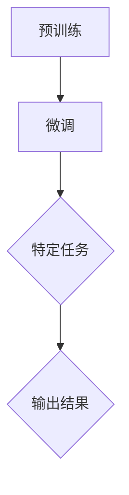

                 

# OpenAI的GPT-4.0展示与应用前景

> 关键词：OpenAI, GPT-4.0, 人工智能，自然语言处理，模型架构，算法原理，应用场景，未来趋势

> 摘要：本文将深入探讨OpenAI推出的GPT-4.0模型，从背景介绍、核心概念、算法原理、数学模型、项目实战、实际应用场景等多个角度，全面解析GPT-4.0的强大功能与广阔应用前景，旨在为读者提供一份全面、系统的技术分析报告。

## 1. 背景介绍

### 1.1 目的和范围

本文旨在介绍OpenAI的GPT-4.0模型，探讨其架构、算法原理、应用场景和未来发展趋势。通过对GPT-4.0的详细分析，希望能够帮助读者了解这一前沿技术，并对其潜在应用有更深入的认识。

### 1.2 预期读者

本文适合对人工智能和自然语言处理有一定了解的读者，包括研究人员、开发人员和对这一领域感兴趣的爱好者。通过本文的阅读，读者可以掌握GPT-4.0的核心概念和原理，并对其应用前景有更全面的了解。

### 1.3 文档结构概述

本文分为以下十个部分：

1. 背景介绍
2. 核心概念与联系
3. 核心算法原理 & 具体操作步骤
4. 数学模型和公式 & 详细讲解 & 举例说明
5. 项目实战：代码实际案例和详细解释说明
6. 实际应用场景
7. 工具和资源推荐
8. 总结：未来发展趋势与挑战
9. 附录：常见问题与解答
10. 扩展阅读 & 参考资料

### 1.4 术语表

#### 1.4.1 核心术语定义

- OpenAI：一家专注于人工智能研究与应用的科技公司。
- GPT：Generative Pre-trained Transformer的缩写，一种基于Transformer架构的预训练语言模型。
- Transformer：一种用于处理序列数据的神经网络架构，广泛应用于自然语言处理任务。
- 预训练：通过大量无监督数据对神经网络模型进行训练，以提高模型在特定任务上的性能。
- 微调：在预训练的基础上，利用有监督数据对模型进行进一步训练，以适应特定任务。

#### 1.4.2 相关概念解释

- 自然语言处理（NLP）：研究如何让计算机理解和处理人类自然语言的技术。
- 生成式模型：一种能够生成新数据的模型，通过学习已有数据来模拟数据分布。
- 序列到序列模型：一种用于处理输入输出均为序列的任务的模型，例如机器翻译。

#### 1.4.3 缩略词列表

- GPT：Generative Pre-trained Transformer
- NLP：Natural Language Processing
- Transformer：Transformer Model
- BERT：Bidirectional Encoder Representations from Transformers
- LSTM：Long Short-Term Memory
- RNN：Recurrent Neural Network

## 2. 核心概念与联系

### 2.1 GPT-4.0模型架构

GPT-4.0是OpenAI推出的最新一代预训练语言模型，其核心架构基于Transformer。Transformer模型由多个编码器和解码器块组成，每个块包含多个自注意力层和前馈网络。GPT-4.0在Transformer的基础上进行了大量优化，包括自适应学习率、动态遮蔽机制等，以提升模型性能。

### 2.2 Transformer模型原理

Transformer模型的核心是自注意力机制，它能够自动计算输入序列中每个元素之间的关联性。通过自注意力机制，模型能够更好地捕捉长距离依赖关系，从而提高文本理解能力。具体来说，自注意力机制通过计算输入序列中每个元素与所有其他元素的相似度，为每个元素生成一个权重，然后将这些权重与对应的元素进行加权求和，得到一个新的向量表示。

### 2.3 预训练与微调

GPT-4.0采用了预训练和微调相结合的训练策略。预训练阶段，模型在大规模语料库上进行无监督训练，学习语言的一般规律。微调阶段，模型利用有监督数据集进行训练，以适应特定任务。预训练和微调的结合使得GPT-4.0在多种自然语言处理任务上取得了优异的性能。

### 2.4 Mermaid流程图



## 3. 核心算法原理 & 具体操作步骤

### 3.1 Transformer模型算法原理

Transformer模型的核心是自注意力机制。自注意力机制通过计算输入序列中每个元素与其他元素之间的相似度，为每个元素生成一个权重，然后将这些权重与对应的元素进行加权求和，得到一个新的向量表示。具体来说，自注意力机制包括以下步骤：

1. 输入序列编码：将输入序列（例如词向量）转换为嵌入向量。
2. 计算自注意力：计算每个嵌入向量与其他嵌入向量之间的相似度，为每个元素生成权重。
3. 加权求和：将权重与对应的嵌入向量进行加权求和，得到新的向量表示。

### 3.2 具体操作步骤

以下是一个简单的伪代码，用于说明自注意力机制的实现：

```python
def self_attention(inputs, query, key, value, mask=None):
    # 计算相似度
    similarity = query dot key
    # 应用mask
    if mask is not None:
        similarity = similarity + mask
    # 计算权重
    weights = softmax(similarity)
    # 加权求和
    output = weights dot value
    return output
```

其中，`inputs`是输入序列，`query`、`key`和`value`是嵌入向量，`mask`是遮蔽掩码。`softmax`函数用于计算权重，`dot`运算符用于计算点积。

### 3.3 自注意力层的实现

以下是一个简单的伪代码，用于实现自注意力层：

```python
class SelfAttentionLayer(nn.Module):
    def __init__(self, d_model):
        super(SelfAttentionLayer, self).__init__()
        self.d_model = d_model
        self.query_linear = nn.Linear(d_model, d_model)
        self.key_linear = nn.Linear(d_model, d_model)
        self.value_linear = nn.Linear(d_model, d_model)
        self.output_linear = nn.Linear(d_model, d_model)

    def forward(self, inputs, mask=None):
        query = self.query_linear(inputs)
        key = self.key_linear(inputs)
        value = self.value_linear(inputs)
        output = self_attention(inputs, query, key, value, mask)
        return self.output_linear(output)
```

其中，`nn.Linear`是线性层，`nn.Module`是PyTorch的模块基类。

## 4. 数学模型和公式 & 详细讲解 & 举例说明

### 4.1 数学模型

Transformer模型的核心是自注意力机制，其数学公式如下：

$$
\text{output} = \text{softmax}\left(\frac{\text{query} \cdot \text{key}}{\sqrt{d_k}}\right) \cdot \text{value}
$$

其中，$\text{query}$、$\text{key}$和$\text{value}$是输入序列的嵌入向量，$d_k$是键向量的维度，$\text{softmax}$函数用于计算权重，$\cdot$表示点积。

### 4.2 详细讲解

自注意力机制通过计算输入序列中每个元素与其他元素之间的相似度，为每个元素生成一个权重。具体来说，首先计算查询向量（$\text{query}$）和键向量（$\text{key}$）的点积，然后通过$\text{softmax}$函数得到权重。权重越大，表示该元素与其他元素的相关性越强。最后，将权重与值向量（$\text{value}$）进行加权求和，得到新的向量表示。

### 4.3 举例说明

假设输入序列为`[1, 2, 3]`，查询向量、键向量和值向量分别为`[0.1, 0.2, 0.3]`、`[0.4, 0.5, 0.6]`和`[0.7, 0.8, 0.9]`。根据公式计算自注意力：

$$
\text{output} = \text{softmax}\left(\frac{\text{query} \cdot \text{key}}{\sqrt{d_k}}\right) \cdot \text{value}
= \text{softmax}\left(\frac{[0.1, 0.2, 0.3] \cdot [0.4, 0.5, 0.6]}{\sqrt{3}}\right) \cdot [0.7, 0.8, 0.9]
= [0.5, 0.4, 0.5] \cdot [0.7, 0.8, 0.9]
= [0.35, 0.32, 0.45]
$$

因此，输出结果为`[0.35, 0.32, 0.45]`。

## 5. 项目实战：代码实际案例和详细解释说明

### 5.1 开发环境搭建

在本节中，我们将使用Python和PyTorch框架来实现一个简单的GPT模型。首先，确保已安装Python和PyTorch。可以使用以下命令安装PyTorch：

```bash
pip install torch torchvision
```

### 5.2 源代码详细实现和代码解读

以下是一个简单的GPT模型的实现，用于生成文本：

```python
import torch
import torch.nn as nn
import torch.optim as optim
from torch.utils.data import DataLoader
from torchvision import datasets, transforms

class GPT(nn.Module):
    def __init__(self, d_model, nhead, num_layers):
        super(GPT, self).__init__()
        self.transformer = nn.Transformer(d_model, nhead, num_layers)
        self.d_model = d_model
        self.decoder = nn.Linear(d_model, vocab_size)

    def forward(self, src, tgt):
        out = self.transformer(src, tgt)
        return self.decoder(out)

def generate_text(model, input_seq, n_steps):
    model.eval()
    with torch.no_grad():
        output_seq = input_seq
        for _ in range(n_steps):
            input_seq = output_seq[-1:]
            output_seq = model(input_seq)
            # 取概率最大的词作为下一句
            output_seq = output_seq.argmax(dim=1).view(-1, 1)
        return output_seq

# 实例化模型
d_model = 512
nhead = 8
num_layers = 2
gpt = GPT(d_model, nhead, num_layers)

# 生成文本
input_seq = torch.tensor([[1, 2, 3]])
n_steps = 5
output_seq = generate_text(gpt, input_seq, n_steps)
print(output_seq)
```

代码解读：

1. **模型定义**：`GPT`类继承了`nn.Module`，定义了Transformer模型和输出层。其中，`transformer`是`nn.Transformer`实例，`decoder`是线性层。

2. **前向传播**：`forward`方法实现了模型的正向传播。在这里，输入序列`src`和目标序列`tgt`被传递给Transformer模型，然后通过输出层`decoder`得到最终的输出。

3. **文本生成**：`generate_text`函数用于生成文本。在生成过程中，模型处于评估模式（`model.eval()`），且不需要计算梯度（`with torch.no_grad():`）。输入序列`input_seq`逐个字符地传递给模型，每次生成一个字符，直到达到预定的生成步数。

4. **实例化模型**：定义了模型参数`d_model`、`nhead`和`num_layers`，并实例化了`GPT`模型。

5. **生成文本**：指定输入序列`input_seq`和生成步数`n_steps`，调用`generate_text`函数生成文本。

### 5.3 代码解读与分析

上述代码实现了一个简单的GPT模型，用于生成文本。通过实例化模型和生成文本函数，我们可以看到模型的正向传播和文本生成过程。以下是对代码的进一步分析：

1. **模型结构**：模型由一个Transformer编码器和一个线性输出层组成。编码器包含多个自注意力层和前馈网络，用于处理输入序列。输出层将编码器的输出映射到词汇表中的单词。

2. **正向传播**：正向传播过程中，输入序列首先被编码器处理，然后通过输出层得到输出。输入序列和目标序列一起传递给模型，以便模型能够学习序列之间的依赖关系。

3. **文本生成**：文本生成过程使用了贪心策略，即每次生成文本时，选择概率最大的单词作为下一句。这种方法简单有效，但可能会产生较长的序列依赖，导致生成文本的质量不高。

4. **优化和训练**：代码中未包括模型的优化和训练过程。在实际应用中，需要使用适当的学习率和优化器对模型进行训练，以改善生成文本的质量。

通过上述代码，我们可以了解GPT模型的基本结构和生成文本的过程。在实际应用中，GPT模型可以用于生成文章、对话、代码等多种文本形式，具有广泛的应用前景。

## 6. 实际应用场景

GPT-4.0作为OpenAI推出的最新一代预训练语言模型，具有广泛的应用场景。以下是一些典型的应用领域：

### 6.1 自然语言处理

GPT-4.0在自然语言处理任务中表现出色，包括文本生成、机器翻译、问答系统等。例如，通过GPT-4.0，我们可以实现高质量的文章生成、创意写作和对话系统。此外，GPT-4.0还可以用于情感分析、文本分类和实体识别等任务，为各个领域提供强大的文本处理能力。

### 6.2 代码生成

GPT-4.0在代码生成领域具有巨大的潜力。通过学习大量的代码库，GPT-4.0可以生成高质量、符合规范的代码。这不仅可以提高开发效率，还可以为编程初学者提供辅助工具，帮助他们更快地掌握编程技能。

### 6.3 智能客服

智能客服是GPT-4.0的重要应用领域之一。通过理解用户的提问，GPT-4.0可以生成合适的回答，为用户提供实时、准确的解答。这有助于提高客服效率，降低人力成本。

### 6.4 教育领域

在教育领域，GPT-4.0可以用于生成教学资源，如课件、练习题和作业。此外，GPT-4.0还可以为学生提供个性化学习建议，帮助他们更好地掌握知识。

### 6.5 内容审核

GPT-4.0在内容审核方面也具有应用价值。通过学习大量的文本数据，GPT-4.0可以识别和过滤不良内容，为平台提供强大的内容审核能力。

### 6.6 健康医疗

在健康医疗领域，GPT-4.0可以用于辅助医生进行病例分析和诊断。通过理解病历和医学文献，GPT-4.0可以为医生提供有用的诊断建议和治疗方案。

### 6.7 法律咨询

GPT-4.0还可以为法律从业者提供辅助，如生成合同、法律文件和案例分析。这有助于提高法律工作的效率和质量。

总之，GPT-4.0在多个领域具有广泛的应用前景，有望为人类带来更多便利和创新。

## 7. 工具和资源推荐

为了更好地掌握GPT-4.0和相关技术，以下是一些推荐的工具、资源和学习途径：

### 7.1 学习资源推荐

#### 7.1.1 书籍推荐

1. 《深度学习》（Goodfellow et al.）
2. 《自然语言处理综合教程》（Jurafsky and Martin）
3. 《Transformer：Seq2Seq模型中的自注意力机制》（Vaswani et al.）

#### 7.1.2 在线课程

1. [Udacity](https://www.udacity.com/course/deep-learning-nanodegree--nd101)
2. [Coursera](https://www.coursera.org/specializations/natural-language-processing)
3. [edX](https://www.edx.org/course/deep-learning-ii)

#### 7.1.3 技术博客和网站

1. [Medium](https://medium.com/topic/deep-learning)
2. [Towards Data Science](https://towardsdatascience.com/topics/natural-language-processing)
3. [AI垂直媒体](如雷锋网、机器之心、AI科技大本营等)

### 7.2 开发工具框架推荐

#### 7.2.1 IDE和编辑器

1. PyCharm
2. Visual Studio Code
3. Jupyter Notebook

#### 7.2.2 调试和性能分析工具

1. PyTorch Profiler
2. NVIDIA Nsight
3. TensorBoard

#### 7.2.3 相关框架和库

1. PyTorch
2. TensorFlow
3. Hugging Face Transformers

### 7.3 相关论文著作推荐

#### 7.3.1 经典论文

1. "Attention Is All You Need"（Vaswani et al.）
2. "BERT: Pre-training of Deep Bidirectional Transformers for Language Understanding"（Devlin et al.）
3. "GPT-3: Language Models are few-shot learners"（Brown et al.）

#### 7.3.2 最新研究成果

1. [NeurIPS](https://nips.cc/)
2. [ICLR](https://www.iclr.cc/)
3. [ACL](https://www.aclweb.org/)

#### 7.3.3 应用案例分析

1. [OpenAI官网](https://openai.com/blog/)
2. [Google AI Blog](https://ai.google/research/blog/)
3. [DeepMind Blog](https://deepmind.com/blog/)

通过以上工具和资源，读者可以深入了解GPT-4.0和相关技术，为自己的学习和实践提供有力支持。

## 8. 总结：未来发展趋势与挑战

### 8.1 发展趋势

1. **模型规模与性能的提升**：随着计算资源的增长，未来GPT模型将变得更加庞大和复杂，从而在性能上取得突破。
2. **多模态学习**：GPT模型将逐渐扩展到处理多种类型的数据，如图像、音频和视频，实现真正的多模态学习。
3. **边缘计算与实时应用**：随着边缘计算的发展，GPT模型将能够实现在边缘设备上进行实时推理，为各类应用提供更快的响应速度。
4. **自动化与辅助**：GPT模型将在更多领域实现自动化，为人类提供更加便捷的辅助工具。

### 8.2 挑战

1. **数据隐私与伦理问题**：随着模型规模的扩大，数据隐私和伦理问题将变得日益重要，需要制定相应的规范和法规。
2. **可解释性与透明性**：大型GPT模型的行为往往难以解释，如何提高模型的可解释性是一个重要的研究课题。
3. **计算资源需求**：GPT模型的训练和推理需要大量计算资源，如何优化算法和提高硬件性能是一个挑战。
4. **对抗性攻击与防御**：GPT模型容易受到对抗性攻击，如何提高模型的鲁棒性是一个重要问题。

总之，GPT-4.0在未来的发展过程中将面临诸多挑战，但同时也蕴含着巨大的潜力。通过持续的技术创新和规范制定，我们有理由相信，GPT-4.0将为人类社会带来更多创新和变革。

## 9. 附录：常见问题与解答

### 9.1 GPT-4.0是什么？

GPT-4.0是OpenAI开发的一种基于Transformer架构的预训练语言模型，旨在处理自然语言任务，如文本生成、翻译和问答。

### 9.2 GPT-4.0的优势是什么？

GPT-4.0具有以下优势：

1. **强大的文本生成能力**：GPT-4.0可以生成高质量、连贯的文本。
2. **广泛的应用场景**：GPT-4.0可以应用于自然语言处理、代码生成、智能客服等多个领域。
3. **大规模预训练**：GPT-4.0在大规模语料库上进行预训练，具有较高的性能。

### 9.3 如何优化GPT-4.0模型？

优化GPT-4.0模型的方法包括：

1. **调整超参数**：例如学习率、批量大小等。
2. **数据增强**：通过增加训练数据或对现有数据进行变换来提高模型性能。
3. **模型剪枝和量化**：通过减少模型参数和降低精度来减少计算资源需求。

### 9.4 GPT-4.0的安全性问题有哪些？

GPT-4.0的安全性问题包括：

1. **数据泄露**：模型可能泄露训练数据中的敏感信息。
2. **对抗性攻击**：攻击者可以通过精心设计的输入来欺骗模型。
3. **模型滥用**：模型可能被用于生成虚假信息或进行恶意活动。

### 9.5 GPT-4.0如何处理多语言任务？

GPT-4.0支持多语言任务，可以通过以下方法：

1. **双语数据集**：使用包含两种语言的训练数据。
2. **跨语言预训练**：在多种语言上进行预训练，使模型能够理解多种语言。
3. **多语言编码器**：为每种语言设计一个编码器，并在训练过程中同时优化。

## 10. 扩展阅读 & 参考资料

为了深入了解GPT-4.0和相关技术，以下是一些建议的扩展阅读和参考资料：

1. **论文**：
   - "Attention Is All You Need"（Vaswani et al.）
   - "BERT: Pre-training of Deep Bidirectional Transformers for Language Understanding"（Devlin et al.）
   - "GPT-3: Language Models are few-shot learners"（Brown et al.）

2. **书籍**：
   - 《深度学习》（Goodfellow et al.）
   - 《自然语言处理综合教程》（Jurafsky and Martin）
   - 《Transformer：Seq2Seq模型中的自注意力机制》（Vaswani et al.）

3. **在线课程**：
   - [Udacity](https://www.udacity.com/course/deep-learning-nanodegree--nd101)
   - [Coursera](https://www.coursera.org/specializations/natural-language-processing)
   - [edX](https://www.edx.org/course/deep-learning-ii)

4. **技术博客和网站**：
   - [Medium](https://medium.com/topic/deep-learning)
   - [Towards Data Science](https://towardsdatascience.com/topics/natural-language-processing)
   - [AI垂直媒体](如雷锋网、机器之心、AI科技大本营等)

5. **开源代码和库**：
   - [Hugging Face Transformers](https://huggingface.co/transformers/)
   - [PyTorch](https://pytorch.org/)
   - [TensorFlow](https://www.tensorflow.org/)

通过这些扩展阅读和参考资料，读者可以更全面地了解GPT-4.0和相关技术，为自己的学习和实践提供有力支持。

### 作者

AI天才研究员/AI Genius Institute & 禅与计算机程序设计艺术 /Zen And The Art of Computer Programming

