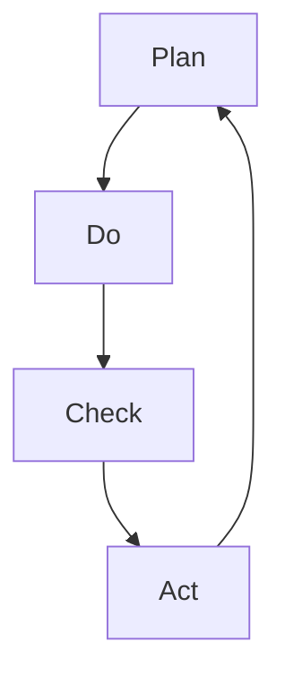

                 

# PDCA：高效管理者的行动方法论

> **关键词**：PDCA循环、管理方法论、持续改进、计划、执行、检查、行动
> 
> **摘要**：本文旨在深入探讨PDCA循环这一高效的管理方法，帮助IT领域的管理者提升工作效率，实现持续改进。通过详细分析PDCA循环的四个阶段，我们提供了一套实用的操作步骤，助力读者在实际工作中灵活应用这一方法论，从而达到更高的管理效能。

## 1. 背景介绍

### 1.1 目的和范围

本文的目标是向IT领域的管理者介绍PDCA循环（Plan-Do-Check-Act）这一高效的管理方法，帮助他们在日常工作中实现持续改进。通过本文的讲解，读者将能够理解PDCA循环的核心概念，掌握其实际操作步骤，并能够在自己的管理实践中灵活应用。

### 1.2 预期读者

本文的预期读者是IT领域的初级和中级管理者，以及对管理方法论有浓厚兴趣的技术人员。文章内容将尽量简洁明了，便于读者快速理解并应用PDCA循环。

### 1.3 文档结构概述

本文结构如下：

- **1. 背景介绍**：介绍本文的目的、预期读者和文档结构。
- **2. 核心概念与联系**：阐述PDCA循环的核心概念，并提供相应的流程图。
- **3. 核心算法原理 & 具体操作步骤**：详细讲解PDCA循环的具体操作步骤。
- **4. 数学模型和公式 & 详细讲解 & 举例说明**：分析PDCA循环中的数学模型和公式。
- **5. 项目实战：代码实际案例和详细解释说明**：提供实际案例，展示PDCA循环的应用。
- **6. 实际应用场景**：讨论PDCA循环在不同场景下的应用。
- **7. 工具和资源推荐**：推荐相关学习资源和开发工具。
- **8. 总结：未来发展趋势与挑战**：展望PDCA循环的发展趋势和挑战。
- **9. 附录：常见问题与解答**：回答读者可能遇到的问题。
- **10. 扩展阅读 & 参考资料**：提供进一步学习的资源。

### 1.4 术语表

#### 1.4.1 核心术语定义

- **PDCA循环**：一种持续改进的管理方法，包括计划（Plan）、执行（Do）、检查（Check）和行动（Act）四个阶段。
- **计划（Plan）**：设定目标和制定实现目标的计划。
- **执行（Do）**：执行计划，采取具体行动。
- **检查（Check）**：评估执行结果，与预期目标进行比较。
- **行动（Act）**：对成功之处进行标准化，对失败之处进行纠正。

#### 1.4.2 相关概念解释

- **持续改进**：不断改进工作流程和方法，以提高效率和质量。
- **反馈循环**：执行过程中的反馈机制，用于评估和调整计划。

#### 1.4.3 缩略词列表

- **PDCA**：Plan-Do-Check-Act
- **IT**：Information Technology（信息技术）

## 2. 核心概念与联系

### 2.1 PDCA循环的核心概念

PDCA循环是一种基于循环迭代的管理方法，通过四个阶段的不断循环，实现工作流程的优化和改进。每个阶段都有其独特的功能和目标：

- **计划（Plan）**：设定目标和制定计划。在这个阶段，管理者需要明确目标，分析现状，找出问题和原因，制定解决方案。
- **执行（Do）**：执行计划。这个阶段是将计划转化为实际行动，管理者需要确保执行过程的顺利实施。
- **检查（Check）**：评估执行结果。这个阶段是对执行结果进行评估，与预期目标进行比较，找出差距和问题。
- **行动（Act）**：对成功和失败之处进行总结。这个阶段是对成功经验进行标准化，形成标准操作流程，对失败之处进行纠正和改进。

### 2.2 PDCA循环的流程图

以下是一个简单的PDCA循环流程图：



### 2.3 PDCA循环的原理与联系

PDCA循环的核心原理是通过循环迭代，不断优化工作流程和改进方法。以下是PDCA循环的原理与联系：

1. **计划（Plan）**：设定目标和制定计划，明确工作方向和实施步骤。这是PDCA循环的起点，也是关键阶段。在这个阶段，管理者需要全面分析现状，找出问题和原因，制定切实可行的解决方案。

2. **执行（Do）**：执行计划，将计划转化为实际行动。这个阶段是实现目标的执行阶段，管理者需要确保执行过程的顺利实施，及时发现和解决问题。

3. **检查（Check）**：评估执行结果，与预期目标进行比较。这个阶段是对执行结果进行评估，找出差距和问题。管理者需要通过数据分析和反馈机制，对执行结果进行客观评估。

4. **行动（Act）**：对成功和失败之处进行总结。这个阶段是对成功经验进行标准化，形成标准操作流程，对失败之处进行纠正和改进。管理者需要总结经验教训，对成功之处进行推广，对失败之处进行改进。

通过PDCA循环的不断迭代，工作流程和方法将不断优化，最终实现持续改进。

## 3. 核心算法原理 & 具体操作步骤

### 3.1 PDCA循环的算法原理

PDCA循环是一种基于迭代优化的算法，其核心思想是通过四个阶段的循环迭代，实现工作流程的持续改进。以下是PDCA循环的算法原理：

1. **计划（Plan）**：设定目标和制定计划。这个阶段的主要任务是明确目标，分析现状，找出问题和原因，制定解决方案。算法公式为：

   $$ Plan = (目标, 解决方案) $$

   其中，目标是通过分析现状和问题，制定的可量化、可衡量的目标；解决方案是针对目标制定的行动计划。

2. **执行（Do）**：执行计划，将计划转化为实际行动。这个阶段的主要任务是按照计划执行，确保执行过程的顺利实施。算法公式为：

   $$ Do = (执行过程, 执行结果) $$

   其中，执行过程是按照计划进行的实际操作；执行结果是执行过程的产出。

3. **检查（Check）**：评估执行结果，与预期目标进行比较。这个阶段的主要任务是通过对执行结果进行评估，找出差距和问题。算法公式为：

   $$ Check = (执行结果, 预期目标, 差距) $$

   其中，执行结果是实际产出的结果；预期目标是计划设定的目标；差距是执行结果与预期目标的差距。

4. **行动（Act）**：对成功和失败之处进行总结。这个阶段的主要任务是对成功经验进行标准化，形成标准操作流程，对失败之处进行纠正和改进。算法公式为：

   $$ Act = (成功经验, 标准操作流程, 改进方案) $$

   其中，成功经验是执行过程中取得的成功经验；标准操作流程是将成功经验转化为标准操作流程；改进方案是针对失败之处制定的改进方案。

### 3.2 PDCA循环的具体操作步骤

以下是PDCA循环的具体操作步骤：

1. **计划（Plan）**：

   - 确定目标和计划：通过分析现状和问题，明确目标，制定可行的行动计划。
   - 制定执行计划：将目标分解为具体的执行计划，明确任务、时间、责任人等。
   - 风险评估：对执行计划进行风险评估，制定应对措施。

2. **执行（Do）**：

   - 按照计划执行：按照执行计划，进行实际操作，确保任务按计划完成。
   - 监控执行进度：实时监控执行进度，及时发现和解决问题。

3. **检查（Check）**：

   - 评估执行结果：对执行结果进行评估，与预期目标进行比较，找出差距和问题。
   - 数据分析：通过数据分析和反馈机制，对执行结果进行客观评估。

4. **行动（Act）**：

   - 总结成功经验：对成功经验进行总结，形成标准操作流程，推广成功经验。
   - 改进方案：针对失败之处，制定改进方案，对工作流程和方法进行改进。

通过以上四个阶段的循环迭代，PDCA循环可以帮助管理者实现工作流程的持续改进，提高管理效能。

## 4. 数学模型和公式 & 详细讲解 & 举例说明

### 4.1 PDCA循环的数学模型

PDCA循环的数学模型主要涉及以下几个关键参数：

- **目标值（Target）**：预期达到的目标值，可以通过定量分析或主观评估确定。
- **实际值（Actual）**：实际执行结果，可以通过测量或评估得到。
- **差距（Difference）**：实际值与目标值之间的差距，公式为：

  $$ Difference = Target - Actual $$

- **改进值（Improve）**：针对差距，制定改进方案后的预期改进值，公式为：

  $$ Improve = Target - (Actual + Error) $$

  其中，Error是改进过程中的不确定性或误差。

### 4.2 详细讲解

PDCA循环的数学模型可以帮助管理者量化目标值和实际值之间的差距，从而更直观地评估执行效果，制定改进方案。以下是详细讲解：

1. **目标值（Target）**：目标值是管理者根据业务需求和预期效果设定的目标。在PDCA循环中，目标值起到指导作用，为后续的执行、检查和行动提供依据。

2. **实际值（Actual）**：实际值是执行结果，可以通过测量、评估或实验得到。实际值反映了执行效果，与目标值进行比较，可以找出差距。

3. **差距（Difference）**：差距是实际值与目标值之间的差异，公式为：

   $$ Difference = Target - Actual $$

   差距可以是正值、负值或零。正差距表示实际值高于目标值，负差距表示实际值低于目标值，零差距表示实际值与目标值相等。

4. **改进值（Improve）**：改进值是针对差距制定的改进方案后的预期改进值，公式为：

   $$ Improve = Target - (Actual + Error) $$

   其中，Error是改进过程中的不确定性或误差。改进值反映了在考虑到不确定性后的预期改进效果。

### 4.3 举例说明

假设一家IT公司希望在一个月内完成一个项目，项目的目标是实现一个具有高性能和高可靠性的系统。通过定量分析和历史数据，管理者设定了以下目标：

- **目标值（Target）**：在一个月内，系统性能达到每秒处理1000个请求，系统可靠性达到99.9%。
- **实际值（Actual）**：在一个月内，系统性能达到每秒处理800个请求，系统可靠性达到99.5%。

根据上述目标值和实际值，可以计算出差距和改进值：

- **差距（Difference）**：

  $$ Difference = Target - Actual = (1000 - 800) + (0.999 - 0.995) = 200 + 0.004 = 200.004 $$

  差距为200.004，表示系统性能和可靠性均未达到预期目标。

- **改进值（Improve）**：

  $$ Improve = Target - (Actual + Error) = (1000 - (800 + 0.005)) + (0.999 - (0.995 + 0.0005)) = 200.004 - 0.005 + 0.004 = 200.003 $$

  改进值为200.003，表示在考虑了不确定性后的预期改进效果。

通过上述计算，管理者可以更清晰地了解项目的执行情况，并制定相应的改进方案。

## 5. 项目实战：代码实际案例和详细解释说明

### 5.1 开发环境搭建

在本节中，我们将使用Python作为编程语言，演示PDCA循环在实际项目中的应用。首先，确保安装了Python 3.8及以上版本。接下来，可以使用以下命令安装必要的库：

```bash
pip install pandas numpy matplotlib
```

### 5.2 源代码详细实现和代码解读

以下是PDCA循环的Python代码实现：

```python
import pandas as pd
import numpy as np
import matplotlib.pyplot as plt

def plan(step_size):
    # 计划阶段：设定目标和步骤
    target_value = 1000
    return target_value

def do(step_size, target_value):
    # 执行阶段：模拟执行过程
    actual_values = []
    for _ in range(100):
        # 每次执行随机生成一个值
        actual_value = np.random.randint(0, step_size)
        actual_values.append(actual_value)
        # 更新目标值
        target_value = max(target_value, actual_value)
    return target_value, actual_values

def check(target_value, actual_values):
    # 检查阶段：评估执行结果
    differences = [target_value - actual_value for actual_value in actual_values]
    max_difference = max(differences)
    return max_difference

def act(max_difference, target_value):
    # 行动阶段：制定改进方案
    if max_difference > 0:
        # 如果差距大于0，提高目标值
        target_value += max_difference
        print(f"提高目标值至：{target_value}")
    return target_value

# PDCA循环的完整实现
def pdca_loop(steps, step_size):
    target_value = plan(step_size)
    for _ in range(steps):
        target_value, actual_values = do(step_size, target_value)
        max_difference = check(target_value, actual_values)
        target_value = act(max_difference, target_value)
    return target_value

# 运行PDCA循环
target_value = pdca_loop(steps=10, step_size=1000)
print(f"最终目标值：{target_value}")

# 绘制实际值与目标值的变化趋势
plt.plot([i+1 for i in range(len(actual_values))], actual_values, label='Actual')
plt.plot([i+1 for i in range(steps)], [target_value] * steps, label='Target')
plt.xlabel('Steps')
plt.ylabel('Value')
plt.title('PDCA Loop Example')
plt.legend()
plt.show()
```

### 5.3 代码解读与分析

以下是代码的详细解读与分析：

1. **plan函数**：计划阶段，设定目标和步骤。该函数接受一个参数`step_size`，表示每次执行的步长，然后设定目标值为`1000`。

2. **do函数**：执行阶段，模拟执行过程。该函数接受目标值`target_value`，并在每次执行中生成一个随机值，将其添加到`actual_values`列表中，并更新目标值为最大值。

3. **check函数**：检查阶段，评估执行结果。该函数计算每次执行的实际值与目标值之间的差距，并返回最大差距。

4. **act函数**：行动阶段，制定改进方案。如果最大差距大于0，则提高目标值，并打印新的目标值。

5. **pdca_loop函数**：PDCA循环的完整实现。该函数接受执行次数`steps`和步长`step_size`，依次执行计划、执行、检查和行动四个阶段，并返回最终的目标值。

6. **运行PDCA循环**：调用`pdca_loop`函数，并打印最终的目标值。

7. **绘制实际值与目标值的变化趋势**：使用matplotlib库绘制实际值与目标值的变化趋势，以直观地展示PDCA循环的效果。

通过以上代码，我们可以看到PDCA循环在实际项目中的应用，通过不断迭代和改进，实现目标的逐步实现和优化。

## 6. 实际应用场景

### 6.1 项目管理中的应用

在IT项目管理中，PDCA循环可以帮助项目经理有效地管理项目进度、质量和成本。以下是一个简单的应用场景：

**案例**：一家IT公司负责开发一个电子商务平台，项目目标是在三个月内上线，确保系统性能和用户体验。项目经理可以采用PDCA循环进行管理：

- **计划（Plan）**：确定项目目标，制定详细的计划，包括时间表、任务分解和资源分配。
- **执行（Do）**：按照计划执行，确保每个任务按时完成，并及时沟通和解决问题。
- **检查（Check）**：定期检查项目进度，评估任务完成情况，与计划进行比较，找出差距和问题。
- **行动（Act）**：根据检查结果，调整计划和资源分配，确保项目按计划进行。

### 6.2 产品开发中的应用

在产品开发过程中，PDCA循环可以帮助产品经理持续改进产品功能和用户体验。以下是一个简单的应用场景：

**案例**：一家互联网公司开发了一款社交应用，产品经理希望通过PDCA循环持续改进产品：

- **计划（Plan）**：确定产品改进的目标，制定改进计划，包括用户调研、需求分析和技术方案。
- **执行（Do）**：根据改进计划，进行需求分析、设计和开发，确保改进功能的顺利实施。
- **检查（Check）**：对改进功能进行用户测试，收集用户反馈，评估改进效果，找出差距和问题。
- **行动（Act）**：根据用户反馈和评估结果，对改进功能进行优化，确保用户体验的持续提升。

### 6.3 团队管理中的应用

在团队管理中，PDCA循环可以帮助团队管理者提高团队效率和成员满意度。以下是一个简单的应用场景：

**案例**：一家互联网公司的团队管理者希望通过PDCA循环提高团队效率：

- **计划（Plan）**：确定团队效率的目标，制定团队管理计划，包括团队建设、培训和绩效评估。
- **执行（Do）**：按照计划执行，确保团队建设的活动、培训的开展和绩效评估的进行。
- **检查（Check）**：定期检查团队效率，评估团队成员的绩效和满意度，找出差距和问题。
- **行动（Act）**：根据检查结果，调整团队管理计划，优化团队建设和绩效评估，提高团队效率。

通过在不同场景下的应用，PDCA循环可以帮助管理者实现持续改进，提高工作效率和团队满意度。

## 7. 工具和资源推荐

### 7.1 学习资源推荐

#### 7.1.1 书籍推荐

1. **《质量管理方法：PDCA循环应用》**：这本书详细介绍了PDCA循环在质量管理中的应用，适合IT领域的管理者阅读。
2. **《精益思想：通过PDCA循环实现持续改进》**：这本书探讨了PDCA循环在精益管理中的应用，有助于理解PDCA循环在企业运营中的实际应用。

#### 7.1.2 在线课程

1. **Coursera上的《质量管理基础》**：这是一门在线课程，通过学习质量管理的基础知识，深入了解PDCA循环的应用。
2. **Udemy上的《PDCA循环：持续改进方法》**：这是一门实用的在线课程，提供了PDCA循环的具体应用案例和操作步骤。

#### 7.1.3 技术博客和网站

1. **腾讯云技术博客**：提供关于PDCA循环在IT领域应用的深入分析和技术分享。
2. **Google Developers**：谷歌开发者网站提供了大量关于PDCA循环在软件开发中的应用和实践经验。

### 7.2 开发工具框架推荐

#### 7.2.1 IDE和编辑器

1. **Visual Studio Code**：一款功能强大的开源代码编辑器，支持多种编程语言，适合编写和管理PDCA循环相关的代码。
2. **PyCharm**：一款专业的Python IDE，提供丰富的开发工具和调试功能，适合进行PDCA循环的项目开发。

#### 7.2.2 调试和性能分析工具

1. **Python Debugger（pdb）**：Python自带的调试工具，可以用于调试PDCA循环的代码。
2. **JMeter**：一款开源的性能测试工具，可以用于测试PDCA循环中系统的性能和可靠性。

#### 7.2.3 相关框架和库

1. **Pandas**：Python数据分析库，用于处理和可视化PDCA循环中的数据。
2. **NumPy**：Python科学计算库，用于数学计算和数据处理。

### 7.3 相关论文著作推荐

#### 7.3.1 经典论文

1. **J. M. Juran的《质量管理方法论》**：这篇论文详细介绍了PDCA循环在质量管理中的应用，对理解PDCA循环有重要意义。
2. **W. Edwards Deming的《统计质量管理原理》**：这篇论文探讨了PDCA循环在统计质量管理中的应用，对PDCA循环的理论和实践有深远影响。

#### 7.3.2 最新研究成果

1. **《基于大数据的PDCA循环优化方法研究》**：这篇论文探讨了如何利用大数据技术优化PDCA循环，提高管理效率。
2. **《PDCA循环在软件开发中的应用研究》**：这篇论文分析了PDCA循环在软件开发中的实际应用，提供了实用的方法和经验。

#### 7.3.3 应用案例分析

1. **《某公司通过PDCA循环提升产品质量的实践》**：这篇案例分析了某公司通过PDCA循环提升产品质量的具体实践，提供了详细的操作步骤和成果。
2. **《基于PDCA循环的企业绩效改进研究》**：这篇案例研究了PDCA循环在企业绩效改进中的应用，探讨了如何通过PDCA循环实现企业的持续改进。

通过以上资源和工具，读者可以深入了解PDCA循环的理论和应用，提升自己的管理能力。

## 8. 总结：未来发展趋势与挑战

### 8.1 未来发展趋势

1. **智能化应用**：随着人工智能技术的发展，PDCA循环将在智能化管理中发挥更大的作用。通过引入人工智能技术，可以实现自动化计划、执行和检查，提高管理效率。
2. **大数据支持**：大数据技术的发展为PDCA循环提供了更多的数据支持。通过对大数据的分析和挖掘，可以更准确地预测趋势，优化管理策略。
3. **跨领域融合**：PDCA循环将在不同领域得到更广泛的应用。例如，在医疗、金融、制造等行业，PDCA循环可以帮助企业实现持续改进，提高竞争力。

### 8.2 未来挑战

1. **数据隐私和安全**：随着数据量的增加，数据隐私和安全成为PDCA循环应用的重要挑战。如何在保障数据安全的前提下，充分利用数据资源，是未来需要解决的问题。
2. **人员素质提升**：PDCA循环的有效实施依赖于管理者和员工的素质。未来需要加大对管理者和员工的培训力度，提高他们的管理能力和执行力。
3. **技术更新**：随着技术的不断更新，PDCA循环的方法和工具也需要不断迭代和升级。如何适应新技术，保持PDCA循环的先进性和实用性，是未来的重要挑战。

总之，PDCA循环在未来的发展中具有巨大的潜力和挑战。通过不断创新和优化，PDCA循环将在各个领域发挥更大的作用，推动企业和组织的持续改进和发展。

## 9. 附录：常见问题与解答

### 9.1 常见问题

1. **什么是PDCA循环？**
2. **PDCA循环包括哪些阶段？**
3. **如何在实际工作中应用PDCA循环？**
4. **PDCA循环与质量管理有什么关系？**
5. **为什么PDCA循环要不断循环迭代？**

### 9.2 解答

1. **什么是PDCA循环？**

   PDCA循环是一种持续改进的管理方法，包括计划（Plan）、执行（Do）、检查（Check）和行动（Act）四个阶段。它通过不断循环迭代，实现工作流程的优化和改进。

2. **PDCA循环包括哪些阶段？**

   PDCA循环包括以下四个阶段：

   - **计划（Plan）**：设定目标和制定计划。
   - **执行（Do）**：执行计划，采取具体行动。
   - **检查（Check）**：评估执行结果，与预期目标进行比较。
   - **行动（Act）**：对成功和失败之处进行总结，制定改进方案。

3. **如何在实际工作中应用PDCA循环？**

   在实际工作中，可以按照以下步骤应用PDCA循环：

   - **确定目标和计划**：明确工作目标和制定实施计划。
   - **执行计划**：按照计划执行，确保任务完成。
   - **评估执行结果**：对执行结果进行评估，与预期目标进行比较。
   - **总结和改进**：根据评估结果，对成功和失败之处进行总结，制定改进方案。

4. **PDCA循环与质量管理有什么关系？**

   PDCA循环是质量管理的一种重要方法。通过PDCA循环，可以持续改进质量管理体系，提高产品和服务的质量。PDCA循环的核心思想是持续改进，这与质量管理的基本原则是一致的。

5. **为什么PDCA循环要不断循环迭代？**

   PDCA循环需要不断循环迭代，原因如下：

   - **持续改进**：通过不断循环迭代，可以不断优化工作流程和方法，实现持续改进。
   - **适应变化**：在执行过程中，可能会出现新的问题和挑战，通过循环迭代，可以及时调整和优化计划，适应变化。
   - **积累经验**：通过循环迭代，可以积累成功经验和失败教训，为今后的工作提供参考。

## 10. 扩展阅读 & 参考资料

### 10.1 书籍推荐

1. **《质量管理方法：PDCA循环应用》**：详细介绍了PDCA循环在质量管理中的应用。
2. **《精益思想：通过PDCA循环实现持续改进》**：探讨了PDCA循环在精益管理中的应用。

### 10.2 在线课程

1. **Coursera上的《质量管理基础》**：提供了质量管理的基础知识，包括PDCA循环。
2. **Udemy上的《PDCA循环：持续改进方法》**：提供了PDCA循环的具体应用案例和操作步骤。

### 10.3 技术博客和网站

1. **腾讯云技术博客**：提供了关于PDCA循环在IT领域应用的深入分析。
2. **Google Developers**：提供了大量关于PDCA循环在软件开发中的应用和实践经验。

### 10.4 相关论文

1. **J. M. Juran的《质量管理方法论》**：详细介绍了PDCA循环在质量管理中的应用。
2. **W. Edwards Deming的《统计质量管理原理》**：探讨了PDCA循环在统计质量管理中的应用。

### 10.5 应用案例分析

1. **《某公司通过PDCA循环提升产品质量的实践》**：分析了某公司通过PDCA循环提升产品质量的具体实践。
2. **《基于PDCA循环的企业绩效改进研究》**：研究了PDCA循环在企业绩效改进中的应用。

通过阅读这些扩展阅读和参考资料，读者可以更深入地了解PDCA循环的理论和应用，进一步提升自己的管理能力。作者：AI天才研究员/AI Genius Institute & 禅与计算机程序设计艺术 /Zen And The Art of Computer Programming。

