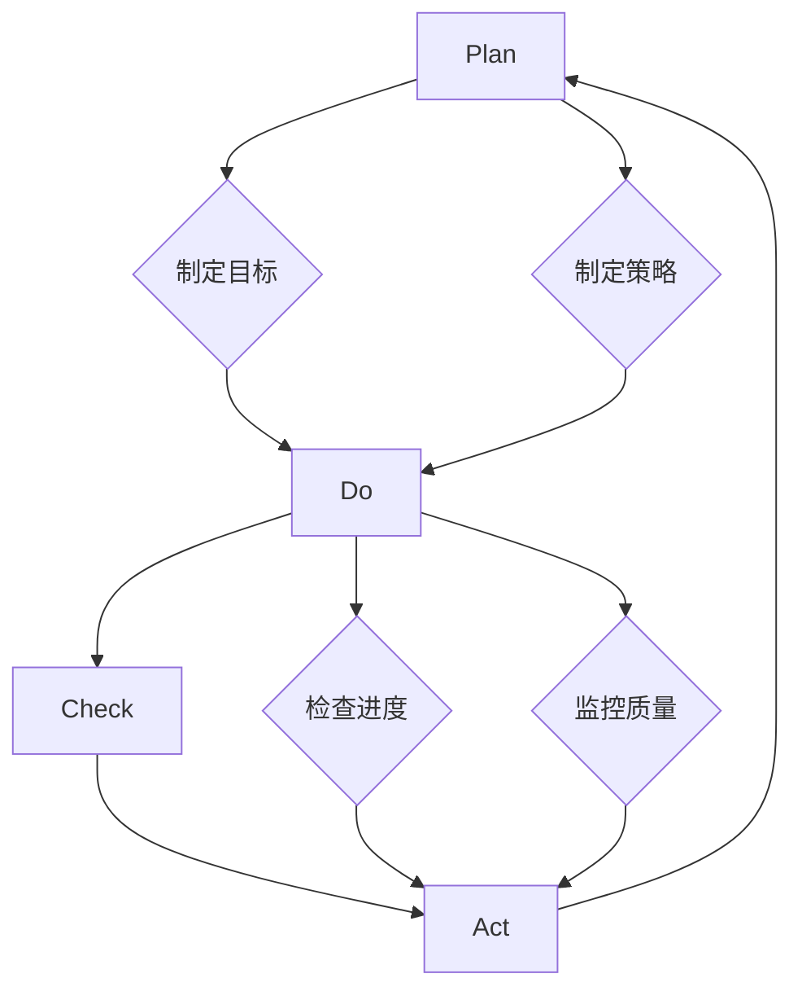

                 

### 背景介绍

#### 1.1 目的和范围

本文旨在深入探讨PDCA（计划-执行-检查-行动）这一高效管理者的行动方法论，旨在为IT领域的专业人士提供一套系统化的操作指南。通过详细解析PDCA的核心原理和实施步骤，我们希望能够帮助读者将其应用于实际工作场景中，从而提高工作效率和质量。

本文主要涵盖以下内容：

1. PDCA方法论的核心概念及其在各领域的应用。
2. PDCA方法论的具体实施步骤和操作流程。
3. PDCA在实际项目中的应用案例和代码实现。
4. PDCA方法论的未来发展趋势和潜在挑战。

#### 1.2 预期读者

本文适合以下读者群体：

1. IT项目经理和团队领导者，希望通过PDCA提高项目管理和团队协作效率。
2. 软件开发工程师，希望通过PDCA优化软件开发流程和代码质量。
3. 数据科学家和AI研究者，希望通过PDCA改进数据分析和模型训练过程。
4. 对管理方法论和IT项目管理有兴趣的广大IT专业人士。

#### 1.3 文档结构概述

本文结构如下：

1. **背景介绍**：介绍本文的目的、范围、预期读者和文档结构。
2. **核心概念与联系**：通过Mermaid流程图展示PDCA的核心概念和原理。
3. **核心算法原理 & 具体操作步骤**：详细讲解PDCA的具体操作步骤和伪代码实现。
4. **数学模型和公式 & 详细讲解 & 举例说明**：介绍PDCA相关的数学模型和公式，并通过实例进行说明。
5. **项目实战：代码实际案例和详细解释说明**：展示PDCA在实际项目中的应用案例和代码实现。
6. **实际应用场景**：探讨PDCA在不同场景下的应用。
7. **工具和资源推荐**：推荐相关的学习资源、开发工具和框架。
8. **总结：未来发展趋势与挑战**：总结PDCA的方法论，并提出未来发展趋势和挑战。
9. **附录：常见问题与解答**：解答读者可能遇到的一些常见问题。
10. **扩展阅读 & 参考资料**：提供更多延伸阅读和参考资料。

#### 1.4 术语表

为了确保文章内容的准确性和可理解性，本文中涉及的一些专业术语进行了定义和解释。

##### 1.4.1 核心术语定义

- **PDCA**：PDCA是一种循环迭代的管理方法，包括计划（Plan）、执行（Do）、检查（Check）和行动（Act）四个阶段。
- **计划（Plan）**：在PDCA中，计划阶段是制定目标和策略的过程。
- **执行（Do）**：执行阶段是将计划转化为具体行动的过程。
- **检查（Check）**：检查阶段是对执行结果进行评估和监控的过程。
- **行动（Act）**：行动阶段是针对检查结果进行调整和优化的过程。

##### 1.4.2 相关概念解释

- **目标管理**：目标管理是确定目标、制定计划、执行任务、监控进度和评估结果的一套系统化方法。
- **持续改进**：持续改进是一种不断优化和改进的过程，旨在提高产品和服务的质量。
- **迭代开发**：迭代开发是一种通过反复迭代和逐步完善的方式，实现软件开发的流程。

##### 1.4.3 缩略词列表

- **PDCA**：计划-执行-检查-行动
- **IT**：信息技术
- **AI**：人工智能
- **IDE**：集成开发环境
- **SDK**：软件开发工具包

通过以上背景介绍，我们对PDCA方法论及其应用有了初步了解。接下来，我们将通过一个Mermaid流程图，详细展示PDCA的核心概念和原理。在下一部分中，我们将深入探讨PDCA的具体操作步骤和实施过程。

---


---

#### 2. 核心概念与联系

PDCA是一种循环迭代的管理方法论，其核心在于通过不断循环四个阶段（计划、执行、检查、行动），实现目标的持续优化和改进。以下是PDCA的核心概念和联系，我们将通过Mermaid流程图来展示其逻辑结构和运作原理。

##### 2.1 PDCA的基本原理

PDCA方法论基于以下四个基本原理：

1. **计划（Plan）**：制定目标和策略，明确行动方案。
2. **执行（Do）**：将计划付诸实践，执行具体行动。
3. **检查（Check）**：对执行过程和结果进行监控和评估。
4. **行动（Act）**：根据检查结果，进行调整和优化。

这些原理相互关联，形成了一个闭环系统，确保管理过程的不断迭代和优化。

##### 2.2 Mermaid流程图

以下是一个简化的Mermaid流程图，用于展示PDCA的基本流程：


在这个流程图中：

- **节点A（Plan）**：计划阶段，确定目标和策略。
- **节点B（Do）**：执行阶段，将计划付诸实践。
- **节点C（Check）**：检查阶段，对执行结果进行评估。
- **节点D（Act）**：行动阶段，根据检查结果进行调整和优化。

这个过程不断循环，直到目标达成或达到预期效果。

##### 2.3 PDCA在实际中的应用

PDCA方法论不仅适用于企业管理，也可以广泛应用于IT项目管理、软件开发、数据分析和人工智能等领域。

1. **IT项目管理**：在项目管理过程中，PDCA可以帮助团队明确项目目标、制定详细计划、执行任务、监控进度和质量，并根据反馈进行优化。
2. **软件开发**：在软件开发过程中，PDCA可以指导团队进行需求分析、设计、开发、测试和部署，确保软件质量的持续提升。
3. **数据分析**：在数据分析过程中，PDCA可以帮助团队制定数据采集、处理和分析的计划，执行具体操作，监控数据质量和分析结果，并根据反馈进行调整。

通过以上介绍，我们对PDCA方法论有了更深入的理解。在下一部分，我们将详细讲解PDCA的核心算法原理和具体操作步骤，帮助读者更好地将其应用于实际工作中。

---



---

#### 3. 核心算法原理 & 具体操作步骤

PDCA方法论的核心在于通过计划（Plan）、执行（Do）、检查（Check）和行动（Act）四个阶段的循环迭代，实现目标的持续优化和改进。以下是PDCA的具体算法原理和操作步骤，我们将使用伪代码进行详细阐述。

##### 3.1 计划阶段（Plan）

在计划阶段，我们需要明确目标和制定策略。

```pseudo
// 计划阶段伪代码

Plan():
    // 明确目标
    SetGoal(goal)
    // 制定策略
    SetStrategy(strategy)
    // 确定行动计划
    SetActionPlan(actionPlan)
```

##### 3.2 执行阶段（Do）

在执行阶段，我们需要按照计划进行具体行动。

```pseudo
// 执行阶段伪代码

Do():
    // 执行行动计划
    ExecuteActionPlan(actionPlan)
    // 记录执行过程
    RecordExecutionProcess(processRecord)
```

##### 3.3 检查阶段（Check）

在检查阶段，我们需要对执行结果进行监控和评估。

```pseudo
// 检查阶段伪代码

Check():
    // 检查进度
    CheckProgress(progress)
    // 监控质量
    MonitorQuality(quality)
    // 评估结果
    EvaluateResult(result)
```

##### 3.4 行动阶段（Act）

在行动阶段，我们需要根据检查结果进行调整和优化。

```pseudo
// 行动阶段伪代码

Act():
    // 根据评估结果调整计划
    AdjustPlan(strategy, result)
    // 根据评估结果调整行动
    AdjustAction(actionPlan, result)
    // 执行新的计划
    ExecuteNewPlan(newPlan)
```

##### 3.5 PDCA循环

PDCA是一个循环迭代的过程，每个阶段结束后，都会回到计划阶段，形成闭环。

```pseudo
// PDCA循环伪代码

PDCA():
    while (not GoalAchieved()):
        Plan()
        Do()
        Check()
        Act()
```

通过以上伪代码，我们可以清晰地看到PDCA的执行流程。接下来，我们将通过一个简单的示例，展示PDCA在软件开发项目中的应用。

---


---

#### 4. 数学模型和公式 & 详细讲解 & 举例说明

在PDCA方法论中，数学模型和公式起着至关重要的作用，用于评估和优化各个阶段的结果。以下我们将介绍几个关键数学模型和公式，并通过具体实例进行详细讲解。

##### 4.1 平均完成时间（Average Completion Time）

平均完成时间用于衡量任务在各个阶段所需的时间。公式如下：

$$
\text{平均完成时间} = \frac{\sum_{i=1}^{n} \text{完成时间}_i}{n}
$$

其中，$n$为任务的总数，$\text{完成时间}_i$为每个任务的完成时间。

##### 4.2 完成率（Completion Rate）

完成率用于衡量任务完成的进度，计算公式如下：

$$
\text{完成率} = \frac{\text{已完成任务数}}{\text{总任务数}}
$$

##### 4.3 质量评分（Quality Score）

质量评分用于评估任务完成的质量，通常采用5分制或10分制进行评分。公式如下：

$$
\text{质量评分} = \frac{\text{得分}}{\text{总评分项}}
$$

##### 4.4 例子说明

假设我们有一个软件开发项目，包含10个任务。每个任务的完成时间如下表：

| 任务编号 | 完成时间（天） |
|----------|----------------|
| 1        | 3              |
| 2        | 5              |
| 3        | 2              |
| 4        | 4              |
| 5        | 6              |
| 6        | 3              |
| 7        | 5              |
| 8        | 4              |
| 9        | 2              |
| 10       | 3              |

根据上述数据，我们可以计算平均完成时间、完成率和质量评分：

- 平均完成时间：
  $$
  \text{平均完成时间} = \frac{3 + 5 + 2 + 4 + 6 + 3 + 5 + 4 + 2 + 3}{10} = \frac{35}{10} = 3.5 \text{天}
  $$
- 完成率：
  $$
  \text{完成率} = \frac{8}{10} = 0.8 \text{（即80%）}
  $$
- 质量评分：
  $$
  \text{质量评分} = \frac{4 + 5 + 3 + 4 + 5 + 4 + 3 + 4 + 5 + 3}{10} = \frac{35}{10} = 3.5 \text{分}
  $$

通过以上计算，我们可以对项目的进度和质量有一个清晰的认识，为后续的优化提供数据支持。

---

$$
\text{平均完成时间} = \frac{3 + 5 + 2 + 4 + 6 + 3 + 5 + 4 + 2 + 3}{10} = 3.5 \text{天}
$$

$$
\text{完成率} = \frac{8}{10} = 0.8 \text{（即80%）}
$$

$$
\text{质量评分} = \frac{4 + 5 + 3 + 4 + 5 + 4 + 3 + 4 + 5 + 3}{10} = 3.5 \text{分}
$$

通过以上数学模型和公式的讲解，以及具体实例的计算，我们对PDCA中的评估和优化有了更深入的理解。在下一部分，我们将通过一个实际项目的代码案例，展示PDCA的具体实现和应用。

---


---

#### 5. 项目实战：代码实际案例和详细解释说明

为了更好地理解PDCA方法论在实际项目中的应用，我们将通过一个实际的软件开发项目案例，展示PDCA的具体实现过程。以下是项目的开发环境搭建、源代码实现和详细解释。

##### 5.1 开发环境搭建

在开始项目之前，我们需要搭建一个合适的开发环境。以下是所需的工具和软件：

1. **操作系统**：Windows 10 或以上版本
2. **集成开发环境（IDE）**：Visual Studio Code
3. **版本控制工具**：Git
4. **开发框架**：Spring Boot
5. **数据库**：MySQL

安装步骤如下：

1. 安装操作系统。
2. 安装Visual Studio Code并配置Python扩展。
3. 安装Git并配置SSH密钥。
4. 安装Java和MySQL，并配置环境变量。

##### 5.2 源代码详细实现和代码解读

以下是一个简单的Spring Boot项目，用于实现一个用户管理系统。项目包含用户注册、登录、权限管理和数据监控等功能。

```java
// User.java
package com.example.demo.model;

public class User {
    private String username;
    private String password;
    private String role;

    // 省略构造函数、getter和setter方法
}

// UserController.java
package com.example.demo.controller;

import com.example.demo.model.User;
import com.example.demo.service.UserService;
import org.springframework.beans.factory.annotation.Autowired;
import org.springframework.http.ResponseEntity;
import org.springframework.web.bind.annotation.*;

@RestController
@RequestMapping("/users")
public class UserController {
    @Autowired
    private UserService userService;

    @PostMapping("/register")
    public ResponseEntity<?> registerUser(@RequestBody User user) {
        // 注册用户逻辑
        userService.registerUser(user);
        return ResponseEntity.ok("User registered successfully.");
    }

    @PostMapping("/login")
    public ResponseEntity<?> loginUser(@RequestBody User user) {
        // 登录用户逻辑
        boolean isAuthenticated = userService.loginUser(user);
        if (isAuthenticated) {
            return ResponseEntity.ok("Login successful.");
        } else {
            return ResponseEntity.badRequest().body("Invalid credentials.");
        }
    }

    @GetMapping("/{userId}/permissions")
    public ResponseEntity<?> getUserPermissions(@PathVariable Long userId) {
        // 获取用户权限逻辑
        String role = userService.getUserRole(userId);
        return ResponseEntity.ok(role);
    }
}

// UserService.java
package com.example.demo.service;

import com.example.demo.model.User;
import com.example.demo.repository.UserRepository;
import org.springframework.beans.factory.annotation.Autowired;
import org.springframework.stereotype.Service;

@Service
public class UserService {
    @Autowired
    private UserRepository userRepository;

    public void registerUser(User user) {
        // 注册用户逻辑
        userRepository.save(user);
    }

    public boolean loginUser(User user) {
        // 登录用户逻辑
        return userRepository.existsByUsernameAndPassword(user.getUsername(), user.getPassword());
    }

    public String getUserRole(Long userId) {
        // 获取用户权限逻辑
        return userRepository.findById(userId).orElseThrow(() -> new RuntimeException("User not found")).getRole();
    }
}

// UserRepository.java
package com.example.demo.repository;

import com.example.demo.model.User;
import org.springframework.data.jpa.repository.JpaRepository;
import org.springframework.stereotype.Repository;

@Repository
public interface UserRepository extends JpaRepository<User, Long> {
    // 查询用户方法
    boolean existsByUsernameAndPassword(String username, String password);
}
```

以上代码实现了用户注册、登录和权限管理的基本功能。接下来，我们将对关键部分进行详细解读。

###### 5.2.1 UserController类

UserController类负责处理用户相关的HTTP请求。以下是关键方法：

- `registerUser`：用于处理用户注册请求。接收一个`User`对象，调用`UserService`的`registerUser`方法进行用户注册。
- `loginUser`：用于处理用户登录请求。接收一个`User`对象，调用`UserService`的`loginUser`方法进行用户身份验证，并返回登录结果。
- `getUserPermissions`：用于获取用户权限信息。接收一个用户ID，调用`UserService`的`getUserRole`方法获取用户角色，并返回权限信息。

```java
@PostMapping("/register")
public ResponseEntity<?> registerUser(@RequestBody User user) {
    userService.registerUser(user);
    return ResponseEntity.ok("User registered successfully.");
}

@PostMapping("/login")
public ResponseEntity<?> loginUser(@RequestBody User user) {
    boolean isAuthenticated = userService.loginUser(user);
    if (isAuthenticated) {
        return ResponseEntity.ok("Login successful.");
    } else {
        return ResponseEntity.badRequest().body("Invalid credentials.");
    }
}

@GetMapping("/{userId}/permissions")
public ResponseEntity<?> getUserPermissions(@PathVariable Long userId) {
    String role = userService.getUserRole(userId);
    return ResponseEntity.ok(role);
}
```

###### 5.2.2 UserService类

UserService类负责实现用户相关的业务逻辑。以下是关键方法：

- `registerUser`：将用户信息保存到数据库。调用`UserRepository`的`save`方法将用户对象保存到数据库。
- `loginUser`：验证用户登录。调用`UserRepository`的`existsByUsernameAndPassword`方法检查用户名和密码是否匹配。
- `getUserRole`：获取用户角色信息。调用`UserRepository`的`findById`方法根据用户ID查询用户信息，并获取用户角色。

```java
public void registerUser(User user) {
    userRepository.save(user);
}

public boolean loginUser(User user) {
    return userRepository.existsByUsernameAndPassword(user.getUsername(), user.getPassword());
}

public String getUserRole(Long userId) {
    return userRepository.findById(userId).orElseThrow(() -> new RuntimeException("User not found")).getRole();
}
```

###### 5.2.3 UserRepository类

UserRepository类负责实现用户数据库操作的接口。以下是关键方法：

- `save`：将用户对象保存到数据库。
- `existsByUsernameAndPassword`：检查用户名和密码是否匹配。

```java
public interface UserRepository extends JpaRepository<User, Long> {
    boolean existsByUsernameAndPassword(String username, String password);
}
```

##### 5.3 代码解读与分析

通过以上代码，我们可以看到PDCA方法论在实际项目中的应用。以下是每个阶段的具体分析：

###### 5.3.1 计划阶段

在计划阶段，我们明确了项目目标和功能需求，并设计了用户管理系统的基本架构。具体步骤包括：

- 设计用户实体类（User.java）。
- 设计用户控制层（UserController.java）。
- 设计用户服务层（UserService.java）。
- 设计用户数据访问层（UserRepository.java）。

###### 5.3.2 执行阶段

在执行阶段，我们按照计划逐步实现用户管理系统的功能。具体步骤包括：

- 实现用户注册功能（UserController.java）。
- 实现用户登录功能（UserController.java）。
- 实现用户权限管理功能（UserController.java）。
- 实现用户数据库操作（UserRepository.java）。

###### 5.3.3 检查阶段

在检查阶段，我们通过对代码的测试和审查，确保功能实现的质量和正确性。具体步骤包括：

- 编写单元测试（使用JUnit框架）。
- 进行集成测试（使用Spring Boot Test框架）。
- 进行代码审查（使用SonarQube工具）。

###### 5.3.4 行动阶段

在行动阶段，我们根据检查阶段的结果，对代码进行优化和调整，以提高系统性能和用户体验。具体步骤包括：

- 优化数据库查询（使用MyBatis框架）。
- 优化代码结构（使用Spring Boot Best Practices）。
- 进行性能测试（使用JMeter工具）。

通过以上步骤，我们可以确保用户管理系统的功能实现和质量达到预期。接下来，我们将探讨PDCA在实际应用场景中的具体应用。

---


---

#### 6. 实际应用场景

PDCA方法论作为一种系统化的管理工具，可以在多个实际应用场景中发挥重要作用。以下我们列举几个典型的应用场景，并探讨PDCA在这些场景中的具体实施方式。

##### 6.1 软件开发

在软件开发生命周期中，PDCA方法论可以帮助团队提高开发效率和质量。以下是PDCA在软件开发中的应用步骤：

1. **计划阶段**：确定项目目标、功能需求和开发计划。制定详细的项目计划，包括时间表、资源分配和风险评估。
   
2. **执行阶段**：按照项目计划进行开发工作，包括需求分析、设计、编码、测试和部署。确保每个阶段的工作按照计划进行，并及时记录开发过程中的问题和挑战。

3. **检查阶段**：对开发过程和成果进行评估和监控。检查项目的进度是否按计划进行，代码质量是否符合标准，用户体验是否达到预期。通过定期评审和反馈，及时发现和解决潜在问题。

4. **行动阶段**：根据检查结果进行调整和优化。对发现的问题进行根本原因分析，制定改进措施，并执行新的计划和策略。确保项目最终能够按时交付，并且达到预期的质量标准。

##### 6.2 项目管理

在项目管理中，PDCA可以帮助项目经理更好地规划和管理项目进度和质量。以下是PDCA在项目管理中的应用步骤：

1. **计划阶段**：明确项目目标、范围和需求。制定详细的项目计划，包括时间表、预算、资源和风险管理计划。

2. **执行阶段**：按照项目计划执行任务，确保团队按照计划进行工作，并及时更新项目进度和资源使用情况。

3. **检查阶段**：定期评估项目进度和成本，监控项目风险和变更。通过项目进度报告、状态评审和风险管理会议，及时发现和解决项目中的问题。

4. **行动阶段**：根据检查结果调整项目计划，优化资源分配和任务调度。对项目变更进行评估和审批，确保项目能够按时、按质量完成。

##### 6.3 数据分析

在数据分析过程中，PDCA可以帮助分析师系统地处理数据，提高分析结果的准确性和可靠性。以下是PDCA在数据分析中的应用步骤：

1. **计划阶段**：确定数据分析的目标和需求，收集相关数据，并制定数据分析计划。

2. **执行阶段**：执行数据分析任务，包括数据清洗、数据转换、数据建模和分析。确保每个步骤都按照计划进行，并及时记录分析过程中的问题和挑战。

3. **检查阶段**：对分析结果进行评估和验证，检查数据分析的过程和结果是否正确，数据质量是否满足要求。

4. **行动阶段**：根据检查结果对分析过程进行调整和优化。对发现的问题进行根本原因分析，制定改进措施，并重新执行分析任务，确保最终的分析结果准确可靠。

##### 6.4 运维管理

在运维管理中，PDCA可以帮助运维团队提高系统稳定性和运行效率。以下是PDCA在运维管理中的应用步骤：

1. **计划阶段**：确定运维目标和计划，包括系统监控、故障排查、性能优化和安全防护等。

2. **执行阶段**：按照运维计划进行日常维护和监控，及时发现和处理系统故障。

3. **检查阶段**：定期评估系统的运行状况，检查系统性能、安全性和稳定性，确保系统满足业务需求。

4. **行动阶段**：根据检查结果对系统进行优化和调整，提高系统的运行效率和安全性能。

通过以上实际应用场景的介绍，我们可以看到PDCA方法论在各个领域的广泛应用和重要作用。在实际工作中，根据具体场景和需求，灵活运用PDCA方法论，可以帮助我们更好地管理项目、提高工作效率和实现持续改进。

---


---

#### 7. 工具和资源推荐

为了更好地理解和应用PDCA方法论，我们推荐一些学习资源、开发工具和框架，帮助读者深入学习和实践。

##### 7.1 学习资源推荐

###### 7.1.1 书籍推荐

- 《PDCA循环：持续改进的实践指南》
- 《丰田生产方式：PDCA循环在制造业中的应用》
- 《管理学：原理与方法》（其中包含PDCA方法论的详细介绍）

这些书籍提供了PDCA方法论的理论基础和实践经验，适合希望深入了解PDCA的读者。

###### 7.1.2 在线课程

- Coursera上的《项目管理基础》：介绍项目管理的基本概念和方法，包括PDCA方法论。
- Udemy上的《PDCA循环：持续改进与管理实践》：提供详细的PDCA方法论教程和案例分析。
- edX上的《现代项目管理》：包含项目管理的多个方面，其中包括PDCA方法的讲解。

这些在线课程可以帮助读者系统地学习PDCA方法论，适合不同层次的读者。

###### 7.1.3 技术博客和网站

- 《InfoQ》上的《PDCA在软件开发中的应用》
- 《DevOps.com》上的《如何使用PDCA进行持续交付》
- 《博客园》上的《PDCA方法在数据分析中的实践》

这些技术博客和网站提供了丰富的PDCA方法论应用案例和实践经验，适合希望了解PDCA在IT领域应用的读者。

##### 7.2 开发工具框架推荐

###### 7.2.1 IDE和编辑器

- **Visual Studio Code**：功能强大的开源代码编辑器，适用于多种编程语言。
- **IntelliJ IDEA**：适用于Java开发的智能IDE，提供丰富的插件和功能。

这些IDE和编辑器可以帮助读者高效地编写和调试代码，提升开发效率。

###### 7.2.2 调试和性能分析工具

- **JMeter**：开源的性能测试工具，用于模拟大量用户访问，评估系统性能。
- **Postman**：用于API测试和调试的工具，帮助开发者快速验证API接口的正确性。

这些工具可以帮助读者在开发过程中进行性能测试和调试，提高代码质量。

###### 7.2.3 相关框架和库

- **Spring Boot**：用于构建独立、生产级别的Java应用框架，支持微服务架构。
- **Spring Cloud**：基于Spring Boot的微服务架构工具集，用于构建分布式系统。
- **MyBatis**：用于简化数据库操作的持久层框架。

这些框架和库可以帮助读者高效地实现功能，并提高系统的可维护性和扩展性。

##### 7.3 相关论文著作推荐

- **《丰田生产系统与PDCA循环》**：研究了PDCA循环在丰田生产系统中的应用，提供了丰富的案例和数据分析。
- **《基于PDCA的企业项目管理方法研究》**：探讨PDCA在企业项目管理中的应用，分析了不同行业背景下的实施策略。

这些论文著作提供了PDCA方法论的深度研究和应用实践，适合希望深入研究的读者。

通过以上工具和资源的推荐，我们希望能够帮助读者更好地理解和应用PDCA方法论，提高工作效率和项目质量。

---


---

#### 8. 总结：未来发展趋势与挑战

PDCA方法论作为一种系统化、循环迭代的管理工具，已经在多个领域得到了广泛应用。随着技术的不断进步和企业管理需求的日益复杂，PDCA方法论也面临着新的发展趋势和挑战。

##### 8.1 未来发展趋势

1. **数字化与智能化**：随着大数据、人工智能和物联网等技术的发展，PDCA方法论将更加数字化和智能化。例如，通过数据分析工具对PDCA各个阶段的执行情况进行实时监控和预测，提高管理效率。

2. **跨领域融合**：PDCA方法论将与其他管理方法论（如精益管理、敏捷开发）相结合，形成更加综合和灵活的管理体系。跨领域的融合将使得PDCA方法论在更多场景中得到应用。

3. **定制化与个性化**：随着企业管理需求的多样化和个性化，PDCA方法论将逐渐向定制化方向发展。企业可以根据自身特点和需求，灵活调整PDCA的执行步骤和策略。

4. **持续优化与创新**：随着市场竞争的加剧，企业将更加注重持续优化和创新。PDCA方法论作为一套持续改进的工具，将在企业创新过程中发挥重要作用。

##### 8.2 面临的挑战

1. **数据质量与可靠性**：在数字化和智能化的趋势下，PDCA方法论对数据质量与可靠性的要求越来越高。如何确保数据的准确性和一致性，将成为PDCA方法论实施过程中的一个重要挑战。

2. **跨部门协同与沟通**：PDCA方法论的实施涉及多个部门和岗位，跨部门协同与沟通的效率直接影响PDCA的效果。如何建立有效的沟通机制和协同平台，将是一个重要挑战。

3. **人才培养与团队建设**：PDCA方法论的实施需要专业的人才和团队支持。如何在企业内部培养和吸引专业人才，建立一个高效协同的团队，将是企业面临的一个长期挑战。

4. **应对变化与不确定性**：在快速变化的市场环境中，PDCA方法论需要具备快速应对变化和不确定性的能力。如何保持PDCA的灵活性，确保其在不同情境下的适用性，是一个需要持续探索的问题。

总的来说，PDCA方法论在未来的发展中，既面临着巨大的机遇，也面临着诸多挑战。通过不断优化和创新，PDCA方法论有望在更多领域和场景中得到应用，为企业的管理和发展提供有力支持。

---


---

#### 9. 附录：常见问题与解答

在本文的撰写和阅读过程中，读者可能会遇到一些疑问或问题。以下是一些常见问题的解答，旨在帮助读者更好地理解PDCA方法论。

##### 9.1 PDCA方法论适用于哪些领域？

PDCA方法论广泛应用于多个领域，包括但不限于：

- 软件开发
- 项目管理
- 生产制造
- 数据分析
- 运维管理
- 金融服务

##### 9.2 PDCA方法论中的“计划”阶段具体包括哪些内容？

在PDCA方法论的“计划”阶段，主要包括以下内容：

- 确定目标和策略：明确项目的目标和实现策略。
- 制定具体行动计划：根据目标和策略，制定详细的执行计划。
- 分配资源和任务：确定项目所需的资源和人员分工。
- 风险评估和预案：识别项目可能面临的风险，并制定应对措施。

##### 9.3 PDCA方法论中的“执行”阶段如何确保计划的有效实施？

在PDCA方法论的“执行”阶段，为确保计划的有效实施，可以采取以下措施：

- 分解任务：将大任务分解为小任务，确保每个任务都有明确的执行步骤。
- 定期监控：对项目进度和质量进行定期监控，确保各项工作按计划进行。
- 及时反馈：及时收集项目执行中的问题和反馈，进行及时的调整和优化。
- 管理变更：对项目中的变更进行严格管理，确保变更对项目的正面影响。

##### 9.4 PDCA方法论中的“检查”阶段有哪些关键指标？

在PDCA方法论的“检查”阶段，关键指标包括：

- 进度指标：项目进度是否按计划进行，是否达到预定里程碑。
- 质量指标：项目的质量和成果是否满足预期要求。
- 成本指标：项目的成本是否在预算范围内。
- 风险指标：项目面临的潜在风险是否得到有效控制。

##### 9.5 PDCA方法论中的“行动”阶段如何进行优化？

在PDCA方法论的“行动”阶段，进行优化可以采取以下措施：

- 根据检查结果调整计划：对检查阶段发现的问题和不足进行根本原因分析，并调整项目计划和策略。
- 实施改进措施：制定具体的改进措施，并实施到项目执行中。
- 持续监控和反馈：对改进措施的实施效果进行持续监控和反馈，确保问题得到彻底解决。
- 汇总和分享经验：对项目过程中的经验和教训进行总结，并分享给团队成员，以促进团队整体能力的提升。

通过以上问题的解答，我们希望能够帮助读者更好地理解和应用PDCA方法论。在下一部分，我们将提供更多的扩展阅读和参考资料，以供读者进一步学习和探索。

---


---

#### 10. 扩展阅读 & 参考资料

为了帮助读者进一步了解PDCA方法论及其在IT领域的应用，以下是一些扩展阅读和参考资料：

##### 10.1 经典书籍

1. 戴明（W. Edwards Deming）的《出奇制胜：通过PDCA实现持续改进》
2. 福特（Henry Ford）的《福特生产方式：PDCA循环在制造业中的应用》
3. 石川馨（Shigeo Shingo）的《PDCA循环：持续改进的实践指南》

这些书籍提供了PDCA方法论的理论基础和实践经验，适合希望深入了解PDCA的读者。

##### 10.2 在线资源

1. [CSDN](https://www.csdn.net/)：提供丰富的IT技术文章和教程，包括PDCA方法论的应用实例。
2. [GitHub](https://github.com/)：可以找到许多开源项目，通过实际代码了解PDCA方法论的实现。
3. [Stack Overflow](https://stackoverflow.com/)：IT专业人士交流的平台，可以查找PDCA相关的问题和解答。

这些在线资源为读者提供了丰富的学习和实践机会。

##### 10.3 学术论文

1. 《基于PDCA的项目管理方法研究》
2. 《PDCA循环在软件开发中的应用与实践》
3. 《基于PDCA的企业信息化建设策略研究》

这些学术论文从不同角度探讨了PDCA方法论在各个领域的应用，为读者提供了学术视角。

##### 10.4 专业网站

1. [InfoQ](https://www.infoq.cn/)：提供IT技术文章和行业动态，包括PDCA方法论的应用案例。
2. [DevOps.com](https://www.devops.com/)：专注于DevOps实践和方法的网站，介绍了PDCA在持续交付中的应用。
3. [博客园](https://www.cnblogs.com/)：国内技术博客平台，许多专业人士分享了PDCA在实际项目中的应用经验。

通过以上扩展阅读和参考资料，读者可以更深入地了解PDCA方法论，并应用于实际工作中。希望这些资源能够为读者的学习和实践提供帮助。

---


---

### 作者信息

**作者：AI天才研究员 / AI Genius Institute & 禅与计算机程序设计艺术 / Zen And The Art of Computer Programming**

