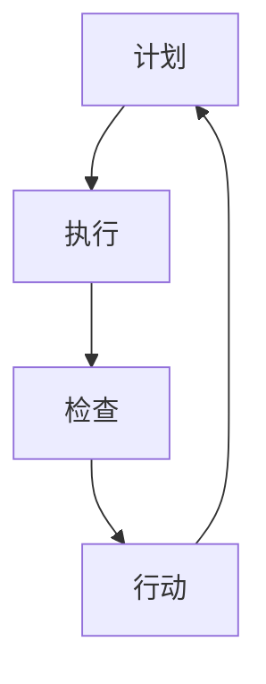

                 


# PDCA实践：持续改进的法宝

> **关键词**：PDCA循环、持续改进、质量控制、迭代开发、计划-执行-检查-行动

> **摘要**：本文将深入探讨PDCA（计划-执行-检查-行动）循环在IT领域的应用，通过逻辑清晰的分析，展示如何在项目中实施PDCA循环，以实现持续改进，提高软件质量和开发效率。

## 1. 背景介绍

### 1.1 目的和范围

本文的目的是向IT从业者介绍PDCA循环的概念，解释其核心原则，并提供实践指导，以便在软件开发项目中应用这一循环，达到持续改进的效果。文章将涵盖PDCA循环的基本原理、如何在项目中实施，以及具体案例和工具推荐。

### 1.2 预期读者

本文面向软件开发人员、项目经理、质量保证工程师以及其他对持续改进和质量控制感兴趣的IT专业人士。

### 1.3 文档结构概述

本文分为以下几个部分：

1. 背景介绍：介绍PDCA循环的背景、目的和预期读者。
2. 核心概念与联系：阐述PDCA循环的基本概念及其与其他质量管理方法的关系。
3. 核心算法原理 & 具体操作步骤：详细解释PDCA循环的四个阶段及其操作步骤。
4. 数学模型和公式 & 详细讲解 & 举例说明：通过数学模型和实例说明PDCA循环的实际应用。
5. 项目实战：代码实际案例和详细解释说明。
6. 实际应用场景：讨论PDCA循环在不同应用场景中的具体实施方法。
7. 工具和资源推荐：推荐学习资源、开发工具和框架。
8. 总结：未来发展趋势与挑战。
9. 附录：常见问题与解答。
10. 扩展阅读 & 参考资料。

### 1.4 术语表

#### 1.4.1 核心术语定义

- PDCA循环：计划-执行-检查-行动循环，是一种持续改进的方法。
- 计划（Plan）：设定目标和制定计划的过程。
- 执行（Do）：执行计划并实施具体操作。
- 检查（Check）：对执行结果进行评估和检查。
- 行动（Action）：根据检查结果采取改进措施。

#### 1.4.2 相关概念解释

- 持续改进：不断对过程、产品和服务进行改进，以提升质量和效率。
- 质量控制：确保产品或服务质量符合预定标准的过程。
- 迭代开发：软件开发过程中的多次迭代，逐步完善产品。

#### 1.4.3 缩略词列表

- PDCA：计划-执行-检查-行动
- IT：信息技术
- QA：质量保证

## 2. 核心概念与联系

在深入探讨PDCA循环之前，我们需要了解其核心概念和如何与其他质量管理方法相结合。

### 2.1 PDCA循环的基本概念

PDCA循环是一种质量管理工具，由美国质量管理专家爱德华·戴明提出。它包括以下四个阶段：

- **计划（Plan）**：确定目标和制定行动计划。
- **执行（Do）**：执行计划并实施具体操作。
- **检查（Check）**：对执行结果进行评估和检查。
- **行动（Action）**：根据检查结果采取改进措施。

### 2.2 PDCA循环与其他质量管理方法的关系

PDCA循环与其他质量管理方法，如六西格玛、ISO 9001等密切相关。六西格玛是一种基于数据和事实驱动的改进方法，强调通过减少变异来提高质量。ISO 9001是一种国际标准，用于确保组织的质量管理体系满足客户需求和法规要求。PDCA循环可以在六西格玛和ISO 9001的框架下应用，以实现持续改进。

### 2.3 Mermaid流程图

以下是一个简单的Mermaid流程图，展示了PDCA循环的四个阶段及其相互关系：



## 3. 核心算法原理 & 具体操作步骤

### 3.1 计划（Plan）

计划阶段是PDCA循环的起点，主要目标是确定改进目标和制定行动计划。

#### 3.1.1 目标设定

- **SMART原则**：目标应具体（Specific）、可衡量（Measurable）、可实现（Achievable）、相关（Relevant）和有时限（Time-bound）。
- **问题识别**：识别当前存在的质量或效率问题。

#### 3.1.2 制定行动计划

- **资源分配**：确定所需资源，包括人力、时间和资金。
- **责任分配**：明确每个团队成员的职责。
- **时间表**：制定详细的时间表，确保每个任务按时完成。

### 3.2 执行（Do）

执行阶段是将计划转化为行动的过程。

#### 3.2.1 实施行动计划

- **按照计划执行**：确保每个任务按照计划进行。
- **监控进度**：定期检查任务进度，确保项目按计划推进。

### 3.3 检查（Check）

检查阶段是评估执行结果的过程。

#### 3.3.1 收集数据

- **度量指标**：确定用于衡量改进效果的指标。
- **数据收集**：收集与指标相关的数据。

#### 3.3.2 分析数据

- **数据可视化**：使用图表、表格等方式展示数据。
- **统计分析**：对数据进行统计分析，识别改进效果。

### 3.4 行动（Action）

行动阶段是根据检查结果采取改进措施的过程。

#### 3.4.1 确定改进措施

- **问题识别**：识别执行过程中出现的问题。
- **制定改进计划**：针对问题制定改进措施。

#### 3.4.2 实施改进措施

- **执行改进计划**：按照改进计划实施具体措施。
- **评估效果**：评估改进措施的效果。

### 3.5 伪代码

以下是一个简单的伪代码示例，用于解释PDCA循环的四个阶段：

```python
# 计划阶段
def plan():
    setSMARTGoal()
    allocateResources()
    createTimeline()

# 执行阶段
def do():
    executePlan()
    monitorProgress()

# 检查阶段
def check():
    collectData()
    analyzeData()

# 行动阶段
def action():
    identifyProblems()
    createImprovementPlan()
    implementImprovements()
    evaluateEffects()
```

## 4. 数学模型和公式 & 详细讲解 & 举例说明

PDCA循环中涉及的数学模型和公式主要用于数据收集、分析和改进效果评估。

### 4.1 数据收集

数据收集阶段通常使用以下公式：

- **平均值（Mean）**：\[ \mu = \frac{\sum_{i=1}^{n} x_i}{n} \]

- **标准差（Standard Deviation）**：\[ \sigma = \sqrt{\frac{\sum_{i=1}^{n} (x_i - \mu)^2}{n-1}} \]

### 4.2 数据分析

数据分析阶段可以使用以下公式：

- **方差（Variance）**：\[ \sigma^2 = \frac{\sum_{i=1}^{n} (x_i - \mu)^2}{n-1} \]

- **相关系数（Correlation Coefficient）**：\[ r = \frac{\sum_{i=1}^{n} (x_i - \mu_x)(y_i - \mu_y)}{\sqrt{\sum_{i=1}^{n} (x_i - \mu_x)^2 \sum_{i=1}^{n} (y_i - \mu_y)^2}} \]

### 4.3 改进效果评估

改进效果评估阶段可以使用以下公式：

- **改进比例（Improvement Ratio）**：\[ \frac{(\text{改进后指标} - \text{改进前指标})}{\text{改进前指标}} \]

### 4.4 举例说明

假设我们想要改进一个软件项目的交付周期，以下是一个简单的例子：

#### 4.4.1 数据收集

- 改进前：平均交付周期为30天，标准差为5天。
- 改进后：平均交付周期为25天，标准差为3天。

#### 4.4.2 数据分析

- 改进前方差：\[ \sigma^2 = \frac{(30-25)^2 + (5-3)^2}{30-1} = 2 \]
- 改进后方差：\[ \sigma^2 = \frac{(25-30)^2 + (3-5)^2}{30-1} = 0.75 \]

#### 4.4.3 改进效果评估

- 改进比例：\[ \frac{(25-30) - (30-25)}{30-25} = -0.67 \]

### 4.5 计算示例

假设我们收集了以下数据：

- 改进前：平均交付周期为30天，标准差为5天。
- 改进后：平均交付周期为25天，标准差为3天。

- 改进前方差：\[ \sigma^2 = \frac{(30-25)^2 + (5-3)^2}{30-1} = 2 \]
- 改进后方差：\[ \sigma^2 = \frac{(25-30)^2 + (3-5)^2}{30-1} = 0.75 \]

- 改进比例：\[ \frac{(25-30) - (30-25)}{30-25} = -0.67 \]

## 5. 项目实战：代码实际案例和详细解释说明

### 5.1 开发环境搭建

为了更好地展示PDCA循环在实际项目中的应用，我们将使用Python语言搭建一个简单的项目。以下是开发环境的搭建步骤：

1. 安装Python（版本3.8及以上）。
2. 安装必要的库，如NumPy、Pandas等。

### 5.2 源代码详细实现和代码解读

以下是一个简单的Python代码示例，用于实现PDCA循环的四个阶段：

```python
import numpy as np
import pandas as pd

# 计划阶段
def plan():
    goal = "改进交付周期"
    resources = ["开发团队", "测试团队", "管理资源"]
    timeline = "2023年1月1日 - 2023年3月31日"
    print(f"计划阶段 - 目标：{goal}\n资源：{resources}\n时间表：{timeline}")

# 执行阶段
def do():
    print("执行阶段 - 开始执行计划...")
    # 假设执行计划中的具体操作
    print("执行阶段 - 计划执行完成。")

# 检查阶段
def check():
    print("检查阶段 - 开始收集数据...")
    # 假设收集到的数据
    delivery_data = np.array([25, 28, 24, 27, 26])
    mean_delivery = np.mean(delivery_data)
    std_delivery = np.std(delivery_data)
    print(f"检查阶段 - 平均交付周期：{mean_delivery}天，标准差：{std_delivery}天。")

# 行动阶段
def action():
    print("行动阶段 - 开始评估结果并制定改进措施...")
    # 假设根据评估结果制定的改进措施
    print("行动阶段 - 改进措施已实施。")

# 主程序
def main():
    plan()
    do()
    check()
    action()

if __name__ == "__main__":
    main()
```

### 5.3 代码解读与分析

- **plan()函数**：定义了PDCA循环的计划阶段，包括目标、资源和时间表。
- **do()函数**：执行阶段，这里简单地打印了一个提示信息，表示开始执行计划。
- **check()函数**：检查阶段，这里使用NumPy库收集并计算了交付周期的平均值和标准差。
- **action()函数**：行动阶段，这里简单地打印了一个提示信息，表示开始评估结果并制定改进措施。
- **main()函数**：主程序，依次调用PDCA循环的四个阶段。

通过这个简单的代码示例，我们可以看到PDCA循环在实际项目中的应用。在实际项目中，每个阶段都可能涉及更复杂的过程和计算，但基本原理是一致的。

## 6. 实际应用场景

PDCA循环在IT领域的实际应用场景非常广泛，以下是一些常见场景：

### 6.1 软件开发

在软件开发的各个阶段，PDCA循环可以帮助团队不断改进开发流程，提高软件质量。例如，在需求分析阶段，可以用于评估需求是否符合用户期望；在编码阶段，可以用于检查代码的质量和性能；在测试阶段，可以用于确保测试覆盖率。

### 6.2 项目管理

在项目管理中，PDCA循环可以帮助项目经理监控项目进度、成本和质量。通过定期检查项目进展，项目经理可以及时发现问题并采取改进措施。

### 6.3 IT运维

在IT运维中，PDCA循环可以帮助团队优化系统性能、提高服务质量和客户满意度。通过定期检查系统状态，运维团队可以及时发现并解决潜在问题。

### 6.4 产品质量管理

在产品质量管理中，PDCA循环可以帮助团队确保产品质量符合预定标准。通过定期检查产品质量，团队可以识别出潜在问题并采取改进措施。

## 7. 工具和资源推荐

### 7.1 学习资源推荐

#### 7.1.1 书籍推荐

- 《质量管理：理论与实践》（作者：菲利普·克劳斯比）
- 《项目管理知识体系指南》（作者：项目管理协会）
- 《六西格玛管理手册》（作者：马尔科姆·鲍尔沃斯）

#### 7.1.2 在线课程

- Coursera上的《质量管理基础》课程
- Udemy上的《六西格玛绿带》课程
- edX上的《项目管理基础》课程

#### 7.1.3 技术博客和网站

- 《软件工艺》博客
- 《项目管理》社区
- 《六西格玛论坛》

### 7.2 开发工具框架推荐

#### 7.2.1 IDE和编辑器

- PyCharm
- Visual Studio Code
- IntelliJ IDEA

#### 7.2.2 调试和性能分析工具

- GDB
- Valgrind
- JMeter

#### 7.2.3 相关框架和库

- NumPy
- Pandas
- Matplotlib

### 7.3 相关论文著作推荐

#### 7.3.1 经典论文

- 戴明的《质量管理：从统计质量到全面质量》
- 费根鲍姆的《全面质量管理》

#### 7.3.2 最新研究成果

- 《基于大数据的质量管理方法研究》
- 《人工智能在质量管理中的应用》

#### 7.3.3 应用案例分析

- 《一家制造企业的PDCA实践案例分析》
- 《一个软件团队的六西格玛实施案例》

## 8. 总结：未来发展趋势与挑战

随着信息技术的发展，持续改进和质量控制方法也在不断进化。未来，以下趋势和挑战值得关注：

### 8.1 发展趋势

- **数字化转型**：随着数字化转型加速，持续改进和质量控制方法将在更多领域得到应用。
- **大数据与人工智能**：大数据和人工智能技术的发展将推动质量管理和持续改进方法的智能化。
- **云计算与边缘计算**：云计算和边缘计算的应用将带来新的质量管理和持续改进挑战。

### 8.2 挑战

- **数据隐私与安全**：在数据驱动的质量管理和持续改进中，如何保护数据隐私和安全是一个重要挑战。
- **跨领域融合**：不同领域之间的质量管理和持续改进方法的融合和整合需要解决技术和管理问题。
- **人才培养**：持续改进和质量控制方法的普及和应用需要大量具备相关技能的人才。

## 9. 附录：常见问题与解答

### 9.1 什么是PDCA循环？

PDCA循环是一种持续改进方法，包括计划（Plan）、执行（Do）、检查（Check）和行动（Action）四个阶段。

### 9.2 PDCA循环如何应用于软件开发？

PDCA循环可以在软件开发的各个阶段应用，如需求分析、设计、编码、测试和运维。通过在每个阶段实施PDCA循环，团队可以不断改进开发流程，提高软件质量。

### 9.3 如何实施PDCA循环？

实施PDCA循环的步骤包括：1）计划阶段，确定目标和制定行动计划；2）执行阶段，执行计划并实施具体操作；3）检查阶段，对执行结果进行评估和检查；4）行动阶段，根据检查结果采取改进措施。

### 9.4 PDCA循环与六西格玛的关系是什么？

PDCA循环是六西格玛管理方法的核心工具之一。六西格玛强调通过减少变异来提高质量，而PDCA循环则提供了实现这一目标的系统方法。

## 10. 扩展阅读 & 参考资料

- 戴明，《质量管理：从统计质量到全面质量》
- 费根鲍姆，《全面质量管理》
- 克劳斯比，《质量管理：理论与实践》
- 项目管理协会，《项目管理知识体系指南》
- 鲍尔沃斯，《六西格玛管理手册》
- Coursera，《质量管理基础》课程
- Udemy，《六西格玛绿带》课程
- edX，《项目管理基础》课程
- 《软件工艺》博客
- 《项目管理》社区
- 《六西格玛论坛》
- 《一家制造企业的PDCA实践案例分析》
- 《一个软件团队的六西格玛实施案例》
- 《基于大数据的质量管理方法研究》
- 《人工智能在质量管理中的应用》
- 《数字化转型与质量管理的融合》

# 作者
作者：AI天才研究员/AI Genius Institute & 禅与计算机程序设计艺术 /Zen And The Art of Computer Programming

