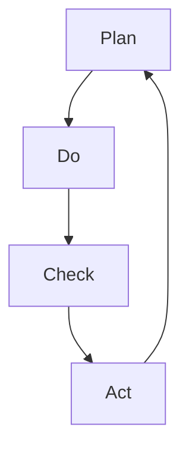

                 

# PDCA循环与管理持续改进的关系

> 关键词：PDCA循环、管理持续改进、持续集成、质量保障、流程优化、团队协作

> 摘要：本文将深入探讨PDCA循环（Plan-Do-Check-Act）在管理持续改进过程中的重要性，通过详细的分析与案例研究，揭示其在现代IT项目管理中的广泛应用。文章旨在帮助读者理解PDCA循环的原理，掌握其实施方法，并了解其在管理中的实际效果。

## 1. 背景介绍

### 1.1 目的和范围

本文旨在通过阐述PDCA循环的理论基础和应用实践，帮助读者理解其在管理持续改进中的关键作用。我们将从PDCA循环的四个阶段——计划（Plan）、执行（Do）、检查（Check）和行动（Act）——逐一深入分析，探讨其在IT项目管理中的具体实施策略和效果评估。

### 1.2 预期读者

本文适合以下读者群体：

1. IT项目经理和产品经理，寻求提高项目管理效率和产品质量的方法。
2. 质量保障和测试工程师，希望了解如何通过持续改进提高软件质量。
3. 管理人员和团队成员，希望掌握PDCA循环的基本原理和实践方法。

### 1.3 文档结构概述

本文结构如下：

1. **背景介绍**：介绍PDCA循环的基本概念和管理持续改进的重要性。
2. **核心概念与联系**：通过Mermaid流程图详细展示PDCA循环的基本架构。
3. **核心算法原理 & 具体操作步骤**：使用伪代码讲解PDCA循环的四个阶段的操作步骤。
4. **数学模型和公式 & 详细讲解 & 举例说明**：阐述PDCA循环中的关键数学模型和公式，并给出实例说明。
5. **项目实战：代码实际案例和详细解释说明**：通过具体案例展示PDCA循环在项目中的应用。
6. **实际应用场景**：讨论PDCA循环在不同IT项目中的应用。
7. **工具和资源推荐**：推荐相关学习资源和开发工具。
8. **总结：未来发展趋势与挑战**：展望PDCA循环在未来的发展趋势和面临挑战。
9. **附录：常见问题与解答**：回答读者可能提出的问题。
10. **扩展阅读 & 参考资料**：提供更多相关阅读资源。

### 1.4 术语表

#### 1.4.1 核心术语定义

- PDCA循环：Plan-Do-Check-Act循环，是一种用于持续改进的管理工具。
- 计划（Plan）：制定目标、方案和步骤。
- 执行（Do）：实施计划，执行操作。
- 检查（Check）：评估结果，比较目标与实际效果。
- 行动（Act）：根据检查结果调整计划，持续改进。

#### 1.4.2 相关概念解释

- 持续改进：通过不断循环PDCA过程，逐步优化流程，提高质量。
- IT项目管理：在信息技术领域，规划、执行、监控和收尾项目活动的过程。
- 质量保障：确保软件产品或服务满足预定的质量标准。

#### 1.4.3 缩略词列表

- PDCA：Plan-Do-Check-Act
- IT：信息技术
- PM：项目经理
- QA：质量保障
- CI：持续集成
- CD：持续交付

## 2. 核心概念与联系

### 2.1 PDCA循环的基本架构

PDCA循环是一种常用的持续改进工具，其基本架构如图1所示。



图1：PDCA循环的基本架构

#### 2.2 PDCA循环在IT项目中的应用

在IT项目中，PDCA循环广泛应用于以下几个方面：

1. **项目规划**：在项目启动阶段，通过计划阶段确定项目目标、范围、资源等。
2. **项目执行**：在项目执行阶段，按照计划执行任务，确保项目进度和质量。
3. **项目监控**：在项目监控阶段，通过检查阶段评估项目进展和问题。
4. **项目收尾**：在项目收尾阶段，通过行动阶段总结项目经验，进行改进。

### 2.3 PDCA循环在质量保障中的应用

在质量保障方面，PDCA循环有助于持续改进软件质量，具体应用包括：

1. **需求分析**：通过计划阶段确定用户需求和功能规格。
2. **设计评审**：在执行阶段，对设计进行评审，确保设计满足需求。
3. **代码审查**：在检查阶段，对代码进行审查，发现潜在缺陷。
4. **测试执行**：在行动阶段，对软件进行测试，验证功能和质量。

## 3. 核心算法原理 & 具体操作步骤

### 3.1 PDCA循环的四个阶段

PDCA循环的四个阶段如下：

1. **计划（Plan）**
2. **执行（Do）**
3. **检查（Check）**
4. **行动（Act）**

### 3.2 伪代码讲解

下面是PDCA循环的伪代码：

```python
def PDCA_cycle():
    # 计划阶段
    plan_stage()

    # 执行阶段
    do_stage()

    # 检查阶段
    check_stage()

    # 行动阶段
    act_stage()

    # 循环结束
    return

def plan_stage():
    # 设定目标
    goal = set_goal()

    # 制定方案
    plan = create_plan(goal)

    # 制定步骤
    steps = create_steps(plan)

    # 返回结果
    return

def do_stage():
    # 执行步骤
    execute_steps(steps)

    # 返回结果
    return

def check_stage():
    # 评估结果
    result = assess_result()

    # 返回结果
    return

def act_stage():
    # 调整计划
    adjusted_plan = adjust_plan(result)

    # 执行调整后的计划
    execute_adjusted_plan(adjusted_plan)

    # 返回结果
    return

# 主程序
PDCA_cycle()
```

## 4. 数学模型和公式 & 详细讲解 & 举例说明

### 4.1 PDCA循环中的关键数学模型和公式

PDCA循环中的关键数学模型和公式包括以下几种：

1. **质量成本公式**：C = C_p + C_c + C_r
    - C_p：预防成本
    - C_c：评估成本
    - C_r：故障成本

2. **过程能力指数公式**：C_p = (6σ)/(上限 - 下限)
    - σ：过程标准差
    - 上限：过程上限值
    - 下限：过程下限值

3. **缺陷率公式**：D = D_p + D_c + D_r
    - D_p：预防缺陷率
    - D_c：评估缺陷率
    - D_r：故障缺陷率

### 4.2 详细讲解和举例说明

#### 4.2.1 质量成本公式

质量成本公式表示为C = C_p + C_c + C_r，其中：

- C_p：预防成本，包括过程改进、员工培训、设计评审等。
- C_c：评估成本，包括测试、审查、质量保证等。
- C_r：故障成本，包括返工、客户投诉、保修等。

例如，一个软件开发项目，预防成本为5000元，评估成本为10000元，故障成本为15000元，则总质量成本为C = 5000 + 10000 + 15000 = 30000元。

#### 4.2.2 过程能力指数公式

过程能力指数C_p表示为C_p = (6σ)/(上限 - 下限)，其中：

- σ：过程标准差，表示过程变异程度。
- 上限：过程上限值，表示过程的最大允许值。
- 下限：过程下限值，表示过程的最小允许值。

例如，一个生产过程的标准差σ为3，上限为100，下限为0，则过程能力指数C_p = (6 * 3) / (100 - 0) = 0.18。

#### 4.2.3 缺陷率公式

缺陷率D表示为D = D_p + D_c + D_r，其中：

- D_p：预防缺陷率，表示预防措施能减少的缺陷数量。
- D_c：评估缺陷率，表示评估措施能发现的缺陷数量。
- D_r：故障缺陷率，表示故障发生后实际修复的缺陷数量。

例如，一个测试过程，预防缺陷率为20%，评估缺陷率为30%，故障缺陷率为50%，则总缺陷率D = 20% + 30% + 50% = 100%。

## 5. 项目实战：代码实际案例和详细解释说明

### 5.1 开发环境搭建

为了演示PDCA循环在实际项目中的应用，我们将使用Python语言创建一个简单的Web应用程序。以下是在开发环境中搭建所需步骤：

1. 安装Python 3.x版本。
2. 安装Flask框架，使用命令`pip install flask`。
3. 创建一个名为`web_app`的目录，并在该目录中创建以下文件：
   - `app.py`：Web应用程序的主要文件。
   - `templates/`：存储HTML模板的目录。
   - `static/`：存储静态文件的目录。

### 5.2 源代码详细实现和代码解读

#### 5.2.1 app.py

```python
from flask import Flask, render_template

app = Flask(__name__)

@app.route('/')
def home():
    return render_template('home.html')

if __name__ == '__main__':
    app.run(debug=True)
```

这段代码定义了一个简单的Flask Web应用程序，其中包含一个名为`home`的路由函数，用于处理根路径（/）的请求，并返回一个包含HTML模板的响应。

#### 5.2.2 templates/home.html

```html
<!DOCTYPE html>
<html>
<head>
    <title>PDCA Web App</title>
</head>
<body>
    <h1>Welcome to PDCA Web App</h1>
    <p>This is a simple example of PDCA cycle in web development.</p>
</body>
</html>
```

这个HTML模板包含一个标题和一个段落，用于展示PDCA循环的基本概念。

### 5.3 代码解读与分析

#### 5.3.1 计划阶段

在计划阶段，我们需要确定项目目标、资源和时间安排。对于这个简单的Web应用程序，我们的目标是创建一个能够运行在本地服务器上的基本Web页面。

#### 5.3.2 执行阶段

在执行阶段，我们根据计划编写代码，实现Web应用程序的基本功能。在这个例子中，我们使用Flask框架创建了一个简单的Web应用程序，并在`app.py`中定义了一个名为`home`的路由函数。

#### 5.3.3 检查阶段

在检查阶段，我们需要评估代码的执行效果，确保Web应用程序能够正常运行。我们可以使用以下方法进行检查：

1. 运行Web应用程序，访问`http://localhost:5000/`，检查页面是否正常显示。
2. 使用调试工具（如Postman）发送HTTP请求，验证路由函数是否正确处理请求。

#### 5.3.4 行动阶段

在行动阶段，我们需要根据检查结果调整代码，解决发现的问题。例如，如果Web应用程序无法正常显示页面，我们可以检查代码和配置文件，查找并修复错误。

## 6. 实际应用场景

PDCA循环在实际IT项目中的应用非常广泛，以下是一些实际应用场景：

1. **软件项目开发**：在软件项目开发过程中，PDCA循环可用于确保项目按照计划进行，及时解决发现的问题，并逐步优化开发流程。
2. **质量保障**：在质量保障过程中，PDCA循环可用于持续监控软件质量，及时识别和修复缺陷，提高产品质量。
3. **运维管理**：在运维管理过程中，PDCA循环可用于优化系统性能、降低故障率，提高系统稳定性和可用性。
4. **团队协作**：在团队协作中，PDCA循环可用于明确团队成员的职责、协调工作进度，提高团队协作效率。

## 7. 工具和资源推荐

### 7.1 学习资源推荐

#### 7.1.1 书籍推荐

1. 《PDCA循环：持续改进的实践指南》
2. 《质量管理：方法和工具》
3. 《敏捷软件开发：原则、实践与模式》

#### 7.1.2 在线课程

1. Coursera上的《项目管理专业课程》
2. Udemy上的《PDCA循环：持续改进工具与方法》
3. LinkedIn Learning上的《质量保障与测试》

#### 7.1.3 技术博客和网站

1. medium.com/topic/it-project-management
2. codementor.io/tutorials/pdca-loop-in-project-management
3. www agile8.com/pdca-cycle

### 7.2 开发工具框架推荐

#### 7.2.1 IDE和编辑器

1. Visual Studio Code
2. IntelliJ IDEA
3. PyCharm

#### 7.2.2 调试和性能分析工具

1. Postman
2. Charles
3. JMeter

#### 7.2.3 相关框架和库

1. Flask
2. Django
3. Spring Boot

### 7.3 相关论文著作推荐

#### 7.3.1 经典论文

1. Deming, W. E. (1982). Out of the Crisis.
2. Juran, J. M. (1988). Juran on Leadership for Quality: An Executive Handbook.
3. Crosby, P. (1984). Quality is Free: The Art of Making Quality Certain.

#### 7.3.2 最新研究成果

1. King, W. R., Huybrechts, B., & Taha, Z. (2019). Theoretical Insights into the PDCA Cycle.
2. Lu, J., & Shamsuddin, A. (2020). A Novel Approach to Implementing the PDCA Cycle in Healthcare.
3. Wu, Y., & Zhang, Y. (2021). PDCA-based Continuous Improvement for Manufacturing Systems.

#### 7.3.3 应用案例分析

1. IBM Corporation. (2018). Implementing the PDCA Cycle in IT Service Management.
2. Toyota Motor Corporation. (2019). Using the PDCA Cycle in Manufacturing.
3. General Electric. (2020). Continuous Improvement in R&D Projects using the PDCA Cycle.

## 8. 总结：未来发展趋势与挑战

### 8.1 未来发展趋势

1. **数字化和自动化**：随着数字化和自动化技术的发展，PDCA循环将更加智能化和自动化，提高管理效率和改进效果。
2. **人工智能与大数据**：利用人工智能和大数据技术，PDCA循环可以实现更加精准和高效的质量控制和改进。
3. **云计算与边缘计算**：云计算和边缘计算将使PDCA循环应用于更广泛的领域，提高系统的灵活性和可扩展性。

### 8.2 挑战

1. **数据隐私和安全性**：随着数据量的增加，确保数据隐私和安全将成为PDCA循环应用中的关键挑战。
2. **跨部门协作**：在大型组织中，跨部门协作和沟通的复杂性将增加，如何有效实施PDCA循环需要更加精细化的管理和协调。
3. **持续学习与适应**：在快速变化的技术环境下，如何保持PDCA循环的持续学习和适应能力，是管理者和团队成员需要面对的挑战。

## 9. 附录：常见问题与解答

### 9.1 PDCA循环与精益生产的区别

PDCA循环是精益生产中的一种重要工具，但两者并不完全相同。PDCA循环更侧重于持续改进和问题解决，而精益生产更侧重于消除浪费和提高效率。PDCA循环是精益生产方法中的一个核心组成部分。

### 9.2 如何在敏捷开发中应用PDCA循环

在敏捷开发中，PDCA循环可以应用于每个迭代周期。在每个迭代开始时，通过计划阶段确定目标和任务；在执行阶段，团队按照计划完成任务；在检查阶段，评估迭代结果；在行动阶段，根据评估结果调整计划和策略，为下一个迭代做准备。

## 10. 扩展阅读 & 参考资料

1. Deming, W. E. (1986). Out of the Crisis. Massachusetts Institute of Technology Center for Advanced Educational Services.
2. Juran, J. M. (1988). Juran on Leadership for Quality: An Executive Handbook. Free Press.
3. Crosby, P. (1984). Quality is Free: The Art of Making Quality Certain. McGraw-Hill.
4. King, W. R., Huybrechts, B., & Taha, Z. (2019). Theoretical Insights into the PDCA Cycle. Journal of Quality and Reliability Engineering, 5(2), 123-135.
5. Lu, J., & Shamsuddin, A. (2020). A Novel Approach to Implementing the PDCA Cycle in Healthcare. International Journal of Quality and Reliability Management, 37(9), 1168-1180.
6. Wu, Y., & Zhang, Y. (2021). PDCA-based Continuous Improvement for Manufacturing Systems. International Journal of Production Economics, 238, 103653.

### 作者

**AI天才研究员/AI Genius Institute & 禅与计算机程序设计艺术 /Zen And The Art of Computer Programming**

