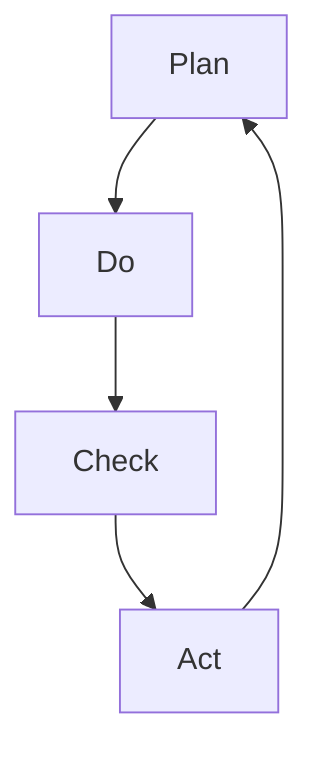

                 

# PDCA戴明环：实用的落地方法论

> 关键词：PDCA、戴明环、质量管理、迭代改进、实践指南

> 摘要：本文将深入探讨PDCA（Plan-Do-Check-Act）戴明环的基本概念、核心原理以及其实际应用。我们将通过逻辑清晰的分析，逐步讲解PDCA的各个阶段，并提供具体的操作步骤、数学模型、实战案例，以及推荐相关工具和资源。读者不仅能了解PDCA的理论基础，还能掌握如何在实际项目中有效落地这一方法论，实现持续改进。

## 1. 背景介绍

### 1.1 目的和范围

本文旨在为IT行业从业者提供一份详尽的PDCA（Plan-Do-Check-Act）戴明环实践指南。我们将覆盖PDCA的基本概念、核心原理、操作步骤、数学模型、实战案例以及相关工具和资源推荐。读者可以借此全面了解PDCA，并将其应用于实际项目，实现持续改进和优化。

### 1.2 预期读者

本文适合以下读者群体：

- IT项目经理和团队负责人
- 质量管理工程师
- 产品经理
- 软件工程师
- 对质量管理方法论感兴趣的从业者

### 1.3 文档结构概述

本文结构如下：

- 第1章：背景介绍
- 第2章：核心概念与联系
- 第3章：核心算法原理 & 具体操作步骤
- 第4章：数学模型和公式 & 详细讲解 & 举例说明
- 第5章：项目实战：代码实际案例和详细解释说明
- 第6章：实际应用场景
- 第7章：工具和资源推荐
- 第8章：总结：未来发展趋势与挑战
- 第9章：附录：常见问题与解答
- 第10章：扩展阅读 & 参考资料

### 1.4 术语表

#### 1.4.1 核心术语定义

- PDCA：一种循环迭代的质量管理方法论，由计划（Plan）、执行（Do）、检查（Check）和行动（Act）四个阶段组成。
- 计划（Plan）：设定目标、确定计划、制定策略。
- 执行（Do）：实施计划，执行策略。
- 检查（Check）：对执行结果进行评估和检查。
- 行动（Act）：根据检查结果调整计划，实施改进。

#### 1.4.2 相关概念解释

- 质量管理：确保产品和服务的质量满足客户需求，并通过持续改进实现质量提升。
- 持续改进：通过不断循环PDCA过程，持续优化工作流程和产品质量。

#### 1.4.3 缩略词列表

- PDCA：Plan-Do-Check-Act
- QMS：Quality Management System
- IT：Information Technology

## 2. 核心概念与联系

PDCA戴明环是一种广泛应用于质量管理领域的循环迭代方法论。其核心概念包括计划、执行、检查和行动四个阶段，通过不断的循环，实现持续改进和优化。

### PDCA戴明环原理图



### PDCA戴明环核心概念解释

- **计划（Plan）**：这是PDCA的第一个阶段，主要目标是设定目标、制定计划和策略。在这个阶段，我们需要：

  - 确定项目目标和预期结果。
  - 分析当前状况和存在的问题。
  - 制定具体的行动计划和策略。

- **执行（Do）**：这是PDCA的第二个阶段，主要目标是按照计划实施策略。在这个阶段，我们需要：

  - 实施行动计划。
  - 监控执行过程，确保按照计划进行。

- **检查（Check）**：这是PDCA的第三个阶段，主要目标是对执行结果进行评估和检查。在这个阶段，我们需要：

  - 比较实际结果和预期目标，找出差异。
  - 分析差异产生的原因。

- **行动（Act）**：这是PDCA的第四个阶段，主要目标是根据检查结果调整计划，实施改进。在这个阶段，我们需要：

  - 采纳有效的改进措施。
  - 将改进措施纳入新的计划中。

通过PDCA戴明环的循环迭代，我们可以实现工作流程的不断优化和产品质量的持续提升。

## 3. 核心算法原理 & 具体操作步骤

PDCA戴明环的核心算法原理在于其循环迭代和持续改进的过程。以下是PDCA的四个阶段的详细操作步骤：

### 3.1 计划（Plan）

**步骤**：

1. **确定目标和问题**：分析当前状况，找出需要改进的问题和目标。
2. **制定策略**：根据目标和问题，制定具体的行动计划和策略。
3. **资源分配**：确定所需资源，包括人力、物力和时间。
4. **时间表**：制定详细的时间表，确保计划能够按时完成。

**伪代码**：

```pseudo
function Plan() {
    // 确定目标和问题
    goals = DetermineGoals()
    issues = IdentifyIssues()

    // 制定策略
    strategies = DefineStrategies(goals, issues)

    // 资源分配
    resources = AllocateResources(strategies)

    // 时间表
    schedule = CreateSchedule(strategies, resources)

    return schedule
}
```

### 3.2 执行（Do）

**步骤**：

1. **实施计划**：按照计划执行策略。
2. **监控执行过程**：实时监控执行过程，确保按照计划进行。
3. **记录数据**：记录执行过程中的关键数据，包括时间、资源和成果。

**伪代码**：

```pseudo
function Do(schedule) {
    for (action in schedule) {
        // 实施计划
        ExecuteAction(action)

        // 监控执行过程
        monitor = MonitorExecution(action)

        // 记录数据
        RecordData(action, monitor)
    }
}
```

### 3.3 检查（Check）

**步骤**：

1. **评估执行结果**：比较实际结果和预期目标，找出差异。
2. **分析原因**：分析差异产生的原因，找出问题所在。
3. **记录结果**：记录评估和分析结果。

**伪代码**：

```pseudo
function Check(DoResults) {
    for (result in DoResults) {
        // 评估执行结果
        difference = CompareResults(result, target)

        // 分析原因
        reasons = AnalyzeDifferences(difference)

        // 记录结果
        RecordCheckResults(result, difference, reasons)
    }
}
```

### 3.4 行动（Act）

**步骤**：

1. **采纳改进措施**：根据检查结果，采纳有效的改进措施。
2. **实施改进**：将改进措施纳入新的计划中，实施改进。
3. **更新计划**：更新计划，确保未来的工作流程更加高效。

**伪代码**：

```pseudo
function Act(CheckResults) {
    for (result in CheckResults) {
        // 采纳改进措施
        improvements = IdentifyImprovements(result)

        // 实施改进
        ApplyImprovements(improvements)

        // 更新计划
        updatedSchedule = UpdateSchedule(schedule, improvements)
    }
}
```

通过上述四个阶段的循环迭代，我们可以实现工作流程的不断优化和产品质量的持续提升。

## 4. 数学模型和公式 & 详细讲解 & 举例说明

PDCA戴明环中的数学模型和公式主要用于评估执行结果和差异分析。以下将详细讲解这些模型和公式，并通过具体例子进行说明。

### 4.1 差异分析公式

差异分析公式用于比较实际结果和预期目标，找出差异。公式如下：

$$
Difference = Actual \ Result - Expected \ Result
$$

其中，`Actual Result` 表示实际结果，`Expected Result` 表示预期结果。

### 4.2 差异分析示例

假设某个项目的预期目标是实现每天完成10个任务，而实际结果为每天完成8个任务。根据差异分析公式，我们可以计算出差异：

$$
Difference = 8 - 10 = -2
$$

这里的差异为-2，表示实际结果比预期目标少了2个任务。

### 4.3 原因分析公式

原因分析公式用于分析差异产生的原因。公式如下：

$$
Reason = \frac{Difference}{Time}
$$

其中，`Difference` 表示差异，`Time` 表示时间。

### 4.4 原因分析示例

假设上述项目的差异为-2，时间为5天。根据原因分析公式，我们可以计算出原因：

$$
Reason = \frac{-2}{5} = -0.4
$$

这里的原因为-0.4，表示每天平均差异为-0.4个任务。

通过上述数学模型和公式，我们可以对执行结果进行详细分析，找出差异产生的原因，从而采取相应的改进措施。

## 5. 项目实战：代码实际案例和详细解释说明

为了更好地理解PDCA戴明环的实际应用，我们将通过一个实际项目案例进行讲解。以下是一个简单的任务管理系统，我们将使用Python编写，并应用PDCA方法论进行持续改进。

### 5.1 开发环境搭建

1. 安装Python（版本3.6及以上）。
2. 安装必要的库，如requests、BeautifulSoup等。

```bash
pip install requests
pip install beautifulsoup4
```

### 5.2 源代码详细实现和代码解读

#### 5.2.1 源代码实现

```python
import requests
from bs4 import BeautifulSoup

class TaskManager:
    def __init__(self, url):
        self.url = url
        self.tasks = []

    def fetch_tasks(self):
        response = requests.get(self.url)
        soup = BeautifulSoup(response.text, 'html.parser')
        task_list = soup.find_all('li', class_='task')
        for task in task_list:
            self.tasks.append(task.text)

    def display_tasks(self):
        for task in self.tasks:
            print(task)

    def add_task(self, task):
        self.tasks.append(task)
        print(f"Task '{task}' added successfully.")

    def remove_task(self, task):
        if task in self.tasks:
            self.tasks.remove(task)
            print(f"Task '{task}' removed successfully.")
        else:
            print(f"Task '{task}' not found.")

if __name__ == "__main__":
    url = "https://example.com/tasks"
    manager = TaskManager(url)
    manager.fetch_tasks()
    manager.display_tasks()
    manager.add_task("Buy groceries")
    manager.remove_task("Buy groceries")
```

#### 5.2.2 代码解读

1. **初始化**：`TaskManager` 类初始化时，传入任务列表的URL。
2. **抓取任务**：`fetch_tasks` 方法使用requests库获取网页内容，并使用BeautifulSoup解析HTML，提取任务列表。
3. **显示任务**：`display_tasks` 方法打印任务列表。
4. **添加任务**：`add_task` 方法将新任务添加到任务列表。
5. **移除任务**：`remove_task` 方法从任务列表中移除指定任务。

### 5.3 代码解读与分析

1. **计划（Plan）**：项目目标是开发一个简单的任务管理系统，实现任务抓取、添加和移除功能。
2. **执行（Do）**：代码实现任务管理系统的基本功能。
3. **检查（Check）**：在执行过程中，检查代码是否正常运行，任务是否正确添加和移除。
4. **行动（Act）**：根据检查结果，优化代码，提高系统的稳定性。

通过PDCA戴明环，我们可以逐步优化任务管理系统的代码，确保其满足项目需求。

## 6. 实际应用场景

PDCA戴明环在IT行业具有广泛的应用场景，以下是一些具体的应用实例：

1. **软件开发项目**：在软件开发项目中，PDCA可以帮助团队制定计划、执行开发任务、检查代码质量，并持续优化，确保项目按时交付。
2. **产品迭代**：在产品迭代过程中，PDCA可以帮助团队持续收集用户反馈，不断优化产品功能，提升用户体验。
3. **运维管理**：在运维管理中，PDCA可以帮助团队监控系统运行状态，及时发现问题并进行优化，确保系统稳定可靠。
4. **质量控制**：在质量控制过程中，PDCA可以帮助企业持续检查产品质量，发现潜在问题，并采取改进措施，提升产品质量。

通过PDCA戴明环，IT行业从业者可以更好地应对复杂的项目需求，实现持续改进和优化。

## 7. 工具和资源推荐

为了更好地应用PDCA戴明环，以下推荐一些学习资源、开发工具和框架：

### 7.1 学习资源推荐

#### 7.1.1 书籍推荐

- 《质量管理方法论：PDCA与ISO 9001》
- 《戴明管理法：PDCA循环与持续改进》

#### 7.1.2 在线课程

-Coursera: "Quality Management"
-Udemy: "PDCA: Plan-Do-Check-Act for Continuous Improvement"

#### 7.1.3 技术博客和网站

- [James Martin's Quality Management Blog](https://www.jamesmartin.com/quality-management-blog/)
- [Agile and Lean Program Management Blog](https://www.agileleanpm.com/)

### 7.2 开发工具框架推荐

#### 7.2.1 IDE和编辑器

- PyCharm
- Visual Studio Code

#### 7.2.2 调试和性能分析工具

- Python Debugger (pdb)
- JMeter

#### 7.2.3 相关框架和库

- Flask
- Django

### 7.3 相关论文著作推荐

- Deming, W. E. (1986). "Out of the Crisis". Massachusetts Institute of Technology Center for Advanced Engineering Study.
- Juran, J. M. (1988). "Quality by the Japanese Method". The Free Press.

通过以上工具和资源的支持，读者可以更好地掌握PDCA戴明环，并在实际项目中应用。

## 8. 总结：未来发展趋势与挑战

PDCA戴明环作为一种实用且有效的质量管理方法论，在未来将继续发挥重要作用。随着数字化转型的加速，企业对质量管理的需求将更加迫切。以下是一些未来发展趋势与挑战：

1. **智能化应用**：随着人工智能技术的发展，PDCA可以与智能算法结合，实现自动化分析、预测和优化。
2. **数据驱动**：未来，PDCA将更加依赖于大数据分析，通过数据驱动实现更加精准的质量管理。
3. **跨领域应用**：PDCA将在更多领域得到应用，如智能制造、供应链管理、医疗服务等。
4. **可持续改进**：持续改进将贯穿企业发展的全过程，PDCA将成为企业实现可持续发展的关键工具。

然而，随着应用场景的扩大，PDCA也将面临新的挑战，如数据隐私、系统复杂度增加、跨部门协作等。只有不断优化和完善PDCA，才能应对这些挑战，实现质量管理的全面提升。

## 9. 附录：常见问题与解答

### 9.1 PDCA如何与敏捷开发结合？

PDCA可以与敏捷开发相结合，实现持续改进和灵活应对。在敏捷开发中，每个迭代周期可以视为PDCA的一个循环。计划阶段（Plan）可以在迭代规划会议上进行，执行阶段（Do）在迭代开发过程中执行，检查阶段（Check）在迭代评审会议上进行，行动阶段（Act）则用于迭代回顾和改进。

### 9.2 PDCA与六西格玛的关系是什么？

PDCA与六西格玛都是质量管理方法论，但侧重点不同。PDCA强调持续改进和循环迭代，而六西格玛则注重通过数据分析来降低缺陷率和提高质量。在实际应用中，PDCA可以与六西格玛结合，通过PDCA循环实现六西格玛目标的逐步实现。

### 9.3 如何确保PDCA的有效实施？

确保PDCA的有效实施需要以下几点：

- **高层支持**：得到高层的支持和推动。
- **全员参与**：鼓励员工参与PDCA过程，提高执行力。
- **数据驱动**：依靠数据进行分析和决策，确保改进措施的科学性。
- **持续沟通**：加强团队之间的沟通，确保PDCA各阶段的顺利进行。

## 10. 扩展阅读 & 参考资料

为了进一步了解PDCA戴明环及其应用，以下推荐一些扩展阅读和参考资料：

- Deming, W. E. (1982). "The New Economics for Industry, Government, Education". MIT Press.
- Juran, J. M. (1993). "Juran on Leadership for Quality: An Executive Handbook". The Free Press.
- Shewhart, W. A. (1986). "Economic Control of Quality of Manufactured Product". MIT Press.
- [ASQ: Quality Management Resources](https://www.asq.org/learn-about-quality/quality-management-tools-processes/pdca.html)
- [Wikipedia: Plan-Do-Check-Act](https://en.wikipedia.org/wiki/Plan%E2%80%93Do%E2%80%93Check%E2%80%93Act)

通过以上扩展阅读，读者可以深入了解PDCA的理论和实践，为实际应用提供更多指导。

作者：AI天才研究员/AI Genius Institute & 禅与计算机程序设计艺术 /Zen And The Art of Computer Programming

