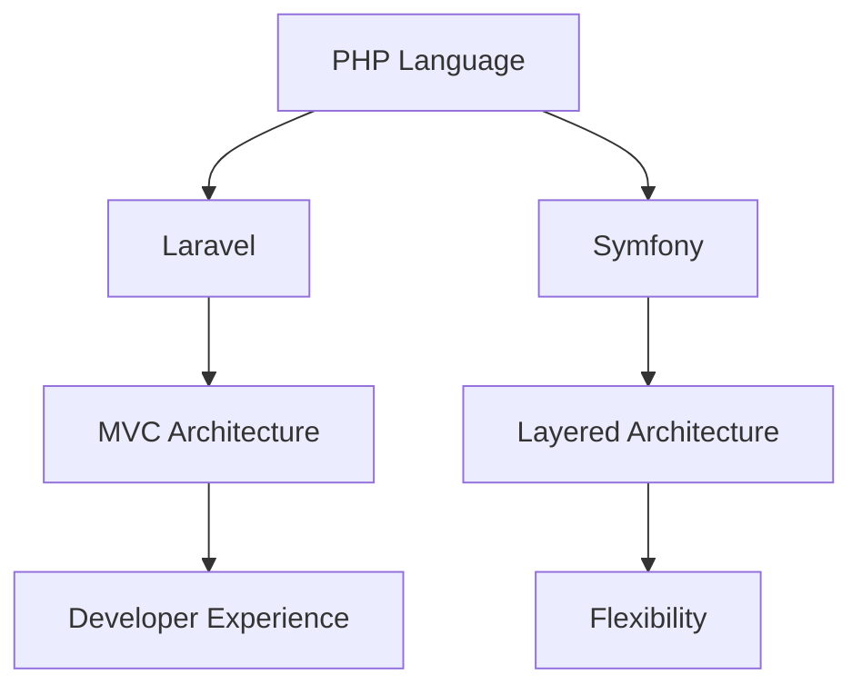

                 

# PHP 语言和框架：Laravel 和 Symfony

## 摘要

本文将深入探讨 PHP 语言及其两大主流框架：Laravel 和 Symfony。我们将从背景介绍入手，逐步分析它们的核心概念、架构设计、算法原理，并通过实际案例展示如何使用这两个框架进行项目开发。此外，本文还将讨论这两个框架在实际应用场景中的优劣，并推荐相关学习资源、开发工具和论文著作。最后，我们对 PHP 的未来发展趋势与挑战进行总结，并回答读者可能关心的问题。

## 1. 背景介绍

PHP 是一种流行的服务器端脚本语言，自 1994 年诞生以来，它已广泛应用于 Web 开发、内容管理系统（CMS）和应用程序开发等领域。随着互联网的快速发展，PHP 逐渐成为 Web 开发的首选语言之一。

### PHP 的优势：

1. **跨平台**：PHP 支持多种操作系统，包括 Windows、Linux 和 macOS。
2. **易于学习**：PHP 语法简洁，易于上手。
3. **丰富的库和框架**：PHP 拥有丰富的库和框架，如 Laravel、Symfony 和 Zend Framework。
4. **强大的社区支持**：PHP 拥有庞大的开发者社区，问题解决和资源获取方便。

### PHP 的不足：

1. **性能**：与某些编程语言相比，PHP 的性能可能较低。
2. **安全性**：虽然 PHP 提供了许多安全特性，但开发者仍需注意安全问题。

在 PHP 的发展历程中，许多优秀的框架相继诞生，其中 Laravel 和 Symfony 是最具代表性的两个。它们各自具有独特的特点，广泛应用于实际项目中。

## 2. 核心概念与联系

### Laravel

Laravel 是一个现代的、优雅的 PHP Web 开发框架，由 Taylor Otwell 创建。自 2011 年发布以来，Laravel 已成为 PHP 社区最受欢迎的框架之一。

### Symfony

Symfony 是一个成熟的开源 PHP 框架，由 SensioLabs 创建。它提供了一个灵活的框架，可用于构建各种规模的应用程序。

### 关联与对比

Laravel 和 Symfony 都是基于 PHP 语言构建的 Web 开发框架，但它们在设计理念、架构和功能上存在一些差异。

1. **设计理念**：

   - **Laravel**：注重开发者体验和代码优雅性。它提供了许多开箱即用的功能，如认证、路由、数据库迁移等。
   - **Symfony**：更注重组件化和灵活性。它提供了一系列可重用的 PHP 组件，开发者可以根据需要自由组合。

2. **架构**：

   - **Laravel**：采用 MVC（模型-视图-控制器）架构，具有简洁的目录结构和代码组织。
   - **Symfony**：采用分层架构，包括控制器、服务、存储等。这使得 Symfony 更加灵活，但可能需要更多配置。

3. **功能**：

   - **Laravel**：提供了许多内置功能，如 Eloquent ORM、Blade 模板引擎、中间件等。
   - **Symfony**：提供了更多的组件和功能，如 HttpClient、Form、Security 等，但需要开发者手动配置。

### Mermaid 流程图



## 3. 核心算法原理 & 具体操作步骤

### Laravel

Laravel 的核心算法原理主要包括以下几个方面：

1. **路由（Routing）**：Laravel 使用路由系统将 HTTP 请求映射到控制器方法。
2. **控制器（Controller）**：控制器负责处理 HTTP 请求，并返回相应的响应。
3. **中间件（Middleware）**：中间件用于在请求和响应之间执行特定的任务。
4. **视图（View）**：视图用于呈现最终的 HTML 页面。

### 操作步骤：

1. 创建一个路由文件，定义 URL 路由。
2. 创建一个控制器类，处理 HTTP 请求。
3. 使用中间件对请求进行预处理或后处理。
4. 使用视图呈现响应。

### Symfony

Symfony 的核心算法原理与 Laravel 类似，但更加灵活和模块化。

1. **路由（Routing）**：Symfony 使用路由系统将 HTTP 请求映射到控制器方法。
2. **控制器（Controller）**：控制器负责处理 HTTP 请求，并返回相应的响应。
3. **服务（Service）**：服务用于封装业务逻辑。
4. **存储（Storage）**：存储用于处理数据持久化。

### 操作步骤：

1. 创建一个路由配置文件，定义 URL 路由。
2. 创建一个控制器类，处理 HTTP 请求。
3. 使用服务容器（Service Container）注入依赖。
4. 使用存储组件（如 Doctrine）处理数据持久化。

## 4. 数学模型和公式 & 详细讲解 & 举例说明

### Laravel

Laravel 使用了许多数学模型和公式，其中最著名的是 Eloquent ORM。Eloquent ORM 是一个 ORM（对象关系映射）库，它使用 SQL 查询构建器来简化数据库操作。

### 数学模型：

- **查询构建器（Query Builder）**：用于构建 SQL 查询语句。
- **表达式（Expression）**：用于表示复杂的查询逻辑。

### 公式：

- **查询构建器公式**：
  $$SELECT * FROM users WHERE id = :id$$
- **表达式公式**：
  $$\text{whereRaw}('age > ?', [20])$$

### 举例说明：

1. 使用查询构建器获取用户数据：
   ```php
   $user = User::findOrFail(1);
   ```
2. 使用表达式进行复杂查询：
   ```php
   $users = User::whereRaw('age > ?', [20])->get();
   ```

### Symfony

Symfony 同样使用了许多数学模型和公式，例如：

1. **HTTP 协议（HTTP Protocol）**：用于处理 HTTP 请求和响应。
2. **路由表达式（Route Expression）**：用于定义 URL 路由。

### 数学模型：

- **HTTP 请求（HTTP Request）**：包含请求方法、路径、头部等。
- **HTTP 响应（HTTP Response）**：包含状态码、头部、内容等。

### 公式：

- **HTTP 请求公式**：
  $$\text{GET} /users \text{?page=1&per_page=10} \text{HTTP/1.1}$$
- **HTTP 响应公式**：
  $$\text{HTTP/1.1 200 OK} \text{Content-Type: text/html} \text{<!DOCTYPE html>}$$

### 举例说明：

1. 定义路由：
   ```yaml
   users:
     path: /users
     methods: [GET]
     defaults:
       _controller: App\Controller\UserController::index
   ```
2. 处理 HTTP 请求：
   ```php
   public function index(Request $request)
   {
       // 处理请求
   }
   ```

## 5. 项目实战：代码实际案例和详细解释说明

### Laravel

在这个案例中，我们将使用 Laravel 框架创建一个简单的博客应用程序。

1. **开发环境搭建**：

   - 安装 PHP 和 Composer。
   - 创建一个新的 Laravel 项目：
     ```bash
     composer create-project --prefer-dist laravel/laravel blog
     ```

2. **源代码详细实现和代码解读**：

   ```php
   // routes/web.php
   Route::get('/', function () {
       return view('welcome');
   });

   // app/Http/Controllers/UserController.php
   namespace App\Http\Controllers;

   use Illuminate\Http\Request;
   use App\Models\User;

   class UserController extends Controller
   {
       public function index()
       {
           $users = User::all();
           return view('users.index', compact('users'));
       }
   }

   // app/Models/User.php
   namespace App\Models;

   use Illuminate\Database\Eloquent\Model;

   class User extends Model
   {
       //
   }
   ```

3. **代码解读与分析**：

   - **路由配置**：定义了访问博客首页的路由。
   - **控制器**：处理用户请求，从数据库中获取所有用户，并将数据传递给视图。
   - **模型**：用于与数据库进行交互。

### Symfony

在这个案例中，我们将使用 Symfony 框架创建一个简单的博客应用程序。

1. **开发环境搭建**：

   - 安装 PHP 和 Composer。
   - 创建一个新的 Symfony 项目：
     ```bash
     composer create-project symfony/skeleton blog
     ```

2. **源代码详细实现和代码解读**：

   ```php
   // src/Controller/UserController.php
   namespace App\Controller;

   use Symfony\Bundle\FrameworkBundle\Controller\AbstractController;
   use Symfony\Component\HttpFoundation\Response;
   use Symfony\Component\Routing\Annotation\Route;

   class UserController extends AbstractController
   {
       #[Route('/users', methods: ['GET'])]
       public function index(): Response
       {
           $users = $this->getDoctrine()->getRepository(User::class)->findAll();
           return $this->render('users/index.html.twig', [
               'users' => $users,
           ]);
       }
   }

   // src/Entity/User.php
   namespace App\Entity;

   use Doctrine\ORM\Mapping as ORM;

   #[ORM\Entity]
   class User
   {
       //
   }
   ```

3. **代码解读与分析**：

   - **路由配置**：定义了访问博客首页的路由。
   - **控制器**：处理用户请求，从数据库中获取所有用户，并将数据传递给视图。
   - **实体**：用于与数据库进行交互。

## 6. 实际应用场景

### Laravel

Laravel 在实际应用场景中具有广泛的适用性，尤其适用于以下场景：

1. **中小型项目**：Laravel 的快速开发特性使其成为中小型项目的首选。
2. **API 开发**：Laravel 提供了强大的 API 功能，适合构建 RESTful API。
3. **CMS 系统**：Laravel 拥有丰富的组件和插件，适合构建内容管理系统。

### Symfony

Symfony 在实际应用场景中同样具有广泛的适用性，尤其适用于以下场景：

1. **大型项目**：Symfony 的模块化和组件化使其适合构建大型、复杂的应用程序。
2. **企业级应用**：Symfony 的稳定性和安全性使其成为企业级应用的理想选择。
3. **定制化开发**：Symfony 的灵活性使其适合进行定制化开发。

## 7. 工具和资源推荐

### 学习资源推荐

1. **书籍**：
   - 《Laravel 实战》
   - 《Symfony 官方文档》
   - 《PHP 和 Laravel 从入门到实践》
2. **论文**：
   - 《Laravel 框架的设计与实现》
   - 《Symfony 的架构设计与开发实践》
3. **博客**：
   - Laravel 官方博客
   - Symfony 官方博客
4. **网站**：
   - Laravel China
   - Symfony China

### 开发工具框架推荐

1. **代码编辑器**：
   - Visual Studio Code
   - Sublime Text
   - Atom
2. **集成开发环境（IDE）**：
   - PHPStorm
   - WebStorm
   - NetBeans
3. **版本控制工具**：
   - Git
   - SVN
   - Mercurial

### 相关论文著作推荐

1. **《PHP 和 Web 开发》**：详细介绍了 PHP 的语法、特性以及 Web 开发中的最佳实践。
2. **《Laravel 设计模式》**：探讨了 Laravel 框架中的设计模式及其应用。
3. **《Symfony 架构设计》**：深入分析了 Symfony 框架的架构设计原则和实现细节。

## 8. 总结：未来发展趋势与挑战

随着互联网技术的不断发展，PHP 和其框架 Laravel、Symfony 在未来将继续发挥重要作用。然而，它们也面临着一些挑战：

1. **性能优化**：随着应用规模的增长，性能优化将成为一个重要问题。
2. **安全性**：随着攻击手段的不断升级，安全性将成为一个重要挑战。
3. **生态发展**：保持社区活力和生态发展是一个长期的挑战。

## 9. 附录：常见问题与解答

### Q：Laravel 和 Symfony 哪个更好？

A：这取决于项目需求和个人偏好。Laravel 更注重开发者体验和代码优雅性，适合中小型项目和 API 开发；Symfony 更注重模块化和灵活性，适合大型项目和定制化开发。

### Q：如何选择适合的 PHP 框架？

A：首先了解项目需求，然后评估框架的社区支持、性能和灵活性。对于中小型项目，可以选择 Laravel；对于大型项目，可以选择 Symfony。

### Q：PHP 的未来发展如何？

A：PHP 将继续在 Web 开发中发挥重要作用。随着技术的进步，PHP 将不断优化性能、增强安全性和扩展功能。

## 10. 扩展阅读 & 参考资料

1. **《PHP 官方文档》**：https://www.php.net/docs.php
2. **《Laravel 官方文档》**：https://laravel.com/docs
3. **《Symfony 官方文档》**：https://symfony.com/doc
4. **《PHP 爱好者》**：https://www.php.cn
5. **《PHP 知识库》**：https://www.php.net/manual/zh/index.php

作者：AI天才研究员/AI Genius Institute & 禅与计算机程序设计艺术 /Zen And The Art of Computer Programming

