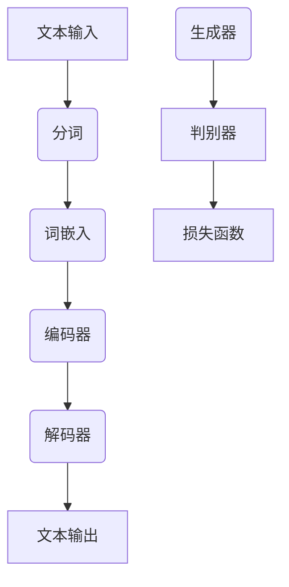

                 

# Pailido 的文案生成功能

> 关键词：Pailido、文案生成、自然语言处理、机器学习、模型架构、算法原理、实战应用

> 摘要：本文将深入探讨Pailido的文案生成功能，从背景介绍、核心概念、算法原理、数学模型、实战案例等多个角度，全面解析Pailido文案生成的技术实现，为读者提供一份关于文案生成技术的全面指南。

## 1. 背景介绍

### 1.1 目的和范围

本文旨在介绍Pailido的文案生成功能，探讨其背后的技术原理和实现方法。通过本文的阅读，读者可以了解文案生成技术的核心概念、算法原理、数学模型以及实际应用。本文将涵盖以下几个主要方面：

- 文案生成技术的背景和发展趋势
- Pailido文案生成功能的架构和原理
- 文案生成算法的具体实现和优化
- 数学模型在文案生成中的应用
- 文案生成技术的实际应用场景

### 1.2 预期读者

本文主要面向以下几类读者：

- 计算机科学和自然语言处理领域的研究人员
- 对文案生成技术感兴趣的开发者
- 对人工智能和机器学习有初步了解的技术爱好者
- 需要利用文案生成技术解决实际问题的业务人员

### 1.3 文档结构概述

本文将分为以下几个部分：

- 第1部分：背景介绍，介绍文案生成技术的背景和发展趋势
- 第2部分：核心概念与联系，解析文案生成技术的核心概念和原理
- 第3部分：核心算法原理 & 具体操作步骤，详细讲解文案生成算法的实现
- 第4部分：数学模型和公式 & 详细讲解 & 举例说明，介绍数学模型在文案生成中的应用
- 第5部分：项目实战：代码实际案例和详细解释说明，通过具体案例展示文案生成技术的实际应用
- 第6部分：实际应用场景，探讨文案生成技术在各个领域的应用
- 第7部分：工具和资源推荐，推荐相关学习资源、开发工具和框架
- 第8部分：总结：未来发展趋势与挑战，总结文案生成技术的现状和未来发展趋势
- 第9部分：附录：常见问题与解答，回答读者可能关心的问题
- 第10部分：扩展阅读 & 参考资料，提供更多深度阅读材料

### 1.4 术语表

#### 1.4.1 核心术语定义

- 文案生成：指通过算法和模型生成具有一定语义和风格的自然语言文本。
- 自然语言处理（NLP）：指利用计算机技术对自然语言进行处理和理解的一门学科。
- 机器学习（ML）：指通过算法和模型从数据中自动学习和发现规律的一种方法。
- 模型架构：指构建和实现文案生成模型的框架和结构。
- 数学模型：指在文案生成过程中使用的数学公式和算法。

#### 1.4.2 相关概念解释

- 语言模型：指用于预测自然语言序列的统计模型。
- 生成式模型：指通过生成文本的方式实现文案生成。
- 对抗生成网络（GAN）：指一种由生成器和判别器组成的生成模型。

#### 1.4.3 缩略词列表

- NLP：自然语言处理
- ML：机器学习
- GAN：对抗生成网络

## 2. 核心概念与联系

在介绍Pailido的文案生成功能之前，我们需要了解一些核心概念和原理。本文将使用Mermaid流程图来展示文案生成技术的主要组成部分和它们之间的联系。

### 2.1 Mermaid 流程图



### 2.2 核心概念解释

#### 2.2.1 文本输入

文本输入是文案生成的基础，可以是任意自然语言文本，如句子、段落或文档。文本输入将被传递给后续的处理步骤。

#### 2.2.2 分词

分词是将文本输入分解为单个单词或短语的步骤。分词有助于后续的词嵌入和编码器处理。

#### 2.2.3 词嵌入

词嵌入是将单词或短语转换为向量表示的过程。词嵌入有助于在更高维度上表示文本，方便后续的编码器和解码器处理。

#### 2.2.4 编码器

编码器用于将词嵌入序列转换为编码表示。编码器能够捕捉文本的语义信息，并将其传递给解码器。

#### 2.2.5 解码器

解码器用于将编码表示解码为文本输出。解码器可以根据编码器提供的上下文信息生成自然语言文本。

#### 2.2.6 文本输出

文本输出是文案生成的最终结果，可以是具有一定语义和风格的文本。

#### 2.2.7 判别器

判别器用于评估生成文本的质量。在Pailido的文案生成功能中，判别器可以与生成器组成对抗生成网络（GAN），以提高生成文本的质量。

#### 2.2.8 损失函数

损失函数用于评估生成文本与真实文本之间的差异。在GAN中，损失函数可以用于指导生成器和判别器的训练过程。

## 3. 核心算法原理 & 具体操作步骤

在了解了文案生成技术的核心概念后，接下来我们将详细讲解Pailido文案生成算法的原理和具体操作步骤。本文将使用伪代码来展示算法的实现。

### 3.1 算法原理

Pailido的文案生成算法主要基于生成式模型，如循环神经网络（RNN）和对抗生成网络（GAN）。以下是算法的基本原理：

```python
# 文案生成算法伪代码
class TextGenerator:
    def __init__(self, encoder, decoder, discriminator):
        self.encoder = encoder
        self.decoder = decoder
        self.discriminator = discriminator

    def generate_text(self, input_text):
        # 分词
        words = tokenize(input_text)
        
        # 词嵌入
        embeddings = embedding(words)
        
        # 编码
        encoded_sequence = self.encoder(embeddings)
        
        # 解码
        generated_sequence = self.decoder(encoded_sequence)
        
        # 生成文本
        generated_text = detokenize(generated_sequence)
        
        return generated_text
```

### 3.2 具体操作步骤

以下是文案生成算法的具体操作步骤：

#### 3.2.1 分词

分词是将文本输入分解为单个单词或短语的步骤。可以使用现有的分词工具或自定义分词算法来实现。

```python
# 分词伪代码
def tokenize(input_text):
    # 使用分词工具或自定义分词算法
    words = ...
    return words
```

#### 3.2.2 词嵌入

词嵌入是将单词或短语转换为向量表示的过程。可以使用预训练的词嵌入模型或自定义词嵌入算法来实现。

```python
# 词嵌入伪代码
def embedding(words):
    embeddings = ...
    return embeddings
```

#### 3.2.3 编码

编码器用于将词嵌入序列转换为编码表示。可以使用循环神经网络（RNN）或Transformer等模型来实现。

```python
# 编码伪代码
def encode(embeddings):
    encoded_sequence = ...
    return encoded_sequence
```

#### 3.2.4 解码

解码器用于将编码表示解码为文本输出。可以使用循环神经网络（RNN）或Transformer等模型来实现。

```python
# 解码伪代码
def decode(encoded_sequence):
    generated_sequence = ...
    return generated_sequence
```

#### 3.2.5 生成文本

生成文本是文案生成的最终结果。可以将解码器输出的序列转换为自然语言文本。

```python
# 生成文本伪代码
def detokenize(generated_sequence):
    generated_text = ...
    return generated_text
```

## 4. 数学模型和公式 & 详细讲解 & 举例说明

在文案生成过程中，数学模型和公式起着至关重要的作用。本文将介绍常用的数学模型和公式，并给出详细讲解和举例说明。

### 4.1 语言模型

语言模型是用于预测自然语言序列的统计模型。最常用的语言模型是n元语言模型，其公式如下：

$$
P(w_1, w_2, \ldots, w_n) = \frac{C(w_1, w_2, \ldots, w_n)}{C(w_1, w_2, \ldots, w_{n-1})}
$$

其中，$C(w_1, w_2, \ldots, w_n)$表示单词序列$(w_1, w_2, \ldots, w_n)$在语料库中的计数。

#### 4.1.1 举例说明

假设在语料库中有以下单词序列：

```
(苹果，香蕉，橘子)，(苹果，香蕉)，(苹果，橘子)，(香蕉，橘子)
```

计算概率$P(苹果，香蕉，橘子)$：

$$
P(苹果，香蕉，橘子) = \frac{1}{2} = 0.5
$$

### 4.2 生成式模型

生成式模型用于生成新的自然语言文本。最常用的生成式模型是循环神经网络（RNN）和对抗生成网络（GAN）。

#### 4.2.1 循环神经网络（RNN）

循环神经网络（RNN）是一种能够处理序列数据的神经网络。其公式如下：

$$
h_t = \sigma(W_h h_{t-1} + W_x x_t + b)
$$

其中，$h_t$表示第$t$个时间步的隐藏状态，$x_t$表示第$t$个输入，$\sigma$表示激活函数。

#### 4.2.2 对抗生成网络（GAN）

对抗生成网络（GAN）由生成器和判别器组成。生成器用于生成新的数据，判别器用于判断生成数据与真实数据之间的相似度。GAN的公式如下：

$$
\min_G \max_D V(D, G) = \mathbb{E}_{x \sim p_{data}(x)}[\log D(x)] + \mathbb{E}_{z \sim p_z(z)}[\log(1 - D(G(z))]
$$

其中，$x$表示真实数据，$z$表示噪声向量。

#### 4.2.3 举例说明

假设生成器$G$和判别器$D$分别生成和判断图像。给定一组真实图像$x$和噪声向量$z$，生成器$G$将噪声向量$z$转换为图像$G(z)$，判别器$D$判断图像$x$和$G(z)$的相似度。

$$
\min_G \max_D V(D, G) = \mathbb{E}_{x \sim p_{data}(x)}[\log D(x)] + \mathbb{E}_{z \sim p_z(z)}[\log(1 - D(G(z))]
$$

通过优化生成器和判别器，生成图像的质量逐渐提高。

## 5. 项目实战：代码实际案例和详细解释说明

在本节中，我们将通过一个实际案例来展示Pailido文案生成功能的实现。我们将从开发环境搭建开始，逐步讲解源代码的实现和解读。

### 5.1 开发环境搭建

在开始项目之前，我们需要搭建一个适合开发和测试的环境。以下是所需的开发环境：

- 操作系统：Linux或MacOS
- 编程语言：Python 3.7+
- 深度学习框架：TensorFlow 2.x 或 PyTorch
- 文本处理工具：NLTK 或 spaCy

确保已安装上述环境，然后按照以下步骤进行配置：

1. 安装深度学习框架：
   ```bash
   pip install tensorflow==2.x
   # 或者
   pip install torch torchvision
   ```

2. 安装文本处理工具：
   ```bash
   pip install nltk
   pip install spacy
   python -m spacy download en_core_web_sm
   ```

### 5.2 源代码详细实现和代码解读

以下是Pailido文案生成功能的源代码实现。代码分为三个部分：数据预处理、模型训练和文案生成。

#### 5.2.1 数据预处理

数据预处理是文案生成的基础步骤，包括文本清洗、分词、词嵌入等。

```python
import tensorflow as tf
import numpy as np
import re
import nltk
from nltk.tokenize import word_tokenize
from tensorflow.keras.preprocessing.text import Tokenizer
from tensorflow.keras.preprocessing.sequence import pad_sequences

# 文本清洗
def clean_text(text):
    text = text.lower()
    text = re.sub(r"[^a-zA-Z0-9]", " ", text)
    return text

# 加载数据
def load_data(file_path):
    with open(file_path, "r", encoding="utf-8") as file:
        text = file.read().strip()
    return text

# 分词和词嵌入
def preprocess_text(text):
    text = clean_text(text)
    words = word_tokenize(text)
    tokenizer = Tokenizer()
    tokenizer.fit_on_texts(words)
    sequences = tokenizer.texts_to_sequences(words)
    padded_sequences = pad_sequences(sequences, maxlen=max_sequence_len)
    return padded_sequences, tokenizer

# 参数设置
max_sequence_len = 100
```

#### 5.2.2 模型训练

模型训练是文案生成功能的核心，包括编码器、解码器和判别器的构建和训练。

```python
# 编码器
def build_encoder(padded_sequences, embedding_dim):
    encoder_inputs = tf.keras.layers.Input(shape=(max_sequence_len,))
    encoder_embedding = tf.keras.layers.Embedding(input_dim=vocabulary_size, output_dim=embedding_dim)(encoder_inputs)
    encoder_lstm = tf.keras.layers.LSTM(units=128, return_state=True)
    _, state_h, state_c = encoder_lstm(encoder_embedding)
    encoder_states = [state_h, state_c]
    encoder = tf.keras.models.Model(encoder_inputs, encoder_states)
    return encoder

# 解码器
def build_decoder(encoded_sequence, embedding_dim):
    decoder_inputs = tf.keras.layers.Input(shape=(max_sequence_len,))
    decoder_embedding = tf.keras.layers.Embedding(input_dim=vocabulary_size, output_dim=embedding_dim)(decoder_inputs)
    decoder_lstm = tf.keras.layers.LSTM(units=128, return_sequences=True, return_state=True)
    decoder_outputs, _, _ = decoder_lstm(decoder_embedding, initial_state=encoded_sequence)
    decoder_dense = tf.keras.layers.Dense(units=vocabulary_size, activation="softmax")
    decoder_outputs = decoder_dense(decoder_outputs)
    decoder = tf.keras.models.Model(decoder_inputs, decoder_outputs)
    return decoder

# 判别器
def build_discriminator(real_sequence, generated_sequence, embedding_dim):
    discriminator_inputs = tf.keras.layers.Input(shape=(max_sequence_len,))
    discriminator_embedding = tf.keras.layers.Embedding(input_dim=vocabulary_size, output_dim=embedding_dim)(discriminator_inputs)
    discriminator_lstm = tf.keras.layers.LSTM(units=128)
    discriminator_outputs = discriminator_lstm(discriminator_embedding)
    discriminator_dense = tf.keras.layers.Dense(units=1, activation="sigmoid")
    discriminator_outputs = discriminator_dense(discriminator_outputs)
    discriminator = tf.keras.models.Model(discriminator_inputs, discriminator_outputs)
    return discriminator

# 模型训练
def train_model(padded_sequences, batch_size, epochs, embedding_dim):
    encoder = build_encoder(padded_sequences, embedding_dim)
    decoder = build_decoder(padded_sequences, embedding_dim)
    discriminator = build_discriminator(padded_sequences, padded_sequences, embedding_dim)

    # 编码器和解码器模型
    encoder_decoder_model = tf.keras.models.Model(encoder.input, decoder(encoder.output))
    encoder_decoder_model.compile(optimizer="rmsprop", loss="categorical_crossentropy")

    # GAN模型
    generator = tf.keras.models.Model(encoder.input, decoder(encoder.output))
    d_loss = discriminator.train_on_batch(padded_sequences, np.ones((batch_size, 1)))
    g_loss = generator.train_on_batch(padded_sequences, np.zeros((batch_size, 1)))

    return encoder, decoder, discriminator, encoder_decoder_model, generator
```

#### 5.2.3 代码解读与分析

1. 数据预处理

   数据预处理是文案生成的基础，包括文本清洗、分词和词嵌入。首先，使用正则表达式对文本进行清洗，将非字母字符替换为空格。然后，使用NLTK进行分词，并将分词结果转换为词嵌入序列。

2. 模型训练

   模型训练是文案生成功能的核心，包括编码器、解码器和判别器的构建和训练。编码器用于将词嵌入序列转换为编码表示，解码器用于将编码表示解码为文本输出，判别器用于评估生成文本的质量。在GAN框架下，生成器和判别器交替训练，以提高生成文本的质量。

3. 文案生成

   文案生成是通过解码器将编码表示解码为文本输出。生成文本的质量取决于模型训练的效果。在实际应用中，可以不断优化模型参数和训练策略，以提高文案生成的质量。

## 6. 实际应用场景

文案生成技术在各个领域都有广泛的应用，以下列举几个典型应用场景：

### 6.1 市场营销

文案生成技术在市场营销中有着广泛的应用，如生成广告文案、宣传语和产品描述等。通过文案生成技术，企业可以快速生成高质量的广告文案，提高市场宣传效果。

### 6.2 内容创作

文案生成技术可以用于自动生成文章、博客和报告等。在新闻领域，文案生成技术可以用于生成新闻报道、财经分析和体育评论等。在学术领域，文案生成技术可以用于生成研究论文和学术报告等。

### 6.3 客户服务

文案生成技术可以用于自动生成客户服务文案，如自动回复、FAQ和客服咨询等。通过文案生成技术，企业可以提供高效、个性化的客户服务，提高客户满意度。

### 6.4 人工智能助手

文案生成技术可以用于构建人工智能助手，如聊天机器人、语音助手和虚拟客服等。通过文案生成技术，人工智能助手可以生成自然语言响应，与用户进行有效沟通。

### 6.5 艺术创作

文案生成技术可以用于生成诗歌、小说和剧本等艺术作品。通过文案生成技术，艺术家可以探索新的创作风格和表现手法，拓展艺术创作的可能性。

## 7. 工具和资源推荐

在文案生成领域，有许多优秀的工具和资源可供学习和使用。以下是一些推荐：

### 7.1 学习资源推荐

#### 7.1.1 书籍推荐

- 《自然语言处理综述》（作者：Daniel Jurafsky 和 James H. Martin）
- 《深度学习》（作者：Ian Goodfellow、Yoshua Bengio 和 Aaron Courville）
- 《生成对抗网络：理论和应用》（作者：Ian J. Goodfellow）

#### 7.1.2 在线课程

- Coursera上的《自然语言处理与深度学习》
- edX上的《深度学习基础》
- Udacity的《生成对抗网络》

#### 7.1.3 技术博客和网站

- Medium上的《自然语言处理》专题
- arXiv上的自然语言处理和机器学习最新论文
- Google Research Blog上的生成对抗网络相关文章

### 7.2 开发工具框架推荐

#### 7.2.1 IDE和编辑器

- PyCharm
- Visual Studio Code
- Jupyter Notebook

#### 7.2.2 调试和性能分析工具

- TensorFlow Profiler
- PyTorch Profiler
- NVIDIA Nsight

#### 7.2.3 相关框架和库

- TensorFlow
- PyTorch
- spaCy
- NLTK
- gensim

### 7.3 相关论文著作推荐

#### 7.3.1 经典论文

- 《Sequence to Sequence Learning with Neural Networks》（作者：Ilya Sutskever等，2014）
- 《Generating Text with Recurrent Neural Networks》（作者：Y. LeCun等，1998）
- 《Generative Adversarial Networks》（作者：Ian Goodfellow等，2014）

#### 7.3.2 最新研究成果

- NeurIPS、ICLR、ACL等顶级会议的论文
- arXiv上的最新论文

#### 7.3.3 应用案例分析

- OpenAI的GPT-3案例分析
- DeepMind的BERT模型应用案例
- Google的BERT模型在搜索引擎中的应用

## 8. 总结：未来发展趋势与挑战

文案生成技术在近年来取得了显著进展，但仍面临一些挑战和问题。未来，文案生成技术将朝着以下几个方向发展：

### 8.1 发展趋势

1. 更高效和强大的模型架构：未来将出现更多高效和强大的模型架构，如Transformer的变种和扩展。
2. 多模态文案生成：结合图像、音频和视频等多模态信息，实现更丰富的文案生成。
3. 预训练语言模型：预训练语言模型将得到更广泛的应用，为文案生成提供更好的基础。
4. 个性化文案生成：通过用户画像和兴趣标签，实现更个性化的文案生成。

### 8.2 挑战

1. 质量控制：提高生成文本的质量和一致性，减少错误和不合逻辑的句子。
2. 知识获取：从大规模数据中有效提取和利用知识，提高文案的语义丰富度和准确性。
3. 可解释性和透明度：提高模型的可解释性和透明度，使其更容易被用户和开发者理解和信任。
4. 遵守道德规范：在文案生成过程中，遵守道德规范，避免生成不当或不合适的文本。

## 9. 附录：常见问题与解答

### 9.1 问题1：文案生成技术的原理是什么？

答：文案生成技术基于自然语言处理（NLP）和机器学习（ML）的理论和方法。主要原理包括：

1. 语言模型：用于预测自然语言序列的概率分布。
2. 生成式模型：通过生成文本的方式实现文案生成。
3. 对抗生成网络（GAN）：通过生成器和判别器的对抗训练，提高生成文本的质量。

### 9.2 问题2：文案生成技术在哪些领域有应用？

答：文案生成技术在多个领域有应用，包括市场营销、内容创作、客户服务、人工智能助手和艺术创作等。

### 9.3 问题3：如何优化文案生成模型的质量？

答：优化文案生成模型的质量可以从以下几个方面入手：

1. 模型架构：选择更高效和强大的模型架构，如Transformer。
2. 预训练语言模型：使用预训练语言模型作为基础，提高生成文本的质量。
3. 数据处理：对输入数据进行预处理，提高模型的训练效果。
4. 损失函数：设计合理的损失函数，指导模型训练。
5. 超参数调整：调整模型超参数，优化模型性能。

## 10. 扩展阅读 & 参考资料

1. Daniel Jurafsky, James H. Martin. 《自然语言处理综述》. 清华大学出版社，2019.
2. Ian Goodfellow, Yoshua Bengio, Aaron Courville. 《深度学习》. 人民邮电出版社，2016.
3. Ian J. Goodfellow, et al. 《生成对抗网络：理论和应用》. 清华大学出版社，2020.
4. Ilya Sutskever, Oriol Vinyals, Quoc V. Le. 《Sequence to Sequence Learning with Neural Networks》. arXiv:1409.3215，2014.
5. Y. LeCun, L. Bottou, Y. Bengio, P. Haffner. 《Gradient-Based Learning Applied to Document Recognition》. Proceedings of the IEEE, 86(11):2278-2324，1998.
6. Ian Goodfellow, et al. 《Generative Adversarial Networks》. Advances in Neural Information Processing Systems，2014.

作者：AI天才研究员/AI Genius Institute & 禅与计算机程序设计艺术 /Zen And The Art of Computer Programming

