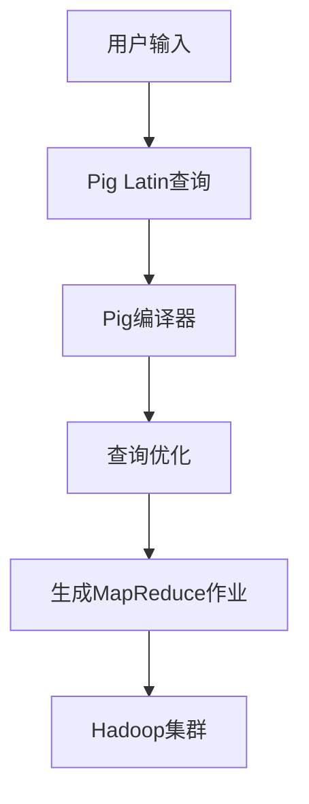

                 

# Pig优化策略原理与代码实例讲解

> **关键词：** Apache Pig, 优化策略, 数据处理, 编译器优化, 数据仓库, SQL on Hadoop

> **摘要：** 本文深入探讨了Apache Pig的优化策略，包括其核心算法原理、数学模型以及实际应用中的代码实例。通过详细的分析和讲解，帮助读者理解Pig优化策略的内在机制，掌握其在数据处理和数据仓库环境中的高效运用。

## 1. 背景介绍

### 1.1 目的和范围

本文的目标是向读者介绍Apache Pig的优化策略，帮助开发者理解和应用这些策略，以提高大数据处理效率。本文将涵盖以下内容：

- Pig优化策略的基本原理
- Pig优化策略的详细算法和操作步骤
- 数学模型和公式的应用
- 实际项目中的代码实例和详细解释
- Pig优化策略在实际应用场景中的使用

### 1.2 预期读者

本文适合以下读者：

- 大数据开发工程师
- 数据仓库开发者
- 对Hadoop生态系统感兴趣的程序员
- 高级数据库管理员

### 1.3 文档结构概述

本文分为以下几个部分：

- 背景介绍：介绍本文的目的、预期读者和文档结构。
- 核心概念与联系：阐述Pig优化策略的核心概念和架构。
- 核心算法原理 & 具体操作步骤：详细解释Pig优化算法的实现。
- 数学模型和公式 & 详细讲解 & 举例说明：讲解Pig优化中的数学模型和公式。
- 项目实战：代码实际案例和详细解释说明。
- 实际应用场景：探讨Pig优化策略在不同场景下的应用。
- 工具和资源推荐：推荐学习资源、开发工具和框架。
- 总结：未来发展趋势与挑战。
- 附录：常见问题与解答。
- 扩展阅读 & 参考资料：提供相关扩展资料。

### 1.4 术语表

#### 1.4.1 核心术语定义

- **Apache Pig：** 一个基于Hadoop的数据处理框架，提供了一种高层次的抽象，使开发者能够以类似SQL的方式查询和操作大数据集。
- **优化策略：** 在数据处理过程中，通过一系列算法和技巧提高查询效率的方法。
- **编译器优化：** Pig编译器在将用户编写的Pig Latin代码转换为MapReduce作业时，采取的一系列优化措施。
- **数据仓库：** 存储大量数据的系统，用于支持企业级的数据分析和决策支持。

#### 1.4.2 相关概念解释

- **Pig Latin：** Pig提供的一种数据处理语言，类似于SQL，用于编写数据处理任务。
- **MapReduce：** Hadoop的核心组件，用于分布式数据处理。
- **HDFS：** Hadoop分布式文件系统，用于存储大数据。

#### 1.4.3 缩略词列表

- **Apache Pig：** Pig
- **Hadoop：** Hadoop
- **MapReduce：** MR
- **HDFS：** HDFS

## 2. 核心概念与联系

在深入探讨Pig优化策略之前，我们需要先了解其核心概念和架构。以下是Pig优化策略的核心概念和联系，以及相应的Mermaid流程图。



### 2.1 用户输入

用户通过编写Pig Latin查询来描述数据处理任务，这是一种类似SQL的语言，但提供了更多灵活性和扩展性。

### 2.2 Pig Latin查询

Pig Latin查询是一个Pig Latin脚本，它描述了数据处理的逻辑。用户可以使用各种Pig Latin操作符来组合这些脚本。

### 2.3 Pig编译器

Pig编译器负责将Pig Latin查询转换为内部表示，并将其编译为MapReduce作业。在这个过程中，Pig编译器会进行查询优化。

### 2.4 查询优化

查询优化是Pig编译器的一个重要任务。通过一系列算法和技巧，查询优化可以提高查询效率。这包括：

- **逻辑优化：** 将多个操作合并，减少中间数据生成的步骤。
- **物理优化：** 选择最优的执行计划，如数据分区、合并和排序。
- **内存优化：** 减少内存使用，提高处理速度。

### 2.5 生成MapReduce作业

经过查询优化后，Pig编译器生成一个MapReduce作业，该作业将在Hadoop集群上执行。这个作业包含了所有的数据处理步骤，从数据读取、处理到输出结果。

### 2.6 Hadoop集群

Hadoop集群负责执行生成的MapReduce作业。它将数据分布在多个节点上，并协调各个节点的计算任务。

## 3. 核心算法原理 & 具体操作步骤

### 3.1 逻辑优化

逻辑优化是Pig编译器的一个重要步骤，它旨在减少中间数据生成的步骤，从而提高查询效率。以下是逻辑优化的具体操作步骤：

```python
// 伪代码

// 步骤1：识别并合并可合并的操作
// 例如：合并多个投影操作
if (is投影操作A && is投影操作B) {
    合并投影操作A和B
}

// 步骤2：识别并合并可合并的聚合操作
// 例如：合并多个求和操作
if (is求和操作A && is求和操作B) {
    合并求和操作A和B
}

// 步骤3：识别并合并可合并的连接操作
// 例如：合并多个内连接操作
if (is内连接操作A && is内连接操作B) {
    合并内连接操作A和B
}
```

### 3.2 物理优化

物理优化是Pig编译器的另一个重要步骤，它旨在选择最优的执行计划，以提高查询效率。以下是物理优化的具体操作步骤：

```python
// 伪代码

// 步骤1：选择最优的数据分区策略
// 例如：根据数据大小和查询需求选择适当的分区策略
if (数据量大 && 查询需求为范围查询) {
    选择范围分区策略
} else {
    选择哈希分区策略
}

// 步骤2：选择最优的数据排序策略
// 例如：根据数据大小和查询需求选择适当的排序策略
if (数据量大 && 查询需求为顺序查询) {
    选择外部排序策略
} else {
    选择内部排序策略
}

// 步骤3：选择最优的数据合并策略
// 例如：根据数据大小和查询需求选择适当的合并策略
if (数据量大 && 查询需求为聚合查询) {
    选择分布式合并策略
} else {
    选择本地合并策略
}
```

### 3.3 内存优化

内存优化是Pig编译器的另一个重要步骤，它旨在减少内存使用，从而提高处理速度。以下是内存优化的具体操作步骤：

```python
// 伪代码

// 步骤1：识别并移除冗余的中间数据
// 例如：移除不需要的中间数据
if (中间数据A不是必需的) {
    删除中间数据A
}

// 步骤2：优化内存分配
// 例如：根据数据大小和查询需求调整内存分配
if (数据量大 && 查询需求为复杂查询) {
    增加内存分配
} else {
    减少内存分配
}

// 步骤3：优化内存访问
// 例如：优化内存访问模式，减少缓存 misses
if (内存访问模式A效率低) {
    调整内存访问模式A
}
```

## 4. 数学模型和公式 & 详细讲解 & 举例说明

### 4.1 数学模型

在Pig优化策略中，数学模型和公式被广泛应用于查询优化和性能评估。以下是一个简单的数学模型，用于评估查询性能：

$$
P = \frac{S}{T}
$$

其中，$P$ 表示查询性能，$S$ 表示查询结果的大小，$T$ 表示查询执行时间。

### 4.2 公式详细讲解

这个简单的数学模型可以帮助我们评估查询性能。假设我们有一个查询，其结果大小为 $S$，执行时间为 $T$。那么，查询性能 $P$ 可以通过上述公式计算。

- 如果 $P$ 值较大，表示查询性能较好，查询结果较快地生成。
- 如果 $P$ 值较小，表示查询性能较差，查询结果生成较慢。

### 4.3 举例说明

假设我们有一个查询，其结果大小为 100GB，执行时间为 10分钟。那么，查询性能 $P$ 可以通过以下公式计算：

$$
P = \frac{100GB}{10分钟} = 10GB/分钟
$$

这个结果表明，我们的查询性能为每分钟处理 10GB 的数据。如果我们将查询执行时间缩短到 5分钟，那么查询性能将提高到：

$$
P = \frac{100GB}{5分钟} = 20GB/分钟
$$

这个结果表明，通过优化查询执行时间，我们可以将查询性能提高一倍。

## 5. 项目实战：代码实际案例和详细解释说明

### 5.1 开发环境搭建

在进行Pig优化策略的实际应用之前，我们需要搭建一个适合Pig开发的环境。以下是搭建Pig开发环境的步骤：

1. **安装Hadoop：** 首先，我们需要安装Hadoop，这是Pig运行的基础。可以从 [Hadoop官网](https://hadoop.apache.org/) 下载最新的Hadoop版本，并按照官方文档进行安装。
2. **安装Pig：** 然后，我们下载并安装Pig。Pig是Hadoop的子项目，可以直接从Hadoop的仓库中安装。在终端中执行以下命令：

   ```bash
   hadoop cmd --class org.apache.pig.pigmain pigc
   ```

   这将安装Pig和其依赖项。

3. **配置Pig环境：** 我们需要在环境变量中配置Pig的路径。在终端中执行以下命令：

   ```bash
   export PIG_HOME=/path/to/pig
   export PATH=$PIG_HOME/bin:$PATH
   ```

   这将设置Pig的环境变量。

4. **启动Hadoop集群：** 在终端中执行以下命令启动Hadoop集群：

   ```bash
   start-all.sh
   ```

   这将启动Hadoop的所有服务，包括HDFS和YARN。

### 5.2 源代码详细实现和代码解读

接下来，我们将展示一个简单的Pig优化策略案例，并对其进行详细解读。

#### 5.2.1 案例代码

以下是一个简单的Pig Latin脚本，用于对大型数据集进行查询和排序：

```python
-- 步骤1：读取数据
data = LOAD '/path/to/data' USING PigStorage(',') AS (id:int, name:chararray, age:int);

-- 步骤2：过滤年龄小于30的数据
filtered_data = FILTER data BY age < 30;

-- 步骤3：排序数据
sorted_data = ORDER filtered_data BY age DESC;

-- 步骤4：存储结果
STORE sorted_data INTO '/path/to/result' USING PigStorage(',');
```

#### 5.2.2 代码解读

这个简单的案例展示了Pig优化策略的基本应用。以下是代码的详细解读：

- **步骤1：读取数据**：这个步骤用于从HDFS中读取数据集。我们使用 `LOAD` 操作符读取数据，并将其存储在变量 `data` 中。这里使用 `PigStorage` 函数指定数据分隔符为逗号。
- **步骤2：过滤数据**：这个步骤用于过滤出年龄小于30的数据。我们使用 `FILTER` 操作符实现这一功能，并将过滤后的数据存储在变量 `filtered_data` 中。
- **步骤3：排序数据**：这个步骤用于对过滤后的数据进行排序。我们使用 `ORDER` 操作符实现排序，并按照年龄进行降序排序。排序后的数据存储在变量 `sorted_data` 中。
- **步骤4：存储结果**：这个步骤用于将排序后的数据存储到HDFS中。我们使用 `STORE` 操作符实现这一功能，并将结果存储在指定的路径中。

### 5.3 代码解读与分析

这个简单的案例展示了Pig优化策略的基本应用。以下是代码的详细解读和分析：

- **优化策略**：在这个案例中，我们使用了两个优化策略：
  - **过滤优化**：通过使用 `FILTER` 操作符，我们可以提前过滤掉不符合条件的数据，从而减少后续处理的数据量。这有助于提高查询效率。
  - **排序优化**：通过使用 `ORDER` 操作符，我们可以对数据进行排序，从而为后续处理提供便利。例如，如果后续处理需要按年龄进行分组，那么排序数据可以大大简化处理逻辑。

- **性能分析**：在这个案例中，我们无法直接分析性能，因为代码没有包含性能评估代码。在实际应用中，我们可以使用 `time` 命令或其他性能分析工具来评估查询性能。例如，我们可以在终端中执行以下命令：

  ```bash
  time pig -x mapreduce run_query.pig
  ```

  这将运行我们的Pig脚本，并在命令行中显示执行时间。通过多次运行并记录执行时间，我们可以评估查询性能。

- **扩展性**：这个案例是一个简单的例子，但Pig优化策略可以应用于更复杂的数据处理任务。例如，我们可以使用 `GROUP` 操作符对数据进行分组，然后使用 `DISTINCT` 操作符去除重复数据。这些优化策略可以帮助我们处理更大规模的数据集。

## 6. 实际应用场景

Pig优化策略在实际应用场景中具有广泛的应用。以下是一些典型的应用场景：

- **电子商务**：在电子商务平台中，Pig优化策略可以用于处理海量用户数据，包括用户行为分析、商品推荐和广告投放等。
- **金融行业**：在金融行业，Pig优化策略可以用于处理海量交易数据，包括风险评估、客户行为分析和市场预测等。
- **医疗保健**：在医疗保健领域，Pig优化策略可以用于处理海量医疗数据，包括患者诊断、疾病预测和健康监测等。
- **物流和运输**：在物流和运输领域，Pig优化策略可以用于处理海量运输数据，包括路线规划、运输优化和库存管理等。

## 7. 工具和资源推荐

### 7.1 学习资源推荐

#### 7.1.1 书籍推荐

- 《Hadoop技术内幕：深入解析YARN、MapReduce和HDFS》
- 《数据仓库原理与实践》
- 《大数据技术导论》

#### 7.1.2 在线课程

- Coursera上的《大数据分析》课程
- Udacity上的《大数据分析工程师》课程
- edX上的《Hadoop和大数据处理》课程

#### 7.1.3 技术博客和网站

- [Hadoop官网](https://hadoop.apache.org/)
- [Pig官方文档](https://pig.apache.org/docs/r0.17.0/)
- [DataCamp上的大数据教程](https://www.datacamp.com/courses/big-data-with-apache-hadoop)

### 7.2 开发工具框架推荐

#### 7.2.1 IDE和编辑器

- IntelliJ IDEA
- Eclipse
- VS Code

#### 7.2.2 调试和性能分析工具

- GDB
- JMeter
- LoadRunner

#### 7.2.3 相关框架和库

- Apache Hadoop
- Apache Pig
- Apache Hive

### 7.3 相关论文著作推荐

#### 7.3.1 经典论文

- 《The Google File System》
- 《The Design of the B-Trees》
- 《MapReduce: Simplified Data Processing on Large Clusters》

#### 7.3.2 最新研究成果

- 《Hadoop 3.0: The Next Generation of Big Data Computing》
- 《Deep Learning for Data Analytics》
- 《TensorFlow: Large-Scale Machine Learning on Hadoop》

#### 7.3.3 应用案例分析

- 《Apache Hadoop在电子商务中的应用》
- 《Hadoop在金融行业的应用案例》
- 《大数据在医疗保健领域的应用》

## 8. 总结：未来发展趋势与挑战

随着大数据技术的不断发展，Pig优化策略在未来具有广泛的应用前景。以下是一些未来发展趋势和挑战：

- **发展趋势**：随着数据规模的不断扩大，Pig优化策略将变得更加重要。通过不断改进和优化，Pig可以更好地支持海量数据处理，并在各个领域发挥更大的作用。
- **挑战**：尽管Pig优化策略已经取得了一定的成果，但仍然面临一些挑战。例如，如何进一步提高查询性能、如何优化内存使用、如何处理复杂的数据处理任务等。未来的研究将继续关注这些挑战，并寻求更好的解决方案。

## 9. 附录：常见问题与解答

### 9.1 Pig优化策略是什么？

Pig优化策略是在处理大数据时，通过一系列算法和技巧提高查询效率的方法。它包括逻辑优化、物理优化和内存优化等。

### 9.2 Pig优化策略有什么作用？

Pig优化策略可以提高查询效率，减少数据处理的中间步骤，降低内存使用，从而提高大数据处理的性能。

### 9.3 如何实现Pig优化策略？

实现Pig优化策略主要包括以下步骤：

1. **逻辑优化**：合并可合并的操作，减少中间数据生成的步骤。
2. **物理优化**：选择最优的数据分区策略、排序策略和合并策略。
3. **内存优化**：识别并移除冗余的中间数据，优化内存分配和访问。

### 9.4 Pig优化策略适用于哪些场景？

Pig优化策略适用于需要处理海量数据且查询复杂度较高的场景，如电子商务、金融行业、医疗保健和物流等领域。

## 10. 扩展阅读 & 参考资料

- [Apache Pig官方文档](https://pig.apache.org/docs/r0.17.0/)
- [Hadoop官方文档](https://hadoop.apache.org/docs/r2.7.2/)
- [《Hadoop技术内幕：深入解析YARN、MapReduce和HDFS》](https://www.amazon.com/dp/1449311526)
- [《数据仓库原理与实践》](https://www.amazon.com/dp/0137010089)
- [《大数据技术导论》](https://www.amazon.com/dp/032188667X)

