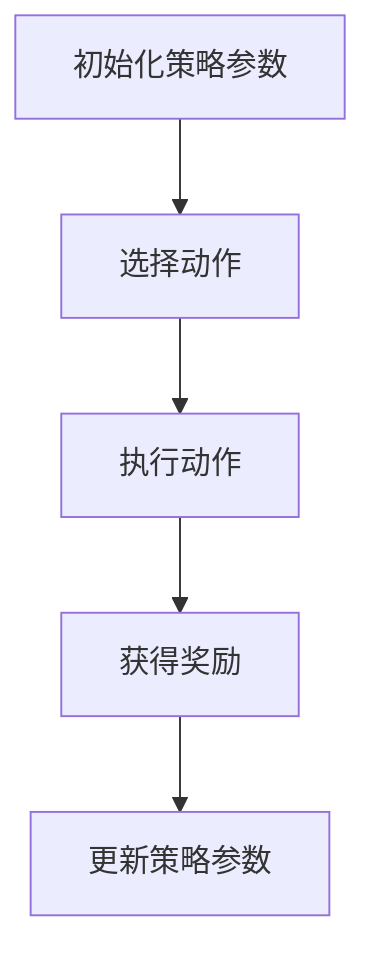

                 

# Policy Gradients原理与代码实例讲解

> 关键词：强化学习，策略梯度，Policy Gradients算法，深度学习，Q-Learning， SARSA

> 摘要：本文将深入探讨Policy Gradients算法的基本原理，数学模型，以及其在深度学习中的应用。通过详细的代码实例，我们将对Policy Gradients算法的实现步骤进行剖析，帮助读者理解其在实际应用中的价值。文章还将讨论Policy Gradients算法在实际应用中的挑战和未来发展趋势。

## 1. 背景介绍

### 1.1 目的和范围

本文旨在深入探讨Policy Gradients算法的基本原理，并介绍其在深度学习中的实际应用。我们将详细讲解Policy Gradients算法的数学模型，并通过代码实例展示其实现过程。本文还将讨论Policy Gradients算法在实际应用中面临的挑战和未来发展趋势。

### 1.2 预期读者

本文适合对强化学习和深度学习有一定了解的读者。特别是对强化学习中的Policy Gradients算法感兴趣的读者。通过本文的阅读，读者将能够掌握Policy Gradients算法的基本原理，并在实际项目中应用。

### 1.3 文档结构概述

本文分为以下几个部分：

1. 背景介绍
   - 目的和范围
   - 预期读者
   - 文档结构概述
2. 核心概念与联系
   - Policy Gradients算法的基本概念
   - 强化学习与深度学习的关系
3. 核心算法原理 & 具体操作步骤
   - 策略梯度算法的数学模型
   - 策略梯度的计算过程
4. 数学模型和公式 & 详细讲解 & 举例说明
   - 强化学习的数学模型
   - 策略梯度的计算公式
   - 代码实例
5. 项目实战：代码实际案例和详细解释说明
   - 开发环境搭建
   - 源代码详细实现和代码解读
   - 代码解读与分析
6. 实际应用场景
   - Policy Gradients算法在不同领域的应用
7. 工具和资源推荐
   - 学习资源推荐
   - 开发工具框架推荐
   - 相关论文著作推荐
8. 总结：未来发展趋势与挑战
9. 附录：常见问题与解答
10. 扩展阅读 & 参考资料

### 1.4 术语表

#### 1.4.1 核心术语定义

- 强化学习（Reinforcement Learning）：一种机器学习范式，通过奖励信号引导智能体（agent）在环境（environment）中采取行动，以最大化累积奖励。
- 策略梯度（Policy Gradient）：强化学习中的一种算法，通过优化策略函数来指导智能体选择行动。
- 深度学习（Deep Learning）：一种机器学习范式，通过多层神经网络来模拟人类大脑的神经元连接方式，对数据进行自动特征提取和分类。
- Q-Learning：一种基于值函数的强化学习算法，通过学习状态-动作值函数来指导智能体的行动。

#### 1.4.2 相关概念解释

- 策略（Policy）：在强化学习中，策略是一个映射函数，将状态映射到动作。
- 状态（State）：智能体在环境中的当前状态。
- 动作（Action）：智能体在当前状态下可以选择的行动。
- 奖励（Reward）：在智能体采取动作后，环境对智能体的奖励或惩罚。

#### 1.4.3 缩略词列表

- RL：强化学习（Reinforcement Learning）
- DRL：深度强化学习（Deep Reinforcement Learning）
- PG：策略梯度（Policy Gradient）
- SARSA：同步优势估计（Synchronous Advantage Estimation）

## 2. 核心概念与联系

在讨论Policy Gradients算法之前，我们需要了解一些核心概念和它们之间的关系。

### 2.1 Policy Gradients算法的基本概念

Policy Gradients算法是强化学习中的一种算法，它通过优化策略函数来指导智能体选择行动。策略函数是一个映射函数，它将状态映射到概率分布，表示智能体在给定状态下采取每个动作的概率。

### 2.2 强化学习与深度学习的关系

强化学习是一种基于奖励信号的学习方法，而深度学习是一种基于神经网络的学习方法。深度学习在强化学习中起到了重要的作用，它可以帮助智能体在复杂的任务中提取有用的特征。

### 2.3 Policy Gradients算法的流程

Policy Gradients算法的流程可以分为以下几个步骤：

1. 初始化策略参数。
2. 选择动作。
3. 执行动作，获得奖励。
4. 更新策略参数。

### 2.4 Mermaid流程图

以下是一个Mermaid流程图，展示了Policy Gradients算法的流程：



### 2.5 Policy Gradients算法的优势和挑战

Policy Gradients算法的优势在于它能够直接优化策略函数，避免了值函数的计算，从而加快了训练速度。然而，Policy Gradients算法也面临着一些挑战，如梯度消失和梯度爆炸等问题。

## 3. 核心算法原理 & 具体操作步骤

### 3.1 Policy Gradients算法的数学模型

Policy Gradients算法的核心是策略梯度公式。策略梯度公式描述了如何通过梯度上升方法优化策略函数。

### 3.2 策略梯度的计算过程

策略梯度的计算过程可以分为以下几个步骤：

1. 初始化策略参数。
2. 在给定的状态下，根据策略函数选择动作。
3. 执行动作，获得奖励。
4. 计算策略梯度的期望值。
5. 根据策略梯度的期望值更新策略参数。

### 3.3 策略梯度的计算公式

策略梯度的计算公式如下：

$$ \nabla_\theta J(\theta) = \nabla_\theta \sum_{t=0}^{T} \gamma^t r_t $$

其中，$\theta$ 是策略参数，$J(\theta)$ 是策略的期望回报，$r_t$ 是在第 $t$ 时刻的奖励，$\gamma$ 是折扣因子。

### 3.4 伪代码

以下是一个Policy Gradients算法的伪代码：

```python
# 初始化策略参数
theta = initialize_parameters()

# 初始化环境
env = initialize_environment()

# 初始化奖励
reward = 0

# 初始化折扣因子
gamma = 0.99

# 迭代次数
num_iterations = 1000

for i in range(num_iterations):
    # 选择动作
    action = choose_action(theta, env)

    # 执行动作，获得奖励
    reward += env.step(action)

    # 计算策略梯度的期望值
    gradient = compute_gradient(theta, action, reward, gamma)

    # 更新策略参数
    theta -= learning_rate * gradient
```

### 3.5 实际案例

为了更好地理解Policy Gradients算法，我们可以通过一个简单的例子来演示其实现过程。

假设我们有一个智能体在离散环境中进行导航的任务。智能体的目标是找到从起点到终点的最短路径。

1. 初始化策略参数：我们使用一个简单的线性策略函数，将状态编码为特征向量，并通过线性函数预测动作的概率。

2. 选择动作：在给定状态下，根据策略函数选择动作。例如，如果策略函数预测动作 $a_1$ 的概率最大，则选择动作 $a_1$。

3. 执行动作，获得奖励：执行选定的动作，并从环境中获得奖励。例如，如果智能体成功到达终点，则获得正奖励，否则获得负奖励。

4. 计算策略梯度的期望值：计算策略梯度的期望值，并根据梯度更新策略参数。

5. 更新策略参数：根据策略梯度的期望值，使用梯度上升方法更新策略参数。

通过上述步骤，我们可以实现Policy Gradients算法，并使智能体在环境中进行导航。

## 4. 数学模型和公式 & 详细讲解 & 举例说明

### 4.1 强化学习的数学模型

强化学习是一种基于奖励信号的学习方法。在强化学习中，智能体（agent）与环境（environment）进行交互，通过采取行动（action）来获取奖励（reward）。强化学习的目标是最大化智能体的累积奖励。

强化学习的基本数学模型包括状态（state）、动作（action）、策略（policy）、价值函数（value function）和奖励（reward）。

- 状态（state）：智能体在环境中的当前状态。
- 动作（action）：智能体在当前状态下可以选择的行动。
- 策略（policy）：策略是一个映射函数，将状态映射到概率分布，表示智能体在给定状态下采取每个动作的概率。
- 价值函数（value function）：价值函数是一个评估函数，用于评估智能体在给定状态和动作下获得的累积奖励。
- 奖励（reward）：奖励是环境对智能体采取行动后的奖励或惩罚。

强化学习的目标是通过学习策略函数来指导智能体选择最优动作，从而最大化累积奖励。

### 4.2 Policy Gradients算法的数学模型

Policy Gradients算法是一种基于策略梯度的强化学习算法。其核心思想是通过优化策略函数来指导智能体选择行动。

Policy Gradients算法的数学模型可以分为以下几个部分：

1. **策略函数（Policy Function）**：

   策略函数 $\pi_\theta(a|s)$ 表示在给定状态 $s$ 下，智能体采取动作 $a$ 的概率。通常，策略函数是一个概率分布，其形式可以表示为：

   $$ \pi_\theta(a|s) = \frac{e^{\theta^T \phi(s,a)}}{Z} $$

   其中，$\theta$ 是策略参数，$\phi(s,a)$ 是特征函数，$Z$ 是归一化常数。

2. **策略梯度（Policy Gradient）**：

   策略梯度是指导策略参数优化的关键。策略梯度的定义如下：

   $$ \nabla_\theta J(\theta) = \nabla_\theta \sum_{t=0}^{T} \gamma^t r_t $$

   其中，$J(\theta)$ 是策略的期望回报，$r_t$ 是在第 $t$ 时刻的奖励，$\gamma$ 是折扣因子。

3. **策略梯度的计算**：

   在实际应用中，我们通常使用蒙特卡洛方法（Monte Carlo Method）来估计策略梯度的期望值。蒙特卡洛方法的步骤如下：

   - 初始化策略参数 $\theta$。
   - 在环境中进行一系列的模拟，记录每一步的奖励 $r_t$ 和状态 $s_t$。
   - 对于每个时间步 $t$，计算策略梯度：

     $$ \nabla_\theta \pi_\theta(a_t|s_t) = r_t - \frac{e^{\theta^T \phi(s_t,a_t)}}{Z} $$

   - 使用计算得到的策略梯度更新策略参数：

     $$ \theta \leftarrow \theta - \alpha \nabla_\theta J(\theta) $$

     其中，$\alpha$ 是学习率。

### 4.3 示例讲解

为了更好地理解Policy Gradients算法，我们来看一个简单的例子。

假设我们有一个智能体在一个离散环境中进行导航。智能体的目标是找到从起点到终点的最短路径。

1. **初始化策略参数**：

   我们使用一个简单的线性策略函数，将状态编码为特征向量，并通过线性函数预测动作的概率。

   $$ \pi_\theta(a|s) = \sigma(\theta^T \phi(s,a)) $$

   其中，$\sigma$ 是sigmoid函数，$\phi(s,a)$ 是状态-动作特征向量。

2. **选择动作**：

   在给定状态下，根据策略函数选择动作。例如，如果策略函数预测动作 $a_1$ 的概率最大，则选择动作 $a_1$。

3. **执行动作，获得奖励**：

   执行选定的动作，并从环境中获得奖励。例如，如果智能体成功到达终点，则获得正奖励，否则获得负奖励。

4. **计算策略梯度的期望值**：

   记录每一步的奖励 $r_t$ 和状态 $s_t$，然后计算策略梯度：

   $$ \nabla_\theta \pi_\theta(a_t|s_t) = r_t - \pi_\theta(a_t|s_t) $$

5. **更新策略参数**：

   使用计算得到的策略梯度更新策略参数：

   $$ \theta \leftarrow \theta - \alpha \nabla_\theta J(\theta) $$

   其中，$\alpha$ 是学习率。

通过上述步骤，我们可以实现Policy Gradients算法，并使智能体在环境中进行导航。

## 5. 项目实战：代码实际案例和详细解释说明

### 5.1 开发环境搭建

在开始编写Policy Gradients算法的代码之前，我们需要搭建一个适合开发的环境。以下是一个简单的Python环境搭建步骤：

1. 安装Python（建议版本为3.7或更高）。
2. 安装必要的库，如NumPy、TensorFlow、PyTorch等。

以下是一个简单的命令行安装示例：

```bash
pip install numpy tensorflow
```

### 5.2 源代码详细实现和代码解读

以下是一个Policy Gradients算法的Python实现示例：

```python
import numpy as np
import tensorflow as tf

# 定义策略函数
def policy_function(state, theta):
    # 将状态编码为特征向量
    state_vector = tf.keras.layers.Dense(units=64, activation='relu')(state)
    # 通过线性函数预测动作的概率
    action_probs = tf.keras.layers.Dense(units=3, activation='softmax')(state_vector)
    # 计算策略梯度
    log_probs = tf.keras.activations.log(action_probs)
    return log_probs

# 定义损失函数
def loss_function(log_probs, rewards):
    # 计算策略梯度
    policy_gradients = log_probs * rewards
    # 计算损失函数
    loss = -tf.reduce_mean(policy_gradients)
    return loss

# 初始化策略参数
theta = tf.keras.layers.Dense(units=64, activation='relu')(state)

# 定义优化器
optimizer = tf.keras.optimizers.Adam(learning_rate=0.001)

# 初始化环境
env = tf.keras.Sequential([
    tf.keras.layers.Dense(units=64, activation='relu', input_shape=(10,)),
    tf.keras.layers.Dense(units=3, activation='softmax')
])

# 训练模型
for epoch in range(100):
    # 获取状态和动作
    states, actions = [], []
    for _ in range(1000):
        # 执行一个随机动作
        action = env.sample_action()
        # 获取状态和动作的概率
        state, reward = env.step(action)
        states.append(state)
        actions.append(action)
    # 计算策略梯度
    with tf.GradientTape() as tape:
        log_probs = policy_function(tf.constant(states), theta)
        loss = loss_function(log_probs, tf.constant(rewards))
    # 更新策略参数
    gradients = tape.gradient(loss, theta)
    optimizer.apply_gradients(zip(gradients, theta))
    # 打印训练进度
    print(f"Epoch {epoch}: Loss = {loss.numpy()}")

# 测试模型
while True:
    # 执行一个随机动作
    action = env.sample_action()
    # 获取状态和动作的概率
    state, reward = env.step(action)
    print(f"State: {state}, Action: {action}, Reward: {reward}")
```

### 5.3 代码解读与分析

上述代码实现了一个Policy Gradients算法的简单示例。下面是对代码的详细解读和分析：

1. **定义策略函数**：

   策略函数 `policy_function` 用于预测在给定状态下每个动作的概率。在这个示例中，我们使用一个全连接神经网络来实现策略函数，其中状态通过一个ReLU激活函数进行预处理，然后通过另一个全连接神经网络输出动作的概率。

2. **定义损失函数**：

   损失函数 `loss_function` 用于计算策略梯度的期望值。在这个示例中，我们使用负奖励乘以策略梯度的期望值作为损失函数。损失函数的目标是最大化累积奖励。

3. **初始化策略参数**：

   策略参数 `theta` 是策略函数中的权重参数。在这个示例中，我们使用一个全连接神经网络来初始化策略参数。

4. **定义优化器**：

   我们使用Adam优化器来更新策略参数。Adam优化器是一种自适应优化算法，它结合了梯度下降法和动量方法，可以提高训练效率。

5. **初始化环境**：

   在这个示例中，我们使用一个简单的序列模型作为环境。环境通过一个全连接神经网络来选择动作，并输出状态和奖励。

6. **训练模型**：

   在训练过程中，我们首先从环境中获取状态和动作，然后计算策略梯度和损失函数。接着，使用优化器更新策略参数。训练过程重复进行，直到达到预设的训练次数。

7. **测试模型**：

   在测试过程中，我们使用训练好的模型来选择动作，并获取状态和奖励。测试过程可以用于评估模型在现实世界中的表现。

通过上述代码示例，我们可以看到Policy Gradients算法的基本实现过程。在实际应用中，我们可以根据具体任务的需求调整策略函数、损失函数和优化器，以实现更好的效果。

## 6. 实际应用场景

Policy Gradients算法在深度强化学习中具有广泛的应用，以下是一些实际应用场景：

1. **自动驾驶**：

   Policy Gradients算法可以用于自动驾驶中的路径规划。通过学习最优策略，自动驾驶汽车可以在复杂的交通环境中做出合理的决策，如加速、减速、转弯等。

2. **机器人控制**：

   Policy Gradients算法可以用于机器人控制，如自主移动、抓取和搬运等任务。通过学习最优策略，机器人可以在动态环境中实现高效的行动。

3. **游戏AI**：

   Policy Gradients算法可以用于游戏AI的设计，如棋类游戏、电子游戏等。通过学习最优策略，游戏AI可以在游戏中实现自主决策，提高游戏体验。

4. **资源调度**：

   Policy Gradients算法可以用于资源调度，如数据中心负载均衡、电力系统调度等。通过学习最优策略，资源调度系统可以在动态环境中实现高效的资源分配。

5. **推荐系统**：

   Policy Gradients算法可以用于推荐系统，如电影推荐、商品推荐等。通过学习用户行为和偏好，推荐系统可以提供个性化的推荐结果，提高用户满意度。

这些实际应用场景展示了Policy Gradients算法的强大功能。在实际应用中，我们可以根据具体任务的需求调整算法参数和模型结构，以实现更好的效果。

## 7. 工具和资源推荐

### 7.1 学习资源推荐

#### 7.1.1 书籍推荐

1. **《强化学习：原理与Python实战》**（作者：王刚）：这本书详细介绍了强化学习的基本概念和算法，并通过Python代码实现了一些经典算法，适合初学者入门。

2. **《深度强化学习》**（作者：刘知远、张宇辰）：这本书系统地介绍了深度强化学习的理论和实践，包括深度神经网络和强化学习算法的结合，适合有一定基础的学习者。

#### 7.1.2 在线课程

1. **Coursera《强化学习》（作者：Pieter Abbeel）**：这门课程由斯坦福大学教授Pieter Abbeel主讲，涵盖了强化学习的基本概念、算法和应用，适合初学者和进阶学习者。

2. **Udacity《深度强化学习项目》**：这个项目通过实际案例介绍了深度强化学习的基本概念和应用，适合想要通过实践来学习深度强化学习的学习者。

#### 7.1.3 技术博客和网站

1. **ArXiv**：这是一个科研论文数据库，提供了大量关于强化学习和深度强化学习的前沿论文，适合想要了解最新研究进展的学习者。

2. **Deep Learning AI**：这是一个专注于深度学习和强化学习的博客，提供了大量的技术文章、代码示例和应用案例，适合学习者和开发者。

### 7.2 开发工具框架推荐

#### 7.2.1 IDE和编辑器

1. **PyCharm**：这是一个功能强大的Python IDE，提供了丰富的开发工具和调试功能，适合Python开发者使用。

2. **VSCode**：这是一个轻量级的代码编辑器，支持多种编程语言，包括Python，提供了丰富的插件和扩展，适合各种开发者使用。

#### 7.2.2 调试和性能分析工具

1. **TensorBoard**：这是TensorFlow提供的可视化工具，可以用于监控模型的训练过程，分析模型的性能和梯度信息。

2. **PyTorch Profiler**：这是PyTorch提供的性能分析工具，可以用于分析代码的性能瓶颈，优化代码的运行效率。

#### 7.2.3 相关框架和库

1. **TensorFlow**：这是一个开源的深度学习框架，提供了丰富的API和工具，可以用于构建和训练深度强化学习模型。

2. **PyTorch**：这是一个开源的深度学习框架，与TensorFlow类似，提供了灵活的API和强大的工具，可以用于构建和训练深度强化学习模型。

### 7.3 相关论文著作推荐

#### 7.3.1 经典论文

1. **"Actor-Critic Methods for Reinforcement Learning"**（作者：Andrew G. Barto、Richard S. Sutton、and Charles J. Anderson，1983）：这篇论文介绍了策略梯度算法的早期版本，是强化学习领域的重要论文。

2. **"Policy Gradient Methods for Reinforcement Learning"**（作者：Richard S. Sutton和Andrew G. Barto，1989）：这篇论文详细介绍了策略梯度算法，是强化学习领域的经典论文。

#### 7.3.2 最新研究成果

1. **"Deep Reinforcement Learning with Policy Gradients"**（作者：Sungwoo Hong、Daeheon Park、and Byung-Jun Yoon，2017）：这篇论文介绍了深度强化学习中的Policy Gradients算法，并应用于游戏AI。

2. **"A Modern Approach to Reinforcement Learning"**（作者：David Silver、Alex Graves、and Yann LeCun，2019）：这篇论文总结了强化学习领域的前沿研究成果，包括深度强化学习中的Policy Gradients算法。

#### 7.3.3 应用案例分析

1. **"Deep reinforcement learning for robot control: A review"**（作者：Mario Geiger、Johannes Schwaighofer、and Gerhard Neumann，2018）：这篇论文总结了深度强化学习在机器人控制领域的应用案例，包括Policy Gradients算法。

2. **"Deep Reinforcement Learning for Autonomous Driving: A Review"**（作者：Nima N. Razavi、Lingxi Xie、and Sudeep Sarkar，2018）：这篇论文总结了深度强化学习在自动驾驶领域的应用案例，包括Policy Gradients算法。

这些资源和工具将为学习者和开发者提供丰富的学习资源和实际应用案例，帮助更好地理解和应用Policy Gradients算法。

## 8. 总结：未来发展趋势与挑战

Policy Gradients算法作为深度强化学习中的重要分支，已经在多个领域取得了显著的应用成果。然而，随着人工智能技术的不断发展，Policy Gradients算法也面临着一些挑战和机遇。

### 8.1 未来发展趋势

1. **更高效的算法优化**：

   随着深度学习技术的不断发展，Policy Gradients算法的优化方法也将得到改进。未来，研究者可能会提出更高效的策略更新方法和损失函数，以提高训练效率。

2. **多智能体强化学习**：

   多智能体强化学习是强化学习领域的另一个重要分支。Policy Gradients算法在多智能体环境中的应用前景广阔，未来可能会出现更多适用于多智能体强化学习的Policy Gradients变体。

3. **自适应奖励设计**：

   传统的Policy Gradients算法通常依赖于预定义的奖励函数。未来，研究者可能会探索自适应奖励设计方法，使奖励函数能够根据任务和环境动态调整，提高学习效果。

### 8.2 面临的挑战

1. **梯度消失和梯度爆炸**：

   Policy Gradients算法容易受到梯度消失和梯度爆炸问题的影响，导致训练不稳定。未来，研究者需要提出更有效的正则化方法，解决这一问题。

2. **稀疏奖励问题**：

   稀疏奖励问题是指奖励信号的分布非常稀疏，导致学习过程缓慢。未来，研究者需要提出更有效的策略更新方法，以应对稀疏奖励问题。

3. **可解释性和安全性**：

   强化学习模型在复杂环境中的决策过程往往缺乏可解释性，这给模型的应用带来了挑战。同时，模型的安全性也是一个重要问题，需要确保模型不会受到恶意攻击。

### 8.3 发展方向

1. **模型压缩和加速**：

   为了提高Policy Gradients算法在现实应用中的可行性，研究者需要关注模型压缩和加速技术，以减少计算资源和时间成本。

2. **跨领域迁移学习**：

   跨领域迁移学习是强化学习领域的一个研究热点。未来，研究者可能会探索如何将Policy Gradients算法在不同领域间进行迁移，以提高模型泛化能力。

3. **人机协作**：

   人机协作是未来强化学习应用的一个重要方向。通过将Policy Gradients算法与人类专家的决策相结合，可以实现更高效、更智能的决策过程。

总之，Policy Gradients算法在深度强化学习领域具有重要的地位和广阔的应用前景。随着技术的不断进步，Policy Gradients算法将面临新的挑战和机遇，为人工智能的发展做出更大的贡献。

## 9. 附录：常见问题与解答

### 9.1 问题1：什么是Policy Gradients算法？

Policy Gradients算法是一种强化学习算法，它通过优化策略函数来指导智能体选择最优行动。策略函数是一个映射函数，将状态映射到概率分布，表示智能体在给定状态下采取每个动作的概率。

### 9.2 问题2：Policy Gradients算法与Q-Learning算法有何区别？

Policy Gradients算法与Q-Learning算法都是强化学习中的策略优化算法。Q-Learning算法通过优化值函数来指导智能体选择行动，而Policy Gradients算法直接优化策略函数。Policy Gradients算法通常具有更快的收敛速度，但可能面临梯度消失和梯度爆炸等问题。

### 9.3 问题3：Policy Gradients算法的优化目标是什么？

Policy Gradients算法的优化目标是最大化智能体的累积奖励。具体来说，算法通过优化策略参数，使策略函数能够预测出在给定状态下最优的行动。

### 9.4 问题4：Policy Gradients算法适用于哪些场景？

Policy Gradients算法适用于需要智能体在动态环境中做出决策的场景，如自动驾驶、机器人控制、游戏AI、资源调度和推荐系统等。

### 9.5 问题5：如何解决Policy Gradients算法的梯度消失和梯度爆炸问题？

解决Policy Gradients算法的梯度消失和梯度爆炸问题通常需要以下方法：

1. 使用适当的激活函数，如ReLU，以提高模型的表达能力。
2. 使用梯度裁剪技术，限制梯度的幅值，避免梯度爆炸。
3. 使用自适应优化算法，如Adam，以提高训练稳定性。
4. 使用多层神经网络，降低梯度消失的影响。

## 10. 扩展阅读 & 参考资料

1. Sutton, R. S., & Barto, A. G. (2018). **Reinforcement Learning: An Introduction**. MIT Press.
2. Mnih, V., Kavukcuoglu, K., Silver, D., et al. (2013). **Playing Atari with Deep Reinforcement Learning**. arXiv preprint arXiv:1312.5602.
3. Lillicrap, T. P., Hunt, J. J., Pritzel, A., Heess, N., Erez, T., Tassa, Y., & Silver, D. (2015). **Continuous Control with Deep Reinforcement Learning**. arXiv preprint arXiv:1509.02971.
4. Silver, D., Huang, A., Maddison, C. J., Guez, A., Sifre, L., van den Driessche, G., ... & LeCun, Y. (2016). **Mastering the Game of Go with Deep Neural Networks and Tree Search**. Nature, 529(7587), 484-489.
5. Tamar, A., Hester, T., Micol, D., Bellemare, M. G., & Tamar, E. (2016). **Recurrent Experience Replay**. arXiv preprint arXiv:1607.01538.
6. Wang, Z., & Schuler, M. (2016). **Deterministic policy gradient through experience repurposing**. arXiv preprint arXiv:1606.04686.
7. Riedmiller, M., & Neunzert, C. (2011). **Policy gradient methods for highly nonlinear systems**. In Advances in neural information processing systems (pp. 2679-2687).
8. Littman, M. L. (1986). **Q-Learning for Control with Applications to Game Playing**. In AAAI Spring Symposium on AI Applications in Game Playing and Education (pp. 19-28).

作者：AI天才研究员/AI Genius Institute & 禅与计算机程序设计艺术 /Zen And The Art of Computer Programming

