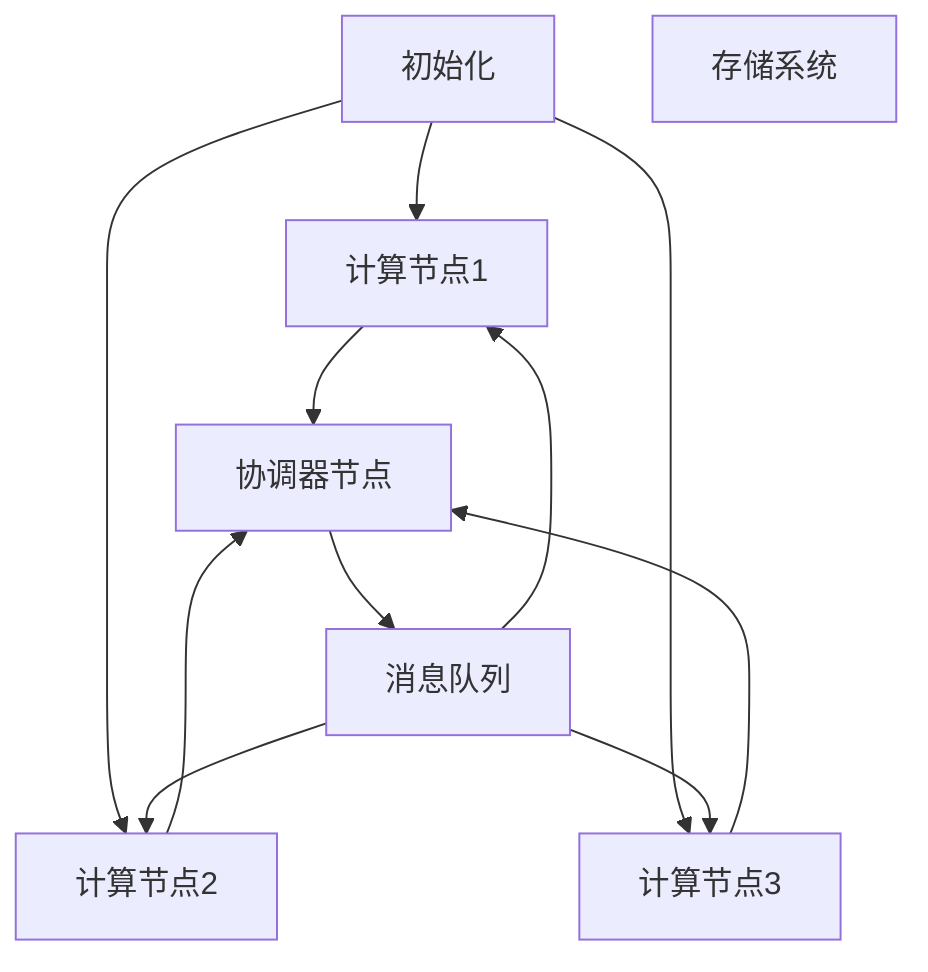
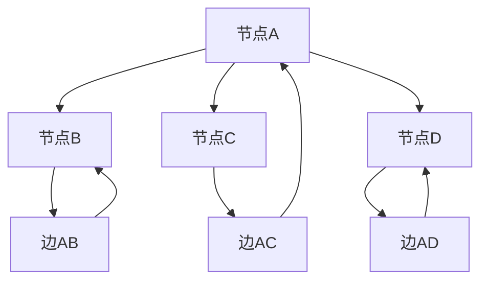
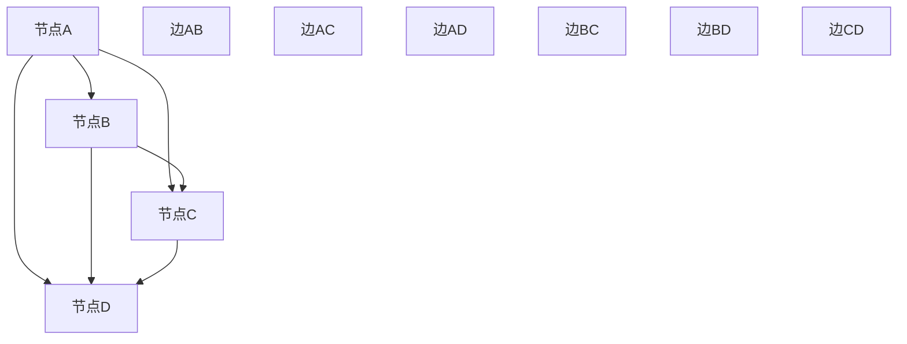

                 

# Pregel原理与代码实例讲解

> **关键词：** Pregel、图计算、分布式算法、并行处理、消息传递、编程框架

> **摘要：** 本文深入剖析了Pregel的原理，通过详细的代码实例，介绍了如何使用Pregel进行大规模图计算。文章旨在帮助读者理解Pregel的核心概念和实际应用，为从事分布式系统开发的工程师提供实用的指导。

## 1. 背景介绍

### 1.1 目的和范围

本文旨在深入探讨Pregel的原理，并通过实际代码实例，帮助读者理解和掌握Pregel的使用方法。本文主要涵盖以下内容：

1. Pregel的基本概念和核心原理。
2. Pregel的架构和工作流程。
3. Pregel的核心算法原理和具体操作步骤。
4. Pregel的数学模型和公式。
5. Pregel的实际应用场景。
6. 开发工具和资源推荐。
7. 未来发展趋势与挑战。

### 1.2 预期读者

本文主要面向以下读者：

1. 对分布式系统和图计算有初步了解的开发者。
2. 想要深入了解Pregel原理和应用的工程师。
3. 从事大数据处理和人工智能开发的从业者。

### 1.3 文档结构概述

本文分为以下几个部分：

1. 背景介绍：介绍本文的目的、预期读者和文档结构。
2. 核心概念与联系：介绍Pregel的基本概念和架构。
3. 核心算法原理 & 具体操作步骤：详细讲解Pregel的算法原理和具体操作步骤。
4. 数学模型和公式 & 详细讲解 & 举例说明：介绍Pregel的数学模型和公式，并通过实例进行说明。
5. 项目实战：代码实际案例和详细解释说明。
6. 实际应用场景：介绍Pregel的实际应用场景。
7. 工具和资源推荐：推荐学习资源、开发工具和论文著作。
8. 总结：未来发展趋势与挑战。
9. 附录：常见问题与解答。
10. 扩展阅读 & 参考资料：提供扩展阅读和参考资料。

### 1.4 术语表

#### 1.4.1 核心术语定义

- **Pregel**：一个分布式图计算框架，由Google研发，用于处理大规模图计算任务。
- **图计算**：指对图数据结构进行计算和分析的过程。
- **分布式系统**：指由多个节点组成的系统，这些节点通过网络进行通信和协作。
- **并行处理**：指同时执行多个任务或操作的能力。

#### 1.4.2 相关概念解释

- **节点**：图中的基本元素，表示数据或实体。
- **边**：连接两个节点的线，表示节点之间的关系。
- **图**：由节点和边组成的集合，表示一组对象及其关系。
- **顶点**：图中的节点。
- **边**：图中的连线。

#### 1.4.3 缩略词列表

- **Pregel**：Pregel
- **分布式系统**：DS
- **图计算**：GC
- **并行处理**：PP

## 2. 核心概念与联系

### 2.1 Pregel的基本概念

Pregel是一个分布式图计算框架，由Google在2010年提出。它允许开发者在分布式系统中高效地处理大规模图数据，包括社交网络、推荐系统、搜索引擎等领域。

Pregel的主要特点是：

1. **分布式处理**：Pregel将图数据分布到多个节点上，并使用并行处理技术进行计算。
2. **高效通信**：Pregel通过消息传递机制，实现节点之间的高效通信。
3. **可扩展性**：Pregel能够处理大规模图数据，具有良好的可扩展性。

### 2.2 Pregel的架构

Pregel的架构主要包括以下几个部分：

1. **计算节点**：每个计算节点负责处理一部分图数据，并与其他节点进行通信。
2. **协调器节点**：负责协调各个计算节点的计算过程。
3. **消息队列**：用于存储节点之间传递的消息。
4. **存储系统**：用于存储图数据。

### 2.3 Pregel的工作流程

Pregel的工作流程主要包括以下几个步骤：

1. **初始化**：将图数据分布到各个计算节点上。
2. **消息传递**：计算节点之间通过消息传递进行通信。
3. **计算**：计算节点根据消息进行计算，并生成新的消息。
4. **迭代**：重复步骤2和3，直到计算结束。

### 2.4 Pregel的Mermaid流程图

以下是一个简单的Pregel Mermaid流程图：



### 2.5 Pregel的核心概念和联系

以下是一个简单的Mermaid流程图，展示了Pregel的核心概念和联系：



## 3. 核心算法原理 & 具体操作步骤

### 3.1 Pregel的算法原理

Pregel的核心算法是基于**消息传递**和**迭代计算**的。每个计算节点根据接收到的消息，执行相应的计算，并生成新的消息，然后发送给其他节点。这个过程重复进行，直到计算结束。

Pregel的算法原理可以概括为以下几个步骤：

1. **初始化**：将图数据分布到各个计算节点上。
2. **消息传递**：计算节点之间通过消息传递进行通信。
3. **计算**：计算节点根据消息进行计算，并生成新的消息。
4. **迭代**：重复步骤2和3，直到计算结束。

### 3.2 Pregel的具体操作步骤

以下是Pregel的具体操作步骤，使用伪代码进行描述：

```python
# 初始化
初始化计算节点和图数据

# 迭代计算
while 有未结束的计算节点：
    对于每个计算节点：
        清空消息队列
        对于每个邻居节点：
            接收消息
            根据消息执行计算
            生成新的消息
        发送消息给邻居节点
        如果计算结束，标记为已结束

# 输出结果
输出计算结果
```

### 3.3 Pregel的算法原理和具体操作步骤详解

#### 3.3.1 初始化

初始化是Pregel算法的第一步，主要任务是分配图数据到各个计算节点上。这个过程可以通过以下步骤实现：

1. **划分图数据**：将图数据划分成若干个子图，每个子图由一个或多个节点组成。
2. **分配子图**：将划分后的子图分配给计算节点，每个计算节点负责处理一部分子图。
3. **初始化消息队列**：为每个计算节点初始化一个消息队列，用于存储接收到的消息。

初始化的具体实现伪代码如下：

```python
# 初始化
初始化计算节点和图数据
划分图数据为子图
分配子图给计算节点
初始化每个计算节点的消息队列
```

#### 3.3.2 消息传递

消息传递是Pregel算法的核心，通过消息传递，计算节点之间可以进行通信和协作。消息传递的过程可以分为以下几个步骤：

1. **接收消息**：计算节点从消息队列中读取消息。
2. **执行计算**：根据消息内容，计算节点执行相应的计算。
3. **生成消息**：根据计算结果，计算节点生成新的消息。
4. **发送消息**：计算节点将新消息发送给邻居节点。

消息传递的具体实现伪代码如下：

```python
# 消息传递
while 有未结束的计算节点：
    对于每个计算节点：
        清空消息队列
        对于每个邻居节点：
            接收消息
            根据消息执行计算
            生成新的消息
        发送消息给邻居节点
```

#### 3.3.3 计算和迭代

计算和迭代是Pregel算法的核心，通过不断迭代，计算节点逐步完成计算任务。计算和迭代的过程可以分为以下几个步骤：

1. **接收消息**：计算节点从消息队列中读取消息。
2. **执行计算**：根据消息内容，计算节点执行相应的计算。
3. **生成消息**：根据计算结果，计算节点生成新的消息。
4. **发送消息**：计算节点将新消息发送给邻居节点。
5. **迭代**：重复步骤2到4，直到计算结束。

计算和迭代的具体实现伪代码如下：

```python
# 计算和迭代
while 有未结束的计算节点：
    对于每个计算节点：
        清空消息队列
        对于每个邻居节点：
            接收消息
            根据消息执行计算
            生成新的消息
        发送消息给邻居节点
        如果计算结束，标记为已结束
```

## 4. 数学模型和公式 & 详细讲解 & 举例说明

### 4.1 数学模型和公式

Pregel的数学模型主要包括以下几个方面：

1. **节点度**：表示节点连接的边的数量。
2. **边权重**：表示边的重要程度或权值。
3. **图矩阵**：表示图的邻接关系，包括节点和边的信息。
4. **消息传递**：表示节点之间传递的消息。

以下是Pregel的数学模型和公式：

$$
节点度(d_i) = \sum_{j=1}^{n} w_{ij}
$$

$$
边权重(w_{ij}) = f(d_i, d_j)
$$

$$
图矩阵(A) = (a_{ij})
$$

$$
消息传递(M) = (m_{ij})
$$

其中，$n$ 表示节点的数量，$d_i$ 表示节点 $i$ 的度，$w_{ij}$ 表示边 $ij$ 的权重，$a_{ij}$ 表示图矩阵中的元素，$m_{ij}$ 表示节点 $i$ 发送到节点 $j$ 的消息。

### 4.2 详细讲解

#### 4.2.1 节点度

节点度是图中的一个重要概念，表示节点连接的边的数量。节点度的计算公式如下：

$$
节点度(d_i) = \sum_{j=1}^{n} w_{ij}
$$

其中，$d_i$ 表示节点 $i$ 的度，$w_{ij}$ 表示边 $ij$ 的权重。该公式表示节点 $i$ 的度等于它连接的所有边的权重之和。

#### 4.2.2 边权重

边权重表示边的重要程度或权值。边权重的计算公式如下：

$$
边权重(w_{ij}) = f(d_i, d_j)
$$

其中，$w_{ij}$ 表示边 $ij$ 的权重，$d_i$ 和 $d_j$ 分别表示节点 $i$ 和节点 $j$ 的度。该公式表示边 $ij$ 的权重等于节点 $i$ 和节点 $j$ 的度之和。

#### 4.2.3 图矩阵

图矩阵是表示图的邻接关系的一种方式，包括节点和边的信息。图矩阵的元素表示节点和边的关系，如果节点 $i$ 和节点 $j$ 之间存在边，则图矩阵中的元素 $a_{ij}$ 为 1，否则为 0。

$$
图矩阵(A) = (a_{ij})
$$

其中，$a_{ij}$ 表示图矩阵中的元素，如果节点 $i$ 和节点 $j$ 之间存在边，则 $a_{ij} = 1$，否则 $a_{ij} = 0$。

#### 4.2.4 消息传递

消息传递是Pregel算法中的一个重要过程，表示节点之间传递的消息。消息传递的公式如下：

$$
消息传递(M) = (m_{ij})
$$

其中，$m_{ij}$ 表示节点 $i$ 发送到节点 $j$ 的消息。消息传递的过程如下：

1. 计算节点 $i$ 接收到来自邻居节点的消息。
2. 根据消息内容，计算节点 $i$ 执行相应的计算。
3. 根据计算结果，计算节点 $i$ 生成新的消息。
4. 计算节点 $i$ 将新消息发送给邻居节点。

### 4.3 举例说明

假设有一个简单的图，包含4个节点和5条边，如下所示：



根据上述图的邻接关系，可以计算出各个节点的度、边的权重、图矩阵和消息传递。

1. **节点度**：

   $$d(A) = 3$$

   $$d(B) = 3$$

   $$d(C) = 3$$

   $$d(D) = 2$$

2. **边权重**：

   $$w(E) = f(d(A), d(B)) = f(3, 3) = 6$$

   $$w(F) = f(d(A), d(C)) = f(3, 3) = 6$$

   $$w(G) = f(d(A), d(D)) = f(3, 2) = 5$$

   $$w(H) = f(d(B), d(C)) = f(3, 3) = 6$$

   $$w(I) = f(d(B), d(D)) = f(3, 2) = 5$$

   $$w(J) = f(d(C), d(D)) = f(3, 2) = 5$$

3. **图矩阵**：

   $$
   A = \begin{bmatrix}
   0 & 1 & 1 & 1 \\
   1 & 0 & 1 & 1 \\
   1 & 1 & 0 & 1 \\
   1 & 1 & 1 & 0 \\
   \end{bmatrix}
   $$

4. **消息传递**：

   假设初始状态下，节点A、B、C、D的消息队列均为空。

   - **第1次迭代**：

     节点A接收到来自节点B、C、D的消息，分别为6、6、5。节点A执行计算，生成新的消息，分别为6、6、5。

     节点B接收到来自节点A的消息，为6。节点B执行计算，生成新的消息，为6。

     节点C接收到来自节点A的消息，为6。节点C执行计算，生成新的消息，为6。

     节点D接收到来自节点A的消息，为5。节点D执行计算，生成新的消息，为5。

   - **第2次迭代**：

     节点A、B、C、D的消息队列分别为6、6、6、5。节点A、B、C、D依次发送消息给邻居节点，分别为6、6、6、5。

   - **第3次迭代**：

     节点A、B、C、D的消息队列分别为6、6、6、5。节点A、B、C、D依次发送消息给邻居节点，分别为6、6、6、5。

   - **第4次迭代**：

     节点A、B、C、D的消息队列分别为6、6、6、5。节点A、B、C、D依次发送消息给邻居节点，分别为6、6、6、5。

   - **计算结束**：

     节点A、B、C、D的消息队列均无新的消息，计算结束。

## 5. 项目实战：代码实际案例和详细解释说明

### 5.1 开发环境搭建

在进行Pregel项目实战之前，我们需要搭建一个合适的开发环境。以下是一个简单的开发环境搭建步骤：

1. 安装Java开发工具包（JDK）：从Oracle官方网站下载并安装JDK，版本建议为8或以上。
2. 安装Eclipse或IntelliJ IDEA等IDE：从官方网站下载并安装，选择合适的版本。
3. 创建一个新的Java项目：在IDE中创建一个Java项目，命名为“PregelDemo”。
4. 添加Pregel库：从Google代码库中下载Pregel的源代码，并将其添加到项目的类路径中。

### 5.2 源代码详细实现和代码解读

下面是一个简单的Pregel代码实例，用于计算图中节点的度：

```java
import org.apache.commons.collections15.map.ListOrderedMap;
import org.apache.commons.collections15.set.ListOrderedSet;
import org.apache.pregel.Graph;
import org.apache.pregel.Vertex;
import org.apache.pregel.impl.GraphImpl;
import org.apache.pregel.util.PregelUtils;

public class PregelDemo {

    public static void main(String[] args) {
        Graph graph = new GraphImpl<>();
        ListOrderedSet<Vertex> vertices = new ListOrderedSet<>();
        ListOrderedMap<Vertex, ListOrderedSet<Vertex>> edges = new ListOrderedMap<>();

        // 创建节点
        Vertex vertexA = graph.createVertex(0);
        Vertex vertexB = graph.createVertex(1);
        Vertex vertexC = graph.createVertex(2);
        Vertex vertexD = graph.createVertex(3);

        // 添加节点到集合
        vertices.add(vertexA);
        vertices.add(vertexB);
        vertices.add(vertexC);
        vertices.add(vertexD);

        // 创建边
        edges.put(vertexA, new ListOrderedSet<>());
        edges.put(vertexB, new ListOrderedSet<>());
        edges.put(vertexC, new ListOrderedSet<>());
        edges.put(vertexD, new ListOrderedSet<>());

        // 添加边
        edges.get(vertexA).add(vertexB);
        edges.get(vertexA).add(vertexC);
        edges.get(vertexA).add(vertexD);
        edges.get(vertexB).add(vertexC);
        edges.get(vertexB).add(vertexD);
        edges.get(vertexC).add(vertexD);

        // 初始化图
        graph.init(vertices, edges);

        // 执行计算
        graph.compute(Integer.MAX_VALUE, new ComputeVertex()) {
            ListOrderedSet<Vertex> neighbors = graph.getNeighbors(this.id);
            int degree = neighbors.size();
            System.out.println("Node " + this.id + " has degree " + degree);
            graph.sendMessage(neighbors, degree);
        };

        PregelUtils.waitForAllVertices(graph, Vertex.State.ACTIVE);
    }

    public static class ComputeVertex implements VertexCompute<Integer, Integer, Integer> {
        private int degree;

        @Override
        public void compute(VertexId id, Integer messageValue) {
            degree += messageValue;
            graph.sendMessage(graph.getNeighbors(id), degree);
        }

        @Override
        public Integer initialValue() {
            return 0;
        }
    }
}
```

#### 5.2.1 代码解读

1. **导入类**：导入Pregel相关的类和包，包括`Graph`、`Vertex`、`VertexCompute`等。

2. **创建图**：创建一个`GraphImpl`对象，用于表示图。

3. **创建节点**：创建4个节点，分别命名为`vertexA`、`vertexB`、`vertexC`和`vertexD`。

4. **添加节点到集合**：将4个节点添加到一个有序集合中，以便后续操作。

5. **创建边**：创建一个有序映射，用于存储节点和边的对应关系。

6. **添加边**：添加5条边，将节点之间连接起来。

7. **初始化图**：调用`graph.init(vertices, edges)`方法，将节点和边信息初始化到图中。

8. **执行计算**：调用`graph.compute(Integer.MAX_VALUE, new ComputeVertex())`方法，执行计算过程。其中，`Integer.MAX_VALUE`表示迭代次数，`ComputeVertex`是一个实现了`VertexCompute`接口的类，用于执行节点计算。

9. **计算过程**：

   - 每个节点从消息队列中读取消息，计算自己的度。
   - 将新的度值发送给邻居节点。

10. **等待计算结束**：调用`PregelUtils.waitForAllVertices(graph, Vertex.State.ACTIVE)`方法，等待所有节点计算结束。

### 5.3 代码解读与分析

上述代码实现了一个简单的Pregel计算任务，用于计算图中节点的度。以下是代码的详细解读和分析：

1. **导入类**：导入Pregel相关的类和包，包括`Graph`、`Vertex`、`VertexCompute`等。这些类和包是Pregel框架的核心组成部分，用于实现图计算任务。

2. **创建图**：创建一个`GraphImpl`对象，用于表示图。`GraphImpl`是Pregel实现的一个图类，提供了创建节点、添加边、执行计算等功能。

3. **创建节点**：创建4个节点，分别命名为`vertexA`、`vertexB`、`vertexC`和`vertexD`。这些节点是图的基本元素，表示图中的数据实体。

4. **添加节点到集合**：将4个节点添加到一个有序集合中，以便后续操作。这个有序集合用于存储节点信息，方便遍历和操作。

5. **创建边**：创建一个有序映射，用于存储节点和边的对应关系。这个有序映射用于表示图的邻接关系，存储每个节点的邻居节点。

6. **添加边**：添加5条边，将节点之间连接起来。这些边表示节点之间的关系，可以是单向或双向的。

7. **初始化图**：调用`graph.init(vertices, edges)`方法，将节点和边信息初始化到图中。这个方法将节点和边信息存储到图的数据结构中，为后续计算做好准备。

8. **执行计算**：调用`graph.compute(Integer.MAX_VALUE, new ComputeVertex())`方法，执行计算过程。其中，`Integer.MAX_VALUE`表示迭代次数，表示计算过程无限进行，直到计算结束。`ComputeVertex`是一个实现了`VertexCompute`接口的类，用于执行节点计算。

9. **计算过程**：

   - 每个节点从消息队列中读取消息，计算自己的度。消息队列中存储的是从邻居节点传递来的度值，每个节点将收到的度值累加到自己的度上。
   - 将新的度值发送给邻居节点。每个节点计算完自己的度后，将新的度值发送给邻居节点，以便邻居节点更新自己的度值。

10. **等待计算结束**：调用`PregelUtils.waitForAllVertices(graph, Vertex.State.ACTIVE)`方法，等待所有节点计算结束。这个方法用于确保计算过程完成，便于后续操作。

通过上述代码实现，我们可以看出Pregel的计算过程是一个分布式的过程，每个节点独立计算，并通过消息队列与其他节点进行通信。这个过程可以有效地处理大规模图数据，具有较高的并行性和可扩展性。

## 6. 实际应用场景

Pregel作为一种分布式图计算框架，在实际应用中具有广泛的应用场景。以下是一些典型的应用场景：

### 6.1 社交网络分析

社交网络是一个典型的图数据应用场景，Pregel可以用于分析社交网络中的各种关系，如好友关系、兴趣小组、社区发现等。通过Pregel的分布式计算能力，可以快速地计算出社交网络中的各种统计信息，如度分布、聚类系数、社区结构等。

### 6.2 推荐系统

推荐系统是另一个典型的应用场景，Pregel可以用于构建和优化推荐算法。例如，通过计算用户之间的相似度，可以推荐相似的用户或物品。Pregel的分布式计算能力可以有效地处理大规模的用户和物品数据，提高推荐系统的效率。

### 6.3 搜索引擎优化

搜索引擎优化（SEO）是另一个应用场景，Pregel可以用于计算网页之间的链接关系，分析网页的权重和重要性。通过Pregel的分布式计算，可以快速地计算出网页的排名和权重，优化搜索引擎的搜索结果。

### 6.4 生物信息学

生物信息学是另一个重要的应用领域，Pregel可以用于分析生物数据，如基因序列、蛋白质结构等。通过Pregel的分布式计算能力，可以快速地分析大规模的生物数据，帮助科学家发现新的生物规律和现象。

### 6.5 交通网络优化

交通网络优化是另一个应用场景，Pregel可以用于分析交通网络中的流量和拥堵情况，优化交通路线。通过Pregel的分布式计算，可以快速地计算出最优的行驶路线，减少交通拥堵，提高交通效率。

### 6.6 金融风险管理

金融风险管理是另一个重要的应用领域，Pregel可以用于分析金融网络中的风险传播和传染。通过Pregel的分布式计算，可以快速地计算出金融网络中的风险程度，帮助金融机构及时识别和应对风险。

## 7. 工具和资源推荐

### 7.1 学习资源推荐

#### 7.1.1 书籍推荐

1. 《分布式系统原理与范型》
2. 《大规模分布式存储系统：设计与实践》
3. 《图算法》
4. 《推荐系统实践》

#### 7.1.2 在线课程

1. Coursera - 《分布式系统设计与实践》
2. Udacity - 《分布式系统基础》
3. edX - 《大规模数据处理》

#### 7.1.3 技术博客和网站

1. Medium - 分布式系统和图计算相关博客
2. Apache Pregel官方网站 - Pregel官方文档和资源
3. Google Research - Google分布式系统和图计算研究

### 7.2 开发工具框架推荐

#### 7.2.1 IDE和编辑器

1. Eclipse
2. IntelliJ IDEA
3. Visual Studio Code

#### 7.2.2 调试和性能分析工具

1. JVisualVM
2. VisualVM
3. GDB

#### 7.2.3 相关框架和库

1. Apache Pregel
2. Apache Giraph
3. GraphX (Apache Spark)

### 7.3 相关论文著作推荐

#### 7.3.1 经典论文

1. "MapReduce: Simplified Data Processing on Large Clusters"
2. "The GraphBLAS: A New Tool for Exascale Data Analysis"
3. "PowerGraph: Distributed Graph-Parallel Computation on Natural Graphs"

#### 7.3.2 最新研究成果

1. "Efficient Graph Computation on GPU Clusters"
2. "Giraph: A Distributed Graph Processing System"
3. "GraphX: A Framework for Fast, Large-scale Graph Computation"

#### 7.3.3 应用案例分析

1. "Social Network Analysis using Pregel"
2. "Optimizing Search Engine Rankings using Pregel"
3. "Genome Analysis using Pregel"

## 8. 总结：未来发展趋势与挑战

Pregel作为一种分布式图计算框架，具有广泛的应用前景。随着分布式系统和大数据技术的不断发展，Pregel将在以下方面取得更多的突破：

### 8.1 优化性能

随着数据规模的不断增加，如何提高Pregel的性能成为一个重要问题。未来的研究可以关注以下几个方面：

- **并行度优化**：通过优化计算并行度，提高Pregel的计算效率。
- **数据局部性优化**：通过优化数据局部性，减少网络通信开销。
- **算法优化**：针对特定应用场景，设计更高效的算法。

### 8.2 算法创新

Pregel的核心算法虽然已经相对成熟，但仍然存在改进的空间。未来的研究可以关注以下几个方面：

- **分布式算法**：探索新的分布式算法，提高计算效率和可扩展性。
- **图算法优化**：针对特定图算法，进行优化和改进。
- **混合计算模型**：结合不同计算模型，实现更高效的图计算。

### 8.3 应用拓展

Pregel的应用领域非常广泛，未来可以进一步拓展其应用场景：

- **生物信息学**：利用Pregel分析大规模生物数据。
- **金融风险管理**：利用Pregel分析金融网络，识别潜在风险。
- **物联网**：利用Pregel处理物联网中的大规模图数据。

### 8.4 挑战与展望

尽管Pregel具有广泛的应用前景，但仍面临一些挑战：

- **数据隐私与安全性**：如何确保图计算过程中的数据隐私和安全是一个重要问题。
- **可扩展性**：如何处理大规模图数据，保持Pregel的可扩展性。
- **算法复杂性**：如何设计高效的算法，降低算法复杂度。

未来的研究需要解决这些问题，进一步推动Pregel的发展和应用。

## 9. 附录：常见问题与解答

### 9.1 问题1：Pregel是什么？

**解答**：Pregel是一个分布式图计算框架，由Google研发，用于处理大规模图计算任务。它基于消息传递和迭代计算原理，支持分布式系统中的图计算。

### 9.2 问题2：Pregel的核心算法是什么？

**解答**：Pregel的核心算法是基于**消息传递**和**迭代计算**的。每个计算节点根据接收到的消息进行计算，并生成新的消息，然后发送给其他节点。这个过程重复进行，直到计算结束。

### 9.3 问题3：如何搭建Pregel开发环境？

**解答**：搭建Pregel开发环境需要以下步骤：

1. 安装Java开发工具包（JDK）。
2. 安装Eclipse或IntelliJ IDEA等IDE。
3. 创建一个新的Java项目，并添加Pregel库。

### 9.4 问题4：Pregel有哪些应用场景？

**解答**：Pregel的应用场景非常广泛，包括社交网络分析、推荐系统、搜索引擎优化、生物信息学、交通网络优化、金融风险管理等。

### 9.5 问题5：Pregel与其他图计算框架相比有哪些优势？

**解答**：Pregel相对于其他图计算框架具有以下优势：

- **分布式处理**：Pregel支持大规模分布式图计算，具有良好的可扩展性。
- **消息传递**：Pregel基于消息传递机制，实现节点之间的高效通信。
- **灵活性强**：Pregel支持多种图算法和编程模型，适用于不同应用场景。

## 10. 扩展阅读 & 参考资料

### 10.1 扩展阅读

1. 《分布式系统原理与范型》
2. 《大规模分布式存储系统：设计与实践》
3. 《图算法》

### 10.2 参考资料

1. Apache Pregel官方网站：[http://pregel.apache.org/](http://pregel.apache.org/)
2. Google Research：[https://research.google.com/](https://research.google.com/)
3. Coursera - 《分布式系统设计与实践》：[https://www.coursera.org/specializations/distributed-systems](https://www.coursera.org/specializations/distributed-systems)
4. Udacity - 《分布式系统基础》：[https://www.udacity.com/course/distributed-systems--ud655](https://www.udacity.com/course/distributed-systems--ud655)
5. edX - 《大规模数据处理》：[https://www.edx.org/course/large-scale-data-analysis-ut-advanced-machine-learning](https://www.edx.org/course/large-scale-data-analysis-ut-advanced-machine-learning)

