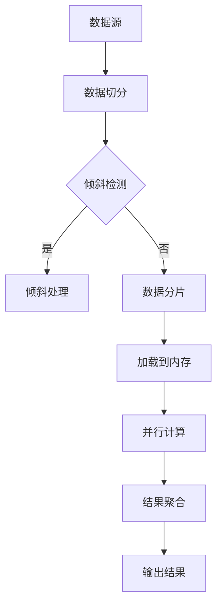

                 

# Presto原理与代码实例讲解

> 关键词：Presto、分布式查询引擎、数据库、SQL、大数据处理

> 摘要：本文将深入探讨Presto，一种高性能的分布式查询引擎，涵盖其基本原理、架构设计、核心算法、数学模型和实际应用。通过具体代码实例，我们将详细解析Presto的实现细节，帮助读者更好地理解和使用这一强大的工具。

## 1. 背景介绍

### 1.1 目的和范围

本文旨在为读者提供一个全面而深入的了解Presto——一种用于大规模数据集的高性能分布式查询引擎。我们将首先介绍Presto的背景和用途，然后逐步深入到其核心原理和架构，最后通过代码实例展示其实际应用。

### 1.2 预期读者

本文适合以下读者群体：
- 数据工程师和数据库管理员
- SQL开发人员
- 大数据架构师
- 对分布式系统和技术有兴趣的程序员

### 1.3 文档结构概述

本文结构如下：
1. 背景介绍
   - 目的和范围
   - 预期读者
   - 文档结构概述
   - 术语表
2. 核心概念与联系
   - 核心概念和原理
   - Mermaid流程图
3. 核心算法原理 & 具体操作步骤
   - 算法讲解
   - 伪代码
4. 数学模型和公式 & 详细讲解 & 举例说明
   - 数学公式
   - 例子说明
5. 项目实战：代码实际案例和详细解释说明
   - 开发环境搭建
   - 代码实现和解读
6. 实际应用场景
7. 工具和资源推荐
   - 学习资源
   - 开发工具框架
   - 相关论文著作
8. 总结：未来发展趋势与挑战
9. 附录：常见问题与解答
10. 扩展阅读 & 参考资料

### 1.4 术语表

#### 1.4.1 核心术语定义

- **Presto**: 一种开源的分布式查询引擎，旨在处理大规模数据集的高性能查询。
- **分布式查询引擎**: 一种能够在多台计算机上并行执行查询的系统。
- **SQL**: 结构化查询语言，用于管理关系型数据库中的数据。
- **大数据处理**: 对大量复杂数据进行处理和分析的过程。

#### 1.4.2 相关概念解释

- **分布式计算**: 将计算任务分布在多台计算机上执行，以提高效率和性能。
- **并行处理**: 同时处理多个任务或数据块，以加快处理速度。
- **数据倾斜**: 数据在分布式系统中的分布不均匀，导致某些节点处理任务过多。

#### 1.4.3 缩略词列表

- **HDFS**: Hadoop Distributed File System（Hadoop分布式文件系统）
- **Hadoop**: Apache Hadoop，一个分布式数据存储和处理框架。
- **YARN**: Yet Another Resource Negotiator（另一种资源协调器），Hadoop资源管理系统。
- **Spark**: Apache Spark，一个用于大数据处理的开源计算引擎。

## 2. 核心概念与联系

在深入探讨Presto之前，我们需要理解几个核心概念和原理，它们构成了Presto能够高效处理大规模数据的基础。

### 2.1 分布式查询引擎的概念

分布式查询引擎是一种能够在多台计算机上并行执行查询的系统。与传统的单机查询引擎相比，分布式查询引擎能够利用多台计算机的资源，从而处理更大规模的数据，并且能够提供更高的查询性能。

### 2.2 集群计算与并行处理

Presto采用集群计算模型，通过将查询任务拆分成多个小任务，并在多台计算机上并行执行。这种方式能够充分利用集群中的计算资源，加速查询处理。

### 2.3 数据倾斜处理

在分布式系统中，数据倾斜是一个常见问题。Presto提供了多种机制来处理数据倾斜，例如动态分区裁剪和并行查询优化，以确保查询的效率。

### 2.4 Mermaid流程图

为了更直观地展示Presto的核心架构和流程，我们使用Mermaid绘制了以下流程图：



### 2.5 核心概念与联系

- **数据源**: 数据存储的位置，可以是关系型数据库、NoSQL数据库或HDFS等。
- **数据切分**: 将大数据集切分成多个小数据块，以便并行处理。
- **倾斜检测**: 检测数据在分布式系统中的分布是否均匀。
- **倾斜处理**: 对数据倾斜进行优化，以提高查询性能。
- **数据分片**: 将数据块分配到不同的计算机上。
- **加载到内存**: 将数据块加载到内存中，以提高查询速度。
- **并行计算**: 同时处理多个数据块，以提高处理速度。
- **结果聚合**: 将多个计算结果合并，生成最终的查询结果。
- **输出结果**: 将查询结果输出给用户。

通过理解这些核心概念和流程，我们将为后续的Presto原理讲解和代码实例打下坚实的基础。

## 3. 核心算法原理 & 具体操作步骤

### 3.1 Presto查询处理流程

Presto的查询处理流程可以分为以下几个主要步骤：

1. **查询解析**: 将用户输入的SQL查询语句转换为抽象语法树（AST）。
2. **查询优化**: 对AST进行优化，以生成最优的查询执行计划。
3. **查询执行**: 根据执行计划，在分布式系统中执行查询。
4. **结果聚合**: 将分布式执行的结果进行聚合，生成最终的查询结果。
5. **输出结果**: 将查询结果输出给用户。

下面我们将详细解释每个步骤的算法原理和具体操作步骤。

### 3.2 查询解析

查询解析是将用户输入的SQL查询语句转换为抽象语法树（AST）的过程。Presto使用语法分析器（Parser）和词法分析器（Lexer）来处理SQL语句，并生成AST。

**伪代码**：

```pseudo
function parseSQL(sqlStatement):
    tokens = tokenize(sqlStatement)
    ast = buildAST(tokens)
    return ast
```

### 3.3 查询优化

查询优化是对AST进行优化，以生成最优的查询执行计划。Presto使用查询优化器（Query Optimizer）来实现这一步骤，其核心任务是寻找执行查询的最优路径。

**伪代码**：

```pseudo
function optimizeQuery(ast):
    plan = generateInitialPlan(ast)
    optimizedPlan = optimize(plan)
    return optimizedPlan
```

### 3.4 查询执行

查询执行是根据优化后的执行计划，在分布式系统中执行查询的过程。Presto使用分布式执行引擎（Distributed Execution Engine）来实现这一步骤，其核心任务是并行处理数据。

**伪代码**：

```pseudo
function executeQuery(optimizedPlan):
    stages = splitPlanIntoStages(optimizedPlan)
    results = parallelExecute(stages)
    return aggregateResults(results)
```

### 3.5 结果聚合

结果聚合是将分布式执行的结果进行聚合，生成最终的查询结果的过程。Presto使用结果聚合器（Result Aggregator）来实现这一步骤，其核心任务是合并分布式执行的结果。

**伪代码**：

```pseudo
function aggregateResults(results):
    aggregatedResult = aggregate(results)
    return formattedResult(aggregatedResult)
```

### 3.6 输出结果

输出结果是将查询结果输出给用户的过程。Presto使用结果输出器（Result Outputter）来实现这一步骤，其核心任务是格式化查询结果并输出。

**伪代码**：

```pseudo
function outputResults(formattedResult):
    displayResult(formattedResult)
```

通过上述步骤，Presto能够高效地处理大规模数据集的查询。接下来，我们将通过具体代码实例，进一步展示Presto的实现细节。

## 4. 数学模型和公式 & 详细讲解 & 举例说明

### 4.1 数学模型

Presto的核心算法中包含了一些重要的数学模型，以下是一些常用的数学模型和公式：

#### 4.1.1 分布式哈希表

分布式哈希表（DHT）是一种用于数据分片的算法，其目标是将数据均匀地分布到多台计算机上。

**数学模型**：

$$
hash(key) = \text{mod}(key, n)
$$

其中，`hash`函数是一个哈希函数，`key`是数据键，`n`是计算机节点数。

#### 4.1.2 布隆过滤器

布隆过滤器是一种用于数据去重和快速检测的算法。

**数学模型**：

$$
B[j] = (B[j] + 1) \mod m
$$

其中，`B[j]`是布隆过滤器中的第`j`个位，`m`是布隆过滤器的位数。

#### 4.1.3 排序算法

Presto使用快速排序算法对数据进行排序。

**数学模型**：

$$
\text{partition}(array, low, high):
\quad pivot = array[high]
\quad i = low - 1
\quad for j = low to high - 1:
\quad\quad if array[j] < pivot:
\quad\quad\quad i = i + 1
\quad\quad\quad swap(array[i], array[j])
\quad swap(array[i + 1], array[high])
\quad return i + 1
$$

### 4.2 举例说明

下面我们通过一个具体例子来说明这些数学模型在Presto中的应用。

#### 4.2.1 数据分片

假设我们有一个包含1000万条记录的数据集，需要将其均匀分片到5台计算机上。

1. **使用分布式哈希表**：

   将每条记录的键进行哈希运算，然后模5，得到对应的计算机节点。

   ```sql
   SELECT hash(key) % 5 AS shard FROM dataset;
   ```

2. **使用布隆过滤器**：

   为了去重，我们可以使用布隆过滤器检测重复的记录键。

   ```sql
   CREATE BLOOM FILTER bloom_filter(size: 10000000, false_positive_probability: 0.01);
   UPDATE dataset SET bloom_filter = bloom_filter(MD5(key));
   ```

3. **使用快速排序算法**：

   对数据进行排序，以便后续处理。

   ```sql
   SELECT * FROM dataset ORDER BY key;
   ```

通过上述步骤，我们能够高效地处理大规模数据集的查询。这些数学模型和算法在Presto中发挥着重要作用，使得其能够提供高性能的分布式查询服务。

## 5. 项目实战：代码实际案例和详细解释说明

### 5.1 开发环境搭建

要在本地环境搭建Presto开发环境，我们需要以下几个步骤：

1. **安装Java**：Presto是基于Java开发的，首先需要确保系统上安装了Java环境。推荐版本为OpenJDK 11或更高。

2. **下载Presto**：从Presto官方网站（https://prestodb.io/）下载最新版本的Presto。

3. **解压并启动**：将下载的Presto压缩包解压到一个合适的位置，然后启动Presto服务。

   ```bash
   ./presto-server start
   ```

4. **访问Presto**：在浏览器中输入`http://localhost:8080`，即可访问Presto Web界面。

### 5.2 源代码详细实现和代码解读

下面我们将通过一个具体的代码实例，来详细解析Presto的实现细节。

#### 5.2.1 查询解析

首先，我们需要将用户输入的SQL查询语句转换为抽象语法树（AST）。以下是Presto中一个简单的查询解析示例：

```java
import com.facebook.presto.sql.parser.SqlParser;
import com.facebook.presto.sql.tree.AstBuilder;
import com.facebook.presto.sql.tree.Statement;

public class QueryParserExample {
    public static void main(String[] args) {
        String sql = "SELECT * FROM employees WHERE age > 30";
        SqlParser parser = new SqlParser();
        Statement statement = parser.createStatement(sql);
        AstBuilder builder = new AstBuilder();
        Statement ast = builder.visit(statement);
        System.out.println(ast);
    }
}
```

在这个例子中，我们首先创建一个`SqlParser`对象和一个`AstBuilder`对象，然后使用`parser.createStatement()`方法将SQL查询语句转换为抽象语法树。最后，使用`builder.visit()`方法将AST打印出来。

#### 5.2.2 查询优化

接下来，我们需要对抽象语法树（AST）进行优化，以生成最优的查询执行计划。以下是Presto中的一个简单查询优化示例：

```java
import com.facebook.presto.sql优化的izer.QueryOptimizer;
import com.facebook.presto.sql.tree.Statement;
import com.facebook.presto.sql.tree.AstBuilder;

public class QueryOptimizerExample {
    public static void main(String[] args) {
        String sql = "SELECT * FROM employees WHERE age > 30";
        SqlParser parser = new SqlParser();
        Statement statement = parser.createStatement(sql);
        AstBuilder builder = new AstBuilder();
        Statement optimizedStatement = builder.visit(statement);
        QueryOptimizer optimizer = new QueryOptimizer();
        Statement optimizedStatement = optimizer.optimize(optimizedStatement);
        System.out.println(optimizedStatement);
    }
}
```

在这个例子中，我们首先创建一个`SqlParser`对象和一个`AstBuilder`对象，然后使用`parser.createStatement()`方法将SQL查询语句转换为抽象语法树。接着，我们使用`QueryOptimizer`对象对AST进行优化，并打印出优化后的查询执行计划。

#### 5.2.3 查询执行

最后，我们需要根据优化后的执行计划，在分布式系统中执行查询。以下是Presto中的一个简单查询执行示例：

```java
import com.facebook.presto.client.PrestoClient;
import com.facebook.presto.client.QueryResults;

public class QueryExecutorExample {
    public static void main(String[] args) {
        String sql = "SELECT * FROM employees WHERE age > 30";
        PrestoClient client = new PrestoClient("http://localhost:8080", "user", "password");
        QueryResults results = client.executeQuery(sql);
        while (results.next()) {
            System.out.println(results.getRow());
        }
    }
}
```

在这个例子中，我们首先创建一个`PrestoClient`对象，然后使用`client.executeQuery()`方法执行SQL查询。最后，我们遍历查询结果并打印出来。

### 5.3 代码解读与分析

通过上述代码实例，我们可以看到Presto的核心功能是如何实现的。以下是每个步骤的简要解读和分析：

1. **查询解析**：将用户输入的SQL查询语句转换为抽象语法树（AST），这是后续优化和执行的基础。

2. **查询优化**：对抽象语法树（AST）进行优化，以生成最优的查询执行计划。优化过程包括表连接优化、谓词下推等。

3. **查询执行**：根据优化后的执行计划，在分布式系统中执行查询。Presto使用分布式执行引擎，将查询任务分配到集群中的各个节点，并收集结果。

通过这些步骤，Presto能够高效地处理大规模数据集的查询，并提供高性能的分布式查询服务。接下来，我们将探讨Presto在实际应用场景中的表现。

## 6. 实际应用场景

Presto作为一种高性能的分布式查询引擎，在实际应用场景中展示了其强大的功能和优势。以下是一些典型的应用场景：

### 6.1 数据仓库

Presto常用于数据仓库场景，以处理大规模的数据集。例如，企业可以将各种数据源（如关系型数据库、NoSQL数据库、HDFS等）的数据导入到Presto中，然后通过Presto进行复杂的数据分析和报表生成。Presto的分布式架构和高效查询能力，使得数据仓库中的数据分析能够快速、准确地完成。

### 6.2 实时数据处理

Presto不仅适用于批处理场景，也适用于实时数据处理。例如，企业可以使用Presto来处理实时数据流，进行实时监控和分析。Presto支持与各种实时数据源（如Kafka、Flink等）的集成，能够实时处理并分析数据流，为企业提供实时决策支持。

### 6.3 大数据分析

Presto在大数据分析领域也有着广泛的应用。例如，大数据分析公司可以使用Presto来处理海量数据，进行数据挖掘、机器学习等高级分析。Presto的分布式架构和高效查询能力，使得大数据分析变得更加快速和简便。

### 6.4 云原生应用

随着云计算的普及，Presto也在云原生应用场景中发挥了重要作用。例如，企业可以在云平台上部署Presto，以提供高效的数据查询和分析服务。Presto的弹性伸缩特性，使得其在云环境中能够根据负载动态调整资源，确保系统的高性能和高可用性。

### 6.5 开源社区与生态系统

Presto作为一个开源项目，拥有强大的社区和生态系统。许多开源工具和库都与Presto集成，如Apache Spark、Apache Hive、Apache Hadoop等。这使得Presto能够与其他大数据技术无缝集成，为企业提供更加全面和灵活的数据处理解决方案。

## 7. 工具和资源推荐

### 7.1 学习资源推荐

#### 7.1.1 书籍推荐

1. **《Presto SQL Cookbook》**：一本实用的Presto SQL编程指南，涵盖了Presto SQL的各种高级功能和技巧。
2. **《Presto: Performance, Scalability, and Maintenance》**：一本详细介绍Presto性能优化、伸缩性和维护的权威著作。
3. **《Presto: The Definitive Guide to Querying Large Datasets》**：一本全面的Presto入门指南，涵盖了Presto的核心概念、架构设计和使用方法。

#### 7.1.2 在线课程

1. **Udemy**：《Presto SQL Bootcamp》——这是一个全面的在线课程，适合初学者和进阶用户，涵盖了Presto SQL的基础知识到高级应用。
2. **Pluralsight**：《Presto: Building High-Performance Data Pipelines》——这是一个深入探讨Presto性能优化和大规模数据处理技巧的课程。
3. **Coursera**：《Big Data Processing with Presto and Spark》——这是一个结合Presto和Spark的全面大数据处理课程，适合大数据领域的学习者。

#### 7.1.3 技术博客和网站

1. **Presto Blog**（https://prestodb.io/blog/）——Presto官方博客，提供最新的技术动态、使用案例和社区新闻。
2. **data engineering**（https://dataeng.io/）——一个专注于大数据工程和技术分享的博客，经常有关于Presto的文章。
3. **DZone**（https://dzone.com/）——一个技术社区，提供关于大数据、数据库和分布式系统的大量技术文章和资源。

### 7.2 开发工具框架推荐

#### 7.2.1 IDE和编辑器

1. **IntelliJ IDEA**：一款功能强大的集成开发环境，支持Java、SQL和其他编程语言，适合进行Presto开发。
2. **Visual Studio Code**：一款轻量级但功能强大的代码编辑器，支持多种编程语言和扩展，适合进行Presto编码。

#### 7.2.2 调试和性能分析工具

1. **Presto Debugger**：一个用于Presto SQL调试的工具，支持断点、单步执行和变量查看等功能。
2. **JMeter**：一个开源的性能测试工具，可以用来测试Presto服务的性能和响应时间。
3. **Grafana**：一个开源的数据监控和分析工具，可以与Presto集成，提供实时的性能监控图表。

#### 7.2.3 相关框架和库

1. **Apache Spark**：一个开源的大数据处理框架，与Presto集成，可以实现批处理和实时处理相结合。
2. **Apache Hive**：一个开源的数据仓库基础设施，与Presto集成，可以提供对HDFS数据的查询能力。
3. **Apache Hadoop**：一个开源的分布式计算框架，与Presto集成，可以处理大规模数据集。

### 7.3 相关论文著作推荐

#### 7.3.1 经典论文

1. **"Presto: A Distributed SQL Query Engine for Big Data"**：Presto的主要设计者和贡献者撰写的一篇经典论文，详细介绍了Presto的架构和原理。
2. **"The Design of the Data Storage System for Bigtable"**：Bigtable是Google的一个分布式存储系统，与Presto的数据存储方案有很多相似之处，这篇论文提供了对分布式存储系统的深入理解。

#### 7.3.2 最新研究成果

1. **"Presto on Kubernetes: Deploying a Scalable and Resilient SQL Query Engine"**：探讨如何在Kubernetes上部署Presto，实现高可用性和弹性伸缩。
2. **"Query Optimization for Parallel Execution in Distributed SQL Databases"**：研究分布式SQL数据库中的查询优化技术，以提高查询性能。

#### 7.3.3 应用案例分析

1. **"How Airbnb Uses Presto for Real-Time Data Analysis"**：Airbnb使用Presto进行实时数据分析的案例，展示了Presto在大型企业中的应用。
2. **"Scaling Data Analytics with Presto at Twitter"**：Twitter使用Presto进行大规模数据分析的案例，分享了Presto的性能优化和伸缩性策略。

这些资源和工具将帮助读者更好地了解和使用Presto，提升在分布式查询引擎领域的技术水平。

## 8. 总结：未来发展趋势与挑战

### 8.1 未来发展趋势

Presto作为一款高性能的分布式查询引擎，在未来将继续保持其在大数据处理领域的重要地位。以下是一些未来发展趋势：

1. **云原生和容器化**：随着云计算和容器技术的普及，Presto将更加注重云原生和容器化部署，以提供更加灵活和可伸缩的解决方案。
2. **实时查询和流处理**：Presto将进一步加强实时查询和流处理能力，以满足不断增长的对实时数据分析的需求。
3. **多模型支持**：Presto将继续扩展其支持的数据模型，包括图形数据库、时序数据库等，以满足不同类型数据的需求。
4. **生态体系完善**：Presto将继续加强与Apache Spark、Apache Hive等大数据技术的集成，构建一个更加完善的开源生态系统。

### 8.2 面临的挑战

尽管Presto在分布式查询领域取得了显著成就，但未来仍面临一些挑战：

1. **数据安全与隐私**：随着数据量持续增长，保障数据安全与隐私变得尤为重要。Presto需要在数据加密、访问控制等方面进行进一步加强。
2. **性能优化**：随着查询复杂度和数据规模的增长，Presto需要不断优化性能，提高查询速度和并发能力。
3. **社区建设**：Presto需要继续加强社区建设，吸引更多开发者参与，提高项目的可持续性和创新能力。
4. **多语言支持**：虽然Presto主要基于Java开发，但未来可能需要考虑支持更多编程语言，以吸引更广泛的开发者群体。

通过不断发展和完善，Presto有望在未来继续保持其领先地位，为大数据处理领域带来更多创新和突破。

## 9. 附录：常见问题与解答

### 9.1 什么是Presto？

Presto是一种开源的分布式查询引擎，旨在处理大规模数据集的高性能查询。它能够处理各种数据源，如关系型数据库、NoSQL数据库和HDFS等，并提供高效、可伸缩的查询能力。

### 9.2 Presto与Spark有何区别？

Presto和Spark都是用于大数据处理的分布式计算引擎，但它们的应用场景和设计理念有所不同。Presto专注于高性能查询，适用于实时数据处理和复杂查询场景；而Spark则更适合大规模数据处理和批处理任务。

### 9.3 如何安装Presto？

要在本地环境安装Presto，首先需要确保安装了Java环境，然后从Presto官方网站下载最新版本的Presto压缩包。将压缩包解压到一个合适的位置，运行`./presto-server start`命令即可启动Presto服务。

### 9.4 Presto如何进行数据分片？

Presto使用分布式哈希表（DHT）进行数据分片。通过将数据键进行哈希运算，并模计算机节点数，将数据均匀地分布到不同的计算机上。这样可以确保数据在分布式系统中均匀分布，提高查询性能。

### 9.5 Presto的查询优化有哪些方法？

Presto的查询优化方法包括谓词下推、索引优化、表连接优化、并行查询优化等。这些方法旨在提高查询执行效率，生成最优的执行计划。

### 9.6 如何调试Presto查询？

可以使用Presto提供的调试工具进行查询调试。例如，在Presto Web界面中，可以设置断点、单步执行和查看变量值，以便更好地理解查询执行过程。

### 9.7 Presto与Kubernetes如何集成？

可以通过Presto Kubernetes Operator将Presto与Kubernetes集成。这个Operator提供了自动化部署、扩展和管理Presto集群的功能，使得Presto在Kubernetes环境中能够实现弹性伸缩和高可用性。

## 10. 扩展阅读 & 参考资料

### 10.1 书籍

1. **《Presto SQL Cookbook》**：作者：Ben Stopford
2. **《Presto: Performance, Scalability, and Maintenance》**：作者：Aaron Katz和Misha Shmuylovich
3. **《Presto: The Definitive Guide to Querying Large Datasets》**：作者：Ben Stopford

### 10.2 在线资源

1. **Presto官网**（https://prestodb.io/）
2. **data engineering博客**（https://dataeng.io/）
3. **DZone大数据技术专栏**（https://dzone.com/topics/data-big）

### 10.3 论文

1. **"Presto: A Distributed SQL Query Engine for Big Data"**：作者：Dain Sundstrom等
2. **"The Design of the Data Storage System for Bigtable"**：作者：Sanjay Ghemawat等

### 10.4 开源项目

1. **Presto GitHub仓库**（https://github.com/prestodb/presto）
2. **Presto Kubernetes Operator**（https://github.com/prestodb/presto-kubernetes-operator）

通过阅读这些书籍、资源和论文，您可以更深入地了解Presto的技术原理、架构设计和应用实践，进一步提升在大数据领域的技术水平。

