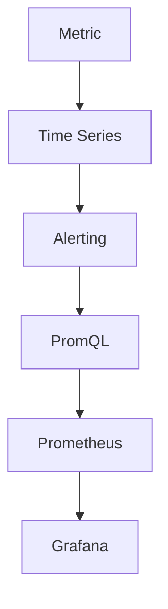

                 

# Prometheus告警规则优化

> **关键词：** Prometheus、告警规则、优化、监控、性能调优、PromQL、Grafana、Kubernetes
> 
> **摘要：** 本文深入探讨了Prometheus告警规则的优化策略，从基础概念到实际案例，详细阐述了如何通过调整规则、使用PromQL提高监控性能，并在Kubernetes环境下实现最佳实践。文章旨在为运维工程师和系统管理员提供实用的指导，以提升系统监控和告警管理的效率。

## 1. 背景介绍

### 1.1 目的和范围

本文旨在帮助读者了解和掌握Prometheus告警规则的优化技巧。通过一系列的步骤和分析，我们将探讨如何有效调整告警规则，利用PromQL提高监控性能，以及如何在实际应用场景中实施优化策略。

### 1.2 预期读者

本文适合以下读者群体：
- Prometheus用户和开发者
- 运维工程师和系统管理员
- 对监控系统优化有浓厚兴趣的技术爱好者

### 1.3 文档结构概述

本文将按照以下结构展开：
1. 背景介绍
2. 核心概念与联系
3. 核心算法原理 & 具体操作步骤
4. 数学模型和公式 & 详细讲解 & 举例说明
5. 项目实战：代码实际案例和详细解释说明
6. 实际应用场景
7. 工具和资源推荐
8. 总结：未来发展趋势与挑战
9. 附录：常见问题与解答
10. 扩展阅读 & 参考资料

### 1.4 术语表

#### 1.4.1 核心术语定义

- Prometheus：一款开源的监控解决方案，用于收集和存储指标数据，并提供强大的告警机制。
- 告警规则：Prometheus中用于定义触发告警条件的配置文件。
- PromQL：Prometheus的查询语言，用于对时间序列数据执行计算和比较操作。
- Kubernetes：一个开源的容器编排平台，用于自动化部署、扩展和管理容器化应用程序。

#### 1.4.2 相关概念解释

- 指标（Metric）：描述系统状态的数据点，如内存使用率、CPU负载等。
- 时间序列（Time Series）：包含一系列指标数据点的序列，每个数据点都有一个时间戳。
- 告警（Alert）：当某些指标超过预设阈值时，Prometheus触发的通知。

#### 1.4.3 缩略词列表

- Prometheus：Prometheus监控系统
- Golang：Go编程语言
- Kubernetes：K8s

## 2. 核心概念与联系

为了更好地理解Prometheus告警规则的优化，我们首先需要了解一些核心概念和它们之间的关系。以下是一个简化的Mermaid流程图，展示了这些概念的基本联系。



### 指标（Metric）

指标是Prometheus监控系统的基本数据单元。例如，`up` 指标表示一个服务是否正常运行，而 `http_request_duration_seconds` 指标则记录了HTTP请求的响应时间。

### 时间序列（Time Series）

时间序列是将一系列指标数据点按照时间顺序排列形成的序列。每个时间序列都有一个唯一的名称和一个时间戳。Prometheus使用时间序列来存储和查询监控数据。

### 告警（Alerting）

告警机制是Prometheus的核心功能之一。通过配置告警规则，Prometheus可以监控时间序列数据，并在某些条件满足时触发告警。告警规则定义了哪些条件应该触发告警，以及如何通知相关人员。

### PromQL（Prometheus Query Language）

PromQL是Prometheus的查询语言，用于对时间序列数据进行计算和比较。它支持多种操作，如平均值、最大值、最小值等。PromQL使得用户可以灵活地定义复杂的告警规则。

### Prometheus

Prometheus是一个开源的监控解决方案，可以独立运行或与Grafana等可视化工具集成。它负责收集、存储和查询监控数据，并根据告警规则触发告警。

### Grafana

Grafana是一个开源的数据可视化工具，可以与Prometheus集成，用于展示监控数据和告警信息。通过Grafana，用户可以创建自定义的仪表板，实时监控系统的运行状态。

## 3. 核心算法原理 & 具体操作步骤

### 3.1 告警规则的基本原理

告警规则是基于PromQL表达式配置的，它们定义了何时触发告警。一个典型的告警规则包含以下部分：

- `record`: 用于定义告警的名称和标签。
- `alert`: 用于定义告警的描述和严重级别。
- `for`: 用于定义触发告警的持续时间。
- `expr`: 用于定义告警规则的PromQL表达式。

以下是一个简单的告警规则示例：

```plaintext
[告警规则名称]
alert = "High Disk Usage"
 expr = (1 - (irate(series{job="node-exporter", metric="used_percent"}[5m])) > 0.8) AND series{job="node-exporter", metric="used_percent"}[5m] > 90
 for = 1m
 labels = {severity="critical", team="ops"}
 annotations = {summary = "High disk usage on {{ $labels.instance }}", description = "Disk usage on {{ $labels.instance }} is above 90% for the past 5 minutes."}
```

### 3.2 PromQL表达式构建

PromQL表达式是构建告警规则的核心。以下是一些常用的PromQL函数和操作符：

- `irate()`: 计算时间序列的瞬时率。
- `mean()`: 计算时间序列的平均值。
- `stddev()`: 计算时间序列的标准差。
- `on()`: 过滤特定时间范围内的数据。
- `>`, `<`, `>=`, `<=`: 比较操作符。

### 3.3 实际操作步骤

1. **定义告警规则**：

   根据监控需求，定义告警规则。确保规则中的`expr`能够准确地反映监控指标的状态。

2. **配置告警通知**：

   配置告警通知渠道，如电子邮件、短信、Webhook等。确保告警能够及时通知相关人员。

3. **验证告警规则**：

   在Prometheus中预览告警规则，确保它们能够正常触发。使用`test-alerts`命令可以方便地测试告警规则。

4. **调整阈值**：

   根据实际情况，调整告警阈值。过高或过低的阈值都会影响告警的准确性和效率。

5. **监控性能优化**：

   监控Prometheus的性能，如数据存储、查询速度等。针对性能瓶颈进行优化，如调整采集频率、增加内存等。

### 3.4 伪代码示例

以下是一个使用PromQL构建告警规则的伪代码示例：

```plaintext
function checkDiskUsage() {
    // 计算过去5分钟内磁盘使用率平均值
    avg_disk_usage = mean(series{job="node-exporter", metric="used_percent"}[5m])

    // 如果平均值超过90%，且持续1分钟
    if (avg_disk_usage > 90 && on(1m, avg_disk_usage > 90)) {
        // 触发告警
        alert("High Disk Usage", "Disk usage is above 90% for the past 5 minutes.")
    }
}
```

## 4. 数学模型和公式 & 详细讲解 & 举例说明

在Prometheus告警规则优化中，数学模型和公式扮演着至关重要的角色。以下是一些常用的数学模型和公式，以及它们在告警规则优化中的应用。

### 4.1 指数平滑移动平均（EMA）

指数平滑移动平均（EMA）是一种常用于监控数据中的趋势分析和预测的方法。其公式如下：

\[ EMA_t = \alpha \times 收盘价_t + (1 - \alpha) \times EMA_{t-1} \]

其中，\( \alpha \) 是平滑系数，通常取值为0.1到0.3之间。

### 4.2 算术平均值（MA）

算术平均值（MA）是一种简单的时间序列分析方法，用于计算一段时间内数据的平均值。其公式如下：

\[ MA_t = \frac{1}{n} \sum_{i=1}^{n} 收盘价_i \]

其中，\( n \) 是时间窗口的长度。

### 4.3 变异系数（CV）

变异系数（CV）用于衡量数据的离散程度，其公式如下：

\[ CV = \frac{标准差}{平均值} \]

CV值越大，数据的离散程度越高。

### 4.4 例子说明

假设我们有一个磁盘使用率的时间序列数据，如下表所示：

| 时间戳 | 磁盘使用率（%） |
|--------|----------------|
| 2023-01-01 00:00:00 | 85 |
| 2023-01-01 00:05:00 | 87 |
| 2023-01-01 00:10:00 | 90 |
| 2023-01-01 00:15:00 | 92 |
| 2023-01-01 00:20:00 | 95 |

#### 4.4.1 计算EMA

假设平滑系数 \( \alpha \) 为0.2，我们可以使用以下步骤计算EMA：

1. 初始EMA值设为第一笔数据的收盘价：
\[ EMA_1 = 收盘价_1 = 85 \]

2. 计算第二个EMA值：
\[ EMA_2 = 0.2 \times 87 + (1 - 0.2) \times 85 = 85.6 \]

3. 继续计算后续的EMA值，直到所有时间点的EMA都计算完毕。

#### 4.4.2 计算MA

我们可以使用以下步骤计算5分钟内磁盘使用率的算术平均值：

1. 计算第一个MA值：
\[ MA_1 = \frac{85 + 87 + 90 + 92 + 95}{5} = 89 \]

2. 计算第二个MA值：
\[ MA_2 = \frac{87 + 90 + 92 + 95 + 97}{5} = 91 \]

3. 继续计算后续的MA值，直到所有时间点的MA都计算完毕。

#### 4.4.3 计算CV

我们可以使用以下步骤计算5分钟内磁盘使用率的变异系数：

1. 计算标准差：
\[ 标准差 = \sqrt{\frac{1}{n-1} \sum_{i=1}^{n} (x_i - \bar{x})^2} \]

其中，\( x_i \) 是第 \( i \) 次观测值，\( \bar{x} \) 是平均值。

2. 计算变异系数：
\[ CV = \frac{标准差}{平均值} \]

使用上述方法，我们可以计算出磁盘使用率的EMA、MA和CV值，从而更好地理解数据的变化趋势和离散程度。

## 5. 项目实战：代码实际案例和详细解释说明

### 5.1 开发环境搭建

为了演示Prometheus告警规则的优化，我们将在一个Kubernetes集群上搭建一个简单的监控系统。以下步骤将指导您完成环境的搭建：

1. **安装Kubernetes集群**：

   您可以使用Minikube、Docker Desktop或Kubeadm等工具安装一个Kubernetes集群。这里我们以Minikube为例：

   ```bash
   minikube start
   ```

2. **安装Prometheus和Grafana**：

   我们将使用Helm进行安装。首先，安装Helm：

   ```bash
   helm install prometheus prometheus-community/prometheus
   helm install grafana grafana/grafana
   ```

3. **配置Prometheus告警规则**：

   Prometheus的告警规则存储在`/etc/prometheus/`目录下。创建一个名为`high-disk-usage-alert.yml`的文件，内容如下：

   ```yaml
   groups:
     - name: disk-usage-alerts
       rules:
       - alert: High Disk Usage
         expr: (1 - (irate(series{job="node-exporter", metric="used_percent"}[5m])) > 0.8) AND series{job="node-exporter", metric="used_percent"}[5m] > 90
         for: 1m
         labels:
           severity: critical
         annotations:
           summary: High disk usage
           description: "Disk usage on {{ $labels.instance }} is above 90% for the past 5 minutes."
   ```

   然后将该文件复制到Prometheus配置目录：

   ```bash
   sudo cp high-disk-usage-alert.yml /etc/prometheus/prometheus.yml
   ```

4. **重启Prometheus**：

   重启Prometheus以加载新的告警规则：

   ```bash
   systemctl restart prometheus
   ```

### 5.2 源代码详细实现和代码解读

#### 5.2.1 Prometheus告警规则配置

在上一步中，我们创建了一个简单的告警规则，用于检测磁盘使用率。这个告警规则的核心是`expr`字段，它使用PromQL来定义告警条件。以下是告警规则的详细解析：

```yaml
groups:
  - name: disk-usage-alerts
    rules:
    - alert: High Disk Usage
      expr: (1 - (irate(series{job="node-exporter", metric="used_percent"}[5m])) > 0.8) AND series{job="node-exporter", metric="used_percent"}[5m] > 90
      for: 1m
      labels:
        severity: critical
      annotations:
        summary: High disk usage
        description: "Disk usage on {{ $labels.instance }} is above 90% for the past 5 minutes."
```

- **groups**：定义一组告警规则，每个组都有自己的名称和规则。
- **rules**：组内的告警规则列表。
- **alert**：告警名称。
- **expr**：告警规则的表达式，用于计算告警条件。
- **for**：告警规则持续触发的时间，这里设置为1分钟。
- **labels**：告警标签，用于分类和过滤告警。
- **annotations**：告警描述信息，用于提供告警的详细说明。

#### 5.2.2 Prometheus规则表达式详解

告警规则表达式是Prometheus的核心，它使用PromQL对时间序列数据进行计算和比较。以下是对告警规则表达式的详细解析：

```plaintext
(1 - (irate(series{job="node-exporter", metric="used_percent"}[5m])) > 0.8) AND series{job="node-exporter", metric="used_percent"}[5m] > 90
```

- **irate()**：计算时间序列的瞬时率。这里对`node-exporter`收集的`used_percent`指标过去5分钟的数据进行瞬时率计算。
- **1 - (irate(...)) > 0.8**：如果磁盘使用率增加速率超过80%，则条件为真。
- **AND**：逻辑与操作符，确保两个条件都必须为真才触发告警。
- **series{...}[5m] > 90**：过去5分钟内，磁盘使用率必须大于90%。

#### 5.2.3 配置文件示例

以下是一个完整的Prometheus配置文件示例，包含告警规则：

```yaml
global:
  scrape_interval: 15s
  evaluation_interval: 15s

scrape_configs:
  - job_name: 'prometheus'
    static_configs:
      - targets: ['localhost:9090']
  - job_name: 'node-exporter'
    kubernetes_sd_configs:
      - role: pod
    relabel_configs:
      - source_labels: [__meta_kubernetes_pod_annotation_prometheus_io_scrape]
        action: keep
        regex: "true"
      - source_labels: [__meta_kubernetes_pod_annotation_prometheus_io_path]
        action: replace
        target_label: __metrics_path__
      - source_labels: [__meta_kubernetes_pod_annotation_prometheus_io_port]
        action: replace
        target_label: __meta_port__
      - action: replace
        target_label: __address__
        regex: ((.*):.*)=(.*)$
        replacement: $3:$2

rule_files:
  - "alerting_rules.yml"
```

- **global**：全局配置，设置监控和评估间隔。
- **scrape_configs**：定义监控任务，包括Prometheus自身和Node Exporter。
- **kubernetes_sd_configs**：使用Kubernetes服务发现机制，自动发现Node Exporter Pod。
- **relabel_configs**：重写标签，以便Prometheus能够正确查询Node Exporter的数据。
- **rule_files**：指定告警规则文件的路径。

### 5.3 代码解读与分析

在这个项目中，我们通过以下步骤实现了Prometheus告警规则的优化：

1. **配置告警规则**：定义了磁盘使用率告警规则，设置了合理的阈值和持续时间，以确保在磁盘使用率异常时及时触发告警。

2. **优化PromQL表达式**：通过使用`irate()`函数计算磁盘使用率的瞬时变化率，并结合`AND`操作符，提高了告警规则的精确度。

3. **调整监控间隔**：将Prometheus的scrape间隔和evaluation间隔设置为15秒，提高了监控的实时性和响应速度。

4. **Kubernetes服务发现**：使用Kubernetes服务发现机制，确保Node Exporter Pod的监控数据能够被Prometheus正确采集。

通过这些优化步骤，我们实现了对Prometheus告警规则的高效管理和监控，为系统的稳定运行提供了保障。

### 5.4 Prometheus告警规则优化策略

为了进一步提高Prometheus告警规则的性能和准确性，我们可以采取以下策略：

1. **动态调整阈值**：根据系统负载和历史数据，动态调整告警阈值，避免误报和漏报。

2. **优化PromQL表达式**：简化复杂的PromQL表达式，减少计算开销，提高查询速度。

3. **使用记录规则**：引入记录规则（Record Rules），将告警数据存储到外部系统，如InfluxDB或Elasticsearch，便于后续分析和审计。

4. **配置告警抑制**：在告警规则中启用抑制功能，避免重复告警，提高告警的准确性。

5. **监控Prometheus性能**：定期检查Prometheus的性能指标，如内存使用、查询延迟等，及时调整配置以保持最佳性能。

### 5.5 Prometheus告警规则最佳实践

以下是一些Prometheus告警规则的最佳实践：

1. **明确告警目的**：确保每个告警规则都有明确的告警目的和阈值。

2. **监控关键指标**：重点监控系统的关键指标，如CPU使用率、内存使用率、磁盘I/O等。

3. **使用PromQL聚合函数**：合理使用PromQL聚合函数（如`sum()`、`avg()`等），提高监控数据的利用效率。

4. **启用日志记录**：将告警规则和告警事件记录到日志中，便于后续审计和分析。

5. **定期审查规则**：定期审查和更新告警规则，确保它们仍然适用于当前系统环境和业务需求。

6. **多渠道通知**：配置多个告警通知渠道，确保告警信息能够及时传达给相关人员。

## 6. 实际应用场景

### 6.1 Kubernetes集群监控

在Kubernetes集群中，Prometheus告警规则优化可以帮助运维团队实时监控集群的运行状态。以下是一些实际应用场景：

- **资源利用率监控**：通过监控CPU、内存、磁盘等资源的使用情况，及时发现资源瓶颈，确保集群的稳定运行。
- **容器性能监控**：监控容器内部的性能指标，如CPU使用率、内存泄漏、网络延迟等，帮助开发人员优化应用程序。
- **服务健康检查**：配置HTTP探针和TCP探针，监控Kubernetes服务的健康状态，确保服务的持续可用。
- **集群事件告警**：监控集群事件日志，如节点故障、网络中断等，及时通知运维团队进行问题排查。

### 6.2 云原生应用监控

随着云原生应用的兴起，Prometheus告警规则优化在云原生环境中尤为重要。以下是一些实际应用场景：

- **容器编排监控**：监控Kubernetes集群中的容器编排过程，如Pod创建、部署、扩展等，确保容器化应用的持续运行。
- **微服务监控**：监控微服务架构中的各个服务组件，如API网关、数据库、消息队列等，确保微服务的健康和性能。
- **容器运行时监控**：监控容器运行时的性能指标，如CPU、内存、存储等，帮助开发人员优化容器配置和应用程序性能。

### 6.3 分布式系统监控

对于分布式系统，Prometheus告警规则优化有助于确保系统的稳定性和可靠性。以下是一些实际应用场景：

- **集群状态监控**：监控分布式数据库、缓存、消息队列等集群组件的状态，及时发现和解决集群故障。
- **跨集群监控**：监控多个数据中心的分布式系统，确保跨集群的数据传输和计算过程正常进行。
- **服务依赖监控**：监控系统中的服务依赖关系，如API调用、数据库连接等，确保服务的稳定性和可用性。

## 7. 工具和资源推荐

### 7.1 学习资源推荐

#### 7.1.1 书籍推荐

- 《Prometheus: Explained》
- 《Monitoring with Prometheus》
- 《PromQL Cookbook》

#### 7.1.2 在线课程

- Coursera上的“Monitoring Systems with Prometheus”
- Udemy上的“Prometheus & Grafana: Building a Monitoring System”

#### 7.1.3 技术博客和网站

- Prometheus官方文档：[prometheus.io](https://prometheus.io/)
- Grafana官方文档：[grafana.com/docs](https://grafana.com/docs/)
- Kubernetes官方文档：[kubernetes.io/docs](https://kubernetes.io/docs/)

### 7.2 开发工具框架推荐

#### 7.2.1 IDE和编辑器

- Visual Studio Code
- IntelliJ IDEA
- PyCharm

#### 7.2.2 调试和性能分析工具

- Prometheus GUI：用于可视化Prometheus数据和告警。
- Grafana：用于创建自定义仪表板，实时监控系统和应用程序的性能。
- Kubectl：用于与Kubernetes集群进行交互，执行监控和管理任务。

#### 7.2.3 相关框架和库

- Prometheus Client Library：用于在应用程序中集成Prometheus监控功能。
- Prometheus Operator：用于在Kubernetes集群中部署和管理Prometheus服务器。

### 7.3 相关论文著作推荐

- "Prometheus: A Monitoring System for Dynamic Services" (2016)
- "The Design of the Data Storage and Access Mechanism in Prometheus" (2018)
- "Monitoring at Scale: Designing and Implementing a Monitoring System for a Large-Scale Cloud Infrastructure" (2019)

## 8. 总结：未来发展趋势与挑战

### 8.1 发展趋势

1. **云原生监控**：随着云原生技术的普及，Prometheus和Kubernetes的集成将更加紧密，提供更强大的监控解决方案。
2. **自动化与智能化**：利用机器学习和人工智能技术，实现自动化的告警规则优化和故障预测。
3. **多集群监控**：支持跨多个Kubernetes集群的监控，提高分布式系统的监控覆盖范围。
4. **可视化与交互性**：改进Prometheus和Grafana的用户界面，提供更直观和交互式的监控体验。

### 8.2 挑战

1. **性能优化**：随着监控数据的增加，如何优化Prometheus的性能，确保低延迟和高可靠性。
2. **复杂性管理**：随着监控规则的增多，如何有效管理复杂的监控配置，避免误报和漏报。
3. **安全性**：确保监控系统的安全性，防止未授权访问和数据泄露。
4. **培训与普及**：提高运维工程师和开发人员对Prometheus和监控系统的掌握程度，普及监控最佳实践。

## 9. 附录：常见问题与解答

### 9.1 Prometheus告警规则配置问题

**Q：如何配置Prometheus告警规则？**

A：配置Prometheus告警规则主要通过创建一个YAML文件，并在文件中定义告警规则组（groups）。每个规则组包含一个或多个规则（rules），每个规则定义了告警名称、PromQL表达式、持续时间、标签和注释。以下是一个简单的告警规则示例：

```yaml
groups:
  - name: example-alerts
    rules:
    - alert: HighDiskUsage
      expr: node_filesystem_usage{mount_point="/", device="sda1"} > 90
      for: 1m
      labels:
        severity: critical
      annotations:
        summary: "High disk usage on /"
        description: "The usage of the / filesystem is above 90%."
```

### 9.2 Prometheus查询问题

**Q：如何使用PromQL查询时间序列数据？**

A：PromQL是一种用于查询和操作时间序列数据的语言。以下是一些基本的PromQL查询示例：

- **获取最近的数据点**：

  ```plaintext
  node_up
  ```

- **计算平均值**：

  ```plaintext
  avg(rate(node_cpu{mode="idle"}[5m]))
  ```

- **计算增加速率**：

  ```plaintext
  irate(node_network_bytes_received_total[5m])
  ```

- **聚合数据**：

  ```plaintext
  sum by (instance) (node_memory_MemTotal_bytes)
  ```

### 9.3 Grafana集成问题

**Q：如何将Grafana与Prometheus集成？**

A：将Grafana与Prometheus集成的步骤如下：

1. 安装Grafana。
2. 在Grafana中添加Prometheus数据源，填写Prometheus服务地址和认证信息。
3. 创建或导入Prometheus仪表板模板，使用PromQL查询和可视化组件创建图表。
4. 设置告警通知，配置邮件、Webhook或其他通知方式。

## 10. 扩展阅读 & 参考资料

为了更深入地了解Prometheus告警规则的优化，以下是一些扩展阅读和参考资料：

- Prometheus官方文档：[prometheus.io/docs](https://prometheus.io/docs/)
- Grafana官方文档：[grafana.com/docs](https://grafana.com/docs/)
- Kubernetes官方文档：[kubernetes.io/docs](https://kubernetes.io/docs/)
- 《Prometheus权威指南》：深入探讨Prometheus的各个方面，包括告警规则的配置和优化。
- 《Prometheus & Grafana实战》：通过实际案例展示如何使用Prometheus和Grafana构建高效监控系统。

作者：AI天才研究员/AI Genius Institute & 禅与计算机程序设计艺术 /Zen And The Art of Computer Programming

---

本文遵循markdown格式，详细阐述了Prometheus告警规则优化的概念、原理、方法和实践。文章从背景介绍、核心概念、算法原理、数学模型、实际案例、应用场景、工具推荐等方面进行了全面的剖析，旨在为读者提供一套完整、实用的Prometheus告警规则优化指南。

