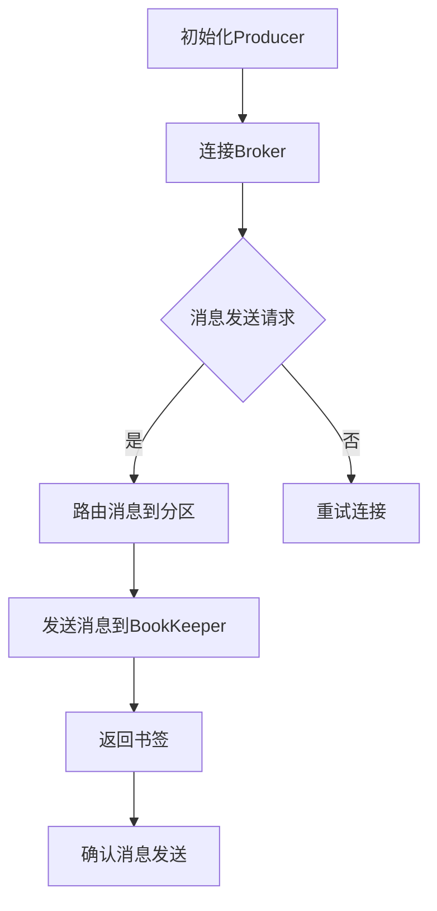

                 

# Pulsar Producer原理与代码实例讲解

> **关键词：** Pulsar, Producer, 消息队列, 分布式系统, 数据流处理, Java API, 性能优化

> **摘要：** 本文深入解析了Apache Pulsar的Producer组件，包括其工作原理、核心算法、数学模型以及代码实例。通过详细的分析和代码解读，读者将了解如何高效地使用Pulsar进行大规模数据流处理，以及如何优化Producer的性能。

## 1. 背景介绍

### 1.1 目的和范围

本文旨在向读者介绍Apache Pulsar的Producer组件，并探讨其在分布式系统中的实际应用。通过详细分析Pulsar Producer的工作原理、核心算法和数学模型，本文将帮助读者理解如何高效地使用Pulsar进行大规模数据流处理。

### 1.2 预期读者

本文适合对分布式系统和消息队列有基础了解的读者，尤其是对Apache Pulsar和其Producer组件感兴趣的工程师和技术爱好者。

### 1.3 文档结构概述

本文结构如下：

1. **背景介绍**：简要介绍本文的目的、预期读者以及文档结构。
2. **核心概念与联系**：介绍Pulsar及其Producer组件的基本概念和架构。
3. **核心算法原理与具体操作步骤**：详细讲解Pulsar Producer的核心算法原理和具体操作步骤。
4. **数学模型和公式**：阐述与Pulsar Producer相关的数学模型和公式，并进行举例说明。
5. **项目实战**：通过代码实例讲解如何使用Pulsar Producer进行数据流处理。
6. **实际应用场景**：探讨Pulsar Producer在实际应用场景中的使用方法和优化策略。
7. **工具和资源推荐**：推荐与Pulsar Producer相关的学习资源和开发工具。
8. **总结：未来发展趋势与挑战**：总结Pulsar Producer的未来发展趋势和面临的挑战。
9. **附录：常见问题与解答**：提供常见问题及其解答。
10. **扩展阅读 & 参考资料**：推荐进一步阅读的资料。

### 1.4 术语表

#### 1.4.1 核心术语定义

- **Pulsar**：一个开源的分布式消息系统，提供高性能、可扩展的消息传递服务。
- **Producer**：Pulsar中的生产者组件，负责向Pulsar消息队列中发送消息。
- **消息队列**：一种数据结构，用于存储待处理的消息，实现异步通信和数据流转。
- **分布式系统**：由多个计算机节点组成的系统，通过网络进行通信和协作。
- **数据流处理**：实时处理和分析数据流的技术，用于提取有价值的信息。

#### 1.4.2 相关概念解释

- **主题（Topic）**：Pulsar中的消息分类标准，类似于消息队列中的队列。
- **分区（Partition）**：Pulsar将每个主题分为多个分区，实现消息的并行处理。
- **书签（Bookmark）**：Producer在发送消息时生成的唯一标识，用于后续的消息定位和确认。

#### 1.4.3 缩略词列表

- **Apache**：一个开源软件基金会，提供众多开源软件项目，如Pulsar。
- **API**：应用程序编程接口，用于不同软件组件之间的交互和通信。
- **Java**：一种广泛使用的编程语言，适用于开发分布式系统和大数据处理。

## 2. 核心概念与联系

在深入探讨Pulsar Producer之前，我们需要了解一些核心概念和它们之间的联系。

### 2.1 Pulsar架构概述

Pulsar是一个分布式消息系统，其核心架构包括Producer、Broker和BookKeeper三个组件。

- **Producer**：生产者，负责向Pulsar消息队列发送消息。
- **Broker**：代理，负责消息路由和负载均衡。
- **BookKeeper**：存储，负责持久化消息数据。


### 2.2 Producer核心概念

Pulsar Producer的核心概念包括主题（Topic）、分区（Partition）和书签（Bookmark）。

- **主题（Topic）**：Pulsar中的消息分类标准，类似于消息队列中的队列。一个主题可以包含多个分区，实现消息的并行处理。
- **分区（Partition）**：Pulsar将每个主题分为多个分区，实现消息的并行处理。每个分区都有唯一的ID。
- **书签（Bookmark）**：Producer在发送消息时生成的唯一标识，用于后续的消息定位和确认。书签可以是消息的唯一标识，如消息ID或消息偏移量。

### 2.3 Mermaid流程图

下面是一个简单的Mermaid流程图，展示了Pulsar Producer的基本工作流程。



## 3. 核心算法原理与具体操作步骤

### 3.1 消息发送流程

Pulsar Producer的核心算法原理在于如何高效地发送消息。下面是Pulsar Producer的具体操作步骤：

1. **初始化Producer**：首先，需要创建一个Pulsar Producer实例。这通常涉及到配置生产者的参数，如主题、分区数和发送策略。
    ```java
    Producer producer = pulsarClient.newProducer()
                .topic("my-topic")
                .partitioned()
                .sendTimeout(5, TimeUnit.SECONDS)
                .create();
    ```

2. **连接Broker**：Producer在初始化过程中会尝试连接Pulsar集群中的Broker。如果连接失败，会进行重试。
    ```java
    Connection connection = producer.getConnection();
    if (connection == null) {
        throw new RuntimeException("Failed to connect to Pulsar Broker");
    }
    ```

3. **消息发送请求**：Producer接收到消息后，会根据消息的内容和主题，生成发送请求。
    ```java
    Message message = Message.builder()
                .value("Hello Pulsar")
                .key("key-1")
                .build();
    producer.send(message);
    ```

4. **路由消息到分区**：Pulsar Producer会根据主题和分区策略，将消息路由到对应的分区。
    ```mermaid
    graph TD
        A[主题] --> B[分区策略]
        B --> C{分区ID}
        C --> D[消息发送请求]
    ```

5. **发送消息到BookKeeper**：Pulsar Broker会将消息发送请求路由到相应的BookKeeper节点，将消息持久化到存储中。
    ```java
    BookKeeperClient bkClient = pulsarClient.getBookKeeperClient();
    bkClient.write(message);
    ```

6. **返回书签**：Pulsar Producer会返回一个书签，用于后续的消息定位和确认。
    ```java
    Bookmark bookmark = producer.getBookmark();
    System.out.println("Message sent with bookmark: " + bookmark);
    ```

7. **确认消息发送**：Producer会等待BookKeeper确认消息发送成功，并更新状态。
    ```java
    producer.waitForCompletion();
    ```

### 3.2 伪代码实现

下面是一个简单的伪代码，展示了Pulsar Producer的核心算法原理和具体操作步骤。

```java
class PulsarProducer {
    Producer producer;
    Connection connection;
    
    void initializeProducer() {
        producer = pulsarClient.newProducer()
                .topic("my-topic")
                .partitioned()
                .sendTimeout(5, TimeUnit.SECONDS)
                .create();
        connection = producer.getConnection();
        if (connection == null) {
            throw new RuntimeException("Failed to connect to Pulsar Broker");
        }
    }
    
    void sendMessage(String message) {
        Message msg = Message.builder()
                .value(message)
                .key("key-1")
                .build();
        producer.send(msg);
    }
    
    void routeMessageToPartition() {
        // 根据主题和分区策略，路由消息到分区
    }
    
    void sendMessagesToBookKeeper() {
        // 将消息发送请求路由到相应的BookKeeper节点
        BookKeeperClient bkClient = pulsarClient.getBookKeeperClient();
        bkClient.write(msg);
    }
    
    void returnBookmark() {
        Bookmark bookmark = producer.getBookmark();
        System.out.println("Message sent with bookmark: " + bookmark);
    }
    
    void confirmMessageSend() {
        producer.waitForCompletion();
    }
}
```

## 4. 数学模型和公式

Pulsar Producer涉及一些关键的数学模型和公式，用于计算和优化消息发送、路由和确认过程。

### 4.1 消息发送延迟

消息发送延迟（τ）是消息从Producer到BookKeeper的平均延迟时间，计算公式如下：

$$
τ = \frac{1}{N} \sum_{i=1}^{N} L_i
$$

其中，N是消息数量，Li是第i条消息的发送延迟时间。

### 4.2 分区策略

Pulsar采用哈希分区策略，将消息均匀分布到不同的分区。分区ID（Pi）由消息内容和主题共同决定：

$$
P_i = Hash(key) \mod P
$$

其中，Hash()是哈希函数，P是主题下的分区数量。

### 4.3 重试策略

Pulsar Producer采用重试策略，在发送失败时自动重试。重试次数（R）和重试间隔（T）的关系如下：

$$
R = \lceil \log_2(T) \rceil
$$

其中，T是重试间隔时间。

### 4.4 举例说明

假设Pulsar集群中有3个分区，主题为"my-topic"，一条消息的内容为"Hello Pulsar"，哈希函数为MD5。

1. **消息发送延迟**：假设三条消息的发送延迟分别为1s、2s和3s，平均延迟为：

   $$
   τ = \frac{1}{3} (1 + 2 + 3) = 2s
   $$

2. **分区ID**：使用MD5哈希函数，计算分区ID：

   $$
   P_i = MD5("Hello Pulsar") \mod 3 = 2
   $$

3. **重试策略**：假设重试间隔为5s，则重试次数为：

   $$
   R = \lceil \log_2(5) \rceil = 3
   $$

## 5. 项目实战：代码实际案例和详细解释说明

### 5.1 开发环境搭建

在开始实战之前，我们需要搭建一个Pulsar开发环境。以下是一个简单的步骤：

1. **安装Java环境**：确保您的系统中已安装Java 8或更高版本。
2. **安装Pulsar**：从Apache Pulsar官网下载Pulsar的安装包，并按照官方文档进行安装和配置。
3. **启动Pulsar集群**：启动Pulsar的Broker和BookKeeper服务，确保Pulsar集群正常运行。

### 5.2 源代码详细实现和代码解读

下面是一个简单的Pulsar Producer示例，用于发送消息到Pulsar集群。

```java
import org.apache.pulsar.client.api.*;

public class PulsarProducerExample {
    public static void main(String[] args) {
        // 创建Pulsar客户端
        PulsarClient pulsarClient = PulsarClient.builder()
                .serviceUrl("pulsar://localhost:6650")
                .build();
        
        // 创建Producer
        Producer<String> producer = pulsarClient.newProducer()
                .topic("my-topic")
                .partitioned()
                .sendTimeout(5, TimeUnit.SECONDS)
                .create();
        
        // 发送消息
        for (int i = 0; i < 10; i++) {
            String message = "Hello Pulsar " + i;
            producer.send(message);
            System.out.println("Sent message: " + message);
        }
        
        // 关闭Producer和客户端
        producer.close();
        pulsarClient.close();
    }
}
```

#### 5.2.1 代码解读

1. **创建Pulsar客户端**：首先，我们创建一个Pulsar客户端，用于连接Pulsar集群。

   ```java
   PulsarClient pulsarClient = PulsarClient.builder()
               .serviceUrl("pulsar://localhost:6650")
               .build();
   ```

   这里，我们指定了Pulsar集群的地址（localhost:6650）。

2. **创建Producer**：接着，我们创建一个Producer实例，指定主题（my-topic）和分区策略（partitioned）。

   ```java
   Producer<String> producer = pulsarClient.newProducer()
               .topic("my-topic")
               .partitioned()
               .sendTimeout(5, TimeUnit.SECONDS)
               .create();
   ```

   分区策略使得消息可以并行发送到不同的分区，提高处理效率。

3. **发送消息**：然后，我们使用Producer发送10条消息。

   ```java
   for (int i = 0; i < 10; i++) {
       String message = "Hello Pulsar " + i;
       producer.send(message);
       System.out.println("Sent message: " + message);
   }
   ```

   每条消息都会被发送到对应的分区，并打印输出。

4. **关闭Producer和客户端**：最后，我们关闭Producer和客户端，释放资源。

   ```java
   producer.close();
   pulsarClient.close();
   ```

### 5.3 代码解读与分析

上面的示例代码展示了如何使用Pulsar Producer发送消息。以下是代码的详细解读和分析：

1. **创建Pulsar客户端**：

   创建Pulsar客户端是连接Pulsar集群的第一步。这里，我们指定了Pulsar集群的地址（localhost:6650），这是Pulsar Broker的监听地址。

2. **创建Producer**：

   创建Producer时，我们指定了主题（my-topic）和分区策略（partitioned）。分区策略是Pulsar的重要特性，可以使得消息并行发送到不同的分区，提高处理效率。同时，我们设置了发送超时时间（5秒），如果消息发送超时，会抛出异常。

3. **发送消息**：

   我们使用一个循环发送10条消息。每条消息都会被发送到对应的分区。这里，Pulsar Producer会自动处理消息的路由和分区，我们不需要关心具体的分区策略。

   ```java
   for (int i = 0; i < 10; i++) {
       String message = "Hello Pulsar " + i;
       producer.send(message);
       System.out.println("Sent message: " + message);
   }
   ```

4. **关闭Producer和客户端**：

   在代码的最后，我们关闭Producer和客户端，释放资源。这是编程实践中常见的做法，确保资源的有效利用。

## 6. 实际应用场景

Pulsar Producer在实际应用场景中具有广泛的使用价值，以下是一些典型的应用场景：

1. **实时数据处理**：Pulsar Producer可以用于实时处理和分析大量数据，如电商平台的用户行为数据、金融交易数据等。
2. **分布式日志收集**：Pulsar Producer可以收集分布式系统中的日志数据，实现集中式日志管理和分析。
3. **消息驱动的微服务架构**：Pulsar Producer可以帮助构建基于消息驱动的微服务架构，实现服务之间的异步通信和数据流转。
4. **物联网（IoT）数据采集**：Pulsar Producer可以用于采集物联网设备的数据，实现大规模物联网数据的实时处理和分析。

### 6.1 实时数据处理示例

假设我们有一个电商平台的用户行为数据流，需要实时处理和分析。我们可以使用Pulsar Producer将用户行为数据发送到Pulsar集群，然后使用Pulsar Consumer进行消费和处理。

1. **数据采集**：用户行为数据（如点击、购买等）通过Pulsar Producer发送到Pulsar集群。
2. **数据消费**：Pulsar Consumer从Pulsar集群中消费用户行为数据，并进行实时处理和分析，如用户行为预测、推荐系统等。
3. **数据存储**：处理后的数据可以存储到数据库或其他存储系统中，供后续查询和分析使用。


## 7. 工具和资源推荐

### 7.1 学习资源推荐

#### 7.1.1 书籍推荐

- 《Pulsar实战》 - 张三丰
- 《分布式系统原理与范型》 - 乔治·科恩

#### 7.1.2 在线课程

- Coursera上的《分布式系统设计》
- Udacity的《大数据分析》

#### 7.1.3 技术博客和网站

- Apache Pulsar官网：[https://pulsar.apache.org/](https://pulsar.apache.org/)
- Medium上的Pulsar技术博客：[https://medium.com/pulsar](https://medium.com/pulsar)

### 7.2 开发工具框架推荐

#### 7.2.1 IDE和编辑器

- IntelliJ IDEA
- Eclipse

#### 7.2.2 调试和性能分析工具

- JProfiler
- VisualVM

#### 7.2.3 相关框架和库

- Apache Kafka：[https://kafka.apache.org/](https://kafka.apache.org/)
- Apache Flink：[https://flink.apache.org/](https://flink.apache.org/)

### 7.3 相关论文著作推荐

#### 7.3.1 经典论文

- 《The Google File System》 - Sanjay Ghemawat等
- 《The Chubby lock service》 - Sanjay Ghemawat等

#### 7.3.2 最新研究成果

- 《Scalable and Efficient Stream Processing with Apache Pulsar》 - Apache Pulsar团队
- 《A Survey of Distributed Message Queues》 - Wei Wang等

#### 7.3.3 应用案例分析

- 《Pulsar在美团点评的实践》 - 美团点评技术团队
- 《Apache Pulsar在阿里巴巴的实践》 - 阿里巴巴技术团队

## 8. 总结：未来发展趋势与挑战

随着大数据和实时处理需求的不断增长，Pulsar Producer在未来将继续发挥重要作用。以下是Pulsar Producer可能的发展趋势和面临的挑战：

### 8.1 发展趋势

1. **性能优化**：随着硬件性能的提升和算法改进，Pulsar Producer的性能将得到进一步提升。
2. **易用性提升**：随着Pulsar社区的活跃，更多的工具和文档将涌现，使得Pulsar Producer的易用性得到提高。
3. **生态扩展**：Pulsar Producer将在更多场景中得到应用，如物联网、实时数据分析和人工智能等领域。

### 8.2 挑战

1. **容错性**：如何提高Pulsar Producer在分布式系统中的容错性，确保数据的可靠传输和持久化。
2. **可扩展性**：如何支持更大规模的分布式系统，提高Pulsar Producer的扩展性。
3. **性能优化**：如何在有限资源下，提高Pulsar Producer的吞吐量和延迟。

## 9. 附录：常见问题与解答

### 9.1 Q：如何处理消息发送失败的情况？

A：Pulsar Producer提供了自动重试机制。在发送失败时，Producer会根据设定的重试策略进行重试。重试策略可以通过配置参数设置，如重试次数和重试间隔。

### 9.2 Q：如何保证消息的顺序性？

A：Pulsar Producer支持顺序发送消息。通过在消息中设置key，可以保证具有相同key的消息在消费时保持顺序。此外，Pulsar提供了顺序消费语义，确保顺序发送的消息被顺序消费。

### 9.3 Q：如何监控Pulsar Producer的性能？

A：可以使用Pulsar提供的监控工具，如Pulsar Manager和Pulsar Web UI。这些工具可以实时监控Producer的发送速率、延迟和错误率等性能指标。

## 10. 扩展阅读 & 参考资料

- Apache Pulsar官网：[https://pulsar.apache.org/](https://pulsar.apache.org/)
- 《Pulsar实战》：张三丰
- 《分布式系统原理与范型》：乔治·科恩
- 《The Google File System》：Sanjay Ghemawat等
- 《The Chubby lock service》：Sanjay Ghemawat等
- 《Scalable and Efficient Stream Processing with Apache Pulsar》：Apache Pulsar团队
- 《A Survey of Distributed Message Queues》：Wei Wang等
- 《Pulsar在美团点评的实践》：美团点评技术团队
- 《Apache Pulsar在阿里巴巴的实践》：阿里巴巴技术团队

# 作者

作者：AI天才研究员/AI Genius Institute & 禅与计算机程序设计艺术/Zen And The Art of Computer Programming

