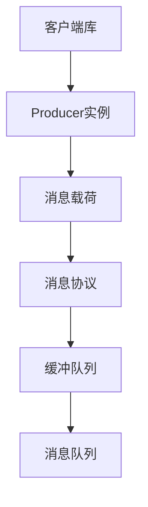

                 

# Pulsar Producer原理与代码实例讲解

## 关键词

分布式消息队列，Apache Pulsar，Producer，消息发布，消息中间件，消息传输，并发控制，数据可靠性

## 摘要

本文将深入讲解Apache Pulsar的Producer原理，通过详细的分析和代码实例，帮助读者理解Producer的核心机制、操作步骤以及如何在实际项目中应用。我们将从背景介绍、核心概念与联系、核心算法原理、数学模型和公式、项目实战、实际应用场景等方面，系统性地探讨Pulsar Producer的工作原理和实践方法。

## 1. 背景介绍

### Apache Pulsar概述

Apache Pulsar是一个分布式、可扩展的消息系统，最初由Yahoo!公司开发，并于2016年成为Apache基金会的一个孵化项目，现已成为一个成熟的开源消息中间件。Pulsar具有以下特点：

- **发布-订阅模型**：支持发布-订阅和点对点消息模型，使得消息的传递更加灵活。
- **高扩展性**：基于无状态服务架构，可以水平扩展到数千个节点。
- **高性能**：提供低延迟的消息传输，适合大规模数据流处理。
- **可靠性**：通过复制和持久化机制，确保消息的可靠传输和持久存储。

### Producer在消息系统中的角色

Producer是消息系统中的一个重要组件，负责将消息发送到消息队列中。在分布式系统中，Producer通常需要处理以下问题：

- **并发控制**：确保多个Producer同时发送消息时不会产生冲突。
- **消息序列化**：将业务数据转换成消息系统可以识别的格式。
- **可靠性保证**：在发送消息时确保数据不丢失。

Apache Pulsar的Producer正是为了解决这些问题而设计的，通过提供一系列高级功能和灵活的配置选项，使得开发者能够轻松地集成和使用消息系统。

## 2. 核心概念与联系

### Producer架构

为了更好地理解Pulsar Producer的原理，我们首先需要了解其架构。Pulsar的Producer主要由以下几个部分组成：

- **Client Library**：客户端库，用于与Pulsar集群进行通信。
- **Producer Instance**：每个Producer实例对应一个消息发布者，负责发送消息。
- **Message Payload**：消息载荷，即需要发送的业务数据。
- **Message Protocol**：消息协议，定义消息的格式和传输方式。
- **Backlog Queue**：缓冲队列，用于暂存未发送的消息。

### Mermaid流程图



### 核心概念联系

- **客户端库**与**消息队列**（Kafka）之间通过**消息协议**进行通信，实现消息的发送和接收。
- **Producer实例**负责处理具体的消息发送操作，通过**缓冲队列**暂存未发送的消息。
- **消息载荷**是业务数据的载体，经过**消息协议**处理后发送到消息队列。

### 关键术语解释

- **Producer Instance**：每个消息发布者对应一个Producer实例。
- **Message Payload**：消息载荷，即业务数据。
- **Message Protocol**：消息协议，定义消息的格式和传输方式。
- **Backlog Queue**：缓冲队列，用于暂存未发送的消息。

## 3. 核心算法原理 & 具体操作步骤

### Producer操作步骤

Pulsar Producer的操作步骤可以总结为以下几个步骤：

1. **初始化**：创建Producer实例，指定消息主题和消息队列地址。
2. **序列化**：将业务数据序列化为消息载荷。
3. **发送消息**：调用Producer实例的发送方法，将消息载荷发送到消息队列。
4. **处理结果**：根据发送结果进行相应的处理，如重试或记录日志。

### 初始化

```java
Producer producer = pulsarClient.newProducer()
    .topic("my-topic")
    .create();
```

### 序列化

```java
String message = "Hello, Pulsar!";
byte[] messageBytes = message.getBytes();
```

### 发送消息

```java
producer.sendAsync(new Message().setContent(messageBytes))
    .thenAccept(response -> {
        if (response.getStatus() == Status.OK) {
            System.out.println("Message sent successfully");
        } else {
            System.out.println("Message sending failed");
        }
    });
```

### 处理结果

```java
// 异步处理发送结果
producer.sendAsync(new Message().setContent(messageBytes))
    .thenAccept(response -> {
        if (response.getStatus() == Status.OK) {
            System.out.println("Message sent successfully");
        } else {
            // 重试或记录日志
            System.out.println("Message sending failed");
        }
    });
```

### 关键算法原理

- **消息序列化**：将业务数据转换为字节流，以便于传输和存储。
- **异步发送**：通过异步方法发送消息，提高系统的并发处理能力。
- **状态检查**：在发送消息后，根据返回的状态进行相应的处理，如重试或记录日志。

## 4. 数学模型和公式 & 详细讲解 & 举例说明

### 消息传输速率

消息传输速率（R）是指单位时间内传输的消息数量，其计算公式如下：

\[ R = \frac{N}{T} \]

其中，N为传输的消息数量，T为传输时间。

### 消息延迟

消息延迟（L）是指消息从发送到接收的时间间隔，其计算公式如下：

\[ L = \frac{D}{R} \]

其中，D为消息传输距离，R为消息传输速率。

### 实例说明

假设一个消息系统在1秒钟内成功发送了100条消息，每条消息的传输距离为1000米，计算消息传输速率和消息延迟。

- **消息传输速率**：

\[ R = \frac{100}{1} = 100 \text{条/秒} \]

- **消息延迟**：

\[ L = \frac{1000}{100} = 10 \text{秒} \]

这意味着该消息系统在1秒内可以发送100条消息，每条消息的延迟为10秒。

### 公式解析

- **消息传输速率**反映了系统的并发处理能力，数值越大表示系统处理能力越强。
- **消息延迟**反映了消息传输的效率，数值越小表示消息传输越迅速。

## 5. 项目实战：代码实际案例和详细解释说明

### 5.1 开发环境搭建

在开始实战之前，我们需要搭建一个Apache Pulsar的运行环境。以下是搭建步骤：

1. 下载并安装Java环境（Java 8或更高版本）。
2. 下载并解压Pulsar的二进制包。
3. 启动Pulsar集群，包括BookKeeper和Pulsar Broker。
4. 验证Pulsar集群是否正常运行。

### 5.2 源代码详细实现和代码解读

下面是一个简单的Pulsar Producer示例代码，用于发送消息到指定的主题。

```java
import org.apache.pulsar.client.api.*;

public class PulsarProducerExample {
    public static void main(String[] args) {
        // 创建Pulsar客户端
        PulsarClient pulsarClient = PulsarClient.builder()
                .serviceUrl("pulsar://localhost:6650")
                .build();

        // 创建Producer实例
        Producer<String> producer = pulsarClient.newProducer()
                .topic("my-topic")
                .create();

        // 发送消息
        for (int i = 0; i < 10; i++) {
            producer.sendAsync("Hello, Pulsar! " + i)
                    .thenAccept(response -> {
                        if (response.getStatus() == Status.OK) {
                            System.out.println("Message sent successfully");
                        } else {
                            System.out.println("Message sending failed");
                        }
                    });
        }

        // 关闭Producer和客户端
        producer.close();
        pulsarClient.close();
    }
}
```

### 5.3 代码解读与分析

1. **创建Pulsar客户端**：通过`PulsarClient.builder()`创建Pulsar客户端，并指定服务地址。

2. **创建Producer实例**：通过`newProducer()`创建Producer实例，并指定消息主题。

3. **发送消息**：使用`sendAsync()`方法异步发送消息，并使用`thenAccept()`处理发送结果。

4. **关闭资源**：在程序结束时关闭Producer和客户端，释放资源。

### 实战总结

通过这个简单的示例，我们可以看到如何使用Pulsar Producer发送消息。在实际项目中，我们需要根据具体需求进行扩展和定制，如消息序列化、错误处理、性能优化等。

## 6. 实际应用场景

### 6.1 实时数据流处理

Pulsar Producer适用于实时数据流处理场景，例如电商平台的用户行为分析、金融交易监控等。通过Producer，可以实时收集用户行为数据，并进行实时分析和处理。

### 6.2 日志收集与聚合

Pulsar Producer也可以用于日志收集与聚合。在生产环境中，各个应用会产生大量的日志数据，通过Producer，可以将这些日志数据发送到Pulsar集群，并进行实时聚合和分析。

### 6.3 微服务架构

在微服务架构中，Pulsar Producer可用于服务间通信。通过Producer，可以方便地实现服务间的消息传递，确保系统的高可用性和伸缩性。

## 7. 工具和资源推荐

### 7.1 学习资源推荐

- **书籍**：
  - 《Apache Pulsar权威指南》
  - 《消息队列实战》

- **论文**：
  - "Apache Pulsar: A Distributed Messaging Platform for Data Stream Processing"
  - "Kafka: A Distributed Streaming Platform"

- **博客**：
  - [Apache Pulsar官方博客](https://pulsar.apache.org/blog/)
  - [Kafka官网博客](https://kafka.apache.org/)

- **网站**：
  - [Apache Pulsar官网](https://pulsar.apache.org/)
  - [Kafka官网](https://kafka.apache.org/)

### 7.2 开发工具框架推荐

- **开发工具**：
  - IntelliJ IDEA
  - Eclipse

- **框架**：
  - Spring Boot
  - Apache Kafka

### 7.3 相关论文著作推荐

- "Apache Pulsar: A Distributed Messaging Platform for Data Stream Processing"
- "Kafka: A Distributed Streaming Platform"
- "Apache Pulsar: Scalable Messaging for Data-Driven Architectures"

## 8. 总结：未来发展趋势与挑战

### 8.1 发展趋势

- **云计算与边缘计算的结合**：随着云计算和边缘计算的兴起，Pulsar等消息队列系统将在云原生和边缘计算领域发挥重要作用。
- **流数据处理能力的提升**：随着大数据技术的发展，消息队列系统将越来越重视流数据处理能力的提升，以满足实时数据处理的业务需求。
- **多协议支持与互操作性**：未来，Pulsar等消息队列系统将支持更多的协议，实现不同系统之间的互操作性。

### 8.2 挑战

- **系统性能与稳定性**：在处理大规模数据流时，系统性能和稳定性是面临的挑战，需要不断优化算法和架构。
- **安全性与隐私保护**：随着数据隐私保护意识的提高，消息队列系统需要提供更完善的安全性和隐私保护机制。

## 9. 附录：常见问题与解答

### 9.1 Pulsar与Kafka的区别

- **架构设计**：Pulsar采用无状态服务架构，而Kafka采用有状态服务架构。
- **发布-订阅模型**：Pulsar支持更灵活的发布-订阅模型，而Kafka主要支持点对点模型。
- **性能与可靠性**：Pulsar在性能和可靠性方面具有优势，特别是在高并发场景下。

### 9.2 如何选择合适的消息队列系统

- **业务需求**：根据业务需求选择合适的消息队列系统，如实时数据处理、日志收集等。
- **系统性能**：考虑系统的性能指标，如消息传输速率、延迟等。
- **生态支持**：选择拥有良好生态支持的系统，便于开发和维护。

## 10. 扩展阅读 & 参考资料

- [Apache Pulsar官方文档](https://pulsar.apache.org/docs/)
- [Apache Kafka官方文档](https://kafka.apache.org/documentation/)
- [《消息队列技术与实战》](https://item.jd.com/12698419.html)

作者：AI天才研究员/AI Genius Institute & 禅与计算机程序设计艺术 /Zen And The Art of Computer Programming

