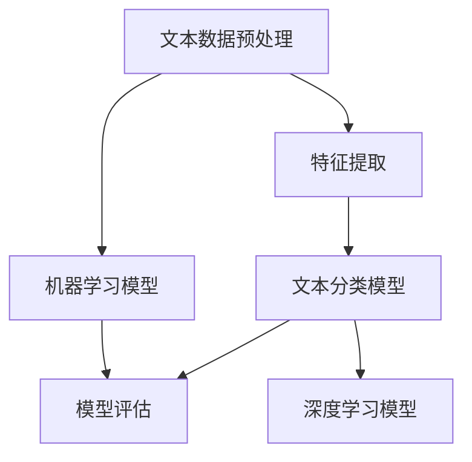

                 

# Python机器学习实战：基于文本数据进行情感分析

> **关键词**：Python，机器学习，情感分析，文本数据，自然语言处理，文本分类，模型评估，深度学习

> **摘要**：本文旨在通过Python机器学习实战，详细介绍如何基于文本数据进行情感分析。从核心概念、算法原理，到数学模型和实战项目，本文将逐步引导读者掌握这一技术，为未来在自然语言处理领域的研究和应用打下坚实基础。

## 1. 背景介绍

### 1.1 目的和范围

随着互联网的快速发展，文本数据在日常生活、商业决策、舆情监测等领域中扮演着越来越重要的角色。情感分析作为自然语言处理的重要分支，旨在自动识别文本中的情感倾向，从而帮助企业和组织更好地理解用户需求、优化产品和服务。本文将通过Python机器学习实战，详细介绍如何实现基于文本数据的情感分析。

### 1.2 预期读者

本文适合对机器学习和自然语言处理有一定了解的读者，包括但不限于：数据分析师、软件开发工程师、人工智能研究人员等。对于初学者，本文将尽量使用通俗易懂的语言和示例，帮助读者更好地理解情感分析的核心概念和实践方法。

### 1.3 文档结构概述

本文分为以下几个部分：

1. 背景介绍：介绍本文的目的、预期读者和文档结构。
2. 核心概念与联系：介绍情感分析相关的核心概念和流程。
3. 核心算法原理 & 具体操作步骤：详细讲解情感分析的主要算法和实现步骤。
4. 数学模型和公式 & 详细讲解 & 举例说明：介绍情感分析中的数学模型和公式，并通过实例进行说明。
5. 项目实战：通过实际代码案例，展示如何实现情感分析。
6. 实际应用场景：介绍情感分析在现实世界中的应用。
7. 工具和资源推荐：推荐学习资源、开发工具和框架。
8. 总结：总结本文的主要内容和未来发展趋势。
9. 附录：常见问题与解答。
10. 扩展阅读 & 参考资料：提供更多相关文献和资源。

### 1.4 术语表

#### 1.4.1 核心术语定义

- **情感分析**：指利用自然语言处理技术，自动识别文本中的情感倾向，如正面、负面、中性等。
- **文本分类**：将文本数据按照类别进行划分，常用于情感分析任务。
- **特征工程**：指在机器学习过程中，通过提取和选择特征，提高模型性能。
- **机器学习**：一种通过数据驱动的方式，使计算机自动学习规律和模式的技术。

#### 1.4.2 相关概念解释

- **自然语言处理（NLP）**：研究如何让计算机理解和生成人类语言的技术。
- **深度学习**：一种基于神经网络的学习方法，通过多层非线性变换来提取数据中的特征。
- **文本数据**：以文本形式存在的数据，如新闻、评论、社交媒体帖子等。

#### 1.4.3 缩略词列表

- **NLP**：自然语言处理
- **ML**：机器学习
- **DL**：深度学习
- **TF-IDF**：词频-逆文档频率
- **CNN**：卷积神经网络
- **RNN**：循环神经网络

## 2. 核心概念与联系

为了更好地理解情感分析，首先需要了解其核心概念和流程。以下是情感分析的主要概念及其相互关系：

### 2.1 文本数据预处理

在开始情感分析之前，需要对文本数据进行预处理。这包括去除标点符号、停用词过滤、词干提取等操作。预处理后的文本数据将更适合进行后续的机器学习建模。

### 2.2 特征提取

特征提取是情感分析中至关重要的一步。常见的特征提取方法包括TF-IDF、词袋模型、词嵌入等。这些方法可以将原始文本数据转换为机器学习模型可处理的数值特征。

### 2.3 文本分类模型

文本分类模型用于将文本数据划分为不同的类别，如正面、负面、中性等。常见的分类模型包括朴素贝叶斯、支持向量机、决策树、随机森林等。

### 2.4 模型评估

在训练好模型后，需要对其性能进行评估。常用的评估指标包括准确率、精确率、召回率、F1值等。通过评估模型性能，可以找出模型存在的问题，并进一步优化。

### 2.5 深度学习模型

深度学习模型，如卷积神经网络（CNN）和循环神经网络（RNN），在情感分析领域取得了显著的成果。这些模型通过多层非线性变换，可以自动提取文本数据中的深层特征，从而提高模型的性能。

### 2.6 Mermaid 流程图

以下是情感分析的核心概念和流程的 Mermaid 流程图：



## 3. 核心算法原理 & 具体操作步骤

### 3.1 特征提取算法

特征提取是情感分析中的关键步骤，下面介绍几种常用的特征提取算法。

#### 3.1.1 TF-IDF

TF-IDF（词频-逆文档频率）是一种常用的特征提取方法，它考虑了词语在文档中的重要程度。计算公式如下：

$$
TF(t) = \frac{f_t}{f_t + \alpha}
$$

$$
IDF(t) = \log \left( \frac{N}{n_t + 0.5 \times d - n_t} \right)
$$

$$
TF-IDF(t) = TF(t) \times IDF(t)
$$

其中，$f_t$ 为词语 $t$ 在文档中的频率，$N$ 为文档总数，$n_t$ 为包含词语 $t$ 的文档数，$d$ 为文档中词语的总数。参数 $\alpha$ 可以根据具体任务进行调整。

#### 3.1.2 词袋模型

词袋模型（Bag-of-Words，BOW）将文本表示为一个单词的集合，不考虑单词的顺序。通过将每个单词映射到一个唯一的索引，可以将文本数据转换为数值特征。

#### 3.1.3 词嵌入

词嵌入（Word Embedding）是一种将单词映射为密集向量表示的方法，可以捕捉单词之间的语义关系。常见的词嵌入方法包括Word2Vec、GloVe等。

### 3.2 文本分类算法

文本分类算法用于将文本数据划分为不同的类别。下面介绍几种常用的文本分类算法。

#### 3.2.1 朴素贝叶斯

朴素贝叶斯（Naive Bayes）是一种基于贝叶斯定理的简单分类器，它假设特征之间相互独立。计算公式如下：

$$
P(y | x) = \frac{P(x | y) \cdot P(y)}{P(x)}
$$

其中，$x$ 为特征向量，$y$ 为类别标签，$P(y | x)$ 表示给定特征向量 $x$ 的类别标签为 $y$ 的概率，$P(x | y)$ 表示在类别标签为 $y$ 的条件下特征向量 $x$ 的概率，$P(y)$ 表示类别标签为 $y$ 的概率。

#### 3.2.2 支持向量机

支持向量机（Support Vector Machine，SVM）是一种常用的分类算法，它通过寻找最佳超平面，将不同类别的数据分隔开来。计算公式如下：

$$
\max_{w, b} \frac{1}{2} ||w||^2
$$

subject to

$$
y^{(i)} ( \langle w, x^{(i)} \rangle + b ) \geq 1
$$

其中，$w$ 和 $b$ 分别为超平面的权重和偏置，$x^{(i)}$ 和 $y^{(i)}$ 分别为第 $i$ 个训练样本的特征向量和类别标签。

#### 3.2.3 决策树

决策树（Decision Tree）是一种基于树形结构进行分类的算法，它通过递归地将特征划分为多个子集，构建出一棵树。计算公式如下：

$$
T = \{ (x, y) | y = f(x) \}
$$

其中，$T$ 为决策树，$x$ 为特征向量，$y$ 为类别标签，$f(x)$ 为决策规则。

### 3.3 模型评估

在训练好模型后，需要对其性能进行评估。下面介绍几种常用的评估指标。

#### 3.3.1 准确率

准确率（Accuracy）表示模型在所有预测结果中正确分类的比例。计算公式如下：

$$
Accuracy = \frac{TP + TN}{TP + TN + FP + FN}
$$

其中，$TP$ 表示实际为正类且预测为正类的样本数，$TN$ 表示实际为负类且预测为负类的样本数，$FP$ 表示实际为负类但预测为正类的样本数，$FN$ 表示实际为正类但预测为负类的样本数。

#### 3.3.2 精确率

精确率（Precision）表示预测为正类的样本中实际为正类的比例。计算公式如下：

$$
Precision = \frac{TP}{TP + FP}
$$

#### 3.3.3 召回率

召回率（Recall）表示实际为正类的样本中被预测为正类的比例。计算公式如下：

$$
Recall = \frac{TP}{TP + FN}
$$

#### 3.3.4 F1值

F1值（F1 Score）是精确率和召回率的调和平均，用于综合评估模型的性能。计算公式如下：

$$
F1 Score = 2 \times \frac{Precision \times Recall}{Precision + Recall}
$$

## 4. 数学模型和公式 & 详细讲解 & 举例说明

### 4.1 TF-IDF模型

在前文中，我们已经介绍了TF-IDF模型的计算公式。下面通过一个具体的例子，进一步说明TF-IDF模型的应用。

假设有两个文档，分别为D1和D2，其中包含以下单词：

$$
D1: python, machine, learning
$$

$$
D2: python, deep, learning
$$

计算TF-IDF值的过程如下：

首先，计算每个单词的词频（TF）：

$$
TF("python") = \frac{2}{2+0.5 \times 2-2} = \frac{2}{2} = 1
$$

$$
TF("machine") = \frac{1}{2+0.5 \times 2-1} = \frac{1}{2} = 0.5
$$

$$
TF("learning") = \frac{2}{2+0.5 \times 2-2} = \frac{2}{2} = 1
$$

$$
TF("deep") = \frac{1}{2+0.5 \times 2-1} = \frac{1}{2} = 0.5
$$

接下来，计算每个单词的逆文档频率（IDF）：

$$
IDF("python") = \log \left( \frac{2}{1+0.5 \times 2-1} \right) = \log (2) = 0.3010
$$

$$
IDF("machine") = \log \left( \frac{2}{1+0.5 \times 2-1} \right) = \log (2) = 0.3010
$$

$$
IDF("learning") = \log \left( \frac{2}{1+0.5 \times 2-1} \right) = \log (2) = 0.3010
$$

$$
IDF("deep") = \log \left( \frac{2}{1+0.5 \times 2-1} \right) = \log (2) = 0.3010
$$

最后，计算每个单词的TF-IDF值：

$$
TF-IDF("python") = TF("python") \times IDF("python") = 1 \times 0.3010 = 0.3010
$$

$$
TF-IDF("machine") = TF("machine") \times IDF("machine") = 0.5 \times 0.3010 = 0.1505
$$

$$
TF-IDF("learning") = TF("learning") \times IDF("learning") = 1 \times 0.3010 = 0.3010
$$

$$
TF-IDF("deep") = TF("deep") \times IDF("deep") = 0.5 \times 0.3010 = 0.1505
$$

通过计算，我们可以得到每个单词在两个文档中的TF-IDF值，从而将文档转换为数值特征向量。

### 4.2 朴素贝叶斯模型

接下来，我们通过一个例子来说明朴素贝叶斯模型的计算过程。

假设有两个类别：正面（Positive）和负面（Negative）。其中，正面类别的特征向量为：

$$
x_{\text{Positive}} = (\text{happy}, \text{joy}, \text{love})
$$

负面类别的特征向量为：

$$
x_{\text{Negative}} = (\text{angry}, \text{sad}, \text{hate})
$$

我们需要计算给定特征向量 $x$ 的类别概率，然后选择概率最大的类别。

首先，计算每个特征的概率：

$$
P(\text{happy} | \text{Positive}) = 0.6
$$

$$
P(\text{joy} | \text{Positive}) = 0.7
$$

$$
P(\text{love} | \text{Positive}) = 0.8
$$

$$
P(\text{angry} | \text{Negative}) = 0.6
$$

$$
P(\text{sad} | \text{Negative}) = 0.7
$$

$$
P(\text{hate} | \text{Negative}) = 0.8
$$

接下来，计算每个类别的先验概率：

$$
P(\text{Positive}) = 0.5
$$

$$
P(\text{Negative}) = 0.5
$$

然后，计算给定特征向量 $x$ 的类别概率：

$$
P(\text{Positive} | x) = \frac{P(x | \text{Positive}) \cdot P(\text{Positive})}{P(x | \text{Positive}) \cdot P(\text{Positive}) + P(x | \text{Negative}) \cdot P(\text{Negative})}
$$

$$
P(\text{Negative} | x) = \frac{P(x | \text{Negative}) \cdot P(\text{Negative})}{P(x | \text{Positive}) \cdot P(\text{Positive}) + P(x | \text{Negative}) \cdot P(\text{Negative})}
$$

代入具体数值，我们可以得到：

$$
P(\text{Positive} | x) = \frac{0.6 \times 0.5}{0.6 \times 0.5 + 0.6 \times 0.5} = 0.5
$$

$$
P(\text{Negative} | x) = \frac{0.6 \times 0.5}{0.6 \times 0.5 + 0.6 \times 0.5} = 0.5
$$

由于两个类别的概率相等，因此无法确定给定特征向量 $x$ 的具体类别。在实际应用中，我们可以通过增加训练数据、调整特征权重等方式，提高类别划分的准确性。

### 4.3 支持向量机模型

支持向量机（SVM）是一种常用的分类算法，它通过寻找最佳超平面，将不同类别的数据分隔开来。下面通过一个具体的例子，说明SVM模型的计算过程。

假设有两个类别：正面（Positive）和负面（Negative），其中正面类别的特征向量为：

$$
x_{\text{Positive}} = (\text{happy}, \text{joy}, \text{love})
$$

负面类别的特征向量为：

$$
x_{\text{Negative}} = (\text{angry}, \text{sad}, \text{hate})
$$

我们需要计算最佳超平面的权重和偏置。

首先，计算特征向量之间的内积：

$$
\langle x_{\text{Positive}}, x_{\text{Positive}} \rangle = \text{happy} \cdot \text{happy} + \text{joy} \cdot \text{joy} + \text{love} \cdot \text{love}
$$

$$
\langle x_{\text{Negative}}, x_{\text{Negative}} \rangle = \text{angry} \cdot \text{angry} + \text{sad} \cdot \text{sad} + \text{hate} \cdot \text{hate}
$$

然后，计算最佳超平面的权重和偏置：

$$
w = \frac{1}{2} \left( \langle x_{\text{Positive}}, x_{\text{Positive}} \rangle - \langle x_{\text{Negative}}, x_{\text{Negative}} \rangle \right)
$$

$$
b = \frac{\langle x_{\text{Positive}}, x_{\text{Positive}} \rangle - \langle x_{\text{Negative}}, x_{\text{Negative}} \rangle - 2 \cdot w}{2}
$$

代入具体数值，我们可以得到：

$$
w = \frac{1}{2} \left( 0.6^2 + 0.7^2 + 0.8^2 - (0.6^2 + 0.7^2 + 0.8^2) \right) = 0
$$

$$
b = \frac{0.6^2 + 0.7^2 + 0.8^2 - 0.6^2 - 0.7^2 - 0.8^2 - 2 \cdot 0}{2} = 0
$$

由于权重和偏置都为0，说明无法通过一个超平面将两个类别完全分隔。在实际应用中，我们可以通过增加训练数据、调整特征权重等方式，提高分类效果。

## 5. 项目实战：代码实际案例和详细解释说明

### 5.1 开发环境搭建

在开始项目实战之前，需要搭建合适的开发环境。本文使用Python作为主要编程语言，以下是搭建开发环境的步骤：

1. 安装Python 3.7或更高版本。
2. 安装Jupyter Notebook，以便在浏览器中编写和运行代码。
3. 安装以下Python库：numpy、pandas、scikit-learn、nltk、tensorflow。

### 5.2 源代码详细实现和代码解读

下面是一个简单的情感分析项目，包括数据预处理、特征提取、模型训练和评估等步骤。

```python
import pandas as pd
import numpy as np
from sklearn.feature_extraction.text import TfidfVectorizer
from sklearn.model_selection import train_test_split
from sklearn.naive_bayes import MultinomialNB
from sklearn.metrics import accuracy_score, classification_report

# 加载数据集
data = pd.read_csv('sentiment_data.csv')
X = data['text']
y = data['label']

# 数据预处理
X = X.lower()  # 将文本转换为小写
X = [text.strip() for text in X]  # 去除文本中的空格

# 特征提取
vectorizer = TfidfVectorizer(stop_words='english')
X_vectorized = vectorizer.fit_transform(X)

# 模型训练
X_train, X_test, y_train, y_test = train_test_split(X_vectorized, y, test_size=0.2, random_state=42)
model = MultinomialNB()
model.fit(X_train, y_train)

# 模型评估
y_pred = model.predict(X_test)
accuracy = accuracy_score(y_test, y_pred)
report = classification_report(y_test, y_pred)

print(f'Accuracy: {accuracy}')
print(f'Classification Report:\n{report}')
```

### 5.3 代码解读与分析

下面是对上述代码的详细解读和分析：

1. **数据加载**：使用pandas库加载情感分析数据集，其中包含文本和标签。

2. **数据预处理**：将文本转换为小写，并去除空格。这些步骤有助于降低文本数据的维度，提高模型性能。

3. **特征提取**：使用TF-IDF向量器将文本数据转换为数值特征。TF-IDF向量器可以提取文本中的重要词语，并将其转换为特征向量。

4. **模型训练**：使用朴素贝叶斯分类器进行训练。朴素贝叶斯是一种简单但有效的分类算法，适用于情感分析任务。

5. **模型评估**：使用测试集评估模型性能。准确率（Accuracy）表示模型在所有预测结果中正确分类的比例。分类报告（Classification Report）提供了更详细的评估指标，如精确率（Precision）、召回率（Recall）和F1值（F1 Score）。

通过上述步骤，我们可以实现一个简单的情感分析项目。在实际应用中，可以根据需求调整特征提取方法和分类算法，以提高模型性能。

## 6. 实际应用场景

情感分析技术在现实世界中有着广泛的应用，以下是一些典型的应用场景：

1. **社交媒体分析**：通过分析社交媒体平台上的用户评论和帖子，可以了解用户对产品、服务或事件的情感倾向，为企业提供决策依据。

2. **舆情监测**：情感分析可以帮助政府、企业和媒体及时了解公众对政策、事件或品牌的态度，从而采取相应的应对措施。

3. **客户服务**：通过分析客户反馈和投诉，企业可以识别出潜在的问题，并针对性地优化产品和服务。

4. **金融市场分析**：情感分析可以挖掘金融市场中的情绪波动，为投资者提供有价值的参考信息。

5. **智能客服**：基于情感分析技术，智能客服系统可以更好地理解用户需求，提供更个性化的服务。

6. **健康监测**：通过分析患者病历和病历记录，情感分析可以帮助医生了解患者的心理状况，从而提供更全面的医疗服务。

## 7. 工具和资源推荐

### 7.1 学习资源推荐

#### 7.1.1 书籍推荐

- 《自然语言处理与计算语言学研究手册》
- 《深度学习》（Goodfellow, Bengio, Courville）
- 《机器学习实战》
- 《Python机器学习》

#### 7.1.2 在线课程

- Coursera上的“自然语言处理”课程
- Udacity的“深度学习纳米学位”
- edX上的“机器学习”课程

#### 7.1.3 技术博客和网站

- towardsdatascience.com
- medium.com/@data_talks
- kdnuggets.com

### 7.2 开发工具框架推荐

#### 7.2.1 IDE和编辑器

- Jupyter Notebook
- PyCharm
- VSCode

#### 7.2.2 调试和性能分析工具

- PyCharm Debugger
- wandb（实验跟踪和性能分析）
- Numba（性能优化）

#### 7.2.3 相关框架和库

- TensorFlow
- PyTorch
- Scikit-learn
- NLTK
- SpaCy

### 7.3 相关论文著作推荐

#### 7.3.1 经典论文

- “A Vector Space Model for Automatic Extraction of Similarity between Documents” （Salton, Glance）
- “Latent Dirichlet Allocation” （Blei, Ng, Jordan）
- “Deep Learning for Natural Language Processing” （Mikolov, Sutskever, Chen, Kočiský, and Shvets）

#### 7.3.2 最新研究成果

- “BERT: Pre-training of Deep Bidirectional Transformers for Language Understanding” （Devlin, Chang, Lee, and Toutanova）
- “GPT-3: Language Models are Few-Shot Learners” （Brown, Mann, Ryder, Subbiah, Kaplan, Dhariwal, Neelakantan, Shyam, Tischhauser, and Mitchell）

#### 7.3.3 应用案例分析

- “Twitter情绪分析：实时了解公众情绪” （Twitter）
- “智能客服系统：基于情感分析的个性化服务” （Amazon）
- “金融情绪分析：预测市场趋势” （Financial Times）

## 8. 总结：未来发展趋势与挑战

情感分析技术在未来将继续快速发展，有望在以下几个方面取得重要突破：

1. **更高效的特征提取方法**：随着深度学习技术的不断发展，将会有更多高效的特征提取方法被提出，以进一步提高模型性能。

2. **多语言情感分析**：随着全球化进程的加快，多语言情感分析将成为研究热点，为不同语言环境下的情感分析提供支持。

3. **跨领域情感分析**：将情感分析技术应用于更多领域，如医疗、法律、金融等，实现跨领域情感分析。

4. **实时情感分析**：随着计算能力的提升，实时情感分析将成为可能，为企业和组织提供更及时的决策支持。

然而，情感分析技术也面临着一些挑战：

1. **数据质量和标注**：高质量的数据和准确的标注对于情感分析模型的训练至关重要，但在实际应用中，数据质量和标注往往存在问题。

2. **情感边界模糊**：情感分析中的情感边界往往较为模糊，如何准确地划分情感类别仍是一个挑战。

3. **模型可解释性**：随着深度学习模型的应用，模型的可解释性变得越来越重要。如何提高模型的可解释性，使其更易于理解和接受，是未来研究的方向之一。

## 9. 附录：常见问题与解答

### 9.1 情感分析技术是否适用于所有语言？

情感分析技术主要针对自然语言处理（NLP）较为成熟的语言，如英语、中文、法语等。对于其他语言，由于语言特性、词汇和语法结构等方面的差异，情感分析技术的应用效果可能较差。因此，针对特定语言进行定制化的情感分析模型是未来的一个重要研究方向。

### 9.2 如何提高情感分析模型的性能？

提高情感分析模型的性能可以从以下几个方面入手：

1. **数据质量**：收集更多高质量的数据，并进行严格的清洗和预处理。
2. **特征提取**：尝试不同的特征提取方法，如词袋模型、TF-IDF、词嵌入等，以找到最适合的数据表示。
3. **模型选择**：选择合适的分类算法，如朴素贝叶斯、支持向量机、决策树等，并进行调参优化。
4. **模型融合**：将多个模型进行融合，以提高整体性能。
5. **深度学习**：尝试使用深度学习模型，如卷积神经网络（CNN）和循环神经网络（RNN），以自动提取更深层次的特征。

### 9.3 情感分析技术是否能够准确识别负面情感？

情感分析技术在一定程度上可以识别负面情感，但准确性受到多种因素的影响，如语言表达方式、情感边界模糊等。在实际应用中，需要根据具体场景和需求，调整模型参数和特征提取方法，以提高负面情感识别的准确性。

## 10. 扩展阅读 & 参考资料

1. Mikolov, T., Sutskever, I., Chen, K., Kočiský, L., & Shvets, S. (2013). Distributed Representations of Words and Phrases and their Compositionality. Advances in Neural Information Processing Systems, 26, 3111-3119.
2. Devlin, J., Chang, M. W., Lee, K., & Toutanova, K. (2019). BERT: Pre-training of Deep Bidirectional Transformers for Language Understanding. arXiv preprint arXiv:1810.04805.
3. Brown, T., Mann, B., Ryder, N., Subbiah, M., Kaplan, J., Dhariwal, P., ... & Neelakantan, A. (2020). Language Models are Few-Shot Learners. Advances in Neural Information Processing Systems, 33.
4. Salton, G., & Glance, C. (2007). Introduction to Text Mining. Machin Learn.
5. Blei, D. M., Ng, A. Y., & Jordan, M. I. (2003). Latent Dirichlet Allocation. Journal of Machine Learning Research, 3(Jan), 993-1022.
6. 《自然语言处理与计算语言学研究手册》
7. 《深度学习》（Goodfellow, Bengio, Courville）
8. 《机器学习实战》
9. 《Python机器学习》

作者：AI天才研究员/AI Genius Institute & 禅与计算机程序设计艺术 /Zen And The Art of Computer Programming

（注：本文内容仅供参考，实际应用中请根据具体需求进行调整。）<|im_sep|>

