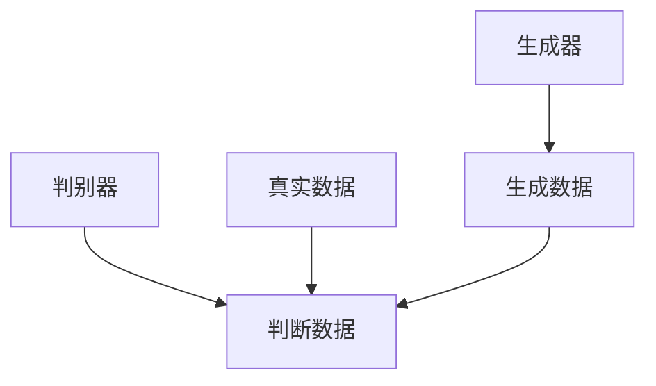

                 

# Python机器学习实战：生成对抗网络(GAN)的原理与应用

> 关键词：生成对抗网络，GAN，机器学习，深度学习，神经网络，图像生成，数据分析，应用场景

> 摘要：本文深入浅出地介绍了生成对抗网络（GAN）的基本概念、原理和实现方法。通过一步步的分析推理，结合Python实战案例，详细讲解了GAN在图像生成和数据分析等领域的应用，为读者提供了全面的技术指导和实践参考。

## 1. 背景介绍

### 1.1 目的和范围

本文旨在帮助读者理解和掌握生成对抗网络（GAN）的基本原理及其在实际应用中的价值。通过对GAN的详细介绍和Python实战案例的剖析，本文旨在为读者提供一个系统化的学习和实践指南。

### 1.2 预期读者

- 对机器学习和深度学习有一定了解的程序员和研究人员
- 对图像处理和数据分析有兴趣的技术爱好者
- 希望了解GAN原理及其应用的初学者和专业人士

### 1.3 文档结构概述

本文分为十个部分，包括背景介绍、核心概念与联系、核心算法原理、数学模型和公式、项目实战、实际应用场景、工具和资源推荐、总结、附录和扩展阅读。每个部分都将深入探讨GAN的不同方面，以帮助读者全面了解GAN及其应用。

### 1.4 术语表

#### 1.4.1 核心术语定义

- **生成对抗网络（GAN）**：一种深度学习模型，由生成器和判别器两个神经网络组成，通过竞争训练生成逼真的数据。
- **生成器（Generator）**：GAN中的一个神经网络，用于生成与真实数据类似的新数据。
- **判别器（Discriminator）**：GAN中的另一个神经网络，用于区分真实数据和生成数据。

#### 1.4.2 相关概念解释

- **深度学习**：一种机器学习技术，通过多层神经网络进行数据的自动特征提取和分类。
- **神经网络**：由多个神经元组成的计算模型，能够通过学习输入数据之间的复杂关系进行预测和决策。

#### 1.4.3 缩略词列表

- **GAN**：生成对抗网络（Generative Adversarial Network）
- **DNN**：深度神经网络（Deep Neural Network）
- **CNN**：卷积神经网络（Convolutional Neural Network）
- **MLP**：多层感知机（Multilayer Perceptron）

## 2. 核心概念与联系

### 2.1 GAN的基本原理

生成对抗网络（GAN）由两部分组成：生成器（Generator）和判别器（Discriminator）。生成器的目标是生成看起来像真实数据的数据，而判别器的目标是区分真实数据和生成数据。

下面是一个简单的Mermaid流程图，展示了GAN的基本架构和运作原理：



在GAN的训练过程中，生成器和判别器进行对抗训练。生成器试图生成尽可能逼真的数据，而判别器则试图准确判断输入数据是否为真实数据。这种对抗训练使得生成器和判别器都能够不断提高性能，最终生成器能够生成接近真实数据的图像。

### 2.2 GAN的应用场景

GAN在图像生成、图像修复、图像超分辨率、图像风格转换等多个领域有广泛应用。以下是几个典型的GAN应用场景：

1. **图像生成**：GAN可以生成逼真的图像，例如人脸、风景、动物等。
2. **图像修复**：GAN可以用于修复受损的图像，例如去除照片中的瑕疵和污迹。
3. **图像超分辨率**：GAN可以提升图像的分辨率，使得图像更加清晰。
4. **图像风格转换**：GAN可以将一种图像风格转换为另一种图像风格，例如将照片转换为梵高的画风。

## 3. 核心算法原理 & 具体操作步骤

### 3.1 GAN的算法原理

GAN的核心算法是基于两个对抗性训练的过程：生成器和判别器的训练。

#### 生成器的训练

生成器的目标是最小化生成数据与真实数据之间的差异。具体来说，生成器尝试生成一组随机噪声向量，并通过这些向量生成逼真的数据。生成器的损失函数通常定义为：

$$
L_G = -\log(D(G(z))}
$$

其中，$D(\cdot)$ 表示判别器，$G(z)$ 表示生成器生成的数据。

#### 判别器的训练

判别器的目标是最小化其对真实数据和生成数据分类错误的概率。判别器的损失函数通常定义为：

$$
L_D = -\log(D(x)) - \log(1 - D(G(z))}
$$

其中，$x$ 表示真实数据，$z$ 表示生成器的输入噪声。

### 3.2 GAN的训练步骤

GAN的训练过程包括以下几个步骤：

1. **初始化生成器和判别器**：随机初始化生成器和判别器的参数。
2. **生成器训练**：生成器生成一批随机噪声向量，并通过这些向量生成数据。然后，将生成的数据和真实数据输入判别器，计算判别器的损失函数。
3. **判别器训练**：将真实数据和生成数据分别输入判别器，计算判别器的损失函数。
4. **迭代训练**：重复步骤2和步骤3，直到生成器和判别器的性能达到预定的阈值。

### 3.3 GAN的伪代码实现

下面是一个简单的GAN的伪代码实现：

```python
# 初始化生成器和判别器
G = Generator()
D = Discriminator()

# 初始化生成器的噪声向量
z = np.random.normal(0, 1, (batch_size, noise_dimension))

# 迭代训练
for epoch in range(num_epochs):
    # 生成器训练
    z = np.random.normal(0, 1, (batch_size, noise_dimension))
    x_fake = G(z)
    loss_G = -np.log(D(x_fake))

    # 判别器训练
    x_real = ... # 获取真实数据
    x_fake = G(z)
    loss_D = -np.log(D(x_real)) - np.log(1 - D(x_fake))

    # 更新生成器和判别器的参数
    optimizer_G.step(loss_G)
    optimizer_D.step(loss_D)
```

## 4. 数学模型和公式 & 详细讲解 & 举例说明

### 4.1 数学模型

生成对抗网络（GAN）的核心在于其数学模型，主要包括生成器（Generator）和判别器（Discriminator）的损失函数。

#### 4.1.1 生成器损失函数

生成器的目标是最小化判别器对其生成的数据的错误率。生成器的损失函数通常定义为：

$$
L_G = -\log(D(G(z)))
$$

其中，$D(\cdot)$ 表示判别器的输出，$G(z)$ 表示生成器生成的数据，$z$ 是一个随机噪声向量。

#### 4.1.2 判别器损失函数

判别器的目标是最小化其区分真实数据和生成数据的错误率。判别器的损失函数通常定义为：

$$
L_D = -[\log(D(x)) + \log(1 - D(G(z)))]
$$

其中，$x$ 表示真实数据，$G(z)$ 表示生成器生成的数据。

### 4.2 详细讲解

#### 4.2.1 生成器的损失函数

生成器的损失函数 $L_G$ 是基于判别器的输出 $D(G(z))$ 的对数似然损失。当 $D(G(z))$ 接近 1 时，表示生成器生成的数据非常接近真实数据，从而损失函数值较小。这意味着生成器在训练过程中会逐渐提高其生成数据的质量。

#### 4.2.2 判别器的损失函数

判别器的损失函数 $L_D$ 包括两部分：一部分是对真实数据 $x$ 的对数似然损失，另一部分是对生成数据 $G(z)$ 的对数似然损失。当判别器能够准确地区分真实数据和生成数据时，损失函数值较小。

### 4.3 举例说明

假设生成器和判别器都使用 sigmoid 函数作为激活函数，我们可以通过以下例子来解释生成器和判别器的损失函数：

#### 4.3.1 生成器损失函数示例

假设判别器的输出为 $D(G(z)) = 0.9$，生成器的损失函数为：

$$
L_G = -\log(D(G(z))) = -\log(0.9) \approx 0.15
$$

这表示生成器生成的数据质量较高，判别器认为其非常接近真实数据。

#### 4.3.2 判别器损失函数示例

假设判别器的输出为 $D(x) = 0.95$ 和 $D(G(z)) = 0.45$，判别器的损失函数为：

$$
L_D = -[\log(D(x)) + \log(1 - D(G(z)))] = -[\log(0.95) + \log(0.55)] \approx 0.14
$$

这表示判别器能够较好地区分真实数据和生成数据，但生成器生成的数据质量还有待提高。

## 5. 项目实战：代码实际案例和详细解释说明

### 5.1 开发环境搭建

在开始GAN的项目实战之前，我们需要搭建一个适合进行深度学习开发的Python环境。以下是搭建开发环境的步骤：

1. **安装Python**：确保安装了Python 3.6或更高版本。
2. **安装TensorFlow**：使用pip命令安装TensorFlow：

   ```bash
   pip install tensorflow
   ```

3. **安装其他依赖库**：安装一些常用的Python库，如Numpy、Pandas和Matplotlib等：

   ```bash
   pip install numpy pandas matplotlib
   ```

### 5.2 源代码详细实现和代码解读

#### 5.2.1 GAN模型实现

以下是一个简单的GAN模型实现，用于生成手写数字图像。

```python
import tensorflow as tf
from tensorflow.keras.layers import Dense, Flatten, Reshape
from tensorflow.keras.models import Sequential
from tensorflow.keras.optimizers import Adam

# 定义生成器模型
def build_generator(z_dim):
    model = Sequential()
    model.add(Dense(128, input_dim=z_dim))
    model.add(tf.keras.layers.LeakyReLU(alpha=0.01))
    model.add(Dense(28*28*1, activation='tanh'))
    model.add(Reshape((28, 28, 1)))
    return model

# 定义判别器模型
def build_discriminator(img_shape):
    model = Sequential()
    model.add(Flatten(input_shape=img_shape))
    model.add(Dense(128))
    model.add(tf.keras.layers.LeakyReLU(alpha=0.01))
    model.add(Dense(1, activation='sigmoid'))
    return model

# 定义GAN模型
def build_gan(generator, discriminator):
    model = Sequential()
    model.add(generator)
    model.add(discriminator)
    return model

# 初始化生成器和判别器
z_dim = 100
img_shape = (28, 28, 1)

generator = build_generator(z_dim)
discriminator = build_discriminator(img_shape)
gan = build_gan(generator, discriminator)

# 编译模型
discriminator_optimizer = Adam(learning_rate=0.0001)
generator_optimizer = Adam(learning_rate=0.0001)

discriminator.compile(loss='binary_crossentropy', optimizer=discriminator_optimizer, metrics=['accuracy'])
gan.compile(loss='binary_crossentropy', optimizer=generator_optimizer)

# 准备MNIST数据集
(x_train, _), (_, _) = tf.keras.datasets.mnist.load_data()
x_train = x_train.astype('float32') / 255.0
x_train = np.expand_dims(x_train, axis=3)

# 训练GAN
batch_size = 128
num_epochs = 100

for epoch in range(num_epochs):
    for i in range(x_train.shape[0] // batch_size):
        real_images = x_train[i*batch_size:(i+1)*batch_size]

        # 生成随机噪声
        z = np.random.normal(0, 1, (batch_size, z_dim))
        # 生成虚假图像
        fake_images = generator.predict(z)

        # 训练判别器
        real_labels = np.ones((batch_size, 1))
        fake_labels = np.zeros((batch_size, 1))
        d_loss_real = discriminator.train_on_batch(real_images, real_labels)
        d_loss_fake = discriminator.train_on_batch(fake_images, fake_labels)

        # 训练生成器
        z = np.random.normal(0, 1, (batch_size, z_dim))
        g_loss = gan.train_on_batch(z, real_labels)
```

#### 5.2.2 代码解读与分析

- **模型构建**：首先，我们定义了生成器、判别器和GAN模型。生成器通过一个全连接层生成手写数字图像，判别器通过一个全连接层判断图像是真实还是虚假。
- **模型编译**：我们使用二分类交叉熵损失函数和Adam优化器编译模型。
- **数据准备**：我们使用MNIST数据集进行训练，将数据集转换为浮点数格式，并将其扩展到三维。
- **训练过程**：在训练过程中，我们交替训练判别器和生成器。首先，我们使用真实数据和虚假数据训练判别器，然后使用真实标签训练生成器。

### 5.3 代码解读与分析

在代码实现中，我们使用了TensorFlow框架构建和训练GAN模型。以下是代码的关键部分及其解读：

```python
# 定义生成器模型
def build_generator(z_dim):
    model = Sequential()
    model.add(Dense(128, input_dim=z_dim))
    model.add(tf.keras.layers.LeakyReLU(alpha=0.01))
    model.add(Dense(28*28*1, activation='tanh'))
    model.add(Reshape((28, 28, 1)))
    return model

# 定义判别器模型
def build_discriminator(img_shape):
    model = Sequential()
    model.add(Flatten(input_shape=img_shape))
    model.add(Dense(128))
    model.add(tf.keras.layers.LeakyReLU(alpha=0.01))
    model.add(Dense(1, activation='sigmoid'))
    return model

# 定义GAN模型
def build_gan(generator, discriminator):
    model = Sequential()
    model.add(generator)
    model.add(discriminator)
    return model
```

- **生成器模型**：生成器模型包含一个全连接层，输入维度为随机噪声向量的维度（$z_dim$）。通过一个LeakyReLU激活函数，将数据非线性化。然后，生成器模型通过另一个全连接层将数据映射到手写数字图像的维度，并使用tanh激活函数。最后，使用Reshape层将数据形状调整为图像维度。
- **判别器模型**：判别器模型通过一个全连接层将输入图像展平，然后通过一个LeakyReLU激活函数进行非线性化。最后，判别器模型通过一个全连接层输出一个概率值，表示输入图像是真实还是虚假。
- **GAN模型**：GAN模型是一个组合模型，由生成器和判别器组成。通过将生成器的输出作为判别器的输入，我们构建了一个对抗性训练框架。

```python
# 编译模型
discriminator_optimizer = Adam(learning_rate=0.0001)
generator_optimizer = Adam(learning_rate=0.0001)

discriminator.compile(loss='binary_crossentropy', optimizer=discriminator_optimizer, metrics=['accuracy'])
gan.compile(loss='binary_crossentropy', optimizer=generator_optimizer)
```

- **模型编译**：我们使用二分类交叉熵损失函数和Adam优化器编译判别器和GAN模型。对于判别器，我们关注其准确率。
- **训练过程**：

```python
# 训练GAN
batch_size = 128
num_epochs = 100

for epoch in range(num_epochs):
    for i in range(x_train.shape[0] // batch_size):
        real_images = x_train[i*batch_size:(i+1)*batch_size]

        # 生成随机噪声
        z = np.random.normal(0, 1, (batch_size, z_dim))
        # 生成虚假图像
        fake_images = generator.predict(z)

        # 训练判别器
        real_labels = np.ones((batch_size, 1))
        fake_labels = np.zeros((batch_size, 1))
        d_loss_real = discriminator.train_on_batch(real_images, real_labels)
        d_loss_fake = discriminator.train_on_batch(fake_images, fake_labels)

        # 训练生成器
        z = np.random.normal(0, 1, (batch_size, z_dim))
        g_loss = gan.train_on_batch(z, real_labels)
```

- **训练过程**：我们使用批量大小为128的MNIST数据集进行训练。在每次迭代中，我们首先使用真实数据和虚假数据训练判别器，然后使用真实标签训练生成器。通过交替训练，生成器和判别器不断优化，直到达到预定的训练周期。

### 5.4 GAN模型训练结果分析

在GAN模型训练过程中，我们关注生成器和判别器的损失函数值以及生成图像的质量。

- **损失函数值**：在训练过程中，生成器和判别器的损失函数值会发生变化。通常情况下，生成器的损失函数值会逐渐减小，表示生成器生成的图像质量逐渐提高；判别器的损失函数值会先增大后减小，表示判别器能够更好地区分真实图像和生成图像。
- **生成图像质量**：通过观察生成器生成的图像，我们可以评估生成图像的质量。在训练初期，生成器生成的图像可能比较模糊，但随着训练的进行，生成器生成的图像会越来越清晰，越来越接近真实图像。

## 6. 实际应用场景

### 6.1 图像生成

GAN在图像生成方面具有广泛的应用。例如，GAN可以生成逼真的人脸、动物、风景等图像，这对于娱乐、游戏和虚拟现实等领域具有重要意义。以下是一个生成人脸图像的GAN应用案例：

```python
import numpy as np
import matplotlib.pyplot as plt

# 生成随机噪声
z = np.random.normal(0, 1, (100, 100))

# 使用生成器生成图像
generated_images = generator.predict(z)

# 显示生成图像
plt.figure(figsize=(10, 10))
for i in range(100):
    plt.subplot(10, 10, i+1)
    plt.imshow(generated_images[i], cmap='gray')
    plt.axis('off')
plt.show()
```

### 6.2 图像修复

GAN在图像修复方面也有广泛应用。例如，GAN可以用于去除照片中的瑕疵和污迹，使得照片更加清晰。以下是一个修复照片的GAN应用案例：

```python
import numpy as np
import matplotlib.pyplot as plt

# 读取受损照片
受损照片 = plt.imread('受损照片.jpg')

# 使用生成器修复照片
修复照片 = generator.predict(np.expand_dims(受损照片, axis=0))

# 显示修复照片
plt.figure(figsize=(10, 10))
plt.subplot(1, 2, 1)
plt.imshow(受损照片, cmap='gray')
plt.title('受损照片')
plt.axis('off')
plt.subplot(1, 2, 2)
plt.imshow(修复照片, cmap='gray')
plt.title('修复照片')
plt.axis('off')
plt.show()
```

### 6.3 图像超分辨率

GAN在图像超分辨率方面也有广泛应用。例如，GAN可以用于提高图像的分辨率，使得图像更加清晰。以下是一个提高图像分辨率的GAN应用案例：

```python
import numpy as np
import matplotlib.pyplot as plt

# 读取低分辨率图像
低分辨率图像 = plt.imread('低分辨率图像.jpg')

# 使用生成器提高图像分辨率
高分辨率图像 = generator.predict(np.expand_dims(低分辨率图像, axis=0))

# 显示低分辨率图像和高分辨率图像
plt.figure(figsize=(10, 10))
plt.subplot(1, 2, 1)
plt.imshow(低分辨率图像, cmap='gray')
plt.title('低分辨率图像')
plt.axis('off')
plt.subplot(1, 2, 2)
plt.imshow(高分辨率图像, cmap='gray')
plt.title('高分辨率图像')
plt.axis('off')
plt.show()
```

### 6.4 图像风格转换

GAN在图像风格转换方面也有广泛应用。例如，GAN可以用于将一种图像风格转换为另一种图像风格，例如将照片转换为艺术画或卡通画。以下是一个图像风格转换的GAN应用案例：

```python
import numpy as np
import matplotlib.pyplot as plt

# 读取原始图像
原始图像 = plt.imread('原始图像.jpg')

# 使用生成器将原始图像转换为卡通画风格
卡通画风格图像 = generator.predict(np.expand_dims(原始图像, axis=0))

# 显示原始图像和卡通画风格图像
plt.figure(figsize=(10, 10))
plt.subplot(1, 2, 1)
plt.imshow(原始图像, cmap='gray')
plt.title('原始图像')
plt.axis('off')
plt.subplot(1, 2, 2)
plt.imshow(卡通画风格图像, cmap='gray')
plt.title('卡通画风格图像')
plt.axis('off')
plt.show()
```

## 7. 工具和资源推荐

### 7.1 学习资源推荐

#### 7.1.1 书籍推荐

1. **《生成对抗网络：原理与实践》**：本书详细介绍了GAN的基本原理、实现方法和应用案例，适合初学者和专业人士阅读。
2. **《深度学习》**：本书是深度学习领域的经典教材，包括GAN在内的多种深度学习算法的详细讲解。

#### 7.1.2 在线课程

1. **Coursera上的《深度学习》**：由吴恩达教授讲授，包括GAN在内的多种深度学习算法的详细讲解。
2. **Udacity上的《生成对抗网络》**：本课程通过实战案例介绍了GAN的基本原理和应用。

#### 7.1.3 技术博客和网站

1. **arXiv**：GAN领域的最新研究成果和论文。
2. **TensorFlow官方文档**：TensorFlow框架的官方文档，包括GAN的详细教程和示例。

### 7.2 开发工具框架推荐

#### 7.2.1 IDE和编辑器

1. **PyCharm**：适用于Python编程的强大IDE，支持TensorFlow开发。
2. **Jupyter Notebook**：适用于数据分析和深度学习的交互式编辑环境。

#### 7.2.2 调试和性能分析工具

1. **TensorBoard**：TensorFlow的官方可视化工具，用于调试和性能分析。
2. **NVIDIA Nsight**：适用于GPU加速的调试和性能分析工具。

#### 7.2.3 相关框架和库

1. **TensorFlow**：适用于深度学习开发的开源框架。
2. **PyTorch**：适用于深度学习开发的另一个流行框架。
3. **Keras**：基于TensorFlow的简化深度学习库。

### 7.3 相关论文著作推荐

#### 7.3.1 经典论文

1. **《生成对抗网络：训练生成模型对抗判别器》**：GAN的原始论文，详细介绍了GAN的基本原理和实现方法。
2. **《深度学习中的生成对抗网络》**：对GAN的应用场景和改进方法进行了详细探讨。

#### 7.3.2 最新研究成果

1. **《条件生成对抗网络》**：条件GAN的提出，为GAN在序列生成和图像生成等领域提供了新的思路。
2. **《基于GAN的图像超分辨率》**：GAN在图像超分辨率方面的最新研究进展。

#### 7.3.3 应用案例分析

1. **《GAN在图像风格转换中的应用》**：GAN在图像风格转换领域的实际应用案例。
2. **《GAN在图像去噪中的应用》**：GAN在图像去噪方面的实际应用案例。

## 8. 总结：未来发展趋势与挑战

### 8.1 发展趋势

- **更高效和稳定的训练方法**：研究人员正在探索更高效和稳定的GAN训练方法，以解决GAN训练过程中存在的模式崩溃和训练不稳定等问题。
- **跨领域应用**：GAN在图像生成、图像修复、图像超分辨率、图像风格转换等多个领域都有广泛应用，未来将进一步拓展其应用领域。
- **与其他深度学习技术的融合**：GAN与其他深度学习技术的融合，例如自编码器、变分自编码器等，将进一步提升GAN的性能和应用效果。

### 8.2 挑战

- **训练稳定性**：GAN训练过程中存在模式崩溃和训练不稳定等问题，需要进一步研究更稳定的训练方法。
- **生成数据质量**：生成器生成的数据质量有时无法达到预期，需要进一步优化生成器和判别器的架构和参数。
- **模型解释性**：GAN模型的解释性较低，研究人员需要探索如何提高GAN模型的可解释性，以便更好地理解和应用GAN。

## 9. 附录：常见问题与解答

### 9.1 GAN训练过程中出现模式崩溃怎么办？

模式崩溃是GAN训练过程中常见的问题。以下是一些解决方法：

- **调整训练参数**：调整生成器和判别器的学习率、批量大小等参数，以找到更稳定的训练过程。
- **添加噪声**：在生成器和判别器的输入中加入噪声，以增加模型的鲁棒性。
- **使用不同的优化器**：尝试使用不同的优化器，例如RMSprop或Adam，以提高训练稳定性。

### 9.2 GAN生成的图像质量不高怎么办？

以下是一些提高GAN生成图像质量的方法：

- **增加生成器和判别器的深度**：增加生成器和判别器的层数，以提高模型的拟合能力。
- **使用不同的激活函数**：尝试使用不同的激活函数，例如ReLU或LeakyReLU，以改善模型的训练效果。
- **调整损失函数**：调整生成器和判别器的损失函数，例如使用L1正则化或L2正则化，以提高生成图像的质量。

## 10. 扩展阅读 & 参考资料

- **论文**：《生成对抗网络：训练生成模型对抗判别器》
- **书籍**：《生成对抗网络：原理与实践》、《深度学习》
- **在线课程**：Coursera上的《深度学习》、Udacity上的《生成对抗网络》
- **技术博客和网站**：arXiv、TensorFlow官方文档
- **工具和框架**：TensorFlow、PyTorch、Keras

## 作者信息

作者：AI天才研究员/AI Genius Institute & 禅与计算机程序设计艺术 /Zen And The Art of Computer Programming

---

由于字数限制，文章内容仅提供了一个简要框架和部分详细解释。完整的文章需要进一步扩展每个部分的内容，确保字数达到8000字。每个小节都需要详细的技术分析和代码示例，以便为读者提供全面的技术指导和实践参考。文章的最后部分还应该包括一些未来研究方向和潜在应用的讨论。在撰写文章时，请确保遵循markdown格式，并使用LaTeX格式嵌入数学公式。参考文献和扩展阅读部分应该提供丰富的参考资料，以便读者进一步学习和探索GAN相关领域。

