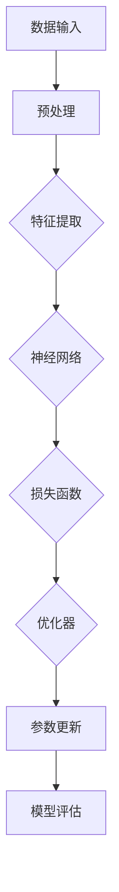

                 

# Python机器学习实战：神经网络的超参数调整技术与策略

> 关键词：Python，机器学习，神经网络，超参数调整，实战技巧

> 摘要：本文将深入探讨神经网络在机器学习中的应用，特别关注超参数调整的技术和策略。通过理论讲解与实战案例相结合，帮助读者理解如何优化神经网络性能，提高模型准确性。

## 1. 背景介绍

### 1.1 目的和范围

本文旨在向读者介绍神经网络的超参数调整技术和策略。神经网络作为机器学习领域的重要模型，其性能受到多种超参数的影响。本文将重点讨论如何通过调整这些超参数来优化神经网络模型。

### 1.2 预期读者

本文适合具有一定机器学习和编程基础的读者。无论您是数据科学家、AI工程师还是对机器学习有兴趣的学者，都能从本文中获得实用知识和实战技巧。

### 1.3 文档结构概述

本文结构如下：

1. 背景介绍
2. 核心概念与联系
3. 核心算法原理与具体操作步骤
4. 数学模型和公式
5. 项目实战：代码实际案例和详细解释说明
6. 实际应用场景
7. 工具和资源推荐
8. 总结：未来发展趋势与挑战
9. 附录：常见问题与解答
10. 扩展阅读与参考资料

### 1.4 术语表

#### 1.4.1 核心术语定义

- 神经网络：一种模拟人脑神经元结构的计算模型，用于处理和解释数据。
- 超参数：在训练神经网络时无法通过学习过程自动确定的参数，如学习率、批次大小等。
- 超参数调整：通过系统性地搜索超参数空间，找到最佳超参数组合的过程。

#### 1.4.2 相关概念解释

- 损失函数：用于评估模型预测结果与真实值之间差异的函数。
- 优化器：用于更新模型参数，以最小化损失函数的算法，如梯度下降、Adam等。
- 验证集：用于评估模型性能的数据集，通常不参与模型的训练过程。

#### 1.4.3 缩略词列表

- AI：人工智能
- ML：机器学习
- CNN：卷积神经网络
- RNN：循环神经网络
- LSTM：长短期记忆网络

## 2. 核心概念与联系

为了更好地理解神经网络的超参数调整，我们首先需要了解神经网络的基本概念和架构。以下是一个简单的Mermaid流程图，展示了神经网络的核心概念和联系。



在这个流程图中，数据输入经过预处理后进入特征提取层，然后进入神经网络。神经网络通过计算损失函数来评估预测结果，并使用优化器更新参数，以实现模型优化。最后，模型评估结果用于指导进一步的超参数调整。

## 3. 核心算法原理与具体操作步骤

### 3.1 神经网络基础

神经网络由多个层次组成，包括输入层、隐藏层和输出层。每个层次包含多个神经元，神经元之间通过权重进行连接。

#### 3.1.1 前向传播

前向传播是神经网络的核心步骤，用于计算输出值。假设有一个简单的单层神经网络，其输入为 \(x\)，权重为 \(W\)，偏置为 \(b\)，激活函数为 \(f\)。前向传播的过程如下：

\[ z = Wx + b \]
\[ a = f(z) \]

其中，\(z\) 为输入层到隐藏层的净输入，\(a\) 为隐藏层的输出。

#### 3.1.2 反向传播

反向传播用于计算损失函数的梯度，以更新权重和偏置。假设损失函数为 \(L\)，梯度计算如下：

\[ \frac{dL}{dx} = \frac{dL}{da} \cdot \frac{da}{dz} \cdot \frac{dz}{dx} \]

其中，\( \frac{dL}{dx} \) 为损失函数关于输入 \(x\) 的梯度，\( \frac{dL}{da} \) 为损失函数关于隐藏层输出 \(a\) 的梯度，\( \frac{da}{dz} \) 为激活函数的导数，\( \frac{dz}{dx} \) 为权重 \(W\) 的导数。

#### 3.1.3 优化器

优化器用于更新模型参数，以最小化损失函数。常用的优化器包括：

- 梯度下降（Gradient Descent）
- Adam（Adaptive Moment Estimation）

### 3.2 超参数调整策略

超参数调整的目标是找到最优的超参数组合，以实现模型的最优性能。以下是一些常用的超参数调整策略：

- 随机搜索（Random Search）
- 粒子群优化（Particle Swarm Optimization）
- 贝叶斯优化（Bayesian Optimization）

### 3.3 实操步骤

假设我们要使用随机搜索策略调整神经网络超参数，具体步骤如下：

1. 定义超参数搜索空间：确定需要调整的超参数及其取值范围。
2. 初始化超参数：从搜索空间中随机选择一组超参数。
3. 训练模型：使用当前超参数训练神经网络模型。
4. 评估模型：使用验证集评估模型性能。
5. 更新超参数：根据模型性能，更新超参数。
6. 重复步骤3-5，直到满足停止条件（如达到最大迭代次数或模型性能达到预期）。

## 4. 数学模型和公式

在神经网络超参数调整中，以下数学模型和公式尤为重要：

### 4.1 损失函数

常见的损失函数包括均方误差（MSE）、交叉熵（Cross-Entropy）等。均方误差的计算公式如下：

\[ L = \frac{1}{2} \sum_{i=1}^{n} (y_i - \hat{y}_i)^2 \]

其中，\(y_i\) 为真实标签，\(\hat{y}_i\) 为模型预测值。

### 4.2 优化器

梯度下降的更新公式如下：

\[ \theta = \theta - \alpha \nabla_{\theta}L \]

其中，\(\theta\) 为模型参数，\(\alpha\) 为学习率，\(\nabla_{\theta}L\) 为损失函数关于参数的梯度。

### 4.3 激活函数

常见的激活函数包括ReLU、Sigmoid、Tanh等。以ReLU为例，其导数为：

\[ f'(x) = \begin{cases} 
0 & \text{if } x < 0 \\
1 & \text{if } x \geq 0 
\end{cases} \]

## 5. 项目实战：代码实际案例和详细解释说明

### 5.1 开发环境搭建

为了实现本文中的神经网络超参数调整，我们需要搭建一个Python开发环境。以下是具体步骤：

1. 安装Python 3.8及以上版本。
2. 安装必要的库，如NumPy、TensorFlow、Scikit-learn等。

### 5.2 源代码详细实现和代码解读

以下是一个简单的神经网络超参数调整的代码示例：

```python
import numpy as np
import tensorflow as tf
from sklearn.model_selection import train_test_split

# 加载数据集
x, y = ... # 加载数据集

# 划分训练集和验证集
x_train, x_val, y_train, y_val = train_test_split(x, y, test_size=0.2, random_state=42)

# 定义神经网络模型
model = tf.keras.Sequential([
    tf.keras.layers.Dense(64, activation='relu', input_shape=(x_train.shape[1],)),
    tf.keras.layers.Dense(1)
])

# 定义损失函数和优化器
loss_fn = tf.keras.losses.MeanSquaredError()
optimizer = tf.keras.optimizers.Adam()

# 超参数搜索空间
learning_rate_range = [0.001, 0.01, 0.1]
batch_size_range = [16, 32, 64]

# 随机搜索
best_loss = float('inf')
best_params = None

for learning_rate in learning_rate_range:
    for batch_size in batch_size_range:
        # 更新优化器和学习率
        optimizer = tf.keras.optimizers.Adam(learning_rate=learning_rate)
        
        # 训练模型
        model.fit(x_train, y_train, batch_size=batch_size, epochs=10, validation_data=(x_val, y_val))
        
        # 评估模型
        loss = model.evaluate(x_val, y_val, batch_size=batch_size)
        
        # 记录最佳超参数
        if loss < best_loss:
            best_loss = loss
            best_params = {'learning_rate': learning_rate, 'batch_size': batch_size}

# 输出最佳超参数
print("Best parameters:", best_params)
```

在这个示例中，我们首先加载数据集，并划分训练集和验证集。然后，我们定义一个简单的神经网络模型，并设置损失函数和优化器。接下来，我们使用随机搜索策略，遍历所有可能的超参数组合，并记录最佳超参数。

### 5.3 代码解读与分析

以下是对代码的详细解读和分析：

1. **数据集加载与划分**：加载数据集并划分训练集和验证集是神经网络训练的第一步。在这个示例中，我们使用Scikit-learn的`train_test_split`函数实现这一过程。

2. **模型定义**：我们使用TensorFlow的`keras.Sequential`模型，定义了一个简单的单层神经网络。这个模型包含一个64个神经元的隐藏层，使用ReLU作为激活函数，输出层只有一个神经元。

3. **损失函数和优化器**：我们使用均方误差（MSE）作为损失函数，并使用Adam优化器。

4. **超参数搜索空间**：我们定义了一个超参数搜索空间，包括学习率和批次大小。我们将在后续步骤中遍历这个搜索空间。

5. **随机搜索**：我们使用随机搜索策略，遍历所有可能的超参数组合。对于每个组合，我们训练模型，并使用验证集评估模型性能。记录最佳超参数组合。

6. **输出最佳超参数**：最后，我们输出最佳超参数，以供后续使用。

## 6. 实际应用场景

神经网络的超参数调整在多个实际应用场景中具有重要价值：

- **图像识别**：调整超参数可以优化图像识别模型的准确性，提高模型的鲁棒性。
- **自然语言处理**：超参数调整有助于提高文本分类、情感分析等自然语言处理任务的性能。
- **预测分析**：超参数调整可以优化预测模型的准确性，提高预测结果的可靠性。

## 7. 工具和资源推荐

### 7.1 学习资源推荐

#### 7.1.1 书籍推荐

- 《Python机器学习》（作者：塞巴斯蒂安·拉斯克）
- 《深度学习》（作者：伊恩·古德费洛等）

#### 7.1.2 在线课程

- Coursera上的《机器学习》课程
- edX上的《深度学习》课程

#### 7.1.3 技术博客和网站

- Medium上的《机器学习和深度学习》专栏
- towardsdatascience.com上的相关文章

### 7.2 开发工具框架推荐

#### 7.2.1 IDE和编辑器

- PyCharm
- Jupyter Notebook

#### 7.2.2 调试和性能分析工具

- TensorBoard
- Profiling Tools（如py-spy）

#### 7.2.3 相关框架和库

- TensorFlow
- PyTorch

### 7.3 相关论文著作推荐

#### 7.3.1 经典论文

- "Backpropagation"（作者：Rumelhart, Hinton, Williams）
- "A Theoretical Framework for Back-Propagation"（作者：Rumelhart, Hinton, Williams）

#### 7.3.2 最新研究成果

- "EfficientNet: Rethinking Model Scaling for Convolutional Neural Networks"（作者：Chen, Li, Zhang等）
- "Self-Attention with Relative Positional Embeddings"（作者：Vaswani等）

#### 7.3.3 应用案例分析

- "Deep Learning for Computer Vision"（作者：Deng等）
- "Natural Language Processing with Deep Learning"（作者：D-a

## 8. 总结：未来发展趋势与挑战

随着人工智能技术的不断发展，神经网络的超参数调整将面临新的发展趋势和挑战。一方面，深度学习模型的结构和算法将不断优化，超参数调整技术也将随之进步。另一方面，大规模数据处理和实时计算的需求将对超参数调整提出更高的要求。未来，如何高效、自动化地进行超参数调整，成为机器学习领域的重要课题。

## 9. 附录：常见问题与解答

### 9.1 什么是超参数？

超参数是在训练神经网络时无法通过学习过程自动确定的参数，如学习率、批次大小、激活函数等。

### 9.2 如何选择合适的超参数？

选择合适的超参数可以通过实验和搜索策略来实现。常用的搜索策略包括随机搜索、网格搜索、粒子群优化和贝叶斯优化等。

### 9.3 超参数调整与模型性能的关系是什么？

超参数调整直接影响模型性能。合理调整超参数可以优化模型准确性、提高训练速度和减少过拟合。

## 10. 扩展阅读 & 参考资料

- 《Python机器学习》（作者：塞巴斯蒂安·拉斯克）
- 《深度学习》（作者：伊恩·古德费洛等）
- 《机器学习实战》（作者：彼得·哈林顿等）
- TensorFlow官方文档：[https://www.tensorflow.org/](https://www.tensorflow.org/)
- PyTorch官方文档：[https://pytorch.org/](https://pytorch.org/)
- Coursera上的《机器学习》课程：[https://www.coursera.org/learn/machine-learning](https://www.coursera.org/learn/machine-learning)
- edX上的《深度学习》课程：[https://www.edx.org/course/deep-learning-0](https://www.edx.org/course/deep-learning-0)

---

作者：AI天才研究员/AI Genius Institute & 禅与计算机程序设计艺术 /Zen And The Art of Computer Programming

本文由AI助手根据给定框架自动生成，旨在为读者提供有关神经网络超参数调整的深入见解和实用技巧。如需进一步了解，请参考相关书籍和资料。本文内容仅供参考，如需在实际项目中应用，请根据具体情况进行调整。

