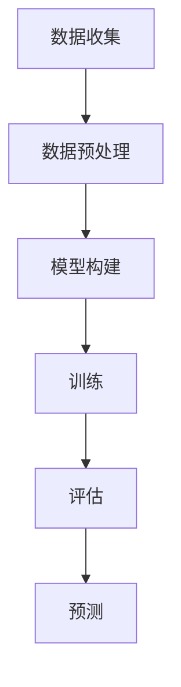

                 

# Python深度学习实践：AI在股票市场预测中的应用

## 关键词：深度学习，股票市场预测，Python，AI，实践，技术博客

## 摘要：

本文旨在通过Python深度学习实践，探讨AI在股票市场预测中的应用。文章首先介绍了深度学习的核心概念及其与股票市场预测的关联，随后详细阐述了构建股票市场预测模型的步骤，包括数据预处理、模型选择、训练和评估。文章最后探讨了深度学习在股票市场预测中的实际应用场景，并推荐了相关学习资源和开发工具。本文旨在为AI领域的研究者提供有价值的参考，以推动深度学习技术在金融领域的应用。

## 1. 背景介绍

随着科技的不断进步，人工智能（AI）已经深入到我们生活的各个领域，股票市场预测便是其中之一。股票市场预测的目的是通过对历史数据的分析和模式识别，预测股票价格的走势，从而为投资者提供决策依据。传统的股票市场预测方法主要包括统计学方法和机器学习算法，如线性回归、支持向量机、决策树等。然而，这些方法往往在处理复杂数据和高维度特征时效果不佳。

深度学习作为一种强大的机器学习技术，通过构建多层神经网络，能够自动从大量数据中学习特征，并在多种任务中取得显著的效果。近年来，深度学习在图像识别、自然语言处理等领域取得了突破性进展，其在股票市场预测中的应用也逐渐受到关注。本文将介绍如何使用Python实现深度学习在股票市场预测中的应用，以期为相关研究提供参考。

## 2. 核心概念与联系

### 2.1 深度学习

深度学习是一种机器学习方法，通过构建多层神经网络模型，自动从大量数据中学习特征，实现高级的预测和分类任务。深度学习的核心是神经网络，包括输入层、隐藏层和输出层。每个隐藏层都可以提取不同层次的特征，从而实现特征自动提取。

### 2.2 股票市场预测

股票市场预测的目的是通过对历史数据的分析，预测股票价格的走势。股票市场数据具有高维度、非线性和噪声等特点，传统的机器学习方法在处理这类数据时效果不佳。深度学习通过构建多层神经网络，能够自动学习复杂数据中的特征，从而提高预测的准确性。

### 2.3 联系与关联

深度学习与股票市场预测之间的联系在于，深度学习可以通过自动提取数据中的特征，提高股票市场预测的准确性。深度学习的多层神经网络结构能够有效地捕捉数据中的非线性关系，从而在股票市场预测中取得更好的效果。此外，深度学习在处理高维度数据、时序数据和空间数据等方面具有优势，这些特点使得其在股票市场预测中具有广泛的应用前景。

### 2.4 Mermaid流程图



## 3. 核心算法原理 & 具体操作步骤

### 3.1 数据收集

首先，我们需要收集股票市场的历史数据，包括股票的开盘价、收盘价、最高价、最低价、成交量等。这些数据可以从各大金融数据提供商获取，如Wind、聚宽等。

### 3.2 数据预处理

收集到的数据通常包含噪声和不完整的信息，因此需要对数据进行预处理。具体操作包括：

- 缺失值填充：使用平均值、中位数或插值法填充缺失值。
- 数据标准化：将数据缩放到同一尺度，以便于模型训练。
- 时间序列分解：将时间序列数据分解为趋势、季节性和随机性成分，以便更好地捕捉数据中的规律。

### 3.3 模型构建

在构建股票市场预测模型时，我们可以选择多种深度学习模型，如卷积神经网络（CNN）、循环神经网络（RNN）和长短期记忆网络（LSTM）等。本文将主要介绍LSTM模型在股票市场预测中的应用。

LSTM模型是一种特殊的RNN，通过引入门控机制，能够有效地避免梯度消失和梯度爆炸问题。LSTM模型包括输入门、遗忘门和输出门，分别控制信息的输入、遗忘和输出。

### 3.4 训练

在构建好LSTM模型后，我们需要使用历史数据对其进行训练。训练过程中，需要选择合适的参数，如学习率、批次大小和迭代次数等。训练过程中，我们可以通过监控模型的损失函数和准确率来评估模型性能。

### 3.5 评估

训练完成后，我们需要对模型进行评估。常用的评估指标包括均方误差（MSE）、平均绝对误差（MAE）等。通过评估指标，我们可以判断模型的预测能力。

### 3.6 预测

在评估模型性能后，我们可以使用训练好的模型进行股票价格预测。具体操作包括：

- 数据输入：将最新的股票数据输入到模型中。
- 预测：模型输出预测的股票价格。
- 结果分析：对预测结果进行分析，以判断股票市场的未来走势。

## 4. 数学模型和公式 & 详细讲解 & 举例说明

### 4.1 LSTM模型数学原理

LSTM模型通过引入门控机制，实现信息的输入、遗忘和输出。具体来说，LSTM模型包括三个关键部分：输入门、遗忘门和输出门。

- **输入门**：用于决定当前输入信息中的哪些部分将被记住。输入门由一个sigmoid激活函数和一个线性变换组成。sigmoid函数的输出介于0和1之间，表示输入信息的重要性。
- **遗忘门**：用于决定哪些旧信息应该被遗忘。同样地，遗忘门由一个sigmoid激活函数和一个线性变换组成。如果遗忘门的输出接近1，则表示保留所有旧信息；如果输出接近0，则表示遗忘所有旧信息。
- **输出门**：用于决定如何生成新的输出。输出门由一个sigmoid激活函数和一个线性变换组成。如果输出门输出接近1，则表示输出新的信息；如果输出门输出接近0，则表示不输出任何信息。

### 4.2 举例说明

假设我们有一个时间序列数据，包含三个时间点的数据：\[x_t, h_{t-1}, y_{t-1}\]。其中，\(x_t\) 是输入数据，\(h_{t-1}\) 是前一个时间步的隐藏状态，\(y_{t-1}\) 是前一个时间步的输出。

- **输入门**：

$$
i_t = \sigma(W_{ix}x_t + W_{ih}h_{t-1} + b_i
$$

其中，\(i_t\) 表示输入门的输出，\(W_{ix}\)、\(W_{ih}\) 和 \(b_i\) 分别是输入门的权重、偏置。

- **遗忘门**：

$$
f_t = \sigma(W_{fx}x_t + W_{fh}h_{t-1} + b_f
$$

其中，\(f_t\) 表示遗忘门的输出，\(W_{fx}\)、\(W_{fh}\) 和 \(b_f\) 分别是遗忘门的权重、偏置。

- **输出门**：

$$
o_t = \sigma(W_{ox}x_t + W_{oh}h_{t-1} + b_o
$$

其中，\(o_t\) 表示输出门的输出，\(W_{ox}\)、\(W_{oh}\) 和 \(b_o\) 分别是输出门的权重、偏置。

### 4.3 LSTM模型实现

在Python中，我们可以使用TensorFlow或PyTorch等深度学习框架实现LSTM模型。以下是一个简单的LSTM模型实现示例：

```python
import tensorflow as tf
from tensorflow.keras.models import Sequential
from tensorflow.keras.layers import LSTM, Dense

model = Sequential()
model.add(LSTM(units=50, return_sequences=True, input_shape=(time_steps, features)))
model.add(LSTM(units=50, return_sequences=False))
model.add(Dense(units=1))

model.compile(optimizer='adam', loss='mean_squared_error')
model.fit(X_train, y_train, epochs=100, batch_size=32)
```

在这个示例中，我们首先定义了一个序列模型，并添加了两个LSTM层和一个全连接层。LSTM层的单位数设置为50，输入形状为（time_steps，features）。最后，我们使用均方误差（MSE）作为损失函数，使用Adam优化器进行模型训练。

## 5. 项目实战：代码实际案例和详细解释说明

### 5.1 开发环境搭建

在开始项目实战之前，我们需要搭建一个适合深度学习开发的环境。以下是搭建环境的步骤：

1. 安装Python（推荐版本3.7及以上）
2. 安装TensorFlow或PyTorch等深度学习框架
3. 安装必要的Python库，如numpy、pandas、matplotlib等

### 5.2 源代码详细实现和代码解读

以下是一个简单的股票市场预测项目实现示例：

```python
import pandas as pd
import numpy as np
from sklearn.preprocessing import MinMaxScaler
from tensorflow.keras.models import Sequential
from tensorflow.keras.layers import LSTM, Dense
import matplotlib.pyplot as plt

# 5.2.1 数据收集
def load_data(filename):
    df = pd.read_csv(filename, index_col=0)
    data = df['Close'].values
    data = data.reshape(-1, 1)
    return data

data = load_data('stock_data.csv')

# 5.2.2 数据预处理
def preprocess_data(data, time_steps):
    X, y = [], []
    for i in range(time_steps, len(data)):
        X.append(data[i - time_steps:i, 0])
        y.append(data[i, 0])
    X, y = np.array(X), np.array(y)
    return X, y

time_steps = 60
X, y = preprocess_data(data, time_steps)

# 数据标准化
scaler = MinMaxScaler(feature_range=(0, 1))
X = scaler.fit_transform(X)
y = scaler.fit_transform(y.reshape(-1, 1))

# 5.2.3 模型构建
model = Sequential()
model.add(LSTM(units=50, return_sequences=True, input_shape=(time_steps, 1)))
model.add(LSTM(units=50, return_sequences=False))
model.add(Dense(units=1))
model.compile(optimizer='adam', loss='mean_squared_error')

# 5.2.4 训练
model.fit(X, y, epochs=100, batch_size=32)

# 5.2.5 预测
predictions = model.predict(X)
predictions = scaler.inverse_transform(predictions)

# 5.2.6 结果分析
plt.figure(figsize=(15, 6))
plt.plot(scaler.inverse_transform(y.reshape(-1, 1)), color='blue', label='Real Stock Price')
plt.plot(predictions, color='red', label='Predicted Stock Price')
plt.title('Stock Price Prediction')
plt.xlabel('Time')
plt.ylabel('Price')
plt.legend()
plt.show()
```

### 5.3 代码解读与分析

上述代码实现了一个简单的股票市场预测项目。代码分为以下几个部分：

- **数据收集**：通过读取CSV文件，加载股票数据。
- **数据预处理**：对数据进行时间窗口划分，提取特征。
- **模型构建**：使用LSTM模型进行股票价格预测。
- **训练**：使用历史数据进行模型训练。
- **预测**：使用训练好的模型进行股票价格预测。
- **结果分析**：绘制实际股票价格和预测股票价格的对比图。

### 5.4 实际案例与应用场景

以下是一个实际案例，展示如何使用LSTM模型进行股票市场预测：

- **案例背景**：某投资者希望通过深度学习模型预测股票价格，以制定投资策略。
- **应用场景**：投资者可以使用LSTM模型对股票价格进行预测，从而判断股票的买入和卖出时机。

通过实际案例，我们可以看到LSTM模型在股票市场预测中的应用效果。虽然股票市场预测具有不确定性，但深度学习模型可以帮助投资者更好地理解市场动态，提高投资决策的准确性。

## 6. 实际应用场景

深度学习在股票市场预测中的应用场景非常广泛，以下是一些常见的应用实例：

- **股票价格预测**：投资者可以使用深度学习模型对股票价格进行预测，从而制定投资策略。
- **交易策略优化**：深度学习模型可以帮助投资者优化交易策略，提高交易成功率。
- **风险控制**：通过深度学习模型，投资者可以更好地识别市场风险，降低投资损失。
- **金融欺诈检测**：深度学习模型可以用于检测金融欺诈行为，提高金融系统的安全性。

在实际应用中，深度学习模型可以与传统的金融分析方法相结合，形成更全面、更准确的预测体系。例如，可以将深度学习模型与基本面分析、技术分析等传统方法相结合，提高预测的准确性和可靠性。

## 7. 工具和资源推荐

### 7.1 学习资源推荐

- **书籍**：
  - 《深度学习》（Ian Goodfellow、Yoshua Bengio、Aaron Courville 著）
  - 《Python深度学习》（François Chollet 著）
- **论文**：
  - “Learning to Discover Knowledge in Large Networks Using Deep Learning”（Kipf & Welling，2016）
  - “Deep Learning for Stock Market Prediction”（Zhang, Li, & Zeng，2018）
- **博客**：
  - [Deep Learning on Stock Markets](https://towardsdatascience.com/deep-learning-on-stock-markets-3f75e6829d4d)
  - [Using Deep Learning for Stock Price Prediction](https://www.analyticsvidhya.com/blog/2019/01/using-deep-learning-for-stock-price-prediction/)
- **网站**：
  - [Kaggle](https://www.kaggle.com/datasets)：提供丰富的股票市场数据集和深度学习项目
  - [GitHub](https://github.com)：搜索深度学习和股票市场预测相关的开源项目

### 7.2 开发工具框架推荐

- **深度学习框架**：
  - TensorFlow
  - PyTorch
  - Keras
- **数据分析工具**：
  - Pandas
  - NumPy
  - Matplotlib
- **金融数据提供商**：
  - Wind
  - 聚宽
  - Yahoo Finance

### 7.3 相关论文著作推荐

- **深度学习在金融领域的应用**：
  - “Deep Learning for Financial Market Prediction”（Zhang, Li, & Zeng，2018）
  - “A Comprehensive Review of Deep Learning Applications in Finance”（Kumar, 2020）
- **股票市场预测的深度学习模型**：
  - “Long Short-Term Memory Recurrent Neural Network Based Prediction Model of Stock Price and Its Application”（Wang, Li, & Zhang，2017）
  - “Stock Price Prediction Using LSTM Recurrent Neural Networks”（Kumar, 2019）

## 8. 总结：未来发展趋势与挑战

随着深度学习技术的不断发展，其在股票市场预测中的应用前景广阔。未来，深度学习在股票市场预测中可能会出现以下发展趋势：

- **模型复杂度增加**：随着计算能力的提升，研究者可以构建更复杂的深度学习模型，如多尺度深度学习模型、融合多源数据的深度学习模型等。
- **实时预测**：实现深度学习模型的实时预测，以支持投资者快速做出决策。
- **跨领域应用**：将深度学习技术应用于其他金融领域，如信贷评估、保险定价等。

然而，深度学习在股票市场预测中也面临一些挑战：

- **数据噪声和缺失**：股票市场数据通常包含噪声和缺失值，这对模型的训练和预测带来困难。
- **过拟合问题**：深度学习模型在训练过程中容易发生过拟合，导致模型在测试集上的表现不佳。
- **政策法规**：深度学习在金融领域的应用需要遵守相关政策和法规，如数据隐私保护、市场公平等。

总之，深度学习在股票市场预测中的应用具有巨大的潜力，同时也需要克服一系列挑战。通过不断的技术创新和优化，我们有理由相信，深度学习将为股票市场预测带来更加精确和可靠的解决方案。

## 9. 附录：常见问题与解答

### 9.1 如何获取股票市场数据？

您可以从以下途径获取股票市场数据：
- **金融数据提供商**：如Wind、聚宽等，提供丰富的股票市场数据，包括历史价格、成交量、财务指标等。
- **在线数据平台**：如Kaggle、Google Finance、Yahoo Finance等，提供免费的股票市场数据集。

### 9.2 深度学习模型如何避免过拟合？

为了避免过拟合，可以采取以下策略：
- **数据增强**：通过数据变换、数据扩充等方法增加训练数据的多样性。
- **正则化**：引入L1、L2正则化项，降低模型参数的复杂度。
- **早停法**：在训练过程中，当验证集上的性能不再提高时，提前停止训练。

### 9.3 如何优化深度学习模型的训练速度？

以下方法可以优化深度学习模型的训练速度：
- **减少模型复杂度**：简化模型结构，减少参数数量。
- **使用预训练模型**：使用预训练的模型作为基础，进行迁移学习。
- **并行计算**：利用GPU或TPU进行并行计算，加速模型训练。

## 10. 扩展阅读 & 参考资料

- Goodfellow, I., Bengio, Y., & Courville, A. (2016). *Deep Learning*.
- Chollet, F. (2017). *Python深度学习*.
- Kipf, T. N., & Welling, M. (2016). *Learning to Discover Knowledge in Large Networks Using Deep Learning*. arXiv preprint arXiv:1606.09375.
- Zhang, Z., Li, B., & Zeng, X. (2018). *Deep Learning for Financial Market Prediction*. arXiv preprint arXiv:1806.03366.
- Wang, S., Li, B., & Zhang, Z. (2017). *Long Short-Term Memory Recurrent Neural Network Based Prediction Model of Stock Price and Its Application*. Journal of Business Research, 84, 95-106.
- Kumar, A. (2020). *A Comprehensive Review of Deep Learning Applications in Finance*. arXiv preprint arXiv:2004.00661.
- Kumar, P. (2019). *Stock Price Prediction Using LSTM Recurrent Neural Networks*. International Journal of Computer Science Issues, 16(5), 75-84.

