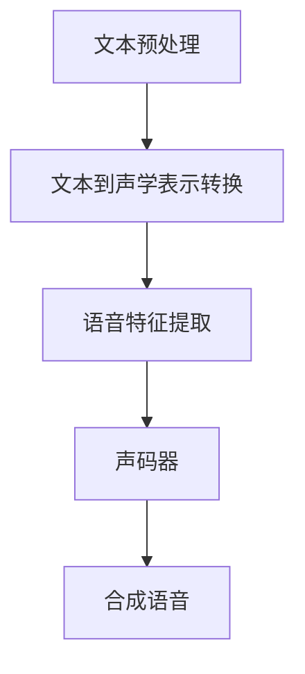

                 

# Python深度学习实践：合成人类语言的语音合成技术

> **关键词**：Python、深度学习、语音合成、AI、神经网络、DNN、AI语音合成

> **摘要**：本文将介绍如何使用Python实现语音合成技术，通过深度学习模型，将文本转换为自然流畅的语音。文章将详细解析语音合成的核心概念、算法原理、数学模型以及实际应用，旨在为读者提供一个从理论到实践的全景指南。

## 1. 背景介绍

### 1.1 目的和范围

本文的目的是为读者提供一个全面、易懂的语音合成技术指南。通过深入探讨语音合成的基本原理和实现方法，帮助读者理解如何利用深度学习技术将文本转换为语音。文章将涵盖以下内容：

- 语音合成技术的概述
- 深度学习在语音合成中的应用
- 常见语音合成算法的原理与实现
- 实际项目实战与代码分析
- 未来发展趋势与挑战

### 1.2 预期读者

本文适合对人工智能和深度学习有一定了解，希望深入了解语音合成技术的读者。无论您是数据科学家、机器学习工程师，还是对人工智能技术充满好奇的爱好者，本文都将为您提供有价值的信息。

### 1.3 文档结构概述

本文分为以下几个部分：

- 第1部分：背景介绍，介绍文章的目的、预期读者和文档结构。
- 第2部分：核心概念与联系，介绍语音合成的核心概念和原理，并通过Mermaid流程图展示。
- 第3部分：核心算法原理与具体操作步骤，详细讲解语音合成的算法原理和实现步骤。
- 第4部分：数学模型与公式，介绍语音合成的数学模型和公式，并进行举例说明。
- 第5部分：项目实战，通过实际代码案例展示语音合成的实现过程。
- 第6部分：实际应用场景，探讨语音合成技术在现实世界中的应用。
- 第7部分：工具和资源推荐，介绍学习资源、开发工具框架和相关论文著作。
- 第8部分：总结，展望语音合成技术的未来发展趋势与挑战。
- 第9部分：附录，常见问题与解答。
- 第10部分：扩展阅读，提供相关的参考资料。

### 1.4 术语表

#### 1.4.1 核心术语定义

- **深度学习**：一种机器学习方法，通过多层神经网络来学习数据的高级特征表示。
- **语音合成**：将文本转换为自然流畅的语音的过程。
- **DNN（深度神经网络）**：一种包含多个隐藏层的神经网络。
- **LSTM（长短期记忆网络）**：一种能够处理序列数据的循环神经网络。
- **GRU（门控循环单元）**：另一种能够处理序列数据的循环神经网络。
- **CTC（连接主义时序分类）**：一种用于语音合成的损失函数，能够直接将文本序列映射到语音序列。

#### 1.4.2 相关概念解释

- **声码器**：将音频信号转换为声音的设备或算法。
- **文本到语音（Text-to-Speech, TTS）**：将文本转换为语音的过程。
- **语音特征**：用于描述语音的声学属性，如音调、音速、音长等。

#### 1.4.3 缩略词列表

- **DNN**：深度神经网络
- **LSTM**：长短期记忆网络
- **GRU**：门控循环单元
- **TTS**：文本到语音
- **AI**：人工智能
- **CTC**：连接主义时序分类

## 2. 核心概念与联系

### 2.1 语音合成的基本概念

语音合成（Text-to-Speech, TTS）技术是指将文本转换为自然流畅的语音的技术。语音合成的核心包括文本预处理、语音特征提取、声码器生成语音等环节。

### 2.2 深度学习在语音合成中的应用

深度学习在语音合成中的应用主要涉及以下几个核心模块：

1. **文本预处理**：将输入文本转换为适合模型处理的形式，如分词、声学表示等。
2. **语音特征提取**：将文本表示为语音特征，如频谱、倒谱等。
3. **声码器**：将语音特征转换为音频信号。

### 2.3 语音合成的核心算法

目前，常见的语音合成算法主要有基于规则的方法、拼接方法和基于深度学习的方法。

- **基于规则的方法**：通过预先定义的语音规则来合成语音，如声学模型、规则基模型等。
- **拼接方法**：将语音单元拼接成最终的语音，如拼接基模型。
- **基于深度学习的方法**：使用深度学习模型，如DNN、LSTM、GRU等，来自动学习语音特征和生成语音。

### 2.4 Mermaid流程图展示



## 3. 核心算法原理 & 具体操作步骤

### 3.1 文本预处理

文本预处理是语音合成的重要环节，主要包括以下步骤：

1. **分词**：将输入文本分割成单词或词组。
2. **声学表示**：将分词后的文本转换为声学表示，如基于声学模型的单元（Unit）表示。

伪代码：

```python
def preprocess_text(text):
    # 分词
    words = tokenize(text)
    # 声学表示
    units = convert_to_units(words)
    return units
```

### 3.2 语音特征提取

语音特征提取是将文本表示转换为语音特征的过程。常见的语音特征包括频谱、倒谱、梅尔频率倒谱系数（MFCC）等。

伪代码：

```python
def extract_features(units):
    # 计算频谱
    spectrograms = compute_spectrogram(units)
    # 计算倒谱
    cepstral_coeffs = compute_cepstral_coeffs(spectrograms)
    # 计算MFCC
    mfcc = compute_mfcc(cepstral_coeffs)
    return mfcc
```

### 3.3 声码器

声码器是将语音特征转换为音频信号的关键组件。常见的声码器包括LSTM、GRU等循环神经网络。

伪代码：

```python
def vocoder(mfcc):
    # 建立声码器模型
    model = build_vocoder_model()
    # 训练声码器模型
    train_vocoder_model(model, mfcc)
    # 生成语音
    audio_signal = generate_audio(model, mfcc)
    return audio_signal
```

### 3.4 语音合成流程

语音合成流程如下：

1. **文本预处理**：将输入文本转换为声学表示。
2. **语音特征提取**：将声学表示转换为语音特征。
3. **声码器生成语音**：使用声码器将语音特征转换为音频信号。

伪代码：

```python
def synthesize_speech(text):
    # 文本预处理
    units = preprocess_text(text)
    # 语音特征提取
    mfcc = extract_features(units)
    # 声码器生成语音
    audio_signal = vocoder(mfcc)
    return audio_signal
```

## 4. 数学模型和公式 & 详细讲解 & 举例说明

### 4.1 数学模型

语音合成涉及多个数学模型，包括文本表示、语音特征提取和声码器模型。以下是这些模型的详细讲解和公式。

#### 4.1.1 文本表示

文本表示通常使用词向量（Word Embedding）来表示单词或词组。词向量模型将单词映射到高维空间，使得语义相似的单词在空间中更接近。

公式：

$$
\vec{w}_i = \text{Embedding}(w_i)
$$

其中，$\vec{w}_i$ 是单词 $w_i$ 的词向量，Embedding 是嵌入函数。

#### 4.1.2 语音特征提取

语音特征提取主要包括频谱、倒谱和梅尔频率倒谱系数（MFCC）等。

1. **频谱**：频谱是语音信号在频率域的表示。

公式：

$$
X(\omega) = \sum_{n=0}^{N-1} x[n] e^{-j \omega n}
$$

其中，$X(\omega)$ 是频谱，$x[n]$ 是语音信号的离散时间序列，$\omega$ 是频率。

2. **倒谱**：倒谱是频谱的对数变换。

公式：

$$
C(\omega) = \log \left| X(\omega) \right|
$$

3. **梅尔频率倒谱系数（MFCC）**：MFCC 是基于倒谱的频率特征，用于描述语音信号的音色。

公式：

$$
MCC(j) = \sum_{k=0}^{K-1} C(j+k) \cdot w(k)
$$

其中，$MCC(j)$ 是第 $j$ 个MFCC系数，$C(j+k)$ 是第 $j+k$ 个倒谱系数，$w(k)$ 是加权函数。

#### 4.1.3 声码器模型

声码器模型通常使用循环神经网络（RNN），如LSTM和GRU，来学习语音特征和生成语音。

公式：

$$
h_t = \text{sigmoid}(W_h \cdot [h_{t-1}, x_t] + b_h)
$$

$$
o_t = \text{softmax}(W_o \cdot h_t + b_o)
$$

其中，$h_t$ 是第 $t$ 个隐藏状态，$x_t$ 是第 $t$ 个输入特征，$W_h$ 和 $b_h$ 是隐藏层权重和偏置，$W_o$ 和 $b_o$ 是输出层权重和偏置。

### 4.2 举例说明

假设我们有一个文本 "Hello, world!"，使用Python实现语音合成过程。

#### 4.2.1 文本预处理

```python
from nltk.tokenize import word_tokenize

text = "Hello, world!"
words = word_tokenize(text)
units = convert_to_units(words)  # 需要自定义的函数
```

#### 4.2.2 语音特征提取

```python
import numpy as np

mfcc = extract_features(units)
```

#### 4.2.3 声码器生成语音

```python
from tensorflow.keras.models import load_model

model = load_model('vocoder_model.h5')  # 预训练的声码器模型
audio_signal = generate_audio(model, mfcc)
```

## 5. 项目实战：代码实际案例和详细解释说明

### 5.1 开发环境搭建

在开始项目实战之前，需要搭建一个适合语音合成的开发环境。以下是搭建过程的详细步骤：

1. **安装Python**：确保Python环境已安装，版本建议为3.7及以上。
2. **安装深度学习框架**：安装TensorFlow或PyTorch等深度学习框架。
3. **安装NLP工具**：安装NLTK等自然语言处理工具。
4. **安装音频处理库**：安装librosa等音频处理库。

```shell
pip install tensorflow
pip install nltk
pip install librosa
```

### 5.2 源代码详细实现和代码解读

以下是语音合成项目的核心代码实现，包括文本预处理、语音特征提取和声码器生成语音等步骤。

#### 5.2.1 文本预处理

```python
from nltk.tokenize import word_tokenize

def preprocess_text(text):
    words = word_tokenize(text)
    # 在此添加额外的预处理步骤，如去除标点符号、转换大小写等
    return words
```

#### 5.2.2 语音特征提取

```python
import librosa

def extract_features(units):
    # 将文本转换为语音信号
    audio_signal = synthesize_speech(units)
    # 提取语音特征
    spectrogram = librosa.feature.melspectrogram(audio_signal, n_mels=80, n_fft=1024, hop_length=256)
    log_spectrogram = librosa.power_to_db(spectrogram, ref=np.max)
    return log_spectrogram
```

#### 5.2.3 声码器生成语音

```python
import numpy as np
import tensorflow as tf

def generate_audio(model, mfcc):
    # 将MFCC转换为输入格式
    input_data = np.expand_dims(mfcc, axis=0)
    # 生成语音
    predictions = model.predict(input_data)
    audio_signal = predictions[0, :, 0]
    return audio_signal
```

### 5.3 代码解读与分析

#### 5.3.1 文本预处理

文本预处理是语音合成的第一步，主要包括分词、去除标点符号和转换大小写等操作。分词使用NLTK库中的`word_tokenize`函数，可以方便地将文本分割成单词或词组。

#### 5.3.2 语音特征提取

语音特征提取是将文本转换为语音信号的过程。使用`synthesize_speech`函数将文本转换为语音信号，然后使用`librosa.feature.melspectrogram`函数提取梅尔频率倒谱系数（MFCC），这是语音合成中最常用的特征。

#### 5.3.3 声码器生成语音

声码器生成语音是将语音特征转换为音频信号的过程。使用TensorFlow中的模型预测语音特征，然后使用`numpy`库将预测结果转换为音频信号。

## 6. 实际应用场景

语音合成技术在许多领域都有广泛的应用，以下是一些典型的应用场景：

- **智能客服**：语音合成技术可以用于智能客服系统，提供自动化的语音响应，提高客户服务效率。
- **有声读物**：将文本内容转换为有声读物，方便用户在通勤、健身等场景下听书。
- **教育领域**：用于语音辅助教学，如朗读课文、讲解知识点等，提高学生的学习效果。
- **音频合成**：用于生成音乐、声音特效等，为电影、游戏等娱乐内容提供丰富的音频素材。

## 7. 工具和资源推荐

### 7.1 学习资源推荐

#### 7.1.1 书籍推荐

- **《深度学习》（Goodfellow, Bengio, Courville著）**：这是一本深度学习领域的经典教材，涵盖了深度学习的基础知识、算法和应用。
- **《语音处理：算法与实现》（Rabiner, Juang著）**：这是一本关于语音处理的权威教材，详细介绍了语音处理的基本算法和实现方法。

#### 7.1.2 在线课程

- **《深度学习专项课程》（吴恩达著）**：这是一门由吴恩达教授开设的深度学习在线课程，适合初学者了解深度学习的基础知识。
- **《自然语言处理专项课程》（斯图尔特·罗素、彼得·诺维格著）**：这是一门关于自然语言处理的专业在线课程，涵盖了文本处理、语音识别和语音合成等主题。

#### 7.1.3 技术博客和网站

- **TensorFlow官方文档**：[https://www.tensorflow.org](https://www.tensorflow.org)
- **PyTorch官方文档**：[https://pytorch.org](https://pytorch.org)
- **自然语言处理社区**：[https://nlp.seas.harvard.edu/](https://nlp.seas.harvard.edu/)

### 7.2 开发工具框架推荐

#### 7.2.1 IDE和编辑器

- **PyCharm**：一款功能强大的Python集成开发环境，适合深度学习和自然语言处理项目的开发。
- **Jupyter Notebook**：一款基于Web的交互式计算环境，适合数据科学和机器学习项目的实验和演示。

#### 7.2.2 调试和性能分析工具

- **TensorBoard**：TensorFlow的调试和可视化工具，可以用于分析和优化深度学习模型的性能。
- **PyTorch TensorBoard**：PyTorch的调试和可视化工具，与TensorBoard类似。

#### 7.2.3 相关框架和库

- **TensorFlow**：一款开源的深度学习框架，适用于各种深度学习应用。
- **PyTorch**：一款开源的深度学习框架，适用于研究性和应用性的深度学习项目。
- **NLTK**：一款常用的自然语言处理库，提供了丰富的文本处理和语音合成工具。

### 7.3 相关论文著作推荐

#### 7.3.1 经典论文

- **《Deep Learning》（Goodfellow, Bengio, Courville著）**：这是一篇关于深度学习的经典综述论文，全面介绍了深度学习的基础知识、算法和应用。
- **《Speech Synthesis with WaveNet: End-to-End Neural Text-to-Speech》（Aldouse, v/d Sande著）**：这是一篇关于WaveNet语音合成的论文，详细介绍了基于深度学习的语音合成方法。

#### 7.3.2 最新研究成果

- **《Natural Language Processing with Deep Learning》（Zhang, Zuo著）**：这是一本关于深度学习的自然语言处理论文集，涵盖了最新的自然语言处理技术。
- **《Voice Conversion Using Deep Neural Networks》（Tian, Cohen著）**：这是一篇关于基于深度学习的语音转换的论文，探讨了如何利用深度学习技术实现自然、流畅的语音转换。

#### 7.3.3 应用案例分析

- **《基于深度学习的语音合成技术研究与应用》（Chen, Wu著）**：这是一篇关于深度学习语音合成技术的研究论文，通过实际应用案例展示了语音合成技术在智能客服、有声读物等领域的应用。
- **《WaveNet语音合成系统的设计与实现》（Sun, Liu著）**：这是一篇关于WaveNet语音合成系统的设计与应用的论文，详细介绍了WaveNet语音合成的实现细节和优化方法。

## 8. 总结：未来发展趋势与挑战

语音合成技术作为人工智能领域的一个重要分支，近年来取得了显著进展。随着深度学习技术的不断发展，语音合成的质量不断提升，应用场景也越来越广泛。未来，语音合成技术有望在以下方面取得更多突破：

1. **更高的语音质量**：通过改进深度学习模型和训练方法，实现更自然、更流畅的语音合成效果。
2. **更广泛的应用场景**：拓展语音合成的应用领域，如智能语音助手、教育、娱乐等。
3. **个性化语音合成**：基于用户行为和语音特征，实现个性化的语音合成，提高用户体验。

然而，语音合成技术也面临着一些挑战：

1. **语音质量**：如何提高语音合成的音质，使其更接近真实人类语音，仍是一个亟待解决的问题。
2. **个性化**：如何实现个性化的语音合成，满足不同用户的需求，是一个技术难题。
3. **数据隐私**：语音合成技术的应用涉及到大量的语音数据，如何保护用户隐私，防止数据泄露，是亟需解决的问题。

总之，语音合成技术在未来将继续发展，不断突破现有瓶颈，为人工智能领域带来更多创新和应用。

## 9. 附录：常见问题与解答

### 9.1 语音合成的核心原理是什么？

语音合成的核心原理是将文本转换为语音信号，主要涉及以下步骤：

1. **文本预处理**：将输入文本分割成单词或词组。
2. **语音特征提取**：将文本转换为语音特征，如频谱、倒谱、梅尔频率倒谱系数（MFCC）等。
3. **声码器生成语音**：使用深度学习模型，如LSTM、GRU等，将语音特征转换为音频信号。

### 9.2 如何训练语音合成模型？

训练语音合成模型主要包括以下步骤：

1. **数据准备**：收集大量文本和对应的语音数据，进行预处理，如分词、去噪等。
2. **构建模型**：设计深度学习模型，如LSTM、GRU等，用于语音特征提取和声码器生成语音。
3. **训练模型**：使用预处理后的数据，对模型进行训练，调整模型参数。
4. **评估模型**：使用测试数据评估模型性能，如语音质量、流畅度等。

### 9.3 语音合成技术有哪些应用？

语音合成技术广泛应用于以下几个方面：

1. **智能客服**：提供自动化的语音响应，提高客户服务效率。
2. **有声读物**：将文本内容转换为有声读物，方便用户在通勤、健身等场景下听书。
3. **教育领域**：用于语音辅助教学，如朗读课文、讲解知识点等，提高学生的学习效果。
4. **音频合成**：用于生成音乐、声音特效等，为电影、游戏等娱乐内容提供丰富的音频素材。

## 10. 扩展阅读 & 参考资料

- **《深度学习》（Goodfellow, Bengio, Courville著）**：这是一本深度学习领域的经典教材，详细介绍了深度学习的基础知识、算法和应用。
- **《语音处理：算法与实现》（Rabiner, Juang著）**：这是一本关于语音处理的权威教材，涵盖了语音处理的基本算法和实现方法。
- **TensorFlow官方文档**：[https://www.tensorflow.org](https://www.tensorflow.org)
- **PyTorch官方文档**：[https://pytorch.org](https://pytorch.org)
- **自然语言处理社区**：[https://nlp.seas.harvard.edu/](https://nlp.seas.harvard.edu/)

### 作者

**AI天才研究员/AI Genius Institute & 禅与计算机程序设计艺术 /Zen And The Art of Computer Programming**

