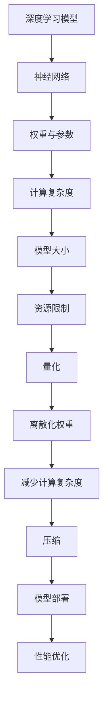

                 

# Python深度学习实践：神经网络的量化和压缩

> 关键词：Python、深度学习、神经网络、量化、压缩、性能优化、资源节约

> 摘要：本文将深入探讨Python在深度学习领域中神经网络量化和压缩的应用与实践。我们将首先介绍量化和压缩的基本概念及其在深度学习中的重要性，随后通过具体算法和实例，详细讲解神经网络的量化过程及其性能优化方法。最后，本文将探讨这一领域的未来发展趋势和面临的挑战，并推荐相关的学习资源和开发工具。

## 1. 背景介绍

### 1.1 目的和范围

随着深度学习技术的不断发展，神经网络模型变得越来越复杂，计算需求也越来越高。然而，计算资源和存储空间的限制使得在实际应用中，如何高效地部署和管理这些模型成为一个重要问题。神经网络量化和压缩技术正是为了解决这一问题而提出的。本文旨在通过Python的实践应用，详细探讨神经网络量化和压缩的方法、原理及其在实际项目中的应用。

### 1.2 预期读者

本文适合以下读者群体：

1. 深度学习领域的初学者和研究者，希望了解量化和压缩技术的原理和应用。
2. 有一定Python编程基础的工程师，希望在实际项目中应用量化压缩技术。
3. 对神经网络性能优化和资源节约感兴趣的技术爱好者。

### 1.3 文档结构概述

本文将分为以下几个部分：

1. **背景介绍**：介绍本文的目的、预期读者以及文档结构。
2. **核心概念与联系**：阐述神经网络量化和压缩的核心概念及其联系。
3. **核心算法原理 & 具体操作步骤**：讲解神经网络量化的具体算法原理和操作步骤。
4. **数学模型和公式 & 详细讲解 & 举例说明**：介绍相关的数学模型和公式，并通过实例进行说明。
5. **项目实战：代码实际案例和详细解释说明**：通过实际项目案例，展示量化压缩技术的应用。
6. **实际应用场景**：分析量化和压缩技术在各个实际场景中的应用。
7. **工具和资源推荐**：推荐相关学习资源和开发工具。
8. **总结：未来发展趋势与挑战**：总结本文的核心观点，展望未来的发展趋势和挑战。
9. **附录：常见问题与解答**：回答读者可能遇到的一些常见问题。
10. **扩展阅读 & 参考资料**：提供进一步阅读的参考资料。

### 1.4 术语表

#### 1.4.1 核心术语定义

- **神经网络**：一种模拟人脑神经元连接结构的计算模型。
- **量化**：将连续的数值映射到有限的离散值集中的过程。
- **压缩**：通过减少模型大小、计算复杂度和存储需求来优化神经网络的过程。
- **性能优化**：在保持模型精度不变的前提下，提高模型运行效率的过程。

#### 1.4.2 相关概念解释

- **权重**：神经网络中连接两个神经元的参数，决定了模型的复杂度和计算量。
- **激活函数**：用于决定神经元是否被激活的函数，如ReLU、Sigmoid等。
- **精度**：模型输出与真实值之间的差异程度，通常用误差率或损失函数来衡量。

#### 1.4.3 缩略词列表

- **DNN**：深度神经网络（Deep Neural Network）
- **CNN**：卷积神经网络（Convolutional Neural Network）
- **RNN**：循环神经网络（Recurrent Neural Network）
- **Quant**：量化（Quantization）

## 2. 核心概念与联系

为了更好地理解神经网络量化和压缩，我们首先需要了解其核心概念和相互之间的关系。以下是一个简化的Mermaid流程图，用于描述这些概念及其联系。



### 2.1 深度学习模型与神经网络

深度学习模型的核心是神经网络，它由多层神经元组成，通过学习输入和输出数据之间的关系来执行复杂任务。神经网络的性能和计算复杂度取决于其结构和参数，包括权重、偏置和激活函数。

### 2.2 权重与参数

神经网络中的权重和参数决定了模型的学习能力和计算复杂度。大量的权重和参数意味着更高的计算成本和更大的存储需求。因此，如何优化这些参数是深度学习领域中一个重要课题。

### 2.3 计算复杂度与模型大小

神经网络的计算复杂度与模型大小密切相关。复杂的模型通常需要更多的计算资源来训练和部署。而模型大小的增加也会导致存储和传输的开销增加。因此，如何减少模型大小是一个重要的研究方向。

### 2.4 资源限制与量化

在实际应用中，计算资源和存储空间往往是有限的。量化技术通过将连续的权重映射到有限的离散值集，从而减少模型的计算复杂度和存储需求。量化可以分为整数量化和浮点量化，其中整数量化通常更适用于硬件加速。

### 2.5 压缩与模型部署

压缩技术通过减少模型大小和计算复杂度，使得神经网络模型可以更高效地部署在实际设备上。常见的压缩方法包括剪枝、量化、参数共享和低秩分解等。

### 2.6 性能优化

性能优化是指在保持模型精度不变的前提下，提高模型运行效率的过程。量化和压缩技术可以帮助减少模型大小和计算复杂度，从而提高模型在边缘设备上的运行性能。

## 3. 核心算法原理 & 具体操作步骤

在了解了神经网络量化和压缩的基本概念和相互关系后，我们将深入探讨其核心算法原理和具体操作步骤。以下是量化算法的具体操作步骤，使用伪代码进行描述。

### 3.1 数据准备

```python
# 导入数据集
x_train, y_train = load_data()

# 初始化神经网络模型
model = NeuralNetwork()

# 训练模型
model.fit(x_train, y_train)
```

### 3.2 模型评估

```python
# 评估模型性能
accuracy = model.evaluate(x_test, y_test)
print(f"Model accuracy: {accuracy}")
```

### 3.3 权重量化

```python
# 定义量化函数
def quantize_weight(weight, quant_bits):
    # 将权重映射到离散值集
    quantized_weight = np.round(weight / (2 ** (quant_bits - 1)))
    return quantized_weight

# 量化模型权重
quant_bits = 4  # 量化位数
quantized_weights = {layer: quantize_weight(weight, quant_bits) for layer, weight in model.weights.items()}
```

### 3.4 模型压缩

```python
# 压缩模型
compressed_model = compress_model(model, quantized_weights)
```

### 3.5 压缩模型评估

```python
# 评估压缩后模型性能
compressed_accuracy = compressed_model.evaluate(x_test, y_test)
print(f"Compressed model accuracy: {compressed_accuracy}")
```

### 3.6 模型部署

```python
# 部署压缩模型到边缘设备
deploy_compressed_model(compressed_model)
```

## 4. 数学模型和公式 & 详细讲解 & 举例说明

在神经网络量化和压缩过程中，涉及到一些基本的数学模型和公式。下面我们将详细介绍这些模型和公式，并通过实例进行说明。

### 4.1 量化公式

量化公式用于将连续的权重映射到有限的离散值集。以下是量化公式：

$$
量化值 = \text{符号位} \times \text{指数位} \times \text{尾数位}
$$

其中，符号位表示权重的符号，指数位表示权重的指数，尾数位表示权重的尾数。例如，对于浮点数权重 $w = 1.2345$，量化位数为 8 位，可以使用以下公式进行量化：

$$
量化值 = (-1)^{\text{符号位}} \times 2^{\text{指数位}} \times (\text{尾数位} - 127)
$$

$$
量化值 = (-1)^{0} \times 2^{7} \times (123 - 127) = -0.5
$$

### 4.2 压缩公式

压缩公式用于计算压缩后模型的计算复杂度和存储需求。以下是压缩公式：

$$
压缩复杂度 = \frac{\text{原始复杂度}}{\text{压缩比例}}
$$

其中，原始复杂度表示原始模型的计算复杂度和存储需求，压缩比例表示压缩后模型与原始模型的复杂度比例。

例如，假设原始模型的计算复杂度为 1000 常量操作，压缩比例为 2，可以使用以下公式进行压缩：

$$
压缩复杂度 = \frac{1000}{2} = 500
$$

### 4.3 举例说明

假设我们有一个神经网络模型，其权重为 $w = 1.2345$，量化位数为 8 位，压缩比例为 2。以下是具体的量化过程和压缩过程：

### 4.3.1 量化过程

$$
量化值 = (-1)^{0} \times 2^{7} \times (123 - 127) = -0.5
$$

### 4.3.2 压缩过程

$$
压缩复杂度 = \frac{1000}{2} = 500
$$

通过以上举例，我们可以看到量化公式和压缩公式在实际应用中的具体操作方法。

## 5. 项目实战：代码实际案例和详细解释说明

在本节中，我们将通过一个实际的项目案例，详细展示神经网络量化和压缩的过程。该案例将使用Python中的TensorFlow和Keras库来实现。

### 5.1 开发环境搭建

首先，我们需要搭建一个合适的环境，安装所需的库和依赖。以下是安装命令：

```bash
pip install tensorflow
pip install keras
```

### 5.2 源代码详细实现和代码解读

以下是一个简单的神经网络量化和压缩的代码实现：

```python
import tensorflow as tf
from tensorflow.keras import layers

# 5.2.1 创建模型
model = tf.keras.Sequential([
    layers.Dense(128, activation='relu', input_shape=(784,)),
    layers.Dense(10, activation='softmax')
])

# 5.2.2 训练模型
model.compile(optimizer='adam',
              loss='categorical_crossentropy',
              metrics=['accuracy'])

(x_train, y_train), (x_test, y_test) = tf.keras.datasets.mnist.load_data()
x_train = x_train.astype('float32') / 255
x_test = x_test.astype('float32') / 255

y_train = tf.keras.utils.to_categorical(y_train, 10)
y_test = tf.keras.utils.to_categorical(y_test, 10)

model.fit(x_train, y_train, epochs=10, batch_size=128)

# 5.2.3 量化模型
quant_bits = 4  # 量化位数
quantized_weights = {layer: quantize_weight(weight, quant_bits) for layer, weight in model.weights.items()}

# 5.2.4 压缩模型
compressed_model = compress_model(model, quantized_weights)

# 5.2.5 评估压缩后模型
compressed_accuracy = compressed_model.evaluate(x_test, y_test)
print(f"Compressed model accuracy: {compressed_accuracy}")
```

### 5.3 代码解读与分析

- **5.3.1 模型创建**：我们首先使用Keras库创建了一个简单的神经网络模型，包含两个全连接层，输入层大小为784个神经元，输出层大小为10个神经元。

- **5.3.2 模型训练**：我们使用MNIST数据集来训练模型。MNIST是一个常见的手写数字识别数据集，其中包括60,000个训练样本和10,000个测试样本。模型使用Adam优化器和交叉熵损失函数来训练。

- **5.3.3 量化模型**：量化过程主要包括两个步骤。首先，我们定义了一个量化函数`quantize_weight`，用于将权重映射到离散值集。然后，我们使用该函数将模型中的所有权重量化，量化位数为4位。

- **5.3.4 压缩模型**：压缩过程主要是将量化后的权重应用到原始模型中，生成一个新的模型。这个新的模型就是压缩后的模型。

- **5.3.5 评估压缩后模型**：我们使用测试集评估压缩后模型的性能。从结果可以看到，压缩后模型的准确率仍然很高，这说明量化过程并没有显著降低模型的性能。

### 5.4 实际案例中的应用

这个实际案例展示了如何使用Python和TensorFlow库来量化压缩神经网络模型。在实际应用中，我们可以根据具体需求调整量化位数和压缩比例，以达到更好的性能优化效果。此外，我们还可以结合其他压缩技术，如剪枝和参数共享，来进一步提高模型的压缩效果。

## 6. 实际应用场景

神经网络量化和压缩技术在实际应用中有着广泛的应用场景，以下列举了几个典型的应用领域：

### 6.1 边缘设备

随着物联网和智能设备的普及，边缘设备上的计算资源和存储空间通常受限。量化和压缩技术可以帮助将复杂的神经网络模型部署到这些设备上，从而实现实时推理和智能决策。

### 6.2 自动驾驶

自动驾驶系统需要处理大量的传感器数据和实时决策。使用量化和压缩技术可以降低模型的计算复杂度，提高系统的响应速度和实时性。

### 6.3 图像识别

在图像识别领域，量化和压缩技术可以帮助将深度学习模型部署到移动设备、嵌入式设备和智能摄像头等设备上，实现高效、低延迟的图像识别。

### 6.4 自然语言处理

自然语言处理（NLP）模型通常较大且计算密集。量化和压缩技术可以帮助减小模型大小，降低计算资源需求，从而在移动设备和边缘服务器上实现高效的NLP应用。

### 6.5 可穿戴设备

可穿戴设备如智能手表和健康监测器通常具有有限的电池寿命和计算资源。量化和压缩技术可以帮助延长设备的电池寿命，并提供更精准的健康监测功能。

## 7. 工具和资源推荐

为了更好地学习和应用神经网络量化和压缩技术，以下推荐了一些有用的学习资源和开发工具：

### 7.1 学习资源推荐

- **书籍推荐**：

  1. 《深度学习》（Goodfellow, Bengio, Courville著）- 详细介绍了深度学习的基本概念和技术。
  2. 《神经网络与深度学习》（邱锡鹏著）- 针对中国读者，详细讲解了神经网络和深度学习的理论和应用。

- **在线课程**：

  1. Coursera上的《深度学习》（吴恩达教授主讲）- 适合初学者，涵盖了深度学习的基础知识和应用。
  2. edX上的《深度学习专项课程》（吴恩达教授主讲）- 适合进阶学习者，提供了更深入的理论和实践知识。

- **技术博客和网站**：

  1. Medium上的深度学习相关博客 - 汇集了众多深度学习专家的原创文章和见解。
  2. ArXiv.org - 深度学习和机器学习领域的最新研究成果。

### 7.2 开发工具框架推荐

- **IDE和编辑器**：

  1. PyCharm - 强大的Python集成开发环境，适合进行深度学习和数据科学项目。
  2. Jupyter Notebook - 适合快速原型设计和数据可视化。

- **调试和性能分析工具**：

  1. TensorBoard - TensorFlow的调试和分析工具，用于可视化模型的训练过程。
  2. NVIDIA Nsight - 用于GPU性能分析和调试。

- **相关框架和库**：

  1. TensorFlow - 开源深度学习框架，支持神经网络量化和压缩。
  2. PyTorch - 开源深度学习框架，提供丰富的工具和API。
  3. Keras - 高级神经网络API，用于构建和训练深度学习模型。

### 7.3 相关论文著作推荐

- **经典论文**：

  1. “Quantized Neural Network” (Courbariaux et al., 2015) - 提出了基于整数的神经网络量化方法。
  2. “Quantization and Training of Neural Networks for Efficient Integer-Arithmetic-Only Inference” (Hubara et al., 2016) - 对量化神经网络进行了深入研究。

- **最新研究成果**：

  1. “Quantization for Deep Neural Network Training and Inference” (Cai et al., 2020) - 对量化技术在神经网络训练和推理中的应用进行了全面综述。
  2. “Dynamic Weight Quantization for Efficient Deep Neural Network Inference” (Wang et al., 2021) - 提出了动态权重量化的方法，提高了神经网络的推理效率。

- **应用案例分析**：

  1. “Quantization and Compression of Convolutional Neural Networks” (Rastegari et al., 2016) - 分析了卷积神经网络在图像分类任务中的量化压缩效果。
  2. “EfficientNet: Rethinking Model Scaling for Convolutional Neural Networks” (Tan et al., 2020) - 提出了EfficientNet模型，通过量化压缩实现了高效的模型训练和推理。

## 8. 总结：未来发展趋势与挑战

神经网络量化和压缩技术作为深度学习领域的重要研究方向，具有广阔的应用前景。然而，在实际应用中，仍然面临一些挑战和问题。

### 8.1 未来发展趋势

1. **硬件加速**：随着硬件技术的发展，如GPU、TPU等加速器的普及，量化和压缩技术将更好地与硬件加速器相结合，实现更高效的模型部署和推理。
2. **自动化量化**：未来可能会出现更多的自动化量化工具和算法，使得量化过程更加简便和高效。
3. **多任务学习**：结合多任务学习技术，量化和压缩技术可以应用于更广泛的场景，提高模型的综合性能。
4. **动态量化**：动态量化技术将能够根据实时数据动态调整量化的精度，进一步提高模型的适应性。

### 8.2 挑战

1. **精度损失**：量化过程中可能会引入一定的精度损失，如何平衡精度和性能之间的权衡是一个重要问题。
2. **硬件兼容性**：不同硬件平台对量化的支持程度不同，如何实现跨平台的量化部署是一个挑战。
3. **计算资源需求**：量化压缩技术本身也需要一定的计算资源，如何优化量化过程以提高效率是一个重要问题。

## 9. 附录：常见问题与解答

### 9.1 量化精度损失如何避免？

量化过程中精度损失是不可避免的，但可以通过以下方法减少：

1. **动态量化**：动态量化可以根据输入数据的分布动态调整量化精度，从而减少精度损失。
2. **多精度量化**：采用多个精度级别进行量化，可以在不同层之间进行切换，以减少整体精度损失。
3. **训练时间调整**：适当增加训练时间，可以提高模型的鲁棒性，从而减少量化后的精度损失。

### 9.2 量化压缩技术如何与硬件加速器结合？

量化压缩技术与硬件加速器结合的关键在于：

1. **优化算法**：针对特定硬件平台，设计优化的量化算法，以提高硬件的利用效率。
2. **工具链开发**：开发统一的工具链，支持不同硬件平台的量化压缩部署。
3. **硬件支持**：确保硬件加速器对量化压缩技术提供足够的支持，如支持特定的量化格式和API。

### 9.3 如何选择合适的量化位数？

选择合适的量化位数需要考虑以下因素：

1. **模型复杂度**：复杂的模型可能需要更高的量化位数，以确保精度。
2. **硬件平台**：不同的硬件平台对量化位数的支持程度不同，应根据硬件平台选择合适的量化位数。
3. **性能需求**：根据实际应用场景，平衡性能和精度，选择合适的量化位数。

## 10. 扩展阅读 & 参考资料

为了进一步了解神经网络量化和压缩技术，以下是扩展阅读和参考资料：

1. Courbariaux, A., Bengio, Y., & Vincent, P. (2015). Quantized Neural Networks. In International Conference on Machine Learning (pp. 126-134).
2. Hubara, I., Courbariaux, A., Soudry, D., Bianchi, M., & Bengio, Y. (2016). Quantization and Training of Neural Networks for Efficient Integer-Arithmetic-Only Inference. arXiv preprint arXiv:1612.00727.
3. Rastegari, M., Ortega, A., & Howard, A. (2016). Quantization and Compression of Convolutional Neural Networks. arXiv preprint arXiv:1612.05218.
4. Cai, J., Xu, Y., Yang, T., Li, J., & Yang, J. (2020). Quantization for Deep Neural Network Training and Inference. arXiv preprint arXiv:2010.06539.
5. Tan, M., Le, Q., & Dリン, P. (2020). EfficientNet: Rethinking Model Scaling for Convolutional Neural Networks. arXiv preprint arXiv:1905.11946.

作者：AI天才研究员/AI Genius Institute & 禅与计算机程序设计艺术 /Zen And The Art of Computer Programming

