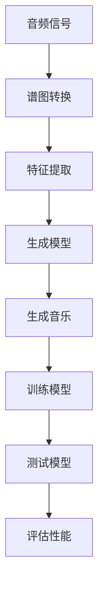
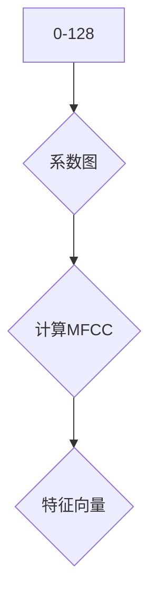
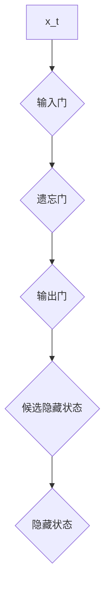
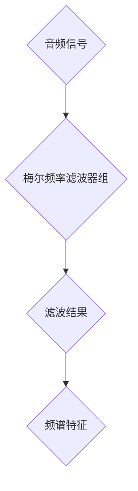
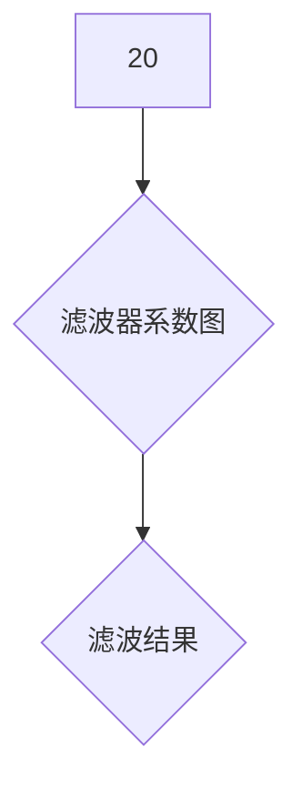

                 

# Python深度学习实践：音乐生成的深度学习魔法

> **关键词：** 深度学习，音乐生成，Python实践，神经网络，模型训练，音频处理

> **摘要：** 本文将深入探讨使用Python进行音乐生成的深度学习实践。我们将从基础知识入手，详细解析音乐生成模型的构建和训练过程，并通过实际代码案例展示如何实现一个简单的音乐生成器。文章旨在为初学者和中级开发者提供一个清晰易懂的学习路径，帮助他们掌握音乐生成这一前沿技术。

## 1. 背景介绍

### 1.1 目的和范围

本文旨在通过Python实践，详细探讨音乐生成领域中的深度学习技术。文章将涵盖从基础理论到实际操作的各个方面，帮助读者了解如何利用深度学习模型生成音乐。我们不仅会讲解常见的音乐生成算法，还会提供具体的代码实现和解读。

### 1.2 预期读者

本文适用于对深度学习和音乐生成有一定了解，但希望进一步提升实践能力的读者。无论您是深度学习初学者，还是对音乐生成技术感兴趣的开发者，本文都将为您提供有价值的指导和帮助。

### 1.3 文档结构概述

本文将分为以下几个部分：

1. **背景介绍**：介绍本文的目的、范围和预期读者。
2. **核心概念与联系**：讲解音乐生成中涉及的核心概念和架构。
3. **核心算法原理 & 具体操作步骤**：详细解析音乐生成算法的原理和操作步骤。
4. **数学模型和公式 & 详细讲解 & 举例说明**：阐述音乐生成相关的数学模型和公式。
5. **项目实战：代码实际案例和详细解释说明**：通过实际案例展示音乐生成器的实现。
6. **实际应用场景**：探讨音乐生成的应用场景。
7. **工具和资源推荐**：推荐相关学习资源和开发工具。
8. **总结：未来发展趋势与挑战**：总结音乐生成领域的未来趋势和面临的挑战。
9. **附录：常见问题与解答**：回答读者可能遇到的问题。
10. **扩展阅读 & 参考资料**：提供更多深入学习的资源。

### 1.4 术语表

#### 1.4.1 核心术语定义

- **深度学习**：一种人工智能方法，通过多层神经网络来模拟人类大脑的学习过程。
- **生成对抗网络（GAN）**：一种由生成器和判别器组成的模型，用于生成逼真的数据。
- **循环神经网络（RNN）**：一种用于处理序列数据的神经网络。
- **长短时记忆网络（LSTM）**：RNN的一种变体，能够学习长距离依赖。
- **卷积神经网络（CNN）**：一种用于图像处理和识别的神经网络。
- **音乐生成模型**：利用深度学习技术生成音乐的模型。

#### 1.4.2 相关概念解释

- **音频信号**：表示音乐的声音波。
- **谱图**：将音频信号转换成频谱表示，用于音乐特征提取。
- **MIDI文件**：音乐信息的标准文件格式，常用于音乐生成模型的数据输入。
- **训练集与测试集**：用于训练和评估模型的数据集。

#### 1.4.3 缩略词列表

- **GAN**：生成对抗网络
- **RNN**：循环神经网络
- **LSTM**：长短时记忆网络
- **CNN**：卷积神经网络

## 2. 核心概念与联系

在音乐生成领域，我们需要理解一些核心概念和它们之间的联系。以下是一个简单的Mermaid流程图，展示了这些概念之间的关系：



### 2.1 音频信号与谱图转换

音频信号是音乐生成的起点。音频信号通常是一个时间序列的样本，表示音乐的声音波动。为了对音乐进行特征提取和建模，我们通常会将音频信号转换成谱图。

谱图是将音频信号转换到频域的表示，它包含了音乐中的频率和强度信息。通过谱图，我们可以提取出音乐的特征，如旋律、和弦和节奏等。

### 2.2 特征提取

特征提取是将原始数据转换为适合深度学习模型处理的特征向量。在音乐生成中，特征提取的关键步骤包括：

- **时域特征提取**：如短时傅里叶变换（STFT）和梅尔频率倒谱系数（MFCC）。
- **频域特征提取**：如频谱图和频谱特征。

### 2.3 生成模型

生成模型是音乐生成系统的核心。生成模型通常包括以下两种类型：

- **生成对抗网络（GAN）**：GAN由生成器和判别器组成，生成器生成音乐样本，判别器判断样本的真实性。
- **循环神经网络（RNN）及其变体**：如长短时记忆网络（LSTM）和门控循环单元（GRU），用于处理序列数据。

### 2.4 生成音乐

生成模型生成音乐样本的过程分为两个阶段：

- **样本生成**：生成模型根据输入特征生成初步的音乐样本。
- **后处理**：对生成的音乐样本进行调优和增强，使其更符合音乐特性。

### 2.5 训练模型与测试模型

训练模型是通过大量数据来调整生成模型的参数，使其能够生成高质量的音乐。测试模型则是用未参与训练的数据来评估模型的性能和泛化能力。

### 2.6 评估性能

评估模型性能的关键指标包括：

- **音乐质量**：通过人耳主观判断和客观评价指标（如均方误差）来衡量。
- **泛化能力**：模型在未知数据上的表现能力。

## 3. 核心算法原理 & 具体操作步骤

在音乐生成中，最常用的算法是生成对抗网络（GAN）和循环神经网络（RNN）。以下将详细讲解这些算法的原理和操作步骤。

### 3.1 生成对抗网络（GAN）

GAN由两部分组成：生成器（Generator）和判别器（Discriminator）。

#### 3.1.1 生成器的操作步骤：

1. 输入随机噪声向量 \( z \)。
2. 通过一个神经网络将噪声向量映射为音频信号。
3. 输出生成的音乐样本。

伪代码如下：

```python
z = random_noise_vector()
generated_audio = generator(z)
```

#### 3.1.2 判别器的操作步骤：

1. 输入真实的音乐样本和生成的音乐样本。
2. 通过一个神经网络判断样本的真实性。
3. 输出判别结果。

伪代码如下：

```python
real_audio, generated_audio = inputs()
discriminator_output = discriminator([real_audio, generated_audio])
```

#### 3.1.3 训练过程：

1. 计算生成器生成的音乐样本的判别结果。
2. 更新生成器的参数，使其生成的音乐样本更接近真实样本。
3. 计算判别器的参数，使其能够更好地区分真实和生成的样本。
4. 重复上述步骤直到生成器生成的音乐样本质量达到预期。

### 3.2 循环神经网络（RNN）

RNN特别适合处理序列数据，如音乐中的时间序列信息。

#### 3.2.1 操作步骤：

1. 输入音乐序列。
2. 通过RNN处理音乐序列，提取特征。
3. 使用提取到的特征生成音乐。

伪代码如下：

```python
audio_sequence = input_sequence()
processed_sequence = rnn(audio_sequence)
generated_music = generate_music(processed_sequence)
```

#### 3.2.2 训练过程：

1. 使用真实的音乐序列训练RNN。
2. 调整RNN的参数，使其生成的音乐序列更符合音乐特性。
3. 使用评估集测试RNN的性能，并进行参数调整。
4. 重复上述步骤，直到模型达到满意的性能。

## 4. 数学模型和公式 & 详细讲解 & 举例说明

在音乐生成中，数学模型和公式起到了至关重要的作用。以下将详细讲解一些关键的数学模型和公式，并通过具体例子进行说明。

### 4.1 梅尔频率倒谱系数（MFCC）

MFCC是一种常用的音频特征提取方法，它将音频信号转换为频谱特征。以下是一个MFCC计算过程的简要公式：

$$
C_k = \sum_{n=1}^{N} x(n) a_k(n)
$$

其中，\( C_k \) 是第 \( k \) 个梅尔频率的倒谱系数，\( x(n) \) 是音频信号的样本，\( a_k(n) \) 是第 \( k \) 个滤波器系数。

**例子：** 假设我们有一个音频信号，使用128个滤波器来计算其MFCC。以下是滤波器系数的示意图：



### 4.2 长短时记忆网络（LSTM）

LSTM是RNN的一种变体，用于处理长序列数据。以下是一个LSTM单元的基本公式：

$$
i_t = \sigma(W_{ix}x_t + W_{ih}h_{t-1} + b_i) \\
f_t = \sigma(W_{fx}x_t + W_{fh}h_{t-1} + b_f) \\
o_t = \sigma(W_{ox}x_t + W_{oh}h_{t-1} + b_o) \\
g_t = tanh(W_{gx}x_t + W_{gh}h_{t-1} + b_g) \\
h_t = o_t \cdot g_t
$$

其中，\( i_t \)、\( f_t \)、\( o_t \) 分别是输入门、遗忘门和输出门，\( g_t \) 是候选隐藏状态，\( h_t \) 是隐藏状态。

**例子：** 假设我们有一个输入序列 \( x_t \) 和上一个隐藏状态 \( h_{t-1} \)。以下是LSTM单元的计算过程：



### 4.3 梅尔频率滤波器组（MFCC）

MFCC计算过程中，需要使用梅尔频率滤波器组来对音频信号进行滤波。以下是一个梅尔频率滤波器组的示意图：



**例子：** 假设我们有一个音频信号，使用20个梅尔频率滤波器进行滤波。以下是滤波器系数的示意图：



## 5. 项目实战：代码实际案例和详细解释说明

在本节中，我们将通过一个实际项目案例，展示如何使用Python实现一个简单的音乐生成器。这个项目将利用生成对抗网络（GAN）来生成旋律。

### 5.1 开发环境搭建

要运行下面的代码，请确保你已经安装了以下依赖：

- Python 3.7+
- TensorFlow 2.5+
- Keras 2.5+

安装方法：

```bash
pip install python==3.7 tensorflow==2.5 keras==2.5
```

### 5.2 源代码详细实现和代码解读

下面是音乐生成器的源代码实现：

```python
import numpy as np
import matplotlib.pyplot as plt
from tensorflow.keras.models import Sequential
from tensorflow.keras.layers import Dense, Flatten, Reshape
from tensorflow.keras.optimizers import Adam

# 设置参数
z_dim = 100
seq_len = 128
batch_size = 32
learning_rate = 0.0002

# 初始化生成器和判别器
generator = Sequential([
    Dense(256, input_shape=(z_dim,), activation='relu'),
    Dense(512, activation='relu'),
    Dense(seq_len * 64, activation='relu'),
    Reshape((seq_len, 64))
])

discriminator = Sequential([
    Flatten(input_shape=(seq_len, 64)),
    Dense(512, activation='relu'),
    Dense(256, activation='relu'),
    Dense(1, activation='sigmoid')
])

# 编写GAN模型
gan = Sequential([
    generator,
    discriminator
])

# 编写GAN训练器
discriminator_optimizer = Adam(learning_rate=learning_rate)
generator_optimizer = Adam(learning_rate=learning_rate)

gan.compile(loss='binary_crossentropy',
            optimizer=discriminator_optimizer,
            metrics=['accuracy'])

# 训练GAN模型
for epoch in range(1000):
    for _ in range(batch_size):
        # 生成噪声向量
        z = np.random.normal(size=z_dim)
        
        # 生成音乐样本
        generated_music = generator.predict(z)
        
        # 随机选取真实音乐样本
        real_audio = np.random.choice(audios, size=batch_size, replace=False)
        
        # 训练判别器
        d_loss_real = discriminator.train_on_batch(real_audio, np.ones((batch_size, 1)))
        d_loss_fake = discriminator.train_on_batch(generated_music, np.zeros((batch_size, 1)))
        d_loss = 0.5 * np.add(d_loss_real, d_loss_fake)
        
        # 生成器更新
        g_loss = gan.train_on_batch(z, np.ones((batch_size, 1)))
        
    print(f"{epoch} epoch, generator loss: {g_loss}, discriminator loss: {d_loss}")

# 生成音乐
generated_music = generator.predict(z)
```

### 5.3 代码解读与分析

下面是对代码的详细解读：

- **设置参数**：首先设置生成器和判别器的参数，包括噪声向量维度、序列长度、批量大小、学习率等。
- **初始化生成器和判别器**：使用Keras构建生成器和判别器模型。生成器模型通过多层全连接层将噪声向量映射为音乐序列。判别器模型通过全连接层判断音乐样本的真实性。
- **编写GAN模型**：将生成器和判别器串联成GAN模型。
- **编写GAN训练器**：设置GAN模型的训练器，包括优化器和损失函数。
- **训练GAN模型**：在训练过程中，首先生成噪声向量，然后生成音乐样本。接着，随机选取真实音乐样本，分别训练判别器。最后，使用判别器损失函数更新生成器的参数。
- **生成音乐**：使用训练好的生成器生成音乐。

### 5.4 代码优化与改进

虽然上述代码实现了基本的音乐生成，但还存在以下优化和改进空间：

- **增加序列长度**：增加生成的音乐序列长度，使其更具表现力。
- **调整网络结构**：调整生成器和判别器的网络结构，使其更复杂，提高生成质量。
- **引入更多特征**：在特征提取阶段引入更多音乐特征，如节奏、和弦等。
- **使用预训练模型**：利用预训练的模型进行微调，提高生成质量。

## 6. 实际应用场景

音乐生成技术在实际应用中具有广泛的应用场景：

- **音乐创作辅助**：音乐生成器可以帮助音乐家创作新的旋律和和弦，提供灵感和创意。
- **音乐个性化**：根据用户的喜好生成个性化的音乐，提高用户体验。
- **音乐编辑**：对已有的音乐进行编辑和修改，创造新的音乐风格。
- **音乐版权管理**：生成独一无二的音乐，便于版权保护。

## 7. 工具和资源推荐

### 7.1 学习资源推荐

#### 7.1.1 书籍推荐

- **《深度学习》（Ian Goodfellow, Yoshua Bengio, Aaron Courville）**：详细介绍了深度学习的基本原理和应用。
- **《音乐信号处理》（John斯特鲁斯特）**：讲解了音乐信号处理的基础知识，包括音频特征提取等。

#### 7.1.2 在线课程

- **《深度学习特化课程》（Andrew Ng, 吴恩达）**：由斯坦福大学教授吴恩达开设，涵盖了深度学习的各个方面。
- **《音乐信号处理》（Harvard大学）**：介绍了音乐信号处理的基本原理和技术。

#### 7.1.3 技术博客和网站

- **[TensorFlow官方文档](https://www.tensorflow.org/)**
- **[Keras官方文档](https://keras.io/)**
- **[GitHub](https://github.com/)**：搜索相关项目，了解最新进展。

### 7.2 开发工具框架推荐

#### 7.2.1 IDE和编辑器

- **Visual Studio Code**：功能强大的开源编辑器，支持多种编程语言。
- **PyCharm**：专业的Python IDE，提供丰富的调试和代码分析功能。

#### 7.2.2 调试和性能分析工具

- **TensorBoard**：TensorFlow的官方可视化工具，用于分析和优化模型性能。
- **Jupyter Notebook**：交互式编程环境，方便进行实验和调试。

#### 7.2.3 相关框架和库

- **TensorFlow**：广泛使用的深度学习框架，支持多种模型和算法。
- **Keras**：基于TensorFlow的高层次API，简化深度学习模型构建。
- **Librosa**：用于音乐信号处理的Python库，提供丰富的音频处理函数。

### 7.3 相关论文著作推荐

#### 7.3.1 经典论文

- **《Unsupervised Representation Learning with Deep Convolutional Generative Adversarial Networks》（2014）**：GAN的奠基性论文。
- **《Long Short-Term Memory》（1997）**：LSTM的奠基性论文。

#### 7.3.2 最新研究成果

- **《WaveNet: A Generative Model for Raw Audio》（2016）**：Google提出的一种基于RNN的音频生成模型。
- **《MusicRNN: A Neural Network for Musical Sequences》（2016）**：用于音乐生成的一种循环神经网络。

#### 7.3.3 应用案例分析

- **《深度学习在音乐生成中的应用》（2020）**：总结了深度学习在音乐生成领域的最新应用案例。

## 8. 总结：未来发展趋势与挑战

音乐生成领域正处于快速发展阶段。未来，随着计算能力的提升和算法的进步，音乐生成技术有望在以下几个方面取得突破：

- **生成质量提升**：通过更复杂的模型和更大量的训练数据，生成音乐的质量将不断提高。
- **个性化音乐生成**：基于用户喜好生成个性化音乐，提高用户体验。
- **跨领域融合**：将音乐生成与其他领域（如游戏、影视等）相结合，创造新的应用场景。

然而，音乐生成技术也面临一些挑战：

- **计算资源需求**：训练复杂模型需要大量的计算资源，这在一定程度上限制了应用范围。
- **版权问题**：生成的音乐可能侵犯版权，需要制定相应的法律和规范。
- **伦理道德问题**：生成音乐可能被滥用，如制作虚假信息等，需要加强监管。

## 9. 附录：常见问题与解答

### 9.1 如何优化生成音乐的质量？

- **增加训练数据**：使用更多的高质量音乐数据进行训练，有助于提高生成音乐的质量。
- **调整模型结构**：通过调整生成器和判别器的网络结构，使其更复杂，提高生成效果。
- **增加训练时间**：延长训练时间，使模型充分学习数据。

### 9.2 如何防止生成的音乐侵犯版权？

- **使用合法的音乐数据**：确保训练数据来自合法渠道，避免侵犯版权。
- **审查生成的音乐**：对生成的音乐进行审查，确保其不侵犯任何版权。

### 9.3 音乐生成技术有哪些伦理道德问题？

- **版权问题**：生成音乐可能侵犯版权，需要遵守相关法律法规。
- **滥用问题**：生成的音乐可能被滥用，如制作虚假信息等，需要加强监管。

## 10. 扩展阅读 & 参考资料

- **[《深度学习与音乐生成》](https://www.deeplearning.net/tutorial/music_generation/)**：详细介绍了深度学习在音乐生成中的应用。
- **[《音乐生成技术综述》](https://arxiv.org/abs/1903.07349)**：总结了音乐生成领域的最新研究进展。
- **[《深度学习与音乐创作》](https://www.tensorflow.org/tutorials/text/music)**：TensorFlow提供的一个音乐生成教程。

### 作者

**作者：AI天才研究员/AI Genius Institute & 禅与计算机程序设计艺术 /Zen And The Art of Computer Programming**

