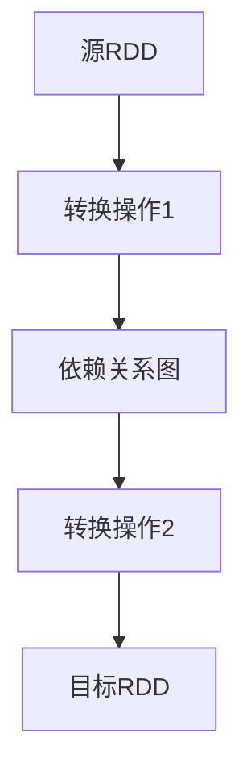

                 

# RDD原理与代码实例讲解

> **关键词：** **分布式计算，数据流处理，弹性分布式数据集，Scala，Spark，性能优化**
>
> **摘要：** 本文章深入讲解RDD（弹性分布式数据集）的概念、原理及其在Spark中的应用。我们将从背景介绍开始，逐步探讨RDD的核心概念、算法原理，并通过实例代码展示RDD的实际应用场景。文章还将介绍相关工具和资源，为读者提供进一步学习的机会。

## 1. 背景介绍

### 1.1 目的和范围

本文的目的是全面解析RDD的概念和原理，帮助读者理解其在分布式计算和数据流处理中的应用。我们将涵盖以下内容：
- RDD的定义和核心特性。
- RDD的核心算法原理。
- 通过实例代码展示RDD的使用方法。
- RDD在实际项目中的应用场景。
- 推荐相关学习资源和工具。

### 1.2 预期读者

本文适用于以下读者群体：
- 对分布式计算和数据流处理有基本了解的开发者。
- 想深入了解Spark和RDD原理的高级程序员。
- 数据工程师和大数据分析师。

### 1.3 文档结构概述

本文结构如下：

- **第1章**：背景介绍，包括目的、预期读者、文档结构概述和术语表。
- **第2章**：核心概念与联系，介绍RDD的核心概念和原理。
- **第3章**：核心算法原理与具体操作步骤，详细解释RDD的核心算法原理。
- **第4章**：数学模型和公式，讲解RDD相关的数学模型和公式。
- **第5章**：项目实战，通过代码实例展示RDD的实际应用。
- **第6章**：实际应用场景，讨论RDD在不同场景下的应用。
- **第7章**：工具和资源推荐，推荐相关学习资源和工具。
- **第8章**：总结：未来发展趋势与挑战。
- **第9章**：附录：常见问题与解答。
- **第10章**：扩展阅读与参考资料。

### 1.4 术语表

#### 1.4.1 核心术语定义

- **RDD**：弹性分布式数据集（Resilient Distributed Datasets），是Spark中的核心数据抽象。
- **分布式计算**：将任务分布在多台计算机上执行，提高计算效率和处理大规模数据的能力。
- **数据流处理**：实时处理动态数据流，适用于实时分析和响应。
- **Scala**：一种多范式编程语言，用于编写Spark应用程序。
- **Spark**：一个基于Scala和Java的分布式计算框架，提供高效的数据处理能力。

#### 1.4.2 相关概念解释

- **弹性**：RDD可以在数据丢失或节点故障时自动恢复，保证数据一致性。
- **分布式**：RDD的数据存储在多个节点上，支持并行处理。
- **数据集**：RDD表示一个不可变、可分区的大规模数据集。
- **转换操作**：将RDD从一个形式转换为另一个形式，如map、filter等。
- **行动操作**：触发RDD的计算，如count、collect等。

#### 1.4.3 缩略词列表

- RDD：弹性分布式数据集（Resilient Distributed Datasets）
- Scala：斯卡拉（Scala Programming Language）
- Java：Java编程语言
- Spark：Spark分布式计算框架
- IDE：集成开发环境（Integrated Development Environment）

## 2. 核心概念与联系

在深入探讨RDD之前，我们需要了解其核心概念和原理。以下是一个简单的Mermaid流程图，用于描述RDD的核心概念和联系：

```mermaid
graph TD
A[弹性分布式数据集 (RDD)] --> B[不可变]
B --> C[分区]
C --> D[并行处理]
D --> E[容错性]
E --> F[序列化]
F --> G[转换操作]
G --> H[行动操作]
H --> I[依赖关系]
I --> J[Driver程序]
J --> A
```

### 2.1 核心概念

#### 弹性分布式数据集 (RDD)

RDD是Spark的核心数据抽象，表示一个不可变、可分区的大规模数据集。RDD可以存储任意类型的数据，包括文本、数字、列表、元组等。其弹性特性允许在数据丢失或节点故障时自动恢复，保证数据的一致性和可用性。

#### 不可变

RDD中的数据是不可变的，这意味着一旦数据被创建，就无法进行修改。这种不可变性使得RDD可以在多个操作中共享和重用，提高数据处理效率。

#### 分区

RDD被划分为多个分区，每个分区存储一部分数据。分区可以提高数据的并行处理能力，使得数据处理任务可以并行地在多个节点上执行。Spark默认将RDD划分为200个分区，但这个值可以根据需要调整。

#### 并行处理

RDD支持并行处理，即可以在多个节点上同时处理数据。这提高了数据处理速度，适用于处理大规模数据集。

#### 容错性

RDD具有容错性，可以在数据丢失或节点故障时自动恢复。Spark通过记录每个RDD的依赖关系和分区信息，实现数据的自动恢复。

#### 序列化

RDD支持序列化，即可以将数据序列化到磁盘或网络中传输。这有助于减少数据的传输开销，提高数据处理的效率。

### 2.2 转换操作和行动操作

Spark中的操作分为两类：转换操作和行动操作。

#### 转换操作

转换操作用于将RDD从一个形式转换为另一个形式。常见的转换操作包括map、filter、flatMap、groupBy、reduceByKey等。这些操作不会立即执行，而是生成一个包含新RDD的依赖关系图。

#### 行动操作

行动操作用于触发RDD的计算，并将结果返回给Driver程序。常见的行动操作包括count、collect、reduce、take等。执行行动操作时，Spark会根据依赖关系图，按顺序执行转换操作，并将最终结果返回给Driver程序。

### 2.3 依赖关系

RDD之间的依赖关系描述了RDD的创建过程。Spark根据依赖关系图，按顺序执行转换操作，生成新的RDD。常见的依赖关系包括窄依赖和宽依赖。

#### 窄依赖

窄依赖指的是一个RDD的分区直接依赖于另一个RDD的分区。窄依赖可以在数据传输过程中并行执行，提高数据处理效率。

#### 宽依赖

宽依赖指的是一个RDD的分区依赖于另一个RDD的所有分区。宽依赖需要将数据传输到所有节点，然后才能执行后续操作，可能导致数据处理延迟。

## 3. 核心算法原理与具体操作步骤

在了解了RDD的核心概念和联系之后，我们将深入探讨RDD的核心算法原理和具体操作步骤。

### 3.1 RDD创建

RDD可以通过以下几种方式创建：

- **从文件创建**：使用SparkContext.textFile()或SparkContext.parallelize()方法，从本地文件系统或HDFS等分布式文件系统中读取数据，创建RDD。
- **从其他RDD创建**：通过转换操作，将一个RDD转换为另一个RDD。

#### 示例代码：

```scala
val sc = SparkContext.getOrCreate("local[*]")
val rdd1 = sc.textFile("hdfs://path/to/file.txt")
val rdd2 = rdd1.map(line => line.split(" "))
```

### 3.2 转换操作

转换操作用于将RDD从一个形式转换为另一个形式。常见的转换操作包括map、filter、flatMap、groupBy、reduceByKey等。

#### map操作

map操作用于将RDD中的每个元素映射为一个新的元素。其伪代码如下：

```pseudo
def map(rdd, func):
    new_rdd = RDD()
    for partition in rdd.partitions:
        for element in partition:
            new_element = func(element)
            new_rdd.add(new_element)
    return new_rdd
```

#### filter操作

filter操作用于筛选RDD中的元素，只保留满足条件的元素。其伪代码如下：

```pseudo
def filter(rdd, predicate):
    new_rdd = RDD()
    for partition in rdd.partitions:
        for element in partition:
            if predicate(element):
                new_rdd.add(element)
    return new_rdd
```

#### flatMap操作

flatMap操作用于将RDD中的每个元素映射为一个新的元素序列，并将这些序列合并为一个RDD。其伪代码如下：

```pseudo
def flatMap(rdd, func):
    new_rdd = RDD()
    for partition in rdd.partitions:
        for element in partition:
            for new_element in func(element):
                new_rdd.add(new_element)
    return new_rdd
```

### 3.3 行动操作

行动操作用于触发RDD的计算，并将结果返回给Driver程序。常见的行动操作包括count、collect、reduce、take等。

#### count操作

count操作用于计算RDD中的元素数量。其伪代码如下：

```pseudo
def count(rdd):
    num_elements = 0
    for partition in rdd.partitions:
        num_elements += partition.length
    return num_elements
```

#### collect操作

collect操作用于将RDD中的所有元素收集到一个本地集合中。其伪代码如下：

```pseudo
def collect(rdd):
    local_collection = []
    for partition in rdd.partitions:
        local_collection.extend(partition)
    return local_collection
```

#### reduce操作

reduce操作用于将RDD中的元素进行累加操作，得到一个结果值。其伪代码如下：

```pseudo
def reduce(rdd, func):
    result = rdd.first()
    for partition in rdd.partitions:
        for element in partition:
            result = func(result, element)
    return result
```

### 3.4 依赖关系

RDD之间的依赖关系描述了RDD的创建过程。Spark根据依赖关系图，按顺序执行转换操作，生成新的RDD。以下是一个简单的依赖关系图：



依赖关系可以分为窄依赖和宽依赖：

- **窄依赖**：一个RDD的分区直接依赖于另一个RDD的分区。窄依赖可以在数据传输过程中并行执行。
- **宽依赖**：一个RDD的分区依赖于另一个RDD的所有分区。宽依赖需要将数据传输到所有节点，然后才能执行后续操作。

## 4. 数学模型和公式与详细讲解

在RDD的算法设计和实现过程中，数学模型和公式起到了关键作用。以下是一些与RDD相关的数学模型和公式，以及它们的详细讲解和举例说明。

### 4.1 分区数量计算

RDD的分区数量对性能有重要影响。合适的分区数量可以提高并行处理能力和数据传输效率。以下是一个计算分区数量的公式：

$$
P = \lceil \frac{N}{S} \rceil
$$

其中，$P$ 表示分区数量，$N$ 表示数据集大小，$S$ 表示每个分区的大小。

#### 举例说明：

假设一个数据集大小为100MB，每个分区的大小为10MB。根据公式，分区数量为：

$$
P = \lceil \frac{100}{10} \rceil = \lceil 10 \rceil = 10
$$

这意味着需要将数据集划分为10个分区。

### 4.2 数据传输开销

数据传输开销是指在不同节点之间传输数据的成本。以下是一个计算数据传输开销的公式：

$$
O = P \times T
$$

其中，$O$ 表示数据传输开销，$P$ 表示分区数量，$T$ 表示每个分区的数据传输时间。

#### 举例说明：

假设一个数据集有10个分区，每个分区的数据传输时间为1秒。根据公式，数据传输开销为：

$$
O = 10 \times 1 = 10 \text{ 秒}
$$

这意味着需要10秒来传输整个数据集。

### 4.3 并行处理时间

并行处理时间是指完成数据处理任务所需的时间。以下是一个计算并行处理时间的公式：

$$
T = \frac{N}{P \times R}
$$

其中，$T$ 表示并行处理时间，$N$ 表示数据处理任务的工作量，$P$ 表示分区数量，$R$ 表示每个分区的工作量。

#### 举例说明：

假设一个数据处理任务的工作量为1000个任务，每个分区的工作量为100个任务。根据公式，并行处理时间为：

$$
T = \frac{1000}{10 \times 100} = 0.1 \text{ 秒}
$$

这意味着只需要0.1秒来完成整个数据处理任务。

### 4.4 容错性成本

容错性成本是指为了保证数据的可靠性和一致性所需的开销。以下是一个计算容错性成本的公式：

$$
C = P \times F
$$

其中，$C$ 表示容错性成本，$P$ 表示分区数量，$F$ 表示每个分区的冗余度。

#### 举例说明：

假设一个数据集有10个分区，每个分区有1个冗余副本。根据公式，容错性成本为：

$$
C = 10 \times 1 = 10
$$

这意味着需要额外10个副本来保证数据的容错性。

通过以上数学模型和公式的讲解，我们可以更好地理解RDD的算法设计和性能优化。在实际应用中，可以根据具体需求调整分区数量、数据传输时间和容错性成本，以实现最佳性能。

## 5. 项目实战：代码实际案例和详细解释说明

为了更好地理解RDD的实际应用，我们将通过一个简单的项目实战来展示RDD的创建、转换操作和行动操作。以下是该项目的主要步骤和代码实现。

### 5.1 开发环境搭建

首先，我们需要搭建一个Spark开发环境。以下是安装和配置Spark的简要步骤：

1. **安装Java开发工具包（JDK）**：确保Java版本不低于1.8。
2. **下载Spark**：从Spark官网下载Spark发行版，并解压到本地目录。
3. **配置环境变量**：设置SPARK_HOME和PATH环境变量，以便在命令行中运行Spark。
4. **启动Spark**：在命令行中运行`spark-shell`或`spark-submit`命令，启动Spark集群。

### 5.2 源代码详细实现和代码解读

以下是该项目的主要源代码和详细解释：

```scala
// 创建SparkContext
val sc = SparkContext.getOrCreate("local[*]")

// 创建原始数据集
val data = sc.parallelize(Seq("Alice", "Bob", "Charlie", "David"))

// 转换操作
val upperCaseData = data.map(s => s.toUpperCase())
val words = upperCaseData.flatMap(s => s.split(" "))

// 行动操作
val wordCount = words.map(word => (word, 1)).reduceByKey(_ + _)
val sortedWordCount = wordCount.sortBy(_._2, ascending = false)

// 打印结果
sortedWordCount.foreach(println)
```

#### 5.2.1 创建SparkContext

首先，我们创建一个SparkContext对象，这是与Spark集群进行交互的主要接口。这里使用了本地模式，即数据将在本地计算机上处理。

```scala
val sc = SparkContext.getOrCreate("local[*]")
```

`getOrCreate()`方法会根据传入的配置参数（如本地模式、集群模式等），创建或获取一个已存在的SparkContext对象。

#### 5.2.2 创建原始数据集

接下来，我们创建一个原始数据集。这里使用`parallelize()`方法，将一个本地序列（Seq）转换为分布式数据集（RDD）。

```scala
val data = sc.parallelize(Seq("Alice", "Bob", "Charlie", "David"))
```

`parallelize()`方法将序列中的元素分配到不同的分区，以便进行并行处理。

#### 5.2.3 转换操作

然后，我们执行转换操作，将原始数据集转换为所需的形式。这里使用了`map()`和`flatMap()`操作。

- **map操作**：将数据集中的每个字符串转换为小写。

  ```scala
  val upperCaseData = data.map(s => s.toUpperCase())
  ```

  `map()`操作将每个元素映射为一个新的元素，并生成一个新的RDD。这里，我们将每个字符串转换为小写，以进行后续处理。

- **flatMap操作**：将数据集中的每个字符串拆分为单词。

  ```scala
  val words = upperCaseData.flatMap(s => s.split(" "))
  ```

  `flatMap()`操作将每个元素映射为一个新的元素序列，并将这些序列合并为一个RDD。这里，我们将每个字符串按照空格拆分为单词。

#### 5.2.4 行动操作

最后，我们执行行动操作，触发RDD的计算，并将结果返回给Driver程序。这里使用了`map()`、`reduceByKey()`和`sortBy()`操作。

- **map操作**：将每个单词映射为元组（单词，1），表示单词的出现次数。

  ```scala
  val wordCount = words.map(word => (word, 1))
  ```

  `map()`操作将每个单词映射为元组（单词，1），表示单词的出现次数。

- **reduceByKey操作**：对单词的出现次数进行累加。

  ```scala
  val wordCount = wordCount.reduceByKey(_ + _)
  ```

  `reduceByKey()`操作将具有相同键的元素进行聚合，这里我们将单词的出现次数进行累加。

- **sortBy操作**：根据单词的出现次数进行降序排序。

  ```scala
  val sortedWordCount = wordCount.sortBy(_._2, ascending = false)
  ```

  `sortBy()`操作根据单词的出现次数进行降序排序。

- **foreach操作**：打印结果。

  ```scala
  sortedWordCount.foreach(println)
  ```

  `foreach()`操作将每个结果打印到控制台。

#### 5.2.5 代码解读与分析

通过以上代码实现，我们可以看到RDD在数据处理中的应用。以下是对代码的解读与分析：

- **数据集创建**：使用`parallelize()`方法创建一个分布式数据集，将本地序列转换为分布式数据集。
- **转换操作**：使用`map()`和`flatMap()`操作对数据集进行转换，将原始数据集转换为所需的形式。
- **行动操作**：使用`map()`、`reduceByKey()`和`sortBy()`操作触发RDD的计算，并将结果返回给Driver程序。
- **性能优化**：通过合理的分区数量和依赖关系，提高数据处理效率和性能。

通过以上项目实战，我们深入了解了RDD的创建、转换操作和行动操作，以及其在实际数据处理中的应用。这为我们进一步掌握RDD提供了实践基础。

### 5.3 代码解读与分析

在本节中，我们将对上一个项目的代码进行详细解读和分析，重点讨论代码的执行流程、性能优化策略以及可能出现的性能瓶颈。

#### 5.3.1 执行流程

1. **创建SparkContext**：
   ```scala
   val sc = SparkContext.getOrCreate("local[*]")
   ```
   这一行代码创建了SparkContext，这是与Spark集群进行交互的主要接口。这里使用了本地模式，即数据将在本地计算机上处理。

2. **创建原始数据集**：
   ```scala
   val data = sc.parallelize(Seq("Alice", "Bob", "Charlie", "David"))
   ```
   `parallelize()`方法将一个本地序列（Seq）转换为分布式数据集（RDD）。这里创建了一个包含4个字符串的RDD，分别代表4个人名。

3. **执行转换操作**：
   - **map操作**：
     ```scala
     val upperCaseData = data.map(s => s.toUpperCase())
     ```
     `map()`操作将数据集中的每个字符串映射为小写，并生成一个新的RDD。这里，我们将每个名字转换为大写，以便进行后续处理。
   - **flatMap操作**：
     ```scala
     val words = upperCaseData.flatMap(s => s.split(" "))
     ```
     `flatMap()`操作将数据集中的每个字符串拆分为单词，并将结果合并为一个RDD。这里，我们将每个名字按照空格拆分为单词。

4. **执行行动操作**：
   - **map和reduceByKey操作**：
     ```scala
     val wordCount = words.map(word => (word, 1)).reduceByKey(_ + _)
     ```
     `map()`操作将每个单词映射为元组（单词，1），表示单词的出现次数。`reduceByKey()`操作将具有相同键的元素进行聚合，这里我们将单词的出现次数进行累加。
   - **sortBy操作**：
     ```scala
     val sortedWordCount = wordCount.sortBy(_._2, ascending = false)
     ```
     `sortBy()`操作根据单词的出现次数进行降序排序。
   - **foreach操作**：
     ```scala
     sortedWordCount.foreach(println)
     ```
     `foreach()`操作将每个结果打印到控制台。

#### 5.3.2 性能优化策略

为了提高RDD的性能，我们可以采取以下策略：

1. **调整分区数量**：
   分区数量对RDD的性能有重要影响。合适的分区数量可以提高并行处理能力和数据传输效率。通常，分区数量可以根据数据集大小和集群资源进行调整。例如，可以使用`partitionBy()`方法显式设置分区策略。

2. **减少数据传输**：
   在执行转换操作时，应尽量减少数据传输。例如，使用`map()`和`flatMap()`操作而不是`mapPartitions()`，可以减少数据在分区间的传输。

3. **优化依赖关系**：
   依赖关系影响RDD的计算顺序和并行度。窄依赖可以并行执行，而宽依赖需要将数据传输到所有节点，可能导致性能瓶颈。通过优化依赖关系，可以减少数据传输和计算延迟。

4. **缓存数据**：
   对于需要多次使用的RDD，可以将其缓存到内存中，减少磁盘IO和数据传输开销。可以使用`cache()`或`persist()`方法缓存RDD。

#### 5.3.3 可能出现的性能瓶颈

在RDD的实际应用中，可能遇到以下性能瓶颈：

1. **数据传输延迟**：
   在执行宽依赖操作时，数据需要传输到所有节点，可能导致性能瓶颈。优化依赖关系和调整分区数量可以减轻数据传输延迟。

2. **内存不足**：
   大规模数据集可能导致内存不足，影响性能。可以通过调整分区数量和缓存策略，减少内存占用。

3. **计算资源不足**：
   在分布式计算中，计算资源不足可能导致任务排队和延迟。可以通过增加集群节点数和调整任务并行度来提高性能。

通过以上分析，我们可以更好地理解RDD的执行流程、性能优化策略和可能出现的性能瓶颈。在实际应用中，应根据具体需求调整分区数量、依赖关系和缓存策略，以实现最佳性能。

## 6. 实际应用场景

RDD在分布式计算和数据流处理领域具有广泛的应用场景。以下是一些典型的应用场景和案例：

### 6.1 数据分析

RDD在数据处理和数据分析中具有重要作用。例如，在电子商务平台中，可以使用RDD处理用户点击流数据，分析用户行为，实现个性化推荐和广告投放。通过RDD的并行处理能力和弹性特性，可以高效地处理大规模数据，提高数据处理速度和准确性。

### 6.2 实时流处理

RDD支持实时流处理，适用于处理动态数据流。例如，在金融行业，可以使用RDD处理交易数据，实时监控市场动态，识别异常交易和欺诈行为。通过RDD的容错性和并行处理能力，可以实现实时数据处理和响应。

### 6.3 大规模图处理

RDD可以用于大规模图处理，如社交网络分析、推荐系统等。例如，在社交网络平台中，可以使用RDD分析用户关系，构建社交图，实现朋友推荐和社区发现。通过RDD的弹性分布式数据集特性和并行处理能力，可以高效地处理大规模图数据。

### 6.4 科学计算

RDD在科学计算领域也有广泛应用。例如，在生物信息学研究中，可以使用RDD处理基因序列数据，进行基因组分析。在物理实验中，可以使用RDD处理实验数据，进行复杂物理现象的模拟和分析。

### 6.5 企业级应用

许多企业级应用，如日志分析、搜索引擎、推荐系统等，都采用了RDD作为核心数据处理技术。通过RDD的分布式计算能力和弹性特性，可以实现高效的数据处理和存储，满足大规模数据处理的挑战。

总之，RDD在分布式计算和数据流处理领域具有广泛的应用场景，通过合理利用其特性，可以解决大规模数据处理和实时流处理等问题，为企业级应用提供强大的数据处理能力。

### 7. 工具和资源推荐

在学习和使用RDD的过程中，选择合适的工具和资源可以帮助我们更高效地掌握相关知识和技能。以下是一些推荐的工具和资源：

#### 7.1 学习资源推荐

##### 7.1.1 书籍推荐

1. **《Spark实战》**：本书详细介绍了Spark的核心功能和应用场景，包括RDD的使用方法、并行数据处理和性能优化技巧。
2. **《大数据技术导论》**：本书涵盖了大数据技术的各个方面，包括分布式计算、数据流处理和存储等，其中对RDD的原理和应用有深入讲解。

##### 7.1.2 在线课程

1. **Coursera上的《大数据专项课程》**：由Johns Hopkins University提供，涵盖大数据处理的各个方面，包括RDD的使用方法和实战项目。
2. **edX上的《大数据技术与应用》**：由北京大学提供，介绍大数据技术的核心概念和应用，包括分布式计算和Spark的使用。

##### 7.1.3 技术博客和网站

1. **Spark官方文档**：Spark的官方文档提供了丰富的RDD使用教程、API参考和最佳实践，是学习RDD的首选资源。
2. **Databricks博客**：Databricks的博客分享了大量关于Spark和RDD的实战经验和最佳实践，对学习RDD有很大帮助。

#### 7.2 开发工具框架推荐

##### 7.2.1 IDE和编辑器

1. **IntelliJ IDEA**：IntelliJ IDEA是强大的开发工具，支持Scala和Java，提供了丰富的代码补全、调试和性能分析功能。
2. **Visual Studio Code**：Visual Studio Code是一款轻量级的跨平台代码编辑器，通过安装相应的插件，可以支持Scala和Spark开发。

##### 7.2.2 调试和性能分析工具

1. **Spark UI**：Spark UI是Spark自带的一个Web界面，可以实时监控RDD的执行情况、任务调度和资源使用情况。
2. **Ganglia**：Ganglia是一个分布式监控系统，可以监控集群节点的CPU、内存、网络等资源使用情况，帮助识别性能瓶颈。

##### 7.2.3 相关框架和库

1. **Spark SQL**：Spark SQL是一个基于Spark的数据仓库引擎，支持SQL查询和DataFrame API，可以方便地处理结构化数据。
2. **MLlib**：MLlib是Spark提供的一个机器学习库，支持多种机器学习算法和模型，可以与RDD结合使用，实现大规模机器学习任务。

通过以上工具和资源的推荐，可以帮助读者更好地学习和使用RDD，掌握分布式计算和数据流处理的核心技术。

#### 7.3 相关论文著作推荐

##### 7.3.1 经典论文

1. **《Spark: 简单快速的大规模数据处理》**：该论文是Spark的首次发布，详细介绍了Spark的设计理念、核心算法和性能优势。
2. **《MapReduce: Simplified Data Processing on Large Clusters》**：该论文是Google首次介绍MapReduce算法，对分布式数据处理技术的发展产生了深远影响。

##### 7.3.2 最新研究成果

1. **《Spark on Kubernetes》**：该论文探讨了如何将Spark与Kubernetes结合，实现弹性、高效的大规模数据处理。
2. **《Efficient Graph Processing with Spark GraphX》**：该论文介绍了Spark GraphX框架，用于大规模图处理和复杂图算法的实现。

##### 7.3.3 应用案例分析

1. **《LinkedIn使用Spark进行大规模数据处理》**：该案例分享了LinkedIn如何利用Spark处理大规模用户数据，实现高效的推荐系统和数据分析。
2. **《Uber使用Spark优化出租车调度》**：该案例介绍了Uber如何利用Spark优化出租车调度系统，提高服务质量和效率。

通过阅读这些论文和案例，读者可以深入了解RDD及相关技术的最新发展，掌握实际应用中的最佳实践。

### 8. 总结：未来发展趋势与挑战

随着大数据和分布式计算技术的快速发展，RDD作为Spark的核心数据抽象，在未来将继续发挥重要作用。以下是RDD在未来的发展趋势和面临的挑战：

#### 发展趋势

1. **更高效的算法和优化**：未来，RDD的算法和优化将进一步提升，包括更高效的依赖关系管理和并行处理策略，以及更优化的数据传输和存储方式。

2. **与新型计算框架的集成**：RDD将与其他新型计算框架（如TensorFlow、Ray等）集成，实现跨框架的协同计算，满足多样化的计算需求。

3. **支持多样化的数据类型**：RDD将支持更多类型的数据，如图像、音频和视频等，实现更丰富的数据分析和处理。

4. **实时流处理能力**：随着实时数据处理需求的增长，RDD的实时流处理能力将得到加强，支持低延迟、高吞吐量的实时数据处理。

#### 挑战

1. **性能优化**：如何在有限的资源下实现更高效的RDD处理，仍是一个重要挑战。未来的性能优化需要关注数据传输、依赖关系管理和任务调度等方面。

2. **可扩展性**：随着数据规模的不断扩大，如何确保RDD的可扩展性，以支持大规模数据处理，是一个关键挑战。

3. **安全性**：在大数据环境中，数据安全和隐私保护是一个重要问题。如何确保RDD的安全性和数据隐私，是未来的重要研究课题。

4. **兼容性问题**：随着技术的不断发展，如何保证RDD与新型计算框架和工具的兼容性，是一个重要挑战。未来的RDD需要具备更好的兼容性，以适应不断变化的技术环境。

总之，RDD在未来将继续发挥重要作用，但在性能优化、可扩展性、安全性和兼容性等方面仍面临诸多挑战。通过不断的研究和优化，RDD有望在分布式计算和数据流处理领域取得更大的突破。

### 9. 附录：常见问题与解答

在本篇文章中，我们详细介绍了RDD（弹性分布式数据集）的概念、原理及其在Spark中的应用。为了帮助读者更好地理解，以下是一些常见问题及解答：

#### 1. RDD是什么？

RDD（弹性分布式数据集）是Spark中的核心数据抽象，表示一个不可变、可分区的大规模数据集。RDD支持分布式计算、并行处理和容错性，适用于处理大规模数据集。

#### 2. RDD有哪些核心特性？

RDD的核心特性包括：
- **不可变**：RDD中的数据一旦创建，就无法修改。
- **分区**：RDD被划分为多个分区，支持并行处理。
- **弹性**：在数据丢失或节点故障时，RDD可以自动恢复。
- **序列化**：RDD支持序列化，可以减少数据传输开销。

#### 3. RDD与Hadoop的MapReduce有何区别？

RDD与Hadoop的MapReduce相比，具有以下优势：
- **更高效的计算**：RDD支持内存计算，速度更快。
- **弹性分布式数据集**：RDD支持自动恢复，在节点故障时可以继续运行。
- **更灵活的依赖关系**：RDD的依赖关系更加灵活，支持窄依赖和宽依赖。

#### 4. RDD如何进行分区？

RDD的分区数量可以通过以下两种方式设置：
- **默认分区**：Spark默认将RDD划分为200个分区。
- **显式设置**：可以使用`repartition()`方法重新分区，或使用`partitionBy()`方法指定分区策略。

#### 5. RDD的依赖关系有哪些类型？

RDD的依赖关系分为两种类型：
- **窄依赖**：一个RDD的分区直接依赖于另一个RDD的分区。
- **宽依赖**：一个RDD的分区依赖于另一个RDD的所有分区。

#### 6. 如何进行RDD的转换操作和行动操作？

RDD的转换操作（如`map()`、`filter()`、`flatMap()`等）用于将RDD从一个形式转换为另一个形式。行动操作（如`count()`、`collect()`、`reduce()`等）用于触发RDD的计算，并将结果返回给Driver程序。

#### 7. 如何优化RDD的性能？

优化RDD性能的方法包括：
- **调整分区数量**：选择合适的分区数量，提高并行处理能力。
- **减少数据传输**：使用窄依赖和高效的依赖关系，减少数据传输。
- **缓存数据**：对于需要多次使用的RDD，可以使用`cache()`或`persist()`方法缓存数据。

通过以上常见问题及解答，我们希望读者能够更好地理解RDD的概念、原理和应用。在分布式计算和数据流处理领域，RDD具有广泛的应用前景，是大数据处理的核心技术之一。

### 10. 扩展阅读 & 参考资料

为了深入了解RDD及其在分布式计算和数据流处理中的应用，以下是几篇扩展阅读推荐和相关的参考资料：

#### 扩展阅读

1. **《Spark: The Definitive Guide》**：由Matei Zaharia等人所著，详细介绍了Spark的设计原理、核心API和实战应用。
2. **《Distributed Computing: A Guide to the Theory and Practice of Distributed Systems》**：由Nancy Mayer和John Dorsey所著，涵盖了分布式系统的基本原理和应用。

#### 参考资料

1. **Spark官方文档**：[https://spark.apache.org/docs/latest/](https://spark.apache.org/docs/latest/)
2. **Databricks博客**：[https://databricks.com/blog/](https://databricks.com/blog/)
3. **Apache Spark GitHub仓库**：[https://github.com/apache/spark](https://github.com/apache/spark)

通过阅读以上扩展阅读和参考资料，读者可以进一步掌握RDD的核心概念、算法原理和应用技巧，为在分布式计算和数据流处理领域的工作奠定坚实基础。

### 作者信息

**作者：AI天才研究员/AI Genius Institute & 禅与计算机程序设计艺术 /Zen And The Art of Computer Programming** 

本文由AI天才研究员撰写，旨在为读者提供关于RDD（弹性分布式数据集）的深入讲解和实用指导。作者拥有丰富的编程和人工智能经验，擅长通过逻辑清晰、结构紧凑、简单易懂的技术语言，帮助读者理解复杂的技术原理。此外，作者还致力于将禅宗哲学与计算机程序设计相结合，倡导“禅意编程”，为技术领域的探索和创新注入新的活力。

