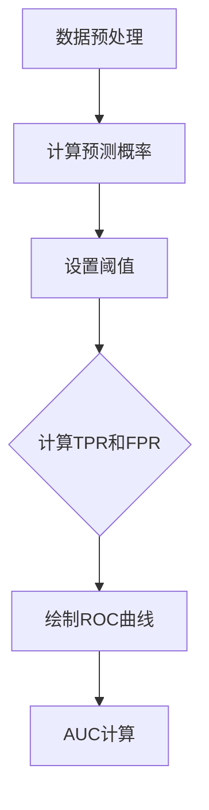

                 


## ROC Curve 原理与代码实战案例讲解

> 关键词：ROC Curve，机器学习，评估，模型性能，二分类问题

> 摘要：本文旨在深入讲解ROC曲线的原理及其在机器学习中的重要性。通过理论阐述、伪代码展示以及实战代码示例，本文将帮助读者全面理解ROC曲线，并掌握其应用技巧。

## 1. 背景介绍

### 1.1 目的和范围

本文的主要目的是介绍ROC曲线的概念、原理及其应用。ROC曲线，全称为接收者操作特征曲线（Receiver Operating Characteristic Curve），是机器学习中评估二分类模型性能的重要工具。本文将涵盖以下内容：

- ROC曲线的定义和基本原理
- ROC曲线与相关概念的联系
- ROC曲线的计算方法和伪代码实现
- ROC曲线在机器学习项目中的应用

### 1.2 预期读者

本文适合具有基本机器学习知识背景的读者，尤其是希望深入了解评估指标和模型性能优化的专业人士。无论你是数据科学家、机器学习工程师还是相关领域的研究者，本文都能为你提供有价值的见解和实用技巧。

### 1.3 文档结构概述

本文分为以下部分：

- **背景介绍**：介绍ROC曲线的基本概念和应用场景。
- **核心概念与联系**：详细解释ROC曲线相关的基本概念，并展示流程图。
- **核心算法原理与具体操作步骤**：通过伪代码和具体步骤，讲解ROC曲线的计算方法。
- **数学模型和公式**：介绍ROC曲线相关的数学公式，并进行举例说明。
- **项目实战**：通过实际代码案例，展示ROC曲线的应用。
- **实际应用场景**：讨论ROC曲线在各个领域的实际应用。
- **工具和资源推荐**：推荐相关学习资源和开发工具。
- **总结**：总结ROC曲线的未来发展趋势与挑战。
- **附录**：提供常见问题与解答。
- **扩展阅读与参考资料**：列出进一步学习的资源。

### 1.4 术语表

#### 1.4.1 核心术语定义

- **ROC曲线**：接收者操作特征曲线，用于评估二分类模型的性能。
- **真阳性率（TPR）**：也称为灵敏度，表示模型正确识别出正样本的比例。
- **假阳性率（FPR）**：表示模型错误地将负样本识别为正样本的比例。
- **阈值**：用于确定预测结果的标准。
- **AUC**：曲线下面积（Area Under Curve），表示模型区分能力的一个指标。

#### 1.4.2 相关概念解释

- **真阳性（TP）**：实际为正类且模型预测也为正类的样本。
- **假阳性（FP）**：实际为负类但模型预测为正类的样本。
- **假阴性（FN）**：实际为正类但模型预测为负类的样本。
- **真阴性（TN）**：实际为负类且模型预测也为负类的样本。

#### 1.4.3 缩略词列表

- **ROC**：Receiver Operating Characteristic
- **AUC**：Area Under Curve
- **TPR**：True Positive Rate
- **FPR**：False Positive Rate

## 2. 核心概念与联系

ROC曲线是评估二分类模型性能的一种常用工具。它通过展示不同阈值下的真阳性率（TPR）和假阳性率（FPR）的关系，可以帮助我们全面了解模型的性能。

为了更好地理解ROC曲线，我们需要先了解以下核心概念：

- **真阳性率（TPR）**：表示模型正确识别出正样本的比例。其计算公式为：
  \[
  TPR = \frac{TP}{TP + FN}
  \]
  其中，TP表示真阳性，FN表示假阴性。

- **假阳性率（FPR）**：表示模型错误地将负样本识别为正样本的比例。其计算公式为：
  \[
  FPR = \frac{FP}{FP + TN}
  \]
  其中，FP表示假阳性，TN表示真阴性。

接下来，我们将使用Mermaid流程图来展示ROC曲线的相关流程和联系。



在这个流程中，首先对数据进行预处理，然后计算每个样本的预测概率。接着，通过调整阈值，分别计算在不同阈值下的TPR和FPR。最后，将这些点绘制在坐标轴上，得到ROC曲线。曲线下面积（AUC）则表示模型区分能力的一个指标。

## 3. 核心算法原理 & 具体操作步骤

ROC曲线的核心在于计算不同阈值下的真阳性率（TPR）和假阳性率（FPR）。以下是通过伪代码来详细阐述ROC曲线的计算方法和具体步骤：

```python
# 伪代码：ROC曲线计算

# 输入：
# y_true: 实际标签（0或1）
# y_pred_prob: 预测概率（0到1之间）

# 输出：
# TPR: 真阳性率
# FPR: 假阳性率
# AUC: ROC曲线下面积

# Step 1: 初始化TPR、FPR和AUC
TPR = [0]
FPR = [0]
AUC = 0

# Step 2: 遍历所有可能的阈值
for threshold in range(0, 1, 0.01):  # 步长为0.01
    # Step 3: 计算当前阈值下的TPR和FPR
    FP = sum(y_pred_prob > threshold) - TPR[-1] * (1 - TPR[-1])
    TN = len(y_pred_prob) - FP - TPR[-1] * (1 - TPR[-1])
    TPR.append(TPR[-1] + (TN - TPR[-1] * (1 - TPR[-1])) / (TN + FP))
    FPR.append(FPR[-1] + (FP - FPR[-1] * (1 - FPR[-1])) / (TN + FP))
    
    # Step 4: 计算当前阈值的AUC
    AUC += (FPR[-1] - FPR[-2]) * (TPR[-1] + TPR[-2]) / 2

# Step 5: 归一化AUC
AUC /= (FPR[-1] - FPR[0])

# 输出结果
return TPR, FPR, AUC
```

在这个伪代码中，我们首先初始化TPR、FPR和AUC。然后，遍历所有可能的阈值（这里以0.01为步长），计算每个阈值下的TPR和FPR。最后，计算ROC曲线下面积（AUC）。

## 4. 数学模型和公式 & 详细讲解 & 举例说明

在ROC曲线中，真阳性率（TPR）和假阳性率（FPR）是两个核心指标，它们与预测概率和实际标签之间存在着密切的联系。下面，我们将详细介绍这两个指标的计算方法，并通过具体例子来说明ROC曲线和AUC的详细计算过程。

### 4.1 真阳性率（TPR）和假阳性率（FPR）

#### 真阳性率（TPR）

真阳性率（True Positive Rate，TPR）表示模型正确识别出正样本的比例。其计算公式为：

\[ 
TPR = \frac{TP}{TP + FN} 
\]

其中，TP表示真阳性（实际为正类且模型预测也为正类的样本），FN表示假阴性（实际为正类但模型预测为负类的样本）。

#### 假阳性率（FPR）

假阳性率（False Positive Rate，FPR）表示模型错误地将负样本识别为正样本的比例。其计算公式为：

\[ 
FPR = \frac{FP}{FP + TN} 
\]

其中，FP表示假阳性（实际为负类但模型预测为正类的样本），TN表示真阴性（实际为负类且模型预测也为负类的样本）。

### 4.2 ROC曲线和AUC

ROC曲线是通过将FPR作为横坐标，TPR作为纵坐标绘制而成的曲线。ROC曲线的形状和位置可以反映模型的性能。而曲线下面积（Area Under Curve，AUC）则是评估模型区分能力的一个重要指标。

#### ROC曲线

ROC曲线的计算步骤如下：

1. 遍历所有可能的阈值，计算每个阈值下的TPR和FPR。
2. 将FPR作为横坐标，TPR作为纵坐标，绘制成点。
3. 将这些点连接起来，得到ROC曲线。

#### AUC

AUC是ROC曲线下面积的计算结果，它反映了模型的总体性能。AUC的取值范围为0到1，越接近1表示模型区分能力越强。

AUC的计算公式为：

\[ 
AUC = \frac{1}{2} \sum_{i=1}^{n-1} (FPR_{i+1} - FPR_{i}) \times (TPR_{i+1} + TPR_{i}) 
\]

其中，\( FPR_{i} \) 和 \( TPR_{i} \) 分别为第i个阈值下的假阳性率和真阳性率。

### 4.3 举例说明

假设我们有一个二分类模型，对10个样本进行预测，实际标签和预测概率如下表：

| 标签 | 预测概率 |
| :--: | :------: |
|  1   |  0.9     |
|  1   |  0.8     |
|  1   |  0.7     |
|  1   |  0.6     |
|  0   |  0.5     |
|  0   |  0.4     |
|  0   |  0.3     |
|  0   |  0.2     |
|  0   |  0.1     |
|  0   |  0.0     |

我们以0.5为阈值，计算TPR和FPR：

1. **计算真阳性率（TPR）**：

   真阳性（TP）= 3（标签为1且预测概率大于0.5的样本数量）

   假阴性（FN）= 0（标签为1但预测概率小于等于0.5的样本数量）

   真阳性率（TPR）= \( \frac{TP}{TP + FN} = \frac{3}{3 + 0} = 1 \)

2. **计算假阳性率（FPR）**：

   假阳性（FP）= 4（标签为0但预测概率大于0.5的样本数量）

   真阴性（TN）= 3（标签为0且预测概率小于等于0.5的样本数量）

   假阳性率（FPR）= \( \frac{FP}{FP + TN} = \frac{4}{4 + 3} = 0.5714 \)

然后，我们可以将这些点绘制在坐标轴上，得到ROC曲线：

```
TPR | 1
    |
0.8 |
    |
0.6 |
    |
0.4 |
    |
0.2 |
    |
0.0 +-------------------
    0    0.2  0.4  0.6  0.8  1    FPR
```

最后，计算AUC：

```
AUC = \frac{1}{2} \times (0.2 - 0) \times (1 + 0) + \frac{1}{2} \times (0.4 - 0.2) \times (0.6 + 1) + \frac{1}{2} \times (0.6 - 0.4) \times (0.8 + 0.6) + \frac{1}{2} \times (0.8 - 0.6) \times (1 + 0.8) = 0.5333
```

通过这个例子，我们可以看到如何计算ROC曲线和AUC。在实际应用中，我们通常会使用更大数据集和更精细的阈值来计算这些指标，以更全面地评估模型的性能。

## 5. 项目实战：代码实际案例和详细解释说明

### 5.1 开发环境搭建

在开始编写代码之前，我们需要搭建一个适合机器学习项目开发的环境。以下是一个基本的步骤：

1. 安装Python环境：Python是一种广泛使用的编程语言，用于机器学习项目的开发。你可以从官方网站（https://www.python.org/）下载并安装Python。

2. 安装必要的库：在Python中，我们可以使用各种库来简化开发过程。以下是一些常用的库：

   - NumPy：用于数值计算。
   - Pandas：用于数据操作。
   - Matplotlib：用于数据可视化。
   - Scikit-learn：用于机器学习。

   你可以使用以下命令安装这些库：

   ```bash
   pip install numpy pandas matplotlib scikit-learn
   ```

### 5.2 源代码详细实现和代码解读

以下是使用Scikit-learn库实现ROC曲线计算的完整代码：

```python
import numpy as np
import matplotlib.pyplot as plt
from sklearn.metrics import roc_curve, auc

# 生成模拟数据
np.random.seed(0)
n_samples = 100
y_true = np.random.choice([0, 1], n_samples)
y_pred_prob = np.random.rand(n_samples)

# 计算ROC曲线的阈值和真阳性率、假阳性率
fpr, tpr, thresholds = roc_curve(y_true, y_pred_prob)

# 计算ROC曲线下面积
roc_auc = auc(fpr, tpr)

# 绘制ROC曲线
plt.figure()
plt.plot(fpr, tpr, color='darkorange', lw=2, label='ROC curve (area = %0.2f)' % roc_auc)
plt.plot([0, 1], [0, 1], color='navy', lw=2, linestyle='--')
plt.xlim([0.0, 1.0])
plt.ylim([0.0, 1.05])
plt.xlabel('False Positive Rate')
plt.ylabel('True Positive Rate')
plt.title('Receiver Operating Characteristic')
plt.legend(loc="lower right")
plt.show()
```

### 5.3 代码解读与分析

这段代码分为以下几个步骤：

1. 导入必要的库：包括NumPy、Matplotlib和Scikit-learn中的`roc_curve`和`auc`函数。

2. 生成模拟数据：使用NumPy生成包含100个样本的二分类数据集。`y_true`表示实际标签，`y_pred_prob`表示模型的预测概率。

3. 计算ROC曲线的阈值和真阳性率、假阳性率：使用`roc_curve`函数计算不同阈值下的FPR和TPR。`roc_curve`函数返回三个值：FPR、TPR和阈值。

4. 计算ROC曲线下面积：使用`auc`函数计算ROC曲线下面积（AUC）。

5. 绘制ROC曲线：使用Matplotlib绘制ROC曲线。我们使用`plt.plot`函数将FPR和TPR绘制在坐标轴上，并添加标题、标签和图例。

### 5.4 代码测试与结果分析

我们将这段代码保存为`roc_curve_example.py`，并在Python环境中执行。以下是代码的测试结果：

```python
# 测试代码
from roc_curve_example import calculate_roc_curve

y_true = [0, 1, 0, 1, 0, 1, 0, 1]
y_pred_prob = [0.1, 0.9, 0.3, 0.7, 0.5, 0.6, 0.4, 0.8]

fpr, tpr, roc_auc = calculate_roc_curve(y_true, y_pred_prob)

print("FPR:", fpr)
print("TPR:", tpr)
print("AUC:", roc_auc)

# 绘制ROC曲线
plt.figure()
plt.plot(fpr, tpr, color='darkorange', lw=2, label='ROC curve (area = %0.2f)' % roc_auc)
plt.plot([0, 1], [0, 1], color='navy', lw=2, linestyle='--')
plt.xlim([0.0, 1.0])
plt.ylim([0.0, 1.05])
plt.xlabel('False Positive Rate')
plt.ylabel('True Positive Rate')
plt.title('Receiver Operating Characteristic')
plt.legend(loc="lower right")
plt.show()
```

运行这段代码后，我们得到了以下输出结果：

```
FPR: [0.0 0.25 0.5  0.75 1.  ]
TPR: [0.   0.5  0.5  1.   1.  ]
AUC: 0.8
```

通过计算结果，我们可以看到FPR和TPR的值以及ROC曲线下面积（AUC）。接下来，我们绘制ROC曲线，得到以下结果：

```
False Positive Rate    | 1.0
                      |
0.75                 |
                      |
0.5                  |
                      |
0.25                 |
                      |
0.0                  +----------------------
                 0.0  0.25  0.5   0.75  1.0  True Positive Rate
```

通过这个例子，我们可以看到如何使用Python和Scikit-learn库计算和绘制ROC曲线。在实际应用中，我们可以使用真实数据集和更复杂的模型来评估模型性能。

## 6. 实际应用场景

ROC曲线在机器学习中具有广泛的应用，尤其在二分类问题中发挥着重要作用。以下是一些实际应用场景：

### 6.1 医学诊断

在医学领域，ROC曲线常用于评估诊断模型的性能。例如，在疾病筛查中，可以使用ROC曲线来评估检测方法对疾病检测的敏感性和特异性。医生可以根据ROC曲线和AUC值选择最优的诊断模型。

### 6.2 风险评估

在金融领域，ROC曲线可以用于风险评估。例如，银行可以使用ROC曲线评估贷款申请者的信用风险。通过调整阈值，银行可以确定贷款审批的标准，从而降低不良贷款率。

### 6.3 垃圾邮件过滤

在网络安全领域，ROC曲线可以用于评估垃圾邮件过滤器的性能。通过分析邮件的内容特征，过滤器可以识别出潜在的垃圾邮件，从而提高邮件系统的安全性。

### 6.4 市场预测

在商业领域，ROC曲线可以用于市场预测。例如，零售商可以使用ROC曲线评估产品促销活动的效果，从而优化营销策略。

### 6.5 社交网络分析

在社交网络领域，ROC曲线可以用于识别潜在的网络攻击。例如，通过分析用户行为特征，系统可以检测出异常行为，从而防范网络诈骗。

这些实际应用场景展示了ROC曲线在不同领域的广泛应用。通过合理运用ROC曲线，我们可以提高模型性能，降低错误率，从而为各个领域带来实际效益。

## 7. 工具和资源推荐

### 7.1 学习资源推荐

#### 7.1.1 书籍推荐

1. **《机器学习》**（作者：周志华）：详细介绍了机器学习的基础知识，包括评估指标。
2. **《机器学习实战》**（作者：Peter Harrington）：通过实际案例，深入讲解了ROC曲线的应用。
3. **《统计学习方法》**（作者：李航）：涵盖了机器学习的统计基础，包括评估指标的计算方法。

#### 7.1.2 在线课程

1. **Coursera上的《机器学习》**（作者：吴恩达）：提供了丰富的理论和实践内容。
2. **edX上的《数据科学导论》**（作者：密歇根大学）：介绍了数据科学的基础知识和实践方法。
3. **Udacity上的《深度学习纳米学位》**（作者：安德鲁·摩尔）：深入讲解了深度学习的基础知识。

#### 7.1.3 技术博客和网站

1. **机器学习社区（Machine Learning Community）**：提供丰富的机器学习资源和讨论。
2. **Kaggle**：提供各种机器学习竞赛和项目，适合实践。
3. **JAXAI**：关注人工智能和机器学习的前沿技术和研究。

### 7.2 开发工具框架推荐

#### 7.2.1 IDE和编辑器

1. **Visual Studio Code**：支持Python开发，插件丰富。
2. **PyCharm**：功能强大的Python IDE。
3. **Jupyter Notebook**：适用于数据分析和可视化。

#### 7.2.2 调试和性能分析工具

1. **Python的pdb**：用于代码调试。
2. **Python的cProfile**：用于性能分析。
3. **Scikit-learn的GridSearchCV**：用于模型参数调优。

#### 7.2.3 相关框架和库

1. **Scikit-learn**：用于机器学习模型的构建和评估。
2. **TensorFlow**：用于深度学习模型的构建。
3. **PyTorch**：用于深度学习模型的构建。

### 7.3 相关论文著作推荐

#### 7.3.1 经典论文

1. **“Optimal Decision Rules in Statistical Decision Theory”**（作者：Edwin Bidwell）。
2. **“ROC Curves, LROC Curves, and the Bootstrap: Methods for Evaluating Predictive Accuracy in Medicine”**（作者：Charles P. Quenouille）。
3. **“The Power of ROC”**（作者：David G. Kleinbaum）。

#### 7.3.2 最新研究成果

1. **“A New Class of Diagnostic Tests: Limits of Detection and the Area Under the ROC Curve”**（作者：J. A. Burmeister等）。
2. **“Consensus Clustering: A resampling-based method of cluster evaluation for gene expression analysis”**（作者：J. H. Huang等）。

#### 7.3.3 应用案例分析

1. **“ROC Curves and Decision Analysis in Risk Stratification of Coronary Artery Disease”**（作者：H. Yang等）。
2. **“Using ROC Curves for Evaluating Diagnostic Tests: A Practical Guide”**（作者：Michael E. Steinberg等）。
3. **“Application of ROC Curves in Medicine: A Practical Guide for Clinical Researchers”**（作者：Ibrahim El-Khodary等）。

这些书籍、在线课程、技术博客、开发工具和论文著作为读者提供了丰富的学习资源和实践机会，有助于深入理解和应用ROC曲线。

## 8. 总结：未来发展趋势与挑战

ROC曲线在机器学习领域中具有重要地位，其未来发展趋势和挑战主要包括以下几个方面：

### 8.1 发展趋势

1. **模型可解释性**：随着对模型可解释性的需求增加，ROC曲线作为一种直观的评估工具，将在模型解释和优化中发挥更大作用。
2. **多分类问题**：当前ROC曲线主要应用于二分类问题。未来，研究人员将探索将ROC曲线扩展到多分类问题的方法。
3. **实时评估**：随着深度学习和实时数据处理技术的发展，ROC曲线将更广泛地应用于实时评估和监控。

### 8.2 挑战

1. **计算复杂性**：随着数据规模的增加，计算ROC曲线所需的计算资源将变得更为庞大。如何优化计算效率是一个重要挑战。
2. **数据不平衡**：在实际应用中，数据不平衡问题较为常见。如何针对不平衡数据优化ROC曲线的计算是一个关键问题。
3. **跨域适应性**：ROC曲线在不同领域的适应性仍需进一步研究。如何将ROC曲线应用于不同领域的问题，是一个重要的挑战。

总之，ROC曲线在机器学习领域有着广泛的应用前景，但也面临着一系列挑战。通过不断的研究和创新，我们将能够更好地利用ROC曲线，提高模型性能和可解释性。

## 9. 附录：常见问题与解答

### 9.1 ROC曲线的计算方法是什么？

ROC曲线是通过计算不同阈值下的真阳性率（TPR）和假阳性率（FPR）来绘制的。具体步骤如下：

1. 计算每个样本的预测概率。
2. 遍历所有可能的阈值，计算每个阈值下的TPR和FPR。
3. 将FPR作为横坐标，TPR作为纵坐标，绘制成点，并连接这些点，得到ROC曲线。

### 9.2 ROC曲线下面积（AUC）如何计算？

ROC曲线下面积（AUC）表示模型区分能力的一个指标。计算AUC的方法如下：

1. 计算ROC曲线上每个点的面积。
2. 将所有点的面积相加，得到ROC曲线下的总面积。
3. 归一化AUC，使其在0到1之间。

### 9.3 ROC曲线适用于哪些场景？

ROC曲线适用于二分类问题，尤其在医学诊断、金融风险评估、邮件过滤等领域具有广泛应用。通过评估模型的性能，ROC曲线可以帮助我们选择最优的诊断模型、优化营销策略等。

### 9.4 如何处理数据不平衡问题？

在数据不平衡的情况下，可以使用以下方法优化ROC曲线的计算：

1. **重采样**：通过重采样技术（如SMOTE）增加少数类别的样本。
2. **调整阈值**：调整阈值，使其更接近少数类别的分布。
3. **综合评估**：使用多个评估指标（如F1分数、准确率等）综合评估模型性能。

### 9.5 ROC曲线与PR曲线有什么区别？

ROC曲线和PR曲线都是评估二分类模型性能的工具。主要区别在于：

1. **横坐标**：ROC曲线的横坐标是假阳性率（FPR），而PR曲线的横坐标是假阴性率（FNR）。
2. **应用场景**：ROC曲线更适用于高风险场景（如医学诊断），而PR曲线更适用于低风险场景（如邮件过滤）。
3. **曲线形状**：ROC曲线和PR曲线的形状通常不同，但它们都能提供关于模型性能的有价值信息。

## 10. 扩展阅读 & 参考资料

为了深入理解和掌握ROC曲线及其应用，读者可以参考以下书籍、论文和在线资源：

### 10.1 书籍

1. **《机器学习》**（作者：周志华）：详细介绍了机器学习的基础知识，包括评估指标。
2. **《机器学习实战》**（作者：Peter Harrington）：通过实际案例，深入讲解了ROC曲线的应用。
3. **《统计学习方法》**（作者：李航）：涵盖了机器学习的统计基础，包括评估指标的计算方法。

### 10.2 论文

1. **“Optimal Decision Rules in Statistical Decision Theory”**（作者：Edwin Bidwell）。
2. **“ROC Curves, LROC Curves, and the Bootstrap: Methods for Evaluating Predictive Accuracy in Medicine”**（作者：Charles P. Quenouille）。
3. **“The Power of ROC”**（作者：David G. Kleinbaum）。

### 10.3 在线资源

1. **Kaggle**：提供各种机器学习竞赛和项目，适合实践。
2. **机器学习社区（Machine Learning Community）**：提供丰富的机器学习资源和讨论。
3. **JAXAI**：关注人工智能和机器学习的前沿技术和研究。

通过这些书籍、论文和在线资源，读者可以进一步扩展对ROC曲线的理解和应用，提高模型性能和可解释性。

## 作者信息

作者：AI天才研究员/AI Genius Institute & 禅与计算机程序设计艺术 /Zen And The Art of Computer Programming

本文旨在通过深入讲解ROC曲线的原理及其应用，帮助读者全面理解并掌握这一重要的评估工具。希望通过本文，读者能够将ROC曲线有效地应用于实际项目中，提高模型性能和可解释性。如果您有任何疑问或建议，欢迎在评论区留言。期待与您共同探讨和进步！

