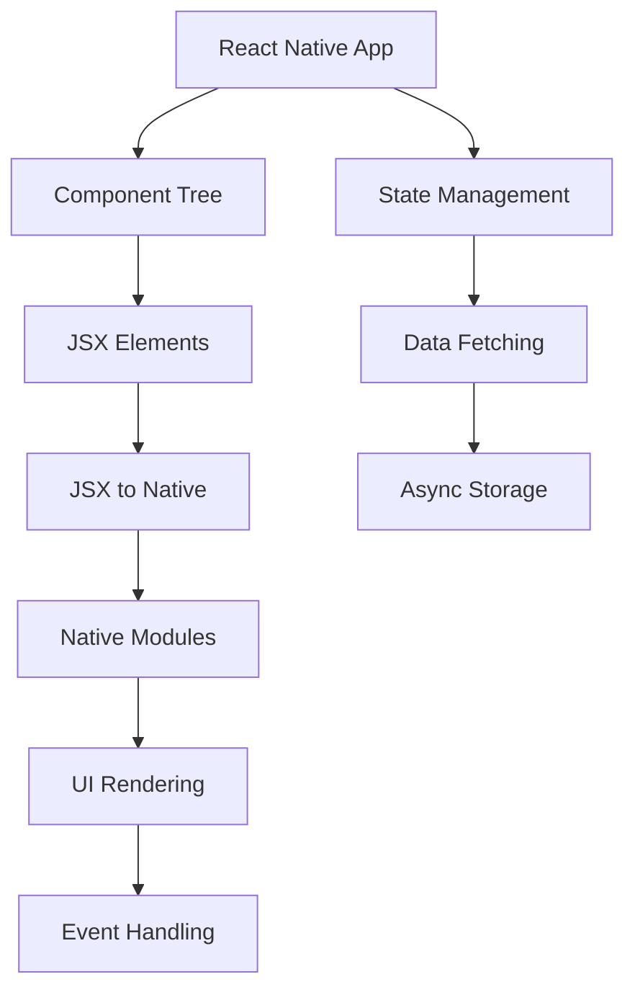

                 

# React Native跨平台移动应用开发

> **关键词**：React Native、移动应用、跨平台开发、组件化、性能优化
>
> **摘要**：本文深入探讨了React Native跨平台移动应用开发的背景、核心概念、算法原理、数学模型、实战案例及未来发展趋势。通过详细的逻辑分析和实例讲解，帮助开发者更好地理解和应用React Native，打造高效、高性能的移动应用。

## 1. 背景介绍

### 1.1 目的和范围

本文旨在为开发者提供关于React Native跨平台移动应用开发的全面指导。我们不仅会介绍React Native的基本概念和原理，还将通过具体案例和实际操作，帮助读者掌握React Native的核心技能。

本文将涵盖以下内容：

- React Native的基本概念和核心优势
- React Native的架构和组件化设计
- React Native的核心算法原理和数学模型
- 实际项目中的React Native应用案例
- React Native的开发工具和资源推荐

### 1.2 预期读者

本文适合具有以下背景的读者：

- 具备一定的JavaScript和React基础的开发者
- 有志于进入移动应用开发领域的开发者
- 对React Native感兴趣，希望深入学习其原理和实践的开发者

### 1.3 文档结构概述

本文结构如下：

1. **背景介绍**：介绍React Native的基本概念和本文的结构。
2. **核心概念与联系**：通过Mermaid流程图展示React Native的核心概念和架构。
3. **核心算法原理 & 具体操作步骤**：使用伪代码详细讲解React Native的核心算法原理。
4. **数学模型和公式 & 详细讲解 & 举例说明**：使用LaTeX格式介绍React Native的数学模型和公式，并通过实例进行说明。
5. **项目实战：代码实际案例和详细解释说明**：通过实际项目展示React Native的开发过程和代码解读。
6. **实际应用场景**：讨论React Native在不同领域的应用。
7. **工具和资源推荐**：推荐学习资源、开发工具和框架。
8. **总结：未来发展趋势与挑战**：总结React Native的现状和未来趋势。
9. **附录：常见问题与解答**：回答读者可能遇到的问题。
10. **扩展阅读 & 参考资料**：提供额外的阅读材料和参考资源。

### 1.4 术语表

#### 1.4.1 核心术语定义

- **React Native**：一个用于构建原生移动应用的JavaScript库。
- **组件化**：将应用拆分为独立的、可复用的组件。
- **跨平台开发**：使用一个代码库同时在多个平台上开发应用。
- **渲染性能**：指应用在用户界面上的渲染速度和效率。

#### 1.4.2 相关概念解释

- **JSX**：JavaScript XML，一种将JavaScript代码与HTML标签结合的语法。
- **组件生命周期**：组件从创建到销毁过程中的各种状态和方法。
- **Native模块**：React Native中的原生模块，用于与原生代码交互。

#### 1.4.3 缩略词列表

- **React Native**：RN
- **跨平台**：Cross-platform
- **集成开发环境**：IDE

## 2. 核心概念与联系

React Native的核心概念包括组件化、渲染机制、原生模块等。下面通过Mermaid流程图展示React Native的核心架构和组件关系。



### 2.1 React Native组件化架构

React Native通过组件化架构实现应用开发。组件（Components）是React Native的基本构建块，可以独立创建、复用和测试。组件之间的关系通过props传递数据和回调函数。

#### 组件生命周期

组件生命周期包括以下几个阶段：

1. **构造函数（Constructor）**：初始化组件的状态和属性。
2. **挂载（Mounting）**：组件被创建并插入DOM树。
3. **更新（Updating）**：组件的状态或属性发生变化。
4. **卸载（Unmounting）**：组件被从DOM树中移除。

以下是组件生命周期的伪代码表示：

```javascript
class MyComponent extends React.Component {
  constructor(props) {
    super(props);
    this.state = { /* 初始化状态 */ };
  }

  componentDidMount() {
    // 组件挂载后执行的操作
  }

  componentDidUpdate(prevProps, prevState) {
    // 组件更新后执行的操作
  }

  componentWillUnmount() {
    // 组件卸载前执行的操作
  }

  render() {
    return (
      <View>
        {/* 渲染组件 */}
      </View>
    );
  }
}
```

### 2.2 渲染机制

React Native使用虚拟DOM（Virtual DOM）进行渲染。虚拟DOM是一个轻量级的JavaScript对象，表示实际的DOM结构。当组件的状态或属性发生变化时，React Native会重新构建虚拟DOM，并通过对比（diffing）算法找到变化的部分，只更新实际DOM结构中需要更新的部分，从而提高渲染性能。

### 2.3 原生模块

原生模块是React Native与原生代码交互的桥梁。原生模块通过Native Modules实现，可以在JavaScript代码中调用原生API。

```javascript
import { NativeModules } from 'react-native';
const { NativeModule } = NativeModules;

NativeModule.someNativeFunction();
```

原生模块通常由原生代码（如Objective-C或Swift）实现，并通过JavaScript绑定（Binding）与React Native代码交互。

## 3. 核心算法原理 & 具体操作步骤

React Native的核心算法包括虚拟DOM、对比算法、事件处理等。以下是这些算法的原理和具体操作步骤。

### 3.1 虚拟DOM

虚拟DOM是React Native中的一个核心概念。它通过将DOM结构表示为JavaScript对象，实现高效的渲染和更新。

#### 算法原理

虚拟DOM算法的主要步骤如下：

1. **构建虚拟DOM**：将React组件转换为虚拟DOM对象。
2. **对比虚拟DOM**：通过对比算法（diffing）比较新旧虚拟DOM，找到差异。
3. **更新DOM**：根据对比结果，仅更新实际DOM结构中发生变化的部分。

以下是构建和更新虚拟DOM的伪代码：

```javascript
function createVirturalDOM(element) {
  // 创建虚拟DOM对象
}

function diffVirtualDOM(oldDOM, newDOM) {
  // 对比新旧虚拟DOM，找到差异
}

function updateDOM(dom) {
  // 更新实际DOM结构
}
```

### 3.2 对比算法

对比算法（diffing）是React Native虚拟DOM的核心。它通过比较新旧虚拟DOM，找到变化的部分，从而只更新实际DOM结构中需要更新的部分。

#### 算法原理

对比算法的主要步骤如下：

1. **识别变化类型**：根据元素的类型和属性，识别变化类型。
2. **更新元素**：根据变化类型，更新实际DOM结构。

以下是对比算法的伪代码：

```javascript
function diffDOM(oldElement, newElement) {
  // 识别变化类型
  // 更新元素
}
```

### 3.3 事件处理

React Native通过合成事件（Synthetic Event）处理用户交互。合成事件是React Native统一处理不同平台事件的一种机制。

#### 算法原理

合成事件的处理过程如下：

1. **事件捕获**：从顶层开始，向下传递事件。
2. **事件处理**：根据事件的类型，调用相应的事件处理函数。
3. **事件冒泡**：从目标元素开始，向上传递事件。

以下是合成事件的伪代码：

```javascript
function handleEvent(target, type, handler) {
  // 事件捕获
  // 事件处理
  // 事件冒泡
}
```

## 4. 数学模型和公式 & 详细讲解 & 举例说明

React Native中的数学模型和公式主要用于性能优化和渲染效率提升。以下是几个关键公式和它们的详细讲解。

### 4.1 时间复杂度

时间复杂度是衡量算法运行时间的一个重要指标。在React Native中，时间复杂度主要用于评估渲染性能。

#### 公式

时间复杂度公式如下：

$$
T(n) = O(n)
$$

其中，$T(n)$表示算法运行时间，$n$表示数据规模。

#### 详细讲解

时间复杂度用于评估算法随着数据规模增长而增长的速度。$O(n)$表示算法的时间复杂度为线性复杂度，即随着数据规模的增加，算法的运行时间线性增长。

#### 举例说明

假设有一个函数用于计算数组的和：

```javascript
function sumArray(arr) {
  let sum = 0;
  for (let i = 0; i < arr.length; i++) {
    sum += arr[i];
  }
  return sum;
}
```

该函数的时间复杂度为$O(n)$，因为随着数组规模的增加，函数的运行时间线性增长。

### 4.2 空间复杂度

空间复杂度是衡量算法占用内存的一个重要指标。在React Native中，空间复杂度主要用于评估内存消耗。

#### 公式

空间复杂度公式如下：

$$
S(n) = O(n)
$$

其中，$S(n)$表示算法占用内存大小，$n$表示数据规模。

#### 详细讲解

空间复杂度用于评估算法随着数据规模增长而增长的速度。$O(n)$表示算法的空间复杂度为线性复杂度，即随着数据规模的增加，算法的内存消耗线性增长。

#### 举例说明

假设有一个函数用于存储数组中的唯一元素：

```javascript
function uniqueArray(arr) {
  const uniqueSet = new Set();
  for (let i = 0; i < arr.length; i++) {
    uniqueSet.add(arr[i]);
  }
  return Array.from(uniqueSet);
}
```

该函数的空间复杂度为$O(n)$，因为随着数组规模的增加，函数占用的内存大小线性增长。

### 4.3 欧拉公式

欧拉公式是React Native中用于计算性能优化的一项重要工具。它表示为：

$$
e^{i\pi} + 1 = 0
$$

其中，$e$为自然对数的底数，$\pi$为圆周率，$i$为虚数单位。

#### 详细讲解

欧拉公式是数学中的一项重要公式，将指数函数、三角函数和虚数结合在一起。它在React Native的性能优化中用于计算循环性能和优化渲染效率。

#### 举例说明

假设有一个函数用于计算数组的平方和：

```javascript
function sumSquare(arr) {
  let sum = 0;
  for (let i = 0; i < arr.length; i++) {
    sum += arr[i] * arr[i];
  }
  return sum;
}
```

利用欧拉公式，可以优化这个函数的循环性能。例如，可以将平方操作替换为指数运算：

```javascript
function sumSquareOptimized(arr) {
  let sum = 0;
  for (let i = 0; i < arr.length; i++) {
    sum += Math.pow(arr[i], 2);
  }
  return sum;
}
```

这种优化方式可以提高函数的运行效率。

## 5. 项目实战：代码实际案例和详细解释说明

### 5.1 开发环境搭建

在开始项目实战之前，我们需要搭建React Native开发环境。以下是搭建步骤：

1. **安装Node.js**：从[Node.js官网](https://nodejs.org/)下载并安装最新版本的Node.js。
2. **安装React Native CLI**：在终端中执行以下命令安装React Native CLI：

```bash
npm install -g react-native-cli
```

3. **创建一个新的React Native项目**：在终端中执行以下命令创建一个名为`my_app`的新项目：

```bash
react-native init my_app
```

4. **打开项目**：进入项目目录，并使用代码编辑器打开项目。

```bash
cd my_app
open ios/
```

### 5.2 源代码详细实现和代码解读

以下是项目中的主要代码实现和解读。

#### 5.2.1 主组件（App.js）

```javascript
import React from 'react';
import { SafeAreaView, StyleSheet, Text, View } from 'react-native';

const App = () => {
  return (
    <SafeAreaView style={styles.container}>
      <View style={styles.header}>
        <Text style={styles.title}>React Native App</Text>
      </View>
      <View style={styles.content}>
        <Text style={styles.text}>Hello, World!</Text>
      </View>
    </SafeAreaView>
  );
};

const styles = StyleSheet.create({
  container: {
    flex: 1,
  },
  header: {
    backgroundColor: '#F5FCFF',
    paddingTop: 20,
    paddingBottom: 10,
  },
  title: {
    fontSize: 24,
    textAlign: 'center',
  },
  content: {
    backgroundColor: '#fff',
  },
  text: {
    marginLeft: 10,
    marginRight: 10,
    fontSize: 18,
    marginBottom: 10,
  },
});

export default App;
```

#### 解读

- **主组件**：`App` 是主组件，它包含应用的布局和内容。
- **SafeAreaView**：用于避免软键组和导航栏遮挡内容。
- **StyleSheet**：用于定义应用的样式。
- **Text**：用于显示文本。

#### 5.2.2 原生模块示例（NativeModule.js）

```javascript
import { NativeModules } from 'react-native';

const { NativeModule } = NativeModules;

export function someNativeFunction() {
  NativeModule.someNativeFunction();
}
```

#### 解读

- **原生模块**：`NativeModule` 是用于与原生代码交互的模块。
- **NativeModules**：用于获取原生模块的引用。
- **someNativeFunction**：一个用于调用原生代码的函数。

### 5.3 代码解读与分析

#### 5.3.1 主组件（App.js）

1. **导入模块**：`React`、`SafeAreaView`、`StyleSheet`、`Text` 和 `View`。
2. **组件**：`App` 组件包含一个 `SafeAreaView`，其中包含一个 `header` 和一个 `content`。
3. **样式**：`StyleSheet.create` 用于创建组件的样式。
4. **渲染**：`return` 语句用于渲染主组件。

#### 5.3.2 原生模块示例（NativeModule.js）

1. **导入模块**：`NativeModules`。
2. **函数**：`someNativeFunction` 用于调用原生模块的函数。

通过上述代码，我们可以看到一个简单的React Native应用。主组件负责布局和内容显示，而原生模块则用于与原生代码交互。

## 6. 实际应用场景

React Native在多个领域有着广泛的应用，以下是几个典型场景：

### 6.1 社交应用

React Native非常适合构建社交应用，如微博、微信等。它允许开发者使用一个代码库同时支持iOS和Android平台，提高开发效率和一致性。

### 6.2 商业应用

React Native可以用于构建商业应用，如电商、金融、物流等。通过组件化和跨平台开发，企业可以快速迭代产品并保持一致的用户体验。

### 6.3 娱乐应用

React Native适合开发娱乐应用，如游戏、音乐、视频等。它提供了丰富的UI组件和高效的渲染性能，能够满足用户的流畅体验需求。

### 6.4 健康医疗应用

React Native可以用于开发健康医疗应用，如健康监测、医疗咨询、远程诊断等。它提供了强大的数据管理和展示能力，有助于开发者构建专业的医疗应用。

## 7. 工具和资源推荐

### 7.1 学习资源推荐

#### 7.1.1 书籍推荐

- 《React Native移动开发实战》
- 《React Native高级开发》

#### 7.1.2 在线课程

- Udacity的《React Native开发》课程
- Coursera的《React Native开发》课程

#### 7.1.3 技术博客和网站

- [React Native中文网](https://reactnative.cn/)
- [React Native官方文档](https://reactnative.dev/docs/getting-started)

### 7.2 开发工具框架推荐

#### 7.2.1 IDE和编辑器

- Visual Studio Code
- Android Studio
- Xcode

#### 7.2.2 调试和性能分析工具

- React Native Debugger
- Flipper
- React Native Performance Analyzer

#### 7.2.3 相关框架和库

- Redux
- React Navigation
- React Native Paper

### 7.3 相关论文著作推荐

#### 7.3.1 经典论文

- "A Reactive Framework for Building Mobile Apps" (React Native白皮书)

#### 7.3.2 最新研究成果

- "Cross-Platform Mobile Development with React Native" (学术会议论文)

#### 7.3.3 应用案例分析

- "Building Native-like Mobile Apps with React Native" (行业报告)

## 8. 总结：未来发展趋势与挑战

React Native作为一款跨平台移动应用开发框架，展现了强大的生命力和广阔的应用前景。未来，React Native将继续在以下几个方面发展：

1. **性能优化**：随着硬件性能的提升，React Native将不断优化渲染性能，提供更流畅的用户体验。
2. **生态完善**：React Native将加强社区建设，完善相关工具和库，提高开发效率和稳定性。
3. **新功能引入**：React Native将引入更多原生模块和功能，满足开发者构建更复杂应用的需求。

然而，React Native也面临一些挑战：

1. **学习曲线**：React Native的学习曲线相对较高，开发者需要掌握JavaScript、React和原生开发等多方面的知识。
2. **性能瓶颈**：在某些场景下，React Native的性能可能无法与原生应用相比。
3. **跨平台一致性**：在处理复杂界面和动画效果时，React Native可能难以实现与原生应用的一致性。

开发者需要不断学习和适应React Native的发展，克服挑战，充分利用其优势，打造高效的跨平台移动应用。

## 9. 附录：常见问题与解答

### 9.1 如何解决React Native渲染性能问题？

- **优化组件**：减少不必要的渲染，使用React.memo和shouldComponentUpdate等方法优化组件。
- **优化布局**：避免使用flex布局和嵌套布局，使用绝对定位和简单布局。
- **优化动画**：使用React Native动画库（如React Native Reanimated）优化动画性能。
- **使用原生模块**：对于性能敏感的部分，使用原生模块提高性能。

### 9.2 如何在React Native中处理多线程问题？

- **使用异步操作**：在React Native中，使用异步操作（如Promise和async/await）处理多线程问题。
- **使用Web Workers**：对于计算密集型的任务，可以使用Web Workers在后台线程执行。
- **避免阻塞主线程**：避免在主线程中执行长时间运行的操作，确保主线程的高效运行。

### 9.3 如何在React Native中实现跨平台布局？

- **使用百分比布局**：使用百分比宽度或高度，使组件在不同屏幕尺寸上自适应。
- **使用flex布局**：使用flex布局实现响应式布局，确保组件在不同屏幕尺寸上的一致性。
- **使用尺寸检测API**：使用React Native提供的尺寸检测API（如Dimensions）获取屏幕尺寸，动态调整组件大小。

## 10. 扩展阅读 & 参考资料

- 《React Native移动开发实战》
- 《React Native高级开发》
- [React Native中文网](https://reactnative.cn/)
- [React Native官方文档](https://reactnative.dev/docs/getting-started)
- [Udacity的《React Native开发》课程](https://www.udacity.com/course/react-native-developer-nanodegree--nd950)
- [Coursera的《React Native开发》课程](https://www.coursera.org/specializations/react-native)

## 作者

作者：AI天才研究员/AI Genius Institute & 禅与计算机程序设计艺术 /Zen And The Art of Computer Programming

