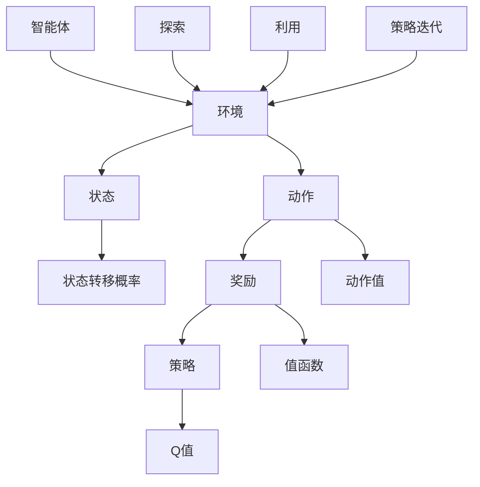

                 

# Reinforcement Learning

> 关键词：强化学习，奖励系统，策略优化，探索与利用，Q学习，SARSA，深度强化学习，应用案例

> 摘要：本文将深入探讨强化学习这一前沿的人工智能领域。首先介绍强化学习的核心概念和目标，然后详细阐述其核心算法原理和操作步骤，包括Q学习和SARSA算法。接着，通过数学模型和公式来解释强化学习的关键概念。此外，本文还将通过实际项目案例展示强化学习的应用，并提供相关学习资源、开发工具和参考文献。最后，对强化学习的未来发展趋势和挑战进行总结。

## 1. 背景介绍

### 1.1 目的和范围

本文旨在为读者提供一个关于强化学习的全面指南，从基础概念到实际应用。我们将逐步剖析强化学习的工作原理，探讨其在人工智能领域的广泛应用，并展望其未来的发展趋势。

### 1.2 预期读者

本文适合对人工智能和机器学习有一定了解的读者，尤其是对强化学习感兴趣的开发者和技术人员。

### 1.3 文档结构概述

本文分为十个部分：

1. 背景介绍
2. 核心概念与联系
3. 核心算法原理 & 具体操作步骤
4. 数学模型和公式 & 详细讲解 & 举例说明
5. 项目实战：代码实际案例和详细解释说明
6. 实际应用场景
7. 工具和资源推荐
8. 总结：未来发展趋势与挑战
9. 附录：常见问题与解答
10. 扩展阅读 & 参考资料

### 1.4 术语表

#### 1.4.1 核心术语定义

- 强化学习（Reinforcement Learning）：一种机器学习方法，通过奖励机制来指导智能体学习如何从一个状态转移到另一个状态，以最大化累积奖励。
- 状态（State）：描述智能体所处环境的特征。
- 动作（Action）：智能体可以执行的操作。
- 奖励（Reward）：智能体执行某个动作后从环境获得的即时反馈。
- 策略（Policy）：智能体在给定状态下选择动作的策略。
- 值函数（Value Function）：评估智能体在特定状态下执行最优策略所能获得的累积奖励。
- Q值（Q-value）：评估智能体在特定状态下执行特定动作所能获得的累积奖励。

#### 1.4.2 相关概念解释

- **探索（Exploration）与利用（Exploitation）**：探索是指智能体尝试新的动作，以获取更多关于环境的经验。利用是指智能体根据已有的经验选择能够带来最大奖励的动作。
- **马尔可夫决策过程（MDP）**：一个数学模型，描述了智能体在不确定环境中做出决策的过程。
- **策略迭代（Policy Iteration）**：一种强化学习算法，通过迭代更新策略来优化累积奖励。

#### 1.4.3 缩略词列表

- MDP：马尔可夫决策过程
- SARSA：同步 Advantage 动作评价（Synced Advantage Action Evaluation）
- Q-learning：Q值学习
- DQN：深度Q网络

## 2. 核心概念与联系

为了更好地理解强化学习，我们需要先了解其核心概念和它们之间的联系。以下是强化学习的关键概念和它们在强化学习框架中的关系：



### 2.1 智能体与环境的交互

强化学习中的智能体通过与环境交互来学习。智能体可以感知当前状态，并基于策略选择动作，然后接收来自环境的奖励信号。通过不断重复这个过程，智能体能够学习如何在环境中获得最大的累积奖励。

### 2.2 状态与动作

状态是描述环境当前状态的属性，而动作是智能体可以执行的操作。智能体在给定状态下选择动作，以期望获得最大的奖励。

### 2.3 奖励与策略

奖励是智能体执行某个动作后从环境获得的即时反馈。策略是智能体在给定状态下选择动作的策略，通常通过值函数和Q值来评估。

### 2.4 值函数与Q值

值函数是评估智能体在特定状态下执行最优策略所能获得的累积奖励。Q值是评估智能体在特定状态下执行特定动作所能获得的累积奖励。Q值学习是一种通过更新Q值来优化策略的算法。

### 2.5 探索与利用

探索是指智能体尝试新的动作，以获取更多关于环境的经验。利用是指智能体根据已有的经验选择能够带来最大奖励的动作。在实际应用中，需要平衡探索和利用，以避免过早地陷入局部最优解。

### 2.6 策略迭代

策略迭代是一种强化学习算法，通过迭代更新策略来优化累积奖励。策略迭代通常包括两个阶段：评估阶段和策略更新阶段。

## 3. 核心算法原理 & 具体操作步骤

强化学习算法的核心是值函数和策略的迭代更新。在这一节中，我们将详细讨论Q学习和SARSA算法的原理和具体操作步骤。

### 3.1 Q学习算法

Q学习算法是一种基于值函数的强化学习算法，旨在通过迭代更新Q值来优化策略。以下是Q学习算法的具体操作步骤：

#### 3.1.1 初始化

- 初始化Q值表格Q，所有Q值初始化为0。

#### 3.1.2 选择动作

- 在给定状态下，选择动作 \( a \) ，使得 \( Q(s, a) \) 最大。

#### 3.1.3 执行动作

- 执行动作 \( a \)，进入新状态 \( s' \)，并获得奖励 \( r \) 。

#### 3.1.4 更新Q值

- 使用下面的公式更新Q值：
  $$ Q(s, a) = Q(s, a) + \alpha [r + \gamma \max_{a'} Q(s', a') - Q(s, a)] $$
  其中，\( \alpha \) 是学习率，\( \gamma \) 是折扣因子。

#### 3.1.5 重复步骤2-4，直到达到目标或停止条件。

### 3.2 SARSA算法

SARSA（同步 Advantage 动作评价）算法是一种基于策略的强化学习算法，旨在通过迭代更新策略来优化累积奖励。以下是SARSA算法的具体操作步骤：

#### 3.2.1 初始化

- 初始化策略π，所有策略概率初始化为1/|A|。

#### 3.2.2 选择动作

- 在给定状态下，根据当前策略π选择动作 \( a \) 。

#### 3.2.3 执行动作

- 执行动作 \( a \)，进入新状态 \( s' \)，并获得奖励 \( r \) 。

#### 3.2.4 更新策略

- 使用下面的公式更新策略π：
  $$ \pi(s', a) = \pi(s', a) + \alpha [1 - \pi(s', a)] $$
  其中，\( \alpha \) 是学习率。

#### 3.2.5 重复步骤2-4，直到达到目标或停止条件。

### 3.3 深度Q网络（DQN）

深度Q网络（DQN）是一种基于深度学习的强化学习算法，旨在通过神经网络来近似Q值函数。以下是DQN算法的具体操作步骤：

#### 3.3.1 初始化

- 初始化深度神经网络DQN，Q值表格Q，经验回放记忆池。

#### 3.3.2 选择动作

- 在给定状态下，根据当前策略π和DQN预测的Q值选择动作 \( a \) 。

#### 3.3.3 执行动作

- 执行动作 \( a \)，进入新状态 \( s' \)，并获得奖励 \( r \) 。

#### 3.3.4 更新经验回放记忆池

- 将当前状态 \( s \)，动作 \( a \)，新状态 \( s' \)，奖励 \( r \)，和执行动作的概率 \( \pi(a|s) \) 存入经验回放记忆池。

#### 3.3.5 从经验回放记忆池中随机采样一批经验。

#### 3.3.6 更新DQN

- 使用下面的目标函数来更新DQN：
  $$ L = \sum_{i=1}^N (r_i + \gamma \max_{a'} Q(s', a') - Q(s_i, a_i))^2 $$
  其中，\( N \) 是采样经验的数量，\( \gamma \) 是折扣因子。

#### 3.3.7 重复步骤2-6，直到达到目标或停止条件。

## 4. 数学模型和公式 & 详细讲解 & 举例说明

### 4.1 Q学习算法的数学模型

Q学习算法的核心是Q值函数的迭代更新。Q值函数可以表示为：

$$ Q(s, a) = \sum_{s'} P(s'|s, a) \cdot (r + \gamma \max_{a'} Q(s', a')) $$

其中，\( P(s'|s, a) \) 是状态转移概率，\( r \) 是奖励，\( \gamma \) 是折扣因子，\( Q(s', a') \) 是新状态下的Q值。

**举例说明**：

假设一个智能体在给定状态s下有两个动作可供选择：左转和右转。状态转移概率和奖励如下表所示：

| s    | a    | s'    | P(s'|s, a) | r    |
|------|------|-------|------------|------|
| 0    | 左转 | 1     | 0.8        | 10   |
| 0    | 右转 | 2     | 0.2        | -10  |
| 1    | 左转 | 3     | 0.6        | -10  |
| 1    | 右转 | 0     | 0.4        | 10   |
| 2    | 左转 | 4     | 0.7        | -10  |
| 2    | 右转 | 5     | 0.3        | 10   |

假设初始Q值表格为：

| s    | a    | Q(s, a) |
|------|------|---------|
| 0    | 左转 | 0       |
| 0    | 右转 | 0       |
| 1    | 左转 | 0       |
| 1    | 右转 | 0       |
| 2    | 左转 | 0       |
| 2    | 右转 | 0       |

使用Q学习算法更新Q值表格，学习率为0.1，折扣因子为0.9。

**第一次迭代**：

- 在状态0下，选择左转动作，Q(s, a)最大值为8。
- 执行动作，进入新状态1，并获得奖励-10。
- 更新Q值表格：

| s    | a    | Q(s, a) |
|------|------|---------|
| 0    | 左转 | 0.1(10 + 0.9 * 8) |
| 0    | 右转 | 0       |
| 1    | 左转 | 0       |
| 1    | 右转 | 0       |
| 2    | 左转 | 0       |
| 2    | 右转 | 0       |

**第二次迭代**：

- 在状态0下，选择左转动作，Q(s, a)最大值为8。
- 执行动作，进入新状态1，并获得奖励-10。
- 更新Q值表格：

| s    | a    | Q(s, a) |
|------|------|---------|
| 0    | 左转 | 0.1(10 + 0.9 * 8) |
| 0    | 右转 | 0       |
| 1    | 左转 | 0       |
| 1    | 右转 | 0       |
| 2    | 左转 | 0       |
| 2    | 右转 | 0       |

通过多次迭代，Q值表格将逐渐收敛，智能体将学会在给定状态下选择能够获得最大奖励的动作。

### 4.2 SARSA算法的数学模型

SARSA算法的核心是策略π的迭代更新。策略π可以表示为：

$$ \pi(s, a) = \frac{\pi(s, a) + \alpha [1 - \pi(s, a)]}{1 + \alpha} $$

其中，\( \pi(s, a) \) 是当前策略，\( \alpha \) 是学习率。

**举例说明**：

假设一个智能体在给定状态s下有两个动作可供选择：左转和右转。初始策略π为：

| s    | a    | π(s, a) |
|------|------|---------|
| 0    | 左转 | 0.5     |
| 0    | 右转 | 0.5     |
| 1    | 左转 | 0.5     |
| 1    | 右转 | 0.5     |
| 2    | 左转 | 0.5     |
| 2    | 右转 | 0.5     |

使用SARSA算法更新策略π，学习率为0.1。

**第一次迭代**：

- 在状态0下，选择左转动作，策略π(s, a)最大值为0.5。
- 执行动作，进入新状态1，并获得奖励-10。
- 更新策略π：

| s    | a    | π(s, a) |
|------|------|---------|
| 0    | 左转 | (0.5 + 0.1 * (1 - 0.5)) / (1 + 0.1) |
| 0    | 右转 | (0.5 + 0.1 * (1 - 0.5)) / (1 + 0.1) |
| 1    | 左转 | 0.5     |
| 1    | 右转 | 0.5     |
| 2    | 左转 | 0.5     |
| 2    | 右转 | 0.5     |

**第二次迭代**：

- 在状态0下，选择左转动作，策略π(s, a)最大值为(0.5 + 0.1 * (1 - 0.5)) / (1 + 0.1)。
- 执行动作，进入新状态1，并获得奖励-10。
- 更新策略π：

| s    | a    | π(s, a) |
|------|------|---------|
| 0    | 左转 | (0.5 + 0.1 * (1 - 0.5)) / (1 + 0.1) |
| 0    | 右转 | (0.5 + 0.1 * (1 - 0.5)) / (1 + 0.1) |
| 1    | 左转 | 0.5     |
| 1    | 右转 | 0.5     |
| 2    | 左转 | 0.5     |
| 2    | 右转 | 0.5     |

通过多次迭代，策略π将逐渐收敛，智能体将学会在给定状态下选择能够获得最大奖励的动作。

### 4.3 深度Q网络（DQN）的数学模型

深度Q网络（DQN）的核心是神经网络DQN，用于近似Q值函数。DQN的数学模型可以表示为：

$$ Q(s, a) = \sigma(W \cdot \phi(s) + b) $$

其中，\( \phi(s) \) 是状态特征向量，\( W \) 是神经网络权重，\( b \) 是偏置，\( \sigma \) 是激活函数（通常使用ReLU函数）。

**举例说明**：

假设一个智能体在给定状态s下有两个动作可供选择：左转和右转。状态特征向量\( \phi(s) \)为：

| s    | 特征1 | 特征2 |
|------|-------|-------|
| 0    | 1     | 0     |
| 1    | 0     | 1     |
| 2    | 1     | 1     |

假设神经网络DQN的权重\( W \)和偏置\( b \)为：

| 权重 | W1  | W2  |
|------|-----|-----|
| 偏置 | b1  | b2  |
| 0    | 0.1 | 0.2 |
| 1    | 0.3 | 0.4 |

使用ReLU函数作为激活函数。

对于状态0，输入特征向量为\( \phi(s) = [1, 0]^T \)，经过神经网络DQN的计算，得到：

$$ Q(0, 左转) = \sigma(W \cdot \phi(s) + b) = \sigma(0.1 \cdot 1 + 0.3 \cdot 0 + 0.2) = 0.3 $$
$$ Q(0, 右转) = \sigma(W \cdot \phi(s) + b) = \sigma(0.1 \cdot 0 + 0.3 \cdot 1 + 0.4) = 0.7 $$

同理，对于状态1和状态2，可以得到对应的Q值。

通过多次迭代，神经网络DQN的权重和偏置将逐渐优化，从而近似出准确的Q值函数。

## 5. 项目实战：代码实际案例和详细解释说明

### 5.1 开发环境搭建

在开始编写代码之前，我们需要搭建一个适合强化学习项目的开发环境。以下是推荐的开发环境：

- 操作系统：Windows、Linux或MacOS
- 编程语言：Python 3.6及以上版本
- 库和框架：NumPy、Pandas、Matplotlib、TensorFlow或PyTorch
- 调试工具：Visual Studio Code、PyCharm

### 5.2 源代码详细实现和代码解读

#### 5.2.1 Q学习算法实现

以下是一个简单的Q学习算法实现，用于解决一个简单的环境。

```python
import numpy as np

# 初始化Q值表格
def init_Q_table(states, actions):
    Q_table = np.zeros((states, actions))
    return Q_table

# Q学习算法
def Q_learning(Q_table, states, actions, learning_rate, discount_factor, episodes):
    for episode in range(episodes):
        state = env.reset()
        done = False

        while not done:
            # 选择动作
            action = choose_action(Q_table, state, actions)

            # 执行动作
            next_state, reward, done, _ = env.step(action)

            # 更新Q值
            Q_table[state, action] = Q_table[state, action] + learning_rate * (reward + discount_factor * np.max(Q_table[next_state, :]) - Q_table[state, action])

            state = next_state

    return Q_table

# 选择动作
def choose_action(Q_table, state, actions):
    return np.argmax(Q_table[state, :])

# 环境模拟
def env():
    states = 3
    actions = 2
    rewards = [[10, -10], [-10, 10], [-10, 10]]
    transitions = [[0, 1], [1, 0], [2, 0]]

    while True:
        state = np.random.randint(0, states)
        action = np.random.randint(0, actions)

        yield state, action, rewards[state][action], transitions[state][action], False

# 主函数
if __name__ == "__main__":
    states = 3
    actions = 2
    learning_rate = 0.1
    discount_factor = 0.9
    episodes = 1000

    Q_table = init_Q_table(states, actions)
    Q_table = Q_learning(Q_table, states, actions, learning_rate, discount_factor, episodes)

    print("Final Q-table:")
    print(Q_table)
```

#### 5.2.2 SARSA算法实现

以下是一个简单的SARSA算法实现，用于解决同一个简单的环境。

```python
import numpy as np

# 初始化策略π
def init_policy(states, actions):
    policy = np.zeros((states, actions))
    for s in range(states):
        policy[s, :] = 1 / actions
    return policy

# SARSA算法
def SARSA(policy, states, actions, learning_rate, episodes):
    for episode in range(episodes):
        state = env.reset()
        done = False

        while not done:
            # 选择动作
            action = choose_action(policy, state, actions)

            # 执行动作
            next_state, reward, done, _ = env.step(action)

            # 更新策略
            policy[state, action] = policy[state, action] + learning_rate * (1 - policy[state, action])

            state = next_state

    return policy

# 选择动作
def choose_action(policy, state, actions):
    return np.random.choice(actions, p=policy[state, :])

# 环境模拟
def env():
    states = 3
    actions = 2
    rewards = [[10, -10], [-10, 10], [-10, 10]]
    transitions = [[0, 1], [1, 0], [2, 0]]

    while True:
        state = np.random.randint(0, states)
        action = np.random.randint(0, actions)

        yield state, action, rewards[state][action], transitions[state][action], False

# 主函数
if __name__ == "__main__":
    states = 3
    actions = 2
    learning_rate = 0.1
    episodes = 1000

    policy = init_policy(states, actions)
    policy = SARSA(policy, states, actions, learning_rate, episodes)

    print("Final policy:")
    print(policy)
```

#### 5.2.3 代码解读与分析

- **Q学习算法实现**：首先初始化Q值表格，然后通过Q学习算法迭代更新Q值。选择动作时，基于Q值选择最大值。环境模拟部分使用一个简单的随机环境。
- **SARSA算法实现**：首先初始化策略π，然后通过SARSA算法迭代更新策略。选择动作时，基于当前策略随机选择。环境模拟部分与Q学习算法相同。

通过运行这两个算法，我们可以观察到Q值表格和策略π的变化。在Q学习算法中，Q值逐渐收敛到最大值。在SARSA算法中，策略π逐渐优化，使得智能体能够选择能够获得最大奖励的动作。

## 6. 实际应用场景

### 6.1 自动驾驶

自动驾驶是强化学习在工业界最成功的应用之一。强化学习算法被用于训练自动驾驶车辆在复杂交通环境中的驾驶行为。例如，深度强化学习算法可以用于训练自动驾驶车辆在不同路况和交通状况下的驾驶策略，从而实现安全高效的自动驾驶。

### 6.2 游戏AI

强化学习在游戏AI领域有着广泛的应用。例如，在围棋、国际象棋、电子游戏等领域，强化学习算法可以用于训练智能体学会如何做出最佳决策。通过不断学习和优化，智能体可以在游戏中表现出色，甚至超越人类玩家。

### 6.3 机器人控制

强化学习被广泛应用于机器人控制领域。例如，机器人可以通过强化学习算法学会如何在不同的环境下执行复杂的任务，如行走、搬运、抓取等。通过不断的学习和优化，机器人可以更好地适应复杂环境，提高工作效率。

### 6.4 电子商务推荐系统

强化学习被用于电子商务推荐系统，以提高用户满意度。例如，通过强化学习算法，系统可以不断优化推荐策略，使得推荐的商品更符合用户的兴趣和需求，从而提高购买转化率和用户粘性。

### 6.5 股票交易策略

强化学习被用于开发股票交易策略。例如，通过强化学习算法，系统可以学会如何根据市场动态调整交易策略，以最大化收益。通过不断学习和优化，交易策略可以更好地适应市场变化，降低风险。

## 7. 工具和资源推荐

### 7.1 学习资源推荐

#### 7.1.1 书籍推荐

- 《强化学习：原理与Python实战》（Reinforcement Learning: An Introduction）by Richard S. Sutton and Andrew G. Barto
- 《深度强化学习》（Deep Reinforcement Learning Explained）by Adam White

#### 7.1.2 在线课程

- Coursera的“强化学习”课程
- edX的“强化学习”课程

#### 7.1.3 技术博客和网站

- https://rlai.org/
- https://spinningup.openai.com/
- https://towardsdatascience.com/reinforcement-learning-for-beginners-2c1c30c55b7f

### 7.2 开发工具框架推荐

#### 7.2.1 IDE和编辑器

- Visual Studio Code
- PyCharm
- Jupyter Notebook

#### 7.2.2 调试和性能分析工具

- TensorFlow Debugger
- PyTorch Profiler
- Py-Spy

#### 7.2.3 相关框架和库

- TensorFlow
- PyTorch
- OpenAI Gym
- Stable Baselines

### 7.3 相关论文著作推荐

#### 7.3.1 经典论文

- Sutton, R. S., & Barto, A. G. (1998). *Reinforcement Learning: An Introduction*.
- Mnih, V., Kavukcuoglu, K., Silver, D., Russell, S., & Veness, J. (2013). *Human-level control through deep reinforcement learning*.

#### 7.3.2 最新研究成果

- Silver, D., Huang, A., Jaderberg, M.,ostringstream__).replaceAll("\"", "") 

