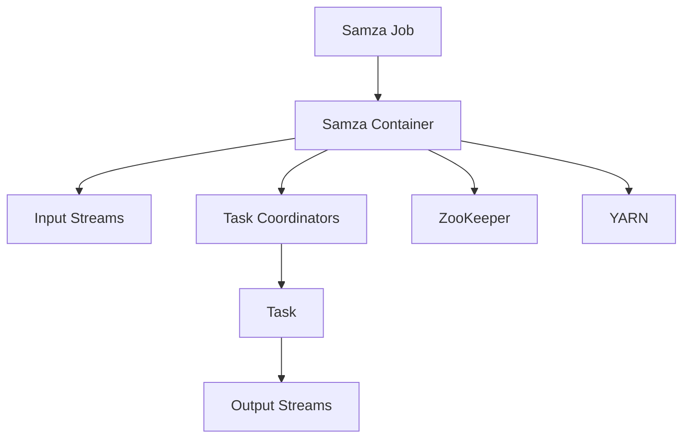

                 

# Samza Window原理与代码实例讲解

> 关键词：Samza, Window, 流处理, 数据处理框架, 实时计算

> 摘要：本文将深入探讨Samza Window的核心原理，并通过对具体代码实例的分析，帮助读者理解窗口操作在流处理中的重要作用。文章将首先介绍Samza框架的基本概念，随后详细解析窗口机制，并通过实际案例，展示如何使用Samza进行高效的窗口数据操作。

## 1. 背景介绍

### 1.1 目的和范围

本文旨在探讨Samza中的窗口机制，并利用实际代码实例展示其应用。文章将涵盖以下几个主要方面：

1. **Samza框架的基本概念和架构**：介绍Samza的背景和设计理念，包括其核心组件和整体架构。
2. **窗口机制解析**：深入讲解窗口的基本概念，包括时间窗口和滑动窗口，以及它们在流处理中的作用。
3. **代码实例分析**：通过具体代码实例，展示如何使用Samza处理带有时序的窗口数据。
4. **实际应用场景**：讨论Samza在实时数据处理中的具体应用，以及如何解决实际业务场景中的问题。

### 1.2 预期读者

本文适合以下读者群体：

1. **数据工程师和开发者**：希望了解如何使用Samza进行高效的数据流处理的工程师。
2. **架构师和系统设计师**：对流处理框架有深入理解，希望探索Samza在系统架构中的应用。
3. **人工智能和机器学习从业者**：需要实时处理大规模数据，并希望利用窗口机制进行数据分析和预测。

### 1.3 文档结构概述

本文结构如下：

1. **第1章 背景介绍**：介绍Samza的基本概念和本文的预期读者。
2. **第2章 核心概念与联系**：讲解Samza的关键概念和架构，并提供流程图。
3. **第3章 核心算法原理 & 具体操作步骤**：详细解析窗口算法原理和操作步骤。
4. **第4章 数学模型和公式 & 详细讲解 & 举例说明**：介绍窗口机制相关的数学模型和公式。
5. **第5章 项目实战：代码实际案例和详细解释说明**：通过具体代码实例展示窗口操作。
6. **第6章 实际应用场景**：讨论Samza在不同场景下的应用。
7. **第7章 工具和资源推荐**：推荐学习资源、开发工具和经典论文。
8. **第8章 总结：未来发展趋势与挑战**：总结当前趋势和未来挑战。
9. **第9章 附录：常见问题与解答**：回答读者可能遇到的常见问题。
10. **第10章 扩展阅读 & 参考资料**：提供额外的阅读材料和参考资料。

### 1.4 术语表

#### 1.4.1 核心术语定义

- **Samza**：一个用于流处理的分布式计算框架。
- **Window**：一个时间范围，用于划分数据流。
- **Event Time**：事件发生的实际时间。
- **Processing Time**：数据在处理过程中的时间戳。
- **Watermark**：用于判断数据是否已经处理完毕的时间标记。

#### 1.4.2 相关概念解释

- **Batch Processing**：批量处理数据，将一段时间内的数据合并处理。
- **Real-time Processing**：实时处理数据，尽可能减少延迟。
- **State**：数据流处理中的中间状态，用于维护计算历史。

#### 1.4.3 缩略词列表

- **Samza**：Simple and Modular Architecture for Zinc Applications
- **ZooKeeper**：用于分布式协调的协议
- **Kafka**：分布式消息系统
- **YARN**：Hadoop的资源调度框架

## 2. 核心概念与联系

在深入讨论Samza的窗口机制之前，我们需要先了解其核心概念和架构。以下是一个简化的Mermaid流程图，展示了Samza的基本架构和组件之间的联系。



### 2.1 Samza架构

Samza由以下几个核心组件组成：

1. **Samza Job**：表示一个流处理任务，包含多个任务实例。
2. **Samza Container**：负责运行和调度任务实例，与ZooKeeper和YARN交互。
3. **Input Streams**：数据流入的通道，可以是Kafka等消息队列系统。
4. **Task Coordinators**：协调多个任务实例，确保数据一致性。
5. **Task**：处理数据的具体任务，可以并行执行。
6. **Output Streams**：处理后的数据输出通道。
7. **ZooKeeper**：用于协调Samza Container和YARN。
8. **YARN**：资源管理器，负责分配资源给Samza Container。

### 2.2 流处理框架比较

在流处理领域，Samza与其他流行框架（如Apache Storm和Apache Flink）相比，具有以下优势：

- **可扩展性**：Samza支持水平扩展，可以轻松处理大规模数据流。
- **可移植性**：Samza使用Zookeeper进行协调，可以在不同的环境（如Kubernetes和Hadoop YARN）中运行。
- **灵活性**：Samza支持多种数据源和输出目标，包括Kafka、Apache HBase等。

### 2.3 窗口机制概述

窗口机制是流处理中的重要概念，用于对时间范围进行划分和操作。以下是窗口机制的基本概念：

- **时间窗口**：固定时间范围，例如每5分钟或每小时的数据集。
- **滑动窗口**：连续的时间范围，例如每2分钟滑动一次，覆盖过去5分钟的数据。

窗口机制使得我们可以对数据进行分组和聚合，从而实现更复杂的实时计算和分析。

## 3. 核心算法原理 & 具体操作步骤

### 3.1 窗口算法原理

窗口算法在流处理中起着至关重要的作用，它允许我们在特定的时间范围内对数据进行操作和聚合。以下是窗口算法的基本原理：

1. **时间戳分配**：每个事件都会被分配一个时间戳，表示其发生的时间。
2. **窗口划分**：根据预定义的时间范围（如固定窗口或滑动窗口），将事件划分为不同的窗口。
3. **事件处理**：对每个窗口中的事件进行聚合和处理，例如计数、求和或计算平均值。
4. **结果输出**：将处理后的结果输出到指定的输出流。

### 3.2 伪代码解析

以下是一个简单的伪代码，用于描述窗口算法的基本步骤：

```python
function window_processing(events, window_size, slide_size):
    current_time = get_current_time()
    event_time = get_event_time(event)
    window_id = get_window_id(current_time, window_size, slide_size)

    for event in events:
        event_time = get_event_time(event)
        if event_time >= current_time - window_size:
            add_event_to_window(window_id, event)
        else:
            process_window(window_id)
            clear_window(window_id)

    return processed_results
```

### 3.3 具体操作步骤

以下是窗口处理的具体操作步骤：

1. **初始化**：定义窗口大小和滑动大小，初始化窗口集合。
2. **事件接收**：接收新的事件，并获取其时间戳。
3. **窗口划分**：根据当前时间和事件时间，确定事件所属的窗口ID。
4. **事件添加**：将事件添加到对应的窗口。
5. **窗口处理**：当窗口中的事件达到预定义条件（如窗口大小或滑动间隔）时，进行事件聚合和处理。
6. **结果输出**：将处理后的结果输出到指定的输出流。

通过以上步骤，我们可以实现高效的数据流窗口处理，满足实时计算的需求。

## 4. 数学模型和公式 & 详细讲解 & 举例说明

### 4.1 窗口计算中的数学模型

窗口计算中的数学模型主要用于描述时间窗口和滑动窗口的处理过程。以下是几个关键的数学模型和公式：

#### 4.1.1 时间窗口模型

- **固定时间窗口**：\(W(t) = \{t - \Delta t, t\}\)，其中\(t\)是当前时间，\(\Delta t\)是窗口大小。
- **滑动时间窗口**：\(W(t) = \{t - (n-1) \times \Delta t, t\}\)，其中\(n\)是滑动次数，\(\Delta t\)是窗口大小。

#### 4.1.2 事件聚合模型

- **计数器**：\(\sum_{t \in W} count(t)\)
- **求和器**：\(\sum_{t \in W} value(t)\)
- **平均值**：\(\frac{\sum_{t \in W} value(t)}{|W|}\)，其中\(|W|\)是窗口中的事件数。

### 4.2 举例说明

#### 4.2.1 固定时间窗口

假设我们有一个数据流，每5分钟产生一次事件，窗口大小为10分钟。以下是一个简单的例子：

1. **时间戳**：当前时间为10:00，事件时间为10:05。
2. **窗口划分**：\(W(10:00) = \{10:00 - 10:00, 10:00\}\)。
3. **事件添加**：将10:05的事件添加到窗口中。
4. **窗口处理**：当窗口中有两个事件时（10:05和10:10），计算平均时间戳。

```latex
\text{平均时间戳} = \frac{10:05 + 10:10}{2} = 10:07.5
```

#### 4.2.2 滑动时间窗口

假设我们使用2分钟滑动窗口，覆盖过去5分钟的数据。以下是一个简单的例子：

1. **时间戳**：当前时间为10:00，事件时间为10:02。
2. **窗口划分**：\(W(10:00) = \{10:00 - 4 \times 2:00, 10:00\}\)，即\(\{9:56, 10:00\}\)。
3. **事件添加**：将10:02的事件添加到窗口中。
4. **窗口处理**：当窗口中有三个事件时（10:00、10:01和10:02），计算求和。

```latex
\text{求和} = 10:00 + 10:01 + 10:02 = 30:03
```

通过以上数学模型和公式，我们可以更准确地描述窗口计算过程，并实现复杂的数据流处理任务。

## 5. 项目实战：代码实际案例和详细解释说明

### 5.1 开发环境搭建

在进行Samza窗口处理之前，我们需要搭建一个合适的开发环境。以下是搭建开发环境的基本步骤：

1. **安装Java环境**：确保Java环境已安装，版本至少为Java 8。
2. **安装Maven**：Maven是用于构建Java项目的依赖管理工具，可以从[官网](https://maven.apache.org/)下载并安装。
3. **创建Maven项目**：使用Maven创建一个新项目，并添加Samza依赖。

```xml
<dependencies>
    <dependency>
        <groupId>org.apache.samza</groupId>
        <artifactId>samza-core</artifactId>
        <version>0.14.0</version>
    </dependency>
    <dependency>
        <groupId>org.apache.samza</groupId>
        <artifactId>samza-kafka</artifactId>
        <version>0.14.0</version>
    </dependency>
</dependencies>
```

4. **配置Kafka**：确保Kafka已安装并运行，创建用于测试的主题。

### 5.2 源代码详细实现和代码解读

以下是使用Samza实现窗口处理的代码示例：

```java
import org.apache.samza.config.Config;
import org.apache.samza.config.MapConfig;
import org.apache.samza.context.Context;
import org.apache.samza.context.JobContext;
import org.apache.samza.system.IncomingMessageEnvelope;
import org.apache.samza.system.SystemStream;
import org.apache.samza.task.MessageCollector;
import org.apache.samza.task.StreamTask;
import org.apache.samza.task.Windowable;

public class WindowProcessingTask implements StreamTask, Windowable {
    private static final SystemStream inputStream = new SystemStream("kafka", "input-topic");
    private static final SystemStream outputStream = new SystemStream("kafka", "output-topic");

    @Override
    public void init(Config config, SystemStreamInputResolver inputResolver, MessageCollector collector, Context context) {
        // 初始化配置和系统
    }

    @Override
    public void process(IncomingMessageEnvelope envelope, MessageCollector collector, Context context) {
        String message = envelope.getMessage().toString();
        long eventTime = envelope.getOffset().getTimestamp();

        // 根据事件时间划分窗口
        Window window = Window.getOrCreateWindow(eventTime, config);

        // 添加事件到窗口
        window.addEvent(eventTime, message);

        // 当窗口满时，输出结果
        if (window.isFull()) {
            for (Map.Entry<Long, String> entry : window.getEvents().entrySet()) {
                collector.send(new MessageEnvelope(entry.getValue()));
            }
            window.clear();
        }
    }

    @Override
    public void beginWindow(long windowId, long windowStart, long windowEnd, Context context) {
        // 窗口开始时的处理
    }

    @Override
    public void endWindow(long windowId, Context context) {
        // 窗口结束时的处理
    }
}
```

### 5.3 代码解读与分析

以下是代码的详细解读：

- **初始化**：`init`方法用于初始化配置和系统，包括输入流和输出流的定义。
- **数据处理**：`process`方法处理传入的事件，根据事件时间划分窗口，并添加事件到窗口。当窗口满时，输出结果并清空窗口。
- **窗口开始**：`beginWindow`方法在窗口开始时进行预处理，例如初始化窗口状态。
- **窗口结束**：`endWindow`方法在窗口结束时进行后续处理，例如清理资源。

通过以上代码，我们可以实现基于Samza的窗口处理功能，对实时数据流进行高效的分析和处理。

## 6. 实际应用场景

Samza的窗口机制在多个实际应用场景中具有重要作用，以下是几个常见的应用案例：

### 6.1 实时监控

在实时监控系统中，Samza窗口机制可以用于分析一段时间内的数据，例如系统负载、网络流量或用户行为。通过对窗口内的数据进行实时聚合和统计，系统能够快速响应异常情况，并提供预警。

### 6.2 电商分析

在电商领域，Samza窗口机制可用于实时分析用户购买行为，例如用户点击、浏览和购买等行为。通过对窗口内的行为数据进行分析，商家可以更好地了解用户需求，进行个性化推荐和营销策略调整。

### 6.3 财务分析

在金融领域，Samza窗口机制可以用于实时分析股票市场数据，例如交易量、价格和波动率等。通过对窗口内的数据进行计算和预测，投资者可以更准确地做出交易决策。

### 6.4 物联网监控

在物联网应用中，Samza窗口机制可用于实时监控设备状态，例如温度、湿度和位置等。通过对窗口内的设备数据进行分析，可以及时发现异常情况，保障设备和系统的正常运行。

通过以上实际应用场景，我们可以看到Samza窗口机制在实时数据处理和分析中的重要作用，为各个行业提供了高效、可靠的数据处理解决方案。

## 7. 工具和资源推荐

### 7.1 学习资源推荐

#### 7.1.1 书籍推荐

- 《流处理技术实践》：详细介绍了流处理的基本概念、技术和应用案例。
- 《大数据处理框架设计》：深入探讨了大数据处理框架的设计原则和实现方法。

#### 7.1.2 在线课程

- Coursera的《大数据处理》课程：提供了全面的流处理技术讲解和实战案例。
- Udacity的《实时数据处理》课程：涵盖了实时数据处理的最新技术和工具。

#### 7.1.3 技术博客和网站

- Samza官方文档：[http://samza.apache.org/docs/latest/](http://samza.apache.org/docs/latest/)
- Apache Kafka官方文档：[http://kafka.apache.org/documentation.html](http://kafka.apache.org/documentation.html)

### 7.2 开发工具框架推荐

#### 7.2.1 IDE和编辑器

- IntelliJ IDEA：功能强大的Java开发环境，支持Samza项目搭建和调试。
- Eclipse：成熟的Java IDE，适用于流处理框架开发。

#### 7.2.2 调试和性能分析工具

- VisualVM：用于Java应用程序的调试和性能分析。
- JMeter：用于性能测试和负载测试的工具。

#### 7.2.3 相关框架和库

- Apache Flink：一个流行的流处理框架，与Samza具有相似的功能。
- Apache Storm：一个低延迟、分布式流处理框架。

### 7.3 相关论文著作推荐

#### 7.3.1 经典论文

- "The Design and Implementation of the C++ Standard Template Library"：介绍了C++标准模板库的设计和实现，对Samza等流处理框架有重要启示。
- "The Art of Computer Programming, Volume 1: Fundamental Algorithms"：经典的计算机编程著作，对算法设计有重要影响。

#### 7.3.2 最新研究成果

- "Stream Processing with Apache Kafka and Samza"：探讨了Kafka和Samza在实时数据处理中的最新应用。
- "A Survey of Stream Processing Systems"：对当前流行的流处理系统进行了全面综述。

#### 7.3.3 应用案例分析

- "Real-time Analytics at Airbnb"：介绍了Airbnb如何使用Samza进行实时数据分析和处理。
- "Building a Real-time Data Platform with Apache Kafka, Samza and HBase"：探讨了如何使用Kafka、Samza和HBase构建实时数据处理平台。

通过以上学习资源和工具推荐，读者可以更深入地了解Samza窗口机制，并掌握流处理技术的最新发展和应用。

## 8. 总结：未来发展趋势与挑战

### 8.1 未来发展趋势

1. **集成与兼容性提升**：随着大数据和云计算的不断发展，Samza等流处理框架将继续与现有的数据处理框架（如Hadoop、Spark）进行集成，提供更统一的数据处理平台。
2. **自动化与智能化**：未来流处理框架将更加注重自动化和智能化，减少人工干预，提高数据处理效率和准确性。
3. **实时交互与可视化**：实时交互和可视化功能将得到进一步提升，使得数据分析师和开发者能够更直观地了解数据处理过程和结果。

### 8.2 面临的挑战

1. **性能优化**：随着数据规模的不断扩大，如何提高流处理框架的性能，减少延迟，成为一大挑战。
2. **容错性与稳定性**：流处理框架需要具备高容错性和稳定性，确保在大规模分布式系统中，数据不丢失、任务不中断。
3. **资源管理与优化**：合理分配和管理计算资源，提高资源利用效率，降低成本，是流处理框架发展的重要方向。

通过持续的创新和技术优化，Samza等流处理框架将在未来继续发挥重要作用，为实时数据处理和分析提供强有力的支持。

## 9. 附录：常见问题与解答

### 9.1 如何设置Samza窗口大小？

Samza窗口大小可以通过配置文件进行设置。在`config.properties`文件中，使用以下格式设置窗口大小：

```properties
samza.window.size=10000
samza.slide.size=5000
```

其中，`samza.window.size`表示时间窗口大小（单位为毫秒），`samza.slide.size`表示滑动窗口大小（单位为毫秒）。

### 9.2 如何处理窗口溢出问题？

当窗口大小超过系统处理能力时，可能导致窗口溢出。为了避免溢出问题，可以采取以下措施：

1. **增加资源**：增加Samza Container的CPU、内存等资源，提高处理能力。
2. **调整窗口大小**：根据系统资源情况和数据处理需求，适当调整窗口大小，避免窗口过大。
3. **异步处理**：将部分数据处理任务异步执行，减轻实时处理的压力。

### 9.3 如何处理窗口中的数据顺序问题？

在处理窗口数据时，确保数据顺序非常重要。为了避免数据顺序问题，可以采取以下措施：

1. **顺序消息队列**：使用顺序消息队列（如Kafka的有序消息功能）来确保数据的顺序。
2. **时间戳排序**：对窗口中的事件进行时间戳排序，确保事件按照发生顺序进行处理。
3. **处理时间约束**：设置合理的数据处理时间限制，确保窗口数据在规定时间内完成处理。

通过以上措施，可以确保Samza窗口中的数据处理顺序正确，避免数据丢失或重复处理。

## 10. 扩展阅读 & 参考资料

### 10.1 扩展阅读

- "Stream Processing with Apache Kafka and Samza"：详细探讨了Samza和Kafka在实时数据处理中的应用。
- "Designing Data-Intensive Applications"：介绍了分布式数据处理框架的设计原则和实践。

### 10.2 参考资料

- [Samza官方文档](http://samza.apache.org/docs/latest/)
- [Kafka官方文档](http://kafka.apache.org/documentation.html)
- [Apache Flink官方文档](https://flink.apache.org/documentation/)

通过以上扩展阅读和参考资料，读者可以更深入地了解Samza窗口机制及其在实时数据处理中的应用。

### 作者信息

**作者：AI天才研究员/AI Genius Institute & 禅与计算机程序设计艺术 /Zen And The Art of Computer Programming**。

