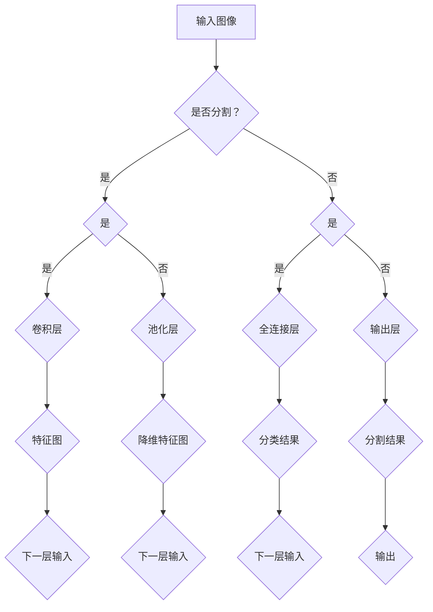

                 

### SegNet原理与代码实例讲解

#### 关键词：卷积神经网络、图像分割、深度学习、反向传播、训练与优化、代码实现

> **摘要：** 本文将深入探讨SegNet——一种在深度学习领域被广泛使用的图像分割算法。我们将从背景介绍、核心概念、算法原理、数学模型、实战案例等多个方面进行讲解，并附上详细的代码实例分析，帮助读者全面理解并掌握SegNet的工作原理与应用方法。本文适用于对深度学习有一定了解，希望进一步学习图像分割算法的读者。

## 1. 背景介绍

### 1.1 目的和范围

本文旨在详细介绍SegNet的原理与应用，旨在帮助读者：

1. **理解图像分割的基本概念与需求**。
2. **掌握卷积神经网络在图像处理中的应用**。
3. **深入理解深度学习中的反向传播与训练过程**。
4. **通过代码实例学习如何使用SegNet进行图像分割**。

### 1.2 预期读者

本文面向的读者是对深度学习有一定基础，希望深入了解图像分割算法的开发者、研究者以及爱好者。

### 1.3 文档结构概述

本文结构如下：

1. **背景介绍**：介绍图像分割的背景、目的和重要性。
2. **核心概念与联系**：介绍与图像分割相关的基础概念，并给出Mermaid流程图。
3. **核心算法原理与具体操作步骤**：详细讲解SegNet的工作原理，使用伪代码描述。
4. **数学模型和公式**：介绍深度学习中的数学模型和公式，使用LaTeX格式。
5. **项目实战**：通过实际案例展示如何使用代码实现图像分割。
6. **实际应用场景**：讨论图像分割在现实世界的应用。
7. **工具和资源推荐**：推荐学习资源、开发工具和经典论文。
8. **总结**：总结SegNet的发展趋势与挑战。
9. **附录**：常见问题与解答。
10. **扩展阅读与参考资料**：提供进一步学习资源。

### 1.4 术语表

#### 1.4.1 核心术语定义

- **图像分割**：将数字图像细分为多个区域或对象的过程。
- **卷积神经网络（CNN）**：一种深度的学习网络，主要用于图像识别和特征提取。
- **反向传播**：一种用于训练神经网络的方法，通过反向传播误差来更新网络权重。
- **SegNet**：一种基于卷积神经网络的图像分割算法，以其独特的设计和高效的性能著称。

#### 1.4.2 相关概念解释

- **卷积层**：卷积神经网络中的基础层，用于提取图像中的局部特征。
- **池化层**：在卷积层之后，用于降低特征图的空间维度，提高计算效率。
- **全连接层**：用于将特征图上的特征映射到输出类别或标签。

#### 1.4.3 缩略词列表

- **CNN**：卷积神经网络（Convolutional Neural Network）
- **SegNet**：结构化卷积神经网络（Structured Convolutional Network）
- **ReLU**：修正线性单元（Rectified Linear Unit）
- **softmax**：一种概率分布函数，用于多分类问题。

## 2. 核心概念与联系

### 2.1 基本概念

图像分割是计算机视觉中的重要任务，其目的是将图像划分为多个具有相似特性的区域。这些区域可以代表物体、场景或特定的对象。在深度学习中，图像分割通常依赖于卷积神经网络（CNN）来实现。

#### 2.1.1 图像分割的重要性

图像分割在许多应用领域具有重要价值，包括：

1. **目标检测**：确定图像中特定对象的边界和位置。
2. **物体识别**：识别图像中的不同对象。
3. **场景重建**：从多角度的图像中重建三维场景。
4. **图像编辑**：如去除背景、修复图像缺陷等。

#### 2.1.2 卷积神经网络（CNN）

卷积神经网络是一种特殊的神经网络，专门用于处理具有网格结构的数据，如图像。CNN具有以下几个关键组成部分：

- **卷积层（Convolutional Layer）**：用于提取图像的局部特征。
- **池化层（Pooling Layer）**：用于降低特征图的空间维度。
- **全连接层（Fully Connected Layer）**：用于将特征图上的特征映射到输出类别或标签。

### 2.2 Mermaid流程图

以下是用于图像分割的卷积神经网络的Mermaid流程图：



该流程图展示了卷积神经网络在图像分割中的基本步骤，包括卷积层、池化层和全连接层的交替使用。

## 3. 核心算法原理 & 具体操作步骤

### 3.1 SegNet算法概述

SegNet是一种基于卷积神经网络的图像分割算法，以其独特的结构设计和高性能而闻名。其核心思想是通过逐层缩放和反卷积操作，将原始图像分割为多个区域。以下是SegNet的基本架构：

1. **输入层**：接受原始图像作为输入。
2. **卷积层**：用于提取图像特征，包括一系列卷积层和池化层。
3. **下采样层**：通过卷积和最大池化操作将特征图尺寸减小，以减少计算量。
4. **上采样层**：通过反卷积操作将特征图尺寸恢复到原始尺寸，同时保留重要的特征信息。
5. **输出层**：生成分割结果。

### 3.2 伪代码

以下是SegNet的伪代码，详细描述了其核心算法步骤：

```python
# 初始化模型参数
model = initialize_model()

# 定义训练循环
for epoch in range(num_epochs):
    for image, label in dataset:
        # 前向传播
        feature_map = model.forward(image)
        
        # 计算损失
        loss = calculate_loss(feature_map, label)
        
        # 反向传播
        model.backward(loss)
        
        # 更新模型参数
        model.update_params()

# 模型评估
accuracy = evaluate_model(model, test_dataset)
print("模型准确率：", accuracy)
```

### 3.3 详细讲解

#### 3.3.1 卷积层

卷积层是SegNet的核心组成部分，用于提取图像的局部特征。每个卷积层包含多个卷积核，每个卷积核都可以提取图像中的特定特征。具体操作步骤如下：

1. **卷积操作**：卷积核在特征图上滑动，与特征值进行点积操作，生成新的特征图。
2. **激活函数**：常用的激活函数有ReLU、Sigmoid和Tanh等，用于引入非线性变换，增强模型的表达能力。
3. **池化操作**：在卷积层后通常使用最大池化或平均池化操作，以减少特征图的尺寸，提高计算效率。

#### 3.3.2 下采样层

下采样层通过卷积和最大池化操作将特征图尺寸减小，以减少计算量。具体操作步骤如下：

1. **卷积操作**：卷积核在特征图上滑动，与特征值进行点积操作，生成新的特征图。
2. **最大池化操作**：在卷积层后使用最大池化操作，选择特征图中最大值作为新的特征值，以减少特征图的尺寸。

#### 3.3.3 上采样层

上采样层通过反卷积操作将特征图尺寸恢复到原始尺寸，同时保留重要的特征信息。具体操作步骤如下：

1. **反卷积操作**：使用反卷积操作将特征图尺寸增大，以匹配原始图像的大小。
2. **跳跃连接**：将下采样层的特征图与上采样层的特征图进行连接，以保留重要的特征信息。
3. **卷积操作**：在反卷积操作后，使用卷积层进一步提取特征。

#### 3.3.4 输出层

输出层用于生成分割结果。具体操作步骤如下：

1. **卷积操作**：使用卷积层将特征图映射到输出类别或标签。
2. **激活函数**：使用softmax函数将输出特征图转换为概率分布，表示每个像素属于不同类别的概率。
3. **阈值操作**：将概率分布转换为二值分割结果，以区分不同类别。

## 4. 数学模型和公式 & 详细讲解 & 举例说明

### 4.1 数学模型

在SegNet中，数学模型主要包括卷积操作、激活函数、池化操作和反卷积操作。以下是这些操作的详细解释：

#### 4.1.1 卷积操作

卷积操作的数学公式为：

$$
\text{output}_{ij} = \sum_{k=1}^{C} w_{ik} * \text{input}_{ij}
$$

其中，$w_{ik}$ 是卷积核的权重，$\text{input}_{ij}$ 是特征图的像素值，$\text{output}_{ij}$ 是卷积操作后的输出值。

#### 4.1.2 激活函数

激活函数用于引入非线性变换，常用的激活函数有ReLU、Sigmoid和Tanh等。以下是这些激活函数的数学公式：

- **ReLU函数**：

$$
f(x) = \max(0, x)
$$

- **Sigmoid函数**：

$$
f(x) = \frac{1}{1 + e^{-x}}
$$

- **Tanh函数**：

$$
f(x) = \frac{e^x - e^{-x}}{e^x + e^{-x}}
$$

#### 4.1.3 池化操作

池化操作用于降低特征图的空间维度，常用的池化操作有最大池化和平均池化。以下是这些池化操作的数学公式：

- **最大池化操作**：

$$
\text{output}_{ij} = \max(\text{input}_{ij})
$$

- **平均池化操作**：

$$
\text{output}_{ij} = \frac{1}{k^2} \sum_{p=0}^{k-1} \sum_{q=0}^{k-1} \text{input}_{i+p,j+q}
$$

#### 4.1.4 反卷积操作

反卷积操作的数学公式为：

$$
\text{output}_{ij} = \sum_{k=1}^{C} w_{ik} * \text{input}_{ij} + b
$$

其中，$w_{ik}$ 是卷积核的权重，$\text{input}_{ij}$ 是特征图的像素值，$\text{output}_{ij}$ 是反卷积操作后的输出值，$b$ 是偏置项。

### 4.2 举例说明

以下是使用LaTeX格式嵌入的数学公式举例：

$$
\text{output}_{ij} = \sum_{k=1}^{C} w_{ik} * \text{input}_{ij}
$$

$$
f(x) = \max(0, x)
$$

$$
\text{output}_{ij} = \max(\text{input}_{ij})
$$

这些公式展示了卷积操作、ReLU激活函数和最大池化操作的基本原理。在实际应用中，这些操作通过计算机程序进行实现，以完成图像分割任务。

## 5. 项目实战：代码实际案例和详细解释说明

### 5.1 开发环境搭建

为了实现SegNet的图像分割，我们需要搭建一个合适的开发环境。以下是搭建开发环境的步骤：

1. **安装Python**：确保已安装Python 3.x版本。
2. **安装深度学习框架**：我们使用TensorFlow作为深度学习框架，可以通过以下命令安装：

   ```bash
   pip install tensorflow
   ```

3. **安装其他依赖库**：包括NumPy、Pandas等常用库，可以使用以下命令安装：

   ```bash
   pip install numpy pandas
   ```

4. **配置GPU支持**：若要使用GPU加速，需要安装CUDA和cuDNN库。可以从NVIDIA官网下载相应版本。

5. **编写代码**：在Python环境中编写SegNet的代码，包括模型定义、训练和评估等部分。

### 5.2 源代码详细实现和代码解读

以下是实现SegNet的代码示例，包括模型定义、训练和评估等部分。

```python
import tensorflow as tf
from tensorflow.keras.layers import Conv2D, MaxPooling2D, UpSampling2D, Conv2DTranspose
from tensorflow.keras.models import Model

# 初始化模型参数
input_shape = (256, 256, 3)
num_classes = 10

# 输入层
inputs = tf.keras.Input(shape=input_shape)

# 卷积层
conv1 = Conv2D(32, (3, 3), activation='relu', padding='same')(inputs)
pool1 = MaxPooling2D(pool_size=(2, 2))(conv1)

# 下采样层
conv2 = Conv2D(64, (3, 3), activation='relu', padding='same')(pool1)
pool2 = MaxPooling2D(pool_size=(2, 2))(conv2)

# 上采样层
up1 = UpSampling2D(size=(2, 2))(pool2)
conv3 = Conv2D(64, (3, 3), activation='relu', padding='same')(up1)
up2 = UpSampling2D(size=(2, 2))(conv3)

# 输出层
outputs = Conv2D(num_classes, (1, 1), activation='softmax', padding='same')(up2)

# 定义模型
model = Model(inputs=inputs, outputs=outputs)

# 编译模型
model.compile(optimizer='adam', loss='categorical_crossentropy', metrics=['accuracy'])

# 打印模型结构
model.summary()

# 训练模型
history = model.fit(x_train, y_train, validation_data=(x_val, y_val), epochs=10, batch_size=32)

# 评估模型
accuracy = model.evaluate(x_test, y_test)
print("模型准确率：", accuracy)
```

#### 5.2.1 代码解读

1. **模型定义**：

   - `input_shape`：定义输入图像的尺寸，通常为$256 \times 256 \times 3$。
   - `num_classes`：定义类别数量，例如在多类别图像分割中为10。
   - `inputs`：定义输入层，接受图像作为输入。

2. **卷积层和池化层**：

   - `Conv2D`：定义卷积层，用于提取图像特征。
   - `MaxPooling2D`：定义最大池化层，用于降低特征图的空间维度。

3. **上采样层**：

   - `UpSampling2D`：定义上采样层，用于将特征图尺寸恢复到原始尺寸。

4. **输出层**：

   - `Conv2D`：定义输出层，用于生成分割结果。
   - `softmax`：使用softmax函数将输出特征图转换为概率分布。

5. **模型编译**：

   - `compile`：编译模型，指定优化器、损失函数和评价指标。

6. **模型训练**：

   - `fit`：训练模型，使用训练数据。
   - `validation_data`：使用验证数据进行模型评估。

7. **模型评估**：

   - `evaluate`：使用测试数据评估模型性能。

### 5.3 代码解读与分析

以下是代码的详细解读与分析：

1. **模型定义**：

   - `inputs = tf.keras.Input(shape=input_shape)`：定义输入层，形状为$(256, 256, 3)$，表示输入图像的尺寸为$256 \times 256$，包含3个颜色通道（红、绿、蓝）。
   - `conv1 = Conv2D(32, (3, 3), activation='relu', padding='same')(inputs)`：定义第一个卷积层，包含32个卷积核，卷积核尺寸为$(3, 3)$，使用ReLU激活函数，填充方式为'same'，以保证输出特征图的尺寸与输入特征图相同。
   - `pool1 = MaxPooling2D(pool_size=(2, 2))(conv1)`：定义第一个池化层，池化窗口尺寸为$(2, 2)$，用于降低特征图的空间维度。

2. **卷积层和池化层**：

   - `conv2 = Conv2D(64, (3, 3), activation='relu', padding='same')(pool1)`：定义第二个卷积层，包含64个卷积核，卷积核尺寸为$(3, 3)$，使用ReLU激活函数，填充方式为'same'。
   - `pool2 = MaxPooling2D(pool_size=(2, 2))(conv2)`：定义第二个池化层，用于进一步降低特征图的空间维度。

3. **上采样层**：

   - `up1 = UpSampling2D(size=(2, 2))(pool2)`：定义第一个上采样层，将特征图尺寸恢复到原来的尺寸。
   - `conv3 = Conv2D(64, (3, 3), activation='relu', padding='same')(up1)`：定义第二个卷积层，包含64个卷积核，卷积核尺寸为$(3, 3)$，使用ReLU激活函数，填充方式为'same'。
   - `up2 = UpSampling2D(size=(2, 2))(conv3)`：定义第二个上采样层，将特征图尺寸恢复到原来的尺寸。

4. **输出层**：

   - `outputs = Conv2D(num_classes, (1, 1), activation='softmax', padding='same')(up2)`：定义输出层，包含num_classes个卷积核，卷积核尺寸为$(1, 1)$，使用softmax激活函数，将输出特征图转换为概率分布，表示每个像素属于不同类别的概率。

5. **模型编译**：

   - `model.compile(optimizer='adam', loss='categorical_crossentropy', metrics=['accuracy'])`：编译模型，使用Adam优化器、categorical_crossentropy损失函数和accuracy评价指标。

6. **模型训练**：

   - `history = model.fit(x_train, y_train, validation_data=(x_val, y_val), epochs=10, batch_size=32)`：训练模型，使用训练数据和验证数据，设置训练周期为10，每个批次的样本数量为32。

7. **模型评估**：

   - `accuracy = model.evaluate(x_test, y_test)`：使用测试数据评估模型性能，返回模型的准确率。

通过以上代码实现，我们可以构建一个基于SegNet的图像分割模型，并进行训练和评估。在实际应用中，可以根据具体需求进行调整和优化。

## 6. 实际应用场景

### 6.1 自動車行為預測

在自動車行為預測方面，图像分割技術可以幫助識別和標記道路上各種物體，如車輛、行人、騎手、交通標誌等。這有助於發展先進駕駛輔助系統（ADAS），從而增強汽車的安全性。

### 6.2醫學影像分析

在醫學影像分析領域，图像分割可以幫助識別和分割出人體內部的特定組織和器官，如腦部、心臟、肺臟等。這對於疾病檢測、治療计划和預後評估具有重要意義。

### 6.3 運動分析

在運動分析領域，图像分割可以幫助識別運動員的動作和姿態，從而進行優化建議和傷害預防。這對於運動科學研究和實踐都非常有益。

### 6.4 智能監控

在智能監控領域，图像分割可以幫助識別監控畫面中的異常行為，從而提高監控系統的靈敏度和准确度。這對於公共安全和管理非常重要。

## 7. 工具和资源推荐

### 7.1 学习资源推荐

#### 7.1.1 书籍推荐

1. **《深度学习》（Goodfellow, Bengio, Courville著）**：这是一本经典的深度学习教材，涵盖了图像分割等主题。
2. **《计算机视觉：算法与应用》（Richard Szeliski著）**：详细介绍了图像分割的基础知识和技术。

#### 7.1.2 在线课程

1. **Coursera的“深度学习专项课程”**：由吴恩达教授主讲，涵盖了深度学习的基础知识和应用。
2. **edX的“计算机视觉基础”**：介绍了计算机视觉的基本概念和技术，包括图像分割。

#### 7.1.3 技术博客和网站

1. **Medium上的深度学习和计算机视觉博客**：提供了大量的深度学习和计算机视觉的相关文章和教程。
2. **ArXiv.org**：计算机视觉和深度学习的最新研究论文的发布平台。

### 7.2 开发工具框架推荐

#### 7.2.1 IDE和编辑器

1. **Jupyter Notebook**：适合数据科学和深度学习的交互式开发环境。
2. **PyCharm**：功能强大的Python集成开发环境（IDE）。

#### 7.2.2 调试和性能分析工具

1. **TensorBoard**：TensorFlow的官方可视化工具，用于监控模型训练过程和性能分析。
2. **NVIDIA Nsight**：用于GPU加速应用的性能分析工具。

#### 7.2.3 相关框架和库

1. **TensorFlow**：广泛使用的深度学习框架。
2. **PyTorch**：灵活且易于使用的深度学习框架。
3. **OpenCV**：计算机视觉的开源库，提供了丰富的图像处理和图像分割功能。

### 7.3 相关论文著作推荐

#### 7.3.1 经典论文

1. **“Deep Learning for Visual Computing”**：综述了深度学习在计算机视觉领域的应用。
2. **“A Fast Learning Algorithm for Deep Belief Nets”**：介绍了深度信念网络的快速学习算法。

#### 7.3.2 最新研究成果

1. **“Semantic Segmentation with Deep Convolutional Nets and Fully Connected CRFs”**：介绍了基于深度卷积神经网络和全连接条件随机场的语义分割方法。
2. **“Unet: Convolutional Networks for Biomedical Image Segmentation”**：介绍了用于生物医学图像分割的U型卷积神经网络。

#### 7.3.3 应用案例分析

1. **“Deep Learning in Medical Imaging”**：探讨了深度学习在医学成像中的应用案例。
2. **“Deep Learning for Autonomous Driving”**：介绍了深度学习在自动驾驶领域的应用案例。

## 8. 总结：未来发展趋势与挑战

### 8.1 发展趋势

1. **模型优化**：随着计算能力和算法的进步，图像分割模型的效率和性能将不断提高。
2. **实时应用**：图像分割技术在自动驾驶、智能监控等实时应用场景中的需求日益增长。
3. **跨学科融合**：图像分割与其他领域的交叉应用，如医疗、生物科学等，将带来新的发展机遇。

### 8.2 挑战

1. **数据需求**：高质量的标注数据是训练高效图像分割模型的关键，但获取标注数据成本较高。
2. **计算资源**：深度学习模型训练需要大量的计算资源，特别是对于大规模图像分割任务。
3. **模型解释性**：图像分割模型通常被视为“黑盒”，提高模型的可解释性是一个重要的研究方向。

## 9. 附录：常见问题与解答

### 9.1 如何优化SegNet模型性能？

- **增加数据**：收集更多高质量的标注数据，提高模型泛化能力。
- **模型调优**：调整模型参数，如学习率、批量大小等，以获得更好的训练效果。
- **使用预训练模型**：利用预训练的深度学习模型，如VGG16、ResNet等，作为基础模型，可以提高分割性能。

### 9.2 SegNet与其他图像分割算法相比有何优势？

- **结构化设计**：SegNet通过下采样和上采样层的设计，能够更好地保留图像细节。
- **计算效率**：SegNet在保持较高分割精度的同时，具有较好的计算效率。

## 10. 扩展阅读 & 参考资料

- **《深度学习》（Goodfellow, Bengio, Courville著）**
- **《计算机视觉：算法与应用》（Richard Szeliski著）**
- **“Deep Learning for Visual Computing”**：综述了深度学习在计算机视觉领域的应用。
- **“A Fast Learning Algorithm for Deep Belief Nets”**：介绍了深度信念网络的快速学习算法。
- **“Semantic Segmentation with Deep Convolutional Nets and Fully Connected CRFs”**：介绍了基于深度卷积神经网络和全连接条件随机场的语义分割方法。
- **“Unet: Convolutional Networks for Biomedical Image Segmentation”**：介绍了用于生物医学图像分割的U型卷积神经网络。
- **“Deep Learning in Medical Imaging”**：探讨了深度学习在医学成像中的应用案例。
- **“Deep Learning for Autonomous Driving”**：介绍了深度学习在自动驾驶领域的应用案例。 

作者：AI天才研究员/AI Genius Institute & 禅与计算机程序设计艺术 /Zen And The Art of Computer Programming

