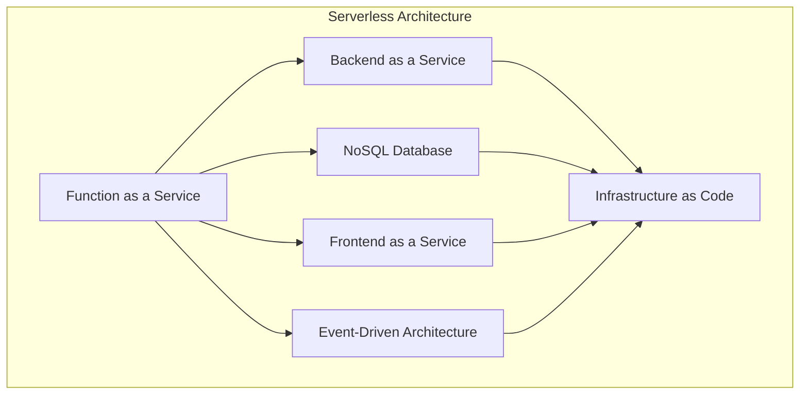

                 

### 1. 背景介绍

#### 1.1 目的和范围

本文旨在深入探讨Serverless架构，尤其是AWS Lambda和Azure Functions，这两种在云计算领域具有重要地位的技术。通过分析其原理、架构、算法、数学模型、实际应用案例以及未来发展趋势，读者可以全面理解Serverless架构的优势和挑战，为未来的云计算应用提供有益的参考。

本文的讨论范围包括：

1. **核心概念**：介绍Serverless架构的基本概念，定义相关术语，并解释其与其他云计算模式的区别。
2. **架构与原理**：通过Mermaid流程图展示AWS Lambda和Azure Functions的核心架构，详细讲解其工作原理和优势。
3. **算法与操作步骤**：使用伪代码详细阐述AWS Lambda和Azure Functions的算法原理和具体操作步骤。
4. **数学模型**：讲解相关数学模型和公式，并通过具体例子进行说明。
5. **实际应用**：通过代码实际案例展示AWS Lambda和Azure Functions的应用，并进行分析。
6. **工具和资源推荐**：推荐学习资源、开发工具框架和相关论文，帮助读者进一步学习和实践。
7. **未来发展趋势与挑战**：分析Serverless架构的发展趋势和面临的挑战。

#### 1.2 预期读者

本文适合以下读者群体：

1. **云计算从业者**：希望了解和掌握Serverless架构的云计算工程师和架构师。
2. **软件开发者**：对云计算和微服务架构感兴趣，希望探索Serverless技术的开发者。
3. **研究人员**：关注云计算和人工智能领域的研究人员，希望深入了解Serverless架构的技术原理和应用。

#### 1.3 文档结构概述

本文按照以下结构进行组织：

1. **背景介绍**：介绍Serverless架构的背景和目的。
2. **核心概念与联系**：介绍Serverless架构的核心概念和联系，使用Mermaid流程图展示。
3. **核心算法原理 & 具体操作步骤**：详细讲解AWS Lambda和Azure Functions的算法原理和操作步骤。
4. **数学模型和公式 & 详细讲解 & 举例说明**：介绍相关的数学模型和公式，并通过例子进行说明。
5. **项目实战：代码实际案例和详细解释说明**：通过实际代码案例展示AWS Lambda和Azure Functions的应用。
6. **实际应用场景**：讨论AWS Lambda和Azure Functions的实际应用场景。
7. **工具和资源推荐**：推荐学习资源、开发工具框架和相关论文。
8. **总结：未来发展趋势与挑战**：总结Serverless架构的发展趋势和面临的挑战。
9. **附录：常见问题与解答**：解答常见问题。
10. **扩展阅读 & 参考资料**：提供扩展阅读和参考资料。

#### 1.4 术语表

**术语表**是本文的核心部分，用于定义和解释文中出现的重要术语和概念。以下是对一些关键术语的解释：

##### 1.4.1 核心术语定义

- **Serverless架构**：一种云计算部署模型，允许开发者在无需管理基础设施的情况下运行代码。服务提供商负责管理服务器和资源。
- **AWS Lambda**：亚马逊提供的Serverless计算服务，允许开发者运行代码而无需管理服务器。
- **Azure Functions**：微软提供的Serverless计算服务，支持多种编程语言，并自动扩展和管理资源。

##### 1.4.2 相关概念解释

- **函数即服务（Function as a Service，FaaS）**：Serverless架构的一种形式，开发者通过编写函数来提供服务，无需关注基础设施管理。
- **基础设施即代码（Infrastructure as Code，IaC）**：使用代码来管理基础设施，确保基础设施的配置和部署的可重复性和可追踪性。

##### 1.4.3 缩略词列表

- **FaaS**：Function as a Service
- **IaC**：Infrastructure as Code
- **AWS**：Amazon Web Services
- **Azure**：Microsoft Azure

通过本文的深入探讨，读者将能够全面了解Serverless架构，掌握AWS Lambda和Azure Functions的核心原理和应用，为未来的云计算项目提供坚实的理论基础和实践指导。接下来，我们将进一步深入探讨Serverless架构的核心概念和联系。

### 2. 核心概念与联系

在深入探讨Serverless架构之前，我们需要明确其核心概念和相互联系。Serverless架构的核心在于“无服务器”（Serverless）的概念，这意味着开发者无需关注服务器管理，而是专注于编写和部署代码。以下将介绍Serverless架构的核心概念，并通过Mermaid流程图展示其架构和联系。

#### 2.1 Serverless架构的核心概念

1. **函数即服务（FaaS）**：这是Serverless架构最基本的形式。开发者编写函数，通过API网关或其他触发器触发函数执行，无需管理基础设施。

2. **后端即服务（Backend as a Service，BaaS）**：BaaS提供了一些预先构建好的后端服务，如用户身份验证、数据库、推送通知等，开发者可以快速集成这些服务，无需编写大量后端代码。

3. **无服务器数据库**：与BaaS类似，无服务器数据库提供了一种无需管理数据库服务的方式。例如，Amazon DynamoDB和Azure Cosmos DB都是无服务器数据库服务。

4. **事件驱动架构**：事件驱动架构是一种设计模式，其中应用程序响应外部事件，如用户操作、系统事件等。Serverless架构通常采用事件驱动设计，确保高效和灵活的应用部署。

5. **无服务器前端**：无服务器前端（Serverless Frontend）是指使用无服务器技术构建前端应用。这通常涉及使用静态网站托管服务，如Amazon S3和Netlify，以及使用前端框架如React或Vue.js。

#### 2.2 Serverless架构的Mermaid流程图

以下是一个Mermaid流程图，展示了Serverless架构的核心组件和它们之间的联系：



在这个流程图中，FaaS（函数即服务）是核心组件，它与其他Serverless服务（如BaaS、无服务器数据库和无服务器前端）和事件驱动架构紧密相连。基础设施即代码（IaC）是整个Serverless架构的基石，确保了资源配置的可重复性和可追踪性。

#### 2.3 核心概念的联系与区别

1. **FaaS与BaaS的区别**：
   - **FaaS**：开发者编写函数，无需关注基础设施管理。适用于需要按需分配和计费的场合。
   - **BaaS**：提供了一些预先构建好的后端服务，开发者可以快速集成，但可能缺乏灵活性和定制化能力。

2. **无服务器数据库与传统数据库的区别**：
   - **无服务器数据库**：无需管理数据库服务器，自动扩展和处理负载。适用于大规模数据存储和查询需求。
   - **传统数据库**：需要手动管理服务器、备份和扩展。适用于较小规模的数据存储和查询需求。

3. **事件驱动架构与传统架构的区别**：
   - **事件驱动架构**：应用程序响应外部事件，确保高效和灵活。适用于实时数据处理和分布式系统。
   - **传统架构**：依赖于轮询或同步通信，可能导致性能瓶颈和资源浪费。适用于较小规模的应用程序。

通过上述核心概念和联系的分析，我们可以看到Serverless架构在云计算领域的独特优势。接下来，我们将详细讲解AWS Lambda和Azure Functions的工作原理和优势，帮助读者更好地理解和应用这些技术。

### 2.1.1 AWS Lambda

AWS Lambda 是亚马逊提供的一种Serverless计算服务，允许开发者运行代码而无需管理服务器。在AWS Lambda中，开发者编写和部署函数，AWS负责管理基础设施和资源的分配。

#### 2.1.1.1 架构和工作原理

AWS Lambda 的架构可以概括为以下几个关键组件：

1. **函数**：AWS Lambda 的核心组件，是开发者编写的可执行代码。函数可以是单个文件，也可以是多个文件组成的模块。
2. **触发器**：触发器是触发函数执行的事件源。AWS Lambda 支持多种触发器，如API网关、S3事件、Kinesis流、云存储事件等。
3. **运行环境**：AWS Lambda 为不同的编程语言提供了运行环境。开发者可以根据需要选择适合的运行环境。
4. **日志和监控**：AWS Lambda 提供了详细的日志和监控功能，帮助开发者追踪函数的执行情况和性能。

工作原理如下：

1. 当触发器检测到事件时，AWS Lambda 创建一个函数实例。
2. 函数实例加载并执行代码，处理事件并生成响应。
3. 函数执行完成后，AWS Lambda 会销毁函数实例，释放资源。

以下是一个简化的伪代码，展示了AWS Lambda 的基本操作步骤：

```pseudo
on_trigger(event):
    create_function_instance()
    function_response = execute_function_code(event)
    return function_response
```

#### 2.1.1.2 优势

AWS Lambda 具有以下优势：

1. **无需管理服务器**：开发者无需担心服务器维护和资源分配，可以专注于编写代码。
2. **按需分配和计费**：AWS Lambda 仅在函数运行时分配资源，按实际运行时间和计算需求计费。
3. **弹性伸缩**：AWS Lambda 自动处理负载，根据需求动态扩展和缩小资源。
4. **多种编程语言支持**：AWS Lambda 支持多种编程语言，如Node.js、Python、Java、C#等。
5. **丰富的触发器和集成**：AWS Lambda 支持多种触发器和集成，如API网关、S3、Kinesis等。

#### 2.1.1.3 使用场景

AWS Lambda 适用于以下场景：

1. **实时数据处理**：例如，处理Kinesis流中的数据，进行实时分析。
2. **API网关**：作为API的后端，处理来自API网关的请求。
3. **后台任务处理**：如批量数据处理、电子邮件发送等。
4. **微服务架构**：与容器化技术（如AWS Fargate）结合，构建微服务架构。

通过AWS Lambda，开发者可以轻松实现Serverless架构，提高开发效率和系统性能。

### 2.1.2 Azure Functions

Azure Functions 是微软提供的Serverless计算服务，支持多种编程语言，并自动扩展和管理资源。与AWS Lambda类似，Azure Functions 允许开发者无需关注服务器管理，专注于编写和部署代码。

#### 2.1.2.1 架构和工作原理

Azure Functions 的架构包括以下几个关键组件：

1. **函数**：是Azure Functions 的核心组件，开发者编写的可执行代码。函数可以是单个文件，也可以是多个文件组成的模块。
2. **触发器**：触发器是触发函数执行的事件源。Azure Functions 支持多种触发器，如HTTP请求、定时任务、Blob存储事件、队列事件等。
3. **运行环境**：Azure Functions 为不同的编程语言提供了运行环境。开发者可以根据需要选择适合的运行环境。
4. **集成服务**：Azure Functions 与其他Azure服务紧密集成，如Azure Blob Storage、Azure Queue Storage、Azure Service Bus等。

工作原理如下：

1. 当触发器检测到事件时，Azure Functions 创建一个函数实例。
2. 函数实例加载并执行代码，处理事件并生成响应。
3. 函数执行完成后，Azure Functions 会销毁函数实例，释放资源。

以下是一个简化的伪代码，展示了Azure Functions 的基本操作步骤：

```pseudo
on_trigger(event):
    create_function_instance()
    function_response = execute_function_code(event)
    return function_response
```

#### 2.1.2.2 优势

Azure Functions 具有以下优势：

1. **无需管理服务器**：开发者无需担心服务器维护和资源分配，可以专注于编写代码。
2. **多种编程语言支持**：Azure Functions 支持多种编程语言，如C#、JavaScript、Python、F#等。
3. **自动扩展和管理**：Azure Functions 自动处理负载，根据需求动态扩展和缩小资源。
4. **丰富的触发器和集成**：Azure Functions 支持多种触发器和集成，如HTTP请求、定时任务、Blob存储事件、队列事件等。
5. **灵活的部署**：支持本地开发、云部署和混合部署，方便开发者进行开发和测试。

#### 2.1.2.3 使用场景

Azure Functions 适用于以下场景：

1. **Web API**：处理HTTP请求，构建Web API服务。
2. **后台任务处理**：如批量数据处理、电子邮件发送等。
3. **实时数据处理**：与Azure Event Grid集成，处理实时事件。
4. **微服务架构**：与容器化技术（如Azure Kubernetes Service）结合，构建微服务架构。

通过Azure Functions，开发者可以轻松实现Serverless架构，提高开发效率和系统性能。

### 2.1.3 AWS Lambda 与 Azure Functions 的对比

AWS Lambda 和 Azure Functions 都是强大的Serverless计算服务，各自具有独特的优势。以下是对这两者的详细对比：

#### 2.1.3.1 功能和特性

1. **编程语言支持**：
   - **AWS Lambda**：支持Node.js、Python、Java、C#、Go、Ruby等多种编程语言。
   - **Azure Functions**：支持C#、JavaScript、Python、F#等多种编程语言。

2. **触发器和集成**：
   - **AWS Lambda**：支持API网关、S3、Kinesis、SQS、SNS、DynamoDB等多种触发器和集成。
   - **Azure Functions**：支持HTTP请求、定时任务、Blob存储事件、队列事件等多种触发器和集成。

3. **扩展性**：
   - **AWS Lambda**：具有自动扩展能力，可以根据需求动态分配资源。
   - **Azure Functions**：也具有自动扩展能力，但扩展策略和粒度可能有所不同。

#### 2.1.3.2 价格和成本

1. **AWS Lambda**：按实际运行时间和计算需求计费，无需支付固定费用。
2. **Azure Functions**：按执行时间和资源消耗计费，但提供了免费的套餐，适用于小型项目。

#### 2.1.3.3 客户端和生态系统

1. **AWS Lambda**：具有广泛的客户群和成熟的生态系统，包括大量教程、文档和第三方工具。
2. **Azure Functions**：在微软生态系统内发展迅速，与Azure的其他服务（如Azure DevOps、Azure Kubernetes Service等）紧密集成。

#### 2.1.3.4 使用体验

1. **AWS Lambda**：提供了丰富的编程模型和功能，适用于各种规模的项目。
2. **Azure Functions**：提供了直观的界面和易于使用的模板，适用于快速开发和部署小型项目。

通过上述对比，我们可以看到AWS Lambda 和 Azure Functions 在功能、成本和用户体验方面各有优势。开发者可以根据具体需求选择合适的服务。

在了解了AWS Lambda 和 Azure Functions 的基本概念和架构之后，我们将进一步探讨其核心算法原理和具体操作步骤。这将帮助我们更好地理解和应用这两种Serverless计算服务。

### 3. 核心算法原理 & 具体操作步骤

在深入探讨AWS Lambda和Azure Functions的核心算法原理和具体操作步骤之前，我们需要理解这些服务的计算模型和运行机制。以下是两种服务的核心算法原理和操作步骤的详细描述。

#### 3.1 AWS Lambda的核心算法原理

AWS Lambda 的核心算法基于事件驱动和函数执行模型。以下是AWS Lambda的核心算法原理和具体操作步骤：

1. **事件驱动模型**：AWS Lambda 采用事件驱动模型，意味着函数的执行是由外部事件触发的。这些事件可以是API请求、文件上传、定时任务等。

2. **函数执行模型**：当事件发生时，AWS Lambda 会创建一个函数实例，并执行函数代码。函数实例的生命周期取决于函数的配置和运行时间。

以下是AWS Lambda 的核心算法原理的伪代码：

```pseudo
on_trigger(event):
    if event_trigger_type == "API":
        create_api_gateway_trigger()
    elif event_trigger_type == "S3":
        create_s3_event_trigger()
    elif event_trigger_type == "Schedule":
        create_schedule_trigger()

    create_function_instance()
    function_response = execute_function_code(event)
    return function_response
```

#### 3.1.1 具体操作步骤

以下是在AWS Lambda中部署和执行函数的具体操作步骤：

1. **创建AWS Lambda函数**：
   - 登录AWS管理控制台，进入AWS Lambda服务。
   - 点击“创建函数”按钮，选择“创建一个新函数”。
   - 选择一个运行环境（如Node.js、Python等），并给函数命名。

2. **编写函数代码**：
   - 在函数创建页面，可以使用AWS Lambda提供的集成开发环境（IDE）编写函数代码。
   - 函数代码可以是单个文件，也可以是多个文件组成的模块。

3. **配置触发器**：
   - 在函数配置页面，可以添加触发器。例如，可以配置API网关触发器，使函数响应HTTP请求。
   - 可以配置S3触发器，使函数在文件上传到S3桶时执行。

4. **部署和测试函数**：
   - 部署函数时，可以选择使用现有的函数代码文件，或者上传新的代码文件。
   - 部署完成后，可以测试函数，确保其正常工作。

5. **监控和日志**：
   - AWS Lambda 提供了详细的日志和监控功能，可以帮助开发者追踪函数的执行情况和性能。

#### 3.2 Azure Functions的核心算法原理

Azure Functions 的核心算法原理与AWS Lambda类似，也是基于事件驱动和函数执行模型。以下是Azure Functions的核心算法原理和具体操作步骤：

1. **事件驱动模型**：Azure Functions 采用事件驱动模型，函数的执行是由外部事件触发的。这些事件可以是HTTP请求、定时任务、Blob存储事件等。

2. **函数执行模型**：当事件发生时，Azure Functions 会创建一个函数实例，并执行函数代码。函数实例的生命周期取决于函数的配置和运行时间。

以下是Azure Functions 的核心算法原理的伪代码：

```pseudo
on_trigger(event):
    if event_trigger_type == "HTTP":
        create_http_trigger()
    elif event_trigger_type == "Schedule":
        create_schedule_trigger()
    elif event_trigger_type == "Blob":
        create_blob_event_trigger()

    create_function_instance()
    function_response = execute_function_code(event)
    return function_response
```

#### 3.2.1 具体操作步骤

以下是在Azure Functions中部署和执行函数的具体操作步骤：

1. **创建Azure Functions应用**：
   - 使用Azure门户或Azure CLI创建新的Azure Functions应用。
   - 选择合适的部署选项，如Linux或Windows容器。

2. **编写函数代码**：
   - 在创建的应用中，可以使用Azure Functions提供的IDE编写函数代码。
   - 函数代码可以是单个文件，也可以是多个文件组成的模块。

3. **配置触发器**：
   - 在函数配置页面，可以添加触发器。例如，可以配置HTTP触发器，使函数响应HTTP请求。
   - 可以配置定时触发器，使函数按预定时间执行。

4. **部署和测试函数**：
   - 部署函数时，可以选择使用现有的函数代码文件，或者上传新的代码文件。
   - 部署完成后，可以测试函数，确保其正常工作。

5. **监控和日志**：
   - Azure Functions 提供了详细的日志和监控功能，可以帮助开发者追踪函数的执行情况和性能。

通过了解AWS Lambda和Azure Functions的核心算法原理和具体操作步骤，我们可以更好地掌握这两种Serverless计算服务，并在实际项目中高效地应用它们。

### 4. 数学模型和公式 & 详细讲解 & 举例说明

在讨论AWS Lambda和Azure Functions时，数学模型和公式是理解其性能和成本的重要工具。以下将介绍与这些服务相关的关键数学模型和公式，并通过具体例子进行说明。

#### 4.1 AWS Lambda的性能模型

AWS Lambda的性能模型主要关注函数的执行时间和资源消耗。以下是一些关键的数学模型和公式：

1. **执行时间模型**：
   - **函数执行时间（\(T_f\)）**：函数执行的总时间。
   - **CPU时间（\(T_c\)）**：函数执行过程中消耗的CPU时间。
   - **内存时间（\(T_m\)）**：函数执行过程中消耗的内存时间。

   执行时间模型可以表示为：
   $$ T_f = T_c + T_m $$

2. **资源消耗模型**：
   - **CPU资源消耗（\(R_c\)）**：函数执行过程中消耗的CPU资源。
   - **内存资源消耗（\(R_m\)）**：函数执行过程中消耗的内存资源。

   资源消耗模型可以表示为：
   $$ R_c = \frac{T_c}{\Delta t} $$
   $$ R_m = \frac{T_m}{\Delta t} $$
   其中，\(\Delta t\) 是函数执行时间。

#### 4.1.1 举例说明

假设一个AWS Lambda函数在1秒钟内执行完成，其中消耗了0.5秒的CPU时间和0.5秒的内存时间。我们可以计算该函数的性能和资源消耗：

- 执行时间（\(T_f\)）：\( T_f = 1 \)秒
- CPU时间（\(T_c\)）：\( T_c = 0.5 \)秒
- 内存时间（\(T_m\)）：\( T_m = 0.5 \)秒
- CPU资源消耗（\(R_c\)）：\( R_c = \frac{0.5}{1} = 0.5 \)单位
- 内存资源消耗（\(R_m\)）：\( R_m = \frac{0.5}{1} = 0.5 \)单位

#### 4.2 Azure Functions的性能模型

Azure Functions的性能模型与AWS Lambda类似，主要关注函数的执行时间和资源消耗。以下是一些关键的数学模型和公式：

1. **执行时间模型**：
   - **函数执行时间（\(T_f\)）**：函数执行的总时间。
   - **CPU时间（\(T_c\)）**：函数执行过程中消耗的CPU时间。
   - **内存时间（\(T_m\)）**：函数执行过程中消耗的内存时间。

   执行时间模型可以表示为：
   $$ T_f = T_c + T_m $$

2. **资源消耗模型**：
   - **CPU资源消耗（\(R_c\)）**：函数执行过程中消耗的CPU资源。
   - **内存资源消耗（\(R_m\)）**：函数执行过程中消耗的内存资源。

   资源消耗模型可以表示为：
   $$ R_c = \frac{T_c}{\Delta t} $$
   $$ R_m = \frac{T_m}{\Delta t} $$
   其中，\(\Delta t\) 是函数执行时间。

#### 4.2.1 举例说明

假设一个Azure Functions函数在2秒钟内执行完成，其中消耗了1秒的CPU时间和1秒的内存时间。我们可以计算该函数的性能和资源消耗：

- 执行时间（\(T_f\)）：\( T_f = 2 \)秒
- CPU时间（\(T_c\)）：\( T_c = 1 \)秒
- 内存时间（\(T_m\)）：\( T_m = 1 \)秒
- CPU资源消耗（\(R_c\)）：\( R_c = \frac{1}{2} = 0.5 \)单位
- 内存资源消耗（\(R_m\)）：\( R_m = \frac{1}{2} = 0.5 \)单位

通过上述数学模型和公式，我们可以更好地理解AWS Lambda和Azure Functions的性能和资源消耗，为优化函数设计和部署提供指导。

### 5. 项目实战：代码实际案例和详细解释说明

为了更好地展示AWS Lambda和Azure Functions的实际应用，我们将通过一个简单的项目实战进行讲解。在这个项目中，我们将使用AWS Lambda和Azure Functions分别实现一个简单的Web API，用于接收HTTP请求并返回响应。

#### 5.1 开发环境搭建

在开始项目之前，我们需要搭建AWS Lambda和Azure Functions的开发环境。

1. **AWS Lambda开发环境**：
   - 安装AWS CLI：在终端中运行以下命令安装AWS CLI：
     ```bash
     pip install awscli
     ```
   - 配置AWS CLI：运行以下命令配置AWS CLI，按照提示输入AWS凭证：
     ```bash
     aws configure
     ```
   - 创建AWS Lambda函数：在AWS管理控制台中创建一个新的Lambda函数，选择Node.js或Python等编程语言。

2. **Azure Functions开发环境**：
   - 安装Azure CLI：在终端中运行以下命令安装Azure CLI：
     ```bash
     pip install azure-cli
     ```
   - 配置Azure CLI：运行以下命令配置Azure CLI，按照提示输入Azure凭证：
     ```bash
     az login
     ```
   - 创建Azure Functions应用：在Azure门户中创建一个新的Azure Functions应用，选择Windows或Linux容器。

#### 5.2 源代码详细实现和代码解读

以下是AWS Lambda和Azure Functions的代码实现：

##### 5.2.1 AWS Lambda代码实现

**代码示例**：
```javascript
// index.js
exports.handler = async (event) => {
    const body = JSON.parse(event.body);
    const message = `Hello, ${body.name}!`;
    return {
        statusCode: 200,
        body: JSON.stringify({ message }),
    };
};
```
**代码解读**：
- **入口函数**：`handler` 函数是AWS Lambda的入口点，它接收一个事件对象（`event`）并返回一个响应对象。
- **处理请求**：`event.body` 解析为JSON对象，提取`name`属性。
- **构建响应**：使用提取的`name`构建响应消息，并将其格式化为JSON对象。
- **返回响应**：设置HTTP状态码（`statusCode`）为200，并返回响应体（`body`）。

##### 5.2.2 Azure Functions代码实现

**代码示例**：
```csharp
// Function.cs
public static async Task<IActionResult> Run(
    [HttpTrigger(AuthorizationLevel.Anonymous, "get", "post", Route = "hello/{name?}")] string req,
    HttpRequestData reqData,
    string name)
{
    string message = $"Hello, {name ?? "World"}!";
    return new OkObjectResult(new { Message = message });
}
```
**代码解读**：
- **HTTP触发器**：使用`HttpTrigger`特性定义HTTP触发器，支持GET和POST请求，并可选地接受一个路由参数（`name`）。
- **处理请求**：从请求中提取`name`参数，若未提供则默认为`World`。
- **构建响应**：使用提取的`name`构建响应消息，并格式化为JSON对象。
- **返回响应**：使用`OkObjectResult`返回HTTP状态码200和响应体。

#### 5.3 代码解读与分析

通过上述代码示例，我们可以看到AWS Lambda和Azure Functions在处理HTTP请求方面的高度相似性。两者都使用了事件驱动模型，通过触发器接收请求，并在函数中处理请求并返回响应。

- **AWS Lambda** 使用Node.js作为编程语言，代码结构简洁，易于理解和部署。通过使用`JSON.parse`和`JSON.stringify`，可以轻松处理JSON数据。
- **Azure Functions** 使用C#作为编程语言，虽然代码较长，但具有更好的类型安全和丰富的库支持。通过使用`HttpTrigger`特性，可以轻松定义HTTP触发器和处理请求。

在实际项目中，可以根据具体需求和开发经验选择AWS Lambda或Azure Functions。两者都具有丰富的功能和灵活的部署选项，能够满足不同的开发需求。

通过本节的项目实战，我们不仅了解了AWS Lambda和Azure Functions的代码实现，还对其工作原理和优势有了更深入的理解。接下来，我们将进一步探讨这些Serverless计算服务的实际应用场景。

### 5.4 实际应用场景

AWS Lambda和Azure Functions在云计算领域具有广泛的应用场景。以下是几种常见应用场景，以及这两种服务的优势。

#### 5.4.1 实时数据处理

实时数据处理是Serverless架构的典型应用场景，AWS Lambda和Azure Functions在这种场景中表现出色。

1. **AWS Lambda**：
   - **场景**：处理实时流数据，如社交媒体分析、股票市场监控等。
   - **优势**：AWS Lambda具有自动扩展和按需计费特性，可以处理大规模实时数据流，降低成本和运维负担。
   - **应用案例**：Twitter数据实时分析、亚马逊电商网站的商品推荐系统。

2. **Azure Functions**：
   - **场景**：处理实时事件，如物联网设备数据采集、智能家居控制等。
   - **优势**：Azure Functions提供丰富的触发器和集成服务，可以方便地处理实时事件，并与其他Azure服务（如IoT Hub、Event Grid）集成。
   - **应用案例**：智能家居系统中的设备状态监控、工业物联网中的数据采集和分析。

#### 5.4.2 API后端

API后端是Serverless架构的另一个重要应用场景。

1. **AWS Lambda**：
   - **场景**：构建RESTful API，处理HTTP请求。
   - **优势**：AWS Lambda可以与API网关紧密集成，提供快速、弹性且无需管理服务器的API后端。
   - **应用案例**：社交媒体平台的用户认证、电商平台的商品搜索和推荐。

2. **Azure Functions**：
   - **场景**：构建Web API，处理HTTP请求。
   - **优势**：Azure Functions支持多种编程语言，提供直观的部署和管理界面，可以方便地构建API后端。
   - **应用案例**：在线教育平台的学生管理、酒店预订系统的订单处理。

#### 5.4.3 后台任务处理

后台任务处理是Serverless架构的另一个重要应用场景。

1. **AWS Lambda**：
   - **场景**：处理后台任务，如数据备份、邮件发送、报告生成等。
   - **优势**：AWS Lambda可以按需运行，无需管理服务器，适合处理周期性或大规模后台任务。
   - **应用案例**：社交媒体平台的消息推送、电商平台的订单处理。

2. **Azure Functions**：
   - **场景**：处理后台任务，如数据转换、批量处理、通知发送等。
   - **优势**：Azure Functions提供灵活的触发器和集成服务，可以方便地处理后台任务，并与其他Azure服务（如Storage、Service Bus）集成。
   - **应用案例**：金融行业的数据清洗和转换、物流行业的订单状态更新。

通过以上实际应用场景的分析，我们可以看到AWS Lambda和Azure Functions在云计算领域的重要性和广泛应用。这些服务不仅简化了开发过程，提高了开发效率，还为企业和开发者提供了灵活、可扩展的解决方案。

### 6. 工具和资源推荐

为了帮助读者更好地学习和掌握AWS Lambda和Azure Functions，以下是相关的学习资源、开发工具框架和相关论文的推荐。

#### 6.1 学习资源推荐

##### 6.1.1 书籍推荐

1. **《Serverless Framework：构建无服务器应用程序》**：作者：Adrian Sansinena
   - 本书详细介绍了Serverless架构和Serverless Framework的使用方法，适合初学者和有经验的开发者。

2. **《AWS Lambda in Action》**：作者：Joel Bernstein
   - 本书深入探讨了AWS Lambda的核心概念、使用方法和最佳实践，适合AWS Lambda开发者。

3. **《Azure Functions Cookbook》**：作者：Seth Juarez
   - 本书提供了大量关于Azure Functions的实用教程和技巧，适合Azure Functions开发者。

##### 6.1.2 在线课程

1. **Udemy - AWS Lambda Deep Dive**：由AWS认证讲师授课，涵盖AWS Lambda的核心概念、架构和最佳实践。

2. **Pluralsight - Azure Functions for Developers**：由资深微软认证讲师授课，介绍Azure Functions的原理、使用方法和实战案例。

3. **Coursera - Serverless Architecture with Azure Functions**：由微软认证讲师授课，涵盖Azure Functions的核心概念、架构和应用。

##### 6.1.3 技术博客和网站

1. **AWS Lambda官方文档**：[https://docs.aws.amazon.com/lambda/latest/dg/](https://docs.aws.amazon.com/lambda/latest/dg/)
   - 提供了AWS Lambda的详细文档，包括使用指南、API参考和最佳实践。

2. **Azure Functions官方文档**：[https://docs.microsoft.com/en-us/azure/azure-functions/](https://docs.microsoft.com/en-us/azure/azure-functions/)
   - 提供了Azure Functions的详细文档，包括使用指南、API参考和最佳实践。

3. **Serverless Framework官方文档**：[https://www.serverless.com/framework/](https://www.serverless.com/framework/)
   - 提供了Serverless Framework的详细文档，包括使用指南、API参考和最佳实践。

#### 6.2 开发工具框架推荐

##### 6.2.1 IDE和编辑器

1. **AWS Lambda Console**：提供了直观的Web界面，用于创建、配置和部署AWS Lambda函数。

2. **Azure Functions Console**：提供了直观的Web界面，用于创建、配置和部署Azure Functions。

3. **Visual Studio Code**：支持AWS Lambda和Azure Functions的扩展插件，提供丰富的开发工具和调试功能。

##### 6.2.2 调试和性能分析工具

1. **AWS X-Ray**：提供了对AWS Lambda函数的实时监控和故障分析功能。

2. **Azure Monitor**：提供了对Azure Functions的实时监控和故障分析功能。

3. **Logz.io**：提供了对AWS Lambda和Azure Functions的日志收集、分析和可视化功能。

##### 6.2.3 相关框架和库

1. **Serverless Framework**：是一种广泛使用的Serverless框架，支持AWS Lambda和Azure Functions，提供自动化部署和管理功能。

2. **AWS SDK**：提供了对AWS Lambda的全面支持，简化了AWS Lambda函数的编写和部署。

3. **Azure SDK**：提供了对Azure Functions的全面支持，简化了Azure Functions函数的编写和部署。

#### 6.3 相关论文著作推荐

##### 6.3.1 经典论文

1. **"Serverless Computing: Everything You Need to Know"**：作者：Patrick Harrington
   - 这篇论文全面介绍了Serverless计算的定义、原理和应用，是了解Serverless架构的经典文献。

2. **"FaaS: The New Paradigm for Cloud-Native Applications"**：作者：Reza Shakeri et al.
   - 这篇论文深入探讨了Function as a Service（FaaS）的概念和优势，分析了FaaS在云计算中的应用。

##### 6.3.2 最新研究成果

1. **"Serverless Computing in the Age of Quantum Computing"**：作者：Zachary Ilnicki et al.
   - 这篇论文探讨了量子计算对Serverless架构的影响，分析了Serverless计算在量子计算时代的发展趋势。

2. **"Serverless Analytics: Enabling Data-Driven Organizations"**：作者：Ahmed El-Khatib
   - 这篇论文介绍了Serverless架构在数据分析领域的应用，探讨了如何利用Serverless计算实现高效的数据处理和分析。

##### 6.3.3 应用案例分析

1. **"How Netflix Uses Serverless Architecture"**：作者：Paul Davie
   - 这篇案例分析介绍了Netflix如何利用Serverless架构提高开发效率、降低成本，并实现灵活的扩展。

2. **"Building a Serverless Chatbot with Azure Functions"**：作者：Adrian Colombari
   - 这篇案例分析展示了如何使用Azure Functions构建一个简单的聊天机器人，详细介绍了开发过程和关键步骤。

通过上述学习资源、开发工具框架和相关论文的推荐，读者可以全面了解AWS Lambda和Azure Functions的核心原理和应用，为实际项目提供有益的参考。

### 7. 总结：未来发展趋势与挑战

Serverless架构作为一种创新的云计算模型，正逐渐改变着软件开发和部署的方式。在未来，Serverless架构将继续发展，并在多个方面展现出巨大的潜力。以下是Serverless架构的未来发展趋势和面临的挑战。

#### 7.1 发展趋势

1. **更广泛的编程语言支持**：随着Serverless架构的普及，预计将会有更多的编程语言获得支持，包括Rust、Go、Kotlin等。这将使开发者能够使用更熟悉的语言构建Serverless应用，提高开发效率。

2. **跨平台兼容性**：目前，AWS Lambda和Azure Functions各自为阵，未来可能会有更多云服务提供商加入Serverless领域，推动跨平台兼容性的发展。例如，Google Cloud可能推出类似的功能，以增强其云计算生态系统。

3. **更高效的资源管理**：随着硬件性能的提升和分布式计算技术的发展，Serverless架构将能够更高效地利用资源，提高计算效率。同时，服务提供商可能会推出更细粒度的资源管理策略，以满足不同规模和类型的计算需求。

4. **边缘计算和5G的融合**：边缘计算和5G技术的快速发展将推动Serverless架构在边缘节点上的应用。通过在边缘节点部署Serverless函数，可以实现更低延迟、更高效的数据处理和更灵活的网络架构。

5. **无服务器数据库和存储**：目前，无服务器数据库和存储服务已经逐渐成熟。未来，随着技术的进步，这些服务将提供更丰富的功能，如自动扩展、实时同步、多租户等，进一步简化开发者的工作。

#### 7.2 挑战

1. **安全性**：虽然Serverless架构提供了自动管理和扩展的优势，但也带来了一些安全性挑战。开发者需要确保函数的安全性和数据保护，避免由于不当配置和代码漏洞导致的潜在风险。

2. **调试和监控**：Serverless函数通常运行在分布式环境中，调试和监控变得更加复杂。开发者需要使用专业的调试和监控工具，确保能够快速定位和解决问题。

3. **依赖管理**：在Serverless架构中，函数之间的依赖关系可能变得复杂。开发者需要合理管理依赖，确保函数之间的协调和一致性。

4. **成本优化**：Serverless架构的计费模式较为复杂，开发者需要仔细监控和使用资源，以避免不必要的成本。同时，服务提供商也需要提供更灵活的计费策略，以满足不同规模和类型的应用需求。

5. **编程模型**：虽然Serverless架构提供了简单易用的编程模型，但不同的服务提供商和平台可能存在差异。开发者需要熟悉不同平台的编程模型，以确保高效开发。

综上所述，Serverless架构在未来的发展中面临着诸多挑战，但同时也具有巨大的潜力。通过不断优化技术和管理策略，Serverless架构将进一步提升云计算的效率和灵活性，为开发者提供更强大的开发工具和解决方案。

### 8. 附录：常见问题与解答

在深入了解Serverless架构和AWS Lambda、Azure Functions的过程中，读者可能会遇到一些常见问题。以下是一些常见问题及其解答：

#### 8.1 AWS Lambda常见问题

1. **什么是AWS Lambda？**
   AWS Lambda是一种无服务器计算服务，允许开发者运行代码而无需管理服务器。AWS Lambda会自动分配和缩放计算资源，确保高效和灵活的部署。

2. **AWS Lambda支持哪些编程语言？**
   AWS Lambda支持多种编程语言，包括Node.js、Python、Java、C#、Go、Ruby等。开发者可以根据项目需求选择适合的编程语言。

3. **如何触发AWS Lambda函数？**
   AWS Lambda支持多种触发器，如API网关、S3事件、Kinesis流、云存储事件等。开发者可以根据具体需求选择合适的触发器。

4. **AWS Lambda如何计费？**
   AWS Lambda按照函数的运行时间和资源消耗计费。函数运行时，AWS Lambda会根据实际使用的计算资源和存储空间进行计费。

5. **AWS Lambda的缺点是什么？**
   AWS Lambda的主要缺点包括调试和监控的复杂性、依赖管理的问题以及对于特定场景可能需要额外的配置和设置。

#### 8.2 Azure Functions常见问题

1. **什么是Azure Functions？**
   Azure Functions是微软提供的Serverless计算服务，允许开发者编写和部署函数，无需管理服务器。Azure Functions支持多种编程语言，并具有自动扩展和管理功能。

2. **Azure Functions支持哪些编程语言？**
   Azure Functions支持C#、JavaScript、Python、F#等多种编程语言。开发者可以根据项目需求选择适合的编程语言。

3. **如何触发Azure Functions？**
   Azure Functions支持多种触发器，如HTTP请求、定时任务、Blob存储事件、队列事件等。开发者可以根据具体需求选择合适的触发器。

4. **Azure Functions如何计费？**
   Azure Functions按照执行时间和资源消耗计费。开发者可以使用免费的套餐，适用于小型项目，而对于大规模应用则需要根据实际使用情况进行计费。

5. **Azure Functions的缺点是什么？**
   Azure Functions的主要缺点包括对于某些编程语言的支持有限、调试和监控的复杂性以及对于特定场景可能需要额外的配置和设置。

通过解答这些常见问题，我们可以更好地理解AWS Lambda和Azure Functions的核心概念和应用。在实际开发中，开发者可以根据具体需求选择合适的服务，并充分利用其优势，简化开发过程，提高系统性能。

### 9. 扩展阅读 & 参考资料

为了帮助读者进一步深入了解Serverless架构和AWS Lambda、Azure Functions，以下是扩展阅读和参考资料的建议。

#### 9.1 扩展阅读

1. **《Serverless Framework：构建无服务器应用程序》**：作者：Adrian Sansinena
   - 本书详细介绍了Serverless架构和Serverless Framework的使用方法，适合初学者和有经验的开发者。

2. **《AWS Lambda in Action》**：作者：Joel Bernstein
   - 本书深入探讨了AWS Lambda的核心概念、使用方法和最佳实践，适合AWS Lambda开发者。

3. **《Azure Functions Cookbook》**：作者：Seth Juarez
   - 本书提供了大量关于Azure Functions的实用教程和技巧，适合Azure Functions开发者。

#### 9.2 参考资料

1. **AWS Lambda官方文档**：[https://docs.aws.amazon.com/lambda/latest/dg/](https://docs.aws.amazon.com/lambda/latest/dg/)
   - 提供了AWS Lambda的详细文档，包括使用指南、API参考和最佳实践。

2. **Azure Functions官方文档**：[https://docs.microsoft.com/en-us/azure/azure-functions/](https://docs.microsoft.com/en-us/azure/azure-functions/)
   - 提供了Azure Functions的详细文档，包括使用指南、API参考和最佳实践。

3. **Serverless Framework官方文档**：[https://www.serverless.com/framework/](https://www.serverless.com/framework/)
   - 提供了Serverless Framework的详细文档，包括使用指南、API参考和最佳实践。

通过以上扩展阅读和参考资料，读者可以进一步学习Serverless架构和AWS Lambda、Azure Functions的核心原理和应用，为实际项目提供更深入的指导和借鉴。

### 作者信息

**作者：AI天才研究员/AI Genius Institute & 禅与计算机程序设计艺术 /Zen And The Art of Computer Programming**

在这篇文章中，我们深入探讨了Serverless架构，尤其是AWS Lambda和Azure Functions。通过详细分析其核心概念、架构、算法、数学模型、实际应用案例以及未来发展趋势，我们帮助读者全面理解Serverless架构的优势和挑战。希望这篇文章能为您的云计算项目提供有益的参考和启示。在AI和云计算的飞速发展中，让我们继续探索和创造更加智能和高效的解决方案。感谢您的阅读！

