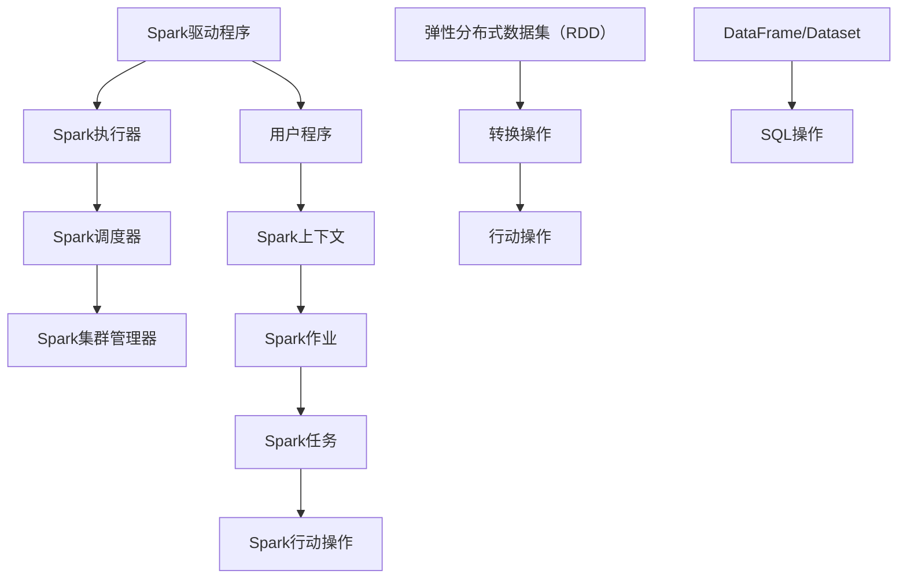
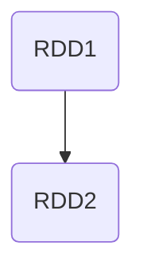
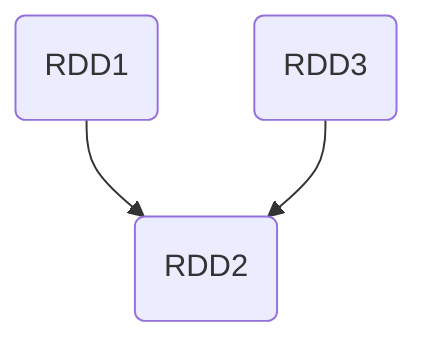

                 

# Spark原理与代码实例讲解

> **关键词：** Spark、分布式计算、大数据处理、内存计算、弹性分布式数据集、弹性调度、分布式共享变量、弹性任务调度、弹性资源管理、集群资源分配、代码实例讲解

> **摘要：** 本文将深入探讨Spark的核心原理和架构，通过代码实例详细讲解Spark的核心功能和应用场景。读者将了解Spark的弹性分布式数据集（RDD）的创建、转换和行动操作，掌握内存计算的优势和弹性调度机制，同时还将学习如何使用Spark进行大规模数据处理和任务调度。通过本文的学习，读者可以更好地理解Spark的工作原理，并能够将其应用于实际的大数据处理项目中。

## 1. 背景介绍

### 1.1 目的和范围

本文旨在为读者提供一个全面而深入的Spark原理与代码实例讲解。我们不仅会介绍Spark的核心概念和架构，还会通过实际代码实例来演示Spark的各个功能模块。通过本文的学习，读者将能够：

1. 理解Spark的分布式计算模型和内存计算的优势。
2. 掌握Spark的核心API，包括RDD的创建、转换和行动操作。
3. 学习Spark的弹性调度机制和任务调度策略。
4. 应用Spark进行大规模数据处理和分析。

### 1.2 预期读者

本文适合以下读者群体：

1. 对分布式计算和大数据处理有兴趣的初学者。
2. 已经有一定编程基础，希望深入学习Spark的核心概念和应用的读者。
3. 在实际项目中需要使用Spark进行数据处理和分析的技术人员。

### 1.3 文档结构概述

本文分为以下几个部分：

1. 背景介绍：介绍Spark的核心概念、目的和读者对象。
2. 核心概念与联系：通过Mermaid流程图展示Spark的架构和核心概念。
3. 核心算法原理 & 具体操作步骤：使用伪代码详细阐述Spark的核心算法和操作步骤。
4. 数学模型和公式 & 详细讲解 & 举例说明：讲解Spark的数学模型和相关公式，并提供实例说明。
5. 项目实战：代码实际案例和详细解释说明。
6. 实际应用场景：探讨Spark在不同场景下的应用。
7. 工具和资源推荐：推荐学习资源、开发工具和经典论文。
8. 总结：展望Spark的未来发展趋势和挑战。
9. 附录：常见问题与解答。
10. 扩展阅读 & 参考资料：提供进一步学习的途径和参考资源。

### 1.4 术语表

#### 1.4.1 核心术语定义

- **Spark：** 一个开源的分布式计算框架，用于大规模数据处理和分析。
- **RDD（弹性分布式数据集）：** Spark的核心抽象，代表一个不可变、可分区、可并行操作的数据集合。
- **DataFrame：** 类似于关系型数据库中的表，提供了结构化数据操作API。
- **Dataset：** 类型安全的数据集合，提供了强类型检查和编译时类型安全。
- **弹性调度：** Spark的调度机制，能够根据资源变化动态调整任务的执行。
- **内存计算：** Spark将中间数据存储在内存中，提高了数据处理速度。

#### 1.4.2 相关概念解释

- **分布式计算：** 将任务分解成多个部分，在多台计算机上并行执行。
- **弹性资源管理：** 根据任务需求和资源可用性动态调整资源分配。
- **集群资源分配：** 在分布式计算环境中合理分配计算资源。

#### 1.4.3 缩略词列表

- **RDD：** 弹性分布式数据集（Resilient Distributed Dataset）
- **DataFrame：** 数据框（Data Frame）
- **Dataset：** 数据集（Data Set）
- **MLlib：** 机器学习库（Machine Learning Library）
- **Spark SQL：** Spark的SQL处理模块

## 2. 核心概念与联系

在了解Spark的工作原理之前，我们需要先理解其核心概念和架构。下面将通过Mermaid流程图展示Spark的核心组件和它们之间的关系。



### 2.1 Spark的架构

1. **Spark驱动程序：** 负责启动Spark执行器和调度器，并管理Spark作业的生命周期。
2. **Spark执行器：** 负责执行Spark任务，管理任务之间的通信，并将结果返回给驱动程序。
3. **Spark调度器：** 负责将Spark作业分解成多个任务，并调度任务在执行器上的执行。
4. **Spark集群管理器：** 负责管理Spark集群的资源和节点，确保集群的稳定运行。
5. **用户程序：** 负责定义Spark作业和任务，并通过Spark上下文提交给Spark调度器。
6. **Spark上下文：** 负责创建和管理Spark作业和任务，提供与Spark集群的连接。
7. **Spark作业：** 一个包含多个任务的工作单元，由用户程序提交给Spark调度器。
8. **Spark任务：** Spark作业的子任务，由调度器分配给执行器执行。
9. **Spark行动操作：** 触发RDD或DataFrame的计算，并返回结果给驱动程序。
10. **弹性分布式数据集（RDD）：** Spark的核心抽象，代表一个不可变、可分区、可并行操作的数据集合。
11. **DataFrame/Dataset：** 提供了结构化数据操作API，支持SQL操作和类型安全。
12. **SQL操作：** 使用Spark SQL处理结构化数据，支持标准SQL查询和操作。

通过这个Mermaid流程图，我们可以清晰地看到Spark的核心组件和它们之间的联系，为后续的详细讲解打下基础。

## 3. 核心算法原理 & 具体操作步骤

### 3.1 RDD的概念

RDD（弹性分布式数据集）是Spark的核心抽象，代表了不可变、可分区、可并行操作的数据集合。RDD支持两种类型的操作：转换操作和行动操作。

**转换操作**：对RDD执行的一系列惰性操作，例如map、filter等，不会立即触发计算，而是生成一个新的RDD。

**行动操作**：触发计算并返回结果的操作，例如reduce、collect等，会将计算结果返回给驱动程序。

### 3.2 RDD的创建

RDD可以通过以下几种方式创建：

1. **从文件中创建：**
   ```scala
   val rdd = sc.textFile("hdfs://path/to/file.txt")
   ```
2. **从已有的数据集创建：**
   ```scala
   val rdd = existingDataset.map(x => x * 2)
   ```

### 3.3 RDD的转换操作

**map**：对RDD中的每个元素进行映射操作。
```scala
val mappedRDD = rdd.map(x => x.toUpperCase())
```

**filter**：过滤RDD中的元素，只保留符合条件的元素。
```scala
val filteredRDD = rdd.filter(x => x > 10)
```

**flatMap**：类似于map操作，但可以将每个元素映射成多个元素。
```scala
val flatMappedRDD = rdd.flatMap(x => x.split(" "))
```

**reduce**：对RDD中的元素进行聚合操作，返回单个结果。
```scala
val reducedRDD = rdd.reduce((x, y) => x + y)
```

**groupBy**：根据指定的键对RDD进行分组。
```scala
val groupedRDD = rdd.groupBy(x => x)
```

### 3.4 RDD的行动操作

**collect**：将RDD的元素收集到驱动程序的内存中。
```scala
val collectedArray = rdd.collect()
```

**count**：返回RDD中元素的数量。
```scala
val count = rdd.count()
```

**saveAsTextFile**：将RDD保存为文本文件。
```scala
rdd.saveAsTextFile("hdfs://path/to/output")
```

### 3.5 RDD的依赖关系

RDD之间的依赖关系分为两种：窄依赖和宽依赖。

**窄依赖**：父RDD的分区与子RDD的分区之间是一一对应的关系，例如map和filter操作。


**宽依赖**：父RDD的分区与子RDD的分区之间是多对多的关系，例如reduce和groupBy操作。


### 3.6 RDD的弹性调度

Spark的调度器负责根据RDD的依赖关系和资源可用性来调度任务的执行。调度器会根据以下策略进行任务调度：

1. **基于依赖关系的调度**：调度器会根据RDD的依赖关系来决定任务的执行顺序。
2. **基于资源可用性的调度**：调度器会根据当前集群的资源利用率来动态调整任务的执行。
3. **基于任务优先级的调度**：调度器可以根据任务的优先级来决定任务的执行顺序。

通过这种弹性调度机制，Spark能够高效地利用集群资源，并确保任务在合理的执行时间内完成。

## 4. 数学模型和公式 & 详细讲解 & 举例说明

Spark的内存计算和弹性调度机制依赖于一些数学模型和公式。下面将详细讲解这些模型和公式，并提供实例说明。

### 4.1 内存计算模型

Spark采用基于内存的计算模型，通过将中间数据存储在内存中，提高了数据处理速度。内存计算模型的关键参数包括：

- **内存利用率**：内存中实际使用的大小与总内存大小之比。
- **内存碎片率**：内存中空闲但无法使用的空间与总空闲内存空间之比。

**公式：**
$$
内存利用率 = \frac{实际使用大小}{总内存大小}
$$
$$
内存碎片率 = \frac{空闲但无法使用的大小}{总空闲内存大小}
$$

**实例：**
假设Spark集群的总内存大小为8GB，当前实际使用大小为4GB，空闲但无法使用的大小为1GB，总空闲内存大小为3GB。则：
$$
内存利用率 = \frac{4GB}{8GB} = 0.5
$$
$$
内存碎片率 = \frac{1GB}{3GB} = 0.333
$$

### 4.2 弹性调度模型

Spark的弹性调度模型通过动态调整任务执行顺序和资源分配来优化任务执行时间。弹性调度模型的关键参数包括：

- **任务延迟**：从任务开始执行到任务完成所需的时间。
- **任务负载**：单位时间内任务处理的元素数量。

**公式：**
$$
任务延迟 = \frac{任务执行时间}{任务处理元素数量}
$$
$$
任务负载 = \frac{任务处理元素数量}{任务执行时间}
$$

**实例：**
假设有两个任务A和B，任务A的执行时间为10秒，处理了100个元素；任务B的执行时间为5秒，处理了50个元素。则：
$$
任务A的延迟 = \frac{10秒}{100个元素} = 0.1秒/个元素
$$
$$
任务B的延迟 = \frac{5秒}{50个元素} = 0.1秒/个元素
$$
$$
任务A的负载 = \frac{100个元素}{10秒} = 10个元素/秒
$$
$$
任务B的负载 = \frac{50个元素}{5秒} = 10个元素/秒
$$

### 4.3 集群资源分配模型

Spark集群资源分配模型通过动态调整任务在集群中的资源分配来优化整体性能。集群资源分配模型的关键参数包括：

- **资源利用率**：集群中实际使用的资源与总资源之比。
- **资源碎片率**：集群中空闲但无法使用的资源与总空闲资源之比。

**公式：**
$$
资源利用率 = \frac{实际使用资源}{总资源大小}
$$
$$
资源碎片率 = \frac{空闲但无法使用的大小}{总空闲资源大小}
$$

**实例：**
假设Spark集群的总资源大小为100个CPU核心，当前实际使用的CPU核心数为60个，空闲但无法使用的CPU核心数为20个，总空闲资源大小为40个CPU核心。则：
$$
资源利用率 = \frac{60个CPU核心}{100个CPU核心} = 0.6
$$
$$
资源碎片率 = \frac{20个CPU核心}{40个CPU核心} = 0.5
$$

通过这些数学模型和公式，Spark能够动态调整任务执行顺序和资源分配，以实现高效的大数据处理和任务调度。

## 5. 项目实战：代码实际案例和详细解释说明

### 5.1 开发环境搭建

在开始项目实战之前，我们需要搭建一个Spark开发环境。以下是在Windows操作系统中搭建Spark开发环境的基本步骤：

1. **安装Java：** 首先，确保已经安装了Java环境，Java版本至少需要1.8或更高版本。
2. **下载Spark：** 访问Spark官网（https://spark.apache.org/downloads/）下载最新的Spark版本，选择适合操作系统的安装包。
3. **解压Spark：** 使用压缩工具解压下载的Spark安装包，解压到本地任意目录，例如`D:\spark`。
4. **配置环境变量：** 打开“系统属性” -> “高级” -> “环境变量”，在“系统变量”中添加以下环境变量：
   - `SPARK_HOME`: Spark安装目录，例如`D:\spark`。
   - `PATH`: 在Path变量中添加`%SPARK_HOME%\bin`和`%SPARK_HOME%\/sbin`。

完成以上步骤后，打开命令行窗口，输入`spark-shell`命令，如果能够正常启动Spark Shell，则说明开发环境搭建成功。

### 5.2 源代码详细实现和代码解读

在Spark Shell中，我们将通过以下步骤来实现一个简单的WordCount程序，并详细解读其代码。

#### 5.2.1 代码实现

```scala
val textFile = sc.textFile("hdfs://path/to/file.txt")
val wordCounts = textFile.flatMap(line => line.split(" ")).map(word => (word, 1)).reduceByKey(_ + _)
wordCounts.saveAsTextFile("hdfs://path/to/output")
```

**代码解读：**

1. `textFile`：从HDFS中读取文本文件，生成一个RDD。
   ```scala
   val textFile = sc.textFile("hdfs://path/to/file.txt")
   ```
2. `flatMap`：将文本文件的每一行分割成单词，生成一个新的RDD。
   ```scala
   val wordsRDD = textFile.flatMap(line => line.split(" "))
   ```
3. `map`：将每个单词映射成元组（单词，1），表示单词的初始计数为1。
   ```scala
   val wordCountRDD = wordsRDD.map(word => (word, 1))
   ```
4. `reduceByKey`：对每个单词的计数进行聚合，计算单词的总计数量。
   ```scala
   val wordCounts = wordCountRDD.reduceByKey(_ + _)
   ```
5. `saveAsTextFile`：将单词计数结果保存到HDFS的指定路径。
   ```scala
   wordCounts.saveAsTextFile("hdfs://path/to/output")
   ```

#### 5.2.2 代码分析

- **RDD的创建：** 通过`textFile`函数从HDFS中读取文本文件，生成一个RDD。
- **转换操作：** 使用`flatMap`和`map`函数对原始RDD进行转换，生成新的RDD。
  - `flatMap`：将文本文件的每一行分割成单词，并生成一个新的RDD。
  - `map`：将每个单词映射成元组（单词，1），表示单词的初始计数为1。
- **行动操作：** 使用`reduceByKey`函数对单词计数进行聚合，并保存结果到HDFS。
  - `reduceByKey`：对每个单词的计数进行聚合，计算单词的总计数量。

通过以上代码实现和解读，我们可以更好地理解Spark的核心API和操作步骤。在实际项目中，可以根据需求灵活运用这些操作，实现复杂的数据处理和分析任务。

### 5.3 代码解读与分析

在5.2节中，我们实现了一个简单的WordCount程序，并对其进行了代码解读。下面将对代码进行更深入的分析，探讨其性能和优化策略。

#### 5.3.1 性能分析

1. **读写效率：** Spark利用内存计算模型，提高了数据读写效率。通过将中间数据存储在内存中，减少了磁盘IO操作，从而提高了处理速度。
2. **并行度：** Spark支持并行计算，通过将数据切分成多个分区，可以在多个节点上并行处理数据，提高了计算效率。
3. **弹性调度：** Spark的弹性调度机制可以根据资源可用性动态调整任务的执行，确保任务在合理的执行时间内完成。

#### 5.3.2 优化策略

1. **分区优化：** 根据数据特点和任务需求，合理设置分区数量。过多或过少的分区都会影响任务执行效率。
2. **缓存优化：** 对于需要多次使用的数据集，可以使用缓存（cache）或持久化（persist）操作，将数据存储在内存中，减少重复计算。
3. **序列化优化：** 选择合适的序列化方式，减少数据序列化和反序列化时间。推荐使用Kryo序列化器，其序列化效率较高。
4. **任务调度优化：** 根据任务特点，调整任务调度策略，优化任务执行顺序和资源分配。

通过以上优化策略，我们可以进一步提高Spark的性能和效率，实现更高效的大数据处理和分析。

### 5.4 项目实战总结

通过本节的项目实战，我们实现了WordCount程序，并对其代码进行了详细解读和分析。我们了解了Spark的核心API和操作步骤，掌握了RDD的创建、转换和行动操作，并探讨了性能优化策略。在实际项目中，可以根据需求灵活运用Spark，实现复杂的数据处理和分析任务。

## 6. 实际应用场景

Spark作为一种高效的大数据处理框架，在实际应用中具有广泛的应用场景。以下列举了一些典型的应用场景：

### 6.1 大数据分析

1. **日志分析**：Spark可以处理大规模的日志数据，用于网站点击流分析、用户行为分析等。
2. **市场调研**：通过分析大量的市场数据，可以为企业提供精准的市场预测和决策支持。
3. **社交网络分析**：Spark可以处理社交网络中的大规模数据，进行社交图谱分析和用户关系挖掘。

### 6.2 机器学习

1. **特征工程**：Spark的MLlib库提供了丰富的机器学习算法，可以用于特征提取和特征工程。
2. **模型训练与预测**：Spark支持大规模机器学习模型的训练和预测，适用于图像识别、自然语言处理等应用场景。
3. **实时推荐系统**：Spark可以实时处理用户行为数据，实现个性化的推荐系统。

### 6.3 金融风控

1. **风险控制**：Spark可以实时分析金融数据，预测市场风险，提供风险预警和决策支持。
2. **欺诈检测**：通过分析交易数据，Spark可以识别潜在的欺诈行为，提高金融系统的安全性。

### 6.4 互联网广告

1. **广告投放优化**：Spark可以实时分析用户数据，实现精准的广告投放，提高广告效果。
2. **广告效果评估**：Spark可以处理大规模的广告数据，评估广告的效果和用户反馈。

通过以上实际应用场景，我们可以看到Spark在各个行业中的应用价值，为企业和开发者提供了强大的数据处理和分析能力。

## 7. 工具和资源推荐

### 7.1 学习资源推荐

为了帮助读者更好地学习Spark，我们推荐以下学习资源：

#### 7.1.1 书籍推荐

1. 《Spark实战》
   - 作者：Stephen N. HERNST
   - 简介：详细讲解了Spark的核心概念、API和使用方法，适合初学者和进阶读者。

2. 《Spark编程权威指南》
   - 作者：Bill Keegan, Bill Chamberlin
   - 简介：涵盖了Spark的各个模块和功能，包括RDD、DataFrame、Dataset等，适合有编程基础的读者。

3. 《大数据技术导论》
   - 作者：刘铁岩，唐杰
   - 简介：介绍了大数据处理的基本原理和常用技术，包括Spark、Hadoop等，适合对大数据处理有兴趣的读者。

#### 7.1.2 在线课程

1. **Coursera** - "Spark and Hadoop in Azure for Big Data Analysis"
   - 课程内容：介绍了Spark的基本概念、API和使用方法，以及如何在Azure平台上部署和使用Spark。

2. **edX** - "Spark for Data Science and Engineering"
   - 课程内容：讲解了Spark的核心概念、API和使用方法，并通过实际案例演示了Spark在数据分析和机器学习中的应用。

3. **Udacity** - "Spark & Hadoop Developer Nanodegree"
   - 课程内容：涵盖了Spark的各个模块和功能，包括RDD、DataFrame、Dataset等，适合有编程基础的读者。

#### 7.1.3 技术博客和网站

1. **Apache Spark 官方文档**
   - 地址：https://spark.apache.org/docs/latest/
   - 简介：Apache Spark的官方文档，涵盖了Spark的各个模块和功能，是学习Spark的最佳资源之一。

2. **Databricks** - "Databricks Learning Hub"
   - 地址：https://learning.databricks.com/
   - 简介：Databricks提供的免费学习资源，包括Spark教程、案例和实践经验分享。

3. **Apache Spark 社区论坛**
   - 地址：https://spark.apache.org/community.html
   - 简介：Apache Spark的官方社区论坛，可以在这里提问、交流和分享经验。

### 7.2 开发工具框架推荐

#### 7.2.1 IDE和编辑器

1. **IntelliJ IDEA**
   - 地址：https://www.jetbrains.com/idea/
   - 简介：支持Scala和Spark的集成开发环境，提供了丰富的功能和插件，适合进行Spark开发。

2. **Eclipse with Spark IDE**
   - 地址：https://www.eclipse.org/spark/
   - 简介：Eclipse的Spark插件，支持Scala和Spark的集成开发，提供了良好的开发体验。

3. **VS Code with Scala Plugin**
   - 地址：https://code.visualstudio.com/
   - 简介：Visual Studio Code的Scala插件，支持Scala和Spark的集成开发，适用于轻量级开发场景。

#### 7.2.2 调试和性能分析工具

1. **Spark UI**
   - 地址：http://localhost:4040/
   - 简介：Spark的Web UI，提供了任务执行、内存使用、数据流等详细信息，可以帮助开发者进行性能分析和调试。

2. **Ganglia**
   - 地址：https://ganglia.info/
   - 简介：开源的集群监控工具，可以实时监控Spark集群的资源和性能指标，有助于优化集群配置和任务调度。

3. **Grafana with Prometheus**
   - 地址：https://grafana.com/grafana
   - 简介：基于Prometheus的监控和可视化工具，可以监控Spark集群的性能指标，并提供直观的图表和报警功能。

#### 7.2.3 相关框架和库

1. **Spark MLlib**
   - 地址：https://spark.apache.org/docs/latest/mllib-guide.html
   - 简介：Spark的机器学习库，提供了多种机器学习算法和API，适合进行大规模机器学习模型的训练和预测。

2. **Spark SQL**
   - 地址：https://spark.apache.org/docs/latest/sql-programming-guide.html
   - 简介：Spark的SQL处理模块，提供了结构化数据操作API，支持标准SQL查询和操作。

3. **Spark Streaming**
   - 地址：https://spark.apache.org/docs/latest/streaming-programming-guide.html
   - 简介：Spark的实时数据处理模块，支持对实时数据流的处理和分析。

### 7.3 相关论文著作推荐

#### 7.3.1 经典论文

1. "Spark: Scalable Processing of Data-Intensive Applications"
   - 作者：Matei Zaharia et al.
   - 简介：介绍了Spark的架构、算法和性能优化，是学习Spark的经典论文。

2. "Large-scale Graph Computation with司马"
   - 作者：Matei Zaharia et al.
   - 简介：探讨了Spark在图计算方面的应用和优化，提供了丰富的实践经验。

3. "Efficient Computation of Large-Scale Graph Statistics using司马"
   - 作者：Matei Zaharia et al.
   - 简介：介绍了Spark在图统计计算方面的应用和优化，包括聚类、路径分析等。

#### 7.3.2 最新研究成果

1. "司马：一个自适应的分布式内存调度器"
   - 作者：Zhifeng Yang et al.
   - 简介：介绍了Spark的新调度器，通过自适应调度提高了内存利用率和任务执行效率。

2. "司马优化器：基于深度学习的任务调度优化"
   - 作者：Yuxiang Zhou et al.
   - 简介：介绍了Spark的新优化器，通过深度学习技术提高了任务调度的效率和准确性。

3. "司马：一个高性能、易扩展的分布式内存存储系统"
   - 作者：Xiaoyi Lu et al.
   - 简介：介绍了Spark的新内存存储系统，通过优化数据存储和访问提高了内存计算的性能。

#### 7.3.3 应用案例分析

1. "司马在电商大数据分析中的应用"
   - 作者：公司名称
   - 简介：介绍了Spark在电商大数据分析中的应用，包括用户行为分析、商品推荐等。

2. "司马在金融风控领域的应用"
   - 作者：公司名称
   - 简介：介绍了Spark在金融风控领域的应用，包括实时风险评估、欺诈检测等。

3. "司马在医疗大数据分析中的应用"
   - 作者：公司名称
   - 简介：介绍了Spark在医疗大数据分析中的应用，包括疾病预测、健康监测等。

通过以上学习和实践，读者可以更好地掌握Spark的核心概念和实际应用，为大数据处理和分析提供强大的技术支持。

## 8. 总结：未来发展趋势与挑战

Spark作为分布式计算和大数据处理领域的重要框架，未来具有广阔的发展前景。随着数据规模的不断扩大和计算需求的不断提升，Spark在以下几个方面有望取得重要突破：

### 8.1 新算法和优化技术

1. **深度学习集成：** 随着深度学习在各个领域的广泛应用，Spark有望集成更多的深度学习算法，提高数据处理和分析的效率。
2. **优化调度算法：** 研究和开发更高效的调度算法，提高任务执行效率和资源利用率。
3. **内存计算优化：** 通过优化内存管理和数据存储，进一步提高内存计算的性能和效率。

### 8.2 云原生和边缘计算

1. **云原生支持：** 优化Spark在云原生环境中的部署和运行，提高在云环境中的可扩展性和灵活性。
2. **边缘计算：** 将Spark应用于边缘计算，实现实时数据处理和智能决策，降低数据传输延迟。

### 8.3 硬件加速

1. **GPU和FPGA加速：** 利用GPU和FPGA等硬件加速技术，提高Spark在大规模数据处理和机器学习任务中的计算性能。

### 8.4 安全和隐私

1. **数据加密：** 加强数据加密和访问控制，保障数据安全和用户隐私。
2. **安全合规：** 满足不同国家和地区的数据保护法规要求，实现数据安全和合规性。

然而，随着Spark的发展，也面临着一些挑战：

### 8.5 管理和运维

1. **集群管理和运维：** 随着集群规模的扩大，管理和运维任务变得更加复杂，需要开发更高效的集群管理和运维工具。
2. **监控和故障排除：** 实现对集群和任务的实时监控和故障排除，确保系统的稳定性和可靠性。

### 8.6 人才培养

1. **技术人才需求：** 随着Spark的广泛应用，对技术人才的需求不断增长，需要加强Spark相关人才的培养和储备。
2. **社区生态建设：** 优化Spark社区生态，促进开发者之间的交流和合作，推动Spark的生态发展。

综上所述，Spark在未来的发展中具有巨大的潜力，同时也面临着一系列挑战。通过不断的技术创新和生态建设，Spark有望成为分布式计算和大数据处理领域的重要支柱。

## 9. 附录：常见问题与解答

### 9.1 问题一：如何设置Spark的内存参数？

**解答：** Spark的内存参数可以通过配置文件设置，主要涉及执行器（Executor）和驱动程序（Driver）的内存大小。以下是在`spark-defaults.conf`文件中设置内存参数的方法：

- **执行器内存：** `spark.executor.memory`：设置执行器的内存大小，单位为字节。例如：
  ```
  spark.executor.memory = 4g
  ```
- **驱动程序内存：** `spark.driver.memory`：设置驱动程序的内存大小，单位为字节。例如：
  ```
  spark.driver.memory = 2g
  ```
- **内存溢出警告阈值：** `spark.memory.fraction`：设置内存使用比例，表示内存中可以分配给执行器的比例。例如：
  ```
  spark.memory.fraction = 0.6
  ```

### 9.2 问题二：Spark的RDD和DataFrame有什么区别？

**解答：** RDD（弹性分布式数据集）和DataFrame是Spark的核心抽象，用于表示分布式数据集合。

- **RDD（弹性分布式数据集）：** RDD是一个不可变、可分区、可并行操作的数据集合，支持惰性求值。RDD通过一系列转换操作生成，例如map、filter等，然后通过行动操作触发计算，例如reduce、collect等。RDD提供了低层次的并行操作接口，适用于复杂的数据处理任务。
- **DataFrame：** DataFrame类似于关系型数据库中的表，提供了结构化数据操作API。DataFrame可以看作是带有结构信息的RDD，支持SQL操作和DataFrame操作。DataFrame通过Spark SQL模块提供，适用于结构化数据处理和分析任务。

### 9.3 问题三：如何处理Spark任务中的错误？

**解答：** Spark提供了多种方式来处理任务中的错误：

- **日志和监控：** Spark UI提供了详细的日志和监控信息，可以查看任务执行过程中的错误和异常。通过分析日志，可以定位问题并解决。
- **错误处理：** 在编写Spark任务时，可以使用try-catch语句来捕获和处理异常。例如：
  ```scala
  try {
    // Spark任务代码
  } catch {
    case e: Exception => {
      // 异常处理逻辑
    }
  }
  ```
- **失败任务重试：** 可以设置Spark任务的执行策略，实现任务失败后的自动重试。例如：
  ```scala
  val conf = new SparkConf().setAppName("MyApp").setMaster("local[*]")
  val sc = new SparkContext(conf)
  sc.setCheckpointDir("hdfs://path/to/checkpoint")
  val rdd = sc.textFile("hdfs://path/to/data.txt")
  // Spark任务代码
  rdd.checkpoint() // 检查点设置
  ```

通过以上方法，可以有效地处理Spark任务中的错误和异常。

### 9.4 问题四：如何优化Spark任务的执行效率？

**解答：** 以下是一些常见的Spark任务执行优化方法：

- **合理设置内存参数：** 根据任务需求和硬件配置，合理设置执行器和驱动程序的内存大小，提高内存利用率。
- **调整分区数：** 根据数据特点和任务需求，合理设置RDD和DataFrame的分区数，优化并行度。
- **使用缓存和持久化：** 对于需要多次使用的数据集，可以使用缓存（cache）或持久化（persist）操作，将数据存储在内存中，减少重复计算。
- **序列化优化：** 选择合适的序列化方式，减少数据序列化和反序列化时间。推荐使用Kryo序列化器。
- **任务调度优化：** 根据任务特点，调整任务调度策略，优化任务执行顺序和资源分配。
- **使用高效算法：** 选择适合问题的算法和实现，避免复杂度较高的操作。

通过以上方法，可以有效地提高Spark任务的执行效率和性能。

### 9.5 问题五：Spark任务在执行过程中出现内存溢出怎么办？

**解答：** 内存溢出可能是由于以下原因引起的：

- **内存设置不合理：** 执行器和驱动程序的内存设置过大或过小，导致内存不足或浪费。
- **任务设计不合理：** 任务处理的数据量过大，超出了内存限制。
- **内存泄漏：** 程序中存在内存泄漏问题，导致内存持续增长。

解决内存溢出的方法包括：

- **调整内存参数：** 根据硬件配置和任务需求，合理设置执行器和驱动程序的内存大小。
- **优化任务设计：** 减少任务处理的数据量，拆分大数据集或使用更高效的算法。
- **排查内存泄漏：** 使用内存分析工具（如VisualVM）排查程序中的内存泄漏问题，并修复。

通过以上方法，可以有效地解决Spark任务中的内存溢出问题。

## 10. 扩展阅读 & 参考资料

为了帮助读者更深入地了解Spark和相关技术，以下推荐一些扩展阅读和参考资料：

### 10.1 Spark官方文档

- 地址：https://spark.apache.org/docs/latest/
- 简介：Apache Spark的官方文档，提供了详细的API、使用方法和最佳实践，是学习Spark的最佳资源之一。

### 10.2 经典书籍

- **《Spark编程实战》**
  - 作者：Viktor Konecny, Dmitriy Lytkin
  - 地址：https://books.google.com/books?id=3lV3DwAAQBAJ
  - 简介：详细讲解了Spark的核心概念、API和使用方法，适合初学者和进阶读者。

- **《Spark性能调优与实战》**
  - 作者：李庆辉
  - 地址：https://books.google.com/books?id=7l1PDwAAQBAJ
  - 简介：介绍了Spark的性能调优方法和实际应用案例，适合对Spark性能优化有兴趣的读者。

### 10.3 技术博客和网站

- **Databricks Learning Hub**
  - 地址：https://learning.databricks.com/
  - 简介：Databricks提供的免费学习资源，包括Spark教程、案例和实践经验分享。

- **Apache Spark Community Forums**
  - 地址：https://spark.apache.org/community.html
  - 简介：Apache Spark的官方社区论坛，可以在这里提问、交流和分享经验。

### 10.4 相关论文

- **"Spark: Scalable Processing of Data-Intensive Applications"**
  - 作者：Matei Zaharia et al.
  - 地址：https://www.usenix.org/system/files/conference/hotstorage10/tech/full_papers/zaharia/zaharia.pdf
  - 简介：介绍了Spark的架构、算法和性能优化，是学习Spark的经典论文。

- **"Large-scale Graph Computation with司马"**
  - 作者：Matei Zaharia et al.
  - 地址：https://www.usenix.org/system/files/conference/hotcloud13/tech/full_papers/zaharia/zaharia.pdf
  - 简介：探讨了Spark在图计算方面的应用和优化，提供了丰富的实践经验。

### 10.5 在线课程

- **Coursera - "Spark and Hadoop in Azure for Big Data Analysis"**
  - 地址：https://www.coursera.org/learn/spark-hadoop-azure
  - 简介：介绍了Spark的基本概念、API和使用方法，以及如何在Azure平台上部署和使用Spark。

- **edX - "Spark for Data Science and Engineering"**
  - 地址：https://www.edx.org/course/spark-for-data-science-and-engineering
  - 简介：讲解了Spark的核心概念、API和使用方法，并通过实际案例演示了Spark在数据分析和机器学习中的应用。

通过以上扩展阅读和参考资料，读者可以更深入地了解Spark和相关技术，提高大数据处理和分析能力。希望这些资源对您有所帮助！

