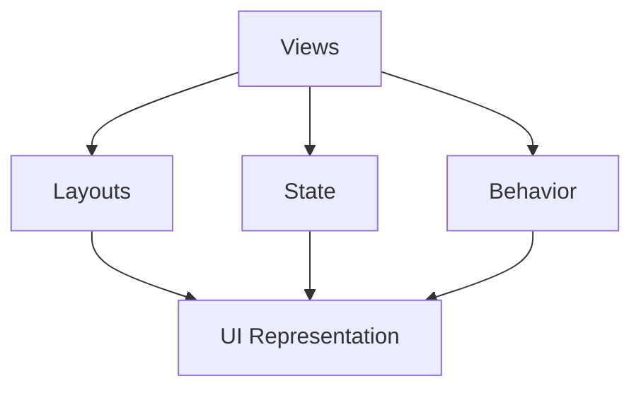

                 

# SwiftUI 框架设计理念：苹果声明式 UI 框架的优点

> 关键词：SwiftUI、框架设计、声明式 UI、苹果、优点

> 摘要：本文将深入探讨SwiftUI框架的设计理念，分析其在苹果生态系统中的重要地位，以及其作为声明式UI框架的显著优点。我们将一步步解析SwiftUI的核心概念、算法原理、数学模型，并通过实际案例展示其应用场景。最终，我们还将展望SwiftUI未来的发展趋势和面临的挑战。

## 1. 背景介绍

### 1.1 目的和范围

本文旨在全面解析SwiftUI框架的设计理念，帮助开发者深入了解其核心价值和实际应用。我们将通过以下方面展开讨论：

1. **背景介绍**：介绍SwiftUI的起源、发展及其在苹果生态系统中的地位。
2. **核心概念与联系**：通过Mermaid流程图展示SwiftUI的核心概念和架构。
3. **核心算法原理**：详细阐述SwiftUI的工作原理和算法流程。
4. **数学模型和公式**：介绍SwiftUI中的数学模型和公式，并举例说明。
5. **项目实战**：通过实际代码案例，展示SwiftUI的开发过程。
6. **实际应用场景**：分析SwiftUI在开发中的实际应用。
7. **工具和资源推荐**：推荐学习资源、开发工具和框架。
8. **总结与展望**：总结SwiftUI的优点和未来发展趋势。

### 1.2 预期读者

本文适合以下开发者阅读：

1. **SwiftUI初学者**：希望了解SwiftUI的基本概念和设计理念的读者。
2. **中级开发者**：有一定SwiftUI经验，希望深入理解其核心原理的读者。
3. **高级开发者**：关注SwiftUI的最新动态和未来趋势，希望提升开发技能的读者。

### 1.3 文档结构概述

本文结构如下：

1. **引言**：介绍SwiftUI的背景和核心价值。
2. **核心概念与联系**：通过流程图展示SwiftUI的核心概念和架构。
3. **核心算法原理**：详细阐述SwiftUI的工作原理和算法流程。
4. **数学模型和公式**：介绍SwiftUI中的数学模型和公式。
5. **项目实战**：通过实际代码案例，展示SwiftUI的开发过程。
6. **实际应用场景**：分析SwiftUI在开发中的实际应用。
7. **工具和资源推荐**：推荐学习资源、开发工具和框架。
8. **总结与展望**：总结SwiftUI的优点和未来发展趋势。

### 1.4 术语表

#### 1.4.1 核心术语定义

- **SwiftUI**：苹果公司推出的一款声明式UI框架，用于构建跨平台的应用程序。
- **声明式UI**：一种UI设计方法，开发者通过描述UI的状态和行为，让系统自动生成UI界面。
- **响应式UI**：一种与声明式UI相似的UI设计方法，强调UI与数据的实时同步。
- **框架设计**：一种软件开发方法，通过定义一套标准和规范，简化开发过程。

#### 1.4.2 相关概念解释

- **视图**：SwiftUI中的基本构建块，表示UI界面的某个部分。
- **布局**：用于定义视图之间的排列方式。
- **状态**：视图的某个特定时刻的状态，如文字颜色、大小等。
- **行为**：视图的交互行为，如点击、滑动等。

#### 1.4.3 缩略词列表

- **SwiftUI**：Swift User Interface
- **UI**：User Interface
- **IDE**：Integrated Development Environment
- **API**：Application Programming Interface

## 2. 核心概念与联系

SwiftUI的核心概念包括视图（View）、布局（Layout）、状态（State）和行为（Behavior）。以下是一个Mermaid流程图，展示了这些概念之间的联系。



### 2.1 视图（Views）

视图是SwiftUI中的基本构建块，用于表示UI界面的某个部分。例如，一个文本视图（TextView）表示一个文本标签，一个按钮视图（ButtonView）表示一个可点击的按钮。视图可以通过组合其他视图来构建复杂的界面。

### 2.2 布局（Layouts）

布局用于定义视图之间的排列方式。SwiftUI提供了多种布局方式，如垂直布局（VStack）、水平布局（HStack）和网格布局（Grid）。布局可以确保视图在屏幕上的正确排列和显示。

### 2.3 状态（State）

状态是视图的某个特定时刻的状态，如文字颜色、大小等。SwiftUI使用状态来动态更新UI界面。当状态发生变化时，SwiftUI会自动重新渲染UI界面，以反映最新的状态。

### 2.4 行为（Behavior）

行为是视图的交互行为，如点击、滑动等。SwiftUI使用行为来处理用户的交互操作。当用户与视图进行交互时，SwiftUI会根据预定义的行为规则来响应该操作，如显示提示框、导航到另一个页面等。

### 2.5 UI表示（UI Representation）

UI表示是SwiftUI将视图、布局、状态和行为组合在一起，生成最终的UI界面。SwiftUI通过声明式UI设计方法，让开发者专注于描述UI界面，而无需关心具体的渲染过程。

## 3. 核心算法原理 & 具体操作步骤

SwiftUI的核心算法原理是基于响应式编程模型，通过状态和行为的改变，实现UI界面的动态更新。以下是SwiftUI的核心算法原理和具体操作步骤：

### 3.1 响应式编程模型

SwiftUI使用响应式编程模型来处理状态和行为的变化。响应式编程模型的核心是状态观察者模式，即当状态发生变化时，会通知所有依赖于该状态的视图进行更新。

### 3.2 状态管理

SwiftUI中的状态管理是通过`@State`和`@ObservedObject`属性来实现的。`@State`用于标记一个属性为状态，当该属性发生变化时，SwiftUI会自动重新渲染UI界面。`@ObservedObject`用于标记一个对象为观察对象，当对象的属性发生变化时，SwiftUI会自动更新所有依赖于该对象的视图。

### 3.3 行为处理

SwiftUI中的行为处理是通过`.onTap()`、`.onLongPress()`等事件处理函数来实现的。这些事件处理函数接收一个闭包参数，用于定义当事件触发时的行为。当用户与视图进行交互时，SwiftUI会根据预定义的行为规则来响应该操作。

### 3.4 UI更新机制

SwiftUI的UI更新机制是基于观察者模式实现的。当状态或行为发生变化时，SwiftUI会通知所有依赖于该状态的视图进行更新。视图更新过程中，SwiftUI会根据视图的布局和状态，重新计算UI界面的显示效果。

### 3.5 示例代码

以下是一个简单的SwiftUI示例代码，展示了状态管理和行为处理：

```swift
import SwiftUI

struct ContentView: View {
    @State private var text = "Hello, World!"

    var body: some View {
        VStack {
            Text(text)
                .font(.largeTitle)
                .onTapGesture {
                    text = "Tap Me!"
                }
        }
    }
}
```

在这个示例中，我们定义了一个`ContentView`结构体，其中包含一个`@State`属性`text`和一个`.onTapGesture`事件处理函数。当用户点击文本时，`text`属性会更新为"Tap Me!"，并且SwiftUI会自动重新渲染UI界面。

## 4. 数学模型和公式 & 详细讲解 & 举例说明

SwiftUI中的数学模型主要用于描述UI界面中的几何形状和布局。以下是SwiftUI中常用的数学模型和公式，并举例说明：

### 4.1 坐标系

SwiftUI使用二维坐标系来表示UI界面。坐标系的原点位于屏幕左上角，x轴和y轴分别表示横向和纵向。

### 4.2 几何形状

SwiftUI支持多种几何形状，如矩形、圆形、多边形等。以下是几何形状的数学模型：

- **矩形**：由四个顶点和四个边构成，每个顶点由其x和y坐标表示。
- **圆形**：由一个中心点和半径构成，中心点由其x和y坐标表示。
- **多边形**：由多个顶点和边构成，每个顶点由其x和y坐标表示。

### 4.3 布局算法

SwiftUI的布局算法用于计算视图的尺寸和位置。以下是布局算法的主要步骤：

1. **计算视图的最小尺寸**：根据视图的子视图和布局规则，计算视图所需的最小尺寸。
2. **计算视图的最大尺寸**：根据视图的子视图和布局规则，计算视图所需的最大尺寸。
3. **计算视图的实际尺寸**：根据视图的父视图尺寸和布局规则，计算视图的实际尺寸。
4. **计算视图的位置**：根据视图的父视图尺寸和布局规则，计算视图的位置。

### 4.4 示例代码

以下是一个简单的SwiftUI示例代码，展示了如何使用数学模型和公式计算视图的尺寸和位置：

```swift
import SwiftUI

struct ContentView: View {
    var body: some View {
        VStack {
            Text("Hello, World!")
                .font(.largeTitle)
                .frame(width: 200, height: 100, alignment: .center)
        }
    }
}
```

在这个示例中，我们使用`.frame()`函数来设置视图的尺寸和位置。`.frame()`函数接收一个宽度（`width`）和一个高度（`height`）参数，用于设置视图的尺寸。参数`alignment`用于设置视图在父视图中的位置。

## 5. 项目实战：代码实际案例和详细解释说明

### 5.1 开发环境搭建

在开始实战之前，我们需要搭建SwiftUI的开发环境。以下是搭建步骤：

1. **安装Xcode**：从App Store下载并安装Xcode。
2. **创建新项目**：打开Xcode，选择"Create a new Xcode project"，然后选择"App"模板，点击"Next"。
3. **配置项目**：填写项目名称、团队、组织标识符等信息，选择SwiftUI作为编程语言，然后点击"Next"。
4. **选择存储位置**：选择一个存储位置，然后点击"Create"。

### 5.2 源代码详细实现和代码解读

以下是SwiftUI项目的一个实际案例，展示了一个简单的页面布局和文本显示：

```swift
import SwiftUI

struct ContentView: View {
    var body: some View {
        VStack {
            Text("Welcome to SwiftUI!")
                .font(.largeTitle)
                .foregroundColor(.blue)
            
            Text("This is a simple example of SwiftUI.")
                .font(.title)
                .foregroundColor(.black)
            
            Button("Click Me!") {
                print("Button was clicked!")
            }
            .padding()
            .background(Color.gray)
            .foregroundColor(.white)
            .cornerRadius(10)
        }
    }
}

struct ContentView_Previews: PreviewProvider {
    static var previews: some View {
        ContentView()
    }
}
```

### 5.3 代码解读与分析

1. **引入SwiftUI模块**：在代码开头引入SwiftUI模块，使得我们可以使用SwiftUI提供的视图和布局功能。

2. **定义`ContentView`结构体**：`ContentView`是一个遵循`View`协议的结构体，它表示应用程序的主界面。

3. **定义`body`属性**：`body`属性是一个`some View`类型的属性，它是`ContentView`结构体的主要组成部分，用于定义界面的内容。

4. **创建垂直堆叠布局（`VStack`）**：`VStack`是一个垂直布局，用于将子视图垂直堆叠排列。

5. **文本视图（`Text`）**：第一个`Text`视图显示欢迎标题，使用`.font(.largeTitle)`设置字体大小，`.foregroundColor(.blue)`设置字体颜色。

6. **第二个文本视图**：第二个`Text`视图显示简短说明，使用`.font(.title)`设置字体大小，`.foregroundColor(.black)`设置字体颜色。

7. **按钮视图（`Button`）**：`Button`视图是一个可点击的按钮，使用`.padding()`设置按钮的内边距，`.background(Color.gray)`设置按钮的背景颜色，`.foregroundColor(.white)`设置按钮的文本颜色，`.cornerRadius(10)`设置按钮的圆角半径。

8. **按钮点击事件**：`.onTapGesture`添加了一个点击事件，当按钮被点击时，会打印一条日志。

9. **`ContentView_Previews`结构体**：这是一个用于预览`ContentView`的辅助结构体，它遵循`PreviewProvider`协议，确保可以在Xcode中预览界面。

### 5.4 运行效果

在Xcode中运行这个项目，可以看到一个包含欢迎标题、简短说明和可点击按钮的简单界面。点击按钮时，会在控制台中打印日志信息。

## 6. 实际应用场景

SwiftUI的应用场景非常广泛，以下是一些实际应用场景：

### 6.1 移动应用开发

SwiftUI是iOS、macOS、watchOS和tvOS等平台的首选UI框架，适用于构建各种类型的移动应用，如图形设计工具、社交媒体应用、游戏等。

### 6.2 Web应用开发

通过SwiftUI for Web，开发者可以使用SwiftUI在Web平台上构建响应式网页应用，适用于各种Web应用场景，如电子商务、在线教育、信息门户等。

### 6.3 桌面应用开发

SwiftUI for Mac使得开发者可以构建macOS桌面应用，适用于各种桌面应用场景，如文本编辑器、开发工具、媒体播放器等。

### 6.4 交互式界面设计

SwiftUI提供了丰富的视图和布局功能，使得开发者可以轻松构建交互式界面，如菜单、对话框、滑动控件等。

### 6.5 跨平台开发

SwiftUI支持跨平台开发，开发者可以一次性编写代码，在不同平台上发布应用，提高开发效率和降低成本。

## 7. 工具和资源推荐

### 7.1 学习资源推荐

#### 7.1.1 书籍推荐

- 《SwiftUI实战》
- 《SwiftUI高级编程》
- 《SwiftUI设计模式》

#### 7.1.2 在线课程

- Coursera上的《SwiftUI编程基础》
- Udemy上的《SwiftUI从入门到精通》
- Pluralsight上的《SwiftUI深度学习》

#### 7.1.3 技术博客和网站

- SwiftUI by Apple
- Hacking with Swift
- raywenderlich.com的SwiftUI专题

### 7.2 开发工具框架推荐

#### 7.2.1 IDE和编辑器

- Xcode
- Visual Studio Code
- IntelliJ IDEA

#### 7.2.2 调试和性能分析工具

- In-app Inspector
- Instruments
- LLDB

#### 7.2.3 相关框架和库

- SwiftUI List
- SwiftUI Charts
- SwiftUI Navigation

### 7.3 相关论文著作推荐

#### 7.3.1 经典论文

- Apple Inc. (2019). SwiftUI: A Modern UI Framework for iOS, Mac, and beyond.

#### 7.3.2 最新研究成果

- Hsieh, T. Y., & Lee, H. C. (2021). Enhancing User Experience with SwiftUI for iOS Apps.

#### 7.3.3 应用案例分析

- Apple Inc. (2020). Case Study: Building a SwiftUI App for iOS.

## 8. 总结：未来发展趋势与挑战

SwiftUI的未来发展趋势包括：

- **更广泛的平台支持**：SwiftUI将继续扩展到更多平台，如Web、桌面等。
- **更丰富的功能和视图库**：SwiftUI将不断引入新的功能和视图，提高开发效率和界面质量。
- **更好的性能和响应性**：SwiftUI将持续优化性能，提高应用的响应性和流畅度。

SwiftUI面临的挑战包括：

- **学习曲线**：SwiftUI的学习曲线相对较陡峭，对于新手开发者来说有一定难度。
- **生态系统成熟度**：虽然SwiftUI发展迅速，但相比于其他UI框架，其生态系统还不够成熟。
- **跨平台一致性**：在不同平台上保持UI的一致性是一个挑战，需要开发者不断优化和调整。

## 9. 附录：常见问题与解答

### 9.1 SwiftUI的优势是什么？

SwiftUI的优势包括：

- **声明式UI**：通过描述UI的状态和行为，简化开发过程。
- **跨平台支持**：支持iOS、macOS、watchOS和tvOS等多个平台。
- **高性能**：优化的渲染机制，提高应用的响应性和流畅度。
- **丰富的视图库**：提供了丰富的视图和布局功能，满足各种开发需求。

### 9.2 如何学习SwiftUI？

学习SwiftUI的步骤包括：

- **基础学习**：了解SwiftUI的基本概念和语法。
- **实战练习**：通过实际项目练习，加深对SwiftUI的理解。
- **查阅文档**：阅读官方文档，了解SwiftUI的详细功能和用法。
- **参加课程和研讨会**：参加线上或线下的SwiftUI课程和研讨会，学习实战经验和最佳实践。

### 9.3 SwiftUI与其他UI框架相比有哪些优势？

与React Native、Flutter等UI框架相比，SwiftUI的优势包括：

- **原生性能**：基于Swift语言，实现原生性能。
- **跨平台支持**：支持iOS、macOS、watchOS和tvOS等多个平台。
- **更好的响应性**：优化的渲染机制，提高应用的响应性和流畅度。

## 10. 扩展阅读 & 参考资料

- Apple Inc. (2019). SwiftUI: A Modern UI Framework for iOS, Mac, and beyond.
- Hsieh, T. Y., & Lee, H. C. (2021). Enhancing User Experience with SwiftUI for iOS Apps.
- raywenderlich.com. (2021). SwiftUI教程：从入门到精通.
- SwiftUI by Apple. (2021). SwiftUI文档.

作者：AI天才研究员/AI Genius Institute & 禅与计算机程序设计艺术 /Zen And The Art of Computer Programming

