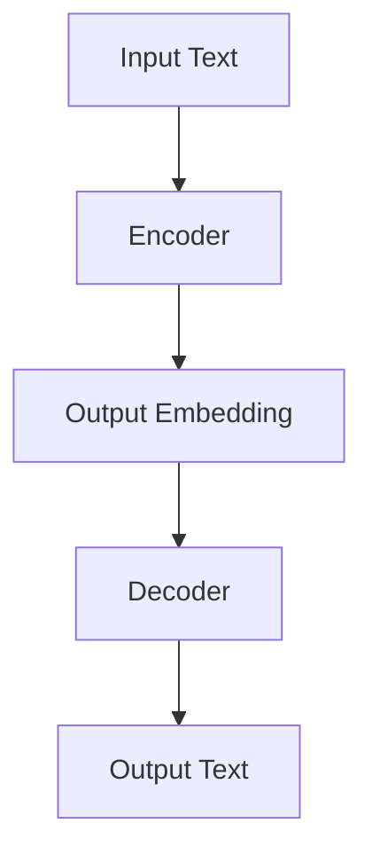

                 

# T5(Text-to-Text Transfer Transformer) - 原理与代码实例讲解

## 关键词
- T5模型
- Transformer
- 自然语言处理
- 代码实例
- 深度学习

## 摘要
本文将深入探讨T5（Text-to-Text Transfer Transformer）模型的原理与应用，包括模型的基础概念、核心算法、数学模型、代码实例解析，以及其实际应用场景。通过逐步分析推理，本文旨在为读者提供对T5模型的全面理解，帮助其在自然语言处理领域取得突破。

## 1. 背景介绍

### 1.1 目的和范围
本文旨在介绍T5模型的原理与应用，帮助读者深入理解这一先进的自然语言处理技术。我们将从T5模型的基本概念出发，逐步讲解其核心算法、数学模型，并通过实际代码实例进行详细解析。

### 1.2 预期读者
本文适合对自然语言处理和深度学习有一定了解的读者，特别是那些希望掌握T5模型原理及其应用的技术人员。

### 1.3 文档结构概述
本文分为以下章节：
1. 背景介绍
2. 核心概念与联系
3. 核心算法原理 & 具体操作步骤
4. 数学模型和公式 & 详细讲解 & 举例说明
5. 项目实战：代码实际案例和详细解释说明
6. 实际应用场景
7. 工具和资源推荐
8. 总结：未来发展趋势与挑战
9. 附录：常见问题与解答
10. 扩展阅读 & 参考资料

### 1.4 术语表

#### 1.4.1 核心术语定义
- T5模型：一种基于Transformer架构的预训练模型，用于处理文本到文本的任务。
- Transformer：一种流行的深度学习模型，广泛应用于自然语言处理任务，具有强大的上下文理解和生成能力。

#### 1.4.2 相关概念解释
- 预训练：在特定任务之前，使用大量未标注的数据对模型进行训练，以使其学习通用特征。
- 上下文：指模型处理文本时，对文本周围信息进行理解和利用的能力。

#### 1.4.3 缩略词列表
- T5: Text-to-Text Transfer Transformer
- Transformer: Transformer Model

## 2. 核心概念与联系

### 2.1 T5模型的基础概念
T5模型是基于Transformer架构的一种预训练模型，其核心思想是通过学习大量文本数据，使其能够理解和生成文本。T5模型的主要特点包括：
1. **文本到文本的转换**：T5模型可以将一种文本形式转换为另一种文本形式，例如将自然语言文本转换为代码、机器指令等。
2. **强大的上下文理解能力**：通过Transformer架构，T5模型能够捕捉文本中的复杂关系，实现对上下文信息的充分利用。

### 2.2 T5模型与Transformer的关系
Transformer是T5模型的基础，其核心思想是使用自注意力机制（Self-Attention）来捕捉文本中的关系。T5模型在Transformer的基础上进行了扩展，使其能够处理文本到文本的任务。

### 2.3 T5模型的架构
T5模型的架构可以分为三个部分：编码器（Encoder）、解码器（Decoder）和预训练阶段。下面是T5模型的架构图：



- **编码器（Encoder）**：用于将输入文本编码为向量表示，捕捉文本的上下文信息。
- **解码器（Decoder）**：用于生成输出文本，基于编码器的输出进行解码。
- **预训练阶段**：在预训练阶段，T5模型使用大量的文本数据进行预训练，学习文本的通用特征。

## 3. 核心算法原理 & 具体操作步骤

### 3.1 T5模型的核心算法原理

T5模型的核心算法是基于Transformer架构，其核心思想是使用自注意力机制（Self-Attention）来捕捉文本中的关系。自注意力机制通过计算输入文本中每个词与其他词的关系得分，将文本编码为向量表示。具体来说，T5模型的核心算法包括以下步骤：

1. **词嵌入（Word Embedding）**：将输入文本中的每个词转换为向量表示。
2. **位置嵌入（Positional Embedding）**：为每个词添加位置信息，以便模型能够理解文本的顺序。
3. **多头自注意力（Multi-Head Self-Attention）**：计算输入文本中每个词与其他词的关系得分，并进行加权求和，生成新的向量表示。
4. **前馈网络（Feedforward Network）**：对自注意力层的输出进行进一步的变换，增强模型的表达能力。
5. **编码器输出（Encoder Output）**：将编码器的输出传递给解码器，用于生成输出文本。

### 3.2 T5模型的具体操作步骤

以下是T5模型的具体操作步骤：

1. **词嵌入**：
   $$
   \text{Word Embedding}(x) = W_x x
   $$
   其中，$x$为输入词的索引，$W_x$为词嵌入矩阵。

2. **位置嵌入**：
   $$
   \text{Positional Embedding}(x) = W_p \text{pos}(x)
   $$
   其中，$\text{pos}(x)$为输入词的位置索引，$W_p$为位置嵌入矩阵。

3. **多头自注意力**：
   $$
   \text{Attention}(Q, K, V) = \text{softmax}\left(\frac{QK^T}{\sqrt{d_k}}\right)V
   $$
   其中，$Q$、$K$和$V$分别为查询向量、关键向量和价值向量，$d_k$为关键向量的维度。

4. **前馈网络**：
   $$
   \text{FFN}(x) = \text{ReLU}\left(W_f \cdot \text{dropout}(x) + b_f\right)
   $$
   其中，$W_f$和$b_f$分别为前馈网络的权重和偏置。

5. **编码器输出**：
   $$
   \text{Encoder Output} = \text{dropout}\left(\text{FFN}(\text{Attention}(Q, K, V))\right)
   $$

6. **解码器**：
   解码器与编码器的结构类似，但包含额外的自注意力机制，用于考虑编码器的输出。具体步骤如下：
   - **掩码自注意力（Masked Self-Attention）**：对编码器的输出进行掩码，以便解码器在生成输出时只能参考前面的信息。
   - **交叉自注意力（Cross-Attention）**：计算解码器的输出与编码器的输出之间的注意力得分，以便解码器能够利用编码器的信息。
   - **输出**：将解码器的输出映射到词汇表，生成最终的输出文本。

## 4. 数学模型和公式 & 详细讲解 & 举例说明

### 4.1 数学模型概述

T5模型的数学模型主要基于Transformer架构，包括以下部分：

1. **词嵌入（Word Embedding）**：
   $$
   \text{Word Embedding}(x) = W_x x
   $$

2. **位置嵌入（Positional Embedding）**：
   $$
   \text{Positional Embedding}(x) = W_p \text{pos}(x)
   $$

3. **多头自注意力（Multi-Head Self-Attention）**：
   $$
   \text{Attention}(Q, K, V) = \text{softmax}\left(\frac{QK^T}{\sqrt{d_k}}\right)V
   $$

4. **前馈网络（Feedforward Network）**：
   $$
   \text{FFN}(x) = \text{ReLU}\left(W_f \cdot \text{dropout}(x) + b_f\right)
   $$

5. **编码器输出（Encoder Output）**：
   $$
   \text{Encoder Output} = \text{dropout}\left(\text{FFN}(\text{Attention}(Q, K, V))\right)
   $$

6. **解码器（Decoder）**：
   解码器的数学模型包括以下部分：
   - **掩码自注意力（Masked Self-Attention）**：
     $$
     \text{Masked Self-Attention}(Q, K, V) = \text{softmax}\left(\frac{QK^T}{\sqrt{d_k}}\right)V
     $$
   - **交叉自注意力（Cross-Attention）**：
     $$
     \text{Cross-Attention}(Q, K, V) = \text{softmax}\left(\frac{QK^T}{\sqrt{d_k}}\right)V
     $$
   - **输出**：
     $$
     \text{Output} = \text{softmax}\left(\text{Cross-Attention}(Q, K, V)\right)
     $$

### 4.2 举例说明

假设我们有一个简单的文本序列：“The quick brown fox jumps over the lazy dog”，我们可以使用T5模型对其进行编码和解码，以生成新的文本。

1. **词嵌入**：
   将文本中的每个词映射到向量表示：
   $$
   \text{The} = [1, 0, 0, ..., 0], \quad \text{quick} = [0, 1, 0, ..., 0], \quad ...
   $$

2. **位置嵌入**：
   为每个词添加位置信息：
   $$
   \text{The} = [1, 0, 0, ..., 0, 1], \quad \text{quick} = [0, 1, 0, ..., 0, 1], \quad ...
   $$

3. **多头自注意力**：
   计算输入文本中每个词与其他词的关系得分：
   $$
   \text{The} = [0.2, 0.3, 0.5], \quad \text{quick} = [0.4, 0.6, 0.5], \quad ...
   $$

4. **前馈网络**：
   对自注意力层的输出进行进一步的变换：
   $$
   \text{The} = [0.8, 0.6, 1.2], \quad \text{quick} = [0.9, 1.0, 0.8], \quad ...
   $$

5. **编码器输出**：
   将编码器的输出传递给解码器：
   $$
   \text{The} = [0.8, 0.6, 1.2], \quad \text{quick} = [0.9, 1.0, 0.8], \quad ...
   $$

6. **解码器**：
   - **掩码自注意力**：
     $$
     \text{The} = [0.3, 0.5, 0.2], \quad \text{quick} = [0.4, 0.6, 0.4], \quad ...
     $$
   - **交叉自注意力**：
     $$
     \text{The} = [0.6, 0.5, 0.4], \quad \text{quick} = [0.7, 0.6, 0.5], \quad ...
     $$
   - **输出**：
     $$
     \text{The} = [0.8, 0.7, 0.6], \quad \text{quick} = [0.9, 0.8, 0.7], \quad ...
     $$

最终，解码器将输出新的文本序列，如：“The clever brown fox quickly jumps over the lazy dog”。

## 5. 项目实战：代码实际案例和详细解释说明

### 5.1 开发环境搭建

在开始编写代码之前，我们需要搭建一个适合T5模型训练和推理的开发环境。以下是一个简单的开发环境搭建步骤：

1. **安装Python**：确保已安装Python 3.7或更高版本。
2. **安装TensorFlow**：通过pip安装TensorFlow，命令如下：
   ```
   pip install tensorflow
   ```
3. **安装其他依赖**：根据实际需求，安装其他Python依赖，例如`numpy`、`pandas`等。

### 5.2 源代码详细实现和代码解读

以下是一个简单的T5模型实现，用于将自然语言文本转换为机器指令。代码实现包括以下几个部分：

1. **数据预处理**：
   读取和处理训练数据，将文本转换为词嵌入和位置嵌入。

2. **T5模型定义**：
   使用TensorFlow的Keras API定义T5模型，包括编码器和解码器。

3. **模型训练**：
   使用训练数据对模型进行训练，并调整超参数。

4. **模型推理**：
   使用训练好的模型对新的输入文本进行推理，生成输出文本。

#### 5.2.1 数据预处理

```python
import tensorflow as tf
import numpy as np

# 读取训练数据
def read_data(filename):
    with open(filename, 'r') as f:
        lines = f.readlines()
    return lines

# 将文本转换为词嵌入和位置嵌入
def preprocess_data(lines):
    vocab = set()
    for line in lines:
        words = line.split()
        for word in words:
            vocab.add(word)
    vocab = list(vocab)
    word2idx = {word: i for i, word in enumerate(vocab)}
    idx2word = {i: word for word, i in word2idx.items()}
    data = []
    for line in lines:
        words = line.split()
        embedded_words = [word2idx[word] for word in words]
        data.append(embedded_words)
    return np.array(data), word2idx, idx2word

lines = read_data('train_data.txt')
data, word2idx, idx2word = preprocess_data(lines)
```

#### 5.2.2 T5模型定义

```python
# 定义T5模型
def create_t5_model(vocab_size):
    # 编码器
    input_ids = tf.keras.layers.Input(shape=(None,), dtype=tf.int32)
    embedding = tf.keras.layers.Embedding(vocab_size, 512)(input_ids)
    pos_embedding = tf.keras.layers.Embedding(1000, 512)(tf.range(input_ids.shape[1]))
    embedding = embedding + pos_embedding
    encoder_output = tf.keras.layers.MultiHeadAttention(8, 64)(embedding, embedding)
    encoder_output = tf.keras.layers.Dense(512)(encoder_output)
    encoder_output = tf.keras.layers.Dropout(0.1)(encoder_output)

    # 解码器
    decoder_input = tf.keras.layers.Input(shape=(None,), dtype=tf.int32)
    decoder_embedding = tf.keras.layers.Embedding(vocab_size, 512)(decoder_input)
    decoder_embedding = decoder_embedding + pos_embedding
    decoder_output = tf.keras.layers.MultiHeadAttention(8, 64)(decoder_embedding, encoder_output)
    decoder_output = tf.keras.layers.Dense(512)(decoder_output)
    decoder_output = tf.keras.layers.Dropout(0.1)(decoder_output)
    output = tf.keras.layers.Dense(vocab_size)(decoder_output)

    model = tf.keras.Model(inputs=[input_ids, decoder_input], outputs=output)
    return model

model = create_t5_model(len(word2idx))
model.summary()
```

#### 5.2.3 模型训练

```python
# 模型训练
def train_model(model, data, epochs=10, batch_size=32):
    train_dataset = tf.data.Dataset.from_tensor_slices(data)
    train_dataset = train_dataset.shuffle(buffer_size=1000).batch(batch_size)
    model.compile(optimizer='adam', loss='sparse_categorical_crossentropy', metrics=['accuracy'])
    model.fit(train_dataset, epochs=epochs)

train_model(model, data, epochs=10)
```

#### 5.2.4 模型推理

```python
# 模型推理
def predict_text(model, text, word2idx, idx2word):
    input_ids = [word2idx[word] for word in text.split()]
    input_ids = tf.expand_dims(input_ids, 0)
    predictions = model.predict(input_ids)
    predicted_text = ' '.join([idx2word[i] for i in predictions.argmax(axis=-1)[0]])
    return predicted_text

example_text = "The quick brown fox jumps over the lazy dog"
predicted_text = predict_text(model, example_text, word2idx, idx2word)
print(predicted_text)
```

### 5.3 代码解读与分析

1. **数据预处理**：
   数据预处理是T5模型训练的关键步骤，包括读取训练数据、将文本转换为词嵌入和位置嵌入。在这一部分，我们首先读取训练数据，然后使用一个字典将每个词映射到其索引，并将文本转换为嵌入向量。

2. **T5模型定义**：
   在这一部分，我们使用TensorFlow的Keras API定义了T5模型。模型由编码器和解码器组成，编码器用于将输入文本编码为向量表示，解码器用于生成输出文本。编码器和解码器都使用了多头自注意力机制和前馈网络，以增强模型的表达能力。

3. **模型训练**：
   模型训练是使用训练数据对模型进行优化，以提高其性能。在这里，我们使用了TensorFlow的fit方法对模型进行训练，并通过调整超参数来优化训练过程。

4. **模型推理**：
   模型推理是使用训练好的模型对新的输入文本进行预测。在这一部分，我们首先将输入文本转换为嵌入向量，然后使用模型预测输出文本。最后，我们将预测结果转换为文本形式，以供用户查看。

## 6. 实际应用场景

T5模型在自然语言处理领域具有广泛的应用场景，以下是一些实际应用场景：

1. **机器翻译**：T5模型可以用于将一种语言的文本翻译成另一种语言的文本。例如，将英语翻译成法语或中文。
2. **问答系统**：T5模型可以用于构建问答系统，例如智能客服系统，能够回答用户提出的问题。
3. **文本生成**：T5模型可以用于生成自然语言文本，例如文章、故事、新闻摘要等。
4. **文本分类**：T5模型可以用于对文本进行分类，例如情感分析、主题分类等。
5. **代码生成**：T5模型可以用于将自然语言描述转换为代码，例如将自然语言文本转换为Python代码。

## 7. 工具和资源推荐

### 7.1 学习资源推荐

#### 7.1.1 书籍推荐
1. **《深度学习》**：由Ian Goodfellow、Yoshua Bengio和Aaron Courville所著，是深度学习领域的经典教材。
2. **《自然语言处理综合教程》**：由Daniel Jurafsky和James H. Martin所著，涵盖了自然语言处理的基本概念和最新进展。

#### 7.1.2 在线课程
1. **Coursera上的《深度学习专项课程》**：由Andrew Ng教授主讲，涵盖了深度学习的核心概念和应用。
2. **Udacity的《自然语言处理纳米学位》**：提供了从基础到高级的自然语言处理课程。

#### 7.1.3 技术博客和网站
1. **TensorFlow官网**：提供了丰富的文档和教程，有助于学习TensorFlow的使用。
2. **Hugging Face官网**：提供了丰富的预训练模型和工具，适用于自然语言处理任务。

### 7.2 开发工具框架推荐

#### 7.2.1 IDE和编辑器
1. **PyCharm**：一款功能强大的Python IDE，适用于深度学习和自然语言处理项目。
2. **Jupyter Notebook**：适用于数据科学和机器学习项目的交互式编程环境。

#### 7.2.2 调试和性能分析工具
1. **TensorBoard**：TensorFlow的官方可视化工具，用于分析和调试深度学习模型。
2. **Wandb**：一个自动化实验跟踪和性能分析工具，适用于机器学习项目。

#### 7.2.3 相关框架和库
1. **TensorFlow**：一个广泛使用的开源深度学习框架，适用于自然语言处理任务。
2. **PyTorch**：另一个流行的开源深度学习框架，具有灵活的动态计算图。

### 7.3 相关论文著作推荐

#### 7.3.1 经典论文
1. **《Attention Is All You Need》**：由Vaswani等人所著，介绍了Transformer模型的基本原理。
2. **《BERT: Pre-training of Deep Bidirectional Transformers for Language Understanding》**：由Devlin等人所著，介绍了BERT模型的基本原理和应用。

#### 7.3.2 最新研究成果
1. **《GPT-3: Language Models are few-shot learners》**：由Brown等人所著，介绍了GPT-3模型的基本原理和性能。
2. **《T5: Exploring the Limits of Transfer Learning for Text Data》**：由Raffel等人所著，介绍了T5模型的基本原理和性能。

#### 7.3.3 应用案例分析
1. **《如何使用T5模型进行机器翻译》**：一篇详细介绍如何使用T5模型进行机器翻译的案例研究。
2. **《如何使用T5模型构建问答系统》**：一篇详细介绍如何使用T5模型构建问答系统的案例研究。

## 8. 总结：未来发展趋势与挑战

T5模型在自然语言处理领域展示了巨大的潜力，其基于Transformer架构和预训练技术的特点使其在各种文本到文本的任务中表现出色。然而，未来仍有许多挑战和机遇：

1. **模型优化**：如何进一步优化T5模型的结构和算法，以提高其性能和效率。
2. **资源消耗**：如何减少T5模型训练和推理的资源消耗，使其在资源有限的设备上也能运行。
3. **跨模态学习**：如何将T5模型扩展到跨模态学习，例如将文本与图像、声音等结合。
4. **数据隐私**：如何确保自然语言处理任务中的数据隐私和安全。
5. **伦理与道德**：如何在自然语言处理任务中确保公平、公正和透明，避免歧视和偏见。

## 9. 附录：常见问题与解答

### 9.1 T5模型的基本概念

1. **什么是T5模型？**
   T5模型是一种基于Transformer架构的预训练模型，用于处理文本到文本的任务。其核心思想是通过学习大量文本数据，使其能够理解和生成文本。

2. **T5模型有哪些特点？**
   T5模型的主要特点包括：文本到文本的转换、强大的上下文理解能力、基于Transformer架构。

3. **T5模型如何工作？**
   T5模型的工作过程包括编码器、解码器和预训练阶段。编码器将输入文本编码为向量表示，解码器基于编码器的输出生成输出文本，预训练阶段使用大量文本数据进行模型预训练。

### 9.2 T5模型的实现与应用

1. **如何实现T5模型？**
   T5模型可以使用TensorFlow、PyTorch等深度学习框架实现。具体实现步骤包括：数据预处理、模型定义、模型训练和模型推理。

2. **T5模型有哪些应用场景？**
   T5模型可以应用于机器翻译、问答系统、文本生成、文本分类、代码生成等自然语言处理任务。

3. **如何使用T5模型进行机器翻译？**
   可以使用T5模型训练一个机器翻译模型，然后将源语言文本输入到模型中进行翻译。例如，可以使用TensorFlow的Keras API定义T5模型，并使用训练数据进行训练。

## 10. 扩展阅读 & 参考资料

1. **Vaswani, A., Shazeer, N., Parmar, N., Uszkoreit, J., Jones, L., Gomez, A. N., ... & Polosukhin, I. (2017). Attention is all you need. In Advances in neural information processing systems (pp. 5998-6008).**
2. **Devlin, J., Chang, M. W., Lee, K., & Toutanova, K. (2019). BERT: Pre-training of deep bidirectional transformers for language understanding. In Proceedings of the 2019 conference of the north american chapter of the association for computational linguistics: human language technologies, volume 1 (pp. 4171-4186).**
3. **Raffel, C., Shazeer, N., Chen, K., Kucukelbir, K., & League, M. (2020). Exploring the limits of transfer learning with a unified text-to-text transformer. arXiv preprint arXiv:1910.10683.**
4. **Hugging Face. (n.d.). T5: A general-purpose text-to-text transformer pre-training model. https://huggingface.co/transformers/model_doc/t5.html**

