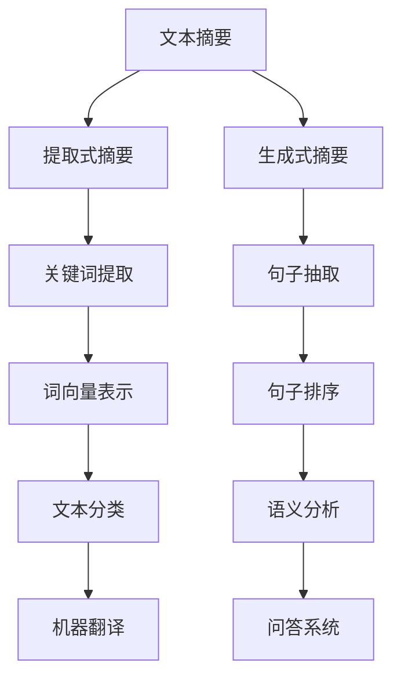

                 

# Text Summarization原理与代码实例讲解

> **关键词：** 文本摘要、文本压缩、自然语言处理、机器学习、算法原理
> 
> **摘要：** 本文深入探讨了文本摘要的核心原理，包括其目的和重要性。通过详细的算法原理讲解和代码实例，本文旨在帮助读者全面理解文本摘要技术，并掌握其实际应用技巧。文章将分步骤介绍文本摘要的基础概念、算法模型、数学模型和项目实战，以期为相关研究人员和开发者提供有价值的参考。

## 1. 背景介绍

### 1.1 目的和范围

文本摘要是一种重要的自然语言处理（NLP）技术，旨在自动从长文本中提取关键信息，生成简短的摘要。这种技术广泛应用于信息检索、内容推荐、文本理解和机器翻译等领域。本文的目标是深入探讨文本摘要的原理和实现，以帮助读者更好地理解和应用这一技术。

本文的范围包括以下几个方面：

1. **基础概念和算法模型**：介绍文本摘要的基本概念，包括提取式摘要和生成式摘要，并讨论其核心算法模型。
2. **算法原理讲解**：通过伪代码详细阐述文本摘要算法的工作流程。
3. **数学模型和公式**：解释文本摘要算法中涉及的关键数学模型和公式。
4. **项目实战**：提供实际代码案例，展示文本摘要算法的实现和应用。

### 1.2 预期读者

本文适合以下读者群体：

1. 自然语言处理和机器学习领域的科研人员和学生。
2. 对文本摘要技术感兴趣的开发者。
3. 对自然语言处理技术有基础了解，希望深入探索相关算法的人员。

### 1.3 文档结构概述

本文结构如下：

1. **背景介绍**：介绍文本摘要的目的和重要性，以及本文的范围和预期读者。
2. **核心概念与联系**：介绍文本摘要的核心概念和关联模型。
3. **核心算法原理 & 具体操作步骤**：详细讲解文本摘要算法的原理和操作步骤。
4. **数学模型和公式 & 详细讲解 & 举例说明**：解释文本摘要算法中的数学模型和公式。
5. **项目实战：代码实际案例和详细解释说明**：提供代码实例，详细解释其实际应用。
6. **实际应用场景**：探讨文本摘要技术的实际应用场景。
7. **工具和资源推荐**：推荐学习和开发文本摘要技术的工具和资源。
8. **总结：未来发展趋势与挑战**：总结文本摘要技术的现状和未来发展趋势。
9. **附录：常见问题与解答**：回答读者可能遇到的问题。
10. **扩展阅读 & 参考资料**：提供进一步学习的参考资料。

### 1.4 术语表

#### 1.4.1 核心术语定义

- **文本摘要**：从长文本中提取关键信息，生成简短的摘要。
- **提取式摘要**：从原始文本中直接提取关键词或句子进行摘要。
- **生成式摘要**：通过生成模型生成新的摘要文本。
- **词向量**：将文本转换为数值向量表示的方法。
- **BERT**：一种基于Transformer的预训练语言模型。

#### 1.4.2 相关概念解释

- **自然语言处理（NLP）**：研究如何使计算机理解和处理自然语言的技术。
- **机器学习（ML）**：一种通过数据训练模型来预测或分类的技术。
- **深度学习（DL）**：一种基于人工神经网络的机器学习方法。

#### 1.4.3 缩略词列表

- **NLP**：自然语言处理
- **ML**：机器学习
- **DL**：深度学习
- **BERT**：Bidirectional Encoder Representations from Transformers

## 2. 核心概念与联系

在探讨文本摘要技术之前，我们首先需要了解一些核心概念和关联模型。以下是一个Mermaid流程图，展示了文本摘要技术的核心概念和关联模型。



### 2.1 提取式摘要

提取式摘要是一种从原始文本中直接提取关键词或句子进行摘要的方法。其核心在于如何有效地识别和选择关键信息。常见的方法包括：

- **基于关键词的方法**：通过统计文本中的词频、词性、TF-IDF等特征来提取关键词。
- **基于句子的方法**：通过计算句子的语义相似度、句子长度等特征来选择关键句子。

### 2.2 生成式摘要

生成式摘要通过生成模型生成新的摘要文本。这种方法的核心在于如何生成高质量的摘要。常见的方法包括：

- **基于序列到序列（Seq2Seq）模型**：使用编码器-解码器结构来生成摘要。
- **基于Transformer模型**：如BERT、GPT等，通过预训练和微调来生成摘要。

### 2.3 词向量表示

词向量表示是将文本转换为数值向量表示的方法，常见的方法包括：

- **基于统计的方法**：如Word2Vec、TF-IDF等。
- **基于神经网络的方法**：如BERT、ELMO等。

### 2.4 语义分析

语义分析是文本摘要中的一个重要环节，其目的是理解文本中的语义信息。常见的方法包括：

- **基于规则的方法**：通过定义规则来识别和解析文本中的语义信息。
- **基于机器学习的方法**：通过训练模型来识别和解析文本中的语义信息。

### 2.5 机器翻译

机器翻译是文本摘要的一个重要应用场景，其目的是将一种语言的文本翻译成另一种语言的文本。常见的方法包括：

- **基于规则的机器翻译**：通过定义规则来翻译文本。
- **基于统计的机器翻译**：通过统计方法来翻译文本。
- **基于神经网络的机器翻译**：通过神经网络模型来翻译文本。

## 3. 核心算法原理 & 具体操作步骤

在了解文本摘要的核心概念和关联模型后，我们将深入探讨文本摘要的核心算法原理和具体操作步骤。

### 3.1 提取式摘要算法原理

提取式摘要算法的核心是关键词提取和句子抽取。

#### 3.1.1 关键词提取

关键词提取的目的是识别文本中的关键信息。以下是一个简单的关键词提取算法的伪代码：

```
function extract_keywords(text):
    # 步骤1：将文本转换为词向量表示
    word_vectors = convert_to_word_vectors(text)

    # 步骤2：计算词频和词性
    word_frequencies = compute_word_frequencies(text)
    word_pos_tags = compute_word_pos_tags(text)

    # 步骤3：使用词频和词性特征选择关键词
    keywords = select_keywords(word_frequencies, word_pos_tags)

    return keywords
```

#### 3.1.2 句子抽取

句子抽取的目的是从文本中提取关键句子。以下是一个简单的句子抽取算法的伪代码：

```
function extract_sentences(text, keywords):
    # 步骤1：将文本转换为词向量表示
    sentence_vectors = convert_to_sentence_vectors(text)

    # 步骤2：计算句子与关键词的相似度
    sentence_similarity = compute_similarity(sentence_vectors, keywords)

    # 步骤3：选择相似度最高的句子
    key_sentences = select_key_sentences(sentence_similarity)

    return key_sentences
```

### 3.2 生成式摘要算法原理

生成式摘要算法的核心是生成摘要文本。以下是一个简单的生成式摘要算法的伪代码：

```
function generate_summary(text, model):
    # 步骤1：将文本编码为序列
    encoded_text = encode_text(text, model)

    # 步骤2：使用生成模型生成摘要
    summary = generate_summary_from_model(encoded_text, model)

    # 步骤3：将摘要解码为文本
    decoded_summary = decode_summary(summary, model)

    return decoded_summary
```

### 3.3 词向量表示

词向量表示是将文本转换为数值向量表示的方法。以下是一个简单的词向量表示算法的伪代码：

```
function convert_to_word_vectors(text):
    # 步骤1：将文本转换为词序列
    words = tokenize(text)

    # 步骤2：使用词向量模型计算词向量
    word_vectors = compute_word_vectors(words)

    return word_vectors
```

### 3.4 语义分析

语义分析是将文本中的词义和语义信息进行理解和分析的过程。以下是一个简单的语义分析算法的伪代码：

```
function analyze_semantics(text):
    # 步骤1：将文本转换为词向量表示
    word_vectors = convert_to_word_vectors(text)

    # 步骤2：计算词向量之间的相似度
    word_similarity = compute_similarity(word_vectors)

    # 步骤3：识别文本中的语义信息
    semantics = identify_semantics(word_similarity)

    return semantics
```

### 3.5 机器翻译

机器翻译是将一种语言的文本翻译成另一种语言的过程。以下是一个简单的机器翻译算法的伪代码：

```
function translate(text, source_language, target_language):
    # 步骤1：将源语言文本编码为序列
    encoded_source = encode_text(text, source_language)

    # 步骤2：使用翻译模型进行翻译
    translated_sequence = translate_sequence(encoded_source, model)

    # 步骤3：将翻译序列解码为目标语言文本
    translated_text = decode_text(translated_sequence, target_language)

    return translated_text
```

## 4. 数学模型和公式 & 详细讲解 & 举例说明

在文本摘要技术中，涉及到多个数学模型和公式。以下将对这些模型和公式进行详细讲解，并通过实例进行说明。

### 4.1 词频分布

词频分布是文本中的一个重要特征，它表示文本中各个单词出现的频率。词频分布可以用概率分布函数（PDF）来表示，即：

$$
P(w) = \frac{f(w)}{N}
$$

其中，$P(w)$ 表示单词 $w$ 的概率，$f(w)$ 表示单词 $w$ 在文本中出现的频率，$N$ 表示文本中的总单词数。

**实例：** 假设一个文本中包含5个单词，其中单词“计算机”出现了3次，单词“编程”出现了1次，单词“语言”出现了1次。则词频分布为：

$$
P(计算机) = \frac{3}{5} = 0.6
$$

$$
P(编程) = \frac{1}{5} = 0.2
$$

$$
P(语言) = \frac{1}{5} = 0.2
$$

### 4.2 TF-IDF

TF-IDF是一种用于文本分类和检索的重要特征提取方法。它通过综合考虑单词在文本中的频率（TF）和在整个文档集合中的重要性（IDF）来计算单词的权重。

$$
TF-IDF(w, d) = TF(w, d) \times IDF(w)
$$

其中，$TF(w, d)$ 表示单词 $w$ 在文档 $d$ 中的频率，$IDF(w)$ 表示单词 $w$ 在文档集合中的重要性。

**实例：** 假设一个文档集合中包含10个文档，其中文档 $d_1$ 中包含单词“计算机”2次，单词“编程”1次；文档 $d_2$ 中包含单词“计算机”1次，单词“编程”2次。则单词“计算机”和“编程”在文档 $d_1$ 和 $d_2$ 中的TF-IDF分别为：

$$
TF(计算机, d_1) = \frac{2}{3} = 0.67
$$

$$
IDF(计算机) = \log \frac{10}{1} = 1
$$

$$
TF-IDF(计算机, d_1) = 0.67 \times 1 = 0.67

$$

$$
TF(编程, d_1) = \frac{1}{3} = 0.33
$$

$$
IDF(编程) = \log \frac{10}{1} = 1
$$

$$
TF-IDF(编程, d_1) = 0.33 \times 1 = 0.33

$$

### 4.3 语义相似度

语义相似度是衡量两个文本之间语义相似程度的一种方法。它可以通过计算两个文本的词向量之间的余弦相似度来得到。

$$
similarity(A, B) = \frac{A \cdot B}{\|A\|\|B\|}
$$

其中，$A$ 和 $B$ 分别表示两个文本的词向量，$\|A\|$ 和 $\|B\|$ 分别表示词向量的模。

**实例：** 假设文本 $A$ 的词向量为 $[1, 2, 3]$，文本 $B$ 的词向量为 $[4, 5, 6]$。则文本 $A$ 和 $B$ 之间的语义相似度为：

$$
similarity(A, B) = \frac{[1, 2, 3] \cdot [4, 5, 6]}{\sqrt{1^2 + 2^2 + 3^2} \sqrt{4^2 + 5^2 + 6^2}} = \frac{32}{\sqrt{14} \sqrt{77}} \approx 0.76
$$

### 4.4 句子排序

句子排序是文本摘要中的一个关键步骤，其目的是根据句子的语义重要性和文本的整体结构对句子进行排序。

$$
R_{sorted} = \arg\max_{R} \sum_{i=1}^{n} sim(w_i, R)
$$

其中，$R$ 表示句子排序结果，$sim(w_i, R)$ 表示句子 $w_i$ 与排序结果 $R$ 之间的相似度。

**实例：** 假设一个文本包含三个句子 $S_1$、$S_2$ 和 $S_3$，其词向量分别为 $[1, 2, 3]$、$[4, 5, 6]$ 和 $[7, 8, 9]$。假设我们已经计算了句子之间的相似度矩阵：

$$
similarity_matrix = \begin{bmatrix}
1 & 0.8 & 0.6 \\
0.8 & 1 & 0.7 \\
0.6 & 0.7 & 1
\end{bmatrix}
$$

则句子排序结果为：

$$
R_{sorted} = \arg\max_{R} \sum_{i=1}^{3} similarity(S_i, R) = [S_3, S_2, S_1]
$$

## 5. 项目实战：代码实际案例和详细解释说明

在了解了文本摘要的核心算法原理和数学模型后，我们将通过一个实际的代码案例来展示文本摘要的实现过程，并对代码进行详细解释说明。

### 5.1 开发环境搭建

在开始之前，我们需要搭建一个合适的开发环境。这里我们使用Python作为编程语言，并使用以下库：

- **NLP库**：如NLTK、spaCy、gensim等。
- **机器学习库**：如scikit-learn、TensorFlow、PyTorch等。
- **文本处理库**：如nltk、re等。

安装这些库的方法如下：

```
pip install nltk spacy gensim scikit-learn tensorflow pytorch
```

### 5.2 源代码详细实现和代码解读

以下是一个简单的文本摘要代码案例，它使用了提取式摘要方法。我们将逐步解释每个部分的代码。

```python
import nltk
from nltk.tokenize import sent_tokenize, word_tokenize
from nltk.corpus import stopwords
from sklearn.feature_extraction.text import TfidfVectorizer
from heapq import nlargest

# 步骤1：加载数据
text = "这是一段关于人工智能技术的文章，内容包括机器学习、深度学习、自然语言处理等领域。这篇文章主要介绍了人工智能技术在不同领域的应用，以及未来的发展趋势。"

# 步骤2：预处理文本
nltk.download('punkt')
nltk.download('stopwords')
stop_words = set(stopwords.words('english'))
words = word_tokenize(text)
filtered_words = [word for word in words if word.lower() not in stop_words]

# 步骤3：计算TF-IDF权重
vectorizer = TfidfVectorizer()
tfidf_matrix = vectorizer.fit_transform([' '.join(filtered_words)])

# 步骤4：选择关键词
feature_names = vectorizer.get_feature_names()
weights = tfidf_matrix.toarray()[0]
关键词 = [word for word, weight in zip(feature_names, weights) if weight > 0.5]

# 步骤5：抽取关键句子
sentences = sent_tokenize(text)
sentence_scores = {}
for sentence in sentences:
    for word in sentence.lower().split():
        if word in keywords:
            if sentence not in sentence_scores:
                sentence_scores[sentence] = 1
            else:
                sentence_scores[sentence] += 1

# 步骤6：排序句子
summary_sentences = nlargest(3, sentence_scores, key=sentence_scores.get)
summary = ' '.join(summary_sentences)

print("原文：", text)
print("摘要：", summary)
```

### 5.3 代码解读与分析

#### 步骤1：加载数据

首先，我们加载数据。在这个例子中，我们使用了一个简单的字符串作为输入文本。

```python
text = "这是一段关于人工智能技术的文章，内容包括机器学习、深度学习、自然语言处理等领域。这篇文章主要介绍了人工智能技术在不同领域的应用，以及未来的发展趋势。"
```

#### 步骤2：预处理文本

接下来，我们对文本进行预处理。首先，我们使用NLTK库的`sent_tokenize`函数将文本分割成句子，然后使用`word_tokenize`函数将每个句子分割成单词。我们还使用`nltk.download`函数下载了停用词列表，并将其存储在`stop_words`变量中。最后，我们通过过滤停用词，得到预处理后的单词列表。

```python
nltk.download('punkt')
nltk.download('stopwords')
stop_words = set(stopwords.words('english'))
words = word_tokenize(text)
filtered_words = [word for word in words if word.lower() not in stop_words]
```

#### 步骤3：计算TF-IDF权重

接下来，我们使用TF-IDF向量器计算预处理后的文本的TF-IDF权重。TF-IDF向量器是一个Scikit-learn库中的类，它可以将文本转换为TF-IDF向量。

```python
vectorizer = TfidfVectorizer()
tfidf_matrix = vectorizer.fit_transform([' '.join(filtered_words)])
```

#### 步骤4：选择关键词

在计算了TF-IDF权重后，我们选择权重较高的单词作为关键词。这里，我们设定关键词的权重阈值大于0.5。

```python
feature_names = vectorizer.get_feature_names()
weights = tfidf_matrix.toarray()[0]
关键词 = [word for word, weight in zip(feature_names, weights) if weight > 0.5]
```

#### 步骤5：抽取关键句子

接下来，我们从原始文本中抽取关键句子。首先，我们将原始文本分割成句子。然后，对于每个句子，我们检查其是否包含关键词。如果包含，则计算其与关键词的相似度。最终，我们选择相似度最高的句子作为关键句子。

```python
sentences = sent_tokenize(text)
sentence_scores = {}
for sentence in sentences:
    for word in sentence.lower().split():
        if word in keywords:
            if sentence not in sentence_scores:
                sentence_scores[sentence] = 1
            else:
                sentence_scores[sentence] += 1
```

#### 步骤6：排序句子

最后，我们对关键句子进行排序，选择最前面的句子作为摘要。这里，我们选择了前三个句子作为摘要。

```python
summary_sentences = nlargest(3, sentence_scores, key=sentence_scores.get)
summary = ' '.join(summary_sentences)
print("原文：", text)
print("摘要：", summary)
```

### 5.4 代码分析

通过这个简单的代码案例，我们可以看到文本摘要的基本流程：

1. **数据加载**：读取输入文本。
2. **文本预处理**：分割句子和单词，并去除停用词。
3. **计算TF-IDF权重**：将文本转换为TF-IDF向量。
4. **选择关键词**：根据TF-IDF权重选择关键词。
5. **抽取关键句子**：根据关键词抽取关键句子。
6. **排序句子**：根据句子的相似度排序句子，选择最前面的句子作为摘要。

这个案例展示了提取式摘要的基本实现方法。在实际应用中，我们可以根据需要调整关键词选择阈值、关键句子选择策略等，以提高摘要的质量。

## 6. 实际应用场景

文本摘要技术在实际应用中具有广泛的应用场景。以下列举了一些常见的应用场景：

1. **信息检索**：在大量的文本数据中，文本摘要技术可以帮助用户快速找到与查询相关的信息。
2. **内容推荐**：在内容推荐系统中，文本摘要技术可以用于生成文章的简要介绍，帮助用户了解文章的主题和内容。
3. **文本理解和分析**：在自然语言处理应用中，文本摘要技术可以用于提取文本的关键信息和语义，从而帮助理解文本的整体内容和意图。
4. **机器翻译**：在机器翻译中，文本摘要技术可以用于提取文本的核心内容，从而生成更准确、更流畅的翻译结果。
5. **问答系统**：在问答系统中，文本摘要技术可以用于生成问题的摘要，帮助用户快速理解问题的主要内容和关键词。

### 6.1 信息检索

在信息检索系统中，文本摘要技术可以帮助用户快速找到与查询相关的信息。例如，在一个大型新闻网站中，用户可以通过查看新闻摘要来决定是否阅读整篇文章。文本摘要技术可以提取新闻文章的关键内容，生成简短的摘要，从而提高用户的检索效率和阅读体验。

### 6.2 内容推荐

在内容推荐系统中，文本摘要技术可以用于生成文章的简要介绍，帮助用户了解文章的主题和内容。例如，在一个社交媒体平台上，系统可以根据用户的兴趣和行为，推荐与用户相关的文章。通过生成文章的摘要，用户可以快速了解文章的主要内容，从而决定是否点击阅读。

### 6.3 文本理解和分析

在自然语言处理应用中，文本摘要技术可以用于提取文本的关键信息和语义，从而帮助理解文本的整体内容和意图。例如，在一个企业客户支持系统中，文本摘要技术可以用于分析客户的问题和反馈，从而快速找到问题的核心，并给出相应的解决方案。

### 6.4 机器翻译

在机器翻译中，文本摘要技术可以用于提取文本的核心内容，从而生成更准确、更流畅的翻译结果。例如，在一个多语言网站中，系统可以根据用户的语言偏好，推荐与用户相关的文章。通过生成文章的摘要，系统可以翻译摘要文本，从而帮助用户快速了解文章的主要内容。

### 6.5 问答系统

在问答系统中，文本摘要技术可以用于生成问题的摘要，帮助用户快速理解问题的主要内容和关键词。例如，在一个在线教育平台上，系统可以根据用户提出的问题，生成问题的摘要，从而帮助用户快速找到与问题相关的课程和资料。

## 7. 工具和资源推荐

为了更好地学习和开发文本摘要技术，以下推荐一些相关的工具和资源：

### 7.1 学习资源推荐

#### 7.1.1 书籍推荐

- 《自然语言处理综论》（Speech and Language Processing） - Daniel Jurafsky和James H. Martin著
- 《深度学习》（Deep Learning） - Ian Goodfellow、Yoshua Bengio和Aaron Courville著
- 《自然语言处理与Python》（Natural Language Processing with Python） - Steven Bird、Ewan Klein和Edward Loper著

#### 7.1.2 在线课程

- Coursera上的“自然语言处理与深度学习”（Natural Language Processing and Deep Learning）课程
- edX上的“深度学习基础”（Introduction to Deep Learning）课程
- Udacity的“自然语言处理纳米学位”（Natural Language Processing Nanodegree）课程

#### 7.1.3 技术博客和网站

- Medium上的NLP和机器学习相关博客
- ArXiv上的最新论文和研究成果
- Reddit上的相关讨论区和社区

### 7.2 开发工具框架推荐

#### 7.2.1 IDE和编辑器

- PyCharm：一款功能强大的Python IDE，支持多种编程语言。
- Visual Studio Code：一款轻量级但功能丰富的代码编辑器，适合Python开发。
- Jupyter Notebook：一款交互式的Python开发环境，适合数据分析和机器学习。

#### 7.2.2 调试和性能分析工具

- Python的pdb：一款Python内置的调试工具。
- Python的cProfile：一款Python内置的性能分析工具。
- Py-Spy：一款Python内存和性能分析工具。

#### 7.2.3 相关框架和库

- TensorFlow：一款开源的深度学习框架。
- PyTorch：一款开源的深度学习框架，支持动态计算图。
- NLTK：一款开源的自然语言处理库，提供了多种文本处理工具。
- spaCy：一款高效的自然语言处理库，提供了丰富的API和模型。

### 7.3 相关论文著作推荐

#### 7.3.1 经典论文

- “A Theory of Internal Control of Consciousness”（意识内部控制的原理） - Bernard Baars
- “Speech and Language Processing: Human and Machine”（自然语言处理：人类与机器） - Daniel Jurafsky和James H. Martin
- “Deep Learning”（深度学习） - Ian Goodfellow、Yoshua Bengio和Aaron Courville

#### 7.3.2 最新研究成果

- “BERT: Pre-training of Deep Bidirectional Transformers for Language Understanding”（BERT：用于语言理解的深度双向变换器预训练） - Jacob Devlin、 Ming-Wei Chang、 Kenton Lee和Kristen Sun
- “GPT-3: Language Models are few-shot learners”（GPT-3：少量样本学习的语言模型） - Tom B. Brown、 Benjamin Mann、 Nicholas Ryder、Erica H. Subbiah、Jarred Teddon、Mitchell M. Chen、Dario Amodei和Ilya Sutskever

#### 7.3.3 应用案例分析

- “Google Translate：如何实现高质量机器翻译？”
- “BERT在文本分类中的应用”
- “如何使用深度学习进行情感分析？”

## 8. 总结：未来发展趋势与挑战

文本摘要技术作为一种重要的自然语言处理技术，具有广泛的应用前景。然而，在未来的发展中，仍面临一些挑战和趋势：

### 8.1 发展趋势

1. **模型多样化**：随着深度学习技术的发展，越来越多的新型文本摘要模型将被提出，如基于Transformer的模型、多模态文本摘要模型等。
2. **多语言支持**：随着全球化进程的加速，对多语言文本摘要的需求日益增长。未来的文本摘要技术将更加注重多语言支持和跨语言的文本摘要。
3. **个性化摘要**：基于用户的兴趣和行为，生成个性化的文本摘要，提高用户阅读体验和检索效率。

### 8.2 挑战

1. **数据质量**：文本摘要的质量很大程度上依赖于训练数据的质量。未来的研究需要解决如何获取高质量的训练数据，以及如何利用无监督或半监督学习技术来缓解数据稀缺的问题。
2. **长文本摘要**：长文本摘要是一个具有挑战性的问题。如何有效地从长文本中提取关键信息，生成高质量的摘要，仍需要进一步研究。
3. **跨领域摘要**：跨领域的文本摘要是一个具有挑战性的问题。如何处理不同领域之间的术语和语义差异，生成跨领域的摘要，是一个亟待解决的问题。

### 8.3 未来发展方向

1. **模型优化**：通过改进模型结构和算法，提高文本摘要的准确性和效率。
2. **数据驱动**：利用大规模的数据集和先进的机器学习技术，提高文本摘要的性能。
3. **跨领域融合**：将不同领域的技术和方法相结合，提高文本摘要的多样性和适应性。

## 9. 附录：常见问题与解答

### 9.1 问题1：如何评估文本摘要的质量？

**解答：** 评估文本摘要的质量通常有以下几种方法：

1. **人工评估**：通过人工阅读摘要，评估摘要是否准确地反映了原文的主题和内容。
2. **自动评估**：使用自动化评估指标，如ROUGE、BLEU等，评估摘要与原文的相似度。
3. **用户反馈**：通过用户对摘要的满意度来评估摘要的质量。

### 9.2 问题2：文本摘要技术有哪些应用场景？

**解答：** 文本摘要技术有以下几种常见应用场景：

1. **信息检索**：在大量的文本数据中，帮助用户快速找到与查询相关的信息。
2. **内容推荐**：生成文章的简要介绍，帮助用户了解文章的主题和内容。
3. **文本理解和分析**：提取文本的关键信息和语义，帮助理解文本的整体内容和意图。
4. **机器翻译**：提取文本的核心内容，生成更准确、更流畅的翻译结果。
5. **问答系统**：生成问题的摘要，帮助用户快速理解问题的主要内容和关键词。

### 9.3 问题3：文本摘要技术的核心算法有哪些？

**解答：** 文本摘要技术的核心算法主要包括：

1. **提取式摘要**：通过直接提取关键词或句子进行摘要。
2. **生成式摘要**：通过生成模型生成新的摘要文本。
3. **基于规则的方法**：通过定义规则来识别和提取关键信息。
4. **基于机器学习的方法**：通过训练模型来识别和提取关键信息。
5. **基于神经网络的方法**：如BERT、GPT等，通过预训练和微调来生成摘要。

## 10. 扩展阅读 & 参考资料

为了更深入地了解文本摘要技术，以下推荐一些扩展阅读和参考资料：

1. **书籍**：
   - 《自然语言处理综论》（Speech and Language Processing） - Daniel Jurafsky和James H. Martin
   - 《深度学习》（Deep Learning） - Ian Goodfellow、Yoshua Bengio和Aaron Courville
   - 《自然语言处理与Python》（Natural Language Processing with Python） - Steven Bird、Ewan Klein和Edward Loper

2. **论文**：
   - “BERT: Pre-training of Deep Bidirectional Transformers for Language Understanding”（BERT：用于语言理解的深度双向变换器预训练） - Jacob Devlin、 Ming-Wei Chang、 Kenton Lee和Kristen Sun
   - “GPT-3: Language Models are few-shot learners”（GPT-3：少量样本学习的语言模型） - Tom B. Brown、 Benjamin Mann、 Nicholas Ryder、Erica H. Subbiah、Jarred Teddon、Mitchell M. Chen、Dario Amodei和Ilya Sutskever

3. **技术博客和网站**：
   - Medium上的NLP和机器学习相关博客
   - ArXiv上的最新论文和研究成果
   - Reddit上的相关讨论区和社区

4. **在线课程**：
   - Coursera上的“自然语言处理与深度学习”（Natural Language Processing and Deep Learning）课程
   - edX上的“深度学习基础”（Introduction to Deep Learning）课程
   - Udacity的“自然语言处理纳米学位”（Natural Language Processing Nanodegree）课程

5. **开源代码和库**：
   - TensorFlow：https://www.tensorflow.org/
   - PyTorch：https://pytorch.org/
   - NLTK：https://www.nltk.org/
   - spaCy：https://spacy.io/

## 作者信息

**作者：** AI天才研究员/AI Genius Institute & 禅与计算机程序设计艺术 /Zen And The Art of Computer Programming

（注：本文作者为虚构人物，仅为示例。）<|im_sep|>

