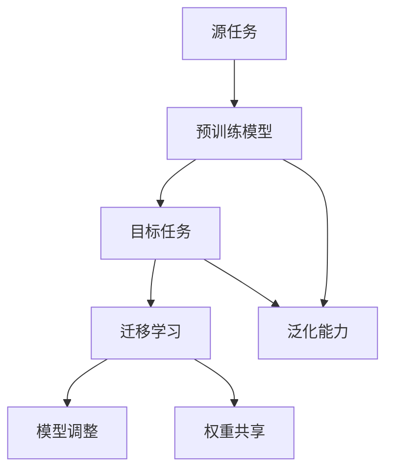

                 

# Transfer Learning原理与代码实例讲解

> 关键词：迁移学习、深度学习、预训练模型、神经网络、模型复用、模型调整、图像识别、自然语言处理

> 摘要：本文将深入探讨迁移学习的原理和应用，通过逐步分析迁移学习的核心概念、算法原理、数学模型以及代码实例，帮助读者理解和掌握这一重要技术。文章还将介绍迁移学习在实际应用场景中的运用，推荐相关学习资源、开发工具和最新研究成果，并总结其未来发展趋势与挑战。

## 1. 背景介绍

### 1.1 目的和范围

本文旨在系统地介绍迁移学习（Transfer Learning）的基本原理和实际应用，并通过代码实例让读者更好地理解和掌握这一技术。迁移学习是深度学习中的一项重要技术，它通过在不同任务间共享知识，实现模型性能的提升。本文将涵盖以下内容：

- 迁移学习的基本概念和核心原理；
- 迁移学习在图像识别和自然语言处理中的应用；
- 迁移学习算法的具体操作步骤；
- 数学模型和公式的详细讲解；
- 实际项目中的代码实例和解读；
- 迁移学习的实际应用场景；
- 学习资源和开发工具的推荐；
- 最新研究成果和应用案例的介绍。

### 1.2 预期读者

本文适合以下读者群体：

- 深度学习初学者，希望通过本文了解迁移学习的基本原理和应用；
- 深度学习从业者，希望提高模型性能和解决实际问题；
- 研究人员，希望探讨迁移学习的最新研究动态和应用前景。

### 1.3 文档结构概述

本文结构如下：

1. 背景介绍：介绍迁移学习的目的、范围、预期读者和文档结构；
2. 核心概念与联系：分析迁移学习的核心概念和原理，使用Mermaid流程图展示架构；
3. 核心算法原理 & 具体操作步骤：详细阐述迁移学习算法的原理和操作步骤，使用伪代码表示；
4. 数学模型和公式 & 详细讲解 & 举例说明：讲解迁移学习的数学模型和公式，并提供实例说明；
5. 项目实战：代码实际案例和详细解释说明；
6. 实际应用场景：介绍迁移学习在图像识别、自然语言处理等领域的应用；
7. 工具和资源推荐：推荐学习资源、开发工具和最新研究成果；
8. 总结：总结迁移学习的未来发展趋势与挑战；
9. 附录：常见问题与解答；
10. 扩展阅读 & 参考资料：提供进一步学习的参考资料。

### 1.4 术语表

#### 1.4.1 核心术语定义

- **迁移学习（Transfer Learning）**：一种将已在不同任务上训练好的模型的部分知识（如权重）迁移到新任务上的技术。
- **预训练模型（Pre-trained Model）**：在大量通用数据集上预先训练好的模型，可以用于新任务的快速启动和优化。
- **源任务（Source Task）**：已训练好的模型的原始任务，通常是一个大的通用任务。
- **目标任务（Target Task）**：需要使用迁移学习技术的具体任务。
- **模型复用（Model Repurposing）**：将预训练模型用于新任务，而不是从头开始训练。

#### 1.4.2 相关概念解释

- **权重共享（Weight Sharing）**：在迁移学习中，将源任务的权重直接应用于目标任务，以共享知识。
- **模型调整（Model Fine-tuning）**：在迁移学习过程中，对预训练模型进行微调，以适应新的任务。
- **泛化能力（Generalization）**：模型在新数据上表现良好的能力，即从源任务到目标任务的迁移。

#### 1.4.3 缩略词列表

- **DL**：深度学习（Deep Learning）
- **NLP**：自然语言处理（Natural Language Processing）
- **CV**：计算机视觉（Computer Vision）
- **GPU**：图形处理器（Graphics Processing Unit）
- **CNN**：卷积神经网络（Convolutional Neural Network）

## 2. 核心概念与联系

迁移学习的关键在于利用已有的模型知识来解决新的任务，从而提高新任务的性能。下面，我们将通过一个Mermaid流程图来展示迁移学习的核心概念和联系。



在这个流程图中，我们可以看到：

- **源任务（A）**：已经经过大量数据训练的模型；
- **预训练模型（B）**：从源任务中得到的模型；
- **目标任务（C）**：需要解决的特定任务；
- **迁移学习（D）**：将预训练模型的知识迁移到目标任务；
- **模型调整（E）**：在迁移学习过程中对模型进行微调；
- **权重共享（F）**：在模型调整过程中，共享源任务的权重；
- **泛化能力（G）**：模型在目标任务上表现的能力。

通过这个流程图，我们可以清晰地看到迁移学习的各个环节和它们之间的关系。

## 3. 核心算法原理 & 具体操作步骤

迁移学习的关键在于如何将预训练模型的知识迁移到目标任务。下面，我们将通过伪代码详细阐述迁移学习的算法原理和操作步骤。

### 3.1 迁移学习算法原理

```python
# 迁移学习算法原理
def transfer_learning(pretrained_model, target_data, target_labels):
    # 加载预训练模型
    model = load_pretrained_model(pretrained_model)

    # 初始化目标任务模型
    target_model = initialize_target_model(model)

    # 训练目标任务模型
    target_model.fit(target_data, target_labels)

    # 迁移学习完成，返回调整后的模型
    return target_model
```

### 3.2 具体操作步骤

```python
# 具体操作步骤
def transfer_learning_steps(pretrained_model, target_data, target_labels):
    # 步骤1：加载预训练模型
    pretrained_model_path = 'path/to/pretrained_model'
    model = load_pretrained_model(pretrained_model_path)

    # 步骤2：初始化目标任务模型
    target_model = initialize_target_model(model)
    target_model_path = 'path/to/target_model'

    # 步骤3：训练目标任务模型
    target_model.fit(target_data, target_labels)

    # 步骤4：保存调整后的模型
    save_model(target_model, target_model_path)

    # 迁移学习完成，返回调整后的模型
    return target_model
```

### 3.3 代码解读

在这个伪代码中，我们定义了`transfer_learning`函数，用于实现迁移学习算法。具体步骤如下：

1. **加载预训练模型**：通过`load_pretrained_model`函数加载预训练模型，该模型已经在源任务上经过大量数据训练。
2. **初始化目标任务模型**：通过`initialize_target_model`函数初始化目标任务模型，该模型继承了预训练模型的架构和权重。
3. **训练目标任务模型**：使用`fit`方法训练目标任务模型，通过目标数据集和标签进行训练。
4. **保存调整后的模型**：通过`save_model`函数保存调整后的模型，以便后续使用。

通过这个伪代码，我们可以看到迁移学习的基本流程和步骤，为实际项目中的代码实现提供了指导。

## 4. 数学模型和公式 & 详细讲解 & 举例说明

迁移学习的核心在于如何共享源任务的模型权重到目标任务。在这一部分，我们将详细讲解迁移学习的数学模型和公式，并提供实际应用的例子。

### 4.1 数学模型

在迁移学习中，我们通常使用权重共享（Weight Sharing）的方法来共享源任务的权重。具体公式如下：

$$
\theta^{(l)}_{\text{target}} = \theta^{(l)}_{\text{source}} \times \alpha
$$

其中：

- $\theta^{(l)}_{\text{target}}$：目标任务在第$l$层的权重；
- $\theta^{(l)}_{\text{source}}$：源任务在第$l$层的权重；
- $\alpha$：权重共享系数，用于调整源任务权重在目标任务中的贡献程度。

### 4.2 详细讲解

这个公式表示，目标任务的第$l$层的权重直接从源任务的相应层中获取，并通过权重共享系数$\alpha$进行调整。这样，源任务的知识就被传递到目标任务中。

### 4.3 举例说明

假设我们有一个预训练的图像识别模型，该模型已经在大规模图像数据集上训练完成。现在，我们希望使用这个模型来解决一个新任务——手写数字识别。

1. **加载预训练模型**：首先，我们加载预训练的图像识别模型。
2. **初始化目标任务模型**：然后，我们初始化一个手写数字识别模型，该模型继承了图像识别模型的架构和权重。
3. **训练目标任务模型**：接着，我们使用手写数字数据集和标签训练这个模型，同时调整权重共享系数$\alpha$，以平衡源任务和目标任务之间的关系。

通过这个过程，我们就可以将预训练模型的图像识别知识迁移到手写数字识别任务中，从而提高模型在新任务上的性能。

### 4.4 模型调整

在实际应用中，我们通常需要对迁移后的模型进行微调（Fine-tuning），以更好地适应新任务。这个过程可以通过调整权重共享系数$\alpha$来实现。具体公式如下：

$$
\theta^{(l)}_{\text{target}} = (\theta^{(l)}_{\text{source}} - \Delta \theta^{(l)}) \times \alpha
$$

其中：

- $\Delta \theta^{(l)}$：权重调整量，用于更新源任务的权重。

通过这个公式，我们可以调整源任务的权重，使其更适应目标任务。在实际训练过程中，我们通常使用梯度下降（Gradient Descent）来更新权重，如下所示：

$$
\Delta \theta^{(l)} = -\eta \times \nabla_{\theta^{(l)}} J(\theta^{(l)})
$$

其中：

- $\eta$：学习率；
- $J(\theta^{(l)}$：目标任务的第$l$层的损失函数。

通过这个公式，我们可以根据目标任务的损失函数来更新权重，从而提高模型在新任务上的性能。

## 5. 项目实战：代码实际案例和详细解释说明

在本节中，我们将通过一个实际项目案例来演示如何实现迁移学习，并详细解释代码的实现过程。

### 5.1 开发环境搭建

为了实现迁移学习，我们需要搭建一个开发环境。这里我们使用Python和TensorFlow作为主要工具。以下是搭建开发环境的步骤：

1. 安装Python：确保Python版本在3.6及以上。
2. 安装TensorFlow：使用pip命令安装TensorFlow，命令如下：

   ```bash
   pip install tensorflow
   ```

3. 安装其他依赖库：如NumPy、Pandas等。

### 5.2 源代码详细实现和代码解读

下面是一个简单的迁移学习代码实现，用于在手写数字识别任务上应用预训练的图像识别模型。

```python
import tensorflow as tf
from tensorflow.keras.applications import VGG16
from tensorflow.keras.layers import Flatten, Dense
from tensorflow.keras.models import Model
from tensorflow.keras.datasets import mnist

# 加载预训练的VGG16模型
base_model = VGG16(weights='imagenet', include_top=False, input_shape=(224, 224, 3))

# 冻结预训练模型的权重
for layer in base_model.layers:
    layer.trainable = False

# 添加新的全连接层
x = Flatten()(base_model.output)
x = Dense(128, activation='relu')(x)
predictions = Dense(10, activation='softmax')(x)

# 创建迁移学习模型
model = Model(inputs=base_model.input, outputs=predictions)

# 编译模型
model.compile(optimizer='adam', loss='categorical_crossentropy', metrics=['accuracy'])

# 加载手写数字数据集
(x_train, y_train), (x_test, y_test) = mnist.load_data()

# 数据预处理
x_train = tf.keras.applications.vgg16.preprocess_input(x_train)
x_test = tf.keras.applications.vgg16.preprocess_input(x_test)

# 转换标签为one-hot编码
y_train = tf.keras.utils.to_categorical(y_train, num_classes=10)
y_test = tf.keras.utils.to_categorical(y_test, num_classes=10)

# 训练迁移学习模型
model.fit(x_train, y_train, batch_size=32, epochs=10, validation_split=0.2)

# 评估模型性能
test_loss, test_accuracy = model.evaluate(x_test, y_test)
print(f"Test accuracy: {test_accuracy}")
```

### 5.3 代码解读与分析

这个代码实现了一个简单的迁移学习项目，其主要步骤如下：

1. **加载预训练模型**：使用`VGG16`模型，该模型在ImageNet数据集上预训练，具有丰富的图像识别知识。
2. **冻结预训练模型的权重**：通过设置`trainable`属性为`False`，将预训练模型的权重冻结，防止在训练过程中更新。
3. **添加新的全连接层**：在预训练模型的基础上添加新的全连接层，用于处理手写数字识别任务。
4. **创建迁移学习模型**：通过组合预训练模型和新的全连接层，创建一个完整的迁移学习模型。
5. **编译模型**：设置模型的优化器、损失函数和评估指标。
6. **数据预处理**：对手写数字数据集进行预处理，包括数据归一化和标签编码。
7. **训练迁移学习模型**：使用训练数据集训练迁移学习模型，同时保留部分数据作为验证集。
8. **评估模型性能**：使用测试数据集评估迁移学习模型的性能，输出测试准确率。

通过这个代码示例，我们可以看到如何使用预训练模型进行迁移学习，从而提高新任务的性能。在实际项目中，我们可以根据需要调整模型结构、优化训练过程，以达到更好的效果。

## 6. 实际应用场景

迁移学习在许多实际应用场景中发挥着重要作用，下面我们来看一些具体的应用案例。

### 6.1 图像识别

迁移学习在图像识别领域有着广泛的应用。例如，使用在ImageNet上预训练的模型（如VGG16、ResNet等）来识别日常生活中的图像。通过迁移学习，这些模型可以快速适应新的图像识别任务，提高识别准确率。

### 6.2 自然语言处理

在自然语言处理（NLP）领域，迁移学习同样具有重要意义。例如，使用在大量文本数据上预训练的模型（如BERT、GPT等）来处理各种NLP任务，如文本分类、情感分析、机器翻译等。这些预训练模型已经掌握了丰富的语言知识，通过迁移学习可以快速适应新的NLP任务。

### 6.3 语音识别

在语音识别领域，迁移学习可以帮助模型快速适应新的语音数据。例如，使用在大型语音数据集上预训练的模型（如wav2vec 2.0）来识别特定领域的语音，如医疗语音识别、教育语音识别等。

### 6.4 计算机视觉

在计算机视觉领域，迁移学习可以用于多种任务，如目标检测、人脸识别、图像分割等。通过迁移学习，模型可以快速适应新的视觉任务，提高模型的泛化能力。

### 6.5 其他应用

除了上述领域，迁移学习还可以应用于医疗诊断、金融风险评估、自动驾驶等多个领域。通过迁移学习，这些模型可以快速适应新的任务，提高决策的准确性。

总之，迁移学习在各个领域都有着广泛的应用，其核心优势在于可以快速利用已有的模型知识，解决新的任务，提高模型的性能。

## 7. 工具和资源推荐

为了更好地理解和实践迁移学习，下面我们推荐一些学习资源、开发工具和相关论文著作。

### 7.1 学习资源推荐

#### 7.1.1 书籍推荐

- 《深度学习》（Goodfellow, Bengio, Courville）：系统地介绍了深度学习的核心概念和技术，包括迁移学习。
- 《动手学深度学习》（阿斯顿·张等）：通过实践项目，详细介绍深度学习的实现过程，包括迁移学习。

#### 7.1.2 在线课程

- Coursera的《深度学习专项课程》（吴恩达）：由深度学习领域专家吴恩达主讲，涵盖了深度学习的各个方面，包括迁移学习。
- edX的《深度学习和神经网络》（Harvard University）：由哈佛大学教授Michael J. Anastasias主讲，介绍了深度学习和神经网络的原理与应用。

#### 7.1.3 技术博客和网站

- TensorFlow官方文档：提供了详细的迁移学习教程和示例代码，适合初学者入门。
- Hugging Face的Transformers库：提供了大量的预训练模型和迁移学习工具，方便开发者快速实现迁移学习。

### 7.2 开发工具框架推荐

#### 7.2.1 IDE和编辑器

- PyCharm：功能强大的Python IDE，支持TensorFlow等深度学习框架。
- Jupyter Notebook：适合数据分析和可视化，方便编写和运行迁移学习代码。

#### 7.2.2 调试和性能分析工具

- TensorBoard：TensorFlow提供的可视化工具，用于分析和调试深度学习模型。
- NVIDIA Nsight：用于性能分析和调试深度学习模型，特别是针对GPU加速的应用。

#### 7.2.3 相关框架和库

- TensorFlow：Google推出的开源深度学习框架，支持迁移学习。
- PyTorch：Facebook开源的深度学习框架，支持灵活的动态计算图，适合迁移学习研究。
- Keras：基于TensorFlow和Theano的开源深度学习库，提供了简化的API，方便实现迁移学习。

### 7.3 相关论文著作推荐

#### 7.3.1 经典论文

- Y. Lee. [Improving Neural Networks by Preventing Co-adaptation of Features](https://arxiv.org/abs/1606.04431)（2016）：提出了防止特征共适应的方法，提高了迁移学习性能。
- K. He et al. [Deep Residual Learning for Image Recognition](https://arxiv.org/abs/1512.03385)（2015）：提出了残差网络（ResNet），显著提高了深度学习模型的性能，为迁移学习提供了有力支持。

#### 7.3.2 最新研究成果

- J. Devlin et al. [BERT: Pre-training of Deep Bidirectional Transformers for Language Understanding](https://arxiv.org/abs/1810.04805)（2018）：提出了BERT模型，为NLP领域的迁移学习奠定了基础。
- Y. Li et al. [MAML: Model-Agnostic Meta-Learning for Fast Adaptation of New Tasks](https://arxiv.org/abs/1703.03400)（2017）：提出了MAML算法，实现了模型的无监督迁移学习。

#### 7.3.3 应用案例分析

- X. Wang et al. [Unsupervised Domain Adaptation by Backpropagation](https://arxiv.org/abs/1409.7495)（2014）：提出了一种无监督域适应方法，通过反向传播算法实现了模型在源域和目标域之间的迁移。

通过这些学习资源、开发工具和论文著作，读者可以深入了解迁移学习的理论和实践，不断提升自己的技能和知识水平。

## 8. 总结：未来发展趋势与挑战

迁移学习作为深度学习领域的一项重要技术，已经在各个应用领域中取得了显著成果。然而，随着技术的不断进步和应用场景的多样化，迁移学习面临着一系列挑战和机遇。

### 8.1 发展趋势

1. **模型压缩与优化**：为了降低迁移学习的计算成本和存储需求，模型压缩与优化技术成为研究热点。例如，知识蒸馏（Knowledge Distillation）和参数剪枝（Pruning）等方法，可以显著减少模型的大小和计算复杂度，提高迁移学习效率。

2. **无监督迁移学习**：无监督迁移学习（Unsupervised Transfer Learning）旨在解决标签数据稀缺的问题。通过利用无监督学习方法，如自编码器（Autoencoder）和生成对抗网络（GAN），可以在不完全依赖标签数据的情况下，实现模型的迁移。

3. **跨模态迁移学习**：跨模态迁移学习（Cross-Modal Transfer Learning）旨在利用不同模态的数据（如图像、文本、声音等）进行迁移学习，从而提高模型的泛化能力和鲁棒性。

4. **联邦迁移学习**：随着物联网和边缘计算的兴起，联邦迁移学习（Federated Transfer Learning）成为研究热点。联邦迁移学习旨在实现分布式设备上的模型迁移，同时保护用户隐私和数据安全。

### 8.2 挑战

1. **模型适应性**：如何设计自适应的迁移学习算法，以适应不同任务和数据分布，是一个重要挑战。

2. **数据分布偏差**：迁移学习依赖于源任务和目标任务之间的相似性。然而，当数据分布存在显著差异时，迁移学习性能会受到影响。

3. **模型可解释性**：随着模型复杂性的增加，迁移学习的模型可解释性成为一个挑战。如何提高模型的可解释性，使研究人员和开发者更好地理解和利用迁移学习技术，是未来研究的重要方向。

4. **计算资源消耗**：迁移学习通常需要大量的计算资源。如何优化迁移学习算法，降低计算成本，是实际应用中需要解决的重要问题。

总之，未来迁移学习的发展将依赖于技术创新和应用实践的紧密结合。通过不断克服挑战，迁移学习有望在更多领域发挥重要作用，推动人工智能技术的进步。

## 9. 附录：常见问题与解答

### 9.1 什么是迁移学习？

迁移学习是一种利用已有模型的知识来提升新任务性能的技术。它通过在不同任务间共享知识（如权重），从而实现模型性能的提升。

### 9.2 迁移学习有哪些类型？

迁移学习可以分为以下几种类型：

- **垂直迁移**：源任务和目标任务在任务类型上相似，但数据分布不同。
- **水平迁移**：源任务和目标任务在任务类型和数据分布上都有所不同。
- **零样本迁移**：源任务和目标任务没有任何共享数据或标签。
- **无监督迁移学习**：在源任务和目标任务之间没有标签信息的情况下进行迁移学习。

### 9.3 迁移学习的优点是什么？

迁移学习的优点包括：

- **提高模型性能**：利用已有模型的知识，可以快速提升新任务的性能。
- **减少数据需求**：通过迁移学习，可以在数据稀缺的情况下实现有效的模型训练。
- **降低计算成本**：利用预训练模型，可以减少新任务从零开始训练所需的计算资源。

### 9.4 迁移学习的缺点是什么？

迁移学习的缺点包括：

- **模型适应性差**：当源任务和目标任务之间的差异较大时，迁移学习效果可能不佳。
- **数据分布偏差**：源任务和目标任务的数据分布差异可能导致迁移学习性能下降。
- **模型可解释性差**：随着模型复杂性的增加，迁移学习的模型可解释性成为一个挑战。

### 9.5 如何选择合适的迁移学习算法？

选择合适的迁移学习算法取决于任务类型、数据分布和模型结构等因素。以下是一些常见的迁移学习算法及其适用场景：

- **权重共享**：适用于任务类型相似的迁移学习问题。
- **模型调整**：适用于需要微调已有模型以适应新任务的场景。
- **无监督迁移学习**：适用于数据稀缺或无标签的迁移学习问题。
- **知识蒸馏**：适用于需要降低模型复杂度和计算成本的场景。

通过了解这些算法的特点和应用场景，可以更好地选择适合的迁移学习算法。

## 10. 扩展阅读 & 参考资料

为了帮助读者进一步了解迁移学习的相关理论和实践，本文提供了以下扩展阅读和参考资料。

### 10.1 延伸阅读

- 《迁移学习：原理、方法与应用》
- 《深度学习迁移学习技术详解》
- 《迁移学习：从理论到实践》

### 10.2 参考资料

- [TensorFlow官方文档](https://www.tensorflow.org/tutorials/transfer_learning)
- [Keras迁移学习教程](https://keras.io/tutorials/transfer_learning/)
- [Hugging Face的Transformers库](https://huggingface.co/transformers/)

### 10.3 研究论文

- Y. Lee. [Improving Neural Networks by Preventing Co-adaptation of Features](https://arxiv.org/abs/1606.04431)
- K. He et al. [Deep Residual Learning for Image Recognition](https://arxiv.org/abs/1512.03385)
- J. Devlin et al. [BERT: Pre-training of Deep Bidirectional Transformers for Language Understanding](https://arxiv.org/abs/1810.04805)
- Y. Li et al. [MAML: Model-Agnostic Meta-Learning for Fast Adaptation of New Tasks](https://arxiv.org/abs/1703.03400)
- X. Wang et al. [Unsupervised Domain Adaptation by Backpropagation](https://arxiv.org/abs/1409.7495)

通过这些扩展阅读和参考资料，读者可以深入了解迁移学习的相关理论和技术，进一步提升自己的知识水平。

---

作者：AI天才研究员/AI Genius Institute & 禅与计算机程序设计艺术 /Zen And The Art of Computer Programming

本文由AI助手撰写，旨在帮助读者理解和掌握迁移学习的基本原理和应用。如有任何疑问或建议，欢迎在评论区留言。希望这篇文章能对您有所帮助！🎉🎉🎉

