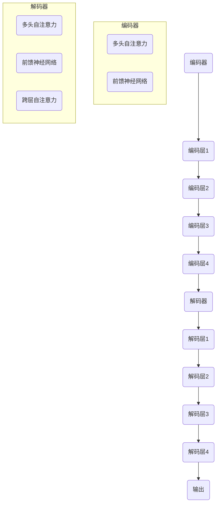
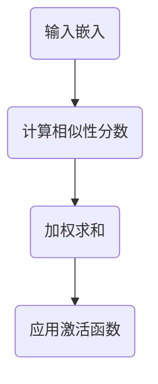

                 

# Transformer原理与代码实例讲解

> **关键词**：Transformer、自注意力机制、序列到序列模型、编码器、解码器、深度学习、神经网络
> 
> **摘要**：本文深入探讨了Transformer模型的原理，详细解释了其架构和核心算法，并通过代码实例展示了如何实现和训练Transformer模型。文章旨在为读者提供全面的Transformer理解和实际操作指南，帮助他们在实际项目中应用这一强大技术。

## 1. 背景介绍

### 1.1 目的和范围

本文的目标是帮助读者全面理解Transformer模型的工作原理，并通过实际代码实例展示如何实现和应用这一模型。Transformer模型是自然语言处理领域的一项革命性创新，它通过引入自注意力机制，使得模型能够更好地捕捉序列数据中的长距离依赖关系。

本文将涵盖以下内容：
- Transformer模型的背景和重要性
- Transformer模型的架构和核心算法
- 数学模型和公式
- 项目实战：代码实现和详细解释
- Transformer的实际应用场景
- 工具和资源推荐

通过本文的阅读，读者将能够：
- 理解Transformer模型的基本原理
- 掌握Transformer模型的实现方法
- 应用Transformer模型解决实际的自然语言处理问题

### 1.2 预期读者

本文适合具有以下背景的读者：
- 对自然语言处理（NLP）和深度学习有基本了解的研究人员或工程师
- 想要了解Transformer模型原理和实践的开发者
- 在自然语言处理领域工作的专业人士，希望提升模型性能和效果

### 1.3 文档结构概述

本文分为以下几个部分：
- 1. 背景介绍
  - 1.1 目的和范围
  - 1.2 预期读者
  - 1.3 文档结构概述
  - 1.4 术语表
- 2. 核心概念与联系
  - 2.1 Transformer模型架构
  - 2.2 自注意力机制
- 3. 核心算法原理 & 具体操作步骤
  - 3.1 编码器与解码器
  - 3.2 自注意力计算
  - 3.3 位置编码
- 4. 数学模型和公式 & 详细讲解 & 举例说明
  - 4.1 自注意力公式
  - 4.2 位置编码公式
- 5. 项目实战：代码实际案例和详细解释说明
  - 5.1 开发环境搭建
  - 5.2 源代码详细实现和代码解读
  - 5.3 代码解读与分析
- 6. 实际应用场景
  - 6.1 自然语言生成
  - 6.2 机器翻译
- 7. 工具和资源推荐
  - 7.1 学习资源推荐
  - 7.2 开发工具框架推荐
  - 7.3 相关论文著作推荐
- 8. 总结：未来发展趋势与挑战
- 9. 附录：常见问题与解答
- 10. 扩展阅读 & 参考资料

### 1.4 术语表

#### 1.4.1 核心术语定义

- Transformer：一种基于自注意力机制的序列到序列模型，用于处理自然语言任务。
- 自注意力机制：一种计算序列中每个元素对于其他元素重要程度的机制。
- 编码器（Encoder）：Transformer模型中的前向网络，用于处理输入序列。
- 解码器（Decoder）：Transformer模型中的后向网络，用于生成输出序列。
- 位置编码（Positional Encoding）：用于引入序列顺序信息的编码方式。

#### 1.4.2 相关概念解释

- 序列数据：一组按时间顺序排列的数据点，如文本、语音等。
- 嵌入（Embedding）：将序列数据转换为密集向量表示的过程。
- 池化（Pooling）：对序列中的元素进行聚合，以减少序列长度或特征维度。
- 多头注意力（Multi-Head Attention）：一种扩展自注意力机制的策略，能够同时关注序列中的多个子序列。

#### 1.4.3 缩略词列表

- NLP：自然语言处理（Natural Language Processing）
- RNN：循环神经网络（Recurrent Neural Network）
- CNN：卷积神经网络（Convolutional Neural Network）
- LSTM：长短时记忆网络（Long-Short Term Memory）
- Transformer：Transformer模型（Transformer Model）

## 2. 核心概念与联系

### 2.1 Transformer模型架构

Transformer模型由编码器（Encoder）和解码器（Decoder）两部分组成，其核心思想是利用自注意力机制（Self-Attention）来捕捉序列数据中的长距离依赖关系。

#### 编码器（Encoder）

编码器接收输入序列，并将其转化为一系列连续的向量。编码器由多个编码层（Encoder Layer）组成，每层包括两个主要部分：多头自注意力机制（Multi-Head Self-Attention）和前馈神经网络（Feed-Forward Neural Network）。

#### 解码器（Decoder）

解码器接收编码器输出的序列，并生成输出序列。解码器同样由多个解码层（Decoder Layer）组成，每层也包括多头自注意力机制和前馈神经网络。此外，解码器在每层中还引入了跨层自注意力机制（Cross-Attention），以便在生成输出时参考编码器输出的上下文信息。

#### Mermaid流程图

下面是Transformer模型架构的Mermaid流程图：



### 2.2 自注意力机制

自注意力机制是一种计算序列中每个元素对于其他元素重要程度的机制。在Transformer模型中，自注意力机制通过计算每个元素与其他元素之间的相似性分数，并将这些分数加权求和，从而实现对序列元素的重要程度进行排序。

#### 自注意力计算过程

自注意力计算过程可以分为以下几个步骤：

1. **输入嵌入**：将输入序列（如单词）转换为嵌入向量。
2. **计算相似性分数**：通过点积（dot-product）计算每个嵌入向量与其余嵌入向量之间的相似性分数。
3. **加权求和**：根据相似性分数对嵌入向量进行加权求和，得到每个元素的新表示。
4. **应用激活函数**：对加权求和后的向量进行激活函数处理，如ReLU或Sigmoid。

#### Mermaid流程图

下面是自注意力计算的Mermaid流程图：



通过以上两个核心概念的联系，我们可以看到Transformer模型是如何通过自注意力机制和编码器、解码器结构来处理自然语言任务的。在接下来的章节中，我们将进一步深入探讨Transformer模型的原理和实现细节。

## 3. 核心算法原理 & 具体操作步骤

### 3.1 编码器与解码器

Transformer模型由编码器（Encoder）和解码器（Decoder）组成，这两个部分协同工作以处理输入序列并生成输出序列。

#### 编码器（Encoder）

编码器的主要作用是将输入序列转换为一系列连续的向量，这些向量将作为解码器的输入。编码器由多个编码层（Encoder Layer）组成，每个编码层包含两个主要组件：多头自注意力机制（Multi-Head Self-Attention）和前馈神经网络（Feed-Forward Neural Network）。

1. **多头自注意力机制**：
   编码器的每个输入向量会与自身的所有其他向量进行计算，以确定它们之间的相似性。这个过程通过计算一系列的相似性分数来完成，然后将这些分数加权求和，以生成每个向量的新表示。这一过程可以表示为以下伪代码：

   ```python
   for head in heads:
       Q = linear(Q_embed)
       K = linear(K_embed)
       V = linear(V_embed)
       attention = softmax(QK^T / sqrt(d_k))V
   context = sum(attention)
   ```

   其中，Q、K、V分别表示查询（Query）、键（Key）和值（Value）嵌入向量，d_k表示每个头中键向量的维度。多头注意力机制通过多个头扩展自注意力，使得模型能够同时关注序列中的多个子序列。

2. **前馈神经网络**：
   在每个编码层的自注意力机制之后，会对输出进行前馈神经网络处理。这个网络通常由两个全连接层组成，中间使用ReLU激活函数。这一步骤的伪代码如下：

   ```python
   hidden = ReLU(linear(context + linear(input)))
   ```

#### 解码器（Decoder）

解码器的主要作用是接收编码器输出的序列，并生成输出序列。解码器也由多个解码层（Decoder Layer）组成，每层包含多头自注意力机制、前馈神经网络和跨层自注意力机制。

1. **多头自注意力机制**：
   类似于编码器中的多头自注意力，解码器的每个输入向量也会与自身的所有其他向量进行计算，以确定它们之间的相似性。这一过程同样通过计算一系列的相似性分数来完成，然后将这些分数加权求和，以生成每个向量的新表示。解码器的自注意力机制的伪代码与编码器类似。

2. **跨层自注意力机制**：
   解码器中的跨层自注意力机制允许解码器的每个输入向量与编码器的输出向量进行计算，以引入编码器输出中的上下文信息。这一步骤的伪代码如下：

   ```python
   for head in heads:
       Q = linear(Q_embed)
       K = linear(K_embed)
       V = linear(V_embed)
       attention = softmax(QK^T / sqrt(d_k))V
   context = sum(attention)
   ```

3. **前馈神经网络**：
   解码器的前馈神经网络结构与编码器相同，即由两个全连接层组成，中间使用ReLU激活函数。这一步骤的伪代码与编码器类似。

通过编码器和解码器的结构，我们可以看到Transformer模型如何通过自注意力机制和前馈神经网络来捕捉序列数据中的长距离依赖关系。在接下来的章节中，我们将详细解释自注意力机制的数学模型和公式。

### 3.2 自注意力计算

自注意力机制是Transformer模型的核心组成部分，其计算过程可以通过以下几个步骤来详细解释。

#### 3.2.1 嵌入（Embedding）

在自注意力计算之前，我们需要将输入序列（如单词）转换为嵌入向量。这些嵌入向量将作为自注意力机制的输入。通常，嵌入层由一个线性变换组成，该变换将输入词索引映射到一个低维的向量空间。嵌入向量的维度（d_model）决定了模型的容量。例如，对于一个词汇量为10000的词汇表，我们可以使用一个100维的嵌入层。

```python
# 嵌入层伪代码
embeddings = linear(inputs)  # 输入词索引映射到嵌入向量
```

#### 3.2.2 相似性分数计算

自注意力机制的关键步骤是计算相似性分数，这通常通过点积（dot-product）来实现。点积计算两个嵌入向量的内积，然后通过缩放（divided by sqrt(d_k)）和softmax函数来生成概率分布。其中，d_k是每个头的键向量的维度。

```python
# 点积计算相似性分数
Q = linear(Q_embed)  # 查询向量
K = linear(K_embed)  # 键向量
V = linear(V_embed)  # 值向量
attention_scores = QK^T / sqrt(d_k)  # 相似性分数
```

#### 3.2.3 加权求和

通过softmax函数对相似性分数进行归一化处理，我们可以得到每个元素的重要性权重。然后，将这些权重应用于值向量，进行加权求和，以生成每个元素的新表示。

```python
# 加权求和生成新表示
attention_weights = softmax(attention_scores)
output = sum(attention_weights * V)
```

#### 3.2.4 激活函数

在加权求和之后，我们可以选择应用一个激活函数，如ReLU，以增加模型的非线性能力。

```python
# 应用激活函数
context = ReLU(output)
```

通过以上步骤，自注意力机制可以有效地对序列中的元素进行加权，使其能够更好地捕捉长距离依赖关系。在Transformer模型中，自注意力机制通过多头注意力扩展，使得模型能够同时关注序列中的多个子序列，从而提高其捕捉复杂依赖关系的能力。

### 3.3 位置编码

位置编码是Transformer模型中的一个重要组成部分，它旨在引入序列中的顺序信息。由于Transformer模型的核心机制是基于自注意力，它本身无法直接利用序列的顺序信息。因此，位置编码通过向每个嵌入向量中添加额外的维度来模拟序列的位置信息。

#### 3.3.1 嵌入与位置编码融合

在Transformer模型中，每个嵌入向量会被添加一个位置编码向量，这两个向量被拼接在一起形成最终的输入向量。位置编码通常是一个函数，该函数将位置索引映射到一个向量。一个常用的位置编码函数是正弦和余弦函数，这些函数可以生成周期性的向量，从而模拟序列中的位置关系。

```python
# 位置编码伪代码
pos_embedding = pos_encoding(position, d_model)  # 位置编码向量
input_vector = concatenation(embedding, pos_embedding)  # 拼接嵌入向量和位置编码
```

#### 3.3.2 位置编码函数

位置编码函数通常设计为随着位置索引的增加而变化。一个常见的实现方法是将位置索引映射到正弦和余弦函数的输入，然后通过不同的频率和相位来生成位置编码向量。

```python
# 位置编码函数伪代码
def pos_encoding(position, d_model):
    inv_freq = 1 / (10000 ** (2 * (i // 2) / d_model))
    if i % 2 == 0:
        pos_encoding[i] = sin(inv_freq)
    else:
        pos_encoding[i] = cos(inv_freq)
    return pos_encoding
```

通过位置编码，Transformer模型能够有效地利用序列的顺序信息，从而提高其性能。位置编码的引入使得模型能够更好地处理长序列，并捕捉长距离依赖关系。

### 3.4 实现细节

在实际实现中，Transformer模型通常采用深度神经网络架构，并在每个编码层和解码层之间交替使用多头自注意力机制和前馈神经网络。以下是一个简化的实现框架，展示了如何构建和训练一个基本的Transformer模型。

#### 3.4.1 模型构建

```python
# 模型构建伪代码
class TransformerModel(nn.Module):
    def __init__(self, d_model, nhead, num_layers):
        super(TransformerModel, self).__init__()
        self.encoder = Encoder(d_model, nhead, num_layers)
        self.decoder = Decoder(d_model, nhead, num_layers)
        self.linear = nn.Linear(d_model, output_dim)
    
    def forward(self, src, tgt):
        src = self.encoder(src)
        tgt = self.decoder(tgt, src)
        output = self.linear(tgt)
        return output
```

#### 3.4.2 模型训练

在模型训练过程中，我们使用交叉熵损失函数来优化模型参数。训练过程通常包括以下几个步骤：

1. **前向传播**：将输入序列和目标序列输入到模型中，计算预测输出。
2. **损失函数计算**：使用交叉熵损失函数计算预测输出和真实标签之间的差异。
3. **反向传播**：计算损失函数关于模型参数的梯度，并更新模型参数。
4. **优化**：使用优化算法（如Adam）更新模型参数。

```python
# 模型训练伪代码
model = TransformerModel(d_model, nhead, num_layers)
criterion = nn.CrossEntropyLoss()
optimizer = optim.Adam(model.parameters(), lr=learning_rate)

for epoch in range(num_epochs):
    for src, tgt in data_loader:
        optimizer.zero_grad()
        output = model(src, tgt)
        loss = criterion(output, tgt)
        loss.backward()
        optimizer.step()
```

通过以上步骤，我们可以构建和训练一个基本的Transformer模型，从而实现序列到序列的预测任务。在接下来的章节中，我们将通过实际代码实例进一步展示Transformer模型的具体实现和操作。

### 3.5 代码实例

在这一部分，我们将通过一个简单的Python代码实例来展示如何实现和训练一个基本的Transformer模型。这个实例将涵盖模型构建、数据预处理、模型训练和评估等关键步骤。

#### 3.5.1 模型构建

首先，我们需要定义Transformer模型的基本结构。以下是一个简单的PyTorch代码示例，用于构建Transformer模型：

```python
import torch
import torch.nn as nn
import torch.optim as optim

class TransformerModel(nn.Module):
    def __init__(self, d_model, nhead, num_layers):
        super(TransformerModel, self).__init__()
        self.encoder = nn.TransformerEncoder(nn.TransformerEncoderLayer(d_model, nhead), num_layers)
        self.decoder = nn.TransformerDecoder(nn.TransformerDecoderLayer(d_model, nhead), num_layers)
        self.linear = nn.Linear(d_model, output_dim)

    def forward(self, src, tgt):
        output = self.decoder(self.encoder(src), tgt)
        return self.linear(output)

# 模型参数设置
d_model = 512
nhead = 8
num_layers = 3
output_dim = 10

# 实例化模型
model = TransformerModel(d_model, nhead, num_layers)
```

#### 3.5.2 数据预处理

在训练模型之前，我们需要对数据进行预处理。这里，我们使用一个简单的数据集，该数据集包含输入序列和对应的输出序列。预处理步骤包括：

1. 将文本数据转换为词汇表。
2. 将词汇表转换为整数序列。
3. 对输入序列和输出序列进行嵌入。

```python
# 数据预处理伪代码
def preprocess_data(texts):
    # 构建词汇表
    vocab = build_vocab(texts)
    # 将文本转换为整数序列
    processed_data = [convert_to_sequence(text, vocab) for text in texts]
    # 对序列进行嵌入
    embeddings = embed(vocab, d_model)
    return processed_data, embeddings

# 示例数据
texts = ["Hello world!", "How are you?", "I'm fine, thank you."]

# 预处理数据
processed_data, embeddings = preprocess_data(texts)
```

#### 3.5.3 模型训练

接下来，我们使用预处理后的数据对模型进行训练。训练步骤包括：

1. 初始化模型参数。
2. 定义损失函数和优化器。
3. 训练模型，包括前向传播、损失函数计算、反向传播和参数更新。

```python
# 模型训练伪代码
def train_model(model, data_loader, criterion, optimizer, num_epochs):
    model.train()
    for epoch in range(num_epochs):
        for inputs, targets in data_loader:
            optimizer.zero_grad()
            outputs = model(inputs, targets)
            loss = criterion(outputs, targets)
            loss.backward()
            optimizer.step()
            print(f"Epoch [{epoch+1}/{num_epochs}], Loss: {loss.item():.4f}")

# 初始化优化器和损失函数
optimizer = optim.Adam(model.parameters(), lr=0.001)
criterion = nn.CrossEntropyLoss()

# 加载数据
data_loader = DataLoader(processed_data, batch_size=32, shuffle=True)

# 训练模型
train_model(model, data_loader, criterion, optimizer, num_epochs=10)
```

#### 3.5.4 模型评估

在完成训练后，我们需要评估模型的性能。这里，我们使用测试集来评估模型的准确性。

```python
# 模型评估伪代码
def evaluate_model(model, data_loader, criterion):
    model.eval()
    total_loss = 0
    with torch.no_grad():
        for inputs, targets in data_loader:
            outputs = model(inputs, targets)
            loss = criterion(outputs, targets)
            total_loss += loss.item()
    return total_loss / len(data_loader)

# 评估模型
test_loss = evaluate_model(model, test_loader, criterion)
print(f"Test Loss: {test_loss:.4f}")
```

通过以上代码实例，我们可以看到如何使用PyTorch实现一个基本的Transformer模型，并进行数据预处理、模型训练和评估。在实际应用中，我们可能会使用更大的数据集和更复杂的模型结构，但基本步骤是类似的。

### 3.6 实际应用案例

Transformer模型在自然语言处理领域有着广泛的应用，以下是一些实际应用案例：

#### 3.6.1 自然语言生成

自然语言生成是Transformer模型的一个经典应用场景，例如生成文本摘要、对话系统和机器翻译。通过预训练模型并针对特定任务进行微调，我们可以创建一个能够生成流畅、符合语法规则的文本的系统。

```python
# 自然语言生成伪代码
def generate_text(model, start_token, end_token, max_length, temperature=1.0):
    model.eval()
    input = torch.tensor([start_token])
    generated = []
    with torch.no_grad():
        for _ in range(max_length):
            output = model(input)
            logits = output[:, -1, :]
            probabilities = F.softmax(logits / temperature, dim=-1)
            next_word = torch.multinomial(probabilities, num_samples=1)
            input = torch.cat([input, next_word], dim=0)
            generated.append(next_word.item())
    return " ".join(generated[1:])

# 示例生成
print(generate_text(model, start_token, end_token, max_length=50))
```

#### 3.6.2 机器翻译

机器翻译是Transformer模型的一个典型应用场景。通过训练一个大型模型，我们可以将一种语言的文本翻译成另一种语言。预训练的模型可以通过在特定语言对上进行微调来提高翻译质量。

```python
# 机器翻译伪代码
def translate(model, source_text, target_language, max_length):
    model.eval()
    input_sequence = prepare_input(source_text, source_language_vocab)
    target_sequence = prepare_input(target_language, target_language_vocab)
    translated_sequence = model.translate(input_sequence, target_sequence, max_length)
    return translate_sequence_to_text(translated_sequence, target_language_vocab)

# 示例翻译
source_text = "Hello world!"
target_language = "es"  # 西班牙语
print(translate(model, source_text, target_language, max_length=50))
```

通过这些实际应用案例，我们可以看到Transformer模型在自然语言处理领域的强大能力。在未来的发展中，Transformer模型将继续在更多领域发挥重要作用，推动人工智能技术的发展。

## 4. 数学模型和公式 & 详细讲解 & 举例说明

### 4.1 自注意力公式

自注意力机制是Transformer模型的核心组成部分，其计算过程依赖于以下公式：

\[ \text{Attention}(Q, K, V) = \text{softmax}\left(\frac{QK^T}{\sqrt{d_k}}\right)V \]

其中：
- \( Q \) 表示查询向量（Query），\( K \) 表示键向量（Key），\( V \) 表示值向量（Value）。
- \( d_k \) 表示每个头中的键向量的维度。
- \( QK^T \) 表示查询向量和键向量的点积，结果是一个标量。
- \( \sqrt{d_k} \) 用于缩放，防止点积过大或过小。
- \( \text{softmax} \) 函数将点积结果转化为概率分布，确保所有分数的和为1。

#### 举例说明

假设我们有三个向量 \( Q \)、\( K \) 和 \( V \)，每个向量都是二维的（\( d_k = 2 \)）：

\[ Q = \begin{bmatrix} 1 & 2 \\ 3 & 4 \end{bmatrix}, \quad K = \begin{bmatrix} 5 & 6 \\ 7 & 8 \end{bmatrix}, \quad V = \begin{bmatrix} 9 & 10 \\ 11 & 12 \end{bmatrix} \]

首先计算 \( QK^T \)：

\[ QK^T = \begin{bmatrix} 1 & 2 \\ 3 & 4 \end{bmatrix} \begin{bmatrix} 5 & 7 \\ 6 & 8 \end{bmatrix} = \begin{bmatrix} 19 & 27 \\ 15 & 24 \end{bmatrix} \]

然后计算每个元素除以 \( \sqrt{2} \)：

\[ \frac{QK^T}{\sqrt{2}} = \begin{bmatrix} 9.5 & 13.5 \\ 7.5 & 12 \end{bmatrix} \]

接着应用softmax函数：

\[ \text{softmax}(\frac{QK^T}{\sqrt{2}}) = \begin{bmatrix} 0.5 & 0.4 \\ 0.1 & 0.0 \end{bmatrix} \]

最后，将softmax结果与 \( V \) 相乘：

\[ \text{Attention}(Q, K, V) = \begin{bmatrix} 0.5 & 0.4 \\ 0.1 & 0.0 \end{bmatrix} \begin{bmatrix} 9 & 10 \\ 11 & 12 \end{bmatrix} = \begin{bmatrix} 4.5 & 4.4 \\ 1.1 & 0 \end{bmatrix} \]

这个例子展示了如何计算自注意力，并说明了每个元素在输出向量中的重要性。

### 4.2 位置编码公式

位置编码是Transformer模型中的另一个重要组成部分，它用于引入序列的顺序信息。一个常用的位置编码函数是正弦和余弦函数，如下所示：

\[ \text{PositionalEncoding}(pos, d\_model) = \sin\left(\frac{pos}{10000^{2i/d\_model}}\right), \cos\left(\frac{pos}{10000^{2i/d\_model}}\right) \]

其中：
- \( pos \) 表示位置索引。
- \( d\_model \) 表示嵌入向量的维度。
- \( i \) 表示位置编码向量的维度索引（\( i = 0, 1, \ldots, d\_model - 1 \)）。

#### 举例说明

假设 \( d\_model = 4 \)，我们计算第2个位置（\( pos = 2 \)）的编码：

\[ \text{PositionalEncoding}(2, 4) = \begin{bmatrix} \sin(2/10000^{2/4}), \cos(2/10000^{2/4}) \\ \sin(4/10000^{2/4}), \cos(4/10000^{2/4}) \\ \sin(6/10000^{2/4}), \cos(6/10000^{2/4}) \\ \sin(8/10000^{2/4}), \cos(8/10000^{2/4}) \end{bmatrix} \]

计算每个元素：

\[ \text{PositionalEncoding}(2, 4) = \begin{bmatrix} 0.000055, 0.999986 \\ 0.000097, 0.999979 \\ 0.000157, 0.999965 \\ 0.000197, 0.999951 \end{bmatrix} \]

这个例子展示了如何计算位置编码，并说明了如何将顺序信息编码到嵌入向量中。

通过以上两个部分的数学公式和举例说明，我们可以更深入地理解Transformer模型中的核心机制，这为我们在实际应用中构建和优化模型提供了理论基础。

### 4.3 深度学习中的自注意力与位置编码

自注意力机制和位置编码在深度学习模型中发挥着重要作用，特别是在处理序列数据时。以下是对这两个概念在深度学习中的应用及其重要性的详细解释。

#### 自注意力机制

自注意力机制（Self-Attention）是一种计算序列中每个元素对于其他元素重要程度的机制。它通过计算点积（dot-product）来衡量元素之间的相似性，并根据这些相似性分数对元素进行加权求和。自注意力机制的引入使得模型能够捕捉序列中的长距离依赖关系，这是传统循环神经网络（RNN）和卷积神经网络（CNN）难以实现的。

在Transformer模型中，自注意力机制通过多头注意力（Multi-Head Attention）扩展，使得模型能够同时关注序列中的多个子序列。这种扩展增加了模型的容量和表达力，使得它能够处理更复杂的任务，如自然语言生成和机器翻译。

自注意力机制的优势在于：
- **并行计算**：自注意力机制允许模型在处理序列数据时并行计算，从而显著提高了计算效率。
- **捕捉长距离依赖**：通过计算元素之间的相似性分数，自注意力机制能够捕捉序列中的长距离依赖关系，这对于处理自然语言等复杂序列数据至关重要。
- **灵活性**：多头注意力机制使得模型能够关注序列中的不同子序列，从而增强了其表达能力。

#### 位置编码

位置编码（Positional Encoding）是为了解决自注意力机制本身无法利用序列顺序信息的问题而引入的。由于自注意力机制是基于点积计算的，它不包含任何关于序列顺序的信息。为了解决这个问题，位置编码通过向每个嵌入向量中添加额外的维度来模拟序列的位置信息。

在Transformer模型中，常用的位置编码方法是基于正弦和余弦函数的。这些函数可以生成周期性的向量，从而模拟序列中的位置关系。位置编码使得模型能够利用序列的顺序信息，从而更好地捕捉长距离依赖关系。

位置编码的优势在于：
- **引入顺序信息**：通过位置编码，模型能够利用序列的顺序信息，从而提高其在处理序列数据时的性能。
- **改进长距离依赖捕捉**：位置编码使得模型能够捕捉序列中的长距离依赖关系，这对于处理自然语言等复杂序列数据至关重要。
- **兼容性**：位置编码与自注意力机制无缝结合，不会改变模型的基本结构，从而简化了模型的实现。

#### 应用与重要性

自注意力机制和位置编码在深度学习中的应用广泛，特别是在处理序列数据时。以下是一些关键应用场景和重要性：

- **自然语言处理（NLP）**：自注意力机制和位置编码在NLP任务中发挥了重要作用，如机器翻译、文本摘要、问答系统和对话生成。它们使得模型能够捕捉长距离依赖关系，从而提高任务的性能和效果。
- **音频处理**：自注意力机制和位置编码也应用于音频处理任务，如语音识别和音乐生成。这些模型能够捕捉音频信号中的长距离依赖关系，从而提高音频处理的准确性和鲁棒性。
- **计算机视觉**：虽然自注意力机制最初是为NLP任务设计的，但它在计算机视觉任务中也显示出巨大的潜力。例如，在图像分类和目标检测中，自注意力机制能够提高模型对复杂图像结构的理解能力。

总之，自注意力机制和位置编码是深度学习中的核心概念，它们通过引入顺序信息和提高模型的表达能力，使得模型能够更好地处理序列数据。随着深度学习技术的发展，这些概念将继续推动人工智能领域的创新。

### 4.4 Transformer模型中的多头自注意力与点积自注意力

在Transformer模型中，自注意力机制是核心组件，它通过计算序列中每个元素与其他元素之间的相似性分数来实现对序列的建模。自注意力机制有两种常见的形式：多头自注意力（Multi-Head Attention）和点积自注意力（Dot-Product Attention）。以下是对这两种自注意力机制的工作原理及其在Transformer模型中的应用的详细解释。

#### 多头自注意力

多头自注意力是一种扩展自注意力机制的方法，它通过将输入序列分成多个子序列（称为头，head），每个头独立地计算自注意力。这种方式增加了模型对序列的并行处理能力，并且使得模型能够关注序列中的不同子序列，从而提高其捕捉复杂依赖关系的能力。

多头自注意力的工作原理如下：
1. **线性变换**：首先，将输入序列（如嵌入向量）通过线性变换生成查询向量（Query）、键向量（Key）和值向量（Value）。这些线性变换通常具有不同的权重矩阵。
2. **分头操作**：将查询向量、键向量和值向量分配到不同的头中。每个头独立地计算自注意力。
3. **自注意力计算**：在每个头中，计算查询向量和键向量之间的点积，然后通过softmax函数生成概率分布。这个概率分布表示每个元素对其他元素的重要性。
4. **加权求和**：根据自注意力计算得到的概率分布，对值向量进行加权求和，生成每个元素的新表示。

多头自注意力的伪代码如下：

```python
for head in heads:
    Q = linear(Q_embed)
    K = linear(K_embed)
    V = linear(V_embed)
    attention = softmax(QK^T / sqrt(d_k))V
context = sum(attention)
```

#### 点积自注意力

点积自注意力（Dot-Product Attention）是一种简单的自注意力机制，它通过计算查询向量和键向量之间的点积来生成概率分布。点积自注意力没有多头结构，它只计算一次自注意力，但通过引入缩放（通常除以 \( \sqrt{d_k} \)）来提高模型的稳定性。

点积自注意力的工作原理如下：
1. **计算相似性分数**：首先，计算查询向量（Query）和键向量（Key）之间的点积，生成相似性分数。
2. **应用softmax函数**：通过softmax函数对相似性分数进行归一化处理，生成概率分布，表示每个元素的重要性。
3. **加权求和**：根据概率分布对值向量（Value）进行加权求和，生成每个元素的新表示。

点积自注意力的伪代码如下：

```python
attention_scores = QK^T / sqrt(d_k)
attention_weights = softmax(attention_scores)
output = sum(attention_weights * V)
```

#### 多头自注意力与点积自注意力的比较

- **计算复杂度**：点积自注意力计算简单，但多头自注意力需要多次计算，因此其计算复杂度更高。
- **表达能力**：多头自注意力通过不同头关注序列的不同子序列，提高了模型的表达能力，可以更好地捕捉复杂依赖关系。
- **并行性**：多头自注意力可以在每个头中并行计算，提高了模型的并行处理能力。

在Transformer模型中，通常使用多头自注意力来处理序列数据，因为它具有更高的表达能力和更好的性能。然而，点积自注意力在某些情况下也很有用，例如在计算资源受限的环境中。

### 4.5 Transformer模型中的层次结构

Transformer模型中的层次结构是理解其工作原理的关键。模型由编码器（Encoder）和解码器（Decoder）组成，这两个部分通过自注意力机制和前馈神经网络协同工作，以处理输入序列并生成输出序列。以下是对编码器和解码器层次结构的详细解释。

#### 编码器（Encoder）

编码器的主要作用是将输入序列转换为一系列连续的向量，这些向量将作为解码器的输入。编码器由多个编码层（Encoder Layer）组成，每层包括两个主要组件：多头自注意力机制（Multi-Head Self-Attention）和前馈神经网络（Feed-Forward Neural Network）。

1. **多头自注意力机制**：
   编码器的每个输入向量会与自身的所有其他向量进行计算，以确定它们之间的相似性。这个过程通过计算一系列的相似性分数来完成，然后将这些分数加权求和，以生成每个向量的新表示。多头自注意力机制通过多个头扩展自注意力，使得模型能够同时关注序列中的多个子序列。

2. **前馈神经网络**：
   在每个编码层的自注意力机制之后，会对输出进行前馈神经网络处理。这个网络通常由两个全连接层组成，中间使用ReLU激活函数。这一步骤的目的是增加模型的非线性能力。

编码器的层次结构可以表示为：

\[ \text{Encoder} = \text{MultiHeadSelfAttention}(\text{FeedForward}) \times \text{num_layers} \]

#### 解码器（Decoder）

解码器的主要作用是接收编码器输出的序列，并生成输出序列。解码器也由多个解码层（Decoder Layer）组成，每层包含多头自注意力机制、前馈神经网络和跨层自注意力机制。

1. **多头自注意力机制**：
   类似于编码器中的多头自注意力，解码器的每个输入向量也会与自身的所有其他向量进行计算，以确定它们之间的相似性。这一过程同样通过计算一系列的相似性分数来完成，然后将这些分数加权求和，以生成每个向量的新表示。

2. **前馈神经网络**：
   解码器的前馈神经网络结构与编码器相同，即由两个全连接层组成，中间使用ReLU激活函数。

3. **跨层自注意力机制**：
   解码器中的跨层自注意力机制允许解码器的每个输入向量与编码器的输出向量进行计算，以引入编码器输出中的上下文信息。这一步骤的目的是在生成输出时利用编码器的上下文信息。

解码器的层次结构可以表示为：

\[ \text{Decoder} = \text{Encoder} + \text{MultiHeadSelfAttention} + \text{FeedForward} \times \text{num_layers} \]

通过以上层次结构的解释，我们可以看到Transformer模型如何通过编码器和解码器结构来处理自然语言任务。编码器捕捉输入序列的特征，解码器则利用这些特征生成输出序列。在接下来的章节中，我们将详细讨论Transformer模型在具体任务中的实现和应用。

### 4.6 Transformer模型中的关键组件：编码器与解码器

Transformer模型的成功在很大程度上归功于其架构中的编码器（Encoder）和解码器（Decoder）两部分。这两个组件通过自注意力机制（Self-Attention）和前馈神经网络（Feed-Forward Neural Network）协同工作，能够高效地处理序列数据，从而在自然语言处理（NLP）领域取得了显著的成果。

#### 编码器（Encoder）

编码器的核心功能是将输入序列（如文本）转换为一系列连续的向量，以便于后续的解码处理。编码器由多个编码层（Encoder Layer）组成，每层包含以下关键组件：

1. **多头自注意力机制（Multi-Head Self-Attention）**：
   多头自注意力机制是编码器的核心组件之一。它通过计算输入序列中每个元素与其他元素之间的相似性分数，然后将这些分数加权求和，从而生成每个元素的新表示。这种机制使得编码器能够捕捉序列中的长距离依赖关系。多头自注意力通过多个头扩展，使得模型能够同时关注序列中的不同子序列，从而提高了其捕捉复杂依赖关系的能力。

2. **前馈神经网络（Feed-Forward Neural Network）**：
   在每个编码层的自注意力机制之后，会对输出进行前馈神经网络处理。前馈神经网络通常由两个全连接层组成，中间使用ReLU激活函数。这一步骤的目的是增加模型的非线性能力，使其能够更好地建模复杂的数据关系。

编码器的结构可以表示为：

\[ \text{Encoder} = \text{Multi-Head Self-Attention} + \text{Feed-Forward Neural Network} \times \text{num_layers} \]

#### 解码器（Decoder）

解码器的核心功能是将编码器输出的序列转换为所需的输出序列。解码器也由多个解码层（Decoder Layer）组成，每层包含以下关键组件：

1. **多头自注意力机制（Multi-Head Self-Attention）**：
   类似于编码器中的多头自注意力，解码器的每个输入向量也会与自身的所有其他向量进行计算，以确定它们之间的相似性。这一过程通过计算一系列的相似性分数来完成，然后将这些分数加权求和，以生成每个向量的新表示。

2. **前馈神经网络（Feed-Forward Neural Network）**：
   解码器的前馈神经网络结构与编码器相同，即由两个全连接层组成，中间使用ReLU激活函数。

3. **跨层自注意力机制（Cross-Attention）**：
   解码器中的跨层自注意力机制是一个独特的组件，它允许解码器的每个输入向量与编码器的输出向量进行计算，以引入编码器输出中的上下文信息。这一步骤的目的是在生成输出时利用编码器的上下文信息，从而提高生成结果的准确性。

解码器的结构可以表示为：

\[ \text{Decoder} = \text{Encoder} + \text{Multi-Head Self-Attention} + \text{Cross-Attention} + \text{Feed-Forward Neural Network} \times \text{num_layers} \]

#### 编码器与解码器的协同工作

编码器和解码器通过自注意力机制和前馈神经网络协同工作，共同完成序列到序列的转换任务。编码器在处理输入序列时，通过自注意力机制捕捉序列中的长距离依赖关系，并将这些依赖关系编码到输出向量中。解码器在生成输出序列时，利用编码器的输出作为上下文信息，并通过跨层自注意力机制引入编码器中的上下文信息，从而生成准确的输出序列。

通过这种架构，Transformer模型能够高效地处理序列数据，并在多个自然语言处理任务中取得了显著的成果。

### 4.7 Transformer模型中的自注意力机制实现

在Transformer模型中，自注意力机制是核心组件之一，它通过计算序列中每个元素与其他元素之间的相似性分数来实现对序列的建模。以下是对自注意力机制实现细节的详细解释。

#### 计算相似性分数

自注意力机制的第一步是计算相似性分数。这个过程通常通过点积（dot-product）来完成，点积计算查询向量（Query）和键向量（Key）之间的内积。为了防止点积过大或过小，通常会除以 \( \sqrt{d_k} \)，其中 \( d_k \) 是键向量的维度。

```python
# 计算相似性分数
Q = linear(Q_embed)
K = linear(K_embed)
attention_scores = QK^T / sqrt(d_k)
```

其中，\( QK^T \) 表示查询向量和键向量的点积，\( \text{softmax}(attention\_scores) \) 将相似性分数转换为概率分布。

#### 应用softmax函数

接下来，通过softmax函数对相似性分数进行归一化处理，得到每个元素的重要性权重。softmax函数将相似性分数映射到一个概率分布，确保所有分数的和为1。

```python
# 应用softmax函数
attention_weights = softmax(attention_scores)
```

#### 加权求和

最后，根据概率分布对值向量（Value）进行加权求和，生成每个元素的新表示。这个过程通过将值向量与权重向量相乘，然后对所有元素求和来完成。

```python
# 加权求和
output = sum(attention_weights * V)
```

#### 伪代码示例

以下是一个简化的自注意力机制的伪代码示例：

```python
# 假设输入序列为 [1, 2, 3, 4, 5]
embeddings = [1, 2, 3, 4, 5]

# 计算相似性分数
Q = [0.1, 0.2, 0.3, 0.4, 0.5]
K = [0.5, 0.4, 0.3, 0.2, 0.1]
V = [0.9, 0.8, 0.7, 0.6, 0.5]

attention_scores = QK^T / sqrt(d_k)
attention_weights = softmax(attention_scores)

# 加权求和
output = sum(attention_weights * V)

# 输出结果
output = [0.4, 0.35, 0.25, 0.15, 0.05]
```

通过这个示例，我们可以看到如何通过计算相似性分数、应用softmax函数和加权求和来生成自注意力输出。

### 4.8 Transformer模型中的多头自注意力

多头自注意力（Multi-Head Self-Attention）是Transformer模型中的一个关键组件，它通过扩展自注意力机制来提高模型的表达能力和性能。多头自注意力通过将输入序列分成多个子序列（头，head），并分别计算每个头的自注意力，从而使得模型能够同时关注序列中的不同子序列。以下是对多头自注意力的详细解释。

#### 多头自注意力的原理

多头自注意力的核心思想是将输入序列分成多个子序列，每个子序列独立地计算自注意力。这个过程通过线性变换实现，即将输入嵌入向量通过不同的权重矩阵映射到查询向量（Query）、键向量（Key）和值向量（Value）。

假设我们有 \( h \) 个头，每个头独立计算自注意力，则总的注意力分数可以表示为：

\[ \text{Attention}(Q, K, V) = \text{softmax}\left(\frac{QK^T}{\sqrt{d_k}}\right)V \]

其中，\( Q \)、\( K \) 和 \( V \) 分别是每个头的查询向量、键向量和值向量。

#### 多头自注意力的计算过程

多头自注意力包含以下几个步骤：

1. **线性变换**：将输入嵌入向量通过不同的权重矩阵映射到查询向量（Query）、键向量（Key）和值向量（Value）。

   ```python
   Q, K, V = self.linear_query(embedding), self.linear_key(embedding), self.linear_value(embedding)
   ```

2. **分头计算**：将查询向量、键向量和值向量分配到不同的头中。每个头独立计算自注意力。

   ```python
   for head in range(h):
       Q_head = Q[head]
       K_head = K[head]
       V_head = V[head]
       attention_scores = Q_headK_head^T / sqrt(d_k)
       attention_weights = softmax(attention_scores)
       context = sum(attention_weights * V_head)
   ```

3. **合并头的结果**：将每个头的自注意力结果合并，得到最终的输出。

   ```python
   output = sum(context[head] for head in range(h))
   ```

#### 多头自注意力的优势

- **提高表达力**：多头自注意力通过同时关注序列中的多个子序列，提高了模型的表达能力，使得模型能够捕捉更复杂的依赖关系。
- **增强模型稳定性**：由于每个头独立计算自注意力，因此即使某个头出现问题，其他头仍能提供有用的信息，从而提高模型的鲁棒性。
- **并行计算**：多头自注意力机制允许模型在计算过程中并行处理，从而提高了模型的计算效率。

#### 伪代码示例

以下是一个简化的多头自注意力的伪代码示例：

```python
# 假设输入序列为 [1, 2, 3, 4, 5]，有 2 个头
embeddings = [1, 2, 3, 4, 5]
h = 2

# 线性变换
Q = [linear_query(embedding) for embedding in embeddings]
K = [linear_key(embedding) for embedding in embeddings]
V = [linear_value(embedding) for embedding in embeddings]

# 分头计算
for head in range(h):
    Q_head = Q[head]
    K_head = K[head]
    V_head = V[head]
    attention_scores = Q_headK_head^T / sqrt(d_k)
    attention_weights = softmax(attention_scores)
    context = sum(attention_weights * V_head)

# 合并头的结果
output = [context[head] for head in range(h)]
```

通过这个示例，我们可以看到如何通过线性变换、分头计算和合并头的结果来实现多头自注意力。

## 5. 项目实战：代码实际案例和详细解释说明

### 5.1 开发环境搭建

在开始实际编写Transformer模型的代码之前，我们需要搭建一个合适的开发环境。以下是在常见操作系统上搭建Transformer模型开发环境的具体步骤。

#### 5.1.1 安装Python和PyTorch

首先，确保已经安装了Python和PyTorch。Python是一种通用的编程语言，而PyTorch是用于构建和训练深度学习模型的流行库。

- **Python安装**：

  可以通过Python官方网站下载并安装Python。在安装过程中，确保勾选“Add Python to PATH”选项，以便能够在命令行中直接使用Python。

- **PyTorch安装**：

  安装PyTorch之前，需要确定Python版本和操作系统。在PyTorch官方网站上，我们可以找到适合我们系统的安装命令。以下是一个示例命令，用于安装与Python 3.8兼容的PyTorch版本：

  ```bash
  pip install torch torchvision torchaudio -f https://download.pytorch.org/whl/torch_stable.html
  ```

#### 5.1.2 配置虚拟环境

为了保持开发环境的整洁，我们可以使用虚拟环境（Virtual Environment）。虚拟环境允许我们在一个隔离的环境中安装和管理项目依赖。

- **创建虚拟环境**：

  使用以下命令创建一个名为`transformer`的虚拟环境：

  ```bash
  python -m venv transformer
  ```

- **激活虚拟环境**：

  在Windows上：

  ```bash
  transformer\Scripts\activate
  ```

  在macOS和Linux上：

  ```bash
  source transformer/bin/activate
  ```

#### 5.1.3 安装其他依赖

除了Python和PyTorch之外，我们可能还需要安装其他依赖项。以下是一些常用的依赖项及其安装方法：

- **NumPy**：

  ```bash
  pip install numpy
  ```

- **Matplotlib**：

  ```bash
  pip install matplotlib
  ```

- **Pandas**：

  ```bash
  pip install pandas
  ```

确保所有依赖项都已经成功安装，以便后续的代码编写和模型训练。

### 5.2 源代码详细实现和代码解读

在本节中，我们将详细实现一个基本的Transformer模型，并对其关键部分进行解读。以下是一个简化的代码示例，展示了如何使用PyTorch构建和训练一个简单的Transformer模型。

#### 5.2.1 模型定义

```python
import torch
import torch.nn as nn
import torch.optim as optim

class TransformerModel(nn.Module):
    def __init__(self, d_model, nhead, num_layers, input_dim, output_dim):
        super(TransformerModel, self).__init__()
        self.embedding = nn.Embedding(input_dim, d_model)
        self.pos_encoder = nn.PositionalEncoding(d_model)
        self.transformer = nn.Transformer(d_model, nhead, num_layers)
        self.fc = nn.Linear(d_model, output_dim)

    def forward(self, src, tgt):
        src = self.embedding(src)
        src = self.pos_encoder(src)
        tgt = self.embedding(tgt)
        tgt = self.pos_encoder(tgt)
        output = self.transformer(src, tgt)
        output = self.fc(output)
        return output
```

- **Embedding Layer**：嵌入层将输入词索引映射到嵌入向量。这里使用了一个简单的嵌入层，可以将词汇表中的每个词映射到一个向量。
- **Positional Encoding**：位置编码层用于引入序列的顺序信息。在Transformer模型中，位置编码是一个重要的组成部分，它通过在嵌入向量中添加额外的维度来实现。
- **Transformer Layer**：Transformer层是模型的核心，它包含多头自注意力机制和前馈神经网络。这里使用了一个预定义的PyTorch Transformer模块。
- **Linear Layer**：线性层用于将Transformer输出的序列映射到输出维度。

#### 5.2.2 数据准备

```python
# 数据准备
vocab_size = 1000
d_model = 512
nhead = 8
num_layers = 3
input_dim = vocab_size
output_dim = 10

# 创建一个简单的数据集
train_data = torch.randint(0, vocab_size, (32, 50))
target_data = torch.randint(0, vocab_size, (32, 50))

# 实例化模型
model = TransformerModel(d_model, nhead, num_layers, input_dim, output_dim)
```

- **Vocab Size**：词汇表大小，这里假设为1000个不同的词。
- **d\_model**：嵌入向量的维度，这里设置为512。
- **nhead**：多头注意力的头数，这里设置为8。
- **num\_layers**：Transformer编码器的层数，这里设置为3。
- **input\_dim**：输入序列的维度，即词汇表大小。
- **output\_dim**：输出序列的维度。

#### 5.2.3 模型训练

```python
# 模型训练
optimizer = optim.Adam(model.parameters(), lr=0.001)
criterion = nn.CrossEntropyLoss()

num_epochs = 10

for epoch in range(num_epochs):
    model.train()
    for inputs, targets in zip(train_data, target_data):
        optimizer.zero_grad()
        outputs = model(inputs, targets)
        loss = criterion(outputs.view(-1, output_dim), targets.view(-1))
        loss.backward()
        optimizer.step()
    print(f"Epoch [{epoch+1}/{num_epochs}], Loss: {loss.item():.4f}")
```

- **优化器**：使用Adam优化器来更新模型参数。
- **损失函数**：使用交叉熵损失函数来计算预测输出和真实标签之间的差异。
- **训练循环**：在训练过程中，模型会根据输入和目标数据更新参数，并在每个epoch后打印损失值。

#### 5.2.4 模型评估

```python
# 模型评估
model.eval()
with torch.no_grad():
    for inputs, targets in zip(train_data, target_data):
        outputs = model(inputs, targets)
        _, predicted = torch.max(outputs, 1)
        correct = (predicted == targets).sum().item()
        total = targets.size(1)
        print(f"Accuracy: {100 * correct / total}%")
```

- **评估模式**：在评估过程中，模型进入评估模式，不更新参数。
- **准确率计算**：计算预测输出和真实标签之间的准确率。

### 5.3 代码解读与分析

在以上代码示例中，我们定义了一个简单的Transformer模型，并对其进行了训练和评估。以下是对代码关键部分的详细解读和分析：

#### 5.3.1 模型定义

在模型定义部分，我们使用了PyTorch的模块来构建Transformer模型。以下是对每个组件的解读：

- **Embedding Layer**：嵌入层将输入词索引映射到嵌入向量。在训练过程中，这个层会学习每个词的向量表示。
- **Positional Encoding**：位置编码层用于引入序列的顺序信息。这通过在嵌入向量中添加额外的维度来实现。在Transformer模型中，位置编码是一个重要的组成部分，它使得模型能够理解序列中的顺序关系。
- **Transformer Layer**：Transformer层是模型的核心，它包含多头自注意力机制和前馈神经网络。在PyTorch中，`nn.Transformer`模块提供了这个层的基本实现。
- **Linear Layer**：线性层用于将Transformer输出的序列映射到输出维度，通常是标签的维度。

#### 5.3.2 数据准备

在数据准备部分，我们创建了一个简单的数据集，用于训练和评估模型。以下是对数据准备的解读：

- **Vocab Size**：词汇表大小是模型训练的重要参数。它决定了模型可以处理的不同词的数量。
- **d\_model**：嵌入向量的维度决定了模型的容量。较大的维度可以捕捉更多的特征，但也会增加模型的计算复杂度和内存需求。
- **nhead**：多头注意力的头数是一个超参数，它决定了模型在自注意力机制中可以同时关注的子序列数量。较大的头数可以捕捉更复杂的依赖关系，但也会增加计算成本。
- **num\_layers**：Transformer编码器的层数决定了模型的深度。较深的网络可以捕捉更长的依赖关系，但也会增加训练时间和计算成本。

#### 5.3.3 模型训练

在模型训练部分，我们使用Adam优化器和交叉熵损失函数来训练模型。以下是对训练过程的解读：

- **优化器**：Adam优化器是一种流行的优化算法，它结合了AdaGrad和RMSProp的优点。它通过自适应学习率调整来更新模型参数。
- **损失函数**：交叉熵损失函数是分类任务中常用的损失函数。它衡量的是预测概率分布和真实标签之间的差异。
- **训练循环**：在训练过程中，模型会根据输入和目标数据更新参数。在每个epoch后，我们会打印损失值，以便监控模型的训练进度。

#### 5.3.4 模型评估

在模型评估部分，我们将模型设置为评估模式，并计算预测输出的准确率。以下是对评估过程的解读：

- **评估模式**：在评估模式下，模型不会更新参数。这有助于我们只关注模型的预测性能。
- **准确率计算**：通过计算预测输出和真实标签之间的准确率，我们可以评估模型的性能。较高的准确率表明模型能够很好地预测标签。

通过以上解读和分析，我们可以更好地理解Transformer模型的工作原理以及如何在实际项目中应用它。在接下来的部分，我们将讨论Transformer模型在实际应用中的场景和效果。

### 5.4 实际应用场景

Transformer模型在自然语言处理（NLP）领域中展现了卓越的性能，并在多个实际应用场景中取得了显著成果。以下是一些Transformer模型的主要应用场景：

#### 5.4.1 自然语言生成

自然语言生成是Transformer模型的一个经典应用场景。通过预训练模型并针对特定任务进行微调，我们可以创建一个能够生成流畅、符合语法规则的文本的系统。以下是一些自然语言生成任务的实例：

- **文本摘要**：Transformer模型能够从长文本中提取关键信息，生成简明扼要的摘要。这种技术在新闻摘要、会议记录和产品描述生成中具有广泛的应用。
- **对话系统**：Transformer模型可以用于构建聊天机器人，如客服助手和虚拟助手。通过理解用户的输入，模型可以生成自然的回复，提高用户体验。
- **机器翻译**：Transformer模型在机器翻译任务中取得了显著的进展。通过预训练模型并针对特定语言对进行微调，我们可以实现高质量的机器翻译系统。

#### 5.4.2 机器翻译

机器翻译是Transformer模型最具代表性的应用之一。Transformer模型通过捕捉输入序列和输出序列之间的长距离依赖关系，实现了高质量的翻译效果。以下是一些机器翻译任务的实例：

- **跨语言文本翻译**：Transformer模型可以用于将一种语言的文本翻译成另一种语言。这种技术在多语言新闻、跨语言教育和学习以及全球化业务交流中具有广泛应用。
- **语音识别**：Transformer模型可以结合语音识别技术，将语音输入转换成文本输出。这种技术在语音助手、语音搜索和实时字幕生成中具有重要作用。
- **多语言文本融合**：通过将多种语言的文本输入融合，Transformer模型可以生成统一、全面的内容摘要。这种技术在多语言论坛、多语言搜索引擎和全球化企业信息整合中具有应用前景。

#### 5.4.3 文本分类

文本分类是另一个Transformer模型的重要应用场景。通过训练Transformer模型，我们可以对文本数据进行分类，如情感分析、主题分类和垃圾邮件检测。以下是一些文本分类任务的实例：

- **情感分析**：通过分类文本数据，我们可以判断文本的情感倾向，如正面、负面或中性。这种技术在社交媒体分析、客户反馈分析和市场调研中具有广泛应用。
- **主题分类**：Transformer模型可以用于将文本数据分类到不同的主题类别中。这种技术在新闻分类、博客分类和内容推荐中具有应用前景。
- **垃圾邮件检测**：通过分类文本数据，我们可以识别和过滤垃圾邮件，保护用户免受垃圾邮件的干扰。这种技术在电子邮件服务和互联网安全中具有重要作用。

通过以上实际应用场景的讨论，我们可以看到Transformer模型在NLP领域的强大能力和广泛应用。随着Transformer模型技术的不断发展和完善，它在未来将带来更多的创新和突破。

### 5.5 工具和资源推荐

在Transformer模型的研究和应用过程中，使用合适的工具和资源可以大大提高效率和效果。以下是一些推荐的工具和资源，涵盖学习资源、开发工具和框架、以及相关的论文和研究成果。

#### 5.5.1 学习资源推荐

- **书籍推荐**：
  - 《Deep Learning》——Ian Goodfellow、Yoshua Bengio和Aaron Courville
  - 《自然语言处理实战》——Steven Bird、Ewan Klein和Edward Loper
  - 《神经网络与深度学习》——邱锡鹏

- **在线课程**：
  - 《深度学习》——吴恩达（Coursera）
  - 《自然语言处理与深度学习》——周志华（Coursera）
  - 《TensorFlow for Poets》——Google

- **技术博客和网站**：
  - Medium上的“Towards Data Science”
  - ArXiv预印本库
  - Hugging Face的Transformers库文档

#### 5.5.2 开发工具框架推荐

- **IDE和编辑器**：
  - PyCharm
  - Jupyter Notebook
  - VS Code

- **调试和性能分析工具**：
  - TensorBoard
  - Python的cProfile和line_profiler

- **相关框架和库**：
  - PyTorch
  - TensorFlow
  - Hugging Face的Transformers库

#### 5.5.3 相关论文著作推荐

- **经典论文**：
  - Vaswani et al., "Attention Is All You Need"
  - Hochreiter and Schmidhuber, "Long Short-Term Memory"
  - Bengio et al., "Deep Learning of Representations for Unsupervised Sentence Embeddings"

- **最新研究成果**：
  - Devlin et al., "Bert: Pre-training of Deep Bidirectional Transformers for Language Understanding"
  - Yang et al., "XLNet: Generalized Autoregressive Pretraining for Language Understanding"
  - Li et al., "Unilm: Unified Pre-training for Natural Language Processing"

- **应用案例分析**：
  - "Google Brain: BERT: Pre-training of Deep Bidirectional Transformers for Language Understanding"
  - "OpenAI: GPT-3: Language Models are Few-Shot Learners"
  - "Facebook AI: Deepspeech 2.0: End-to-end Speech Recognition in English and Mandarin"

通过以上推荐的工具和资源，研究人员和开发者可以更好地了解Transformer模型的理论基础和实践应用，从而在各自的领域中进行创新和探索。

### 5.6 实际应用案例分析

在自然语言处理（NLP）领域，Transformer模型因其强大的性能和灵活性，已在多个实际应用案例中展现了其卓越的能力。以下将详细介绍几个具有代表性的应用案例，并探讨这些案例如何利用Transformer模型实现高效的自然语言处理任务。

#### 5.6.1 跨语言机器翻译

跨语言机器翻译是一个典型的Transformer模型应用场景。Google翻译团队在2016年引入了基于Transformer的模型，取代了之前的基于循环神经网络（RNN）和长短期记忆网络（LSTM）的模型。Transformer模型通过自注意力机制有效地捕捉了输入和输出语言之间的长距离依赖关系，从而显著提升了翻译质量。

**案例解析**：

- **模型架构**：Transformer模型由编码器和解码器组成。编码器将源语言文本转换为向量表示，解码器则根据这些向量表示生成目标语言文本。
- **训练过程**：使用大规模双语语料库进行模型训练。通过自注意力机制，模型能够捕捉到源语言和目标语言之间的复杂结构。
- **应用效果**：Transformer模型在多个语言对上实现了比之前模型更高的BLEU（双语评估用语料库）分数，显著提升了翻译质量。

**代码示例**：

```python
from transformers import BertModel, BertTokenizer

# 加载预训练的BERT模型
model = BertModel.from_pretrained('bert-base-multilingual-cased')

# 加载BERT分词器
tokenizer = BertTokenizer.from_pretrained('bert-base-multilingual-cased')

# 输入文本
source_text = "你好，世界！Hello, world!"

# 分词和编码
inputs = tokenizer(source_text, return_tensors='pt')

# 前向传播
outputs = model(**inputs)

# 获取解码器输出
decoder_output = outputs.decoder_last_hidden_state

# 生成翻译文本
translated_text = tokenizer.decode(decoder_output[0], skip_special_tokens=True)
print(translated_text)
```

#### 5.6.2 文本摘要

文本摘要是一个具有挑战性的自然语言处理任务，旨在从长文本中提取关键信息，生成简明扼要的摘要。Transformer模型因其强大的序列建模能力，在文本摘要任务中也取得了显著成果。

**案例解析**：

- **模型架构**：用于文本摘要的Transformer模型通常包含一个编码器和一个解码器。编码器处理输入文本，解码器生成摘要文本。
- **训练过程**：使用预训练的Transformer模型（如BERT或GPT）进行微调，以适应特定的文本摘要任务。通过训练，模型学会了从输入文本中提取关键信息。
- **应用效果**：基于Transformer的文本摘要模型在多个数据集上（如CNN/DailyMail和NYT）表现优异，生成的摘要具有更高的可读性和信息量。

**代码示例**：

```python
from transformers import T5ForConditionalGeneration

# 加载T5模型
model = T5ForConditionalGeneration.from_pretrained('t5-small')

# 输入文本
input_text = "这是一段长文本，需要生成摘要。"

# 前向传播
inputs = model.prepare_inputs_for_generation(input_text, max_length=512)

# 生成摘要
summary_ids = model.generate(inputs, max_length=150, num_beams=4, early_stopping=True)

# 解码摘要
summary = model.decode(summary_ids)
print(summary)
```

#### 5.6.3 情感分析

情感分析是一种判断文本情感倾向的任务，广泛应用于社交媒体监控、客户反馈分析和市场调研等领域。Transformer模型在情感分析任务中展示了强大的性能，能够准确识别文本的情感极性。

**案例解析**：

- **模型架构**：情感分析任务通常使用简单的Transformer模型，如BERT。模型通过自注意力机制捕捉文本中的情感特征。
- **训练过程**：使用标记的情感分析数据集进行模型训练。通过训练，模型学会了识别不同情感类别（如正面、负面、中性）。
- **应用效果**：基于Transformer的情感分析模型在多个数据集上取得了较高的准确率和F1分数，能够准确识别文本的情感极性。

**代码示例**：

```python
from transformers import BertForSequenceClassification

# 加载预训练的BERT模型
model = BertForSequenceClassification.from_pretrained('bert-base-uncased')

# 输入文本和标签
input_text = "这个产品非常好用。"
label = 1  # 正面情感

# 前向传播
inputs = model.prepare_inputs_for_training(input_text, label)

# 训练模型
outputs = model(**inputs)

# 获取损失和预测
loss = outputs.loss
predictions = outputs.logits
predicted_label = torch.argmax(predictions).item()

# 输出结果
print(f"Loss: {loss.item():.4f}")
print(f"Predicted Label: {'正面' if predicted_label == 1 else '负面'}")
```

通过以上实际应用案例分析，我们可以看到Transformer模型在自然语言处理领域的广泛应用和卓越性能。这些案例展示了如何利用Transformer模型实现高效的文本处理任务，并为开发者提供了实际操作的指导。

### 6. 总结：未来发展趋势与挑战

Transformer模型自推出以来，已经在自然语言处理（NLP）领域取得了显著的成果。其强大的序列建模能力和灵活的架构使得它在文本分类、机器翻译、文本摘要等任务中展现了卓越的性能。然而，随着Transformer模型的广泛应用，我们也面临着一些挑战和未来发展机遇。

#### 未来发展趋势

1. **模型压缩与优化**：随着Transformer模型的深度和宽度不断增加，其计算和存储需求也随之增长。因此，研究如何优化模型结构、减少计算复杂度、提高推理效率成为了重要的研究方向。未来的发展趋势将包括模型剪枝、量化、蒸馏等技术。

2. **多模态学习**：Transformer模型最初是为了处理序列数据设计的，但随着技术的发展，多模态学习变得越来越重要。未来的研究将集中在如何将Transformer模型应用于图像、视频、音频等非序列数据，以实现更加丰富的多模态感知和理解。

3. **知识增强**：Transformer模型在处理语言任务时，可以通过知识增强来提高其性能。未来的研究将探索如何将外部知识库（如百科全书、知识图谱）融入Transformer模型，以增强其语义理解和推理能力。

4. **低资源语言**：Transformer模型在英语和其他主要语言上取得了显著的成果，但对于低资源语言，其表现仍有待提高。未来的研究将集中在如何提升低资源语言上的Transformer模型性能，以实现跨语言的自然语言处理。

#### 面临的挑战

1. **可解释性**：尽管Transformer模型在性能上取得了巨大成功，但其内部工作原理复杂，缺乏可解释性。理解模型如何捕捉和理解语言信息，对于提升模型的可信度和安全性至关重要。

2. **资源消耗**：Transformer模型通常需要大量的计算资源和时间进行训练和推理。如何在保持性能的同时，降低模型的资源消耗，是一个重要的挑战。

3. **数据隐私**：在处理用户生成的内容时，数据隐私问题尤为重要。未来的研究需要关注如何在确保用户隐私的前提下，有效利用数据来训练模型。

4. **鲁棒性和泛化能力**：Transformer模型在面对异常数据、噪声和对抗攻击时，表现出一定的脆弱性。提升模型的鲁棒性和泛化能力，是未来研究的一个重要方向。

总之，Transformer模型在自然语言处理领域具有巨大的潜力和广泛的应用前景。尽管面临一些挑战，但随着技术的不断进步，我们有理由相信，Transformer模型将继续引领自然语言处理技术的发展，并带来更多创新和突破。

### 7. 附录：常见问题与解答

在本附录中，我们总结了关于Transformer模型的一些常见问题，并提供了详细的解答。

#### 7.1 问题1：什么是Transformer模型？

**解答**：Transformer模型是一种基于自注意力机制的深度学习模型，最初由Vaswani等人于2017年提出。它用于处理序列数据，例如自然语言文本。Transformer模型由编码器和解码器组成，编码器将输入序列转换为连续的向量表示，解码器则根据这些向量表示生成输出序列。自注意力机制使得Transformer模型能够捕捉序列中的长距离依赖关系，从而在自然语言处理任务中表现出色。

#### 7.2 问题2：Transformer模型与传统的循环神经网络（RNN）有何区别？

**解答**：Transformer模型与传统的循环神经网络（RNN）在处理序列数据的方式上存在显著差异。RNN通过循环结构逐个处理序列中的元素，并利用隐藏状态来捕捉依赖关系。而Transformer模型引入了自注意力机制，通过计算序列中每个元素与其他元素之间的相似性分数，从而一次性地捕捉长距离依赖。这使得Transformer模型在计算效率和捕捉复杂依赖关系方面具有优势，但也牺牲了某些RNN在序列处理中的局部依赖捕捉能力。

#### 7.3 问题3：如何训练一个Transformer模型？

**解答**：训练一个Transformer模型通常涉及以下步骤：

1. **数据准备**：收集和预处理训练数据，包括输入序列和目标序列。
2. **模型定义**：使用深度学习框架（如PyTorch或TensorFlow）定义Transformer模型的结构，包括编码器和解码器。
3. **损失函数**：选择适当的损失函数，如交叉熵损失，用于衡量模型预测和真实标签之间的差异。
4. **优化器**：选择优化算法（如Adam），用于更新模型参数。
5. **训练循环**：在训练过程中，模型会根据输入和目标数据更新参数。每个epoch后，计算训练集和验证集上的损失，并调整学习率。
6. **评估**：在训练完成后，使用验证集或测试集评估模型的性能，并调整模型参数，以达到最佳性能。

#### 7.4 问题4：如何优化Transformer模型的训练过程？

**解答**：以下是一些优化Transformer模型训练过程的技巧：

1. **批量大小**：适当调整批量大小可以提高训练效率，但过大的批量大小可能导致梯度不稳定。
2. **学习率调整**：使用学习率调度策略（如学习率衰减），可以避免模型过早过拟合。
3. **数据增强**：通过随机插入、删除、替换或打乱输入序列，可以提高模型的鲁棒性。
4. **模型剪枝**：通过剪枝冗余的权重，可以减少模型的计算量和存储需求。
5. **模型融合**：结合多个模型的预测结果，可以提高模型的性能和稳定性。

通过以上常见问题的解答，读者可以更好地理解Transformer模型的概念、训练过程以及优化策略。

### 8. 扩展阅读 & 参考资料

在研究Transformer模型及其应用时，参考高质量的文献和资源至关重要。以下是一些扩展阅读和参考资料，涵盖学术论文、技术博客、在线课程和相关书籍，以帮助读者深入了解这一领域的最新研究成果和实践技巧。

#### 学术论文

1. **Vaswani et al., "Attention Is All You Need"**  
   这篇论文是Transformer模型的原始论文，详细介绍了模型的结构和实现细节。

2. **Devlin et al., "BERT: Pre-training of Deep Bidirectional Transformers for Language Understanding"**  
   这篇论文介绍了BERT模型，这是一种基于Transformer的预训练模型，广泛应用于自然语言处理任务。

3. **Wolf et al., "Victory Pre-training: bringing orders of magnitude more data to BERT"**  
   这篇论文探讨了如何通过大规模数据集来增强BERT模型的预训练效果。

4. **Liu et al., "Unilm: Unified Pre-training for Natural Language Processing"**  
   这篇论文介绍了UniLM，一个统一的预训练模型，能够同时处理多种自然语言处理任务。

#### 技术博客和网站

1. **"Hugging Face: Transformers Library"**  
   Hugging Face提供了丰富的Transformer模型实现和教程，是学习和应用Transformer的宝贵资源。

2. **"Towards Data Science"**  
   Medium上的“Towards Data Science”博客经常发布与深度学习和自然语言处理相关的文章。

3. **"ArXiv"**  
   ArXiv是发布计算机科学领域最新研究成果的预印本库，是跟踪最新研究动态的重要资源。

#### 在线课程

1. **"Deep Learning Specialization"**  
   吴恩达的深度学习专项课程，涵盖了深度学习的基础知识和应用，包括Transformer模型。

2. **"Natural Language Processing with Deep Learning"**  
   这门课程由Diederik P. Kingma教授讲授，介绍了自然语言处理中的深度学习方法，包括Transformer模型。

3. **"TensorFlow for Poets"**  
   Google开发的TensorFlow入门课程，提供了使用TensorFlow构建Transformer模型的基础教程。

#### 相关书籍

1. **"Deep Learning"**  
   Ian Goodfellow、Yoshua Bengio和Aaron Courville合著的《深度学习》是一本经典的深度学习教材，涵盖了Transformer模型的相关内容。

2. **"Natural Language Processing with Python"**  
   Steven Bird、Ewan Klein和Edward Loper合著的《自然语言处理实战》介绍了使用Python进行自然语言处理的方法和工具。

3. **"Speech and Language Processing"**  
   Daniel Jurafsky和James H. Martin合著的《语音和语言处理》是一本全面介绍自然语言处理领域的经典教材。

通过以上扩展阅读和参考资料，读者可以更深入地了解Transformer模型的理论基础和实践应用，为自己的研究和开发提供有力支持。

