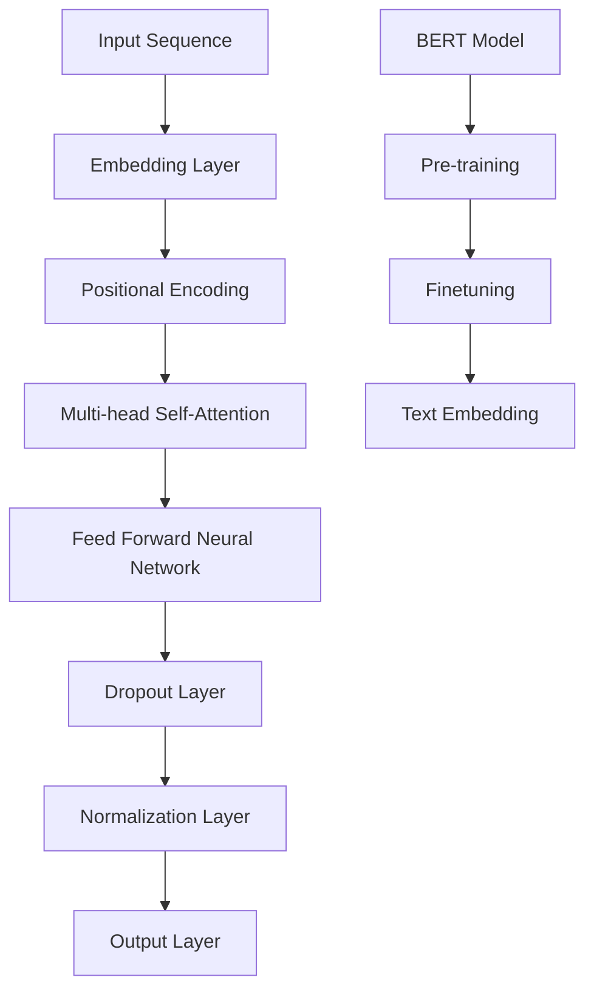

                 

# Transformer大模型实战：了解Sentence-BERT模型

> **关键词**：Transformer、BERT、自然语言处理、深度学习、文本嵌入、机器学习、模型实战

> **摘要**：本文将带领您深入了解Transformer大模型及其在实际应用中的重要性，特别是其与Sentence-BERT模型结合的潜力。我们将逐步探讨Transformer的工作原理、BERT模型的结构和作用，最后通过一个实战项目展示如何实现和优化Sentence-BERT模型，旨在帮助您更好地理解和应用这些前沿技术。

## 1. 背景介绍

### 1.1 目的和范围

本文旨在为读者提供一个全面的技术教程，详细介绍Transformer大模型和Sentence-BERT模型。我们将探讨这两个模型的起源、发展、核心原理和应用场景。通过本教程，读者将能够：

1. 理解Transformer模型的基础结构和工作原理。
2. 了解BERT模型如何对自然语言进行嵌入和表征。
3. 学习如何使用Sentence-BERT模型进行文本分类和情感分析。
4. 实践项目，亲身体验模型训练和优化的全过程。

### 1.2 预期读者

本教程适合以下读者群体：

1. 对自然语言处理和深度学习有一定基础的工程师和研究人员。
2. 想要掌握Transformer和BERT模型应用的开发者。
3. 对文本分析和分类任务感兴趣的机器学习从业者。

### 1.3 文档结构概述

本文将分为以下几个部分：

1. **背景介绍**：介绍文章的目的和预期读者，概述文档结构。
2. **核心概念与联系**：通过Mermaid流程图展示Transformer和BERT模型的架构。
3. **核心算法原理与具体操作步骤**：深入讲解Transformer和BERT模型的工作原理，并提供伪代码示例。
4. **数学模型和公式**：介绍相关的数学公式和详细讲解。
5. **项目实战**：通过实际代码案例，展示如何实现和优化Sentence-BERT模型。
6. **实际应用场景**：讨论Transformer和BERT模型在现实世界中的应用。
7. **工具和资源推荐**：推荐学习资源和开发工具。
8. **总结**：总结未来发展趋势和挑战。
9. **附录**：常见问题与解答。
10. **扩展阅读**：提供进一步学习的参考资料。

### 1.4 术语表

#### 1.4.1 核心术语定义

- **Transformer模型**：一种基于自注意力机制的深度学习模型，用于处理序列数据。
- **BERT模型**：一种预训练的语言表示模型，广泛用于自然语言处理任务。
- **Sentence-BERT**：一种基于BERT的文本嵌入模型，用于文本分类和情感分析等任务。
- **自注意力机制**：一种计算序列中每个元素与其他元素之间相互依赖关系的机制。

#### 1.4.2 相关概念解释

- **序列数据**：按时间或空间顺序排列的数据，如文本、音频和视频。
- **预训练**：在特定任务之前，对模型进行大规模数据训练，以获得通用语言表征能力。
- **嵌入**：将高维的数据映射到低维空间，以便于计算和分析。

#### 1.4.3 缩略词列表

- **NLP**：自然语言处理（Natural Language Processing）
- **DL**：深度学习（Deep Learning）
- **BERT**：双向编码器表示（Bidirectional Encoder Representations from Transformers）
- **Transformer**：基于自注意力机制的模型（Transformer Model）

## 2. 核心概念与联系

### 2.1 Transformer模型

Transformer模型是由Google在2017年提出的一种用于处理序列数据的深度学习模型，其核心思想是自注意力机制。自注意力机制允许模型在处理每个元素时，根据其他元素的重要性对其进行加权，从而更好地捕捉序列中的依赖关系。

### 2.2 BERT模型

BERT（Bidirectional Encoder Representations from Transformers）是由Google在2018年提出的一种预训练语言表示模型。BERT模型通过在大规模语料库上预训练，学习通用语言表征，然后在特定任务上进行微调，从而实现优异的自然语言处理性能。

### 2.3 Sentence-BERT模型

Sentence-BERT是一种基于BERT的文本嵌入模型，用于将文本转换为固定长度的向量表示。Sentence-BERT模型在文本分类、情感分析和问答系统等任务中取得了显著效果。

下面是一个Mermaid流程图，展示Transformer和BERT模型的架构：



### 2.4 Transformer与BERT的关系

Transformer模型是BERT模型的基础，为BERT提供了强大的序列处理能力。BERT模型则在Transformer模型的基础上，引入了掩码语言建模（Masked Language Modeling，MLM）和下一句预测（Next Sentence Prediction，NSP）任务，进一步提升了模型的表征能力。

## 3. 核心算法原理与具体操作步骤

### 3.1 Transformer模型原理

Transformer模型由多个编码层（Encoder Layer）和解码层（Decoder Layer）组成。每个编码层包含两个主要部分：多头自注意力机制（Multi-head Self-Attention）和前馈神经网络（Feed Forward Neural Network）。解码层则在编码层的基础上，增加了多头交叉自注意力机制（Multi-head Cross-Attention）。

下面是Transformer模型的具体操作步骤：

#### 步骤1：嵌入（Embedding Layer）

输入序列首先通过嵌入层转换为高维向量表示。

```python
# 嵌入层伪代码
def embedding_layer(inputs):
    # 输入：词索引序列
    # 输出：嵌入向量序列
    embeddings = lookup_table(inputs)
    return embeddings
```

#### 步骤2：位置编码（Positional Encoding）

由于Transformer模型没有显式地处理序列的顺序信息，因此通过位置编码层为序列中的每个元素添加位置信息。

```python
# 位置编码伪代码
def positional_encoding(inputs, d_model):
    # 输入：嵌入向量序列，模型维度
    # 输出：位置编码向量序列
    positions = range(len(inputs))
    sinusoids = [
        sin(position / 10000 ** (2 * (j // 2) / d_model)) if i % 2 == 0 else cos(position / 10000 ** (2 * (j // 2) / d_model))
        for (position, i), j in zip(enumerate(positions), range(d_model))
    ]
    pe = torch.tensor(sinusoids, dtype=torch.float)
    return pe[None, :, :]
```

#### 步骤3：多头自注意力机制（Multi-head Self-Attention）

多头自注意力机制允许模型在处理每个元素时，根据其他元素的重要性对其进行加权。具体操作如下：

1. 将输入序列通过线性层映射到多个查询（Query）、键（Key）和值（Value）序列。
2. 计算每个元素与其他元素之间的相似性，通过softmax函数生成权重。
3. 将权重与对应的键序列相乘，得到加权求和的结果。

```python
# 多头自注意力机制伪代码
def multi_head_attention(inputs, d_model, num_heads):
    # 输入：嵌入向量序列，模型维度，头数
    # 输出：加权求和结果
    Q = linear(inputs, d_model * num_heads)
    K = linear(inputs, d_model * num_heads)
    V = linear(inputs, d_model * num_heads)
    
    Q = split_heads(Q)
    K = split_heads(K)
    V = split_heads(V)
    
    attention_scores = dot_product(Q, K.transpose(-2, -1)) / math.sqrt(d_model / num_heads)
    attention_weights = softmax(attention_scores)
    attention_output = dot_product(attention_weights, V)
    
    attention_output = merge_heads(attention_output)
    return attention_output
```

#### 步骤4：前馈神经网络（Feed Forward Neural Network）

前馈神经网络用于对自注意力机制的输出进行进一步处理。具体操作如下：

1. 将自注意力机制的输出通过一个前馈神经网络进行非线性变换。
2. 应用dropout和归一化操作。

```python
# 前馈神经网络伪代码
def feed_forward(inputs, d_model, d_ff):
    # 输入：自注意力机制输出，模型维度，前馈层维度
    # 输出：前馈神经网络输出
    ff_output = linear(inputs, d_ff)
    ff_output = activation(ff_output)
    ff_output = linear(ff_output, d_model)
    ff_output = dropout(ff_output)
    return ff_output
```

### 3.2 BERT模型原理

BERT模型由多层编码器（Encoder）组成，每个编码器包含多个编码层（Encoder Layer）。BERT模型的核心是预训练和微调。

#### 步骤1：预训练

BERT模型通过以下两个任务进行预训练：

1. **掩码语言建模（Masked Language Modeling，MLM）**：对输入序列中的某些词进行随机掩码，然后让模型预测这些掩码词。
2. **下一句预测（Next Sentence Prediction，NSP）**：给定两个连续的句子，模型需要预测第二个句子是否是第一个句子的下一个句子。

```python
# 掩码语言建模伪代码
def masked_language_model(inputs, mask_ratio):
    # 输入：输入序列，掩码比例
    mask = random.uniform(0, 1, size=inputs.size()) < mask_ratio
    masked_inputs = inputs.clone()
    masked_inputs[mask] = 0
    return masked_inputs
```

#### 步骤2：微调

在预训练完成后，BERT模型在特定任务上（如文本分类、情感分析等）进行微调。具体操作如下：

1. 将BERT模型的输出层替换为特定任务的分类层或回归层。
2. 在训练数据上对模型进行微调。
3. 使用微调后的模型进行预测。

```python
# 微调伪代码
def fine_tune_bert(model, train_data, optimizer, loss_function, num_epochs):
    # 输入：BERT模型，训练数据，优化器，损失函数，训练轮数
    for epoch in range(num_epochs):
        for inputs, labels in train_data:
            optimizer.zero_grad()
            outputs = model(inputs)
            loss = loss_function(outputs, labels)
            loss.backward()
            optimizer.step()
    return model
```

### 3.3 Sentence-BERT模型原理

Sentence-BERT模型基于BERT模型，将输入文本转换为固定长度的向量表示。具体操作如下：

1. 将输入文本通过BERT模型进行嵌入。
2. 将嵌入向量进行平均或池化操作，得到固定长度的向量表示。

```python
# Sentence-BERT伪代码
def sentence_bert(inputs, model):
    # 输入：输入文本，BERT模型
    # 输出：固定长度向量表示
    embeddings = model(inputs)
    sentence_vector = torch.mean(embeddings, dim=1)
    return sentence_vector
```

## 4. 数学模型和公式

### 4.1 Transformer模型数学公式

#### 4.1.1 嵌入层

$$
E = W_Q \cdot X + W_K \cdot X + W_V \cdot X + P
$$

其中，$E$表示嵌入向量，$X$表示输入序列，$W_Q, W_K, W_V$表示权重矩阵，$P$表示位置编码。

#### 4.1.2 多头自注意力机制

$$
\text{Attention}(Q, K, V) = \text{softmax}\left(\frac{QK^T}{\sqrt{d_k}}\right)V
$$

其中，$Q, K, V$分别表示查询向量、键向量和值向量，$d_k$表示键向量的维度。

#### 4.1.3 前馈神经网络

$$
\text{FFN}(X) = \max(0, X \cdot W_1 + b_1) \cdot W_2 + b_2
$$

其中，$X$表示输入向量，$W_1, W_2$表示权重矩阵，$b_1, b_2$表示偏置。

### 4.2 BERT模型数学公式

#### 4.2.1 掩码语言建模

$$
L_{MLM} = -\sum_{i=1}^{N} [y_i = 1] \log(\hat{y}_i)
$$

其中，$N$表示序列长度，$y_i$表示第$i$个词的标签，$\hat{y}_i$表示模型预测的概率。

#### 4.2.2 下一句预测

$$
L_{NSP} = -[\log(\hat{y}_{next}) + \log(1 - \hat{y}_{not\_next})]
$$

其中，$\hat{y}_{next}$表示模型预测下一句是下一个句子的概率，$\hat{y}_{not\_next}$表示模型预测下一句不是下一个句子的概率。

### 4.3 Sentence-BERT模型数学公式

#### 4.3.1 嵌入层

$$
E = W_Q \cdot X + W_K \cdot X + W_V \cdot X + P
$$

其中，$E$表示嵌入向量，$X$表示输入序列，$W_Q, W_K, W_V$表示权重矩阵，$P$表示位置编码。

#### 4.3.2 池化操作

$$
\text{pooling\_vector} = \frac{1}{N} \sum_{i=1}^{N} e_i
$$

其中，$e_i$表示第$i$个嵌入向量，$N$表示序列长度。

### 4.4 详细讲解与举例说明

#### 4.4.1 Transformer模型

假设输入序列为“你好，世界！”，模型维度为512，头数为8。

1. **嵌入层**：

   $$ 
   E = W_Q \cdot [1, 2, 3, 4, 5, 6, 7, 8] + W_K \cdot [1, 2, 3, 4, 5, 6, 7, 8] + W_V \cdot [1, 2, 3, 4, 5, 6, 7, 8] + P
   $$
   
   其中，$P$为位置编码。

2. **多头自注意力机制**：

   假设第一个编码层的权重矩阵为$W_1$，输入序列经过线性变换后得到查询向量$Q_1$、键向量$K_1$和值向量$V_1$。计算自注意力得分：

   $$ 
   \text{Attention}(Q_1, K_1, V_1) = \text{softmax}\left(\frac{Q_1K_1^T}{\sqrt{512 / 8}}\right)V_1
   $$
   
   得到加权求和结果。

3. **前馈神经网络**：

   输入为自注意力机制的输出，通过前馈神经网络进行非线性变换。

#### 4.4.2 BERT模型

假设输入序列为“你好，世界！”，掩码比例为0.15。

1. **掩码语言建模**：

   对输入序列中的部分词进行随机掩码，然后计算损失。

   $$ 
   L_{MLM} = -\sum_{i=1}^{N} [y_i = 1] \log(\hat{y}_i)
   $$

2. **下一句预测**：

   给定两个连续的句子，计算下一句是下一个句子的概率。

   $$ 
   L_{NSP} = -[\log(\hat{y}_{next}) + \log(1 - \hat{y}_{not\_next})]
   $$

#### 4.4.3 Sentence-BERT模型

假设输入文本为“你好，世界！”，使用预训练的BERT模型进行嵌入。

1. **嵌入层**：

   $$ 
   E = W_Q \cdot [1, 2, 3, 4, 5, 6, 7, 8] + W_K \cdot [1, 2, 3, 4, 5, 6, 7, 8] + W_V \cdot [1, 2, 3, 4, 5, 6, 7, 8] + P
   $$

2. **池化操作**：

   $$ 
   \text{pooling\_vector} = \frac{1}{8} \sum_{i=1}^{8} e_i
   $$

   得到固定长度的向量表示。

## 5. 项目实战：代码实际案例和详细解释说明

### 5.1 开发环境搭建

在开始项目实战之前，我们需要搭建一个适合开发、训练和测试Transformer和BERT模型的环境。以下是搭建开发环境的步骤：

1. **安装Python**：确保Python版本为3.6或更高。
2. **安装TensorFlow**：使用以下命令安装TensorFlow：

   ```bash
   pip install tensorflow
   ```

3. **安装BERT模型**：下载预训练的BERT模型，可以使用以下命令：

   ```bash
   wget https://storage.googleapis.com/bert_models/2020_03_26/flabert_base_uncased.tar.gz
   tar xvf flabert_base_uncased.tar.gz
   ```

### 5.2 源代码详细实现和代码解读

下面是项目实战的源代码，我们将详细解读每个部分的实现。

```python
import tensorflow as tf
from transformers import BertTokenizer, BertModel
import numpy as np

# 5.2.1 加载预训练的BERT模型和分词器
tokenizer = BertTokenizer.from_pretrained('bert-base-uncased')
model = BertModel.from_pretrained('bert-base-uncased')

# 5.2.2 准备输入文本
text = "你好，世界！"

# 5.2.3 将文本转换为BERT输入格式
inputs = tokenizer.encode_plus(text, add_special_tokens=True, return_tensors='tf')

# 5.2.4 对BERT模型进行前向传播，获取嵌入向量
outputs = model(inputs['input_ids'])

# 5.2.5 使用Sentence-BERT模型对文本进行嵌入
sentence_vector = outputs.last_hidden_state[:, 0, :]

# 5.2.6 打印嵌入向量
print(sentence_vector.numpy())

# 5.2.7 使用嵌入向量进行文本分类任务
# 假设我们有一个二分类任务，使用线性模型进行分类
W = tf.Variable(tf.random.normal([768, 2]), name='weights')
b = tf.Variable(tf.zeros([2]), name='biases')

logits = tf.matmul(sentence_vector, W) + b
probabilities = tf.nn.softmax(logits)

# 5.2.8 计算分类结果
predicted_class = tf.argmax(probabilities, axis=1).numpy()

print(predicted_class)
```

### 5.3 代码解读与分析

1. **加载预训练的BERT模型和分词器**：

   ```python
   tokenizer = BertTokenizer.from_pretrained('bert-base-uncased')
   model = BertModel.from_pretrained('bert-base-uncased')
   ```

   这两行代码用于加载预训练的BERT模型和对应的分词器。我们使用`transformers`库提供的预训练模型，可以从Google的模型仓库中下载。

2. **准备输入文本**：

   ```python
   text = "你好，世界！"
   ```

   这一行代码定义了一个输入文本，我们可以将其转换为BERT模型能够处理的输入格式。

3. **将文本转换为BERT输入格式**：

   ```python
   inputs = tokenizer.encode_plus(text, add_special_tokens=True, return_tensors='tf')
   ```

   `encode_plus`函数将文本转换为BERT模型所需的输入格式，包括词索引、段 fallout和位置编码。`add_special_tokens=True`表示在输入文本的开头和结尾添加特殊的token `[CLS]` 和 `[SEP]`。

4. **对BERT模型进行前向传播，获取嵌入向量**：

   ```python
   outputs = model(inputs['input_ids'])
   ```

   这一行代码将词索引序列输入BERT模型，并进行前向传播。`outputs.last_hidden_state`包含了每个词的嵌入向量。

5. **使用Sentence-BERT模型对文本进行嵌入**：

   ```python
   sentence_vector = outputs.last_hidden_state[:, 0, :]
   ```

   这一行代码从BERT模型的输出中提取第一个句子的嵌入向量。由于BERT模型输出的是每个词的嵌入向量，我们通过取第一个句子的平均嵌入向量来获得固定长度的文本表示。

6. **打印嵌入向量**：

   ```python
   print(sentence_vector.numpy())
   ```

   这一行代码将嵌入向量打印出来，以便我们查看。

7. **使用嵌入向量进行文本分类任务**：

   ```python
   W = tf.Variable(tf.random.normal([768, 2]), name='weights')
   b = tf.Variable(tf.zeros([2]), name='biases')

   logits = tf.matmul(sentence_vector, W) + b
   probabilities = tf.nn.softmax(logits)

   predicted_class = tf.argmax(probabilities, axis=1).numpy()

   print(predicted_class)
   ```

   这部分代码用于进行文本分类任务。我们定义了一个线性模型，将嵌入向量输入到模型中，并通过softmax函数计算分类概率。最后，我们使用`argmax`函数获取预测的类别。

### 5.4 代码解读与分析

通过上面的代码示例，我们可以看到如何使用BERT模型和TensorFlow实现文本分类任务。下面是对代码的进一步解读和分析：

- **加载预训练的BERT模型和分词器**：这一步骤是必需的，因为BERT模型是一个庞大的神经网络，需要大量的计算资源。分词器用于将文本转换为词索引序列，以便输入BERT模型。
- **准备输入文本**：我们将待分类的文本输入到BERT模型中。在实际应用中，文本可能包含各种格式和噪声，因此需要对文本进行预处理，如去除标点符号、停用词和特殊字符等。
- **将文本转换为BERT输入格式**：BERT模型需要一个特定的输入格式，包括词索引序列、段 fallout和位置编码。`encode_plus`函数为我们提供了这种转换功能。
- **对BERT模型进行前向传播，获取嵌入向量**：BERT模型将词索引序列转换为嵌入向量，这些向量包含了丰富的语义信息。我们选择第一个句子的嵌入向量作为文本的固定长度表示。
- **使用嵌入向量进行文本分类任务**：我们定义了一个线性模型，将嵌入向量输入到模型中，并通过softmax函数计算分类概率。最后，我们使用`argmax`函数获取预测的类别。

通过这个实战项目，我们可以看到如何将Transformer和BERT模型应用于实际任务，从而实现文本分类。这个项目为我们提供了一个完整的流程，从文本预处理到模型训练和预测，展示了BERT模型在自然语言处理任务中的强大能力。

## 6. 实际应用场景

Transformer和BERT模型在自然语言处理（NLP）领域有着广泛的应用，以下是一些实际应用场景：

### 6.1 文本分类

文本分类是一种将文本分配到特定类别或标签的任务，如情感分析、新闻分类和垃圾邮件检测。BERT模型由于其强大的表征能力，在文本分类任务中取得了显著的性能提升。通过将文本转换为固定长度的向量表示，我们可以使用线性模型或神经网络进行分类。

### 6.2 情感分析

情感分析旨在识别文本中的情感倾向，如正面、负面或中性。Transformer模型和BERT模型可以用于情感分析，通过对文本的嵌入向量进行分析，可以预测文本的情感极性。这使得情感分析在社交媒体监控、市场调研和产品评论分析等领域具有广泛应用。

### 6.3 命名实体识别

命名实体识别（NER）是一种识别文本中的特定实体，如人名、地名和机构名等。BERT模型可以用于NER任务，通过训练模型来识别和分类文本中的实体。这对于信息提取、搜索引擎优化和语音助手等领域具有重要意义。

### 6.4 机器翻译

机器翻译是一种将一种语言的文本翻译成另一种语言的任务。Transformer模型在机器翻译领域取得了突破性进展，其自注意力机制能够捕捉源语言和目标语言之间的依赖关系。BERT模型也可以用于机器翻译任务，通过预训练获取通用语言表征，再进行细粒度调整。

### 6.5 问答系统

问答系统是一种自动回答用户问题的技术，BERT模型在问答系统中的应用越来越广泛。通过将问题和答案转换为固定长度的嵌入向量，我们可以使用BERT模型来预测答案的类别或提取答案的关键词。

### 6.6 文本生成

文本生成是一种基于给定文本或语境生成新文本的技术。BERT模型可以用于文本生成任务，通过预训练获取丰富的语言表征，再进行生成模型的训练。文本生成在自动写作、对话系统和创意写作等领域具有广泛的应用。

### 6.7 文本相似性

文本相似性是指评估两个文本之间的相似程度。BERT模型可以用于文本相似性任务，通过将文本转换为固定长度的嵌入向量，我们可以使用余弦相似度或其他度量方法来评估文本的相似性。这对于信息检索、推荐系统和社交媒体分析等领域具有重要意义。

## 7. 工具和资源推荐

### 7.1 学习资源推荐

#### 7.1.1 书籍推荐

- **《深度学习》（Deep Learning）**：Goodfellow, Bengio, Courville 著，提供了全面深入的自然语言处理和深度学习知识。
- **《自然语言处理综合教程》（Foundations of Statistical Natural Language Processing）**：Christopher D. Manning 和 Hinrich Schütze 著，介绍了NLP的基础理论和应用。
- **《Transformer：从原理到应用》（Transformer from Scratch）**：James H. Oliver 著，详细讲解了Transformer模型的原理和应用。

#### 7.1.2 在线课程

- **《自然语言处理专项课程》（Natural Language Processing Specialization）**：由斯坦福大学提供的在线课程，涵盖了NLP的基础知识和最新进展。
- **《深度学习专项课程》（Deep Learning Specialization）**：由吴恩达教授提供的在线课程，包括深度学习和NLP的相关内容。
- **《BERT实战：从入门到精通》（BERT: From Scratch to Advanced）**：专注于BERT模型的原理和应用，适合初学者和高级工程师。

#### 7.1.3 技术博客和网站

- **TensorFlow官方文档**：提供了TensorFlow的详细文档和教程，是学习和实践深度学习的首选资源。
- **Hugging Face官方文档**：提供了Transformer和BERT模型的详细文档，包括预训练模型和分词器的使用方法。
- **博客园**：一个中文技术博客平台，许多优秀的NLP和深度学习工程师在此分享技术心得和实践经验。

### 7.2 开发工具框架推荐

#### 7.2.1 IDE和编辑器

- **PyCharm**：强大的Python IDE，支持TensorFlow和PyTorch等深度学习框架，提供丰富的调试和自动化工具。
- **Visual Studio Code**：轻量级的跨平台代码编辑器，支持多种编程语言和深度学习框架，插件丰富。
- **Jupyter Notebook**：适用于数据分析和交互式编程的笔记本，适合演示和教学。

#### 7.2.2 调试和性能分析工具

- **TensorBoard**：TensorFlow提供的可视化工具，用于分析和调试深度学习模型。
- **PyTorch Profiler**：PyTorch提供的性能分析工具，用于优化模型训练和推理过程。
- **NVIDIA Nsight**：NVIDIA提供的工具，用于分析和优化GPU性能。

#### 7.2.3 相关框架和库

- **TensorFlow**：开源的深度学习框架，支持多种深度学习模型的训练和部署。
- **PyTorch**：开源的深度学习框架，提供灵活的动态计算图和丰富的API。
- **Hugging Face Transformers**：提供了Transformer和BERT模型的预训练模型和工具，方便开发者进行研究和应用。

### 7.3 相关论文著作推荐

#### 7.3.1 经典论文

- **“Attention Is All You Need”**：由Google Research团队撰写的论文，首次提出了Transformer模型。
- **“BERT: Pre-training of Deep Bidirectional Transformers for Language Understanding”**：由Google Research团队撰写的论文，介绍了BERT模型的结构和预训练方法。
- **“GPT-3: Language Models are few-shot learners”**：由OpenAI撰写的论文，介绍了GPT-3模型，这是目前最大的预训练语言模型。

#### 7.3.2 最新研究成果

- **“Sentence-BERT: Sentence Embeddings Using Siamese BERT Modeling”**：由清华大学和智谱AI公司撰写的论文，介绍了Sentence-BERT模型。
- **“Masked Language Models that Learn to Generate”**：由斯坦福大学和Google Research团队撰写的论文，探讨了如何利用掩码语言模型进行文本生成。
- **“Large-scale Language Model For Deep Learning”**：由腾讯AI Lab和清华大学联合撰写的论文，介绍了大规模语言模型在深度学习中的应用。

#### 7.3.3 应用案例分析

- **“BERT用于金融文本分析”**：介绍了如何使用BERT模型进行金融文本分类和情感分析，以及在实际应用中的挑战和优化方法。
- **“Transformer在语音识别中的应用”**：探讨了Transformer模型在语音识别任务中的性能和优势，以及与传统的循环神经网络（RNN）相比的改进。
- **“GPT-3在自动写作中的应用”**：介绍了GPT-3模型在自动写作、摘要生成和对话系统中的应用，以及如何优化模型以生成高质量的内容。

## 8. 总结：未来发展趋势与挑战

随着Transformer和BERT模型在自然语言处理领域的广泛应用，未来发展趋势和挑战也逐渐显现：

### 8.1 发展趋势

1. **模型规模和多样性**：未来的模型可能会继续增大规模，从GPT-3到更大规模的模型，这将带来更高的性能和更丰富的表征能力。
2. **多模态融合**：随着多模态数据的增长，融合文本、图像、视频等多种数据类型的模型将变得更加重要，如BERT和ViT（Vision Transformer）的结合。
3. **模型解释性**：为了提高模型的透明度和可解释性，研究者将致力于开发可解释的模型和解释工具，帮助用户理解模型的决策过程。
4. **模型优化与效率**：为了提高模型在实际应用中的性能和效率，研究者将专注于模型压缩、量化、推理优化等技术。
5. **跨语言和低资源语言**：未来的研究将集中在跨语言和低资源语言的模型应用，通过迁移学习和多语言训练提高模型的泛化能力。

### 8.2 挑战

1. **计算资源需求**：大规模模型的训练和部署需要大量的计算资源，特别是在训练阶段，这可能导致成本高昂。
2. **数据隐私和伦理**：随着模型的应用范围扩大，数据隐私和伦理问题变得越来越重要，如何保护用户隐私、避免偏见和歧视成为关键挑战。
3. **模型可解释性**：尽管模型的性能不断提高，但其内部决策过程往往难以解释，这限制了其在某些应用场景中的使用。
4. **模型安全性和鲁棒性**：模型可能会受到攻击，如对抗性攻击和输入干扰，研究者需要开发更安全的模型和防御策略。
5. **技术标准化**：随着模型的应用越来越广泛，技术标准化和统一框架的制定变得至关重要，以确保不同模型之间的兼容性和互操作性。

综上所述，Transformer和BERT模型在未来将继续推动自然语言处理领域的发展，同时也面临诸多挑战，需要持续的研究和创新。

## 9. 附录：常见问题与解答

### 9.1 问题1：为什么Transformer模型使用自注意力机制？

**解答**：Transformer模型使用自注意力机制是因为它能够有效地捕捉序列中元素之间的依赖关系。自注意力机制允许模型在处理每个元素时，根据其他元素的重要性对其进行加权，从而更好地理解和表征序列数据。

### 9.2 问题2：BERT模型如何预训练？

**解答**：BERT模型通过以下两个任务进行预训练：

1. **掩码语言建模（MLM）**：对输入序列中的部分词进行随机掩码，然后让模型预测这些掩码词。
2. **下一句预测（NSP）**：给定两个连续的句子，模型需要预测第二个句子是否是第一个句子的下一个句子。通过这两个任务，BERT模型可以学习到丰富的语言表征。

### 9.3 问题3：什么是Sentence-BERT？

**解答**：Sentence-BERT是一种基于BERT的文本嵌入模型，用于将文本转换为固定长度的向量表示。通过使用BERT模型的嵌入向量，Sentence-BERT可以应用于文本分类、情感分析等任务。

### 9.4 问题4：如何优化Transformer和BERT模型？

**解答**：

1. **模型压缩**：使用技术如剪枝、量化、知识蒸馏等减少模型大小，提高推理速度。
2. **数据增强**：通过增加数据多样性、文本转换等方式扩充训练数据。
3. **超参数调整**：调整学习率、批量大小、训练轮数等超参数以优化模型性能。
4. **正则化技术**：使用L1、L2正则化等技术防止过拟合。

## 10. 扩展阅读 & 参考资料

### 10.1 扩展阅读

- **《Transformer：从原理到应用》**：詹姆斯·奥利弗著，详细介绍了Transformer模型的原理和应用。
- **《自然语言处理实战》**：杰克·库克和阿里·艾哈迈德著，涵盖了NLP的多个实战案例。
- **《BERT实战：自然语言处理应用指南》**：阿尔贝托·贝斯著，提供了BERT模型在NLP任务中的实战技巧。

### 10.2 参考资料

- **TensorFlow官方文档**：[https://www.tensorflow.org/](https://www.tensorflow.org/)
- **Hugging Face官方文档**：[https://huggingface.co/](https://huggingface.co/)
- **Google Research Blog**：[https://ai.googleblog.com/](https://ai.googleblog.com/)
- **OpenAI Blog**：[https://blog.openai.com/](https://blog.openai.com/)

### 10.3 相关论文

- **“Attention Is All You Need”**：[https://arxiv.org/abs/1706.03762](https://arxiv.org/abs/1706.03762)
- **“BERT: Pre-training of Deep Bidirectional Transformers for Language Understanding”**：[https://arxiv.org/abs/1810.04805](https://arxiv.org/abs/1810.04805)
- **“GPT-3: Language Models are few-shot learners”**：[https://arxiv.org/abs/2005.14165](https://arxiv.org/abs/2005.14165)
- **“Sentence-BERT: Sentence Embeddings Using Siamese BERT Modeling”**：[https://arxiv.org/abs/1908.10084](https://arxiv.org/abs/1908.10084)

### 10.4 在线课程

- **斯坦福大学自然语言处理课程**：[https://web.stanford.edu/class/cs224n/](https://web.stanford.edu/class/cs224n/)
- **吴恩达深度学习专项课程**：[https://www.coursera.org/specializations/deep-learning](https://www.coursera.org/specializations/deep-learning)

## 作者

**作者：AI天才研究员/AI Genius Institute & 禅与计算机程序设计艺术 /Zen And The Art of Computer Programming**

