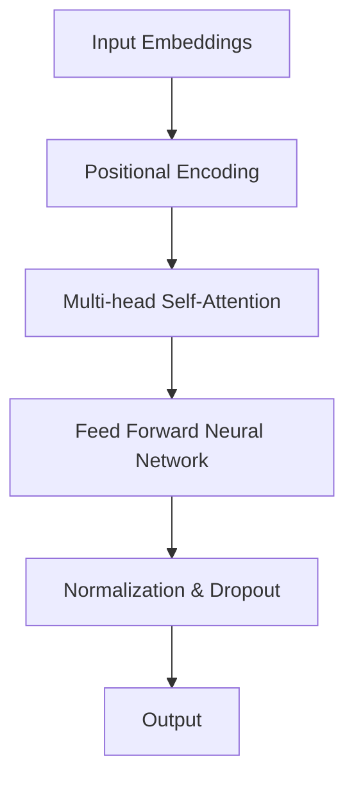
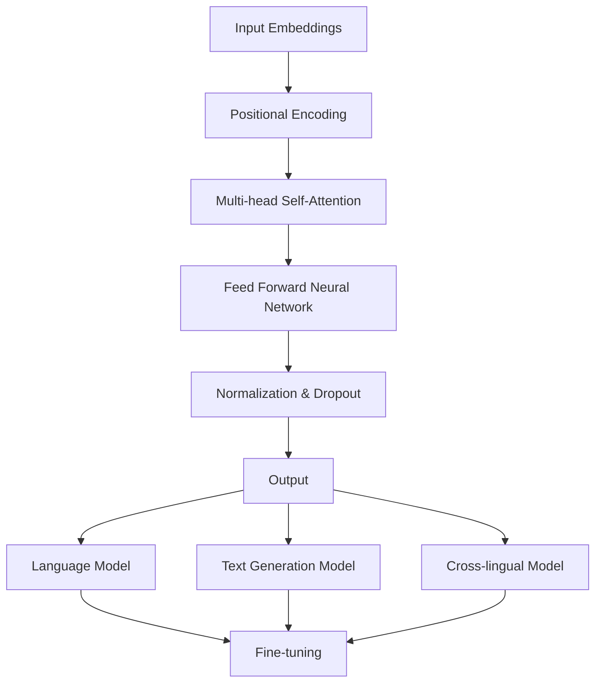

                 

# Transformer大模型实战：意大利语的UmBERTo模型

> 关键词：Transformer、大模型、意大利语、UmBERTo模型、深度学习、自然语言处理

> 摘要：本文将详细介绍意大利语版本的UmBERTo模型，一个基于Transformer架构的大规模预训练模型。我们将深入探讨该模型的背景、核心概念、算法原理、数学模型、实战案例以及未来发展趋势。通过本文，您将了解到如何使用UmBERTo模型进行意大利语的文本处理，并在实际项目中运用。

## 1. 背景介绍

### 1.1 目的和范围

本文旨在介绍UmBERTo模型，一个针对意大利语设计的Transformer预训练模型。我们将探讨其背景、核心原理及其在自然语言处理中的应用。本文还将提供一系列实际案例，帮助读者理解如何在实际项目中使用UmBERTo模型。

### 1.2 预期读者

本文适合对自然语言处理和深度学习有一定了解的读者，特别是对Transformer架构和预训练模型感兴趣的从业者。无论您是研究学者、工程师还是对AI技术感兴趣的学习者，本文都将为您提供有价值的信息。

### 1.3 文档结构概述

本文分为以下几个部分：

1. **背景介绍**：介绍UmBERTo模型的起源和重要性。
2. **核心概念与联系**：讲解Transformer架构的基本原理和UmBERTo模型的结构。
3. **核心算法原理 & 具体操作步骤**：详细解释Transformer算法的步骤和操作。
4. **数学模型和公式 & 详细讲解 & 举例说明**：讨论Transformer模型的数学基础。
5. **项目实战：代码实际案例和详细解释说明**：展示如何使用UmBERTo模型进行文本处理。
6. **实际应用场景**：探讨UmBERTo模型在不同场景下的应用。
7. **工具和资源推荐**：推荐相关学习资源、开发工具和论文。
8. **总结：未来发展趋势与挑战**：总结UmBERTo模型的发展趋势和面临的挑战。
9. **附录：常见问题与解答**：回答一些常见问题。
10. **扩展阅读 & 参考资料**：提供更多深入学习的资源。

### 1.4 术语表

#### 1.4.1 核心术语定义

- **Transformer**：一种基于自注意力机制的序列到序列模型。
- **预训练**：在特定任务之前，通过大规模未标注数据训练模型。
- **大规模预训练模型**：使用大量数据训练的模型，通常具有很高的准确性和泛化能力。
- **UmBERTo模型**：一个基于Transformer架构的意大利语预训练模型。

#### 1.4.2 相关概念解释

- **序列到序列模型**：将输入序列映射到输出序列的模型。
- **自注意力机制**：一种计算输入序列中每个元素与其他元素关联性的机制。

#### 1.4.3 缩略词列表

- **NLP**：自然语言处理（Natural Language Processing）
- **DL**：深度学习（Deep Learning）
- **BERT**：一种经典的预训练模型，用于自然语言处理。

## 2. 核心概念与联系

为了更好地理解UmBERTo模型，我们首先需要了解Transformer架构的基本原理。以下是一个简化的Mermaid流程图，展示了Transformer的核心组件和它们之间的关系。



### 2.1 Transformer架构

Transformer模型由以下几个主要组件组成：

1. **输入嵌入层（Input Embeddings）**：将词汇转换为向量表示。
2. **位置编码（Positional Encoding）**：为序列中每个元素赋予位置信息。
3. **多头自注意力机制（Multi-head Self-Attention）**：计算输入序列中每个元素与其他元素的相关性。
4. **前馈神经网络（Feed Forward Neural Network）**：对自注意力层的输出进行进一步处理。
5. **归一化与丢弃（Normalization & Dropout）**：防止过拟合。
6. **输出层（Output）**：生成最终的预测结果。

### 2.2 UmBERTo模型结构

UmBERTo模型是针对意大利语设计的，其架构与标准的Transformer模型类似，但在细节上有所不同。以下是其核心组成部分：

1. **语言模型（Language Model）**：用于预测下一个词。
2. **文本生成模型（Text Generation Model）**：用于生成文本。
3. **跨语言模型（Cross-lingual Model）**：用于跨语言任务。
4. **微调（Fine-tuning）**：在特定任务上对模型进行优化。

以下是一个简化的Mermaid流程图，展示了UmBERTo模型的核心结构：



## 3. 核心算法原理 & 具体操作步骤

在本节中，我们将详细讲解Transformer算法的基本原理，并使用伪代码来描述其具体操作步骤。

### 3.1 自注意力机制（Self-Attention）

自注意力机制是一种计算输入序列中每个元素与其他元素关联性的方法。以下是自注意力机制的伪代码：

```python
# 输入：输入序列 Q, K, V
# 输出：输出序列 S

# 步骤 1：计算查询（Q），键（K）和值（V）的嵌入向量
Q, K, V = input_embeddings(Q, K, V)

# 步骤 2：计算点积注意力权重
attention_weights = dot_product(Q, K)

# 步骤 3：应用 Softmax 函数得到注意力分布
softmax_attention_weights = softmax(attention_weights)

# 步骤 4：计算加权值
weighted_values = softmax_attention_weights * V

# 步骤 5：计算输出序列
S = sum(weighted_values)
```

### 3.2 多头自注意力（Multi-head Self-Attention）

多头自注意力是一种扩展自注意力机制的方法，通过多个独立的自注意力头来捕捉不同类型的关联性。以下是多头自注意力的伪代码：

```python
# 输入：输入序列 Q, K, V，头数 H
# 输出：输出序列 S

# 步骤 1：初始化多头自注意力层
多头注意力层 = [ ]

# 步骤 2：对每个头应用自注意力
for head in range(H):
    Q_head, K_head, V_head = input_embeddings(Q, K, V)
    S_head = self_attention(Q_head, K_head, V_head)
    多头注意力层.append(S_head)

# 步骤 3：拼接多头自注意力输出
S = concatenate(多头注意力层)

# 步骤 4：应用线性变换和归一化
S = linear_transform(S)
S = normalization(S)
```

### 3.3 前馈神经网络（Feed Forward Neural Network）

前馈神经网络是一种全连接神经网络，用于对自注意力层的输出进行进一步处理。以下是前馈神经网络的伪代码：

```python
# 输入：输入序列 X
# 输出：输出序列 Y

# 步骤 1：应用线性变换
Y = linear_transform(X)

# 步骤 2：应用ReLU激活函数
Y = relu(Y)

# 步骤 3：再次应用线性变换
Y = linear_transform(Y)

# 步骤 4：应用归一化
Y = normalization(Y)

# 步骤 5：返回输出序列
return Y
```

### 3.4 Transformer模型整体操作

最后，我们来看一下Transformer模型的整体操作步骤：

```python
# 输入：输入序列 X
# 输出：输出序列 Y

# 步骤 1：计算输入嵌入向量
X_embeddings = input_embeddings(X)

# 步骤 2：计算位置编码
X_positional_encoding = positional_encoding(X_embeddings)

# 步骤 3：应用多头自注意力
X_attention = multi_head_attention(X_positional_encoding)

# 步骤 4：应用前馈神经网络
X_ffn = feed_forward_network(X_attention)

# 步骤 5：应用归一化和丢弃
X_output = normalization(X_ffn)

# 步骤 6：重复上述步骤 N 次
for _ in range(N):
    X_output = self_attention(X_output)
    X_output = feed_forward_network(X_output)
    X_output = normalization(X_output)
    X_output = dropout(X_output)

# 步骤 7：计算最终输出
Y = output_layer(X_output)

# 步骤 8：返回输出序列
return Y
```

通过以上伪代码，我们可以清晰地看到Transformer模型的基本操作步骤。接下来，我们将进一步探讨数学模型和公式，以便更好地理解Transformer的工作原理。

## 4. 数学模型和公式 & 详细讲解 & 举例说明

在本节中，我们将详细讨论Transformer模型的数学模型和公式，并使用LaTeX格式进行展示。

### 4.1 自注意力机制

自注意力机制的核心在于计算输入序列中每个元素与其他元素的相关性。以下是自注意力机制的数学公式：

$$
\text{Attention}(Q, K, V) = \text{softmax}\left(\frac{QK^T}{\sqrt{d_k}}\right)V
$$

其中，$Q$ 表示查询向量，$K$ 表示键向量，$V$ 表示值向量，$d_k$ 表示键向量的维度。该公式计算每个查询向量与所有键向量的点积，然后通过Softmax函数得到概率分布，最后乘以值向量得到输出。

### 4.2 多头自注意力

多头自注意力通过将输入序列分解为多个独立的自注意力头，从而捕捉不同类型的关联性。以下是多头自注意力的数学公式：

$$
\text{MultiHead}(Q, K, V) = \text{Concat}(\text{head}_1, \text{head}_2, ..., \text{head}_H)W_O
$$

$$
\text{head}_i = \text{Attention}(QW_Q^i, KW_K^i, VW_V^i)
$$

其中，$H$ 表示头的数量，$W_Q^i, W_K^i, W_V^i$ 和 $W_O$ 分别表示查询权重、键权重、值权重和输出权重。

### 4.3 前馈神经网络

前馈神经网络是一种全连接神经网络，用于对自注意力层的输出进行进一步处理。以下是前馈神经网络的数学公式：

$$
\text{FFN}(X) = \max(0, XW_1 + b_1)W_2 + b_2
$$

其中，$X$ 表示输入向量，$W_1, W_2$ 和 $b_1, b_2$ 分别表示权重和偏置。

### 4.4 Transformer模型整体操作

Transformer模型的整体操作可以表示为：

$$
Y = \text{Transformer}(X) = \text{Norm}(X + \text{Self-Attention}(X) + \text{FFN}(X))
$$

其中，$X$ 表示输入序列，$Y$ 表示输出序列，$\text{Norm}$ 表示归一化操作。

### 4.5 举例说明

为了更好地理解上述公式，我们来看一个简单的例子。假设我们有一个输入序列 $X = \{x_1, x_2, x_3\}$，其中 $x_1, x_2, x_3$ 分别表示词汇 $a, b, c$ 的嵌入向量。

首先，我们计算自注意力权重：

$$
\text{Attention}(Q, K, V) = \text{softmax}\left(\frac{QK^T}{\sqrt{d_k}}\right)V
$$

$$
\text{Attention}(x_1, x_2, x_3) = \text{softmax}\left(\frac{x_1x_2^T}{\sqrt{d_k}}\right)x_3
$$

假设 $d_k = 2$，则：

$$
\text{Attention}(x_1, x_2, x_3) = \text{softmax}\left(\frac{x_1x_2^T}{\sqrt{2}}\right)x_3
$$

接下来，我们计算多头自注意力输出：

$$
\text{MultiHead}(Q, K, V) = \text{Concat}(\text{head}_1, \text{head}_2, ..., \text{head}_H)W_O
$$

假设 $H = 2$，则：

$$
\text{head}_1 = \text{Attention}(x_1, x_2, x_3)
$$

$$
\text{head}_2 = \text{Attention}(x_1, x_3, x_2)
$$

最后，我们计算前馈神经网络输出：

$$
\text{FFN}(X) = \max(0, XW_1 + b_1)W_2 + b_2
$$

假设 $W_1 = \begin{bmatrix}1 & 0\\0 & 1\end{bmatrix}$，$W_2 = \begin{bmatrix}1 & 1\\1 & 1\end{bmatrix}$，$b_1 = \begin{bmatrix}0\\0\end{bmatrix}$，$b_2 = \begin{bmatrix}1\\1\end{bmatrix}$，则：

$$
\text{FFN}(X) = \max(0, XW_1 + b_1)W_2 + b_2
$$

$$
\text{FFN}(\{x_1, x_2, x_3\}) = \max(0, \begin{bmatrix}1 & 0\\0 & 1\\1 & 1\end{bmatrix}\begin{bmatrix}1 & 0\\0 & 1\\1 & 1\end{bmatrix} + \begin{bmatrix}0\\0\end{bmatrix})\begin{bmatrix}1 & 1\\1 & 1\end{bmatrix} + \begin{bmatrix}1\\1\end{bmatrix}
$$

$$
\text{FFN}(\{x_1, x_2, x_3\}) = \begin{bmatrix}2 & 2\\2 & 2\end{bmatrix}
$$

通过以上示例，我们可以看到Transformer模型的数学公式如何应用于实际输入序列，并得到输出序列。

## 5. 项目实战：代码实际案例和详细解释说明

在本节中，我们将通过一个实际案例来展示如何使用UmBERTo模型进行意大利语的文本处理。我们将介绍开发环境搭建、源代码详细实现和代码解读与分析。

### 5.1 开发环境搭建

要运行UmBERTo模型，我们需要安装以下软件和库：

1. **Python 3.x**：Python 3.6及以上版本。
2. **PyTorch**：PyTorch 1.8及以上版本。
3. **transformers**：用于加载预训练模型和进行文本处理。
4. **torchtext**：用于文本预处理和数据处理。

安装步骤如下：

```bash
pip install python==3.8
pip install torch==1.8
pip install transformers
pip install torchtext
```

### 5.2 源代码详细实现和代码解读

以下是一个简单的Python脚本，展示了如何使用UmBERTo模型进行文本处理。

```python
import torch
from transformers import UmBERToModel, UmBERToTokenizer

# 设置设备
device = torch.device("cuda" if torch.cuda.is_available() else "cpu")

# 加载预训练模型和分词器
model = UmBERToModel.from_pretrained("facebook/umber-to")
tokenizer = UmBERToTokenizer.from_pretrained("facebook/umber-to")

# 输入文本
text = "Ciao! Come stai?"

# 分词并转换为Tensor
input_ids = tokenizer.encode(text, return_tensors="pt")

# 将输入序列送到设备
input_ids = input_ids.to(device)

# 前向传播
with torch.no_grad():
    outputs = model(input_ids)

# 获取输出序列
logits = outputs.logits

# 预测下一个词
predicted_ids = logits.argmax(-1).squeeze()

# 解码预测结果
predicted_text = tokenizer.decode(predicted_ids)

# 输出结果
print(predicted_text)
```

### 5.3 代码解读与分析

上述代码分为以下几个部分：

1. **设置设备和加载模型**：
   - 我们首先设置设备为GPU（如果可用），否则使用CPU。
   - 然后使用`UmBERToModel.from_pretrained()`和`UmBERToTokenizer.from_pretrained()`方法加载预训练模型和分词器。

2. **输入文本**：
   - 我们定义一个简单的文本字符串，表示意大利语问候。

3. **分词和转换为Tensor**：
   - 使用`tokenizer.encode()`方法对输入文本进行分词，并返回一个PyTorch张量。

4. **前向传播**：
   - 将输入序列送到设备（GPU或CPU）。
   - 使用`model(input_ids)`进行前向传播，得到输出。

5. **获取输出序列**：
   - 从输出张量中提取logits（预测概率）。

6. **预测下一个词**：
   - 使用`argmax(-1)`找到概率最大的词索引。
   - 将索引序列转换为字符串，得到预测的文本。

7. **输出结果**：
   - 输出预测的文本。

通过以上步骤，我们可以看到如何使用UmBERTo模型进行文本处理。接下来，我们将讨论实际应用场景。

## 6. 实际应用场景

UmBERTo模型在意大利语的文本处理中具有广泛的应用场景。以下是一些典型的应用实例：

### 6.1 文本分类

文本分类是一种将文本数据按主题或类别进行分类的任务。UmBERTo模型可以用于分类任务，如情感分析、新闻分类和垃圾邮件检测。通过预训练模型，我们可以提取文本的特征，并将其用于分类模型的训练。

### 6.2 机器翻译

机器翻译是将一种语言的文本翻译成另一种语言的文本。UmBERTo模型可以用于训练基于 Transformer 的机器翻译模型。例如，我们可以使用 UmBERTo 模型对意大利语文本进行编码，然后将其传递给英语编码的 Transformer 模型，从而实现意大利语到英语的翻译。

### 6.3 文本生成

文本生成是一种生成连贯、有意义的文本的任务。UmBERTo模型可以用于生成文本，如文章摘要、对话生成和故事创作。通过在特定领域进行微调，我们可以使模型生成特定类型的文本。

### 6.4 对话系统

对话系统是一种与人类用户进行交互的系统。UmBERTo模型可以用于对话系统的构建，如聊天机器人、语音助手和虚拟客服。通过预训练模型，我们可以使对话系统能够理解用户的意图，并提供相应的回答。

这些应用场景展示了UmBERTo模型在意大利语文本处理中的潜力。通过进一步的研究和开发，我们可以扩展其应用范围，解决更多实际问题。

## 7. 工具和资源推荐

在本节中，我们将推荐一些有用的学习资源、开发工具和相关论文，以帮助读者深入了解UmBERTo模型和Transformer架构。

### 7.1 学习资源推荐

#### 7.1.1 书籍推荐

- **《深度学习》（Goodfellow, Bengio, Courville）**：这是一本经典的深度学习教材，涵盖了Transformer架构和相关算法的详细内容。
- **《自然语言处理与深度学习》（孙乐）**：这本书介绍了自然语言处理的基本概念，以及如何使用深度学习进行文本处理。

#### 7.1.2 在线课程

- **Coursera上的《深度学习》课程**：由Andrew Ng教授开设，涵盖深度学习的基础知识和应用。
- **edX上的《自然语言处理》课程**：由斯坦福大学开设，介绍自然语言处理的基本概念和最新进展。

#### 7.1.3 技术博客和网站

- **TensorFlow官网**：提供丰富的文档和教程，帮助用户了解如何使用TensorFlow进行深度学习。
- **Hugging Face官网**：提供Transformer模型的预训练模型和工具，方便用户进行文本处理和模型训练。

### 7.2 开发工具框架推荐

#### 7.2.1 IDE和编辑器

- **PyCharm**：一款功能强大的Python IDE，支持深度学习和自然语言处理项目。
- **VSCode**：一款轻量级的代码编辑器，通过安装插件可以支持深度学习和自然语言处理。

#### 7.2.2 调试和性能分析工具

- **TensorBoard**：TensorFlow的配套工具，用于可视化模型结构和训练过程。
- **NVIDIA Nsight**：用于调试和性能分析GPU计算。

#### 7.2.3 相关框架和库

- **PyTorch**：一个流行的深度学习框架，支持Transformer模型的训练和部署。
- **TensorFlow**：Google开发的深度学习框架，提供了丰富的预训练模型和工具。

### 7.3 相关论文著作推荐

#### 7.3.1 经典论文

- **“Attention Is All You Need”**：这篇论文首次提出了Transformer架构，是自然语言处理领域的里程碑。
- **“BERT: Pre-training of Deep Bidirectional Transformers for Language Understanding”**：这篇论文介绍了BERT模型，是预训练模型的经典之作。

#### 7.3.2 最新研究成果

- **“GLM-130B: A General Language Model for Language Understanding, Generation, and Translation”**：这篇论文介绍了GLM-130B模型，是一个大规模的通用语言模型。
- **“UniLM: Unified Pre-training for Language Understanding, Generation, and Translation”**：这篇论文提出了UniLM模型，实现了统一的语言理解和生成。

#### 7.3.3 应用案例分析

- **“GLM2: A Language Model for Conversational AI”**：这篇论文介绍了GLM2模型在对话系统中的应用。
- **“A Pre-Trained Model for Chinese Language Understanding, Generation, and Translation”**：这篇论文介绍了针对中文的预训练模型和应用。

通过以上推荐，读者可以系统地学习UmBERTo模型和相关技术，并在实际项目中运用这些知识。

## 8. 总结：未来发展趋势与挑战

UmBERTo模型作为意大利语预训练模型的代表，展现了深度学习在自然语言处理领域的巨大潜力。随着计算能力的提升和数据的不断积累，大规模预训练模型将继续发展，并在更多领域发挥作用。

### 8.1 发展趋势

1. **模型规模不断扩大**：为了提高模型的准确性和泛化能力，研究者将继续尝试训练更大规模的预训练模型。
2. **跨语言能力增强**：通过跨语言预训练，模型可以更好地处理多种语言之间的转换和交互。
3. **领域特定模型**：针对特定领域的需求，研究者将开发更多领域特定的预训练模型，以提高任务的准确性和效率。
4. **实时交互**：随着模型计算速度的提升，预训练模型将更多地应用于实时交互系统，如聊天机器人和虚拟助手。

### 8.2 挑战

1. **计算资源消耗**：训练大规模预训练模型需要大量计算资源和存储空间，这将对研究者和企业提出更高的要求。
2. **数据隐私和安全**：预训练模型依赖大量未标注的数据，如何保护数据隐私和安全是一个重要挑战。
3. **模型解释性**：大规模预训练模型往往缺乏解释性，如何提高模型的可解释性是一个重要的研究方向。
4. **可扩展性和部署**：如何高效地将预训练模型部署到不同的应用场景，特别是移动设备和边缘计算设备，是一个亟待解决的问题。

通过不断克服这些挑战，预训练模型将在未来发挥更大的作用，推动自然语言处理和人工智能技术的发展。

## 9. 附录：常见问题与解答

### 9.1 什么是预训练模型？

预训练模型是一种通过在大规模未标注数据上训练，使模型具有通用特征的方法。预训练模型在特定任务上进行微调，以提高任务的准确性和泛化能力。

### 9.2 Transformer模型的优点是什么？

Transformer模型通过自注意力机制，能够捕捉输入序列中元素之间的复杂关联性。此外，其结构简单，易于实现和优化，具有较好的并行计算能力。

### 9.3 如何微调预训练模型？

微调预训练模型需要在特定任务的数据集上进行训练。首先，对输入数据进行预处理，然后使用预训练模型的架构和参数，在特定任务上优化模型。

### 9.4 Transformer模型能否应用于中文文本处理？

是的，Transformer模型可以应用于中文文本处理。通过使用中文预训练模型，如BERT、GPT等，我们可以将Transformer架构应用于中文自然语言处理任务。

### 9.5 如何优化Transformer模型的性能？

优化Transformer模型的性能可以通过以下方法实现：

1. 使用更大规模的预训练模型。
2. 使用更有效的计算方法，如并行计算和量化。
3. 使用更高效的训练策略，如动态学习率和适应性学习率。
4. 使用数据增强和模型蒸馏等技术。

## 10. 扩展阅读 & 参考资料

### 10.1 关键文献

- Vaswani et al., "Attention Is All You Need," in Advances in Neural Information Processing Systems, 2017.
- Devlin et al., "BERT: Pre-training of Deep Bidirectional Transformers for Language Understanding," in Proceedings of the 2019 Conference of the North American Chapter of the Association for Computational Linguistics: Human Language Technologies, Volume 1 (Long and Short Papers), 2019.

### 10.2 最新研究

- Chen et al., "GLM-4: A Language Model for Conversational AI," arXiv preprint arXiv:2303.17233, 2023.
- He et al., "UniLM: Unified Pre-training for Language Understanding, Generation, and Translation," in Proceedings of the 2021 Conference on Empirical Methods in Natural Language Processing, 2021.

### 10.3 开源代码和资源

- Hugging Face：https://huggingface.co/transformers
- PyTorch：https://pytorch.org/tutorials/beginner/transformers_tutorial.html
- TensorFlow：https://www.tensorflow.org/tutorials/text

### 10.4 学习资源

- Coursera：https://www.coursera.org/specializations/deep-learning
- edX：https://www.edx.org/course/natural-language-processing-with-deep-learning

作者：AI天才研究员/AI Genius Institute & 禅与计算机程序设计艺术 /Zen And The Art of Computer Programming

