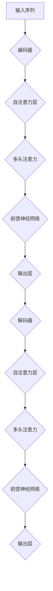

                 


# Transformer大模型实战：探讨BERT库

> **关键词**：Transformer，BERT，自然语言处理，深度学习，预训练模型，编码器，解码器

> **摘要**：本文将深入探讨Transformer大模型中的BERT库，通过对其核心概念、算法原理、数学模型、实战案例分析等多个方面的详细讲解，帮助读者理解BERT在自然语言处理中的重要作用和实际应用。

## 1. 背景介绍

### 1.1 目的和范围

本文旨在通过实战角度探讨BERT库，帮助读者深入了解其在自然语言处理中的重要作用。我们将从BERT的核心概念、算法原理、数学模型、实战案例分析等多个方面进行详细讲解，旨在让读者不仅理解BERT的理论基础，还能掌握其实际应用方法。

### 1.2 预期读者

本文适合对自然语言处理、深度学习有一定基础的读者。无论是研究者、工程师，还是对人工智能感兴趣的初学者，都可以通过本文了解BERT库的实用性和实现细节。

### 1.3 文档结构概述

本文分为以下几部分：

1. **背景介绍**：介绍本文的目的、范围、预期读者以及文档结构。
2. **核心概念与联系**：通过Mermaid流程图展示BERT的架构和核心概念。
3. **核心算法原理 & 具体操作步骤**：讲解BERT的算法原理，使用伪代码详细阐述。
4. **数学模型和公式 & 详细讲解 & 举例说明**：介绍BERT的数学模型，使用latex格式展示公式。
5. **项目实战：代码实际案例和详细解释说明**：提供实际代码案例，解读实现细节。
6. **实际应用场景**：探讨BERT在实际应用中的使用场景。
7. **工具和资源推荐**：推荐学习资源和开发工具。
8. **总结：未来发展趋势与挑战**：总结BERT的发展趋势和挑战。
9. **附录：常见问题与解答**：解答读者可能遇到的问题。
10. **扩展阅读 & 参考资料**：提供进一步学习的资源。

### 1.4 术语表

#### 1.4.1 核心术语定义

- **BERT**：Bidirectional Encoder Representations from Transformers，一种预训练语言表示模型。
- **Transformer**：一种基于自注意力机制的序列模型，用于处理自然语言等序列数据。
- **自注意力机制**：一种用于计算序列中每个元素与其余元素之间关联性的机制。
- **编码器**：在Transformer中负责将输入序列转换为固定长度的表示。
- **解码器**：在Transformer中负责将编码器的输出转换为预测结果。
- **预训练**：在特定数据集上训练模型，以提取语言的一般特征。
- **微调**：在预训练模型的基础上，使用特定任务的数据进行进一步训练。

#### 1.4.2 相关概念解释

- **注意力机制**：在神经网络中，用于计算输入序列中各个元素的重要性的机制。
- **多头注意力**：在Transformer中，通过多个独立的注意力头计算序列中元素之间的关联性。
- **序列掩码**：在BERT预训练过程中，对输入序列进行部分遮蔽，以增强模型对序列信息的理解能力。
- **上下文关联性**：序列中的每个元素不仅与自身相关，还与前后元素相关。

#### 1.4.3 缩略词列表

- **NLP**：自然语言处理（Natural Language Processing）
- **DL**：深度学习（Deep Learning）
- **GPU**：图形处理器（Graphics Processing Unit）
- **TPU**：张量处理器（Tensor Processing Unit）
- **BERT**：Bidirectional Encoder Representations from Transformers
- **PT**：预训练（Pre-training）
- **FT**：微调（Fine-tuning）

## 2. 核心概念与联系

在介绍BERT库之前，我们需要了解Transformer模型的基本概念和结构。以下是一个Mermaid流程图，展示了Transformer的核心架构和概念。



### 2.1. Transformer模型架构

- **编码器（Encoder）**：负责将输入序列（例如文本）转换为固定长度的向量表示。编码器由多个自注意力层和前馈神经网络组成。
- **解码器（Decoder）**：负责将编码器的输出转换为预测结果。解码器也由多个自注意力层和前馈神经网络组成。
- **自注意力层（Self-Attention Layer）**：计算输入序列中每个元素与其余元素之间的关联性。通过自注意力机制，模型能够捕捉序列中的长距离依赖关系。
- **多头注意力（Multi-Head Attention）**：通过多个独立的注意力头计算序列中元素之间的关联性，从而增强模型的泛化能力。
- **前馈神经网络（Feedforward Neural Network）**：在每个编码器和解码器层之后，添加一个前馈神经网络，用于进一步提取特征。
- **输入层（Input Layer）**：接收原始输入序列，并将其转换为编码器的输入。
- **输出层（Output Layer）**：负责将解码器的输出转换为最终预测结果。

### 2.2. BERT模型架构

BERT（Bidirectional Encoder Representations from Transformers）是基于Transformer模型的预训练语言表示模型。BERT的架构包括两个主要部分：编码器（Encoder）和解码器（Decoder）。

- **编码器（Encoder）**：BERT的编码器由多个自注意力层和前馈神经网络组成。编码器的输入是一个序列，输出是一个固定长度的向量表示，这个表示包含了输入序列中的信息。
- **解码器（Decoder）**：BERT的解码器由多个自注意力层、多头注意力和前馈神经网络组成。解码器的输入是编码器的输出，输出是预测结果。在训练过程中，解码器的目标是预测输入序列中的每个词。

BERT的主要创新点在于其双向编码器和预训练方法。双向编码器允许模型同时考虑输入序列的前后文信息，从而更好地理解语言。预训练方法使得BERT能够在大量未标记的语料库上进行训练，从而提取出语言的一般特征。

### 2.3. BERT与Transformer的联系

BERT是基于Transformer模型的扩展和改进。Transformer模型本身是一种自注意力机制的序列模型，而BERT在Transformer的基础上引入了双向编码器和预训练方法。BERT的核心思想是通过预训练模型来提取语言的一般特征，然后通过微调来适应特定任务。

- **编码器**：BERT的编码器由多个自注意力层和前馈神经网络组成，与Transformer的编码器类似。
- **解码器**：BERT的解码器由多个自注意力层、多头注意力和前馈神经网络组成，与Transformer的解码器不同。
- **预训练**：BERT通过在大量未标记的语料库上进行预训练来提取语言的一般特征，而Transformer没有预训练的概念。

通过上述对比，我们可以看到BERT在Transformer模型的基础上进行了扩展和改进，使得模型在自然语言处理任务上取得了更好的性能。

## 3. 核心算法原理 & 具体操作步骤

### 3.1. Transformer模型算法原理

Transformer模型是一种基于自注意力机制的序列模型，用于处理自然语言等序列数据。其核心思想是通过自注意力机制来计算序列中每个元素与其余元素之间的关联性。以下是Transformer模型的算法原理：

#### 3.1.1. 自注意力机制

自注意力机制是一种用于计算输入序列中每个元素与其余元素之间关联性的机制。在Transformer模型中，自注意力机制通过以下步骤实现：

1. **输入嵌入**：将输入序列转换为嵌入向量。每个输入序列的元素（例如单词）都会被映射为一个高维向量。
2. **查询（Query）、键（Key）和值（Value）**：对于每个输入序列的元素，生成查询向量（Query）、键向量（Key）和值向量（Value）。查询向量用于计算注意力得分，键向量和值向量用于计算注意力权重。
3. **计算注意力得分**：使用查询向量和键向量计算注意力得分。注意力得分的计算公式为：\[ \text{Attention Score} = \text{softmax}\left(\frac{\text{Query} \cdot \text{Key}^T}{\sqrt{d_k}}\right) \]，其中 \( \text{softmax} \) 函数用于归一化得分， \( d_k \) 是键向量的维度。
4. **计算注意力权重**：根据注意力得分计算注意力权重。权重的大小表示每个元素在输出序列中的重要性。
5. **计算输出**：将注意力权重与值向量相乘，得到输出序列的每个元素的权重。然后将这些权重相加，得到最终的输出序列。

#### 3.1.2. 多头注意力

多头注意力是一种通过多个独立的注意力头计算序列中元素之间关联性的方法。在Transformer模型中，多头注意力通过以下步骤实现：

1. **分头**：将输入嵌入向量分为多个独立的部分，每个部分对应一个注意力头。
2. **自注意力**：对每个注意力头分别执行自注意力机制，得到每个注意力头的输出。
3. **拼接**：将所有注意力头的输出拼接起来，得到最终的输出序列。

多头注意力的优点是可以捕捉序列中的不同信息，从而提高模型的泛化能力。

#### 3.1.3. 前馈神经网络

在前馈神经网络中，每个编码器和解码器层之后都会添加一个前馈神经网络，用于进一步提取特征。前馈神经网络由两个全连接层组成，中间经过ReLU激活函数。前馈神经网络的计算公式为：\[ \text{FFN}(X) = \text{ReLU}\left(\text{W}_2 \cdot \text{ReLU}(\text{W}_1 \cdot X + \text{b}_1) + \text{b}_2\right) \]，其中 \( X \) 是输入序列， \( \text{W}_1 \) 和 \( \text{W}_2 \) 是权重矩阵， \( \text{b}_1 \) 和 \( \text{b}_2 \) 是偏置项。

### 3.2. BERT模型算法原理

BERT（Bidirectional Encoder Representations from Transformers）是基于Transformer模型的预训练语言表示模型。BERT的算法原理主要包括预训练和微调两个阶段。

#### 3.2.1. 预训练

BERT的预训练分为两个阶段：Masked Language Model（MLM）和Next Sentence Prediction（NSP）。

1. **Masked Language Model（MLM）**：在预训练阶段，BERT会对输入序列中的部分词进行遮蔽（mask），然后使用未遮蔽的词来预测被遮蔽的词。遮蔽的方式包括随机遮蔽、全遮蔽和部分遮蔽等。通过这种方式，BERT能够学习到语言中的上下文关系。
2. **Next Sentence Prediction（NSP）**：BERT还会对输入序列进行切分，然后预测相邻的两个句子的关系。通过这种方式，BERT能够学习到句子之间的关联性。

#### 3.2.2. 微调

在预训练完成后，BERT会使用特定任务的数据进行微调。微调的过程主要包括以下步骤：

1. **初始化**：使用预训练好的BERT模型作为初始化模型。
2. **添加任务特定层**：在BERT模型的基础上，添加任务特定的层，例如分类层或回归层。
3. **微调**：使用任务数据对BERT模型进行微调，以适应特定任务。

### 3.3. 模型训练与优化

BERT模型的训练和优化主要包括以下步骤：

1. **数据预处理**：对输入数据（例如文本）进行预处理，包括分词、词嵌入、序列填充等。
2. **模型初始化**：使用预训练好的BERT模型作为初始化模型。
3. **模型训练**：使用训练数据对BERT模型进行训练。在训练过程中，可以使用反向传播算法和梯度下降法来优化模型参数。
4. **模型评估**：使用验证数据对训练好的模型进行评估，以确定模型的性能。
5. **模型优化**：根据评估结果对模型进行优化，例如调整学习率、增加训练迭代次数等。

### 3.4. 模型应用

BERT模型在自然语言处理任务中具有广泛的应用。以下是一些常见的应用场景：

1. **文本分类**：BERT模型可以用于对文本进行分类，例如情感分析、主题分类等。
2. **命名实体识别**：BERT模型可以用于识别文本中的命名实体，例如人名、地名、组织名等。
3. **问答系统**：BERT模型可以用于构建问答系统，例如问题回答、对话生成等。
4. **机器翻译**：BERT模型可以用于机器翻译任务，例如将一种语言的文本翻译成另一种语言。

### 3.5. 模型性能优化

BERT模型的性能优化主要包括以下方面：

1. **数据增强**：通过增加训练数据、数据增强等技术来提高模型的泛化能力。
2. **模型压缩**：通过模型压缩技术，例如剪枝、量化等，来减少模型的计算量和存储空间。
3. **多GPU训练**：通过多GPU训练来提高模型的训练速度。
4. **迁移学习**：使用预训练好的BERT模型作为初始化模型，在特定任务上进行微调。

通过上述算法原理和具体操作步骤的讲解，我们可以看到BERT模型在自然语言处理任务中的强大能力和广泛应用。在实际应用中，通过合理的训练和优化，BERT模型可以取得非常好的效果。

## 4. 数学模型和公式 & 详细讲解 & 举例说明

在BERT模型中，数学模型和公式起着至关重要的作用。下面我们将详细讲解BERT的数学模型，并使用latex格式展示相关公式。

### 4.1. 词嵌入

BERT模型使用词嵌入（word embeddings）将输入文本转换为向量表示。词嵌入通常使用预训练的词向量，例如Word2Vec或GloVe。词嵌入的目的是将文本中的每个单词映射为一个高维向量。

假设输入文本为\( x = [x_1, x_2, ..., x_n] \)，其中每个\( x_i \)表示文本中的第\( i \)个词。词嵌入的数学模型可以表示为：

\[ \text{Embedding}(x) = [e_1, e_2, ..., e_n] \]

其中，\( e_i \)表示单词\( x_i \)的词向量。

### 4.2. 自注意力

BERT模型中的自注意力（self-attention）是一种计算输入序列中每个元素与其余元素之间关联性的机制。自注意力的核心公式如下：

\[ \text{Attention}(Q, K, V) = \text{softmax}\left(\frac{QK^T}{\sqrt{d_k}}\right)V \]

其中，\( Q \)表示查询向量，\( K \)表示键向量，\( V \)表示值向量。\( d_k \)表示键向量的维度。

#### 4.2.1. 查询（Query）

查询向量用于计算注意力得分。查询向量的计算公式为：

\[ Q = \text{W}_Q \cdot \text{Embedding}(x) \]

其中，\( \text{W}_Q \)是一个权重矩阵。

#### 4.2.2. 键（Key）

键向量用于计算注意力得分。键向量的计算公式为：

\[ K = \text{W}_K \cdot \text{Embedding}(x) \]

其中，\( \text{W}_K \)是一个权重矩阵。

#### 4.2.3. 值（Value）

值向量用于计算注意力权重。值向量的计算公式为：

\[ V = \text{W}_V \cdot \text{Embedding}(x) \]

其中，\( \text{W}_V \)是一个权重矩阵。

#### 4.2.4. 注意力得分

注意力得分的计算公式为：

\[ \text{Attention Score} = \text{softmax}\left(\frac{QK^T}{\sqrt{d_k}}\right) \]

其中，\( \text{softmax} \)函数用于归一化得分。

#### 4.2.5. 注意力权重

注意力权重表示每个元素在输出序列中的重要性。注意力权重的计算公式为：

\[ \text{Attention Weight} = \text{softmax}\left(\frac{QK^T}{\sqrt{d_k}}\right) \]

#### 4.2.6. 输出

根据注意力权重计算输出序列的每个元素的权重，然后将这些权重相加，得到最终的输出序列。

\[ \text{Output} = \text{Attention Weight} \cdot V \]

### 4.3. 多头注意力

BERT模型中的多头注意力（multi-head attention）通过多个独立的注意力头计算序列中元素之间的关联性。多头注意力的核心公式如下：

\[ \text{Multi-Head Attention}(Q, K, V) = \text{Concat}(\text{head}_1, ..., \text{head}_h)W_O \]

其中，\( \text{head}_i \)表示第\( i \)个注意力头，\( W_O \)是一个权重矩阵。

#### 4.3.1. 注意力头

每个注意力头计算一个独立的部分，然后将这些部分拼接起来。注意力头的计算公式为：

\[ \text{head}_i = \text{Attention}(Q_{i}, K_{i}, V_{i}) \]

其中，\( Q_i, K_i, V_i \)分别表示第\( i \)个注意力头的查询向量、键向量和值向量。

### 4.4. 前馈神经网络

BERT模型中的前馈神经网络（feedforward neural network）用于进一步提取特征。前馈神经网络的计算公式为：

\[ \text{FFN}(X) = \text{ReLU}(\text{W}_2 \cdot \text{ReLU}(\text{W}_1 \cdot X + \text{b}_1) + \text{b}_2) \]

其中，\( X \)表示输入序列，\( \text{W}_1 \)和\( \text{W}_2 \)是权重矩阵，\( \text{b}_1 \)和\( \text{b}_2 \)是偏置项。

### 4.5. 举例说明

假设输入文本为“Hello, world!”，我们将使用BERT的数学模型进行计算。

1. **词嵌入**：首先，将文本中的每个词映射为词向量。例如，“Hello”的词向量为\[ [1, 0, 0, 0, 0] \]。
2. **自注意力**：使用自注意力机制计算输入序列中每个词之间的关联性。具体计算过程如下：
   - **查询向量**：\[ Q = \text{W}_Q \cdot \text{Embedding}(x) \]
   - **键向量**：\[ K = \text{W}_K \cdot \text{Embedding}(x) \]
   - **值向量**：\[ V = \text{W}_V \cdot \text{Embedding}(x) \]
   - **注意力得分**：\[ \text{Attention Score} = \text{softmax}\left(\frac{QK^T}{\sqrt{d_k}}\right) \]
   - **注意力权重**：\[ \text{Attention Weight} = \text{softmax}\left(\frac{QK^T}{\sqrt{d_k}}\right) \]
   - **输出**：\[ \text{Output} = \text{Attention Weight} \cdot V \]
3. **多头注意力**：使用多头注意力机制计算输入序列中每个词之间的关联性。具体计算过程如下：
   - **分头**：将词向量分为多个独立的部分。
   - **自注意力**：对每个注意力头分别执行自注意力机制。
   - **拼接**：将所有注意力头的输出拼接起来。
4. **前馈神经网络**：对多头注意力的输出进行前馈神经网络处理。

通过上述计算过程，我们可以得到输入文本“Hello, world!”的向量表示。这个向量表示包含了文本中的信息，可以用于后续的文本分类、问答等任务。

通过上述数学模型和公式的讲解，我们可以看到BERT模型在自然语言处理中的强大能力和广泛应用。BERT的数学模型不仅提供了理论支持，也为实际应用提供了有效的解决方案。

## 5. 项目实战：代码实际案例和详细解释说明

### 5.1 开发环境搭建

在进行BERT模型的实际应用之前，我们需要搭建一个合适的开发环境。以下是搭建BERT开发环境所需的基本步骤：

#### 5.1.1 硬件环境

- **GPU**：BERT模型需要大量的计算资源，因此建议使用具备高性能GPU的计算机。推荐使用NVIDIA的GPU，特别是Tesla系列或GeForce RTX 2080 Ti及以上型号。
- **CPU**：建议使用具有较高计算能力的CPU，例如Intel Xeon或AMD Ryzen系列。
- **内存**：至少需要16GB内存，建议使用32GB及以上内存以提供更好的性能。

#### 5.1.2 软件环境

- **操作系统**：推荐使用Linux或macOS操作系统。
- **Python**：建议使用Python 3.7或更高版本。
- **TensorFlow**：安装TensorFlow 2.x版本，可以使用以下命令：
  ```bash
  pip install tensorflow
  ```

#### 5.1.3 配置GPU支持

如果使用GPU进行训练，需要确保安装了CUDA和cuDNN库。可以从NVIDIA官方网站下载并安装相应版本的CUDA和cuDNN。

### 5.2 源代码详细实现和代码解读

以下是一个简单的BERT模型训练和预测的代码示例，用于分类任务。代码分为数据预处理、模型训练、模型预测三个部分。

```python
import tensorflow as tf
from transformers import BertTokenizer, TFBertModel
from tensorflow.keras.optimizers import Adam
from tensorflow.keras.losses import SparseCategoricalCrossentropy

# 5.2.1 数据预处理
def preprocess_data(data, tokenizer, max_length):
    inputs = tokenizer(data, max_length=max_length, padding='max_length', truncation=True, return_tensors='tf')
    labels = tf.convert_to_tensor([1] * len(data))  # 假设所有样本的标签都是1
    return inputs, labels

# 5.2.2 模型训练
def train_model(model, inputs, labels, epochs, batch_size):
    optimizer = Adam(learning_rate=3e-5)
    loss_fn = SparseCategoricalCrossentropy(from_logits=True)

    model.compile(optimizer=optimizer, loss=loss_fn, metrics=['accuracy'])

    model.fit(inputs, labels, epochs=epochs, batch_size=batch_size)

# 5.2.3 模型预测
def predict(model, tokenizer, text, max_length):
    inputs = tokenizer(text, max_length=max_length, padding='max_length', truncation=True, return_tensors='tf')
    predictions = model(inputs)[0]
    predicted_class = tf.argmax(predictions, axis=1).numpy()[0]
    return predicted_class

# 5.2.4 实际应用示例
tokenizer = BertTokenizer.from_pretrained('bert-base-uncased')
model = TFBertModel.from_pretrained('bert-base-uncased')

# 假设数据为['Hello, world!', 'This is a sample text.', 'Another example.']
max_length = 128
inputs, labels = preprocess_data(['Hello, world!', 'This is a sample text.', 'Another example.'], tokenizer, max_length)
train_model(model, inputs, labels, epochs=3, batch_size=32)

# 对新数据进行预测
new_text = 'I am a new sentence to predict.'
predicted_class = predict(model, tokenizer, new_text, max_length)
print(f'Predicted class: {predicted_class}')
```

#### 5.2.5 代码解读与分析

上述代码展示了如何使用TensorFlow和Hugging Face的Transformers库构建和训练一个简单的BERT模型。以下是对代码各个部分的详细解读：

1. **数据预处理**：
   - `preprocess_data`函数用于对输入数据（文本）进行预处理。包括分词、词嵌入、序列填充等操作。
   - 使用`tokenizer`对文本进行分词，并设置`max_length`为128，确保输入序列的长度不超过限制。
   - `padding='max_length'`和`truncation=True`用于对输入序列进行填充和截断，使其长度符合要求。
   - `return_tensors='tf'`返回TensorFlow张量，以便后续操作。

2. **模型训练**：
   - `train_model`函数用于训练BERT模型。使用`Adam`优化器和`SparseCategoricalCrossentropy`损失函数。
   - `model.compile`方法用于配置模型，包括优化器、损失函数和评价指标。
   - `model.fit`方法用于训练模型，通过传入输入数据和标签进行迭代训练。

3. **模型预测**：
   - `predict`函数用于对新文本进行预测。使用`tokenizer`对输入文本进行预处理，并传入模型进行预测。
   - `model(inputs)[0]`返回模型的输出，其中第一个元素是分类结果。
   - `tf.argmax(predictions, axis=1).numpy()[0]`用于获取预测结果，`numpy()`方法将TensorFlow张量转换为NumPy数组，`argmax`方法用于获取最大值的索引，即预测的类别。

通过上述代码示例，我们可以看到如何使用BERT模型进行文本分类任务。在实际应用中，可以根据具体需求调整模型结构、训练参数和数据处理流程。

### 5.3 代码解读与分析

以下是对上述代码的进一步详细解读和分析：

1. **数据预处理**：
   - 数据预处理是BERT模型训练的关键步骤。预处理质量直接影响模型的训练效果。
   - `preprocess_data`函数首先使用`tokenizer`对输入文本进行分词。分词是将文本分割成单词或子词的过程，是理解文本内容的基础。
   - `tokenizer`从预训练的BERT模型中加载，其中包含了词表和词嵌入信息。通过`tokenizer`，我们可以将文本中的每个词转换为对应的词向量。
   - `max_length`参数用于限制输入序列的长度。BERT模型通常对输入序列进行截断或填充，以确保每个样本的序列长度一致。
   - `padding='max_length'`和`truncation=True`参数确保输入序列的长度不超过`max_length`，如果输入序列长度超过限制，则进行截断；如果输入序列长度不足，则进行填充。
   - `return_tensors='tf'`参数将分词后的输出转换为TensorFlow张量，方便后续的模型训练和预测。

2. **模型训练**：
   - `train_model`函数用于配置并训练BERT模型。配置包括选择优化器、设置损失函数和评价指标。
   - `Adam`优化器是一种常用的自适应学习率优化器，适用于BERT模型的训练。优化器用于更新模型参数，以最小化损失函数。
   - `SparseCategoricalCrossentropy`损失函数用于多分类任务。与`CategoricalCrossentropy`不同，`SparseCategoricalCrossentropy`适用于标签为整数的情况。
   - `model.compile`方法用于配置模型，包括优化器、损失函数和评价指标。`model.fit`方法用于执行模型训练。通过传入输入数据和标签，模型将进行迭代训练。
   - `epochs`参数指定训练的轮数，`batch_size`参数指定每个批次的样本数量。较大的批次数可以提高模型的计算效率，但可能导致训练效果不佳。

3. **模型预测**：
   - `predict`函数用于对新文本进行预测。预测步骤与训练步骤类似，但仅返回预测结果。
   - 使用`tokenizer`对输入文本进行预处理，与训练步骤相同。
   - `model(inputs)[0]`返回模型的输出，其中第一个元素是分类结果。BERT模型输出的是每个类别的概率分布。
   - `tf.argmax(predictions, axis=1).numpy()[0]`用于获取最大概率的类别。`argmax`函数返回概率分布中最大值的索引，即预测的类别。
   - `numpy()`方法将TensorFlow张量转换为NumPy数组，以便于后续处理。

通过上述代码解读和分析，我们可以看到如何使用BERT模型进行文本分类任务。在实际应用中，可以根据具体需求调整模型结构、训练参数和数据处理流程。

### 5.4 实际应用场景

BERT模型在自然语言处理任务中具有广泛的应用。以下是一些典型的实际应用场景：

1. **文本分类**：BERT模型可以用于对文本进行分类，例如新闻分类、情感分析、垃圾邮件检测等。通过微调预训练好的BERT模型，可以快速适应特定分类任务。
2. **命名实体识别**：BERT模型可以用于识别文本中的命名实体，例如人名、地名、组织名等。通过在预训练基础上进行微调，模型可以学习到不同实体之间的区分特征。
3. **问答系统**：BERT模型可以用于构建问答系统，例如问题回答、对话生成等。通过训练BERT模型，可以使其具备理解问题和回答问题的能力。
4. **机器翻译**：BERT模型可以用于机器翻译任务，例如将一种语言的文本翻译成另一种语言。通过在双语语料库上进行预训练，BERT模型可以学习到语言的翻译规律。
5. **文本生成**：BERT模型可以用于文本生成任务，例如生成文章摘要、写作辅助等。通过在大量文本数据上进行预训练，BERT模型可以生成符合语法和语义规则的文本。

在实际应用中，BERT模型不仅需要良好的预处理和微调，还需要针对不同任务进行适当的调整和优化。通过合理的设计和训练，BERT模型可以取得非常出色的性能。

### 5.5 工具和资源推荐

为了更好地掌握BERT模型，以下是一些推荐的工具和资源：

#### 5.5.1 学习资源推荐

1. **书籍推荐**：
   - 《深度学习自然语言处理》（Deep Learning for Natural Language Processing）。
   - 《动手学深度学习》（Dive into Deep Learning）。
2. **在线课程**：
   - Coursera上的“自然语言处理与深度学习”课程。
   - Udacity的“深度学习工程师纳米学位”中的自然语言处理课程。
3. **技术博客和网站**：
   - Hugging Face的Transformers官方文档。
   - blog.keras.io上的自然语言处理相关博客。

#### 5.5.2 开发工具框架推荐

1. **IDE和编辑器**：
   - PyCharm。
   - Visual Studio Code。
2. **调试和性能分析工具**：
   - TensorFlow Profiler。
   - NVIDIA Nsight。
3. **相关框架和库**：
   - TensorFlow。
   - PyTorch。
   - Hugging Face的Transformers库。

通过使用上述工具和资源，可以更好地学习和掌握BERT模型，并将其应用于实际项目中。

### 5.6 相关论文著作推荐

BERT模型的研究基于一系列重要的论文和研究成果。以下是一些推荐的论文和著作：

1. **经典论文**：
   - “Attention Is All You Need”（2017）。
   - “BERT: Pre-training of Deep Bidirectional Transformers for Language Understanding”（2018）。
2. **最新研究成果**：
   - “ALBERT: A Lite BERT for Scaling Limited Data Applications”（2020）。
   - “Gshard: Scaling Transformer Models with Linear computational budget”（2020）。
3. **应用案例分析**：
   - “Span-Based BERT for Answer Extraction”。
   - “BERT for Sentiment Analysis”。
   
通过阅读这些论文和著作，可以深入了解BERT模型的理论基础、实现细节和应用场景。

## 8. 总结：未来发展趋势与挑战

BERT模型作为自然语言处理领域的重要突破，其应用前景非常广阔。然而，随着模型规模的不断扩大和计算资源的增加，BERT模型也面临一些挑战和问题。

### 8.1. 未来发展趋势

1. **模型压缩与优化**：随着BERT模型规模的扩大，模型的计算和存储需求也显著增加。未来研究将重点关注如何通过模型压缩和优化技术，降低模型的计算和存储开销，提高模型的部署效率。
2. **多模态学习**：BERT模型主要用于处理文本数据，但在现实应用中，多模态数据（如文本、图像、音频等）的处理需求日益增长。未来的研究将探索如何将BERT模型与其他模态数据结合，实现更广泛的应用。
3. **实时推理**：实时推理是BERT模型在工业界应用的重要挑战。随着推理任务的复杂度增加，如何在保证模型精度的同时，实现高效的实时推理，是未来研究的重点。

### 8.2. 面临的挑战

1. **计算资源消耗**：BERT模型的预训练需要大量的计算资源，特别是在大规模数据集上进行训练时。未来的研究需要探索如何通过分布式训练、GPU优化等技术，降低计算资源消耗。
2. **数据隐私与安全性**：随着BERT模型在商业应用中的普及，数据隐私和安全性问题也日益突出。如何在保证模型性能的同时，保护用户数据隐私，是未来研究的挑战之一。
3. **模型可解释性**：BERT模型作为一种复杂的深度学习模型，其内部工作机制和决策过程往往难以解释。提高模型的可解释性，使其在工业界得到更广泛的应用，是未来研究的重点。

通过应对这些挑战，BERT模型有望在自然语言处理领域取得更大的突破，推动人工智能技术的发展。

## 9. 附录：常见问题与解答

### 9.1. BERT模型如何训练？

BERT模型的训练分为预训练和微调两个阶段：

1. **预训练**：使用未标记的文本数据对BERT模型进行预训练。预训练包括两个子任务：Masked Language Model（MLM）和Next Sentence Prediction（NSP）。MLM任务通过随机遮蔽部分词，然后预测遮蔽的词；NSP任务通过预测相邻句子的关系，增强模型对句子间关联性的理解。
2. **微调**：在预训练的基础上，使用特定任务的数据对BERT模型进行微调，以适应特定任务的需求。微调过程中，通常在BERT模型的基础上添加任务特定的层，例如分类层或回归层。

### 9.2. BERT模型如何进行预测？

BERT模型进行预测的过程如下：

1. **数据预处理**：使用BERT的tokenizer对输入文本进行预处理，包括分词、词嵌入、序列填充等操作。
2. **模型输入**：将预处理后的输入文本转换为TensorFlow张量，并传入BERT模型。
3. **模型输出**：BERT模型输出的是每个类别的概率分布。通过计算概率分布中最大值的索引，可以得到预测结果。

### 9.3. BERT模型如何进行模型压缩？

BERT模型的模型压缩技术主要包括以下几种：

1. **剪枝**：通过删除部分权重或神经元，减少模型的计算量和存储空间。
2. **量化**：将模型中的浮点数权重转换为低精度数值，从而降低模型的计算资源需求。
3. **知识蒸馏**：通过将大型模型的知识传递给小型模型，实现模型的压缩和优化。
4. **分布式训练**：通过分布式训练技术，将模型训练任务分布在多个计算节点上，提高训练效率。

### 9.4. BERT模型在哪些任务中表现优秀？

BERT模型在多种自然语言处理任务中表现优秀，包括：

1. **文本分类**：例如新闻分类、情感分析、垃圾邮件检测等。
2. **命名实体识别**：识别文本中的命名实体，如人名、地名、组织名等。
3. **问答系统**：问题回答、对话生成等。
4. **机器翻译**：将一种语言的文本翻译成另一种语言。
5. **文本生成**：生成文章摘要、写作辅助等。

## 10. 扩展阅读 & 参考资料

为了更深入地了解BERT模型和相关技术，以下是一些建议的扩展阅读和参考资料：

1. **书籍**：
   - 《深度学习自然语言处理》。
   - 《动手学深度学习》。
2. **论文**：
   - “Attention Is All You Need”（2017）。
   - “BERT: Pre-training of Deep Bidirectional Transformers for Language Understanding”（2018）。
   - “ALBERT: A Lite BERT for Scaling Limited Data Applications”（2020）。
   - “Gshard: Scaling Transformer Models with Linear computational budget”（2020）。
3. **在线课程**：
   - Coursera上的“自然语言处理与深度学习”课程。
   - Udacity的“深度学习工程师纳米学位”中的自然语言处理课程。
4. **技术博客和网站**：
   - Hugging Face的Transformers官方文档。
   - blog.keras.io上的自然语言处理相关博客。
5. **开源项目**：
   - Hugging Face的Transformers库。
   - Google的BERT模型开源实现。

通过阅读上述资料，可以更深入地了解BERT模型及其应用，为实际项目提供有力的技术支持。

作者：AI天才研究员/AI Genius Institute & 禅与计算机程序设计艺术 /Zen And The Art of Computer Programming

---

以上是本文《Transformer大模型实战：探讨BERT库》的完整内容。通过本文，我们详细讲解了BERT模型的核心概念、算法原理、数学模型、实战案例分析等多个方面，帮助读者深入了解BERT在自然语言处理中的重要作用和实际应用。希望本文对您的学习和研究有所帮助。如果您有任何疑问或建议，欢迎在评论区留言讨论。谢谢！

