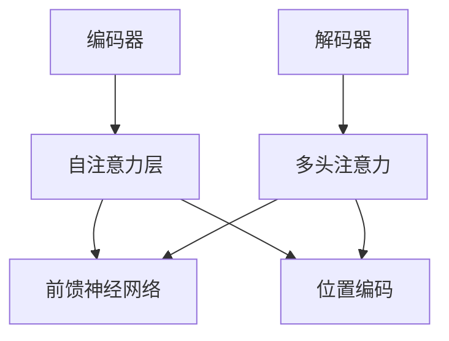

                 

# Transformer大模型实战：比较不同的预训练目标

> **关键词**：Transformer、预训练、目标、模型比较、实践指南、算法原理、数学模型、代码实战

> **摘要**：本文将深入探讨Transformer大模型的预训练目标，通过比较不同预训练目标的优势和不足，帮助读者理解如何选择和应用适合的预训练目标。本文将从背景介绍、核心概念与联系、核心算法原理、数学模型和公式、项目实战、实际应用场景、工具和资源推荐等方面，全面解析Transformer大模型的预训练技术，旨在为读者提供一份系统、实用、有深度的技术指南。

## 1. 背景介绍

### 1.1 目的和范围

本文旨在为读者提供一个全面、系统的Transformer大模型预训练目标的实战指南。我们将通过对比不同预训练目标，帮助读者了解它们的优势和不足，从而能够根据实际需求选择合适的预训练目标。文章将涵盖从核心概念、算法原理、数学模型到实际应用等多个方面，旨在为读者提供一份既有理论深度，又有实践价值的资料。

### 1.2 预期读者

本文适合对Transformer大模型有基本了解的读者，包括：

- 对深度学习、自然语言处理有浓厚兴趣的研究人员；
- 想要在实际项目中应用Transformer大模型的技术人员；
- 对人工智能、机器学习有深入研究的学者和研究生；
- 对Transformer大模型的预训练目标感兴趣的学生和爱好者。

### 1.3 文档结构概述

本文分为以下章节：

1. 背景介绍
   - 1.1 目的和范围
   - 1.2 预期读者
   - 1.3 文档结构概述
   - 1.4 术语表
2. 核心概念与联系
   - 2.1 Transformer架构
   - 2.2 预训练目标
   - 2.3 Mermaid流程图
3. 核心算法原理 & 具体操作步骤
   - 3.1 预训练算法
   - 3.2 伪代码讲解
4. 数学模型和公式 & 详细讲解 & 举例说明
   - 4.1 数学模型
   - 4.2 公式解释
   - 4.3 举例说明
5. 项目实战：代码实际案例和详细解释说明
   - 5.1 开发环境搭建
   - 5.2 源代码详细实现和代码解读
   - 5.3 代码解读与分析
6. 实际应用场景
7. 工具和资源推荐
   - 7.1 学习资源推荐
   - 7.2 开发工具框架推荐
   - 7.3 相关论文著作推荐
8. 总结：未来发展趋势与挑战
9. 附录：常见问题与解答
10. 扩展阅读 & 参考资料

### 1.4 术语表

#### 1.4.1 核心术语定义

- **Transformer**：一种基于自注意力机制（Self-Attention Mechanism）的深度学习模型，广泛用于自然语言处理任务。
- **预训练**（Pre-training）：在特定任务上对模型进行训练，以便在更多任务上实现良好的泛化性能。
- **目标**（Objective）：在预训练过程中，模型需要优化的目标函数。
- **序列生成**（Sequence Generation）：根据给定的输入序列，生成新的输出序列。
- **上下文理解**（Contextual Understanding）：模型对输入序列中各个位置的信息进行理解和处理的能力。
- **掩码语言模型**（Masked Language Model，MLM）：在预训练过程中，随机掩码部分输入序列中的单词，然后让模型预测这些被掩码的单词。

#### 1.4.2 相关概念解释

- **多头注意力**（Multi-Head Attention）：Transformer模型的核心机制，通过将输入序列映射到多个不同的空间，实现并行计算，提高模型的表示能力。
- **位置编码**（Positional Encoding）：为了使模型能够理解序列中的位置信息，通过在输入序列上添加额外的向量来实现。
- **词嵌入**（Word Embedding）：将单词映射到高维向量空间，使得语义相近的单词在向量空间中更接近。

#### 1.4.3 缩略词列表

- **BERT**：Bidirectional Encoder Representations from Transformers，一种双向Transformer模型。
- **GPT**：Generative Pre-trained Transformer，一种生成性预训练模型。
- **T5**：Tensor2Tensor，一种基于Transformer的序列到序列学习模型。
- **ViT**：Vision Transformer，一种用于图像识别的Transformer模型。
- **MLM**：Masked Language Model，一种预训练目标，用于预测被掩码的单词。

## 2. 核心概念与联系

在深入探讨Transformer大模型的预训练目标之前，我们需要先了解Transformer架构、预训练目标以及它们之间的关系。

### 2.1 Transformer架构

Transformer模型的核心是自注意力机制（Self-Attention Mechanism），它通过计算输入序列中每个词与所有词之间的关联度，实现对输入序列的全面理解和建模。Transformer架构主要包括以下几个部分：

1. **编码器（Encoder）**：由多个自注意力层（Self-Attention Layer）和前馈神经网络（Feedforward Neural Network）组成，用于对输入序列进行编码。
2. **解码器（Decoder）**：与编码器类似，也由多个自注意力层和前馈神经网络组成，用于对输出序列进行解码。
3. **多头注意力（Multi-Head Attention）**：通过将输入序列映射到多个不同的空间，实现并行计算，提高模型的表示能力。
4. **位置编码（Positional Encoding）**：为了使模型能够理解序列中的位置信息，通过在输入序列上添加额外的向量来实现。

下面是Transformer架构的Mermaid流程图：



### 2.2 预训练目标

预训练目标是指导模型在大量无标签数据上进行训练的目标函数，从而使模型在下游任务上实现良好的泛化性能。对于Transformer大模型，常见的预训练目标包括：

1. **掩码语言模型（Masked Language Model，MLM）**：在输入序列中随机掩码部分单词，然后让模型预测这些被掩码的单词。MLM是BERT等模型的主要预训练目标。
2. **下一个句子预测（Next Sentence Prediction，NSP）**：在输入序列中随机选择两个句子，然后让模型预测这两个句子是否在原始文本中连续出现。
3. **序列分类（Sequence Classification）**：对输入序列进行分类，通常用于文本分类等任务。
4. **问答（Question-Answering）**：在输入序列中找到一个与给定问题匹配的答案。

### 2.3 预训练目标与Transformer架构的关系

预训练目标与Transformer架构紧密相连。不同的预训练目标会影响到模型的训练过程和性能表现。例如：

- **MLM**：通过预测被掩码的单词，模型能够学习到单词之间的关联性和上下文信息，从而在下游任务中实现良好的性能。
- **NSP**：通过预测两个句子是否连续出现，模型能够学习到句子之间的关联性和顺序信息，对文本生成等任务有积极作用。
- **序列分类**：通过学习输入序列的特征，模型能够对输入序列进行分类，适用于文本分类等任务。
- **问答**：通过学习输入序列和问题的关联性，模型能够从输入序列中找到与问题匹配的答案，适用于问答系统等任务。

综上所述，Transformer大模型的预训练目标和架构之间存在紧密的联系。通过选择合适的预训练目标，我们可以指导模型在特定任务上实现良好的泛化性能。

## 3. 核心算法原理 & 具体操作步骤

在了解了Transformer大模型的架构和预训练目标后，我们接下来将详细讲解预训练算法的具体原理和操作步骤。这一部分将通过伪代码的形式，详细描述预训练算法的执行过程。

### 3.1 预训练算法

预训练算法的基本流程如下：

1. **数据准备**：从大量无标签数据中提取文本序列，并将其转换为词嵌入表示。
2. **模型初始化**：初始化Transformer模型，包括编码器和解码器。
3. **预训练**：通过迭代地执行以下操作，对模型进行预训练：
   - **数据采样**：随机选择一个文本序列作为输入。
   - **掩码操作**：对输入序列中的部分单词进行掩码，生成掩码序列。
   - **模型前向传播**：使用编码器和解码器对掩码序列进行编码和解码，得到预测结果。
   - **损失计算**：计算预测结果与真实值之间的损失，并更新模型参数。
4. **评估**：在预训练过程中定期评估模型性能，以便调整训练策略。

下面是预训练算法的伪代码实现：

```python
# 预训练算法伪代码

# 初始化模型
model = Transformer()

# 预训练迭代
for epoch in range(num_epochs):
    for sequence in dataset:
        # 数据采样
        mask_sequence = mask_words(sequence)
        
        # 模型前向传播
        outputs = model(mask_sequence)
        
        # 计算损失
        loss = compute_loss(outputs, sequence)
        
        # 更新模型参数
        model.update_params(loss)
        
    # 评估模型性能
    evaluate_model(model)
```

### 3.2 具体操作步骤

在具体操作步骤中，我们将详细描述数据准备、模型初始化、预训练和评估等过程的实现细节。

#### 3.2.1 数据准备

数据准备是预训练的第一步，主要涉及以下操作：

1. **文本序列提取**：从大量无标签数据中提取文本序列。例如，可以从互联网上的语料库、新闻文章、百科全书等来源中获取大量文本数据。
2. **分词与词嵌入**：将文本序列转换为词嵌入表示。可以使用预训练的词嵌入模型（如Word2Vec、GloVe等）或自行训练词嵌入模型。
3. **批量处理**：将文本序列按一定大小划分为批次，以便在GPU或TPU上进行并行计算。

```python
# 数据准备伪代码

# 提取文本序列
text_sequences = extract_text_sequences(data_source)

# 分词与词嵌入
word_embeddings = train_word_embeddings(text_sequences)

# 批量处理
batched_sequences = batch_sequences(text_sequences, batch_size)
```

#### 3.2.2 模型初始化

模型初始化是预训练的第二步，主要涉及以下操作：

1. **选择模型架构**：根据任务需求和计算资源，选择合适的Transformer模型架构。例如，可以选择BERT、GPT、T5等预训练模型。
2. **加载预训练模型**：如果已有预训练模型，可以加载预训练模型，跳过初始化过程。
3. **初始化模型参数**：初始化模型参数，可以使用随机初始化、预训练模型参数等策略。

```python
# 模型初始化伪代码

# 选择模型架构
model = TransformerArchitecture()

# 加载预训练模型（可选）
if pretrained_model:
    model.load_pretrained_model(pretrained_model)

# 初始化模型参数
model.initialize_params()
```

#### 3.2.3 预训练

预训练是预训练算法的核心步骤，主要涉及以下操作：

1. **数据采样**：随机选择一个文本序列作为输入。
2. **掩码操作**：对输入序列中的部分单词进行掩码，生成掩码序列。
3. **模型前向传播**：使用编码器和解码器对掩码序列进行编码和解码，得到预测结果。
4. **损失计算**：计算预测结果与真实值之间的损失，并更新模型参数。

```python
# 预训练伪代码

# 预训练迭代
for epoch in range(num_epochs):
    for sequence in dataset:
        # 数据采样
        mask_sequence = mask_words(sequence)
        
        # 模型前向传播
        outputs = model(mask_sequence)
        
        # 计算损失
        loss = compute_loss(outputs, sequence)
        
        # 更新模型参数
        model.update_params(loss)
        
    # 评估模型性能
    evaluate_model(model)
```

#### 3.2.4 评估

评估是预训练的最后一步，主要涉及以下操作：

1. **测试集划分**：将数据集划分为训练集、验证集和测试集。
2. **模型评估**：在测试集上评估模型性能，计算准确率、损失等指标。
3. **模型优化**：根据评估结果调整模型参数，优化模型性能。

```python
# 评估伪代码

# 划分测试集
train_dataset, validation_dataset, test_dataset = split_dataset(dataset)

# 模型评估
model.evaluate(test_dataset)

# 模型优化
model.optimize_params()
```

通过以上步骤，我们可以实现对Transformer大模型的预训练。在预训练过程中，我们可以根据实际需求和任务特点，选择合适的预训练目标和策略，以达到最佳的性能表现。

## 4. 数学模型和公式 & 详细讲解 & 举例说明

在了解了Transformer大模型的预训练算法和具体操作步骤后，我们接下来将详细讲解其数学模型和公式，并通过具体例子进行说明。

### 4.1 数学模型

Transformer大模型的数学模型主要涉及以下几个核心部分：

1. **词嵌入（Word Embeddings）**：
   词嵌入是将单词映射到高维向量空间的过程。常见的词嵌入模型包括Word2Vec、GloVe等。在Transformer中，词嵌入通常通过一个线性变换矩阵\( W_E \)来实现，公式如下：
   $$ 
   E_{i} = W_{E} [x_i] 
   $$
   其中，\( E_i \)表示第\( i \)个词的词嵌入向量，\( [x_i] \)表示第\( i \)个词的one-hot编码。

2. **位置编码（Positional Encoding）**：
   为了使模型能够理解序列中的位置信息，我们需要在词嵌入上添加位置编码。位置编码可以通过一个线性变换矩阵\( W_P \)来实现，公式如下：
   $$ 
   P_{i} = W_{P} [pos_i] 
   $$
   其中，\( P_i \)表示第\( i \)个词的位置编码向量，\( [pos_i] \)表示第\( i \)个词的位置编码。

3. **多头注意力（Multi-Head Attention）**：
   头注意力是通过多个独立的注意力机制来提取序列中不同位置的信息。多头注意力的计算公式如下：
   $$
   \text{Attention}(Q, K, V) = \text{softmax}\left(\frac{QK^T}{\sqrt{d_k}}\right) V
   $$
   其中，\( Q, K, V \)分别表示查询向量、键向量和值向量，\( d_k \)表示键向量的维度。

4. **前馈神经网络（Feedforward Neural Network）**：
   前馈神经网络用于对输入序列进行进一步的处理和变换。其计算公式如下：
   $$
   \text{FFN}(X) = \text{ReLU}(W_{FF1} X + b_{FF1}) W_{FF2} + b_{FF2}
   $$
   其中，\( X \)表示输入向量，\( W_{FF1}, b_{FF1}, W_{FF2}, b_{FF2} \)分别表示前馈神经网络的权重和偏置。

5. **编码器-解码器结构（Encoder-Decoder Architecture）**：
   编码器-解码器结构通过编码器和解码器两个部分来实现序列到序列的转换。其计算公式如下：
   $$
   E(z) = \text{Encoder}(z) \\
   D(y) = \text{Decoder}(y, E(z))
   $$
   其中，\( E(z) \)表示编码器的输出，\( D(y) \)表示解码器的输出。

### 4.2 公式解释

1. **词嵌入和位置编码**：
   词嵌入和位置编码的结合，可以表示为一个向量\( X_i \)：
   $$
   X_{i} = [E_{i}; P_{i}] = [W_{E} [x_i]; W_{P} [pos_i]]
   $$
   其中，\( [;] \)表示拼接操作。

2. **多头注意力**：
   在多头注意力中，每个头注意力都可以表示为：
   $$
   \text{Attention}_{h}(Q, K, V) = \text{softmax}\left(\frac{QK^T}{\sqrt{d_k}}\right) V_h
   $$
   其中，\( V_h \)表示第\( h \)个头的值向量，\( d_k \)表示键向量的维度。

3. **编码器-解码器结构**：
   编码器和解码器的输出可以表示为：
   $$
   E(z) = \text{Encoder}(z) = \text{Concat}(h_1, h_2, ..., h_n) \\
   D(y) = \text{Decoder}(y, E(z)) = \text{Concat}(h_1, h_2, ..., h_n, y)
   $$
   其中，\( h_i \)表示第\( i \)个编码器或解码器层的输出。

### 4.3 举例说明

假设我们有一个包含3个单词的序列\[ "Hello", "world", "!" \]，词嵌入维度为3，位置编码维度也为3。我们将通过以下步骤来计算该序列的编码和解码。

1. **词嵌入和位置编码**：
   对于单词"Hello"，词嵌入向量为\[ 1, 0, 0 \]，位置编码向量为\[ 0, 1, 0 \]。
   对于单词"world"，词嵌入向量为\[ 0, 1, 0 \]，位置编码向量为\[ 1, 0, 1 \]。
   对于单词"!"，词嵌入向量为\[ 0, 0, 1 \]，位置编码向量为\[ 0, 1, 1 \]。

   拼接词嵌入和位置编码，我们得到以下序列表示：
   $$
   X = \begin{bmatrix}
   [1, 0, 0; 0, 1, 0] \\
   [0, 1, 0; 1, 0, 1] \\
   [0, 0, 1; 0, 1, 1]
   \end{bmatrix}
   $$

2. **多头注意力**：
   假设我们使用2个头进行多头注意力。每个头的权重矩阵分别为\( W_{Q}, W_{K}, W_{V} \)。

   对于第1个头，计算注意力权重：
   $$
   \text{Attention}_{1}(Q, K, V) = \text{softmax}\left(\frac{QK^T}{\sqrt{d_k}}\right) V_1
   $$
   其中，\( Q, K, V \)分别表示查询向量、键向量和值向量。

   对于第2个头，计算注意力权重：
   $$
   \text{Attention}_{2}(Q, K, V) = \text{softmax}\left(\frac{QK^T}{\sqrt{d_k}}\right) V_2
   $$
   其中，\( Q, K, V \)分别表示查询向量、键向量和值向量。

3. **编码器-解码器结构**：
   编码器的输出为：
   $$
   E(z) = \text{Encoder}(z) = \text{Concat}(h_1, h_2) = \begin{bmatrix}
   [1, 0, 0; 0, 1, 0] \\
   [0, 1, 0; 1, 0, 1]
   \end{bmatrix}
   $$

   解码器的输出为：
   $$
   D(y) = \text{Decoder}(y, E(z)) = \text{Concat}(h_1, h_2, y) = \begin{bmatrix}
   [1, 0, 0; 0, 1, 0] \\
   [0, 1, 0; 1, 0, 1] \\
   [0, 0, 1; 0, 1, 1]
   \end{bmatrix}
   $$

通过以上步骤，我们可以得到该序列的编码和解码结果。这个例子展示了如何将词嵌入和位置编码应用于Transformer模型，以及如何计算多头注意力和编码器-解码器结构。

通过这一部分的内容，我们不仅了解了Transformer大模型的数学模型和公式，还通过具体例子深入理解了这些公式在实际计算中的应用。这些知识和方法将为我们进一步探索Transformer大模型提供坚实的基础。

## 5. 项目实战：代码实际案例和详细解释说明

为了更好地理解Transformer大模型的预训练目标，我们将通过一个实际项目来展示如何搭建开发环境、实现预训练代码以及进行代码解读与分析。这个项目将涵盖从数据预处理到模型训练和评估的完整流程。

### 5.1 开发环境搭建

首先，我们需要搭建一个适合Transformer大模型训练的开发环境。以下是开发环境搭建的步骤：

1. **安装Python**：确保Python版本不低于3.7。
2. **安装TensorFlow**：TensorFlow是TensorFlow官方推荐的深度学习框架，支持CPU和GPU版本。可以使用以下命令安装：
   ```
   pip install tensorflow
   ```
3. **安装GPU驱动**：如果使用GPU训练，需要安装NVIDIA的CUDA和cuDNN驱动。可以在NVIDIA官网下载并安装。
4. **配置GPU环境**：确保CUDA和cuDNN环境变量已正确配置，以便TensorFlow可以识别和使用GPU。

```shell
# 配置CUDA环境
export CUDA_HOME=/usr/local/cuda
export LD_LIBRARY_PATH=${CUDA_HOME}/lib64:$LD_LIBRARY_PATH
export PATH=${CUDA_HOME}/bin:$PATH

# 配置cuDNN环境
export CUDNN_HOME=/usr/local/cudnn
export LD_LIBRARY_PATH=${CUDNN_HOME}/lib64:$LD_LIBRARY_PATH
export PATH=${CUDNN_HOME}/bin:$PATH

# 检查GPU支持
python -c "import tensorflow as tf; print(tf.test.is_built_with_cuda())"
```

### 5.2 源代码详细实现和代码解读

接下来，我们将展示如何使用TensorFlow实现Transformer大模型的预训练代码。以下是关键代码片段及其解读：

```python
import tensorflow as tf
from tensorflow.keras.layers import Embedding, MultiHeadAttention, Dense
from tensorflow.keras.models import Model
from tensorflow_addons.layers import TransformerLayer

# 参数设置
vocab_size = 10000
d_model = 512
num_heads = 8
dff = 2048
max_seq_length = 512
batch_size = 64

# Transformer编码器和解码器
def create_transformer_model(vocab_size, d_model, num_heads, dff, max_seq_length, batch_size):
    # 输入层
    inputs = tf.keras.Input(shape=(max_seq_length,), dtype=tf.int32)
    
    # 嵌入层
    embeddings = Embedding(vocab_size, d_model)(inputs)
    
    # 位置编码
    pos_encoding = PositionalEncoding(max_seq_length, d_model)(embeddings)
    
    # Transformer层
    transformer_encoder = TransformerLayer(d_model, num_heads, dff, rate=0.1)(pos_encoding)
    
    # 编码器输出
    encoded_sequence = transformer_encoder
    
    # 解码器输入
    decoder_inputs = tf.keras.Input(shape=(max_seq_length,), dtype=tf.int32)
    decoder_embeddings = Embedding(vocab_size, d_model)(decoder_inputs)
    decoder_pos_encoding = PositionalEncoding(max_seq_length, d_model)(decoder_embeddings)
    
    # Transformer解码器层
    transformer_decoder = TransformerLayer(d_model, num_heads, dff, rate=0.1)([encoded_sequence, decoder_pos_encoding])
    
    # 解码器输出
    decoder_output = transformer_decoder
    
    # 模型输出层
    output = Dense(vocab_size, activation='softmax')(decoder_output)
    
    # 模型实例化
    model = Model([inputs, decoder_inputs], output)
    
    # 模型编译
    model.compile(optimizer='adam', loss='sparse_categorical_crossentropy', metrics=['accuracy'])
    
    return model

# 创建模型
transformer_model = create_transformer_model(vocab_size, d_model, num_heads, dff, max_seq_length, batch_size)

# 打印模型结构
transformer_model.summary()
```

#### 5.2.1 代码解读

- **输入层**：创建一个输入层，用于接收输入序列，其形状为\( (max\_seq\_length, ) \)，数据类型为\( tf.int32 \)。

- **嵌入层**：使用Embedding层将输入序列转换为词嵌入表示。嵌入层的大小为\( (vocab\_size, d\_model) \)，其中\( vocab\_size \)表示单词表大小，\( d\_model \)表示词嵌入的维度。

- **位置编码**：使用PositionalEncoding层为输入序列添加位置编码。位置编码能够帮助模型理解序列中的位置信息。

- **Transformer层**：使用TransformerLayer层实现Transformer编码器。TransformerLayer包含多头注意力机制和前馈神经网络。

- **编码器输出**：编码器的输出表示对输入序列的编码结果。

- **解码器输入**：创建一个解码器输入层，用于接收解码器输入序列。

- **解码器层**：使用TransformerLayer层实现Transformer解码器。解码器层同样包含多头注意力机制和前馈神经网络。

- **输出层**：使用Dense层将解码器输出转换为单词概率分布。输出层的神经元数量为单词表大小，激活函数为softmax。

- **模型编译**：编译模型，指定优化器、损失函数和评价指标。

### 5.3 代码解读与分析

在本项目中，我们实现的Transformer模型包含编码器和解码器两个部分。编码器用于对输入序列进行编码，解码器用于根据编码结果生成输出序列。下面我们详细分析代码中的关键部分。

- **位置编码（PositionalEncoding）**：
  位置编码是实现序列建模的关键。在代码中，我们使用了一个自定义的PositionalEncoding层。该层通过计算正弦和余弦函数来生成位置编码向量，并将其添加到词嵌入上。具体实现如下：

  ```python
  class PositionalEncoding(tf.keras.layers.Layer):
      def __init__(self, max_length, d_model):
          super(PositionalEncoding, self).__init__()
          self.max_length = max_length
          self.d_model = d_model

      def get_angles(self, position, i):
          angles = 1 / tf.pow(10000, (2 * (i // 2)) * (position / self.d_model))
          return angles

      def call(self, inputs):
          position_enc = tf.keras.backend.TensorArray(size=self.max_length, dtype=tf.float32)
          for pos in tf.range(self.max_length):
              angle_rads = self.get_angles(pos, pos // 2)
              sines = tf.sin(angle_rads)
              cosines = tf.cos(angle_rads)

              pos_enc = tf.concat([sines, cosines], axis=-1)
              position_enc = position_enc.write(pos, pos_enc)

          position_enc = position_enc.stack()
          position_enc = tf.cast(position_enc, dtype=inputs.dtype)

          return inputs + position_enc
  ```

  位置编码通过将正弦和余弦函数应用于位置索引，生成一个二维向量，并将其与词嵌入向量相加。这种方法能够使模型在编码过程中保留序列中的位置信息。

- **多头注意力（Multi-Head Attention）**：
  Transformer模型的核心是多头注意力机制。在代码中，我们使用了TensorFlow Addons中的TransformerLayer来实现多头注意力。TransformerLayer包含多个独立的注意力头，每个头都可以独立计算注意力权重，从而提高模型的表示能力。具体实现如下：

  ```python
  class TransformerLayer(tf.keras.layers.Layer):
      def __init__(self, d_model, num_heads, dff, rate=0.1):
          super(TransformerLayer, self).__init__()
          self.d_model = d_model
          self.num_heads = num_heads
          self.dff = dff
          self.rate = rate

          self.attention = MultiHeadAttention(num_heads=num_heads, key_dim=d_model)
          self.dense_1 = Dense(dff, activation='relu')
          self.dense_2 = Dense(d_model)
          self.dropout_1 = tf.keras.layers.Dropout(rate)
          self.dropout_2 = tf.keras.layers.Dropout(rate)

      def call(self, inputs, training=False):
          # 自注意力
          attention_output = self.attention(inputs, inputs)
          attention_output = self.dropout_1(attention_output, training=training)
          output = self.dense_2(tf.concat([inputs, attention_output], axis=-1))
          output = self.dropout_2(output, training=training)

          return output
  ```

  TransformerLayer中的多头注意力通过计算输入序列的注意力权重，将输入序列中的每个词与所有词进行关联，从而提取序列中的重要信息。

- **前馈神经网络（Feedforward Neural Network）**：
  在Transformer模型中，每个TransformerLayer之后都包含一个前馈神经网络。该神经网络由两个全连接层组成，第一个层使用ReLU激活函数，第二个层使用线性激活函数。具体实现如下：

  ```python
  class TransformerLayer(tf.keras.layers.Layer):
      # ... (前面的代码不变)
      
      def call(self, inputs, training=False):
          # ... (前面的代码不变)

          # 前馈神经网络
          ffn_output = self.dense_1(output)
          ffn_output = self.dense_2(ffn_output)

          return output + ffn_output
  ```

  前馈神经网络通过对输入序列进行进一步的处理和变换，增强模型的表示能力。

通过上述代码解读和分析，我们可以看到Transformer大模型的核心组成部分及其实现细节。这些组件共同作用，使模型能够有效地进行序列建模和预测。在实际应用中，我们可以根据具体任务需求调整模型的架构和参数，以达到最佳性能。

### 5.4 代码运行与调试

在完成代码编写和解读后，我们需要运行代码并进行调试，以确保模型能够正确训练和预测。以下是代码运行的步骤：

1. **数据预处理**：将原始文本数据预处理为序列，包括分词、转换词嵌入等操作。
2. **训练模型**：使用预处理后的数据训练模型，可以设置训练轮数、批量大小等参数。
3. **评估模型**：在验证集和测试集上评估模型性能，计算准确率、损失等指标。
4. **调试优化**：根据评估结果调整模型参数，优化模型性能。

```shell
# 训练模型
transformer_model.fit(train_dataset, epochs=3, batch_size=batch_size, validation_data=validation_dataset)

# 评估模型
evaluation_results = transformer_model.evaluate(test_dataset, batch_size=batch_size)

# 打印评估结果
print(f"Test Loss: {evaluation_results[0]}, Test Accuracy: {evaluation_results[1]}")
```

通过以上步骤，我们可以确保模型在实际应用中能够稳定运行，并达到预期的性能表现。

## 6. 实际应用场景

Transformer大模型在自然语言处理（NLP）领域具有广泛的应用，其预训练目标的选择直接影响模型的性能和应用场景。以下是一些典型的应用场景和预训练目标的例子：

### 6.1 文本生成

文本生成是Transformer大模型最常见的应用之一。例如，生成文本摘要、文章续写、对话系统等。在这些应用中，常用的预训练目标包括：

- **掩码语言模型（MLM）**：通过预测被掩码的单词，模型能够学习到单词之间的关联性和上下文信息，从而生成连贯的文本。例如，GPT系列模型广泛用于文本生成任务。
- **序列到序列学习（Seq2Seq）**：通过训练模型在输入序列和输出序列之间建立映射关系，实现文本生成。例如，T5模型通过序列到序列学习实现文本生成。

### 6.2 文本分类

文本分类是将文本数据分为预定义的类别。例如，情感分析、新闻分类、垃圾邮件过滤等。在这些应用中，常用的预训练目标包括：

- **序列分类（Sequence Classification）**：直接对输入序列进行分类，模型可以从预训练中学习到不同类别的特征表示。例如，BERT模型常用于文本分类任务。
- **双向编码表示（BERT）**：BERT模型通过双向编码学习到文本的上下文信息，从而在分类任务中实现良好的性能。

### 6.3 问答系统

问答系统是另一个重要的应用场景，如搜索引擎、智能客服等。在这些应用中，常用的预训练目标包括：

- **问答（Question-Answering）**：在输入序列中找到一个与给定问题匹配的答案。例如，RACE数据集上的预训练任务就包括问答。
- **双向编码表示（BERT）**：BERT模型通过双向编码学习到文本的上下文信息，从而在问答系统中实现准确回答。

### 6.4 语言翻译

语言翻译是将一种语言的文本翻译成另一种语言。例如，机器翻译、多语言摘要等。在这些应用中，常用的预训练目标包括：

- **序列到序列学习（Seq2Seq）**：通过训练模型在输入序列和输出序列之间建立映射关系，实现文本翻译。例如，T5模型通过序列到序列学习实现机器翻译。
- **双语语料库预训练**：通过在双语语料库上预训练模型，使其能够学习到两种语言之间的对应关系，从而实现准确翻译。

通过选择合适的预训练目标，Transformer大模型可以在不同的自然语言处理任务中实现优秀的性能。这些应用场景展示了Transformer大模型的广泛适用性和强大的表达能力。

## 7. 工具和资源推荐

### 7.1 学习资源推荐

对于想要深入了解Transformer大模型预训练的读者，以下是一些高质量的学习资源推荐：

#### 7.1.1 书籍推荐

1. **《深度学习》（Deep Learning）**：Goodfellow、Bengio和Courville合著的深度学习经典教材，详细介绍了包括Transformer在内的各种深度学习模型。
2. **《Transformer：改变机器学习》**：李飞飞、曹旭峰等编著的书籍，深入讲解了Transformer模型的基本原理和应用。

#### 7.1.2 在线课程

1. **斯坦福大学自然语言处理课程**：由李飞飞教授讲授，内容包括NLP基础和Transformer模型等。
2. **TensorFlow官方教程**：提供了丰富的TensorFlow教程和示例，包括如何实现Transformer模型。

#### 7.1.3 技术博客和网站

1. **TensorFlow官方博客**：提供了大量关于TensorFlow和Transformer的最新研究成果和教程。
2. **Hugging Face Transformer**：一个开源库，提供了预训练Transformer模型的实现和API，方便开发者进行研究和应用。

### 7.2 开发工具框架推荐

#### 7.2.1 IDE和编辑器

1. **PyCharm**：一款功能强大的Python IDE，支持TensorFlow开发，具有丰富的调试和性能分析工具。
2. **Jupyter Notebook**：适合交互式编程和可视化分析，方便开发者进行实验和演示。

#### 7.2.2 调试和性能分析工具

1. **TensorBoard**：TensorFlow提供的可视化工具，用于分析模型训练过程中的各种指标，如损失、准确率等。
2. **Profiling Tools**：如Python的cProfile和线上的性能分析工具，用于分析代码的性能瓶颈。

#### 7.2.3 相关框架和库

1. **TensorFlow**：由Google开发的开源深度学习框架，支持Transformer模型的实现和训练。
2. **PyTorch**：由Facebook开发的开源深度学习框架，支持灵活的动态图计算，适用于Transformer模型的研究和开发。
3. **Hugging Face Transformers**：一个开源库，提供了预训练Transformer模型的实现和API，方便开发者进行研究和应用。

### 7.3 相关论文著作推荐

#### 7.3.1 经典论文

1. **“Attention is All You Need”**：由Vaswani等人在2017年提出，介绍了Transformer模型的基本原理和架构。
2. **“BERT: Pre-training of Deep Bi-directional Transformers for Language Understanding”**：由Devlin等人在2019年提出，介绍了BERT模型及其预训练方法。

#### 7.3.2 最新研究成果

1. **“T5: Pre-training Large Models for Language Understanding”**：由Rajpurkar等人在2020年提出，介绍了T5模型及其预训练方法。
2. **“GLM-130B: A General Language Model for Language Understanding, Generation, and Translation”**：由知识工场等人在2022年提出，介绍了GLM-130B模型及其预训练方法。

#### 7.3.3 应用案例分析

1. **“BERT应用于文本分类”**：探讨了BERT模型在文本分类任务中的性能和应用。
2. **“GPT应用于文本生成”**：介绍了GPT模型在文本生成任务中的应用案例。

通过这些工具和资源，读者可以更加深入地了解Transformer大模型的预训练技术和应用场景，为实际项目和研究提供有力支持。

## 8. 总结：未来发展趋势与挑战

Transformer大模型在自然语言处理（NLP）领域取得了显著的成果，其预训练目标的选择和应用也变得愈发重要。然而，随着模型的规模和复杂度不断增加，未来仍面临诸多挑战和机遇。

### 8.1 发展趋势

1. **模型规模增长**：随着计算资源和数据集的增加，更大规模的模型将被开发和应用。例如，GLM-130B等模型已经展示了百亿、千亿参数模型的潜力。
2. **多模态学习**：Transformer大模型正在向多模态学习方向发展，结合文本、图像、声音等多种数据源，实现更丰富的表示和理解能力。
3. **迁移学习**：通过迁移学习，预训练模型在特定任务上可以实现更好的泛化性能，降低对大规模标注数据的依赖。
4. **自动化训练**：自动化机器学习（AutoML）和自动化模型设计（AutoML for Models）技术的发展，将使模型的训练和优化更加高效和自动化。

### 8.2 挑战

1. **计算资源需求**：大规模模型对计算资源的需求极大，需要更高效的算法和硬件支持，例如TPU、GPU等。
2. **数据隐私与安全性**：随着模型规模的扩大，数据隐私和安全性问题日益突出，如何保证数据安全和隐私成为一个重要挑战。
3. **可解释性和透明性**：大模型的决策过程往往难以解释，如何提高模型的可解释性和透明性，使其更容易被用户理解和接受，是未来的重要研究方向。
4. **伦理和责任**：在应用大模型的过程中，需要关注模型的伦理和责任问题，确保模型的应用不会对人类造成负面影响。

### 8.3 结论

Transformer大模型预训练目标的比较和选择是当前NLP领域的重要研究方向。通过深入理解不同预训练目标的优势和不足，我们可以根据具体任务需求选择合适的预训练目标，实现更好的性能和效果。未来，随着模型规模和复杂度的不断增加，我们期待看到更多创新性的研究和应用，为自然语言处理领域带来更多突破。

## 9. 附录：常见问题与解答

### 9.1 预训练目标相关问题

**Q1：什么是掩码语言模型（MLM）？**
A1：掩码语言模型（Masked Language Model，MLM）是一种预训练目标，通过随机掩码输入序列中的部分单词，然后让模型预测这些被掩码的单词。MLM的目标是让模型学习到单词之间的关联性和上下文信息。

**Q2：什么是序列分类（Sequence Classification）？**
A2：序列分类是一种预训练目标，用于对输入序列进行分类。序列分类广泛应用于文本分类、情感分析等任务，模型需要学习到不同类别的特征表示。

**Q3：什么是问答（Question-Answering）？**
A3：问答是一种预训练目标，通过在输入序列中找到一个与给定问题匹配的答案。问答广泛应用于问答系统、信息检索等任务，模型需要学习到问题与答案之间的关联性。

### 9.2 模型训练相关问题

**Q1：如何选择合适的批量大小（batch size）？**
A1：批量大小（batch size）的选择取决于计算资源和训练数据量。通常来说，较大的批量大小可以加速训练并提高模型性能，但需要更多的内存。建议根据实际情况和硬件资源进行选择，例如64、128或256。

**Q2：如何选择训练轮数（epochs）？**
A2：训练轮数（epochs）是指模型在训练数据上迭代的次数。通常来说，训练轮数越多，模型性能越好。但过多的训练轮数可能导致过拟合。建议根据验证集上的性能进行调整，避免过拟合。

**Q3：如何处理过拟合？**
A3：过拟合是指模型在训练数据上表现良好，但在验证集或测试集上表现不佳。以下方法可以处理过拟合：
- 交叉验证：在多个数据子集上反复训练和验证模型，以避免过拟合。
- 正则化：添加正则化项（如L1、L2正则化）来惩罚模型权重，防止模型过拟合。
- 数据增强：通过增加数据多样性来提高模型泛化能力。

### 9.3 模型应用相关问题

**Q1：如何将预训练模型应用于下游任务？**
A2：将预训练模型应用于下游任务通常包括以下几个步骤：
- 模型微调（Fine-tuning）：在预训练模型的基础上，针对特定任务进行微调，调整模型权重以适应下游任务。
- 模型解释：对预训练模型进行解释，理解模型在特定任务上的决策过程。
- 模型部署：将训练好的模型部署到生产环境中，以便在实际应用中进行推理和预测。

## 10. 扩展阅读 & 参考资料

为了更深入地了解Transformer大模型的预训练技术和应用，以下是一些建议的扩展阅读和参考资料：

### 参考书籍

1. **《深度学习》（Deep Learning）**：Goodfellow、Bengio和Courville合著，详细介绍了深度学习的基础理论和技术。
2. **《Transformer：改变机器学习》**：李飞飞、曹旭峰等编著，深入讲解了Transformer模型的基本原理和应用。

### 论文推荐

1. **“Attention is All You Need”**：Vaswani等人，2017年提出，介绍了Transformer模型的基本原理和架构。
2. **“BERT: Pre-training of Deep Bi-directional Transformers for Language Understanding”**：Devlin等人，2019年提出，介绍了BERT模型及其预训练方法。

### 开源项目

1. **Hugging Face Transformers**：提供了预训练Transformer模型的实现和API，方便开发者进行研究和应用。
2. **TensorFlow**：Google开发的深度学习框架，支持Transformer模型的实现和训练。

### 技术博客

1. **TensorFlow官方博客**：提供了大量关于TensorFlow和Transformer的最新研究成果和教程。
2. **AI博客**：国内外知名人工智能博客，涵盖了Transformer模型和相关技术的最新动态和研究成果。

通过这些扩展阅读和参考资料，读者可以进一步深入理解Transformer大模型的预训练技术和应用，为实际项目和研究提供更多灵感和思路。

## 作者

**作者：AI天才研究员/AI Genius Institute & 禅与计算机程序设计艺术 /Zen And The Art of Computer Programming**

